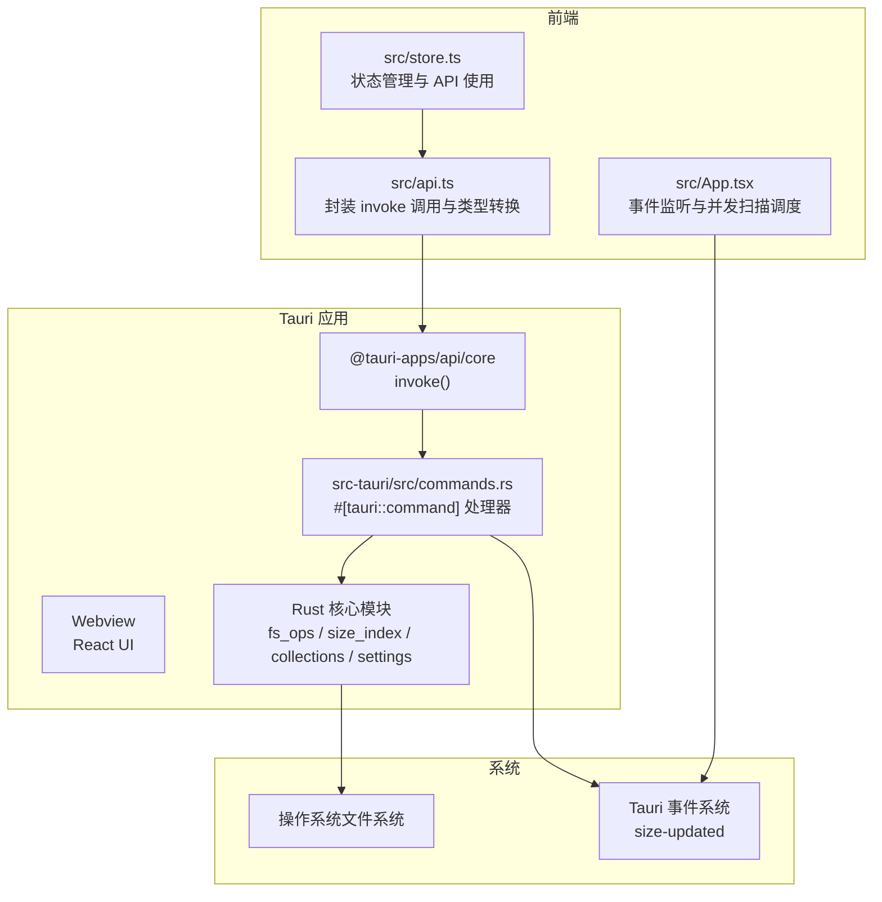
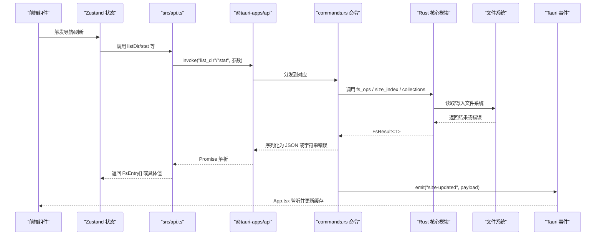
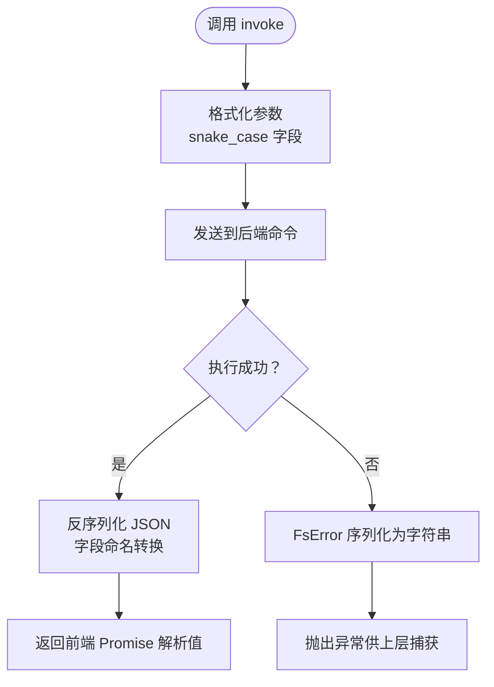
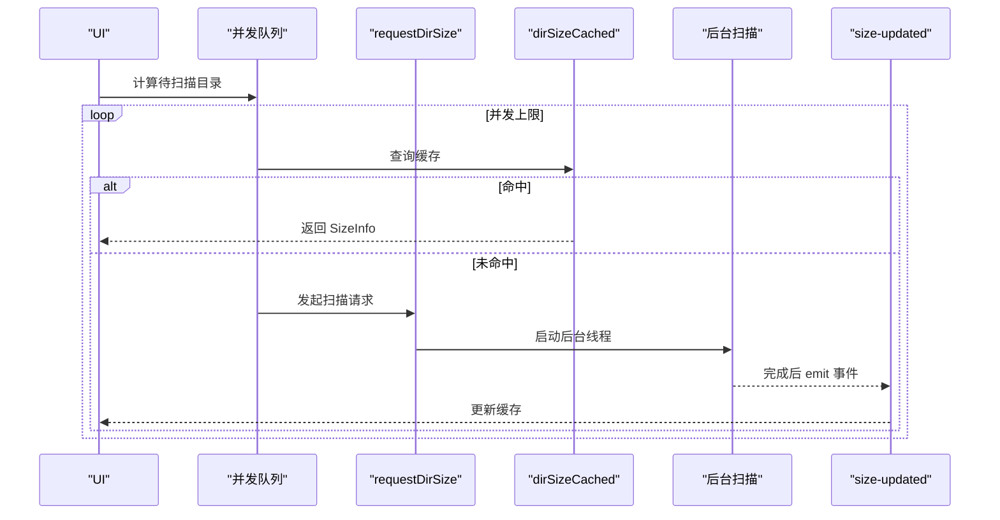
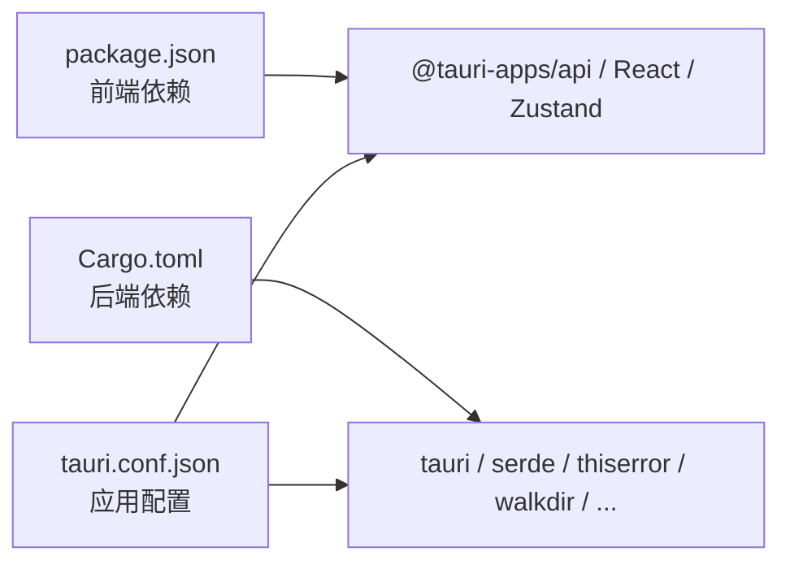

# API 通信层

<cite>
**本文引用的文件**
- [src/api.ts](file://src/api.ts)
- [src-tauri/src/commands.rs](file://src-tauri/src/commands.rs)
- [src-tauri/src/lib.rs](file://src-tauri/src/lib.rs)
- [src-tauri/src/core/fs_ops.rs](file://src-tauri/src/core/fs_ops.rs)
- [src-tauri/src/core/size_index.rs](file://src-tauri/src/core/size_index.rs)
- [src-tauri/src/core/error.rs](file://src-tauri/src/core/error.rs)
- [src-tauri/src/core/collections.rs](file://src-tauri/src/core/collections.rs)
- [src-tauri/src/core/settings.rs](file://src-tauri/src/core/settings.rs)
- [src/App.tsx](file://src/App.tsx)
- [src/store.ts](file://src/store.ts)
- [src/types.ts](file://src/types.ts)
- [package.json](file://package.json)
- [src-tauri/Cargo.toml](file://src-tauri/Cargo.toml)
- [src-tauri/tauri.conf.json](file://src-tauri/tauri.conf.json)
</cite>

## 目录
1. [简介](#简介)
2. [项目结构](#项目结构)
3. [核心组件](#核心组件)
4. [架构总览](#架构总览)
5. [详细组件分析](#详细组件分析)
6. [依赖关系分析](#依赖关系分析)
7. [性能考量](#性能考量)
8. [故障排查指南](#故障排查指南)
9. [结论](#结论)
10. [附录：扩展指南](#附录扩展指南)

## 简介
本文件系统性梳理 LocalBro 的 API 通信层，重点覆盖前端通过 @tauri-apps/api 调用后端 Rust 命令的机制、数据传输格式、类型映射与转换、错误处理策略，并给出新增命令与前端 API 方法的扩展指南。内容面向不同技术背景读者，既提供高层概览也包含代码级细节与可视化图示。

## 项目结构
LocalBro 采用 Tauri 2 双端架构：前端使用 React + Zustand 管理状态，通过 @tauri-apps/api 的 invoke 调用后端命令；后端以 Rust 实现，通过 tauri::command 暴露命令，统一在 lib.rs 中注册到应用生命周期中。

图表来源
- [src/api.ts:1-280](file://src/api.ts#L1-L280)
- [src-tauri/src/commands.rs:1-266](file://src-tauri/src/commands.rs#L1-L266)
- [src-tauri/src/lib.rs:12-65](file://src-tauri/src/lib.rs#L12-L65)
- [src/App.tsx:106-122](file://src/App.tsx#L106-L122)

章节来源
- [src/api.ts:1-280](file://src/api.ts#L1-L280)
- [src-tauri/src/lib.rs:12-65](file://src-tauri/src/lib.rs#L12-L65)
- [src-tauri/tauri.conf.json:1-43](file://src-tauri/tauri.conf.json#L1-L43)

## 核心组件
- 前端 API 封装（src/api.ts）：对 invoke 的统一封装，负责参数格式化、返回值类型转换与错误透传。
- 后端命令处理器（src-tauri/src/commands.rs）：将前端调用映射到 Rust 核心功能，统一返回 FsResult。
- 类型与错误（src/types.ts、src-tauri/src/core/error.rs）：定义 FsEntry、Shortcut、错误枚举等，确保前后端一致的数据契约。
- 并发与缓存（src-tauri/src/core/size_index.rs、src/App.tsx）：目录大小扫描的并发队列与事件驱动更新。
- 状态与使用（src/store.ts）：Zustand 状态集中管理，协调导航、集合、预览等场景下的 API 调用。

章节来源
- [src/api.ts:18-30](file://src/api.ts#L18-L30)
- [src-tauri/src/core/error.rs:7-29](file://src-tauri/src/core/error.rs#L7-L29)
- [src/types.ts:1-37](file://src/types.ts#L1-L37)

## 架构总览
下图展示从前端调用到后端执行再到事件回传的完整链路，以及数据在边界处的命名转换与缓存策略。

图表来源
- [src/api.ts:37-53](file://src/api.ts#L37-L53)
- [src-tauri/src/commands.rs:15-23](file://src-tauri/src/commands.rs#L15-L23)
- [src-tauri/src/core/size_index.rs:86-98](file://src-tauri/src/core/size_index.rs#L86-L98)
- [src/App.tsx:114-122](file://src/App.tsx#L114-L122)

## 详细组件分析

### 1) 前端 API 封装与数据转换
- 类型边界转换：后端默认使用 snake_case 字段名，前端通过 RawEntry 接口接收，再由 normalize 函数映射为 FsEntry（camelCase），保证前端代码一致性。
- 参数格式化：如 listDir 的 options 会将布尔值转换为 snake_case 字段；readTextFile 的 maxBytes 缺省时按后端逻辑设置默认值。
- 返回值处理：多数方法直接返回 invoke 的 Promise；部分方法（如 listDir/stat）在拿到 RawEntry 后进行批量/单个转换。
- 错误透传：invoke 抛出的异常会直接传递给调用方，由上层捕获并显示。

章节来源
- [src/api.ts:4-30](file://src/api.ts#L4-L30)
- [src/api.ts:37-53](file://src/api.ts#L37-L53)
- [src/api.ts:131-136](file://src/api.ts#L131-L136)
- [src/types.ts:3-13](file://src/types.ts#L3-L13)

### 2) 后端命令与核心模块
- 命令注册：lib.rs 在应用启动时将所有 #[tauri::command] 注册到 invoke_handler，前端可直接通过名称调用。
- 文件系统操作：fs_ops 提供 list_dir/stat/parent_of/create_* 等能力，统一返回 FsResult<T>，内部将 std::io::Error 映射为 FsError。
- 目录大小索引：size_index 维护内存缓存与“进行中”集合，支持并发去重与后台扫描，完成后通过 size-updated 事件通知前端。
- 集合与设置：collections 与 settings 提供用户自定义数据持久化，均以 FsResult<T> 作为错误语义。

章节来源
- [src-tauri/src/lib.rs:27-62](file://src-tauri/src/lib.rs#L27-L62)
- [src-tauri/src/commands.rs:15-23](file://src-tauri/src/commands.rs#L15-L23)
- [src-tauri/src/core/fs_ops.rs:140-179](file://src-tauri/src/core/fs_ops.rs#L140-L179)
- [src-tauri/src/core/size_index.rs:41-53](file://src-tauri/src/core/size_index.rs#L41-L53)
- [src-tauri/src/core/error.rs:31-41](file://src-tauri/src/core/error.rs#L31-L41)

### 3) 关键 API 方法详解与参数规范

- 列表与统计
  - listDir(path, options?)：列出目录内容，options 支持 showHidden 与 followSymlinks；返回 FsEntry[]。
  - stat(path)：获取单个条目信息，返回 FsEntry。
  - parentOf(path)：返回父路径字符串。
  - homePath()、defaultShortcuts()、listVolumes()：系统路径与快捷方式查询。

- 文件与目录操作
  - createDirectory(path)、createFile(path)、rename(path, newName)、moveToTrash(path)、deleteForever(path)、copyPath(src, dst)、movePath(src, dst)、revealInNative(path)：幂等与权限相关的操作，统一返回 FsResult。

- 文本文件预览
  - readTextFile(path, maxBytes?)：读取文本文件，返回 content、truncated、total_bytes；maxBytes 默认 1MiB。

- 目录大小索引
  - dirSizeCached(path)：从缓存获取 SizeInfo | null。
  - requestDirSize(path)：若未缓存则触发后台扫描，立即返回 null 或已缓存结果。
  - invalidateDirSize(path)：使缓存失效。

- 集合管理
  - listCollections()、createCollection(name, color?, icon?)、updateCollection(id, patch)、deleteCollection(id)、addToCollection(id, paths)、removeFromCollection(id, paths)、listCollectionEntries(id)：集合的增删改查与成员管理。

- 插件与皮肤包
  - listPacks(kind)、readPackText(kind, id, path)、readPackAsset(kind, id, path)、installPackFromFolder(src)、uninstallPack(kind, id)、packDir(kind)：包的扫描、读取与安装卸载。

- 设置
  - settingsGet(key)、settingsGetAll()、settingsSet(key, value)：键值设置的读取与写入。

章节来源
- [src/api.ts:37-48](file://src/api.ts#L37-L48)
- [src/api.ts:50-53](file://src/api.ts#L50-L53)
- [src/api.ts:55-61](file://src/api.ts#L55-L61)
- [src/api.ts:71-89](file://src/api.ts#L71-L89)
- [src/api.ts:131-136](file://src/api.ts#L131-L136)
- [src/api.ts:111-121](file://src/api.ts#L111-L121)
- [src/api.ts:150-194](file://src/api.ts#L150-L194)
- [src/api.ts:243-265](file://src/api.ts#L243-L265)
- [src/api.ts:269-280](file://src/api.ts#L269-L280)

### 4) 数据转换与验证流程
- 字段命名转换：后端 serde 默认 snake_case，前端 RawEntry 映射到 FsEntry，避免跨边界不一致。
- 参数校验：后端对空路径、不存在路径、非目录等进行校验并返回 FsError；前端收到错误字符串后可直接用于 UI 提示。
- 结果解析：invoke 返回 Promise，成功解析为期望类型；失败抛出异常，由调用方捕获。

图表来源
- [src/api.ts:4-30](file://src/api.ts#L4-L30)
- [src-tauri/src/core/error.rs:43-47](file://src-tauri/src/core/error.rs#L43-L47)

章节来源
- [src/api.ts:4-30](file://src/api.ts#L4-L30)
- [src-tauri/src/core/error.rs:31-41](file://src-tauri/src/core/error.rs#L31-L41)

### 5) 错误处理机制
- 后端错误：FsError 包含多种错误类型（NotFound、PermissionDenied、AlreadyExists、InvalidPath、Io、Unsupported、Internal），统一序列化为字符串返回前端。
- 前端错误：invoke 抛出异常，调用方需在业务层进行 try/catch 并向用户展示友好提示。
- 事件驱动更新：目录大小扫描失败不会影响 UI，前端仅不接收 size-updated 事件，保持界面稳定。

章节来源
- [src-tauri/src/core/error.rs:7-29](file://src-tauri/src/core/error.rs#L7-L29)
- [src-tauri/src/commands.rs:94-102](file://src-tauri/src/commands.rs#L94-L102)
- [src/App.tsx:54-56](file://src/App.tsx#L54-L56)

### 6) 异步操作与并发控制最佳实践
- 并发扫描：App.tsx 中使用并发队列限制同时进行的目录扫描数量，避免资源争用；每个路径独立请求 requestDirSize，失败不影响其他路径。
- 缓存优先：先尝试 dirSizeCached，命中则立即返回；未命中再触发 requestDirSize 并等待 size-updated 事件。
- 事件监听：应用初始化时注册 size-updated 监听器，收到事件后更新本地缓存，避免重复请求。

图表来源
- [src/App.tsx:28-69](file://src/App.tsx#L28-L69)
- [src/api.ts:111-121](file://src/api.ts#L111-L121)
- [src-tauri/src/core/size_index.rs:60-104](file://src-tauri/src/core/size_index.rs#L60-L104)

章节来源
- [src/App.tsx:28-69](file://src/App.tsx#L28-L69)
- [src-tauri/src/core/size_index.rs:60-104](file://src-tauri/src/core/size_index.rs#L60-L104)

## 依赖关系分析
- 前端依赖：@tauri-apps/api 提供 invoke；React/Zustand 提供 UI 与状态；Vite/TypeScript 提供构建与类型检查。
- 后端依赖：tauri、serde、thiserror、trash、dirs、chrono、parking_lot、walkdir 等 crates。
- 配置：package.json 与 Cargo.toml 分别声明前端与后端依赖；tauri.conf.json 配置窗口、安全策略与打包信息。

图表来源
- [package.json:12-26](file://package.json#L12-L26)
- [src-tauri/Cargo.toml:17-27](file://src-tauri/Cargo.toml#L17-L27)
- [src-tauri/tauri.conf.json:1-43](file://src-tauri/tauri.conf.json#L1-L43)

章节来源
- [package.json:12-26](file://package.json#L12-L26)
- [src-tauri/Cargo.toml:17-27](file://src-tauri/Cargo.toml#L17-L27)
- [src-tauri/tauri.conf.json:1-43](file://src-tauri/tauri.conf.json#L1-L43)

## 性能考量
- 目录扫描：使用 walkdir 迭代器过滤文件类型，避免不必要的元数据读取；并发队列限制同时扫描数，防止 UI 卡顿。
- 缓存策略：SizeIndex 内存缓存 + “进行中”集合去重，减少重复计算与网络压力。
- 错误短路：不可达路径或权限不足时快速返回错误，避免无谓的 IO 开销。
- 事件驱动：通过 size-updated 事件批量更新，降低轮询成本。

## 故障排查指南
- 常见错误类型（后端）：路径不存在、权限不足、路径已存在、无效路径、IO 错误、不支持的操作、内部错误。前端收到字符串错误后可直接展示。
- 前端捕获：在 store.ts 与组件中对 API 调用进行 try/catch，并设置 error 状态或弹窗提示。
- 目录大小未更新：确认 size-updated 事件是否被监听；检查 requestDirSize 是否返回 null（表示正在后台扫描）；必要时调用 invalidateDirSize 清除缓存后重试。
- 文件预览过大：适当调整 readTextFile 的 maxBytes 参数，避免一次性加载过多内容。

章节来源
- [src-tauri/src/core/error.rs:7-29](file://src-tauri/src/core/error.rs#L7-L29)
- [src/store.ts:97-110](file://src/store.ts#L97-L110)
- [src-tauri/src/commands.rs:94-102](file://src-tauri/src/commands.rs#L94-L102)

## 结论
LocalBro 的 API 通信层以 Tauri 命令为核心，结合 Rust 的强类型与错误模型、前端的 invoke 封装与状态管理，实现了高效、可维护且跨平台的文件浏览体验。通过缓存与事件驱动的并发扫描，系统在复杂场景下仍能保持流畅；清晰的错误语义与边界转换为扩展与维护提供了坚实基础。

## 附录：扩展指南

### 如何新增一个后端命令
1. 在 src-tauri/src/commands.rs 中添加 #[tauri::command] 函数，签名遵循 invoke 的参数与返回类型要求。
2. 在 src-tauri/src/lib.rs 的 invoke_handler 中注册新命令。
3. 若需要共享状态（如 Arc<SizeIndex>），通过 State<'_, T> 获取。
4. 返回 FsResult<T>，确保错误会被序列化为字符串返回前端。

章节来源
- [src-tauri/src/commands.rs:15-23](file://src-tauri/src/commands.rs#L15-L23)
- [src-tauri/src/lib.rs:27-62](file://src-tauri/src/lib.rs#L27-L62)

### 如何在前端添加对应的 API 方法
1. 在 src/api.ts 中新增函数，使用 invoke("your_command", params)。
2. 对于返回 FsEntry 的命令，使用 RawEntry 接口接收并调用 normalize 转换。
3. 对于列表类命令，返回 T[] 并在调用后 map(normalize)。
4. 对于文本预览等特殊场景，按现有模式（如 readTextFile）设计参数与返回体。

章节来源
- [src/api.ts:37-53](file://src/api.ts#L37-L53)
- [src/api.ts:131-136](file://src/api.ts#L131-L136)

### 数据类型与字段命名约定
- 后端 serde 默认 snake_case，前端统一转换为 camelCase。
- 错误统一使用 FsError，前端收到字符串形式的错误描述。
- 日期时间统一为毫秒级 Unix 时间戳。

章节来源
- [src/api.ts:4-30](file://src/api.ts#L4-L30)
- [src-tauri/src/core/error.rs:43-47](file://src-tauri/src/core/error.rs#L43-L47)