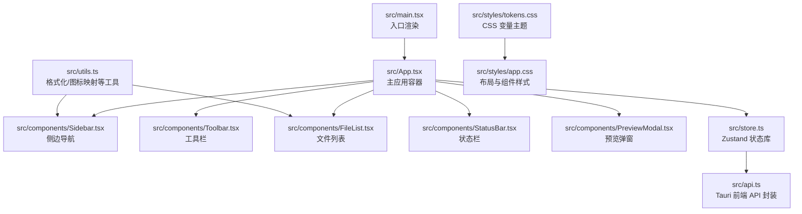
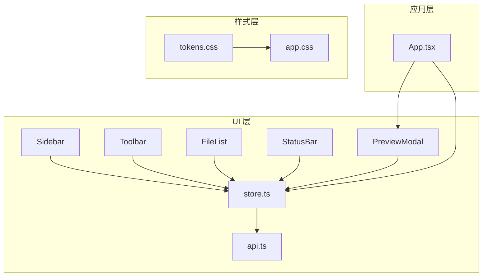
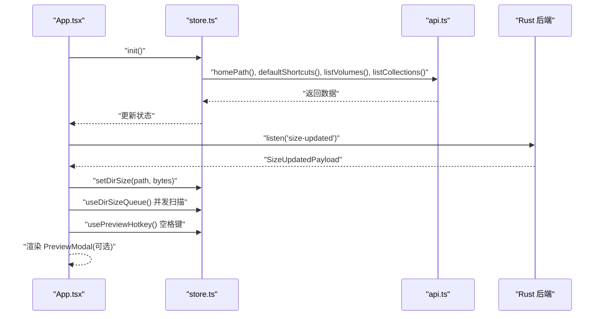
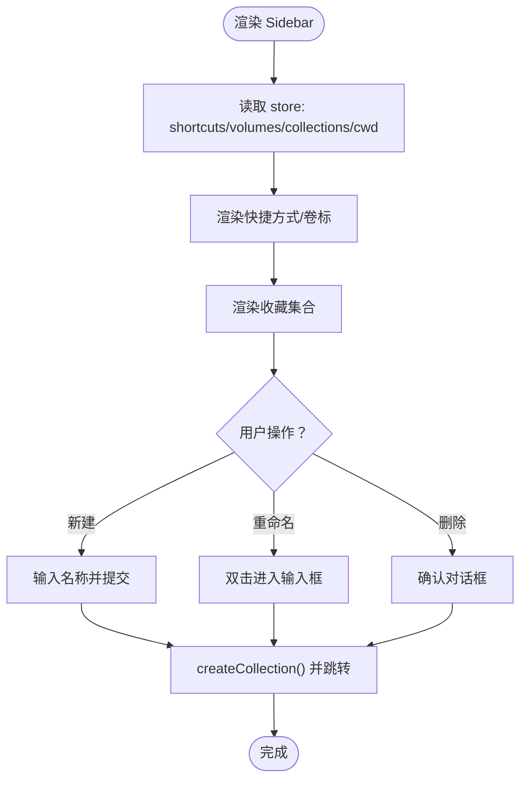
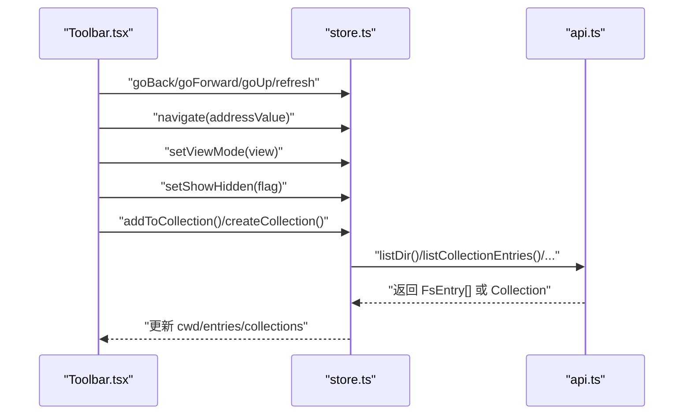
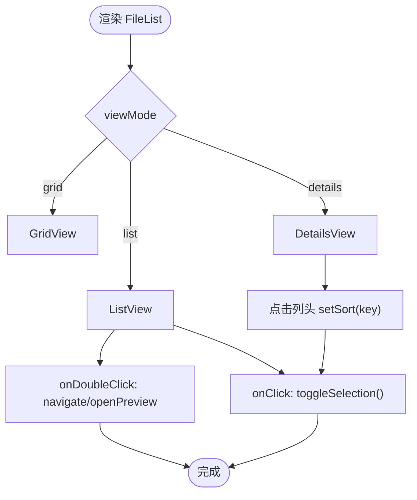
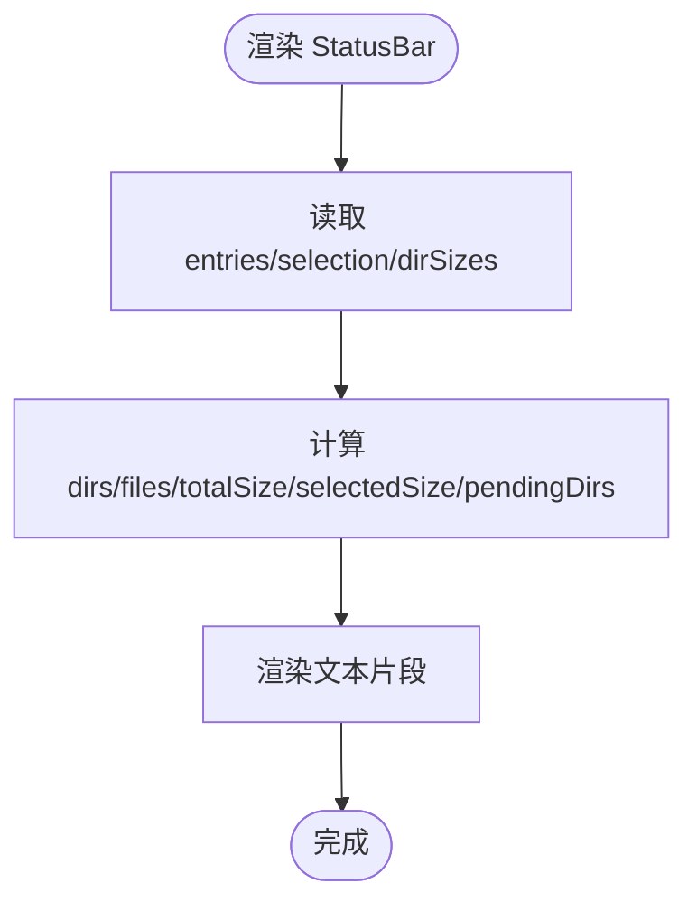
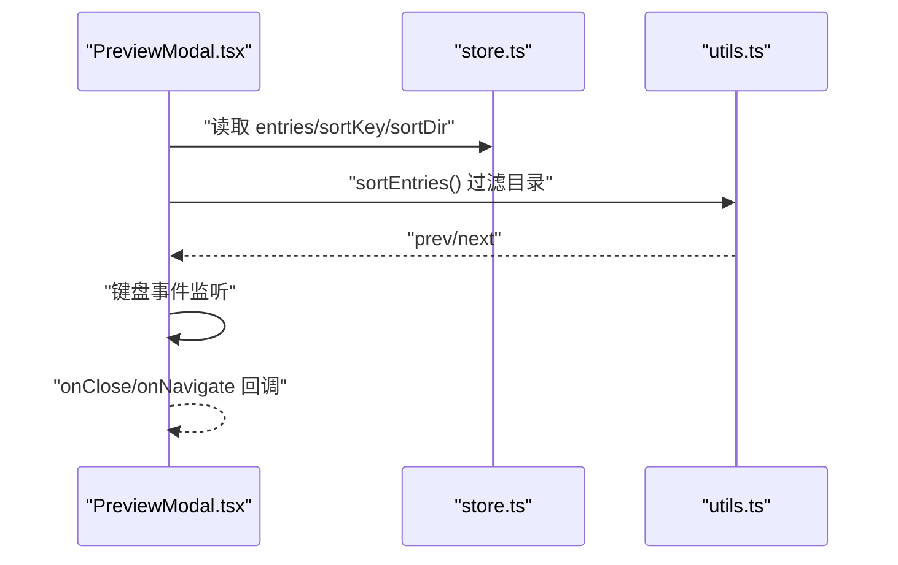
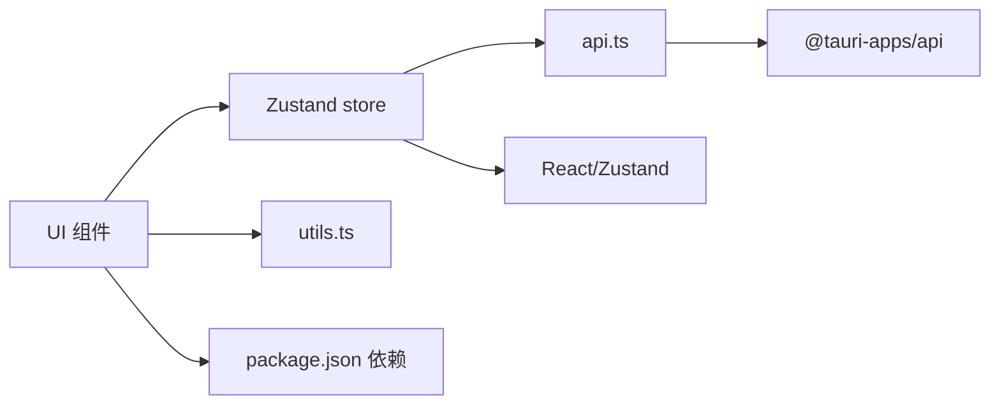

# React 组件体系

<cite>
**本文引用的文件**
- [src/App.tsx](file://src/App.tsx)
- [src/components/Sidebar.tsx](file://src/components/Sidebar.tsx)
- [src/components/Toolbar.tsx](file://src/components/Toolbar.tsx)
- [src/components/FileList.tsx](file://src/components/FileList.tsx)
- [src/components/StatusBar.tsx](file://src/components/StatusBar.tsx)
- [src/components/PreviewModal.tsx](file://src/components/PreviewModal.tsx)
- [src/store.ts](file://src/store.ts)
- [src/types.ts](file://src/types.ts)
- [src/utils.ts](file://src/utils.ts)
- [src/api.ts](file://src/api.ts)
- [src/main.tsx](file://src/main.tsx)
- [src/styles/app.css](file://src/styles/app.css)
- [src/styles/tokens.css](file://src/styles/tokens.css)
- [package.json](file://package.json)
- [README.md](file://README.md)
</cite>

## 目录
1. [简介](#简介)
2. [项目结构](#项目结构)
3. [核心组件](#核心组件)
4. [架构总览](#架构总览)
5. [组件详解](#组件详解)
6. [依赖关系分析](#依赖关系分析)
7. [性能与可维护性](#性能与可维护性)
8. [故障排查指南](#故障排查指南)
9. [结论](#结论)
10. [附录](#附录)

## 简介
本文件系统化梳理 LocalBro 的 React 组件体系，围绕主应用组件 App.tsx 与其子组件 Sidebar、Toolbar、FileList、StatusBar 的组织方式与交互机制展开，重点说明：
- 组件层次与职责划分：Sidebar 导航与收藏夹；FileList 文件展示与交互；Toolbar 工具栏与地址栏；StatusBar 状态统计；PreviewModal 预览弹窗。
- 状态共享与通信：通过 Zustand store（useBrowser）集中管理状态，子组件以 hooks 方式读取/派发动作。
- 生命周期与事件绑定：键盘快捷键、窗口事件监听、目录大小扫描队列等。
- 扩展与解耦建议：如何在不破坏现有契约的前提下扩展功能。

## 项目结构
项目采用“按功能模块分层”的组织方式，前端 React 层位于 src 目录，核心状态与数据访问由 store.ts 与 api.ts 提供，样式通过 tokens.css 与 app.css 管控主题与布局。

图表来源
- [src/main.tsx:1-12](file://src/main.tsx#L1-L12)
- [src/App.tsx:100-140](file://src/App.tsx#L100-L140)
- [src/components/Sidebar.tsx:19-200](file://src/components/Sidebar.tsx#L19-L200)
- [src/components/Toolbar.tsx:6-216](file://src/components/Toolbar.tsx#L6-L216)
- [src/components/FileList.tsx:42-173](file://src/components/FileList.tsx#L42-L173)
- [src/components/StatusBar.tsx:4-38](file://src/components/StatusBar.tsx#L4-L38)
- [src/components/PreviewModal.tsx:13-83](file://src/components/PreviewModal.tsx#L13-L83)
- [src/store.ts:73-263](file://src/store.ts#L73-L263)
- [src/api.ts:1-195](file://src/api.ts#L1-L195)
- [src/utils.ts:1-66](file://src/utils.ts#L1-L66)
- [src/styles/tokens.css:1-79](file://src/styles/tokens.css#L1-L79)
- [src/styles/app.css:1-651](file://src/styles/app.css#L1-L651)

章节来源
- [src/main.tsx:1-12](file://src/main.tsx#L1-L12)
- [src/App.tsx:100-140](file://src/App.tsx#L100-L140)
- [src/styles/app.css:50-61](file://src/styles/app.css#L50-L61)
- [src/styles/tokens.css:53-57](file://src/styles/tokens.css#L53-L57)

## 核心组件
- App.tsx：应用根容器，负责初始化、事件监听、并发目录大小扫描队列、空格键预览快捷键、以及根据状态渲染 PreviewModal。
- Sidebar.tsx：侧边导航与收藏夹，支持收藏项增删改、卷标浏览、当前路径高亮。
- Toolbar.tsx：工具栏，含后退/前进/上一级/刷新、地址栏（可编辑）、视图切换、隐藏文件开关、选择项集合操作菜单。
- FileList.tsx：文件列表展示，支持列表/网格/详情三种视图，行级点击/双击行为，排序与尺寸显示。
- StatusBar.tsx：状态栏，显示目录/文件数量、总大小、待计算目录数、选中项统计。
- PreviewModal.tsx：预览弹窗，基于适配器渲染不同类型的文件内容，支持左右导航与 Esc/Space 关闭。

章节来源
- [src/App.tsx:100-140](file://src/App.tsx#L100-L140)
- [src/components/Sidebar.tsx:19-200](file://src/components/Sidebar.tsx#L19-L200)
- [src/components/Toolbar.tsx:6-216](file://src/components/Toolbar.tsx#L6-L216)
- [src/components/FileList.tsx:42-173](file://src/components/FileList.tsx#L42-L173)
- [src/components/StatusBar.tsx:4-38](file://src/components/StatusBar.tsx#L4-L38)
- [src/components/PreviewModal.tsx:13-83](file://src/components/PreviewModal.tsx#L13-L83)

## 架构总览
整体采用“容器组件 + 展示组件 + 状态库”的模式：
- 容器组件：App.tsx 负责顶层逻辑与事件绑定。
- 展示组件：Sidebar/Toolbar/FileList/StatusBar/PreviewModal 各司其职，只负责 UI 渲染与用户交互。
- 状态库：Zustand store（useBrowser）集中管理状态与动作，组件通过 hooks 访问。
- 数据访问：api.ts 封装 Tauri 命令调用，统一返回类型转换。

图表来源
- [src/App.tsx:100-140](file://src/App.tsx#L100-L140)
- [src/components/Sidebar.tsx:19-200](file://src/components/Sidebar.tsx#L19-L200)
- [src/components/Toolbar.tsx:6-216](file://src/components/Toolbar.tsx#L6-L216)
- [src/components/FileList.tsx:42-173](file://src/components/FileList.tsx#L42-L173)
- [src/components/StatusBar.tsx:4-38](file://src/components/StatusBar.tsx#L4-L38)
- [src/components/PreviewModal.tsx:13-83](file://src/components/PreviewModal.tsx#L13-L83)
- [src/store.ts:73-263](file://src/store.ts#L73-L263)
- [src/api.ts:1-195](file://src/api.ts#L1-L195)
- [src/styles/tokens.css:1-79](file://src/styles/tokens.css#L1-L79)
- [src/styles/app.css:1-651](file://src/styles/app.css#L1-L651)

## 组件详解

### App.tsx：应用容器与顶层逻辑
- 初始化：启动时加载默认快捷方式、卷标与集合，并跳转至用户主目录。
- 事件监听：订阅后端 size-updated 事件，更新目录大小缓存。
- 并发扫描队列：对未计算的目录发起请求，限制并发度，避免阻塞。
- 快捷键：空格键打开当前焦点文件的预览；若已打开则交由弹窗处理关闭。
- 预览弹窗：根据当前预览路径决定是否渲染 PreviewModal，并传入导航回调。

图表来源
- [src/App.tsx:108-116](file://src/App.tsx#L108-L116)
- [src/App.tsx:23-63](file://src/App.tsx#L23-L63)
- [src/App.tsx:66-98](file://src/App.tsx#L66-L98)
- [src/store.ts:97-136](file://src/store.ts#L97-L136)
- [src/api.ts:103-121](file://src/api.ts#L103-L121)

章节来源
- [src/App.tsx:100-140](file://src/App.tsx#L100-L140)
- [src/store.ts:97-136](file://src/store.ts#L97-L136)
- [src/api.ts:103-121](file://src/api.ts#L103-L121)

### Sidebar.tsx：导航与收藏夹
- 职责：展示快捷方式、卷标、用户收藏集合；支持新建/重命名/删除集合；点击切换路径。
- 交互：点击激活项高亮；双击进入重命名输入框；确认删除前二次确认。
- 状态：通过 useBrowser 读取 shortcuts/volumes/collections/cwd/navigate 等。

图表来源
- [src/components/Sidebar.tsx:19-200](file://src/components/Sidebar.tsx#L19-L200)
- [src/store.ts:211-234](file://src/store.ts#L211-L234)

章节来源
- [src/components/Sidebar.tsx:19-200](file://src/components/Sidebar.tsx#L19-L200)
- [src/store.ts:211-234](file://src/store.ts#L211-L234)

### Toolbar.tsx：工具栏与地址栏
- 职责：导航按钮、地址栏（可编辑）、视图切换、隐藏文件开关、选择项集合操作菜单。
- 地址栏：双击进入编辑模式，回车或失焦提交；Windows/Linux 路径段解析。
- 选择项菜单：批量添加到集合、新建集合、从当前集合移除。
- 视图切换：list/grid/details 三态切换。

图表来源
- [src/components/Toolbar.tsx:6-216](file://src/components/Toolbar.tsx#L6-L216)
- [src/store.ts:112-170](file://src/store.ts#L112-L170)
- [src/store.ts:243-262](file://src/store.ts#L243-L262)
- [src/api.ts:37-48](file://src/api.ts#L37-L48)
- [src/api.ts:191-194](file://src/api.ts#L191-L194)

章节来源
- [src/components/Toolbar.tsx:6-216](file://src/components/Toolbar.tsx#L6-L216)
- [src/store.ts:112-170](file://src/store.ts#L112-L170)
- [src/store.ts:243-262](file://src/store.ts#L243-L262)
- [src/api.ts:37-48](file://src/api.ts#L37-L48)
- [src/api.ts:191-194](file://src/api.ts#L191-L194)

### FileList.tsx：文件列表与交互
- 职责：根据当前视图模式渲染列表/网格/详情；处理单击/双击；显示排序列头与排序指示器。
- 交互：单击切换选择（支持 Ctrl/Cmd 多选）；双击进入目录或打开预览。
- 排序：按 name/size/modified/kind 排序，目录优先于文件。
- 尺寸：目录使用索引缓存值，文件使用实际 size。

图表来源
- [src/components/FileList.tsx:42-173](file://src/components/FileList.tsx#L42-L173)
- [src/store.ts:278-307](file://src/store.ts#L278-L307)
- [src/utils.ts:53-65](file://src/utils.ts#L53-L65)

章节来源
- [src/components/FileList.tsx:42-173](file://src/components/FileList.tsx#L42-L173)
- [src/store.ts:278-307](file://src/store.ts#L278-L307)
- [src/utils.ts:53-65](file://src/utils.ts#L53-L65)

### StatusBar.tsx：状态统计
- 职责：统计目录/文件数量、总大小、待计算目录数；选中项统计。
- 计算：目录大小来自缓存，文件大小来自 entry.size；未计算目录计数用于提示。

图表来源
- [src/components/StatusBar.tsx:4-38](file://src/components/StatusBar.tsx#L4-L38)
- [src/store.ts:16-41](file://src/store.ts#L16-L41)

章节来源
- [src/components/StatusBar.tsx:4-38](file://src/components/StatusBar.tsx#L4-L38)
- [src/store.ts:16-41](file://src/store.ts#L16-L41)

### PreviewModal.tsx：预览弹窗
- 职责：根据文件类型选择适配器渲染内容；支持左右箭头在同级文件间导航；Esc/Space 关闭。
- 交互：键盘事件监听；点击遮罩层关闭；按钮触发上一个/下一个。
- 数据：从 store 获取 entries、排序键与方向，计算前后项。

图表来源
- [src/components/PreviewModal.tsx:13-83](file://src/components/PreviewModal.tsx#L13-L83)
- [src/store.ts:278-307](file://src/store.ts#L278-L307)
- [src/utils.ts:53-65](file://src/utils.ts#L53-L65)

章节来源
- [src/components/PreviewModal.tsx:13-83](file://src/components/PreviewModal.tsx#L13-L83)
- [src/store.ts:278-307](file://src/store.ts#L278-L307)
- [src/utils.ts:53-65](file://src/utils.ts#L53-L65)

## 依赖关系分析
- 组件依赖：各子组件均依赖 store.ts 中的 useBrowser hook；FileList 依赖 utils.ts 的图标与格式化函数；App.tsx 依赖 api.ts 与 PreviewModal。
- 状态依赖：Sidebar/Toolbar/FileList/StatusBar/PreviewModal 全部通过 useBrowser 访问状态与动作。
- 外部依赖：@tauri-apps/api 用于事件监听与命令调用；zustand 作为状态库；React 生态。

图表来源
- [src/components/Sidebar.tsx:19-200](file://src/components/Sidebar.tsx#L19-L200)
- [src/components/Toolbar.tsx:6-216](file://src/components/Toolbar.tsx#L6-L216)
- [src/components/FileList.tsx:42-173](file://src/components/FileList.tsx#L42-L173)
- [src/components/StatusBar.tsx:4-38](file://src/components/StatusBar.tsx#L4-L38)
- [src/components/PreviewModal.tsx:13-83](file://src/components/PreviewModal.tsx#L13-L83)
- [src/store.ts:73-263](file://src/store.ts#L73-L263)
- [src/utils.ts:1-66](file://src/utils.ts#L1-L66)
- [src/api.ts:1-195](file://src/api.ts#L1-L195)
- [package.json:12-26](file://package.json#L12-L26)

章节来源
- [package.json:12-26](file://package.json#L12-L26)
- [src/store.ts:73-263](file://src/store.ts#L73-L263)
- [src/api.ts:1-195](file://src/api.ts#L1-L195)

## 性能与可维护性
- 并发控制：App.tsx 中目录大小扫描队列限制并发，避免过多 I/O 并发导致卡顿。
- 惰性渲染：FileList 根据 viewMode 条件渲染不同视图；StatusBar 仅在有选中项时显示选中统计。
- 状态粒度：store 将导航历史、选择集、排序键、目录大小缓存等拆分为独立字段，便于局部更新。
- 类型安全：types.ts 定义 FsEntry/Shortcut/ViewMode/SortKey 等，配合 api.ts 的返回类型转换，减少运行时错误。
- 可扩展性：PreviewModal 通过适配器机制支持新增文件类型预览；Sidebar/Toolbar 的动作均可通过 store 新增。

[本节为通用建议，无需特定文件引用]

## 故障排查指南
- 预览无法打开
  - 检查是否有可用的适配器；确认 entry.kind 与扩展名映射是否覆盖目标文件类型。
  - 确认 PreviewModal 的 onNavigate 回调是否正确传入。
- 目录大小未更新
  - 确认后端是否发出 size-updated 事件；检查 App.tsx 的事件监听与 store.setDirSize 是否被调用。
- 列表空白或加载失败
  - 查看 store 的 error 字段；确认 Toolbar 的地址栏是否处于编辑状态；尝试刷新。
- 收藏集操作失败
  - 确认网络/权限；查看控制台错误日志；确认 collectionId 正确。

章节来源
- [src/components/PreviewModal.tsx:13-83](file://src/components/PreviewModal.tsx#L13-L83)
- [src/App.tsx:108-116](file://src/App.tsx#L108-L116)
- [src/store.ts:16-41](file://src/store.ts#L16-L41)
- [src/store.ts:211-234](file://src/store.ts#L211-L234)

## 结论
LocalBro 的组件体系以 App.tsx 为核心容器，通过 Zustand store 实现清晰的状态与动作分离，Sidebar/Toolbar/FileList/StatusBar 各司其职，配合 PreviewModal 提供一致的文件浏览体验。该设计具备良好的可扩展性与可维护性，适合进一步引入更多文件类型预览、插件化适配器与更丰富的集合管理能力。

[本节为总结，无需特定文件引用]

## 附录

### 组件职责与接口概览
- Sidebar：导航与收藏夹管理
  - 读取：shortcuts/volumes/collections/cwd
  - 动作：navigate/createCollection/deleteCollection/renameCollection
- Toolbar：工具栏与地址栏
  - 读取：cwd/history/historyIdx/viewMode/showHidden/selection/collections
  - 动作：goBack/goForward/goUp/refresh/navigate/setViewMode/setShowHidden/addToCollection/removeFromCollection/createCollection
- FileList：文件展示与交互
  - 读取：entries/loading/error/viewMode/selection/sortKey/sortDir/dirSizes
  - 动作：toggleSelection/navigate/openPreview
- StatusBar：状态统计
  - 读取：entries/selection/dirSizes
- PreviewModal：预览弹窗
  - 读取：entries/sortKey/sortDir
  - 动作：onClose/onNavigate

章节来源
- [src/components/Sidebar.tsx:19-200](file://src/components/Sidebar.tsx#L19-L200)
- [src/components/Toolbar.tsx:6-216](file://src/components/Toolbar.tsx#L6-L216)
- [src/components/FileList.tsx:42-173](file://src/components/FileList.tsx#L42-L173)
- [src/components/StatusBar.tsx:4-38](file://src/components/StatusBar.tsx#L4-L38)
- [src/components/PreviewModal.tsx:13-83](file://src/components/PreviewModal.tsx#L13-L83)
- [src/store.ts:16-71](file://src/store.ts#L16-L71)

### 样式与主题
- tokens.css：定义颜色、间距、圆角、字体、布局尺寸等 CSS 变量。
- app.css：基于 tokens.css 的组件样式与网格布局，定义 Sidebar/Toolbar/Main/Statusbar/PreviewModal 的视觉规范。

章节来源
- [src/styles/tokens.css:1-79](file://src/styles/tokens.css#L1-L79)
- [src/styles/app.css:1-651](file://src/styles/app.css#L1-L651)

### 技术栈与脚手架
- React 19、TypeScript、Vite、@tauri-apps/api、zustand
- README 提供 VS Code 与 Tauri 插件推荐

章节来源
- [package.json:12-26](file://package.json#L12-L26)
- [README.md:1-8](file://README.md#L1-L8)