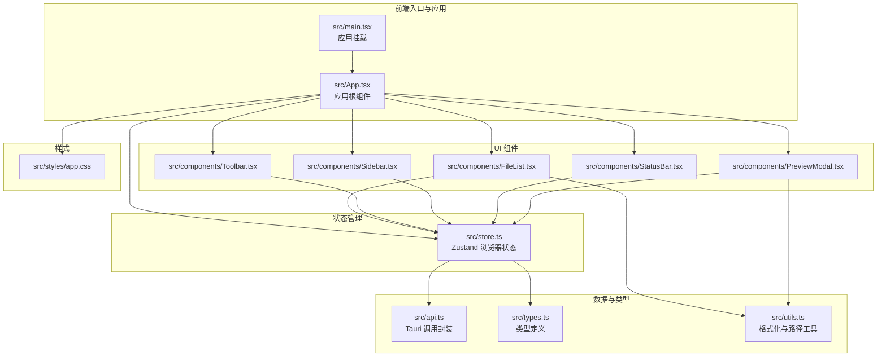
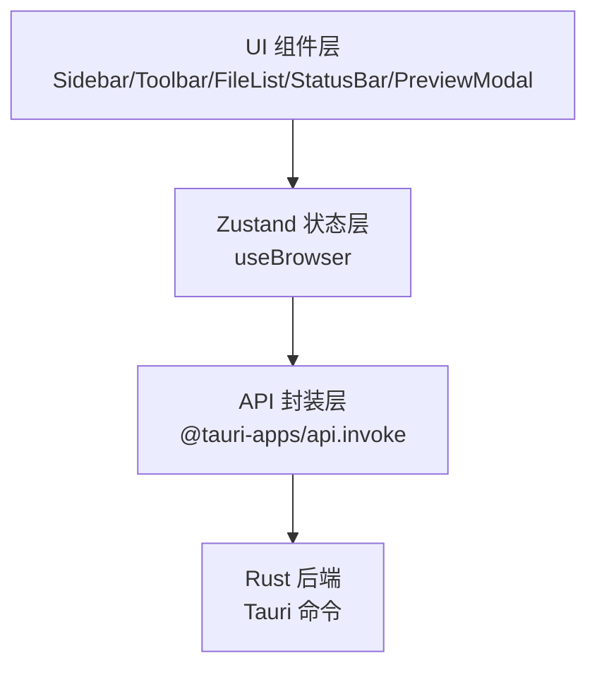
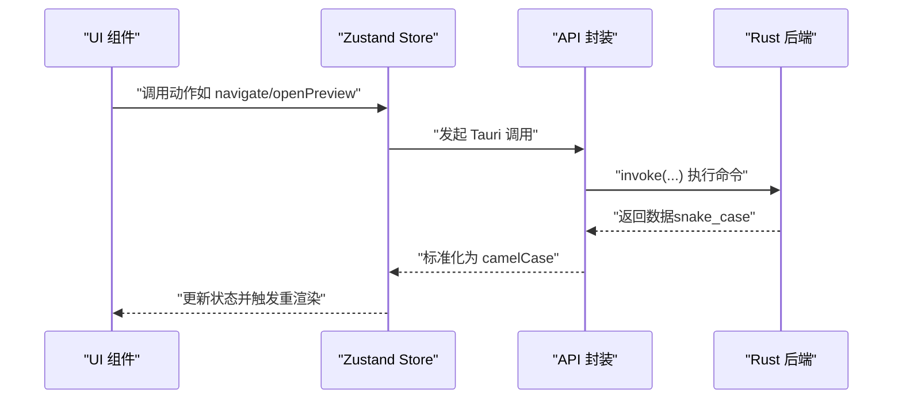
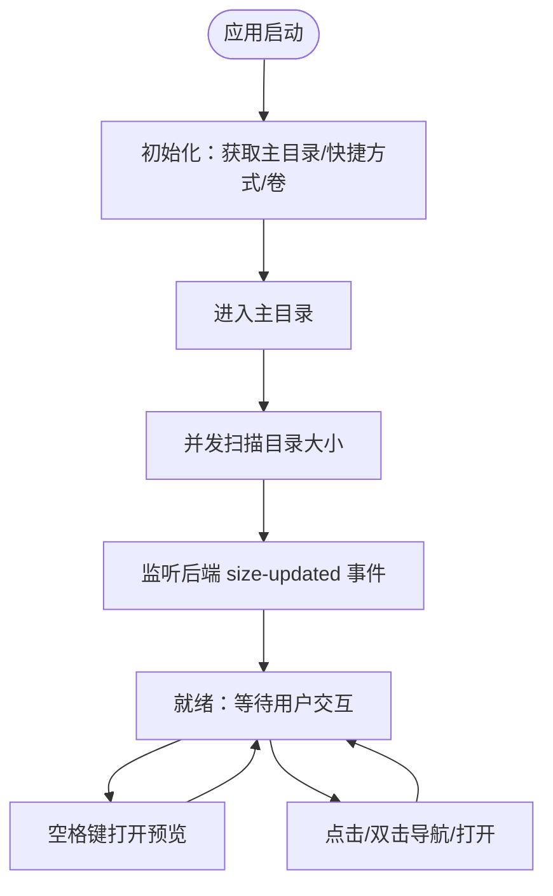
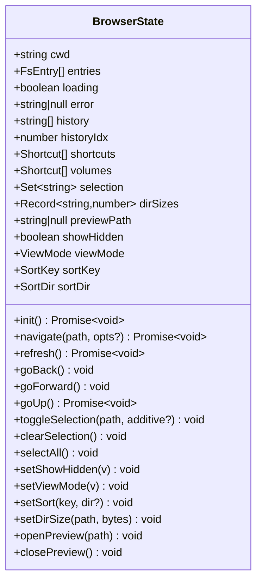
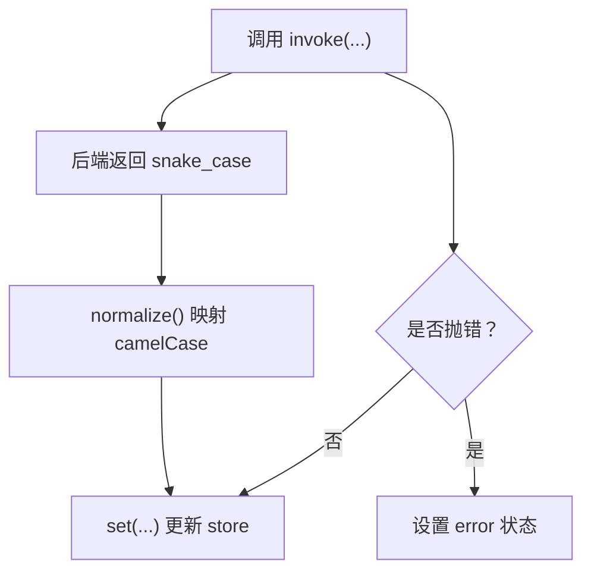
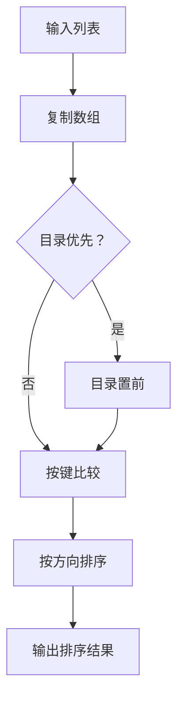
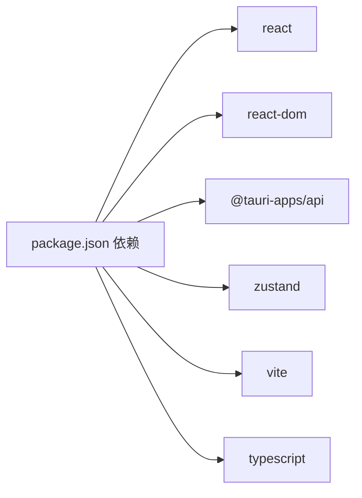

# 前端系统

<cite>
**本文引用的文件**
- [src/main.tsx](file://src/main.tsx)
- [src/App.tsx](file://src/App.tsx)
- [src/store.ts](file://src/store.ts)
- [src/api.ts](file://src/api.ts)
- [src/types.ts](file://src/types.ts)
- [src/utils.ts](file://src/utils.ts)
- [src/components/Sidebar.tsx](file://src/components/Sidebar.tsx)
- [src/components/Toolbar.tsx](file://src/components/Toolbar.tsx)
- [src/components/FileList.tsx](file://src/components/FileList.tsx)
- [src/components/StatusBar.tsx](file://src/components/StatusBar.tsx)
- [src/components/PreviewModal.tsx](file://src/components/PreviewModal.tsx)
- [src/styles/app.css](file://src/styles/app.css)
- [package.json](file://package.json)
- [README.md](file://README.md)
</cite>

## 目录
1. [简介](#简介)
2. [项目结构](#项目结构)
3. [核心组件](#核心组件)
4. [架构总览](#架构总览)
5. [详细组件分析](#详细组件分析)
6. [依赖关系分析](#依赖关系分析)
7. [性能考量](#性能考量)
8. [故障排查指南](#故障排查指南)
9. [结论](#结论)
10. [附录](#附录)

## 简介
本文件面向 LocalBro 前端系统，系统采用 React + TypeScript + Vite 构建，结合 Tauri 提供桌面端能力，使用 Zustand 进行状态管理，通过 @tauri-apps/api 与后端 Rust 能力进行通信。本文档从组件体系、状态管理、API 层、生命周期与交互处理等方面进行全面解析，并提供扩展与自定义建议。

## 项目结构
前端源码位于 src 目录，主要由入口、应用根组件、状态管理、API 适配层、通用工具、组件与样式组成；同时包含 Tauri 后端工程（src-tauri）及构建配置。

图表来源
- [src/main.tsx:1-12](file://src/main.tsx#L1-L12)
- [src/App.tsx:100-140](file://src/App.tsx#L100-L140)
- [src/store.ts:53-194](file://src/store.ts#L53-L194)
- [src/api.ts:1-137](file://src/api.ts#L1-L137)
- [src/types.ts:1-37](file://src/types.ts#L1-L37)
- [src/utils.ts:1-66](file://src/utils.ts#L1-L66)
- [src/components/Sidebar.tsx:1-75](file://src/components/Sidebar.tsx#L1-L75)
- [src/components/Toolbar.tsx:1-113](file://src/components/Toolbar.tsx#L1-L113)
- [src/components/FileList.tsx:1-173](file://src/components/FileList.tsx#L1-L173)
- [src/components/StatusBar.tsx:1-38](file://src/components/StatusBar.tsx#L1-L38)
- [src/components/PreviewModal.tsx:1-83](file://src/components/PreviewModal.tsx#L1-L83)
- [src/styles/app.css:1-513](file://src/styles/app.css#L1-L513)

章节来源
- [src/main.tsx:1-12](file://src/main.tsx#L1-L12)
- [src/App.tsx:100-140](file://src/App.tsx#L100-L140)
- [src/store.ts:53-194](file://src/store.ts#L53-L194)
- [src/api.ts:1-137](file://src/api.ts#L1-L137)
- [src/types.ts:1-37](file://src/types.ts#L1-L37)
- [src/utils.ts:1-66](file://src/utils.ts#L1-L66)
- [src/components/Sidebar.tsx:1-75](file://src/components/Sidebar.tsx#L1-L75)
- [src/components/Toolbar.tsx:1-113](file://src/components/Toolbar.tsx#L1-L113)
- [src/components/FileList.tsx:1-173](file://src/components/FileList.tsx#L1-L173)
- [src/components/StatusBar.tsx:1-38](file://src/components/StatusBar.tsx#L1-L38)
- [src/components/PreviewModal.tsx:1-83](file://src/components/PreviewModal.tsx#L1-L83)
- [src/styles/app.css:1-513](file://src/styles/app.css#L1-L513)

## 核心组件
- 应用入口与挂载：在入口文件中渲染根组件，并引入全局样式。
- 应用根组件：负责初始化、事件监听、并发目录大小扫描队列、快捷键预览、以及组合子组件。
- 状态管理：以 Zustand store 暴露浏览器浏览状态与动作，集中管理当前目录、条目列表、历史、选择集、排序、视图模式、隐藏文件显示、目录大小缓存、预览路径等。
- API 适配层：对 @tauri-apps/api.invoke 的封装，统一请求参数与返回值的命名转换（snake_case 到 camelCase），并提供目录、文件、预览相关接口。
- 工具函数：提供尺寸格式化、日期格式化、路径分段、图标映射等。
- 组件体系：侧边栏、工具栏、文件列表（三种视图）、状态栏、预览模态框。

章节来源
- [src/main.tsx:1-12](file://src/main.tsx#L1-L12)
- [src/App.tsx:100-140](file://src/App.tsx#L100-L140)
- [src/store.ts:53-194](file://src/store.ts#L53-L194)
- [src/api.ts:18-53](file://src/api.ts#L18-L53)
- [src/utils.ts:1-66](file://src/utils.ts#L1-L66)
- [src/components/Sidebar.tsx:1-75](file://src/components/Sidebar.tsx#L1-L75)
- [src/components/Toolbar.tsx:1-113](file://src/components/Toolbar.tsx#L1-L113)
- [src/components/FileList.tsx:1-173](file://src/components/FileList.tsx#L1-L173)
- [src/components/StatusBar.tsx:1-38](file://src/components/StatusBar.tsx#L1-L38)
- [src/components/PreviewModal.tsx:1-83](file://src/components/PreviewModal.tsx#L1-L83)

## 架构总览
前端采用“组件 + Zustand 状态 + API 封装”的分层架构。组件仅负责 UI 与交互，状态集中在 store 中，API 层负责与后端通信并做数据转换。

图表来源
- [src/App.tsx:100-140](file://src/App.tsx#L100-L140)
- [src/store.ts:53-194](file://src/store.ts#L53-L194)
- [src/api.ts:1-137](file://src/api.ts#L1-L137)

## 详细组件分析

### 组件层次与职责
- Sidebar：展示快捷方式与卷，响应点击导航。
- Toolbar：提供前进/后退/上一级/刷新、地址栏编辑、视图切换、显示隐藏文件开关。
- FileList：根据视图模式渲染列表/网格/详情，支持多选、双击打开或预览。
- StatusBar：统计目录/文件数量、总大小、选中项统计与未计算目录数提示。
- PreviewModal：基于适配器渲染文本、图片、音视频、PDF 等内容，支持键盘左右导航与 Esc 关闭。

章节来源
- [src/components/Sidebar.tsx:1-75](file://src/components/Sidebar.tsx#L1-L75)
- [src/components/Toolbar.tsx:1-113](file://src/components/Toolbar.tsx#L1-L113)
- [src/components/FileList.tsx:1-173](file://src/components/FileList.tsx#L1-L173)
- [src/components/StatusBar.tsx:1-38](file://src/components/StatusBar.tsx#L1-L38)
- [src/components/PreviewModal.tsx:1-83](file://src/components/PreviewModal.tsx#L1-L83)

### 组件间通信机制
- 单向数据流：组件通过 useBrowser 订阅状态片段，调用 store 内的动作修改状态。
- 事件驱动：应用根组件监听后端事件，更新目录大小缓存。
- 预览联动：FileList 与 PreviewModal 通过 store 的 previewPath 与 entries 协作，实现预览弹窗与导航。

图表来源
- [src/store.ts:76-118](file://src/store.ts#L76-L118)
- [src/api.ts:37-53](file://src/api.ts#L37-L53)

### 生命周期管理与状态更新
- 初始化：应用启动时并行获取用户主目录、默认快捷方式与卷信息，随后进入主目录。
- 导航：记录历史栈，支持回退/前进；可替换当前历史位置或追加新位置。
- 刷新：重新列出当前目录。
- 大小扫描：并发队列扫描目录大小，忽略单点错误，完成后通过事件更新缓存。
- 预览热键：空格键在焦点元素非输入框时打开预览，已打开时交由模态框处理关闭。

图表来源
- [src/store.ts:76-88](file://src/store.ts#L76-L88)
- [src/store.ts:90-118](file://src/store.ts#L90-L118)
- [src/App.tsx:22-63](file://src/App.tsx#L22-L63)
- [src/App.tsx:108-116](file://src/App.tsx#L108-L116)
- [src/App.tsx:66-98](file://src/App.tsx#L66-L98)

章节来源
- [src/store.ts:76-194](file://src/store.ts#L76-L194)
- [src/App.tsx:22-116](file://src/App.tsx#L22-L116)

### 用户交互处理
- 选择行为：支持单选与累加选择（Meta/Ctrl），清空/全选。
- 双击行为：目录进入，文件预览。
- 视图切换：列表/网格/详情三模式。
- 地址栏编辑：双击进入编辑，支持回车确认与 ESC 放弃。
- 预览导航：键盘左右键与按钮切换相邻文件，Esc 关闭。

章节来源
- [src/components/FileList.tsx:24-40](file://src/components/FileList.tsx#L24-L40)
- [src/components/Toolbar.tsx:37-42](file://src/components/Toolbar.tsx#L37-L42)
- [src/components/PreviewModal.tsx:18-43](file://src/components/PreviewModal.tsx#L18-L43)

### Zustand 状态管理实现与全局状态设计
- 全局状态键：当前工作目录、条目列表、加载/错误状态、历史栈与索引、快捷方式与卷、选择集合、目录大小缓存、预览路径、视图模式、排序键与方向。
- 动作设计：
  - 初始化：并行获取主目录、快捷方式、卷，再导航到主目录。
  - 导航：设置加载状态，调用 API 获取条目，维护历史栈。
  - 刷新：原地刷新当前目录。
  - 历史：回退/前进，按当前显示隐藏选项重新列出。
  - 上级：父目录查询后导航。
  - 选择：支持累加与覆盖两种模式，清空/全选。
  - 显示隐藏：立即刷新当前目录。
  - 排序：支持 name/size/modified/kind，同键二次点击切换升/降序。
  - 目录大小：缓存更新。
  - 预览：打开/关闭。
- 数据转换：排序函数确保目录优先，按键与方向排序，目录大小使用缓存值。

图表来源
- [src/store.ts:5-51](file://src/store.ts#L5-L51)
- [src/store.ts:53-194](file://src/store.ts#L53-L194)

章节来源
- [src/store.ts:5-51](file://src/store.ts#L5-L51)
- [src/store.ts:53-194](file://src/store.ts#L53-L194)
- [src/store.ts:196-225](file://src/store.ts#L196-L225)

### API 通信层的数据转换、验证与错误处理
- 数据转换：后端返回 snake_case 字段，API 层统一映射为 camelCase，保证前端类型安全。
- 参数封装：目录列表、父目录、主目录、卷、快捷方式、文本读取等均通过 invoke 调用，参数按约定序列化。
- 错误处理：导航与历史操作捕获异常并设置错误状态；目录大小扫描单点忽略；初始化失败记录错误。
- 验证策略：类型定义明确字段含义；API 返回值经标准化后再写入 store。

图表来源
- [src/api.ts:18-53](file://src/api.ts#L18-L53)
- [src/store.ts:76-118](file://src/store.ts#L76-L118)

章节来源
- [src/api.ts:18-137](file://src/api.ts#L18-L137)
- [src/store.ts:76-118](file://src/store.ts#L76-L118)

### 文件列表与排序逻辑
- 排序规则：目录始终排在前面；支持 name/size/modified/kind；同键二次点击切换升/降序。
- 视图模式：列表/网格/详情三模式，详情模式支持点击列头排序。
- 目录大小：目录显示缓存大小，文件显示实际大小。

图表来源
- [src/store.ts:196-225](file://src/store.ts#L196-L225)
- [src/components/FileList.tsx:17-22](file://src/components/FileList.tsx#L17-L22)

章节来源
- [src/store.ts:196-225](file://src/store.ts#L196-L225)
- [src/components/FileList.tsx:17-22](file://src/components/FileList.tsx#L17-L22)

### 预览模态框与适配器
- 适配器解析：根据文件类型选择对应组件渲染。
- 键盘导航：左右箭头切换相邻文件，Esc 关闭。
- 与列表排序联动：根据当前排序键与方向确定前后文件。

章节来源
- [src/components/PreviewModal.tsx:18-43](file://src/components/PreviewModal.tsx#L18-L43)

## 依赖关系分析
- React 生态：React 19、React DOM、@tauri-apps/api、@tauri-apps/plugin-opener、zustand。
- 构建工具：Vite、TypeScript。
- 样式：CSS 变量与网格布局，组件样式独立于业务逻辑。

图表来源
- [package.json:12-26](file://package.json#L12-L26)

章节来源
- [package.json:12-26](file://package.json#L12-L26)

## 性能考量
- 并发扫描：目录大小扫描限制并发度，避免阻塞 UI。
- 懒加载与缓存：目录大小缓存减少重复计算；只在需要时请求后端。
- 渲染优化：列表/网格/详情三视图按需渲染；排序使用 useMemo 避免重复计算。
- 事件监听：组件卸载时及时清理事件监听，防止内存泄漏。

章节来源
- [src/App.tsx:22-63](file://src/App.tsx#L22-L63)
- [src/components/FileList.tsx:17-22](file://src/components/FileList.tsx#L17-L22)
- [src/components/PreviewModal.tsx:28-43](file://src/components/PreviewModal.tsx#L28-L43)

## 故障排查指南
- 初始化失败：检查后端命令是否可用，网络/权限问题；查看 store 中 error 字段。
- 导航异常：确认路径有效且有权限访问；查看历史栈与索引一致性。
- 预览无法打开：确认文件类型是否有适配器；检查 previewPath 与 entries 匹配。
- 目录大小不更新：确认后端事件是否触发；检查 setDirSize 是否被调用。
- 键盘事件冲突：确保焦点不在输入框内；预览状态下 Esc/空格由模态框接管。

章节来源
- [src/store.ts:76-118](file://src/store.ts#L76-L118)
- [src/App.tsx:108-116](file://src/App.tsx#L108-L116)
- [src/components/PreviewModal.tsx:28-43](file://src/components/PreviewModal.tsx#L28-L43)

## 结论
LocalBro 前端系统以清晰的分层架构实现了文件浏览与预览的核心功能。Zustand 简洁地承载了全局状态，API 层完成数据转换与错误兜底，组件层专注 UI 与交互。通过并发扫描、缓存与排序优化，系统在可用性与性能之间取得平衡。后续可在预览适配器扩展、搜索与过滤、拖拽与批量操作等方面继续增强。

## 附录
- 快速开始：安装依赖后运行开发服务器，即可在桌面环境中体验。
- 扩展建议：新增预览适配器、增加筛选与搜索、实现拖拽上传/下载、集成更多系统集成能力。

章节来源
- [README.md:1-8](file://README.md#L1-L8)