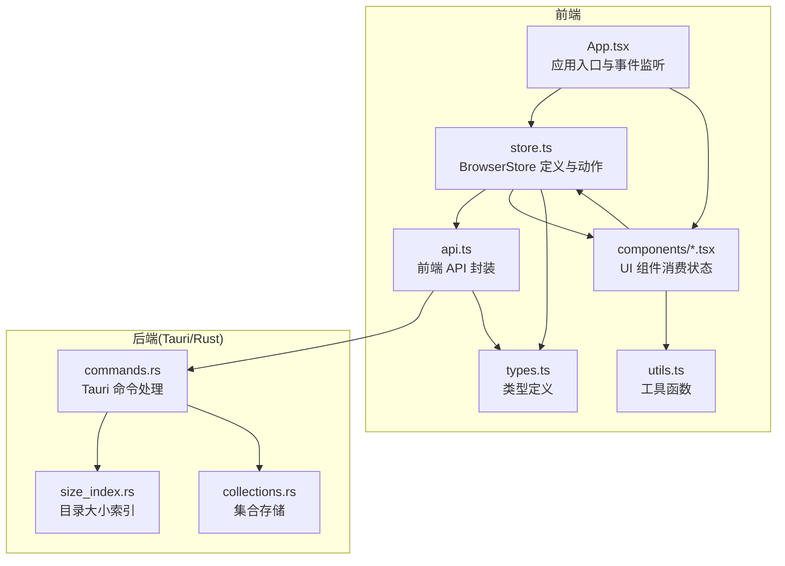
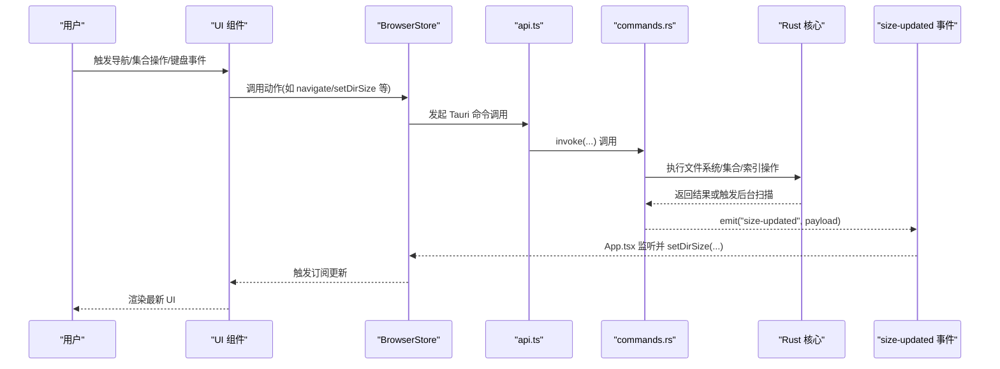
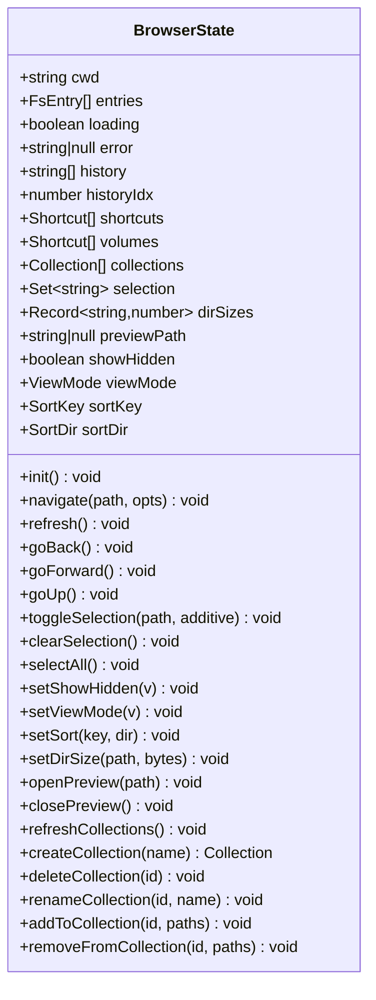
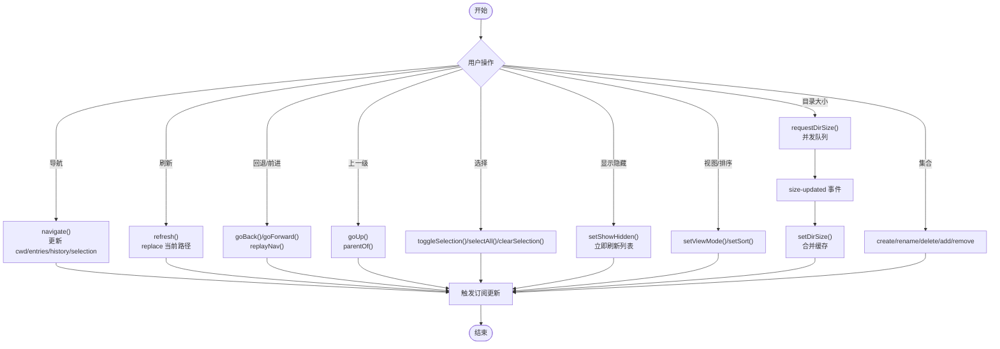
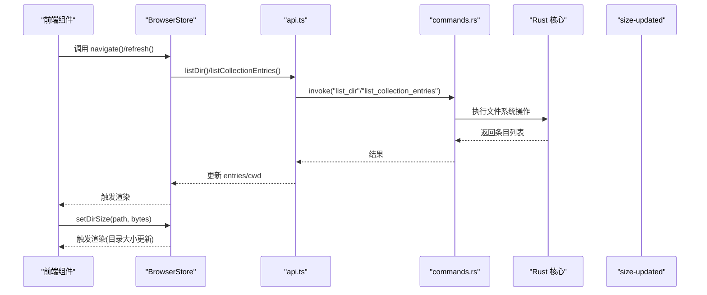
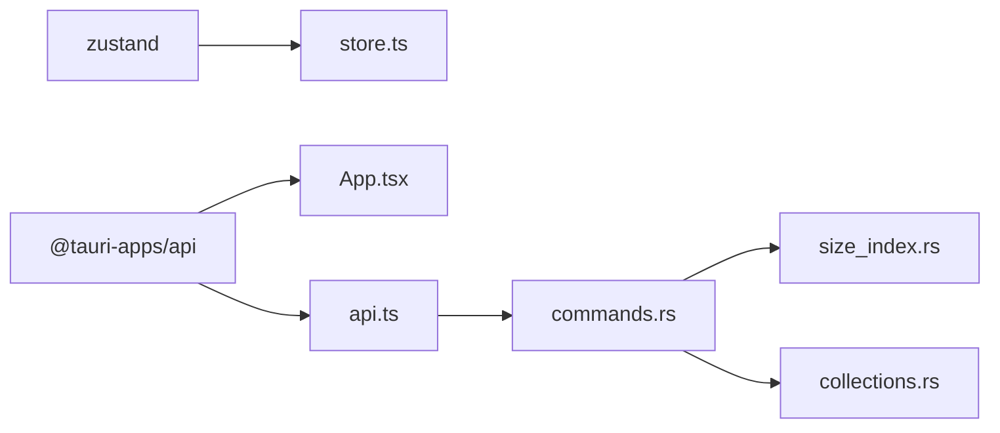

# 状态管理系统

<cite>
**本文档引用的文件**
- [store.ts](file://src/store.ts)
- [types.ts](file://src/types.ts)
- [api.ts](file://src/api.ts)
- [App.tsx](file://src/App.tsx)
- [FileList.tsx](file://src/components/FileList.tsx)
- [Sidebar.tsx](file://src/components/Sidebar.tsx)
- [Toolbar.tsx](file://src/components/Toolbar.tsx)
- [StatusBar.tsx](file://src/components/StatusBar.tsx)
- [PreviewModal.tsx](file://src/components/PreviewModal.tsx)
- [utils.ts](file://src/utils.ts)
- [commands.rs](file://src-tauri/src/commands.rs)
- [size_index.rs](file://src-tauri/src/core/size_index.rs)
- [collections.rs](file://src-tauri/src/core/collections.rs)
- [package.json](file://package.json)
</cite>

## 目录
1. [简介](#简介)
2. [项目结构](#项目结构)
3. [核心组件](#核心组件)
4. [架构总览](#架构总览)
5. [详细组件分析](#详细组件分析)
6. [依赖关系分析](#依赖关系分析)
7. [性能考虑](#性能考虑)
8. [故障排除指南](#故障排除指南)
9. [结论](#结论)

## 简介
本文件系统性阐述 LocalBro 基于 Zustand 的状态管理实现，重点覆盖以下方面：
- 全局状态设计模式：以 BrowserStore 为核心，统一管理浏览上下文、历史导航、选择状态、视图设置、目录大小缓存、预览状态及集合（Collections）等。
- 状态更新机制：通过异步 API 调用与事件驱动相结合的方式，确保前后端状态一致与响应式渲染。
- 订阅与渲染：组件通过选择器订阅所需状态片段，实现最小化重渲染与高效更新。
- 持久化与内存管理：目录大小索引的内存缓存、集合的本地 JSON 文件持久化策略。
- 扩展最佳实践：如何安全地新增状态域与动作，避免耦合与性能退化。
- 与后端同步：Tauri 命令层负责与 Rust 核心交互，前端通过事件监听接收后台扫描结果。

## 项目结构
LocalBro 的状态管理位于前端 TypeScript/React 层，后端由 Tauri/Rust 提供命令支持。核心文件分布如下：
- 状态定义与逻辑：src/store.ts
- 类型定义：src/types.ts
- 前端 API 封装：src/api.ts
- 应用入口与事件监听：src/App.tsx
- 组件层状态消费：src/components/*.tsx
- 工具函数：src/utils.ts
- 后端命令与数据源：src-tauri/src/commands.rs
- 目录大小索引与集合存储：src-tauri/src/core/size_index.rs、src-tauri/src/core/collections.rs
- 依赖声明：package.json

**图表来源**
- [store.ts:1-308](file://src/store.ts#L1-L308)
- [api.ts:1-195](file://src/api.ts#L1-L195)
- [App.tsx:1-140](file://src/App.tsx#L1-L140)
- [commands.rs:1-198](file://src-tauri/src/commands.rs#L1-L198)
- [size_index.rs:1-135](file://src-tauri/src/core/size_index.rs#L1-L135)
- [collections.rs:1-191](file://src-tauri/src/core/collections.rs#L1-L191)

**章节来源**
- [store.ts:1-308](file://src/store.ts#L1-L308)
- [types.ts:1-37](file://src/types.ts#L1-L37)
- [api.ts:1-195](file://src/api.ts#L1-L195)
- [App.tsx:1-140](file://src/App.tsx#L1-L140)
- [commands.rs:1-198](file://src-tauri/src/commands.rs#L1-L198)
- [size_index.rs:1-135](file://src-tauri/src/core/size_index.rs#L1-L135)
- [collections.rs:1-191](file://src-tauri/src/core/collections.rs#L1-L191)
- [package.json:1-28](file://package.json#L1-L28)

## 核心组件
- BrowserStore（Zustand 状态容器）
  - 状态域：当前工作目录、条目列表、加载/错误状态、浏览历史与索引、快捷方式、卷、集合、选择集、目录大小缓存、预览路径、视图模式、排序键与方向。
  - 动作：初始化、导航、刷新、回退/前进、上一级、选择操作、显示隐藏项切换、视图与排序设置、目录大小更新、预览开关、集合 CRUD 与增删操作。
- 前端 API 封装（api.ts）
  - 对应 Tauri 命令进行封装，返回标准化的 FsEntry、集合等类型。
- 后端命令（commands.rs）
  - 提供文件系统操作、集合管理、目录大小索引请求与事件广播。
- 目录大小索引（size_index.rs）
  - 内存缓存 + 后台扫描 + 事件通知的异步索引机制。
- 集合存储（collections.rs）
  - 基于 JSON 的本地持久化，提供集合的增删改查与成员变更。

**章节来源**
- [store.ts:16-71](file://src/store.ts#L16-L71)
- [store.ts:73-263](file://src/store.ts#L73-L263)
- [api.ts:32-195](file://src/api.ts#L32-L195)
- [commands.rs:13-198](file://src-tauri/src/commands.rs#L13-L198)
- [size_index.rs:33-104](file://src-tauri/src/core/size_index.rs#L33-L104)
- [collections.rs:39-164](file://src-tauri/src/core/collections.rs#L39-L164)

## 架构总览
下面的序列图展示了从用户操作到状态更新与 UI 响应的完整流程，涵盖目录导航、集合操作与目录大小扫描事件。

**图表来源**
- [store.ts:97-141](file://src/store.ts#L97-L141)
- [store.ts:112-136](file://src/store.ts#L112-L136)
- [store.ts:205-206](file://src/store.ts#L205-L206)
- [App.tsx:108-116](file://src/App.tsx#L108-L116)
- [api.ts:37-48](file://src/api.ts#L37-L48)
- [commands.rs:110-121](file://src-tauri/src/commands.rs#L110-L121)
- [size_index.rs:73-101](file://src-tauri/src/core/size_index.rs#L73-L101)

## 详细组件分析

### BrowserStore 设计与状态域
BrowserStore 采用 Zustand 的 create 形式，集中管理所有与文件浏览相关的状态与动作。其状态域与职责如下：
- 导航与浏览
  - cwd：当前工作目录（支持虚拟集合路径）
  - entries：当前目录/集合的条目列表
  - loading/error：加载状态与错误信息
  - history/historyIdx：浏览器历史栈与当前位置
- 快捷与集合
  - shortcuts/volumes/collections：快捷方式、磁盘卷与集合
- 选择与预览
  - selection：已选中的路径集合
  - previewPath：预览模态框中展示的文件路径
- 视图与排序
  - showHidden/viewMode/sortKey/sortDir：显示隐藏项、视图模式、排序键与方向
- 缓存
  - dirSizes：目录递归大小的内存缓存（绝对路径为键）

动作概览（节选）：
- 初始化：拉取用户主目录、默认快捷方式、卷与集合，并导航至主目录
- 导航：根据是否为集合路径选择不同 API，维护历史栈并清空选择
- 刷新/回退/前进/上一级：基于历史栈与 API 重新加载
- 选择操作：单选/多选/全选
- 显示隐藏项切换：即时刷新列表并清空选择
- 视图与排序：切换视图模式与排序规则（含升序/降序切换）
- 目录大小更新：合并缓存
- 预览：打开/关闭
- 集合操作：列举、创建、删除、重命名、添加/移除条目；若在查看集合则刷新

**图表来源**
- [store.ts:16-71](file://src/store.ts#L16-L71)
- [store.ts:73-263](file://src/store.ts#L73-L263)
- [types.ts:3-36](file://src/types.ts#L3-L36)

**章节来源**
- [store.ts:16-71](file://src/store.ts#L16-L71)
- [store.ts:73-263](file://src/store.ts#L73-L263)
- [types.ts:1-37](file://src/types.ts#L1-L37)

### 状态订阅机制与响应式渲染
- 订阅方式：组件通过选择器函数订阅状态片段，仅在对应字段变化时触发重渲染。
- 典型用法：
  - FileList：订阅 entries、sortKey、sortDir、viewMode、loading、error，内部使用 useMemo 对排序进行稳定化处理。
  - Sidebar/Toolbar：订阅 shortcuts、volumes、collections、cwd、selection、viewMode 等，用于导航与集合管理。
  - StatusBar：订阅 entries、selection、dirSizes，计算统计信息。
  - PreviewModal：订阅 entries、sortKey、sortDir，生成兄弟文件导航。
- 性能要点：
  - 使用 useMemo 缓存排序结果，避免重复排序。
  - 使用 Set 存储选择集，便于快速查找与更新。
  - 将复杂计算（如目录大小）放在状态中缓存，减少重复 IO。

**章节来源**
- [FileList.tsx:17-22](file://src/components/FileList.tsx#L17-L22)
- [FileList.tsx:42-83](file://src/components/FileList.tsx#L42-L83)
- [Sidebar.tsx:19-78](file://src/components/Sidebar.tsx#L19-L78)
- [Toolbar.tsx:6-24](file://src/components/Toolbar.tsx#L6-L24)
- [StatusBar.tsx:4-38](file://src/components/StatusBar.tsx#L4-L38)
- [PreviewModal.tsx:13-44](file://src/components/PreviewModal.tsx#L13-L44)

### 状态更新触发与事件驱动
- 导航与刷新：navigate/refresh/goBack/goForward/goUp 基于 API 返回的 entries 更新状态，并维护历史栈。
- 目录大小：前端通过并发队列请求后台扫描，收到 size-updated 事件后合并到 dirSizes。
- 集合操作：create/delete/rename/add/remove 通过 API 调用后更新 collections，并在必要时刷新当前视图。

**图表来源**
- [store.ts:112-136](file://src/store.ts#L112-L136)
- [store.ts:138-141](file://src/store.ts#L138-L141)
- [store.ts:143-161](file://src/store.ts#L143-L161)
- [store.ts:163-170](file://src/store.ts#L163-L170)
- [store.ts:172-185](file://src/store.ts#L172-L185)
- [store.ts:187-203](file://src/store.ts#L187-L203)
- [store.ts:205-206](file://src/store.ts#L205-L206)
- [store.ts:211-262](file://src/store.ts#L211-L262)
- [App.tsx:22-63](file://src/App.tsx#L22-L63)
- [App.tsx:108-116](file://src/App.tsx#L108-L116)

**章节来源**
- [store.ts:112-161](file://src/store.ts#L112-L161)
- [store.ts:172-203](file://src/store.ts#L172-L203)
- [store.ts:205-262](file://src/store.ts#L205-L262)
- [App.tsx:22-63](file://src/App.tsx#L22-L63)
- [App.tsx:108-116](file://src/App.tsx#L108-L116)

### 状态持久化策略
- 目录大小索引：内存缓存为主，键为绝对路径字符串；通过 size_index.rs 的共享缓存与事件通知实现跨会话复用与增量更新。
- 集合持久化：collections.rs 将集合列表写入 JSON 文件（collections.json），包含集合元信息与成员路径；每次变更后按时间戳排序并落盘。
- 前端状态：BrowserStore 为内存状态，不直接持久化；可通过自定义中间件或外部存储扩展（建议遵循“只持久化必要字段”原则）。

**章节来源**
- [size_index.rs:33-53](file://src-tauri/src/core/size_index.rs#L33-L53)
- [size_index.rs:106-134](file://src-tauri/src/core/size_index.rs#L106-L134)
- [collections.rs:45-74](file://src-tauri/src/core/collections.rs#L45-L74)
- [collections.rs:104-151](file://src-tauri/src/core/collections.rs#L104-L151)

### 内存管理与性能优化
- 并发扫描与去重：目录大小扫描通过并发队列限制同时进行的任务数，避免重复请求；size_index.rs 使用 in-flight 表示正在扫描的路径，防止重复启动。
- 缓存命中优先：request_dir_size 命令优先返回缓存值；无缓存时才启动后台扫描。
- 选择集与排序：使用 Set 存储选择，O(1) 查找；排序结果用 useMemo 缓存，减少不必要的重排。
- 事件驱动更新：通过 size-updated 事件批量更新 dirSizes，避免逐个回调导致的多次渲染。

**章节来源**
- [App.tsx:22-63](file://src/App.tsx#L22-L63)
- [size_index.rs:60-104](file://src-tauri/src/core/size_index.rs#L60-L104)
- [FileList.tsx:17-22](file://src/components/FileList.tsx#L17-L22)

### 状态扩展最佳实践
- 新增状态域
  - 保持单一职责：每个状态域尽量只负责一个功能面（如浏览、集合、预览）。
  - 默认值与类型安全：为新字段提供合理默认值，并在 types.ts 中定义类型。
- 新增动作
  - 保持幂等与可组合：动作内部尽量原子化，避免副作用扩散。
  - 与 API 协同：先在 api.ts 和 commands.rs 中定义命令与参数，再在 store.ts 中实现动作。
  - 事件联动：如需后台扫描，遵循现有事件命名规范（如 size-updated）。
- 避免过度订阅
  - 将复杂计算放入状态中缓存，减少组件内重复计算。
  - 使用选择器精确订阅，避免不必要的重渲染。

**章节来源**
- [store.ts:16-71](file://src/store.ts#L16-L71)
- [api.ts:32-195](file://src/api.ts#L32-L195)
- [commands.rs:13-198](file://src-tauri/src/commands.rs#L13-L198)

### 在组件中正确使用与更新状态
- 使用选择器订阅
  - 仅订阅需要的字段，避免全量订阅导致的频繁重渲染。
- 合理组织交互
  - 导航：使用 navigate/goBack/goForward/goUp。
  - 选择：toggleSelection 支持累加与替换两种模式。
  - 预览：openPreview/closePreview 控制模态框。
  - 集合：通过 createCollection/renameCollection/deleteCollection/addToCollection/removeFromCollection 管理。
- 注意边界条件
  - 集合路径不支持 goUp。
  - 显示隐藏项切换时，非集合路径才会立即刷新列表。

**章节来源**
- [FileList.tsx:24-40](file://src/components/FileList.tsx#L24-L40)
- [Toolbar.tsx:62-99](file://src/components/Toolbar.tsx#L62-L99)
- [Sidebar.tsx:34-73](file://src/components/Sidebar.tsx#L34-L73)
- [store.ts:163-170](file://src/store.ts#L163-L170)
- [store.ts:187-197](file://src/store.ts#L187-L197)

### 与后端数据同步的状态管理模式
- 命令调用链
  - 前端动作 -> api.ts -> Tauri invoke -> commands.rs -> Rust 核心 -> 返回结果或触发后台任务。
- 事件驱动
  - 后台扫描完成后，Rust 核心通过 emit("size-updated", ...) 推送结果；前端监听并合并到状态。
- 一致性保证
  - 历史栈与当前路径保持一致，导航与刷新均以当前 showHidden 状态为准。
  - 集合变更后，若当前视图为该集合，则自动刷新以反映最新内容。

**图表来源**
- [store.ts:112-136](file://src/store.ts#L112-L136)
- [store.ts:205-206](file://src/store.ts#L205-L206)
- [api.ts:37-48](file://src/api.ts#L37-L48)
- [commands.rs:13-41](file://src-tauri/src/commands.rs#L13-L41)
- [size_index.rs:73-101](file://src-tauri/src/core/size_index.rs#L73-L101)

**章节来源**
- [store.ts:112-136](file://src/store.ts#L112-L136)
- [store.ts:205-206](file://src/store.ts#L205-L206)
- [api.ts:37-48](file://src/api.ts#L37-L48)
- [commands.rs:13-41](file://src-tauri/src/commands.rs#L13-L41)
- [size_index.rs:73-101](file://src-tauri/src/core/size_index.rs#L73-L101)

## 依赖关系分析
- 前端依赖
  - Zustand：提供轻量级状态容器与动作定义能力。
  - @tauri-apps/api：与后端通信与事件监听。
- 后端依赖
  - Tauri：命令注册与事件发射。
  - Rust 核心：文件系统操作、集合存储、目录大小扫描。

**图表来源**
- [package.json:12-17](file://package.json#L12-L17)
- [store.ts:1-1](file://src/store.ts#L1-L1)
- [App.tsx:1-10](file://src/App.tsx#L1-L10)
- [api.ts:1-2](file://src/api.ts#L1-L2)
- [commands.rs:1-12](file://src-tauri/src/commands.rs#L1-L12)

**章节来源**
- [package.json:12-17](file://package.json#L12-L17)
- [store.ts:1-1](file://src/store.ts#L1-L1)
- [App.tsx:1-10](file://src/App.tsx#L1-L10)
- [api.ts:1-2](file://src/api.ts#L1-L2)
- [commands.rs:1-12](file://src-tauri/src/commands.rs#L1-L12)

## 性能考虑
- 减少重渲染
  - 使用选择器订阅最小状态片段。
  - 对昂贵计算（如排序）使用 useMemo 缓存。
- 控制并发
  - 目录大小扫描并发度固定，避免资源争用。
- 缓存优先
  - 优先使用缓存结果，仅在缺失时发起后台扫描。
- 事件批处理
  - 通过事件聚合更新，减少多次 set 调用带来的抖动。

[本节为通用指导，无需特定文件来源]

## 故障排除指南
- 导航失败
  - 检查 cwd 是否为集合路径；集合路径不支持 goUp。
  - 确认 API 返回的 entries 是否为空，必要时清理 selection。
- 目录大小未更新
  - 确认 size-updated 事件是否被监听；检查并发队列是否被取消。
  - 若路径已被缓存，确认缓存是否被正确合并到 dirSizes。
- 集合操作异常
  - 确认当前视图是否为集合路径；集合删除后会自动导航回主目录。
  - 检查集合 JSON 文件是否存在权限问题。

**章节来源**
- [store.ts:163-170](file://src/store.ts#L163-L170)
- [store.ts:222-234](file://src/store.ts#L222-L234)
- [App.tsx:108-116](file://src/App.tsx#L108-L116)
- [collections.rs:45-74](file://src-tauri/src/core/collections.rs#L45-L74)

## 结论
LocalBro 的状态管理以 Zustand 为核心，围绕 BrowserStore 构建了清晰的全局状态模型与动作体系。通过与 Tauri 命令层的紧密协作，实现了高效的文件系统浏览、集合管理与目录大小索引。前端采用事件驱动与缓存优先的策略，有效平衡了性能与用户体验。遵循本文档的最佳实践，可在不破坏现有架构的前提下安全扩展状态域与动作，持续提升系统的可维护性与稳定性。