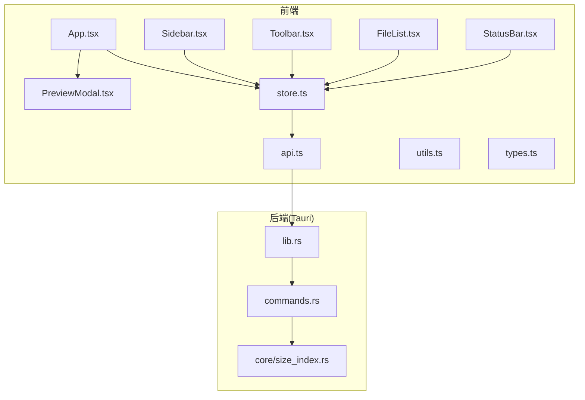
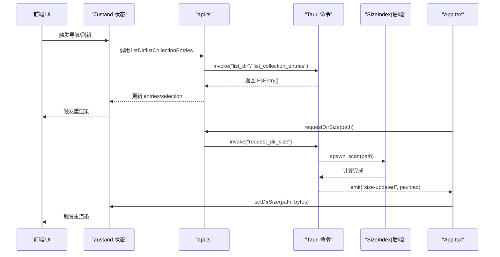
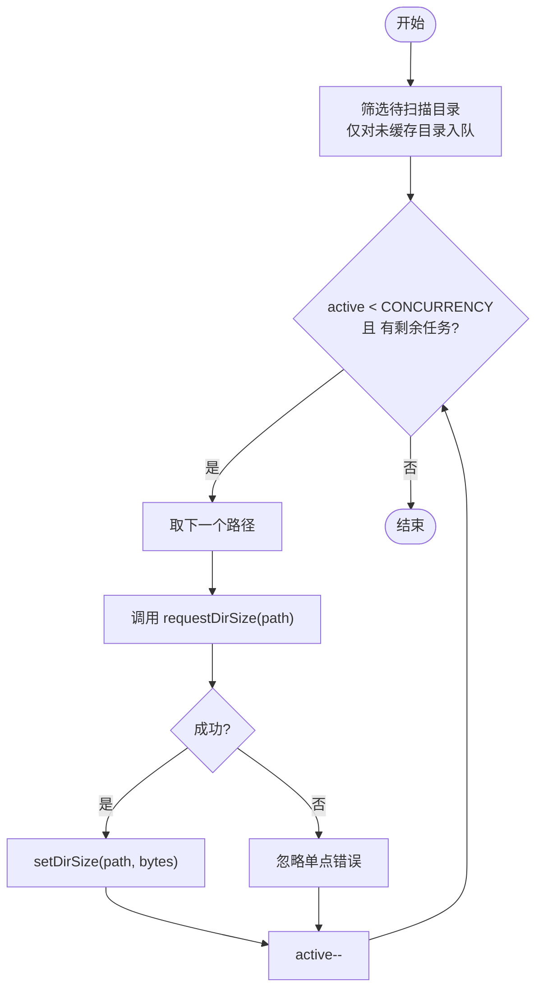
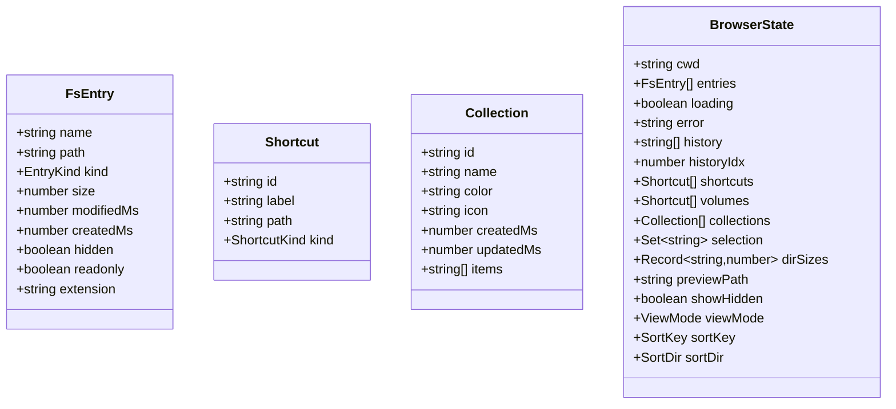
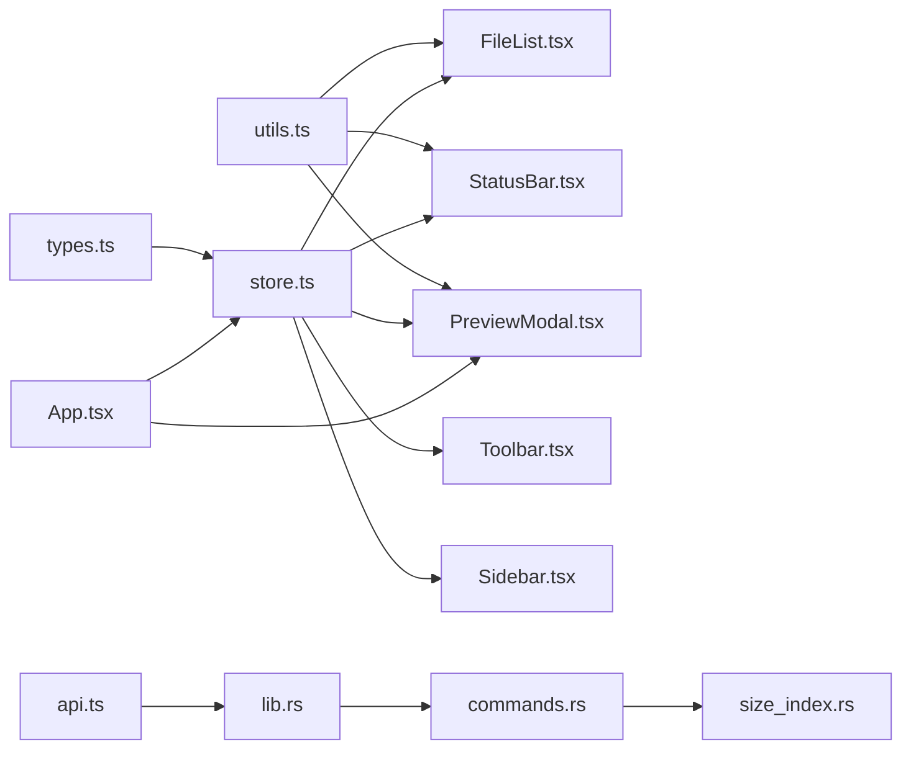

# 用户交互与事件处理

<cite>
**本文引用的文件**
- [src/App.tsx](file://src/App.tsx)
- [src/components/FileList.tsx](file://src/components/FileList.tsx)
- [src/components/Sidebar.tsx](file://src/components/Sidebar.tsx)
- [src/components/Toolbar.tsx](file://src/components/Toolbar.tsx)
- [src/components/StatusBar.tsx](file://src/components/StatusBar.tsx)
- [src/components/PreviewModal.tsx](file://src/components/PreviewModal.tsx)
- [src/store.ts](file://src/store.ts)
- [src/api.ts](file://src/api.ts)
- [src/utils.ts](file://src/utils.ts)
- [src/types.ts](file://src/types.ts)
- [src-tauri/src/lib.rs](file://src-tauri/src/lib.rs)
- [src-tauri/src/commands.rs](file://src-tauri/src/commands.rs)
- [src-tauri/src/core/size_index.rs](file://src-tauri/src/core/size_index.rs)
- [package.json](file://package.json)
</cite>

## 目录
1. [简介](#简介)
2. [项目结构](#项目结构)
3. [核心组件](#核心组件)
4. [架构总览](#架构总览)
5. [详细组件分析](#详细组件分析)
6. [依赖关系分析](#依赖关系分析)
7. [性能考量](#性能考量)
8. [故障排查指南](#故障排查指南)
9. [结论](#结论)
10. [附录](#附录)

## 简介
本文件聚焦 LocalBro 的用户交互与事件处理，系统性梳理以下方面：
- 文件选择、拖拽（概念性）、右键菜单（概念性）与键盘快捷键的实现与交互模式
- 鼠标事件、键盘事件与触摸事件在前端的处理流程
- 并发队列与目录大小扫描的并发控制及资源管理
- 用户反馈机制：加载状态、进度指示与操作确认
- 用户体验优化策略：延迟加载、虚拟滚动（概念性）与响应式设计
- 交互行为的定制与扩展实践

## 项目结构
应用采用前端 React + Zustand 状态管理 + Tauri 后端的分层架构。前端负责 UI 与事件处理，Tauri 暴露命令给前端调用，并通过事件回传后台计算结果（如目录大小扫描完成）。

图表来源
- [src/App.tsx:106-146](file://src/App.tsx#L106-L146)
- [src/components/Sidebar.tsx:20-215](file://src/components/Sidebar.tsx#L20-L215)
- [src/components/Toolbar.tsx:6-216](file://src/components/Toolbar.tsx#L6-L216)
- [src/components/FileList.tsx:42-173](file://src/components/FileList.tsx#L42-L173)
- [src/components/StatusBar.tsx:4-38](file://src/components/StatusBar.tsx#L4-L38)
- [src/components/PreviewModal.tsx:13-83](file://src/components/PreviewModal.tsx#L13-L83)
- [src/store.ts:73-263](file://src/store.ts#L73-L263)
- [src/api.ts:37-121](file://src/api.ts#L37-L121)
- [src-tauri/src/lib.rs:12-66](file://src-tauri/src/lib.rs#L12-L66)
- [src-tauri/src/commands.rs:15-128](file://src-tauri/src/commands.rs#L15-L128)
- [src-tauri/src/core/size_index.rs:41-104](file://src-tauri/src/core/size_index.rs#L41-L104)

章节来源
- [src/App.tsx:106-146](file://src/App.tsx#L106-L146)
- [src/store.ts:73-263](file://src/store.ts#L73-L263)
- [src-tauri/src/lib.rs:12-66](file://src-tauri/src/lib.rs#L12-L66)

## 核心组件
- 应用入口与全局事件：App 组件负责初始化、监听后端事件、启动目录大小扫描队列与快捷键绑定。
- 列表视图：FileList 负责渲染列表/网格/详情三种视图，处理点击、双击与选择逻辑。
- 侧边栏：Sidebar 提供收藏、卷盘与集合的导航与编辑交互。
- 工具栏：Toolbar 提供地址栏、前进/后退/上一级、刷新、视图切换与“添加到集合”等交互。
- 状态栏：StatusBar 展示统计信息与未完成的目录大小计算任务。
- 预览模态框：PreviewModal 支持空格打开/关闭、左右箭头在同级文件间导航、Esc 关闭。
- 状态与数据流：store.ts 使用 Zustand 管理当前工作目录、条目、历史、选择集、排序、视图模式、预览路径与集合等；api.ts 封装 Tauri 命令调用；utils.ts 提供格式化与工具函数；types.ts 定义数据模型。

章节来源
- [src/App.tsx:28-104](file://src/App.tsx#L28-L104)
- [src/components/FileList.tsx:24-40](file://src/components/FileList.tsx#L24-L40)
- [src/components/Sidebar.tsx:36-75](file://src/components/Sidebar.tsx#L36-L75)
- [src/components/Toolbar.tsx:69-99](file://src/components/Toolbar.tsx#L69-L99)
- [src/components/StatusBar.tsx:9-19](file://src/components/StatusBar.tsx#L9-L19)
- [src/components/PreviewModal.tsx:18-43](file://src/components/PreviewModal.tsx#L18-L43)
- [src/store.ts:16-71](file://src/store.ts#L16-L71)
- [src/api.ts:37-121](file://src/api.ts#L37-L121)
- [src/utils.ts:1-66](file://src/utils.ts#L1-L66)
- [src/types.ts:1-37](file://src/types.ts#L1-L37)

## 架构总览
前端通过 @tauri-apps/api 调用后端命令，后端在 Rust 中实现具体功能并通过事件向前端回传结果。目录大小扫描由后端并发执行并在完成后通过事件更新前端缓存，前端再驱动 UI 更新。

图表来源
- [src/App.tsx:114-122](file://src/App.tsx#L114-L122)
- [src/api.ts:115-121](file://src/api.ts#L115-L121)
- [src-tauri/src/commands.rs:112-123](file://src-tauri/src/commands.rs#L112-L123)
- [src-tauri/src/core/size_index.rs:60-104](file://src-tauri/src/core/size_index.rs#L60-L104)

## 详细组件分析

### 交互模式与事件处理

- 文件选择
  - 单击：支持按住 Ctrl/Meta 进行累加选择；否则替换为单个选中。
  - 双击：目录则进入，文件则打开预览。
  - 全选：通过状态管理提供的 selectAll 实现。
  
  章节来源
  - [src/components/FileList.tsx:29-37](file://src/components/FileList.tsx#L29-L37)
  - [src/store.ts:172-185](file://src/store.ts#L172-L185)

- 键盘快捷键
  - 空格：打开/关闭 QuickLook 风格预览；若已打开则由模态框自行处理空格关闭。
  - 左右箭头：在预览模态框中于同级文件间切换。
  - Esc：关闭预览或退出地址栏编辑。
  - 地址栏双击：进入编辑模式，支持 Enter 提交、Esc 取消。
  
  章节来源
  - [src/App.tsx:71-104](file://src/App.tsx#L71-L104)
  - [src/components/PreviewModal.tsx:28-43](file://src/components/PreviewModal.tsx#L28-L43)
  - [src/components/Toolbar.tsx:121-136](file://src/components/Toolbar.tsx#L121-L136)

- 鼠标事件与触摸事件
  - 点击/双击：列表项与网格项均支持点击选择与双击打开。
  - 上下文菜单：当前未在前端实现右键菜单，建议通过原生上下文菜单或自定义菜单组件扩展。
  - 拖拽：当前未在前端实现拖拽操作，建议结合 HTML5 拖放 API 或第三方库扩展。
  
  章节来源
  - [src/components/FileList.tsx:92-104](file://src/components/FileList.tsx#L92-L104)
  - [src/components/FileList.tsx:156-170](file://src/components/FileList.tsx#L156-L170)

- 用户反馈机制
  - 加载状态：当列表为空且处于加载时显示“加载中”提示。
  - 错误状态：发生错误时显示错误文本。
  - 进度指示：状态栏显示未完成的目录大小计算数量；目录大小为 null 时以占位符显示。
  - 操作确认：删除集合前弹窗确认。
  
  章节来源
  - [src/components/FileList.tsx:48-62](file://src/components/FileList.tsx#L48-L62)
  - [src/components/StatusBar.tsx:17-19](file://src/components/StatusBar.tsx#L17-L19)
  - [src/components/Sidebar.tsx:66-75](file://src/components/Sidebar.tsx#L66-L75)

- 交互行为定制与扩展
  - 新增右键菜单：在列表项上注册 onContextMenu，构建菜单并根据选择集与当前路径决定可用动作。
  - 新增拖拽：在列表容器上注册拖放事件，结合选择集与目标路径执行复制/移动。
  - 自定义预览适配器：通过预览注册表扩展新类型的文件预览。
  
  章节来源
  - [src/components/FileList.tsx:92-104](file://src/components/FileList.tsx#L92-L104)
  - [src/components/PreviewModal.tsx:45-46](file://src/components/PreviewModal.tsx#L45-L46)

### 并发队列与目录大小扫描

- 并发控制
  - 前端使用固定并发数（常量）限制同时进行的目录大小扫描请求数。
  - 通过队列与计数器协调请求的启动与回收，避免过度占用系统资源。
  
  章节来源
  - [src/App.tsx:28-69](file://src/App.tsx#L28-L69)

- 后端扫描与事件回传
  - 后端维护共享缓存与“进行中”集合，避免重复扫描。
  - 扫描线程完成后通过事件发送结果，前端监听并更新缓存。
  
  章节来源
  - [src-tauri/src/core/size_index.rs:34-53](file://src-tauri/src/core/size_index.rs#L34-L53)
  - [src-tauri/src/core/size_index.rs:60-104](file://src-tauri/src/core/size_index.rs#L60-L104)
  - [src-tauri/src/commands.rs:104-128](file://src-tauri/src/commands.rs#L104-L128)
  - [src/App.tsx:114-122](file://src/App.tsx#L114-L122)

- 资源管理
  - 取消标记：在取消时停止后续处理，避免泄漏。
  - 缓存失效：提供接口使缓存失效，触发重新扫描。
  
  章节来源
  - [src/App.tsx:65-68](file://src/App.tsx#L65-L68)
  - [src-tauri/src/commands.rs:125-128](file://src-tauri/src/commands.rs#L125-L128)

图表来源
- [src/App.tsx:28-69](file://src/App.tsx#L28-L69)
- [src/api.ts:115-121](file://src/api.ts#L115-L121)
- [src/store.ts:205-206](file://src/store.ts#L205-L206)

### 用户体验优化策略

- 延迟加载
  - 列表渲染按视图模式选择不同布局组件，避免一次性渲染大量 DOM。
  - 预览内容按需加载，无适配器时显示“无预览”提示。
  
  章节来源
  - [src/components/FileList.tsx:72-82](file://src/components/FileList.tsx#L72-L82)
  - [src/components/PreviewModal.tsx:76-78](file://src/components/PreviewModal.tsx#L76-L78)

- 虚拟滚动（概念性）
  - 对于超大目录，可引入虚拟滚动库减少 DOM 数量，提升渲染性能。
  - 与现有排序/选择逻辑配合，确保虚拟化不破坏交互一致性。

- 响应式设计
  - 工具栏与侧边栏在小屏设备上可折叠或调整布局，保持交互可用性。
  - 状态栏信息在窄屏下可简化显示。

### 数据模型与类型

图表来源
- [src/types.ts:3-13](file://src/types.ts#L3-L13)
- [src/types.ts:26-31](file://src/types.ts#L26-L31)
- [src/types.ts:14-37](file://src/types.ts#L14-L37)
- [src/store.ts:16-71](file://src/store.ts#L16-L71)

## 依赖关系分析

图表来源
- [src/types.ts:1-37](file://src/types.ts#L1-L37)
- [src/store.ts:73-263](file://src/store.ts#L73-L263)
- [src/utils.ts:1-66](file://src/utils.ts#L1-L66)
- [src/components/FileList.tsx:1-173](file://src/components/FileList.tsx#L1-L173)
- [src/components/Toolbar.tsx:1-216](file://src/components/Toolbar.tsx#L1-L216)
- [src/components/Sidebar.tsx:1-215](file://src/components/Sidebar.tsx#L1-L215)
- [src/components/StatusBar.tsx:1-38](file://src/components/StatusBar.tsx#L1-L38)
- [src/components/PreviewModal.tsx:1-83](file://src/components/PreviewModal.tsx#L1-L83)
- [src/api.ts:1-280](file://src/api.ts#L1-L280)
- [src-tauri/src/lib.rs:12-66](file://src-tauri/src/lib.rs#L12-L66)
- [src-tauri/src/commands.rs:15-266](file://src-tauri/src/commands.rs#L15-L266)
- [src-tauri/src/core/size_index.rs:1-135](file://src-tauri/src/core/size_index.rs#L1-L135)
- [src/App.tsx:106-146](file://src/App.tsx#L106-L146)

章节来源
- [src/App.tsx:106-146](file://src/App.tsx#L106-L146)
- [src/store.ts:73-263](file://src/store.ts#L73-L263)
- [src-tauri/src/lib.rs:12-66](file://src-tauri/src/lib.rs#L12-L66)

## 性能考量
- 目录大小扫描并发：前端固定并发上限，避免过多线程导致系统抖动；后端对重复请求进行去重。
- 渲染优化：列表按视图模式渲染，避免不必要的重排；状态栏仅在需要时更新。
- 资源释放：组件卸载时移除事件监听，避免内存泄漏。
- 大文件预览：默认限制读取字节数，防止内存占用过高。

## 故障排查指南
- 预览无法打开
  - 检查是否选择了文件而非目录；确认预览适配器是否存在。
  - 章节来源: [src/App.tsx:90-99](file://src/App.tsx#L90-L99), [src/components/PreviewModal.tsx:45-46](file://src/components/PreviewModal.tsx#L45-L46)

- 目录大小不显示
  - 确认后端事件是否正常到达；检查缓存是否被清空。
  - 章节来源: [src-tauri/src/core/size_index.rs:86-93](file://src-tauri/src/core/size_index.rs#L86-L93), [src/store.ts:205-206](file://src/store.ts#L205-L206)

- 删除集合无效
  - 确认确认对话框是否被取消；检查集合 ID 是否正确。
  - 章节来源: [src/components/Sidebar.tsx:66-75](file://src/components/Sidebar.tsx#L66-L75)

- 快捷键无效
  - 检查焦点是否在输入框内；确认事件监听是否在组件挂载时注册。
  - 章节来源: [src/App.tsx:79-103](file://src/App.tsx#L79-L103), [src/components/PreviewModal.tsx:28-43](file://src/components/PreviewModal.tsx#L28-L43)

## 结论
LocalBro 在用户交互层面提供了清晰的导航、选择与预览能力，并通过前后端协作实现了高效的目录大小扫描与实时反馈。建议在后续版本中补充右键菜单与拖拽支持，进一步完善桌面级文件管理体验；同时可引入虚拟滚动与更丰富的响应式布局，提升大目录场景下的性能与可用性。

## 附录
- 依赖版本参考
  - React、React-DOM、@tauri-apps/api、zustand 等
  - 章节来源: [package.json:12-27](file://package.json#L12-L27)