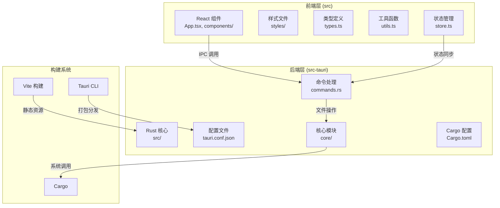
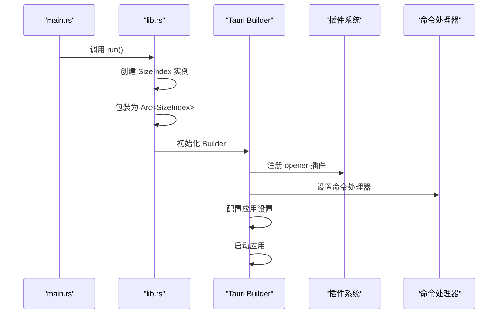
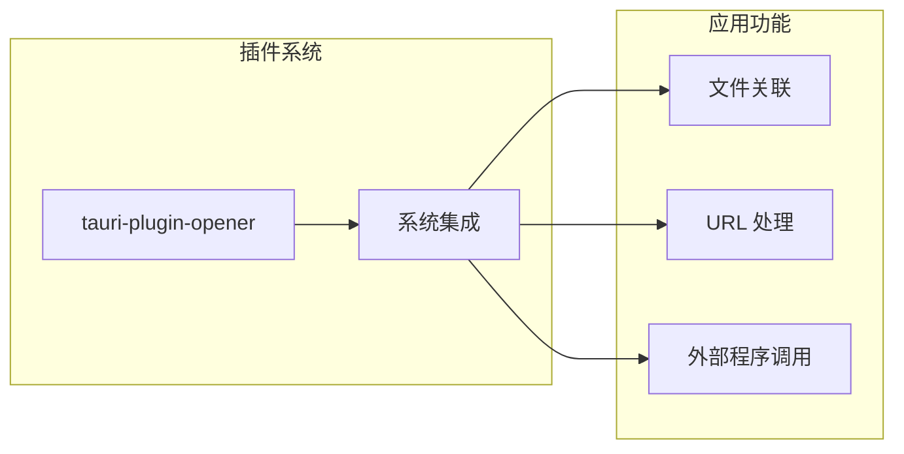
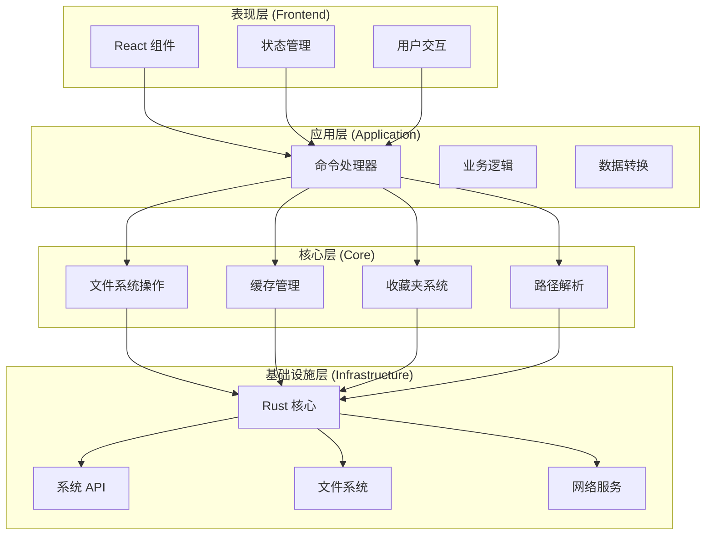
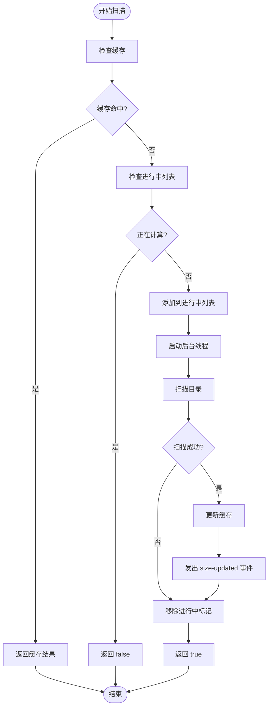
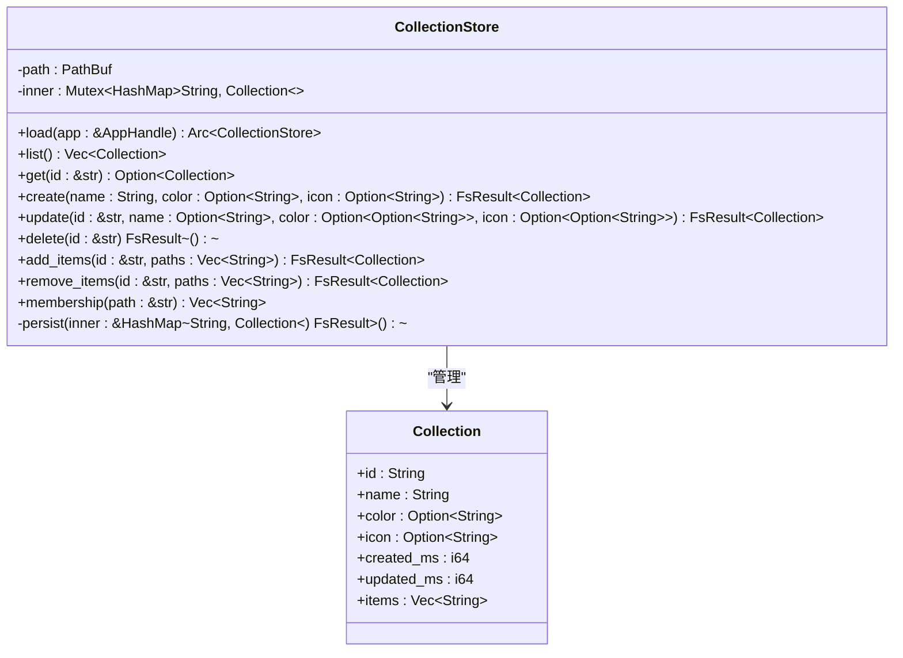
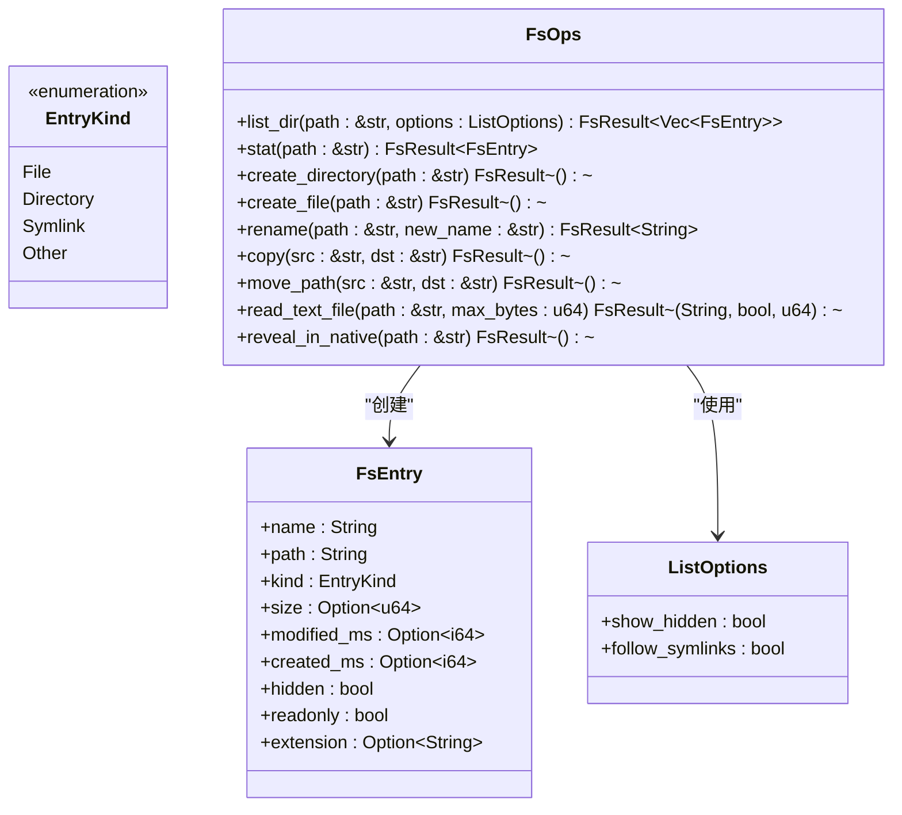
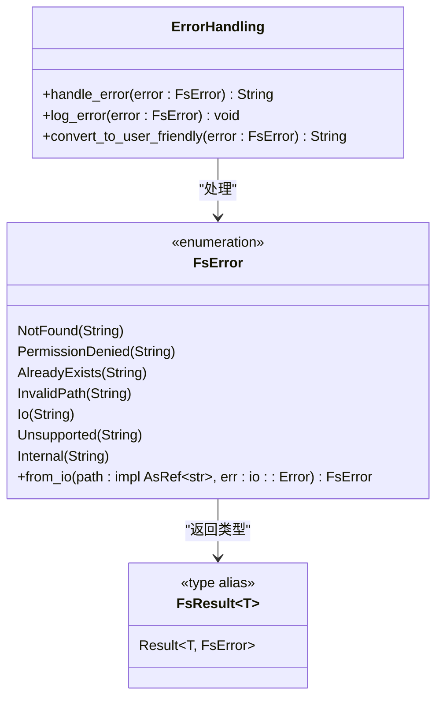
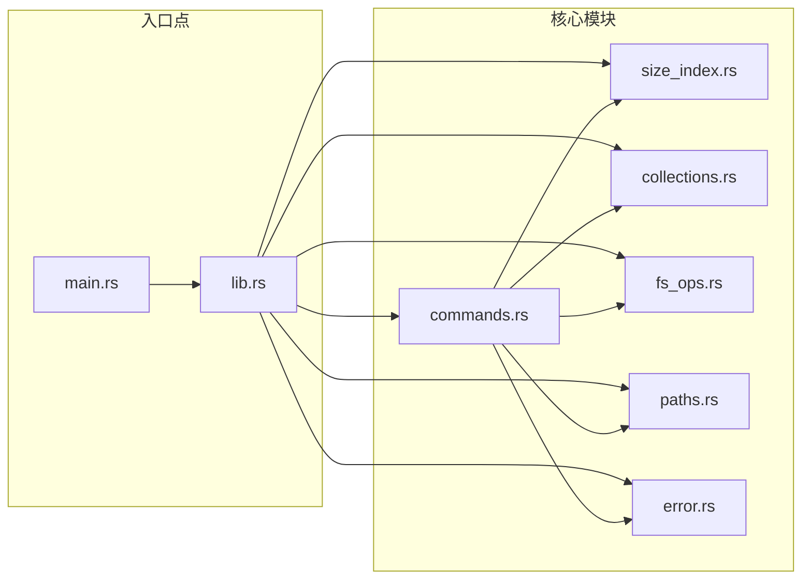

# Rust 应用架构

<cite>
**本文档引用的文件**
- [src-tauri/src/main.rs](file://src-tauri/src/main.rs)
- [src-tauri/src/lib.rs](file://src-tauri/src/lib.rs)
- [src-tauri/Cargo.toml](file://src-tauri/Cargo.toml)
- [src-tauri/tauri.conf.json](file://src-tauri/tauri.conf.json)
- [src-tauri/src/core/mod.rs](file://src-tauri/src/core/mod.rs)
- [src-tauri/src/core/size_index.rs](file://src-tauri/src/core/size_index.rs)
- [src-tauri/src/commands.rs](file://src-tauri/src/commands.rs)
- [src-tauri/src/core/collections.rs](file://src-tauri/src/core/collections.rs)
- [src-tauri/src/core/fs_ops.rs](file://src-tauri/src/core/fs_ops.rs)
- [src-tauri/src/core/error.rs](file://src-tauri/src/core/error.rs)
- [src-tauri/src/core/paths.rs](file://src-tauri/src/core/paths.rs)
- [src-tauri/build.rs](file://src-tauri/build.rs)
- [package.json](file://package.json)
</cite>

## 目录
1. [简介](#简介)
2. [项目结构](#项目结构)
3. [核心组件](#核心组件)
4. [架构概览](#架构概览)
5. [详细组件分析](#详细组件分析)
6. [依赖关系分析](#依赖关系分析)
7. [性能考虑](#性能考虑)
8. [故障排除指南](#故障排除指南)
9. [结论](#结论)

## 简介

LocalBro 是一个基于 Tauri 2.x 框架构建的跨平台本地文件浏览器应用。该应用采用 Rust 作为后端语言，结合 React + TypeScript 前端技术栈，提供了现代化的文件管理体验。应用的核心特性包括目录浏览、文件操作、大小计算缓存、收藏夹管理等。

本架构文档深入分析了应用的入口点设计、初始化流程、插件系统集成、生命周期管理、资源管理以及状态共享机制，特别重点阐述了 SizeIndex 的 Arc 包装和线程安全设计。

## 项目结构

LocalBro 采用典型的 Tauri 项目结构，分为前端和后端两个主要部分：



**图表来源**
- [src-tauri/src/main.rs:1-7](file://src-tauri/src/main.rs#L1-L7)
- [src-tauri/src/lib.rs:1-53](file://src-tauri/src/lib.rs#L1-L53)
- [src-tauri/Cargo.toml:1-36](file://src-tauri/Cargo.toml#L1-L36)

**章节来源**
- [src-tauri/src/main.rs:1-7](file://src-tauri/src/main.rs#L1-L7)
- [src-tauri/src/lib.rs:1-53](file://src-tauri/src/lib.rs#L1-L53)
- [src-tauri/Cargo.toml:1-36](file://src-tauri/Cargo.toml#L1-L36)

## 核心组件

### 应用入口点与初始化

应用的入口点设计简洁而高效，采用了标准的 Tauri 入口模式：



**图表来源**
- [src-tauri/src/main.rs:4-6](file://src-tauri/src/main.rs#L4-L6)
- [src-tauri/src/lib.rs:12-51](file://src-tauri/src/lib.rs#L12-L51)

### Tauri Builder 配置

应用使用默认的 Tauri Builder 配置，集成了以下关键组件：

1. **资源管理**: 通过 `manage()` 方法注册全局状态
2. **插件系统**: 集成 `tauri-plugin-opener` 插件
3. **命令处理器**: 使用 `generate_handler!` 宏批量注册所有命令
4. **生命周期管理**: 通过 `setup()` 回调处理应用启动逻辑

**章节来源**
- [src-tauri/src/lib.rs:15-51](file://src-tauri/src/lib.rs#L15-L51)

### 插件系统集成

应用集成了 `tauri-plugin-opener` 插件，用于处理外部应用程序的打开请求：



**图表来源**
- [src-tauri/src/lib.rs:22](file://src-tauri/src/lib.rs#L22)
- [src-tauri/Cargo.toml:19](file://src-tauri/Cargo.toml#L19)

**章节来源**
- [src-tauri/src/lib.rs:22](file://src-tauri/src/lib.rs#L22)
- [src-tauri/Cargo.toml:19](file://src-tauri/Cargo.toml#L19)

## 架构概览

LocalBro 采用分层架构设计，清晰分离了前端界面、后端服务和系统交互层：



**图表来源**
- [src-tauri/src/lib.rs:12-51](file://src-tauri/src/lib.rs#L12-L51)
- [src-tauri/src/core/mod.rs:1-6](file://src-tauri/src/core/mod.rs#L1-L6)

## 详细组件分析

### SizeIndex 组件分析

SizeIndex 是应用的核心缓存组件，负责目录大小的计算和缓存管理：

```mermaid
classDiagram
class SizeIndex {
-cache : Mutex<HashMap~String, SizeInfo~>
-inflight : Mutex<HashMap~String, ()~>
+new() SizeIndex
+get(path : &str) Option~SizeInfo~
+invalidate(path : &str) void
}
class SizeInfo {
+bytes : u64
+file_count : u64
+computed_ms : i64
}
class SizeUpdatedEvent {
+path : String
+bytes : u64
+file_count : u64
}
class SizeIndexImpl {
+spawn_scan(app : AppHandle, index : Arc~SizeIndex~, path : String) bool
-scan(path : &str) FsResult~(u64, u64)~
}
SizeIndex --> SizeInfo : "缓存数据"
SizeIndexImpl --> SizeIndex : "使用"
SizeIndexImpl --> SizeUpdatedEvent : "发出事件"
```

**图表来源**
- [src-tauri/src/core/size_index.rs:35-53](file://src-tauri/src/core/size_index.rs#L35-L53)
- [src-tauri/src/core/size_index.rs:17-31](file://src-tauri/src/core/size_index.rs#L17-L31)
- [src-tauri/src/core/size_index.rs:60-104](file://src-tauri/src/core/size_index.rs#L60-L104)

#### 线程安全设计

SizeIndex 采用了精心设计的线程安全机制：

1. **Arc 包装**: 使用 `Arc<SizeIndex>` 提供线程间共享
2. **Mutex 锁定**: 使用 `parking_lot::Mutex` 保护内部状态
3. **双重缓存策略**: 
   - `cache`: 已计算完成的结果
   - `inflight`: 正在计算中的路径，防止重复计算

#### 并发控制流程



**图表来源**
- [src-tauri/src/core/size_index.rs:60-104](file://src-tauri/src/core/size_index.rs#L60-L104)

**章节来源**
- [src-tauri/src/core/size_index.rs:1-135](file://src-tauri/src/core/size_index.rs#L1-L135)

### CollectionStore 组件分析

CollectionStore 管理用户的收藏夹集合，实现了数据持久化和并发访问控制：



**图表来源**
- [src-tauri/src/core/collections.rs:39-164](file://src-tauri/src/core/collections.rs#L39-L164)
- [src-tauri/src/core/collections.rs:19-31](file://src-tauri/src/core/collections.rs#L19-L31)

#### 数据持久化机制

CollectionStore 使用 JSON 文件进行数据持久化，采用以下策略：

1. **原子写入**: 先写入内存，验证成功后再写入磁盘
2. **时间戳管理**: 自动维护创建和更新时间
3. **并发安全**: 使用 Mutex 保护数据访问
4. **路径规范化**: 存储绝对路径，便于后续解析

**章节来源**
- [src-tauri/src/core/collections.rs:1-191](file://src-tauri/src/core/collections.rs#L1-L191)

### 文件系统操作组件

文件系统操作组件提供了完整的文件和目录管理功能：



**图表来源**
- [src-tauri/src/core/fs_ops.rs:9-47](file://src-tauri/src/core/fs_ops.rs#L9-L47)
- [src-tauri/src/core/fs_ops.rs:140-170](file://src-tauri/src/core/fs_ops.rs#L140-L170)

#### 跨平台兼容性

文件系统操作组件实现了良好的跨平台兼容性：

1. **隐藏文件检测**: 支持 Unix 隐藏文件和 Windows HIDDEN 属性
2. **符号链接处理**: 可选择跟随或不跟随符号链接
3. **平台特定功能**: 
   - macOS: 使用 `open -R` 命令
   - Windows: 使用 `explorer /select` 命令
   - Linux: 使用 `xdg-open` 命令

**章节来源**
- [src-tauri/src/core/fs_ops.rs:1-360](file://src-tauri/src/core/fs_ops.rs#L1-L360)

### 错误处理系统

应用采用了统一的错误处理机制，确保错误信息的一致性和可读性：



**图表来源**
- [src-tauri/src/core/error.rs:7-29](file://src-tauri/src/core/error.rs#L7-L29)

**章节来源**
- [src-tauri/src/core/error.rs:1-50](file://src-tauri/src/core/error.rs#L1-L50)

## 依赖关系分析

### 外部依赖关系

LocalBro 的依赖关系清晰且经过精心选择：

```mermaid
graph TB
subgraph "应用层依赖"
A1[Tauri 2.x]
A2[Serde JSON]
A3[ThisError]
end
subgraph "系统级依赖"
S1[Parking Lot Mutex]
S2[WalkDir]
S3[Trash]
S4[Dirs]
S5[Chrono]
end
subgraph "平台特定依赖"
P1[Windows API]
P2[macOS API]
P3[Linux API]
end
subgraph "前端集成"
F1[@tauri-apps/api]
F2[@tauri-apps/plugin-opener]
end
A1 --> S1
A1 --> S2
A1 --> S3
A1 --> S4
A1 --> S5
A1 --> F1
A1 --> F2
A1 --> P1
A1 --> P2
A1 --> P3
```

**图表来源**
- [src-tauri/Cargo.toml:17-27](file://src-tauri/Cargo.toml#L17-L27)
- [package.json:12-26](file://package.json#L12-L26)

### 内部模块依赖

应用内部模块之间的依赖关系如下：



**图表来源**
- [src-tauri/src/lib.rs:1-10](file://src-tauri/src/lib.rs#L1-L10)
- [src-tauri/src/core/mod.rs:1-6](file://src-tauri/src/core/mod.rs#L1-L6)

**章节来源**
- [src-tauri/Cargo.toml:1-36](file://src-tauri/Cargo.toml#L1-L36)
- [src-tauri/src/lib.rs:1-10](file://src-tauri/src/lib.rs#L1-L10)

## 性能考虑

### 缓存策略优化

应用采用了多层缓存策略来提升性能：

1. **目录大小缓存**: SizeIndex 提供内存级缓存
2. **收藏夹缓存**: CollectionStore 使用内存映射
3. **文件元数据缓存**: FsEntry 结构体缓存常用属性

### 并发访问优化

1. **Arc + Mutex 模式**: 确保线程安全的同时保持高性能
2. **无锁读取**: 通过 Arc 共享实现无锁读取
3. **批量操作**: 支持批量文件操作减少系统调用

### 内存管理

1. **智能指针**: 使用 Arc 进行自动内存管理
2. **延迟加载**: 按需加载文件内容
3. **资源清理**: 自动清理临时文件和缓存

## 故障排除指南

### 常见问题诊断

1. **应用启动失败**
   - 检查 Tauri 配置文件语法
   - 验证前端资源是否正确构建
   - 确认插件依赖已正确安装

2. **文件操作异常**
   - 检查文件权限设置
   - 验证路径有效性
   - 查看系统日志获取详细错误信息

3. **缓存失效问题**
   - 清理应用数据目录
   - 检查磁盘空间充足性
   - 验证文件系统完整性

### 调试技巧

1. **启用调试模式**: 在开发环境中使用 `debug_assertions`
2. **日志记录**: 利用 Rust 的日志系统输出调试信息
3. **性能监控**: 使用系统监控工具跟踪内存和 CPU 使用情况

**章节来源**
- [src-tauri/src/core/error.rs:31-47](file://src-tauri/src/core/error.rs#L31-L47)

## 结论

LocalBro 的 Rust 应用架构展现了现代跨平台桌面应用的最佳实践。通过精心设计的模块化结构、完善的错误处理机制、高效的缓存策略和线程安全设计，该应用在保持高性能的同时提供了优秀的用户体验。

关键架构优势包括：

1. **清晰的分层设计**: 前端、应用层、核心层和基础设施层职责明确
2. **强大的并发支持**: Arc + Mutex 模式确保线程安全
3. **灵活的扩展性**: 插件系统和模块化设计便于功能扩展
4. **跨平台兼容**: 统一的抽象层支持多操作系统部署

该架构为类似文件管理器应用的开发提供了优秀的参考模板，特别是在缓存设计、错误处理和并发控制方面具有重要的借鉴价值。