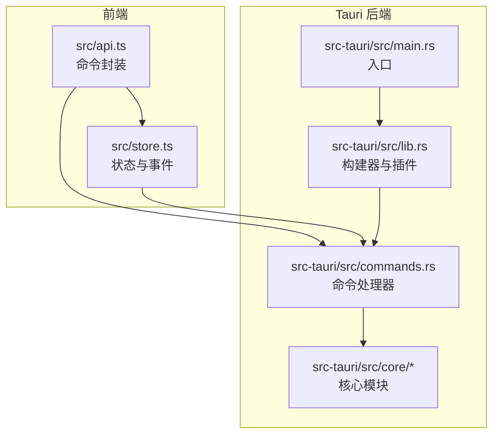
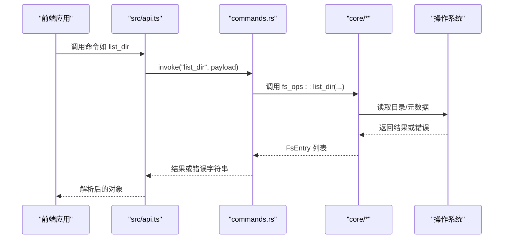
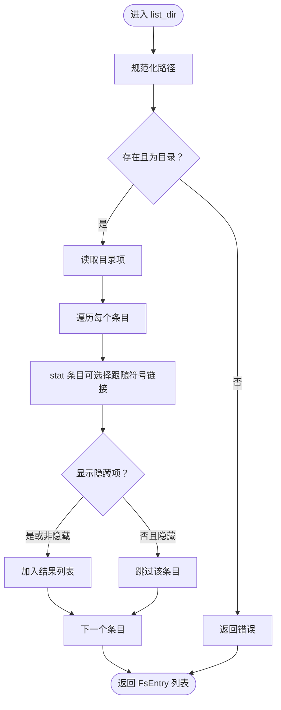
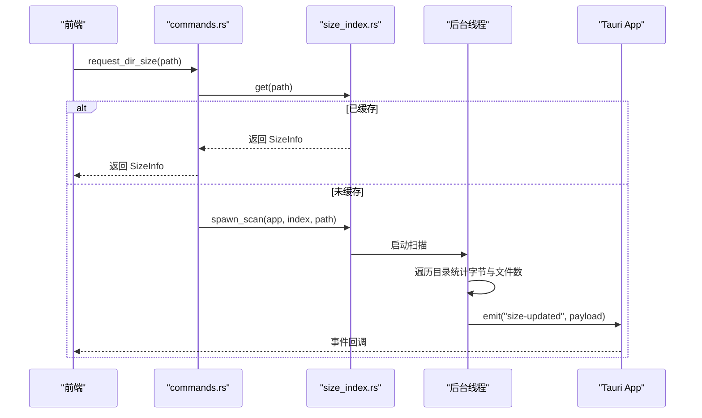
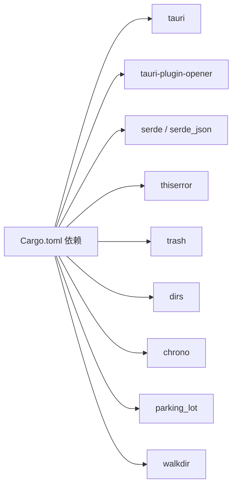

# 后端系统

<cite>
**本文引用的文件**
- [src-tauri/src/main.rs](file://src-tauri/src/main.rs)
- [src-tauri/src/lib.rs](file://src-tauri/src/lib.rs)
- [src-tauri/Cargo.toml](file://src-tauri/Cargo.toml)
- [src-tauri/tauri.conf.json](file://src-tauri/tauri.conf.json)
- [src-tauri/src/commands.rs](file://src-tauri/src/commands.rs)
- [src-tauri/src/core/mod.rs](file://src-tauri/src/core/mod.rs)
- [src-tauri/src/core/error.rs](file://src-tauri/src/core/error.rs)
- [src-tauri/src/core/fs_ops.rs](file://src-tauri/src/core/fs_ops.rs)
- [src-tauri/src/core/paths.rs](file://src-tauri/src/core/paths.rs)
- [src-tauri/src/core/size_index.rs](file://src-tauri/src/core/size_index.rs)
- [src-tauri/src/core/collections.rs](file://src-tauri/src/core/collections.rs)
- [src/api.ts](file://src/api.ts)
- [src/store.ts](file://src/store.ts)
</cite>

## 目录
1. [简介](#简介)
2. [项目结构](#项目结构)
3. [核心组件](#核心组件)
4. [架构总览](#架构总览)
5. [详细组件分析](#详细组件分析)
6. [依赖关系分析](#依赖关系分析)
7. [性能考虑](#性能考虑)
8. [故障排查指南](#故障排查指南)
9. [结论](#结论)
10. [附录：扩展指南](#附录扩展指南)

## 简介
本文件为 LocalBro 后端系统（Rust + Tauri）的技术文档，聚焦于：
- 应用入口与初始化流程，以及 Tauri 插件系统的集成
- 文件系统操作的实现：文件/目录列举、统计、重命名、移动到回收站、永久删除、复制/移动、文本预览、在原生资源管理器中定位等
- 权限与元数据管理：隐藏属性、只读标记、修改/创建时间、扩展名提取
- 目录大小索引的缓存机制、并发扫描与事件通知、性能优化策略
- 路径管理与快捷方式系统：跨平台卷枚举、常用目录快捷方式
- 错误处理体系与用户友好提示
- 扩展新后端功能的实践指南

## 项目结构
后端位于 src-tauri 目录，采用“命令层 + 核心模块”的分层设计：
- 入口与插件：main.rs 负责启动；lib.rs 配置 Tauri Builder、注册插件与命令
- 命令层：commands.rs 将前端调用映射到核心模块函数
- 核心模块：fs_ops（文件系统）、paths（路径与快捷方式）、size_index（目录大小缓存）、collections（收藏夹）、error（统一错误）
- 前端对接：通过 @tauri-apps/api 调用命令，store.ts 维护状态与事件订阅

图表来源
- [src-tauri/src/main.rs:1-7](file://src-tauri/src/main.rs#L1-L7)
- [src-tauri/src/lib.rs:1-45](file://src-tauri/src/lib.rs#L1-L45)
- [src-tauri/src/commands.rs:1-198](file://src-tauri/src/commands.rs#L1-L198)
- [src-tauri/src/core/mod.rs:1-6](file://src-tauri/src/core/mod.rs#L1-L6)

章节来源
- [src-tauri/src/main.rs:1-7](file://src-tauri/src/main.rs#L1-L7)
- [src-tauri/src/lib.rs:1-45](file://src-tauri/src/lib.rs#L1-L45)
- [src-tauri/Cargo.toml:1-36](file://src-tauri/Cargo.toml#L1-L36)
- [src-tauri/tauri.conf.json:1-43](file://src-tauri/tauri.conf.json#L1-L43)

## 核心组件
- 命令层（commands.rs）：暴露给前端的命令，如 list_dir、stat、parent_of、home_path、default_shortcuts、list_volumes、create_directory、create_file、rename、move_to_trash、delete_forever、copy_path、move_path、reveal_in_native、read_text_file、dir_size_cached、request_dir_size、invalidate_dir_size、以及收藏夹相关命令
- 文件系统模块（fs_ops.rs）：实现目录列举、条目统计、父路径、创建/删除、重命名、复制/移动、文本读取、在原生资源管理器中定位等
- 路径与快捷方式（paths.rs）：默认快捷方式（家目录、桌面、文档、下载、图片、音乐、视频）与各平台卷枚举
- 目录大小索引（size_index.rs）：内存缓存 + 后台扫描 + 事件通知
- 收藏夹存储（collections.rs）：JSON 持久化、增删改查、成员变更
- 错误处理（error.rs）：统一错误类型与序列化，便于前端展示

章节来源
- [src-tauri/src/commands.rs:1-198](file://src-tauri/src/commands.rs#L1-L198)
- [src-tauri/src/core/fs_ops.rs:1-360](file://src-tauri/src/core/fs_ops.rs#L1-L360)
- [src-tauri/src/core/paths.rs:1-127](file://src-tauri/src/core/paths.rs#L1-L127)
- [src-tauri/src/core/size_index.rs:1-135](file://src-tauri/src/core/size_index.rs#L1-L135)
- [src-tauri/src/core/collections.rs:1-190](file://src-tauri/src/core/collections.rs#L1-L190)
- [src-tauri/src/core/error.rs:1-50](file://src-tauri/src/core/error.rs#L1-L50)

## 架构总览
后端以 Tauri 2 为核心，通过命令系统桥接前端与操作系统能力。初始化时注入共享状态（目录大小索引）与插件（opener），并将所有命令注册到 Tauri 运行时。

图表来源
- [src-tauri/src/lib.rs:12-42](file://src-tauri/src/lib.rs#L12-L42)
- [src-tauri/src/commands.rs:13-26](file://src-tauri/src/commands.rs#L13-L26)
- [src-tauri/src/core/fs_ops.rs:140-170](file://src-tauri/src/core/fs_ops.rs#L140-L170)

章节来源
- [src-tauri/src/lib.rs:9-43](file://src-tauri/src/lib.rs#L9-L43)
- [src-tauri/src/commands.rs:13-100](file://src-tauri/src/commands.rs#L13-L100)

## 详细组件分析

### 命令层与初始化
- 入口：main.rs 调用 localbro_lib::run
- 初始化：lib.rs 中构建 Tauri Builder，默认配置、注册 SizeIndex 共享状态、加载 tauri-plugin-opener 插件，并将 commands.rs 中的所有命令注册到运行时
- 前端通过 @tauri-apps/api 的 invoke 调用命令，返回值由 core/error.rs 中的 FsError 序列化为字符串，便于前端展示

章节来源
- [src-tauri/src/main.rs:4-6](file://src-tauri/src/main.rs#L4-L6)
- [src-tauri/src/lib.rs:9-43](file://src-tauri/src/lib.rs#L9-L43)
- [src-tauri/src/core/error.rs:43-47](file://src-tauri/src/core/error.rs#L43-L47)

### 文件系统操作（fs_ops）
- 数据模型：FsEntry 包含名称、路径、类型、大小、修改/创建时间、隐藏标志、只读标志、扩展名
- 列举目录：支持是否显示隐藏项、是否跟随符号链接；对不可读条目进行容错跳过
- 统计单个路径：区分文件/目录/符号链接/其他；文件返回大小，目录返回空（延迟计算）
- 路径工具：父路径、规范化
- 创建/删除：目录与文件；删除支持永久删除
- 重命名：检查目标不存在
- 复制/移动：递归复制目录；跨设备移动回退为复制+删除
- 文本读取：限制最大字节数，UTF-8 替换非法字节；返回截断标记与总字节数
- 在原生资源管理器中定位：macOS 使用 open -R，Windows 使用 explorer /select, Linux 使用 xdg-open 打开父目录

图表来源
- [src-tauri/src/core/fs_ops.rs:140-170](file://src-tauri/src/core/fs_ops.rs#L140-L170)
- [src-tauri/src/core/fs_ops.rs:87-138](file://src-tauri/src/core/fs_ops.rs#L87-L138)

章节来源
- [src-tauri/src/core/fs_ops.rs:9-138](file://src-tauri/src/core/fs_ops.rs#L9-L138)
- [src-tauri/src/core/fs_ops.rs:140-360](file://src-tauri/src/core/fs_ops.rs#L140-L360)

### 路径管理与快捷方式（paths）
- 默认快捷方式：基于 dirs crate 获取常用目录（Home/Desktop/Documents/Downloads/Pictures/Music/Videos），仅在存在时加入
- 卷枚举：macOS 基于 /Volumes；Windows 遍历逻辑盘符；Linux 基于 /mnt 与 /media/<user>
- 主页路径：home_path，回退到根目录

章节来源
- [src-tauri/src/core/paths.rs:42-127](file://src-tauri/src/core/paths.rs#L42-L127)

### 目录大小索引（size_index）
- 缓存结构：SizeIndex 内部维护两份哈希表：cache（绝对路径 -> SizeInfo）与 inflight（正在扫描的路径）
- SizeInfo：包含字节数、文件数、计算完成时间
- 并发扫描：请求未命中缓存时，若不在 in-flight，则启动后台线程执行扫描；扫描完成后写入缓存并通过 Tauri 事件发出 size-updated
- 去重：inflight 避免重复扫描同一路径
- 失败处理：扫描失败不更新缓存，前端不会收到事件

图表来源
- [src-tauri/src/commands.rs:110-126](file://src-tauri/src/commands.rs#L110-L126)
- [src-tauri/src/core/size_index.rs:60-104](file://src-tauri/src/core/size_index.rs#L60-L104)
- [src-tauri/src/core/size_index.rs:106-135](file://src-tauri/src/core/size_index.rs#L106-L135)

章节来源
- [src-tauri/src/core/size_index.rs:17-53](file://src-tauri/src/core/size_index.rs#L17-L53)
- [src-tauri/src/core/size_index.rs:60-104](file://src-tauri/src/core/size_index.rs#L60-L104)

### 收藏夹（collections）
- 数据模型：Collection 包含 id、name、颜色、图标、创建/更新时间、绝对路径列表
- 存储：collections.json，按创建时间排序持久化
- 操作：创建、更新、删除、添加/移除条目、查询某路径所属集合
- 加载：应用启动时从 app_data_dir 下加载，失败则忽略

章节来源
- [src-tauri/src/core/collections.rs:19-163](file://src-tauri/src/core/collections.rs#L19-L163)

### 错误处理（error）
- 统一错误类型：NotFound、PermissionDenied、AlreadyExists、InvalidPath、Io、Unsupported、Internal
- IO 映射：自动将 std::io::Error 映射到对应 FsError 变体
- 序列化：错误序列化为字符串，便于前端展示

章节来源
- [src-tauri/src/core/error.rs:7-47](file://src-tauri/src/core/error.rs#L7-L47)

## 依赖关系分析
- 依赖清单：tauri、tauri-plugin-opener、serde、serde_json、thiserror、trash、dirs、chrono、parking_lot、walkdir
- 构建配置：lib crate 类型包含 staticlib、cdylib、rlib，适配前端动态加载
- 配置：tauri.conf.json 定义窗口、安全策略（asset protocol）、打包图标等

图表来源
- [src-tauri/Cargo.toml:17-27](file://src-tauri/Cargo.toml#L17-L27)

章节来源
- [src-tauri/Cargo.toml:1-36](file://src-tauri/Cargo.toml#L1-L36)
- [src-tauri/tauri.conf.json:1-43](file://src-tauri/tauri.conf.json#L1-L43)

## 性能考虑
- 目录扫描
  - 使用 walkdir 递归遍历，过滤掉非文件类型，避免统计符号链接元数据
  - 通过 inflight 去重，避免重复扫描相同路径
  - 使用 saturating_add 防止 u64 溢出
- 缓存策略
  - SizeIndex 以绝对路径为键，缓存 SizeInfo；前端 store.ts 也维护本地映射，减少重复请求
  - 请求未命中时立即返回空，后台异步计算并事件通知
- I/O 与线程
  - 后台线程执行扫描，避免阻塞主线程
  - 使用 parking_lot::Mutex 提升锁性能
- 前端优化
  - 列表刷新时仅替换当前页面，避免全量重渲染
  - 文本预览限制最大读取字节数，防止大文件导致内存压力

章节来源
- [src-tauri/src/core/size_index.rs:106-135](file://src-tauri/src/core/size_index.rs#L106-L135)
- [src-tauri/src/core/fs_ops.rs:294-318](file://src-tauri/src/core/fs_ops.rs#L294-L318)
- [src/store.ts:171-181](file://src/store.ts#L171-L181)

## 故障排查指南
- 常见错误与处理
  - 路径不存在：返回 NotFound；前端应提示用户路径已不存在
  - 权限不足：返回 PermissionDenied；建议引导用户提升权限或切换目录
  - 目标已存在：返回 AlreadyExists；提示用户更改名称或覆盖
  - 非法路径：返回 InvalidPath；检查路径格式
  - IO 错误：返回 Io；记录详细信息并提示重试
  - 不支持的操作：返回 Unsupported；前端显示不可用
- 目录大小扫描
  - 若长时间无响应，检查 inflight 是否被占用（重复请求）或扫描异常
  - 事件未到达：确认 size-updated 事件监听是否正确绑定
- 前端交互
  - 列表为空但无错误：检查 showHidden 选项与权限
  - 文本预览内容被截断：调整 maxBytes 或直接下载查看

章节来源
- [src-tauri/src/core/error.rs:8-41](file://src-tauri/src/core/error.rs#L8-L41)
- [src-tauri/src/core/size_index.rs:77-98](file://src-tauri/src/core/size_index.rs#L77-L98)

## 结论
LocalBro 后端以清晰的分层架构实现了跨平台文件浏览的核心能力：稳定的命令接口、健壮的文件系统操作、高效的目录大小缓存与并发扫描、完善的错误处理与用户提示。通过 Tauri 插件系统与前端无缝衔接，既保证了性能，又提供了良好的可扩展性。

## 附录：扩展指南
- 新增命令步骤
  1) 在 core/mod.rs 中声明新模块并在 lib.rs 中导出
  2) 在 commands.rs 中新增 #[tauri::command] 函数，参数使用 serde 可序列化类型
  3) 在 lib.rs 的 .invoke_handler 注册新命令
  4) 在前端 src/api.ts 中新增封装函数，返回 Promise<T>
  5) 在 store.ts 中调用并更新状态
- 新增文件系统操作
  - 在 core/fs_ops.rs 中添加函数，遵循现有错误返回模式
  - 对于需要权限/元数据的场景，注意隐藏属性与只读标记的处理
- 新增缓存或扫描
  - 参考 size_index.rs 的缓存与事件模式，确保并发安全与去重
  - 如需增量监控，可在后续版本引入 notify/watcher
- 新增平台特定功能
  - 在 paths.rs 或 fs_ops.rs 中按 cfg(target_os) 添加分支
  - 注意与现有跨平台行为保持一致

章节来源
- [src-tauri/src/lib.rs:15-41](file://src-tauri/src/lib.rs#L15-L41)
- [src-tauri/src/commands.rs:13-198](file://src-tauri/src/commands.rs#L13-L198)
- [src/api.ts:37-137](file://src/api.ts#L37-L137)
- [src/store.ts:76-194](file://src/store.ts#L76-L194)