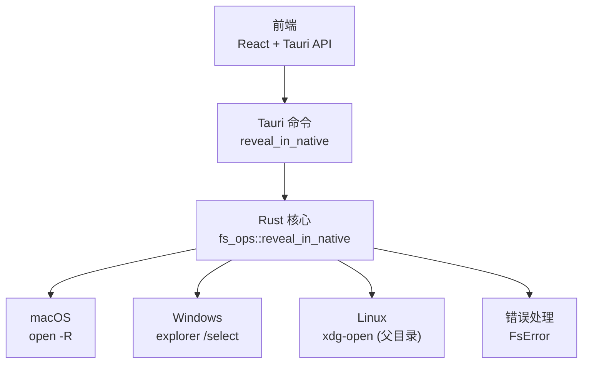
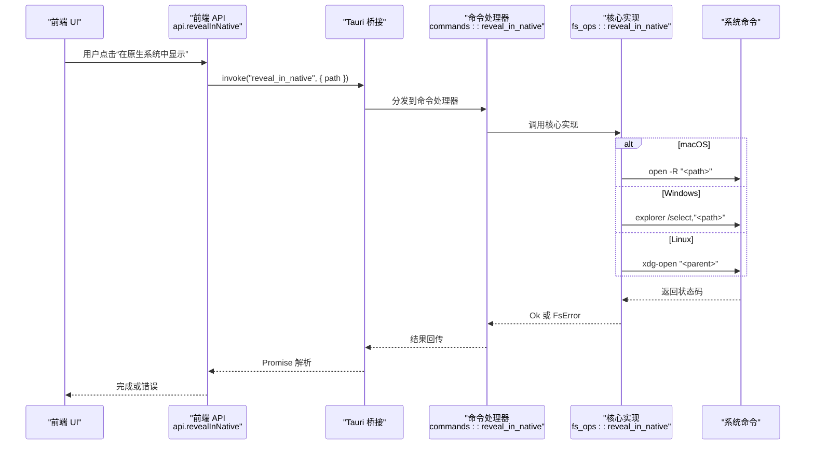
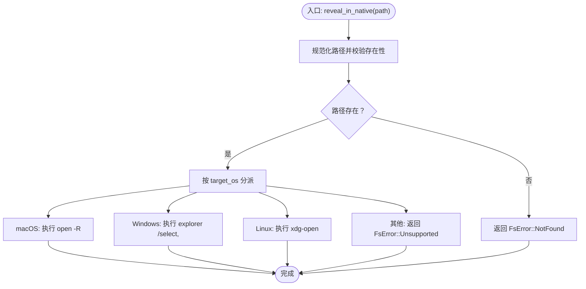
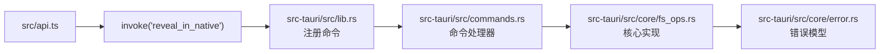

# 原生系统集成

<cite>
**本文引用的文件**
- [src-tauri/src/lib.rs](file://src-tauri/src/lib.rs)
- [src-tauri/src/main.rs](file://src-tauri/src/main.rs)
- [src-tauri/src/commands.rs](file://src-tauri/src/commands.rs)
- [src-tauri/src/core/fs_ops.rs](file://src-tauri/src/core/fs_ops.rs)
- [src-tauri/src/core/error.rs](file://src-tauri/src/core/error.rs)
- [src-tauri/src/core/paths.rs](file://src-tauri/src/core/paths.rs)
- [src-tauri/Cargo.toml](file://src-tauri/Cargo.toml)
- [src/api.ts](file://src/api.ts)
- [src/components/FileList.tsx](file://src/components/FileList.tsx)
- [src/store.ts](file://src/store.ts)
</cite>

## 目录
1. [简介](#简介)
2. [项目结构](#项目结构)
3. [核心组件](#核心组件)
4. [架构总览](#架构总览)
5. [详细组件分析](#详细组件分析)
6. [依赖关系分析](#依赖关系分析)
7. [性能考量](#性能考量)
8. [故障排除指南](#故障排除指南)
9. [结论](#结论)
10. [附录](#附录)

## 简介
本文件聚焦 LocalBro 的“在原生系统中显示”（reveal in native）能力，系统性解析其跨平台实现：macOS 的 open -R、Windows 的 explorer /select、Linux 的 xdg-open 方案；解释条件编译与平台差异；梳理文件定位与目录展开两类策略；并提供使用示例与排障建议。

## 项目结构
- 前端通过 @tauri-apps/api 调用后端命令，命令名统一为 reveal_in_native。
- 后端在 Tauri 构建期注册命令，并在运行时根据目标平台调用系统命令。
- 错误类型统一由 FsError 抽象，便于前端接收一致的错误语义。

图表来源
- [src/api.ts:99-101](file://src/api.ts#L99-L101)
- [src-tauri/src/commands.rs:81-84](file://src-tauri/src/commands.rs#L81-L84)
- [src-tauri/src/core/fs_ops.rs:320-359](file://src-tauri/src/core/fs_ops.rs#L320-L359)
- [src-tauri/src/core/error.rs:8-29](file://src-tauri/src/core/error.rs#L8-L29)

章节来源
- [src/api.ts:99-101](file://src/api.ts#L99-L101)
- [src-tauri/src/lib.rs:26-68](file://src-tauri/src/lib.rs#L26-L68)
- [src-tauri/src/commands.rs:81-84](file://src-tauri/src/commands.rs#L81-L84)
- [src-tauri/src/core/fs_ops.rs:320-359](file://src-tauri/src/core/fs_ops.rs#L320-L359)
- [src-tauri/src/core/error.rs:8-29](file://src-tauri/src/core/error.rs#L8-L29)

## 核心组件
- 前端 API 封装：提供 revealInNative(path) 方法，内部通过 invoke 调用后端命令。
- 后端命令注册：在应用启动时注册 reveal_in_native 命令。
- 核心实现：fs_ops::reveal_in_native 在运行时根据 target_os 分派到不同平台命令。
- 错误模型：FsError 统一错误语义，包含 Not Found、Permission Denied、Io、Unsupported 等。

章节来源
- [src/api.ts:99-101](file://src/api.ts#L99-L101)
- [src-tauri/src/lib.rs:26-68](file://src-tauri/src/lib.rs#L26-L68)
- [src-tauri/src/commands.rs:81-84](file://src-tauri/src/commands.rs#L81-L84)
- [src-tauri/src/core/fs_ops.rs:320-359](file://src-tauri/src/core/fs_ops.rs#L320-L359)
- [src-tauri/src/core/error.rs:8-29](file://src-tauri/src/core/error.rs#L8-L29)

## 架构总览
从用户触发到系统文件管理器响应的完整链路如下：

图表来源
- [src/api.ts:99-101](file://src/api.ts#L99-L101)
- [src-tauri/src/commands.rs:81-84](file://src-tauri/src/commands.rs#L81-L84)
- [src-tauri/src/core/fs_ops.rs:320-359](file://src-tauri/src/core/fs_ops.rs#L320-L359)

## 详细组件分析

### 前端封装与调用
- 前端通过 api.revealInNative(path) 调用后端命令，内部使用 @tauri-apps/api 的 invoke。
- 调用成功无返回值，失败则抛出可捕获的错误字符串（由 FsError 序列化而来）。

章节来源
- [src/api.ts:99-101](file://src/api.ts#L99-L101)

### 命令注册与分发
- 应用启动时，通过 generate_handler! 注册 reveal_in_native 命令。
- 命令处理器直接委托给 fs_ops::reveal_in_native。

章节来源
- [src-tauri/src/lib.rs:26-68](file://src-tauri/src/lib.rs#L26-L68)
- [src-tauri/src/commands.rs:81-84](file://src-tauri/src/commands.rs#L81-L84)

### 核心实现与平台差异
- 入口函数对路径进行存在性检查，不存在则返回 FsError::NotFound。
- 条件编译按 target_os 分派：
  - macOS：使用 open -R 定位文件。
  - Windows：使用 explorer /select 参数选中文件。
  - Linux：由于系统行为差异较大，采用打开父目录的折衷方案。
- 不支持的平台返回 FsError::Unsupported。

图表来源
- [src-tauri/src/core/fs_ops.rs:320-359](file://src-tauri/src/core/fs_ops.rs#L320-L359)

章节来源
- [src-tauri/src/core/fs_ops.rs:320-359](file://src-tauri/src/core/fs_ops.rs#L320-L359)

### 错误处理与语义
- FsError 提供统一序列化，前端收到字符串形式的错误描述。
- 常见错误包括：路径不存在、权限不足、IO 失败、不支持的操作等。

章节来源
- [src-tauri/src/core/error.rs:8-29](file://src-tauri/src/core/error.rs#L8-L29)

### 文件定位策略与差异
- 文件定位（macOS/Windows）：直接将目标文件作为参数传递给系统命令，文件被选中并高亮。
- 目录展开（Linux）：由于 xdg-open 行为差异，采用“打开父目录”的策略，文件无法直接选中，但用户可手动定位。

章节来源
- [src-tauri/src/core/fs_ops.rs:346-355](file://src-tauri/src/core/fs_ops.rs#L346-L355)

### 使用示例
- 在前端任意位置调用 api.revealInNative(目标路径)，即可唤起对应平台的文件管理器。
- 若目标路径不存在或不可访问，前端会收到错误提示，可引导用户检查路径或权限。

章节来源
- [src/api.ts:99-101](file://src/api.ts#L99-L101)

## 依赖关系分析
- 前端依赖 @tauri-apps/api 进行命令调用。
- 后端依赖 tauri 与 tauri-plugin-opener（用于其他文件关联场景），但 reveal_in_native 仅使用标准库进程执行。
- Cargo.toml 中未声明额外平台依赖，条件编译在运行时生效。

图表来源
- [src/api.ts:99-101](file://src/api.ts#L99-L101)
- [src-tauri/src/lib.rs:26-68](file://src-tauri/src/lib.rs#L26-L68)
- [src-tauri/src/commands.rs:81-84](file://src-tauri/src/commands.rs#L81-L84)
- [src-tauri/src/core/fs_ops.rs:320-359](file://src-tauri/src/core/fs_ops.rs#L320-L359)
- [src-tauri/src/core/error.rs:8-29](file://src-tauri/src/core/error.rs#L8-L29)

章节来源
- [src-tauri/Cargo.toml:17-31](file://src-tauri/Cargo.toml#L17-L31)
- [src-tauri/src/lib.rs:26-68](file://src-tauri/src/lib.rs#L26-L68)
- [src-tauri/src/commands.rs:81-84](file://src-tauri/src/commands.rs#L81-L84)
- [src-tauri/src/core/fs_ops.rs:320-359](file://src-tauri/src/core/fs_ops.rs#L320-L359)
- [src-tauri/src/core/error.rs:8-29](file://src-tauri/src/core/error.rs#L8-L29)

## 性能考量
- 命令本身为轻量级外部进程调用，开销主要取决于系统命令启动时间与文件管理器响应速度。
- Linux 采用打开父目录的策略，避免复杂的选择逻辑，减少不确定性带来的额外开销。
- 建议：在高频触发场景下，前端可做去抖动或节流，避免重复调用。

## 故障排除指南
- 路径不存在
  - 现象：前端收到“路径不存在”类错误。
  - 排查：确认路径是否正确、是否已被移动或删除。
  - 参考：FsError::NotFound。
- 权限不足
  - 现象：系统命令执行失败。
  - 排查：检查文件/目录权限，必要时以管理员身份运行或调整权限。
  - 参考：FsError::PermissionDenied。
- IO 失败
  - 现象：系统命令返回非零退出码。
  - 排查：查看系统日志或终端输出；确认系统命令可用性。
  - 参考：FsError::Io。
- 平台不支持
  - 现象：返回“不支持的操作”。
  - 排查：当前构建目标不在 macOS/Windows/Linux 之一；请切换到受支持平台。
  - 参考：FsError::Unsupported。
- Linux 下文件未被选中
  - 现象：仅打开父目录，文件未被选中。
  - 说明：Linux 行为限制所致，属于预期行为。
  - 建议：手动在文件管理器中定位文件。

章节来源
- [src-tauri/src/core/error.rs:8-29](file://src-tauri/src/core/error.rs#L8-L29)
- [src-tauri/src/core/fs_ops.rs:346-355](file://src-tauri/src/core/fs_ops.rs#L346-L355)

## 结论
LocalBro 的“在原生系统中显示”功能通过简洁的条件编译与平台适配，实现了跨平台的一致体验。macOS 与 Windows 支持精确文件定位，Linux 则采用父目录打开的折衷方案。整体设计以最小依赖、清晰错误语义与良好可维护性为目标，满足日常文件浏览与定位需求。

## 附录
- 平台特定实现要点
  - macOS：open -R 是 Finder 的官方参数，可直接选中文件。
  - Windows：explorer /select 参数可选中指定文件。
  - Linux：xdg-open 对具体文件的支持不一，采用打开父目录作为最佳努力。
- 相关文件索引
  - 前端调用：[src/api.ts:99-101](file://src/api.ts#L99-L101)
  - 命令注册：[src-tauri/src/lib.rs:26-68](file://src-tauri/src/lib.rs#L26-L68)
  - 命令处理：[src-tauri/src/commands.rs:81-84](file://src-tauri/src/commands.rs#L81-L84)
  - 核心实现：[src-tauri/src/core/fs_ops.rs:320-359](file://src-tauri/src/core/fs_ops.rs#L320-L359)
  - 错误模型：[src-tauri/src/core/error.rs:8-29](file://src-tauri/src/core/error.rs#L8-L29)