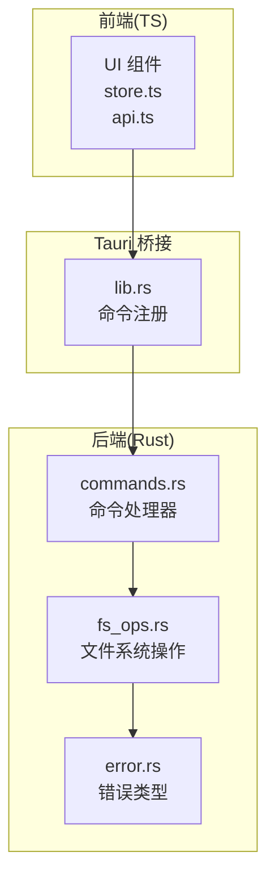
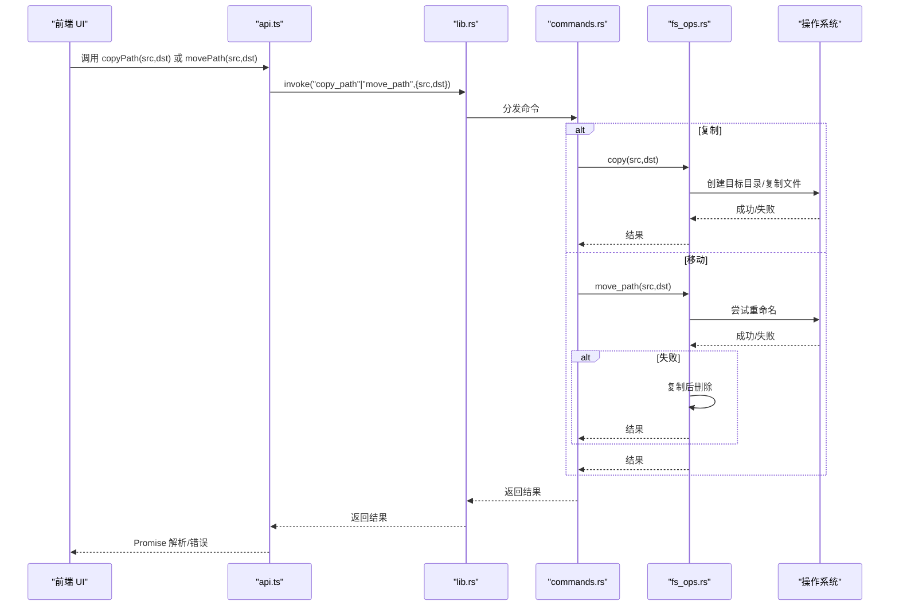
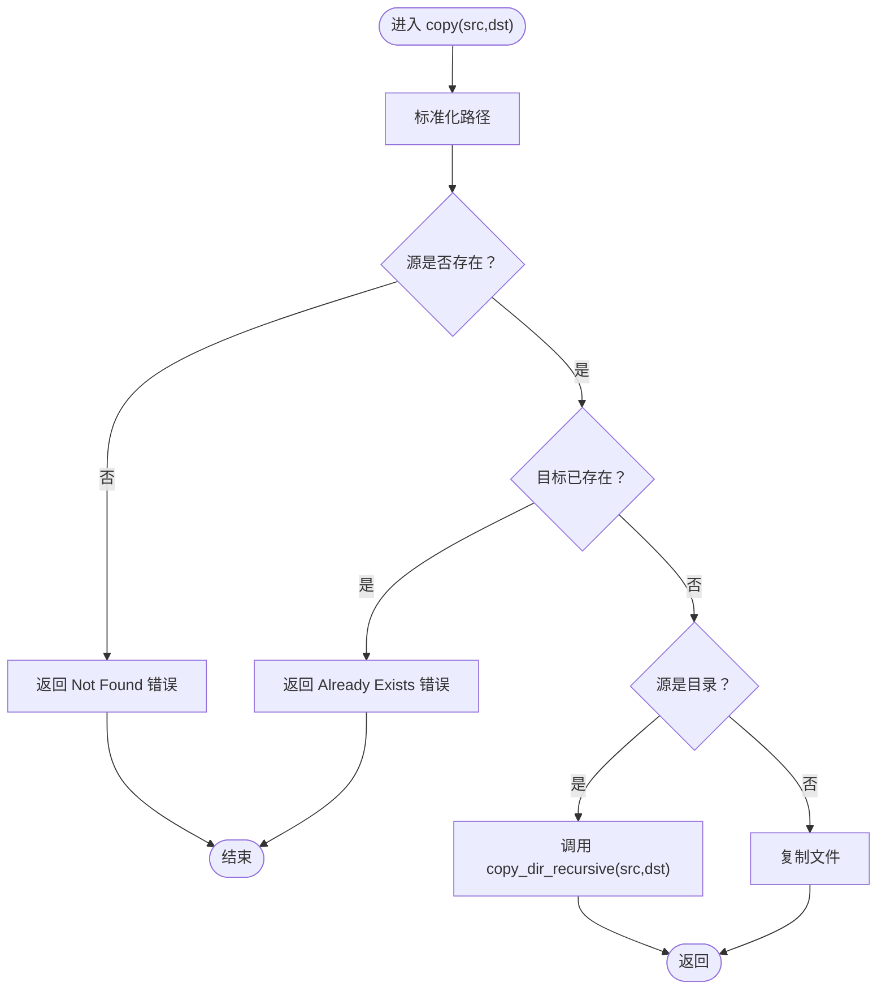
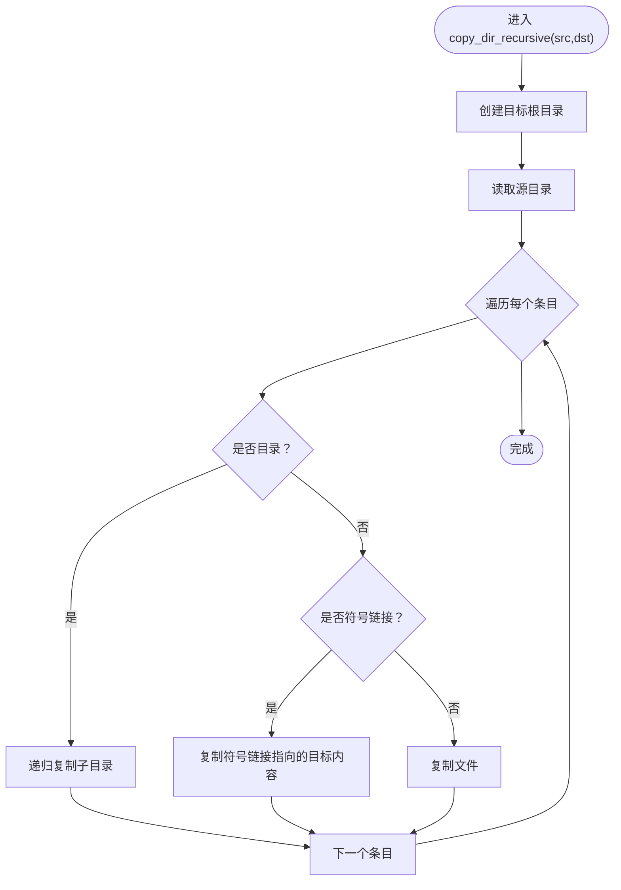
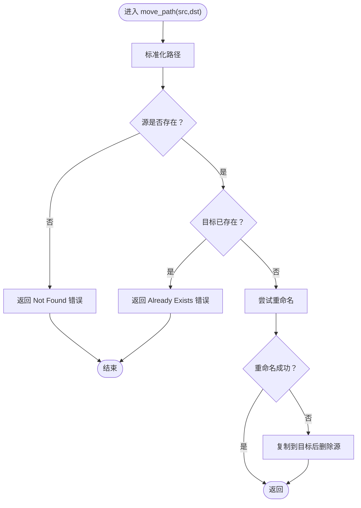
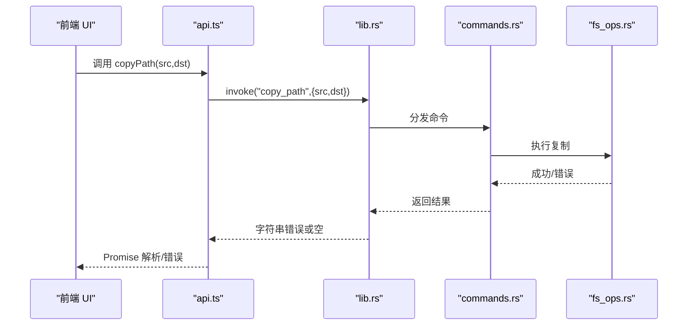
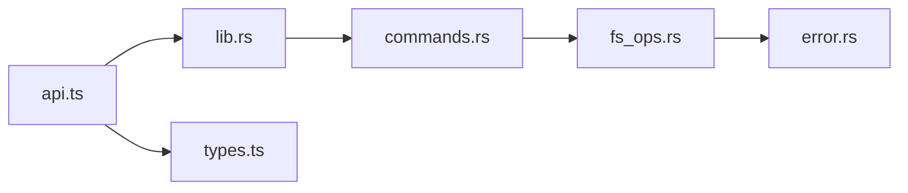
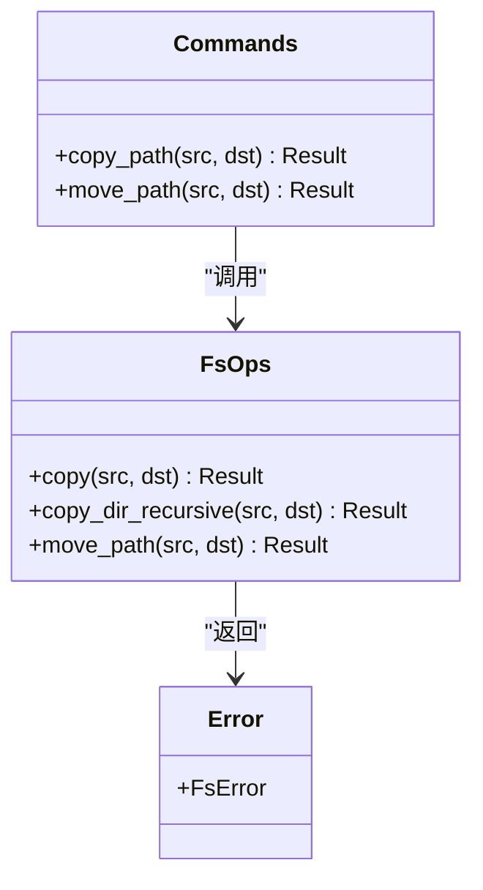

# 文件复制移动

<cite>
**本文引用的文件**
- [fs_ops.rs](file://src-tauri/src/core/fs_ops.rs)
- [commands.rs](file://src-tauri/src/commands.rs)
- [lib.rs](file://src-tauri/src/lib.rs)
- [error.rs](file://src-tauri/src/core/error.rs)
- [api.ts](file://src/api.ts)
- [store.ts](file://src/store.ts)
- [types.ts](file://src/types.ts)
</cite>

## 目录
1. [简介](#简介)
2. [项目结构](#项目结构)
3. [核心组件](#核心组件)
4. [架构总览](#架构总览)
5. [详细组件分析](#详细组件分析)
6. [依赖关系分析](#依赖关系分析)
7. [性能考量](#性能考量)
8. [故障排查指南](#故障排查指南)
9. [结论](#结论)
10. [附录](#附录)

## 简介
本文件聚焦 LocalBro 的文件复制与移动能力，围绕 Rust 后端的 copy 与 move_path 实现，系统性解析：
- 复制函数 copy 的实现机制与边界条件
- 递归复制 copy_dir_recursive 的目录树遍历、符号链接处理与错误恢复
- 移动函数 move_path 的智能移动策略：同设备重命名优化与跨设备复制删除回退
- 前端通过 Tauri IPC 调用后端命令的流程与错误传播
- 使用示例与性能优化建议

## 项目结构
LocalBro 采用 Tauri 架构，前端使用 TypeScript/Vue（或 React），后端使用 Rust。文件复制与移动功能位于后端 Rust 模块中，并通过 Tauri 命令暴露给前端。

图表来源
- [lib.rs:13-69](file://src-tauri/src/lib.rs#L13-L69)
- [commands.rs:16-79](file://src-tauri/src/commands.rs#L16-L79)
- [fs_ops.rs:258-292](file://src-tauri/src/core/fs_ops.rs#L258-L292)
- [error.rs:8-49](file://src-tauri/src/core/error.rs#L8-L49)

章节来源
- [lib.rs:13-69](file://src-tauri/src/lib.rs#L13-L69)
- [commands.rs:16-79](file://src-tauri/src/commands.rs#L16-L79)

## 核心组件
- 复制函数 copy：支持文件与目录复制，目录采用递归复制；目标路径必须不存在；返回结果包含错误类型。
- 递归复制 copy_dir_recursive：遍历源目录，按条目类型分别处理文件、目录与符号链接；目录递归、符号链接按目标内容复制。
- 移动函数 move_path：优先尝试同设备内重命名；失败则回退到复制后删除原路径。
- 前端命令封装：前端通过 api.ts 的 copyPath 与 movePath 调用后端命令，错误以字符串形式返回前端统一处理。

章节来源
- [fs_ops.rs:258-292](file://src-tauri/src/core/fs_ops.rs#L258-L292)
- [api.ts:91-97](file://src/api.ts#L91-L97)

## 架构总览
下图展示从 UI 到后端命令再到文件系统操作的整体调用链路与错误传播。

图表来源
- [api.ts:91-97](file://src/api.ts#L91-L97)
- [lib.rs:27-66](file://src-tauri/src/lib.rs#L27-L66)
- [commands.rs:72-79](file://src-tauri/src/commands.rs#L72-L79)
- [fs_ops.rs:258-292](file://src-tauri/src/core/fs_ops.rs#L258-L292)

## 详细组件分析

### 复制函数 copy 的实现机制
- 输入校验：源路径存在性检查；目标路径不存在检查；非法路径与权限错误转换为统一错误类型。
- 目录复制：委托递归复制函数 copy_dir_recursive。
- 文件复制：直接调用底层复制接口。
- 错误传播：所有 IO 错误映射为 FsError，前端以字符串形式接收。

图表来源
- [fs_ops.rs:258-274](file://src-tauri/src/core/fs_ops.rs#L258-L274)

章节来源
- [fs_ops.rs:258-274](file://src-tauri/src/core/fs_ops.rs#L258-L274)
- [error.rs:31-41](file://src-tauri/src/core/error.rs#L31-L41)

### 递归复制 copy_dir_recursive 的目录树处理
- 目标目录创建：确保目标根目录存在。
- 遍历源目录：逐条读取目录项，区分文件、目录与符号链接。
- 递归策略：
  - 目录：递归调用自身，保持层级结构。
  - 符号链接：遵循链接目标并复制其内容（非符号链接本身）。
  - 文件：直接复制。
- 错误恢复：遇到不可读取的条目时跳过，避免整次复制失败。

图表来源
- [fs_ops.rs:237-256](file://src-tauri/src/core/fs_ops.rs#L237-L256)

章节来源
- [fs_ops.rs:237-256](file://src-tauri/src/core/fs_ops.rs#L237-L256)

### 移动函数 move_path 的智能移动逻辑
- 同设备重命名优化：优先尝试原地重命名，速度快且原子性强。
- 跨设备回退策略：若重命名失败（如跨设备），自动执行“复制 + 删除”回退，保证语义一致。
- 边界条件：源存在性与目标不存在性检查，错误类型与复制一致。

图表来源
- [fs_ops.rs:276-292](file://src-tauri/src/core/fs_ops.rs#L276-L292)

章节来源
- [fs_ops.rs:276-292](file://src-tauri/src/core/fs_ops.rs#L276-L292)

### 前端调用与错误处理
- 命令封装：前端通过 api.ts 的 copyPath 与 movePath 发起 IPC 调用。
- 错误传播：后端命令返回 FsError，序列化为字符串传递至前端；前端捕获并提示用户。
- 类型映射：后端返回的字段名采用 snake_case，前端在 api.ts 中进行驼峰化映射。

图表来源
- [api.ts:91-97](file://src/api.ts#L91-L97)
- [commands.rs:72-74](file://src-tauri/src/commands.rs#L72-L74)
- [lib.rs:27-66](file://src-tauri/src/lib.rs#L27-L66)

章节来源
- [api.ts:91-97](file://src/api.ts#L91-L97)
- [commands.rs:72-74](file://src-tauri/src/commands.rs#L72-L74)
- [lib.rs:27-66](file://src-tauri/src/lib.rs#L27-L66)

## 依赖关系分析
- 命令层依赖：commands.rs 依赖 fs_ops.rs 提供的复制与移动实现。
- 错误层依赖：fs_ops.rs 依赖 error.rs 定义的 FsError 类型与错误映射。
- 前端依赖：api.ts 依赖 Tauri invoke 机制，将命令名与参数传递至后端。
- 类型层：types.ts 定义 FsEntry 等类型，api.ts 在边界处进行字段名转换。

图表来源
- [api.ts:1-317](file://src/api.ts#L1-L317)
- [lib.rs:13-69](file://src-tauri/src/lib.rs#L13-L69)
- [commands.rs:16-79](file://src-tauri/src/commands.rs#L16-L79)
- [fs_ops.rs:258-292](file://src-tauri/src/core/fs_ops.rs#L258-L292)
- [error.rs:8-49](file://src-tauri/src/core/error.rs#L8-L49)
- [types.ts:1-37](file://src/types.ts#L1-L37)

章节来源
- [api.ts:1-317](file://src/api.ts#L1-L317)
- [lib.rs:13-69](file://src-tauri/src/lib.rs#L13-L69)
- [commands.rs:16-79](file://src-tauri/src/commands.rs#L16-L79)
- [fs_ops.rs:258-292](file://src-tauri/src/core/fs_ops.rs#L258-L292)
- [error.rs:8-49](file://src-tauri/src/core/error.rs#L8-L49)
- [types.ts:1-37](file://src/types.ts#L1-L37)

## 性能考量
- 同设备重命名：move_path 优先使用重命名，避免数据拷贝，性能最优且原子性强。
- 跨设备移动：回退策略会触发完整复制再删除，I/O 开销较大；建议尽量在同一文件系统内操作。
- 递归复制：copy_dir_recursive 对每个条目进行一次系统调用，大量小文件场景可能受系统调用开销影响；可考虑批量或分批处理策略（当前实现为逐条处理，简单可靠）。
- 符号链接处理：复制符号链接指向的内容而非链接本身，避免跨卷符号链接失效问题，但可能导致重复数据；如需保留链接语义，可在上层业务逻辑中做特殊处理。
- 错误短路：遇到不可读取条目时跳过，避免整次复制阻塞；如需严格一致性，可在上层增加额外校验。

[本节为通用性能讨论，不直接分析具体文件]

## 故障排查指南
- 常见错误类型
  - Not Found：源路径不存在或目标路径已存在。
  - Permission Denied：无权限访问源或目标路径。
  - Already Exists：目标路径已存在。
  - Io：其他 IO 异常。
- 排查步骤
  - 确认源路径存在且可读。
  - 确认目标路径不存在。
  - 检查权限与磁盘空间。
  - 若为跨设备移动，确认设备挂载状态与文件系统兼容性。
  - 查看后端日志与前端错误提示，定位具体失败点。
- 建议
  - 在 UI 层对用户输入进行预检查，减少无效调用。
  - 对大目录复制提供进度反馈与取消机制（当前实现未内置进度，可在上层扩展）。

章节来源
- [error.rs:8-49](file://src-tauri/src/core/error.rs#L8-L49)
- [fs_ops.rs:258-292](file://src-tauri/src/core/fs_ops.rs#L258-L292)

## 结论
LocalBro 的复制与移动功能以简洁可靠的实现为核心：copy 提供基础的文件/目录复制，copy_dir_recursive 保障目录树的完整复制与符号链接的安全处理；move_path 在性能与可靠性之间取得平衡，优先重命名并在必要时回退到复制删除。前端通过 Tauri IPC 将这些能力无缝集成到 UI 流程中。对于大规模文件操作，建议结合上层进度与取消机制提升用户体验。

[本节为总结性内容，不直接分析具体文件]

## 附录

### 使用示例（路径指引）
- 复制单个文件
  - 前端调用：[api.ts:91-97](file://src/api.ts#L91-L97)
  - 后端命令：[commands.rs:72-74](file://src-tauri/src/commands.rs#L72-L74)
  - 实现细节：[fs_ops.rs:258-274](file://src-tauri/src/core/fs_ops.rs#L258-L274)
- 复制整个目录
  - 递归实现：[fs_ops.rs:237-256](file://src-tauri/src/core/fs_ops.rs#L237-L256)
- 移动文件/目录（同设备重命名优先）
  - 命令入口：[commands.rs:77-79](file://src-tauri/src/commands.rs#L77-L79)
  - 实现细节：[fs_ops.rs:276-292](file://src-tauri/src/core/fs_ops.rs#L276-L292)

### 关键流程类图（代码级）

图表来源
- [fs_ops.rs:258-292](file://src-tauri/src/core/fs_ops.rs#L258-L292)
- [commands.rs:72-79](file://src-tauri/src/commands.rs#L72-L79)
- [error.rs:8-49](file://src-tauri/src/core/error.rs#L8-L49)