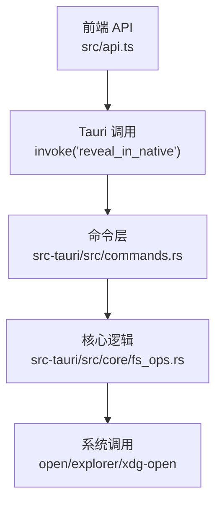
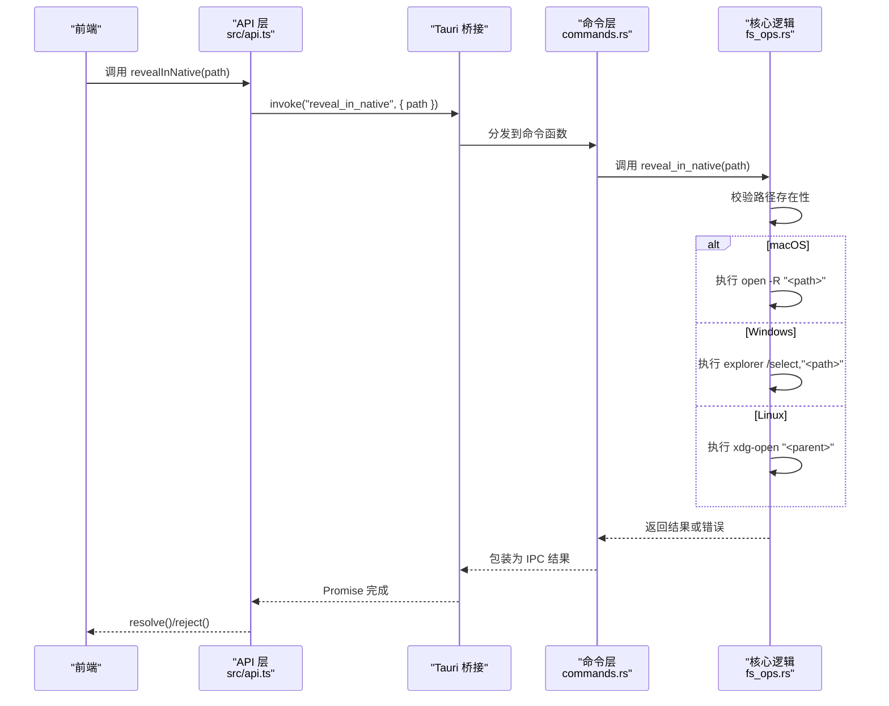
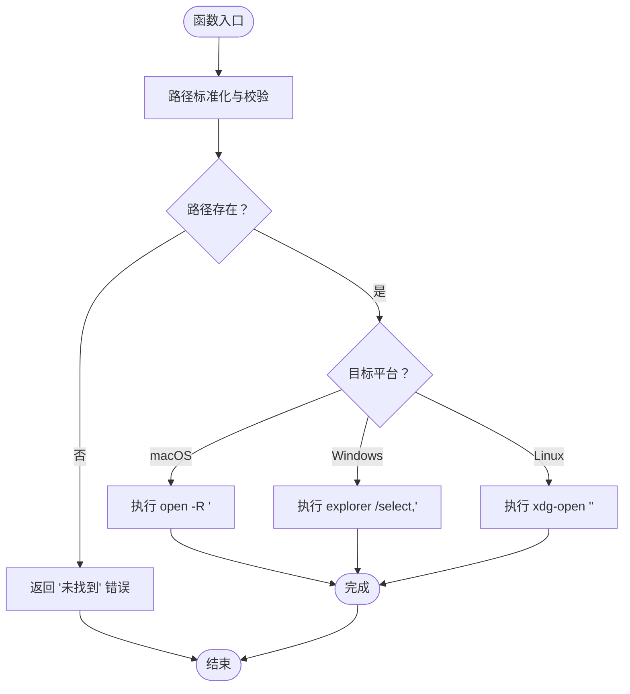
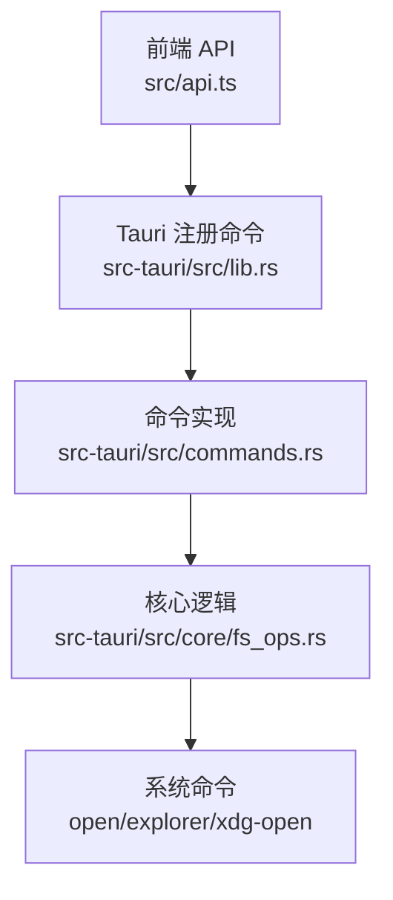

# 原生系统集成

<cite>
**本文引用的文件**
- [src-tauri/src/commands.rs](file://src-tauri/src/commands.rs)
- [src-tauri/src/core/fs_ops.rs](file://src-tauri/src/core/fs_ops.rs)
- [src-tauri/src/lib.rs](file://src-tauri/src/lib.rs)
- [src/api.ts](file://src/api.ts)
- [src-tauri/src/core/error.rs](file://src-tauri/src/core/error.rs)
- [src-tauri/Cargo.toml](file://src-tauri/Cargo.toml)
- [src-tauri/tauri.conf.json](file://src-tauri/tauri.conf.json)
</cite>

## 目录
1. [简介](#简介)
2. [项目结构](#项目结构)
3. [核心组件](#核心组件)
4. [架构总览](#架构总览)
5. [详细组件分析](#详细组件分析)
6. [依赖关系分析](#依赖关系分析)
7. [性能考量](#性能考量)
8. [故障排查指南](#故障排查指南)
9. [结论](#结论)
10. [附录](#附录)

## 简介
本文件聚焦 LocalBro 的“在原生文件管理器中定位”能力（即 reveal_in_native），系统性说明其跨平台实现机制与安全设计。该能力通过前端调用统一的 API，经由 Tauri 桥接至 Rust 后端，在 macOS、Windows、Linux 上分别使用 open -R、explorer /select、xdg-open 进行原生系统集成；同时包含路径校验、错误处理与安全注意事项，确保在多平台上稳定可用。

## 项目结构
- 前端通过 API 层暴露 revealInNative 方法，封装 Tauri invoke 调用。
- Tauri 在后端注册命令处理器，将前端请求转发到 Rust 命令函数。
- Rust 命令函数进一步调用核心文件操作模块，按目标平台执行系统命令。

图表来源
- [src/api.ts:99-101](file://src/api.ts#L99-L101)
- [src-tauri/src/commands.rs:82-84](file://src-tauri/src/commands.rs#L82-L84)
- [src-tauri/src/core/fs_ops.rs:320-359](file://src-tauri/src/core/fs_ops.rs#L320-L359)

章节来源
- [src/api.ts:99-101](file://src/api.ts#L99-L101)
- [src-tauri/src/commands.rs:82-84](file://src-tauri/src/commands.rs#L82-L84)
- [src-tauri/src/core/fs_ops.rs:320-359](file://src-tauri/src/core/fs_ops.rs#L320-L359)

## 核心组件
- 前端 API：提供 revealInNative(path) 统一入口，内部通过 Tauri invoke 触发后端命令。
- 命令层：声明并导出 reveal_in_native 命令，作为前端与后端的桥接。
- 核心逻辑：实现跨平台定位的具体策略，含路径校验、平台分支与系统调用。
- 错误模型：统一的 FsError 枚举，便于前端识别与提示。

章节来源
- [src/api.ts:99-101](file://src/api.ts#L99-L101)
- [src-tauri/src/commands.rs:82-84](file://src-tauri/src/commands.rs#L82-L84)
- [src-tauri/src/core/fs_ops.rs:320-359](file://src-tauri/src/core/fs_ops.rs#L320-L359)
- [src-tauri/src/core/error.rs:8-29](file://src-tauri/src/core/error.rs#L8-L29)

## 架构总览
reveal_in_native 的调用链路如下：

图表来源
- [src/api.ts:99-101](file://src/api.ts#L99-L101)
- [src-tauri/src/commands.rs:82-84](file://src-tauri/src/commands.rs#L82-L84)
- [src-tauri/src/core/fs_ops.rs:320-359](file://src-tauri/src/core/fs_ops.rs#L320-L359)

## 详细组件分析

### 前端 API 封装
- 提供 revealInNative(path) 方法，内部以 invoke("reveal_in_native", { path }) 形式调用后端命令。
- 该方法不关心平台差异，由后端统一处理。

章节来源
- [src/api.ts:99-101](file://src/api.ts#L99-L101)

### 命令层注册与转发
- 在命令层定义 #[tauri::command] pub fn reveal_in_native(...)，并将其实现委托给核心模块。
- Tauri Builder 中显式注册该命令，保证前端可调用。

章节来源
- [src-tauri/src/commands.rs:82-84](file://src-tauri/src/commands.rs#L82-L84)
- [src-tauri/src/lib.rs:26-66](file://src-tauri/src/lib.rs#L26-L66)

### 核心逻辑与跨平台实现
- 路径标准化与存在性检查：先将输入规范化为绝对路径，再判断是否存在，不存在则返回“未找到”错误。
- 平台分支：
  - macOS：使用 open -R "<path>" 定位到文件所在目录并选中该文件。
  - Windows：使用 explorer /select,"<path>" 定位到文件并选中。
  - Linux：由于缺乏统一的“选中并高亮”语义，采用最佳努力策略，执行 xdg-open "<parent>" 打开父目录。
- 错误映射：系统命令执行失败时，转换为 FsError::Io，并携带具体失败信息；其他平台默认返回“不支持”。

图表来源
- [src-tauri/src/core/fs_ops.rs:320-359](file://src-tauri/src/core/fs_ops.rs#L320-L359)

章节来源
- [src-tauri/src/core/fs_ops.rs:320-359](file://src-tauri/src/core/fs_ops.rs#L320-L359)

### 错误模型与错误处理
- 使用 FsError 枚举统一错误类型，包含“未找到”、“权限不足”、“已存在”、“IO 错误”、“不支持的操作”等。
- 系统命令失败时映射为 FsError::Io，便于前端捕获并提示用户。
- 路径不存在直接返回 FsError::NotFound，避免执行无意义的系统调用。

章节来源
- [src-tauri/src/core/error.rs:8-29](file://src-tauri/src/core/error.rs#L8-L29)
- [src-tauri/src/core/fs_ops.rs:320-359](file://src-tauri/src/core/fs_ops.rs#L320-L359)

### 安全考虑与路径传递
- 输入校验：在进入系统调用前，先进行路径存在性检查，防止空路径或无效路径导致异常。
- 跨平台差异：Linux 不支持“选中并高亮”，仅打开父目录，避免误导用户。
- 命令注入防护：当前实现直接拼接路径参数，建议在生产环境中对路径进行严格转义或白名单校验，以降低潜在风险（例如包含 shell 特殊字符的路径）。

章节来源
- [src-tauri/src/core/fs_ops.rs:320-359](file://src-tauri/src/core/fs_ops.rs#L320-L359)

### 兼容性说明与使用场景
- 兼容性：明确支持 macOS、Windows、Linux；其他平台返回“不支持”错误。
- 使用场景：
  - 用户在文件列表中右键选择“在资源管理器中显示”，触发 revealInNative。
  - 双击打开文件后，需要快速回到对应文件以便进一步操作。
  - 集成到收藏夹或最近文件列表，点击后直接跳转到文件位置。

章节来源
- [src-tauri/src/core/fs_ops.rs:320-359](file://src-tauri/src/core/fs_ops.rs#L320-L359)

## 依赖关系分析
- 前端依赖 Tauri 的 invoke 能力，通过统一 API 调用后端命令。
- 后端依赖 Tauri 的命令系统与插件生态，命令在构建期注册，运行期分发。
- 核心逻辑依赖标准库进程执行接口，按平台条件编译调用系统命令。
- Cargo.toml 中未直接列出 reveal_in_native 的外部依赖，但其行为依赖系统环境提供的 open/explorer/xdg-open。

图表来源
- [src-tauri/src/lib.rs:26-66](file://src-tauri/src/lib.rs#L26-L66)
- [src-tauri/src/commands.rs:82-84](file://src-tauri/src/commands.rs#L82-L84)
- [src-tauri/src/core/fs_ops.rs:320-359](file://src-tauri/src/core/fs_ops.rs#L320-L359)

章节来源
- [src-tauri/src/lib.rs:26-66](file://src-tauri/src/lib.rs#L26-L66)
- [src-tauri/src/commands.rs:82-84](file://src-tauri/src/commands.rs#L82-L84)
- [src-tauri/src/core/fs_ops.rs:320-359](file://src-tauri/src/core/fs_ops.rs#L320-L359)

## 性能考量
- 命令本身为轻量 I/O 操作，主要耗时在于启动外部系统程序与文件管理器响应时间，受平台与系统负载影响较大。
- Linux 下采用打开父目录的策略，避免额外的文件定位逻辑，减少不必要的系统调用。
- 建议：若频繁调用，可在前端做去抖动处理，避免短时间内重复触发系统程序。

## 故障排查指南
- 常见错误类型
  - 未找到：路径不存在或不可访问，需确认路径是否正确。
  - IO 错误：系统命令执行失败，检查系统 open/explorer/xdg-open 是否可用。
  - 不支持：当前平台未覆盖，需扩展平台分支或降级提示。
- 排查步骤
  - 确认前端传入的 path 是否为有效绝对路径。
  - 在目标系统终端手动执行对应命令验证可用性（macOS: open -R, Windows: explorer /select, Linux: xdg-open）。
  - 查看后端日志或前端错误提示，定位 FsError 类型并针对性修复。
- 安全加固建议
  - 对传入路径进行白名单或转义处理，避免特殊字符引发的命令注入风险。
  - 在 Linux 上若需更精确的“选中”行为，可结合桌面环境特性（如 GNOME/KDE）选择合适的命令组合。

章节来源
- [src-tauri/src/core/error.rs:8-29](file://src-tauri/src/core/error.rs#L8-L29)
- [src-tauri/src/core/fs_ops.rs:320-359](file://src-tauri/src/core/fs_ops.rs#L320-L359)

## 结论
reveal_in_native 通过清晰的前后端分层与平台条件编译，实现了在 macOS、Windows、Linux 上的一致用户体验。其核心在于：严格的路径校验、稳健的错误映射、以及针对 Linux 的最佳努力策略。建议在生产环境中进一步强化路径安全与错误提示，以提升稳定性与可维护性。

## 附录
- 平台差异速览
  - macOS：open -R "<path>"，可选中并高亮文件。
  - Windows：explorer /select,"<path>"，可选中并高亮文件。
  - Linux：xdg-open "<parent>"，打开父目录（不支持直接选中）。
- 相关配置
  - Tauri 安全策略与资产协议已在配置文件中启用，确保前端与后端通信安全。

章节来源
- [src-tauri/tauri.conf.json:23-29](file://src-tauri/tauri.conf.json#L23-L29)
- [src-tauri/Cargo.toml:17-31](file://src-tauri/Cargo.toml#L17-L31)