# 文件元数据读取

<cite>
**本文档引用的文件**
- [fs_ops.rs](file://src-tauri/src/core/fs_ops.rs)
- [commands.rs](file://src-tauri/src/commands.rs)
- [error.rs](file://src-tauri/src/core/error.rs)
- [size_index.rs](file://src-tauri/src/core/size_index.rs)
- [lib.rs](file://src-tauri/src/lib.rs)
- [types.ts](file://src/types.ts)
- [utils.ts](file://src/utils.ts)
- [Cargo.toml](file://src-tauri/Cargo.toml)
</cite>

## 目录
1. [简介](#简介)
2. [项目结构](#项目结构)
3. [核心组件](#核心组件)
4. [架构概览](#架构概览)
5. [详细组件分析](#详细组件分析)
6. [依赖关系分析](#依赖关系分析)
7. [性能考虑](#性能考虑)
8. [故障排除指南](#故障排除指南)
9. [结论](#结论)

## 简介

LocalBro 是一个可定制的跨平台本地文件浏览器，其文件元数据读取功能是整个应用的核心组件之一。本文档深入分析了 LocalBro 中的文件元数据读取系统，重点涵盖 `stat`、`list_dir`、`read_text_file` 等关键函数的实现原理，以及 `FsEntry` 结构体的设计理念。

该系统提供了跨平台的文件信息提取、目录列表生成和文本文件读取机制，支持隐藏文件检测、符号链接跟随处理，并确保在不同操作系统间的元数据兼容性。

## 项目结构

LocalBro 的文件元数据读取功能主要分布在以下模块中：

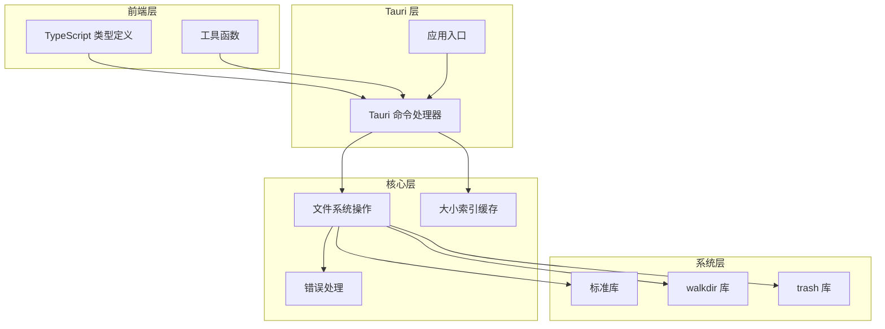

**图表来源**
- [fs_ops.rs:1-360](file://src-tauri/src/core/fs_ops.rs#L1-L360)
- [commands.rs:1-291](file://src-tauri/src/commands.rs#L1-L291)
- [lib.rs:1-70](file://src-tauri/src/lib.rs#L1-L70)

**章节来源**
- [fs_ops.rs:1-360](file://src-tauri/src/core/fs_ops.rs#L1-L360)
- [commands.rs:1-291](file://src-tauri/src/commands.rs#L1-L291)
- [lib.rs:1-70](file://src-tauri/src/lib.rs#L1-L70)

## 核心组件

### FsEntry 结构体设计

`FsEntry` 是 LocalBro 文件元数据系统的核心数据结构，负责封装单个文件或目录的所有元数据信息。

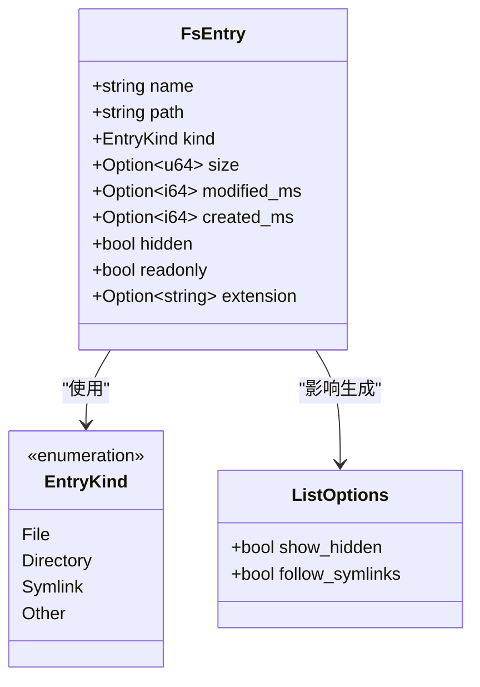

**图表来源**
- [fs_ops.rs:18-47](file://src-tauri/src/core/fs_ops.rs#L18-L47)

#### 字段详细说明

| 字段名 | 类型 | 描述 | 跨平台兼容性 |
|--------|------|------|-------------|
| `name` | `String` | 文件或目录的名称 | ✅ 所有平台 |
| `path` | `String` | 完整的绝对路径 | ✅ 所有平台 |
| `kind` | `EntryKind` | 文件类型枚举 | ✅ 所有平台 |
| `size` | `Option<u64>` | 文件大小（字节） | ❗ 目录返回 None |
| `modified_ms` | `Option<i64>` | 修改时间（毫秒 UNIX 时间戳） | ⚠️ 平台差异 |
| `created_ms` | `Option<i64>` | 创建时间（毫秒 UNIX 时间戳） | ⚠️ 平台差异 |
| `hidden` | `bool` | 是否为隐藏文件 | ✅ 跨平台检测 |
| `readonly` | `bool` | 是否为只读文件 | ✅ 所有平台 |
| `extension` | `Option<String>` | 小写的文件扩展名 | ✅ 所有平台 |

### 关键函数实现

#### stat 函数

`stat` 函数用于获取单个文件或目录的元数据信息：

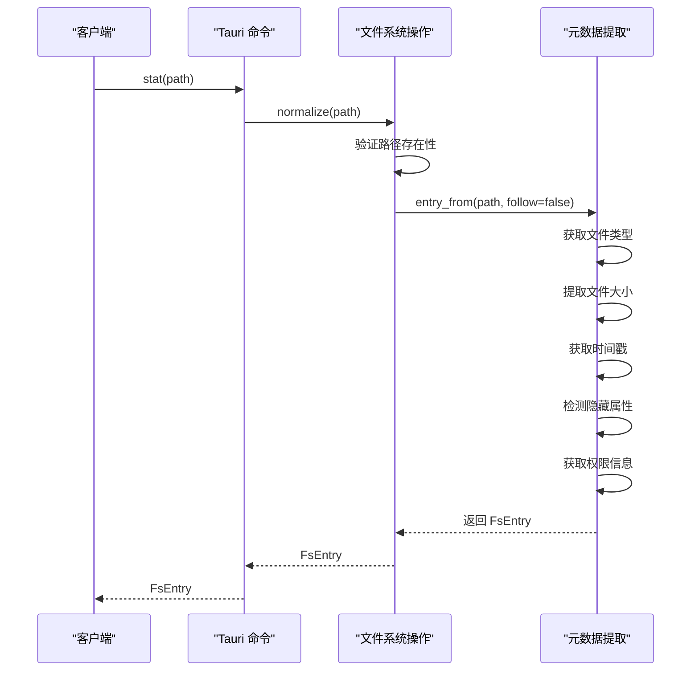

**图表来源**
- [fs_ops.rs:172-179](file://src-tauri/src/core/fs_ops.rs#L172-L179)
- [fs_ops.rs:87-138](file://src-tauri/src/core/fs_ops.rs#L87-L138)

#### list_dir 函数

`list_dir` 函数用于列出目录内容并应用过滤选项：

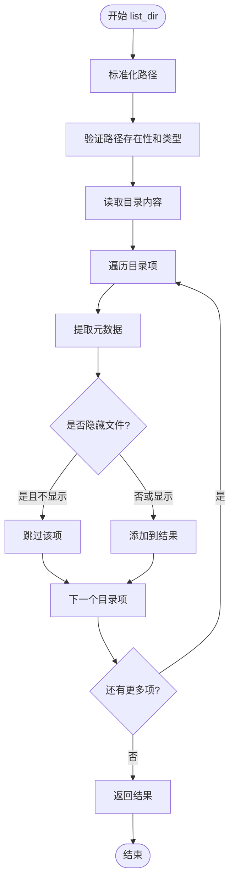

**图表来源**
- [fs_ops.rs:140-170](file://src-tauri/src/core/fs_ops.rs#L140-L170)

#### read_text_file 函数

`read_text_file` 函数用于安全地读取文本文件内容：

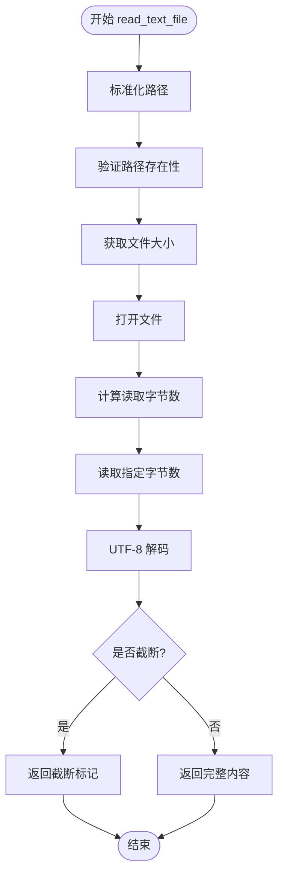

**图表来源**
- [fs_ops.rs:294-318](file://src-tauri/src/core/fs_ops.rs#L294-L318)

**章节来源**
- [fs_ops.rs:1-360](file://src-tauri/src/core/fs_ops.rs#L1-L360)

## 架构概览

LocalBro 的文件元数据读取系统采用分层架构设计，确保了良好的模块化和可维护性：

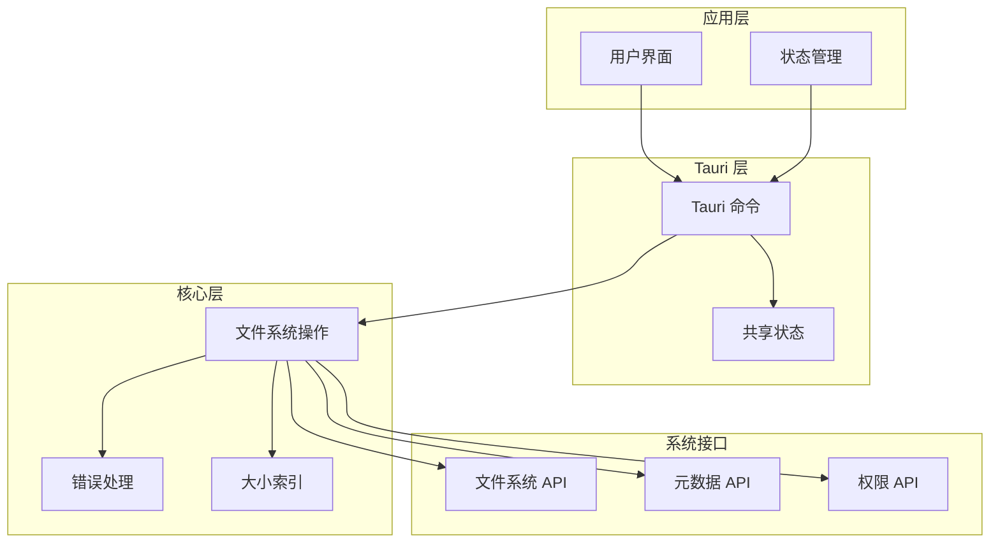

**图表来源**
- [lib.rs:12-69](file://src-tauri/src/lib.rs#L12-L69)
- [commands.rs:1-291](file://src-tauri/src/commands.rs#L1-L291)

### 数据流处理

系统通过以下流程处理文件元数据请求：

1. **请求接收**: Tauri 命令处理器接收前端请求
2. **参数验证**: 校验输入参数的有效性
3. **文件系统调用**: 执行相应的文件系统操作
4. **元数据提取**: 收集和转换文件元数据
5. **结果返回**: 将数据序列化并返回给前端

**章节来源**
- [commands.rs:1-291](file://src-tauri/src/commands.rs#L1-L291)
- [lib.rs:1-70](file://src-tauri/src/lib.rs#L1-L70)

## 详细组件分析

### 文件类型检测机制

LocalBro 使用 `std::fs::Metadata` 来检测文件类型，支持四种基本类型：

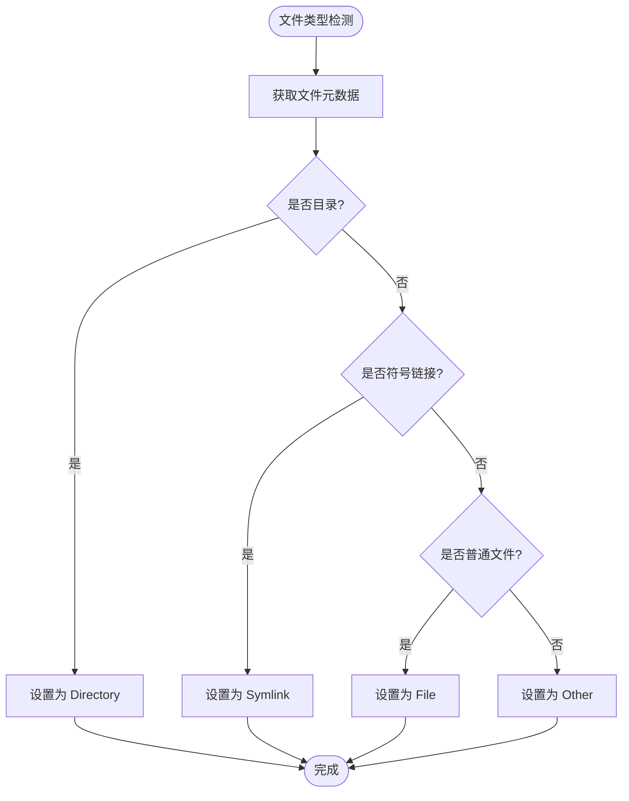

**图表来源**
- [fs_ops.rs:100-109](file://src-tauri/src/core/fs_ops.rs#L100-L109)

#### 跨平台兼容性

- **Unix/Linux/macOS**: 通过文件属性位检测隐藏文件（以点开头的文件名）
- **Windows**: 通过 `FILE_ATTRIBUTE_HIDDEN` 检测隐藏属性
- **符号链接**: 支持跟随和非跟随两种模式

**章节来源**
- [fs_ops.rs:62-85](file://src-tauri/src/core/fs_ops.rs#L62-L85)

### 隐藏文件检测机制

隐藏文件检测是跨平台设计的关键部分：

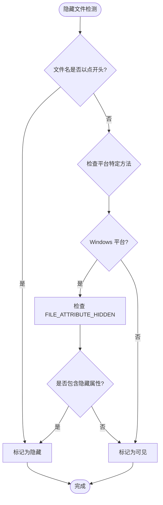

**图表来源**
- [fs_ops.rs:62-85](file://src-tauri/src/core/fs_ops.rs#L62-L85)

#### 平台特定实现

- **Unix 系统**: 文件名以点开头即为隐藏文件
- **Windows 系统**: 使用 `FILE_ATTRIBUTE_HIDDEN` 位标志
- **macOS**: 同时支持点文件名和 `uf_hidden` 标志

**章节来源**
- [fs_ops.rs:62-85](file://src-tauri/src/core/fs_ops.rs#L62-L85)

### 符号链接处理策略

LocalBro 提供了灵活的符号链接处理机制：

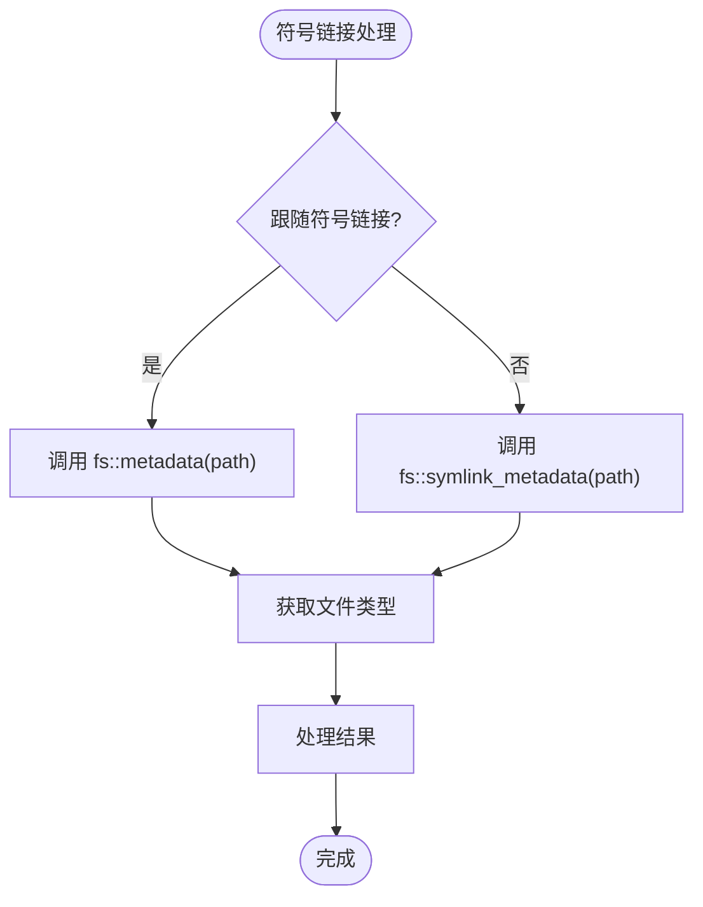

**图表来源**
- [fs_ops.rs:93-98](file://src-tauri/src/core/fs_ops.rs#L93-L98)

#### 处理策略对比

| 模式 | 函数调用 | 元数据来源 | 适用场景 |
|------|----------|------------|----------|
| 跟随模式 | `fs::metadata` | 目标文件元数据 | 需要真实文件信息 |
| 非跟随模式 | `fs::symlink_metadata` | 符号链接本身元数据 | 需要符号链接信息 |

**章节来源**
- [fs_ops.rs:93-98](file://src-tauri/src/core/fs_ops.rs#L93-L98)

### 错误处理机制

系统实现了完善的错误处理机制，确保操作的健壮性：

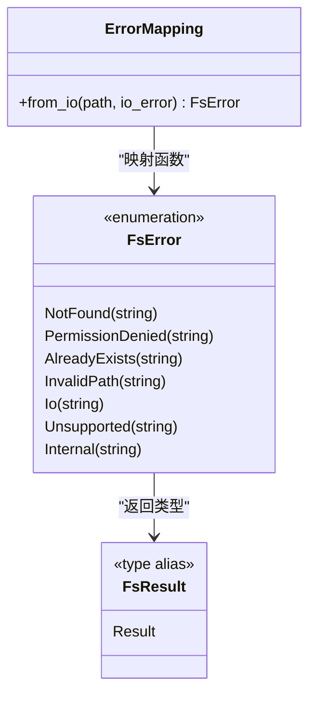

**图表来源**
- [error.rs:7-49](file://src-tauri/src/core/error.rs#L7-L49)

#### 错误类型详解

| 错误类型 | 触发条件 | 处理建议 |
|----------|----------|----------|
| `NotFound` | 文件不存在 | 检查路径有效性 |
| `PermissionDenied` | 权限不足 | 检查文件权限 |
| `AlreadyExists` | 目标已存在 | 删除现有文件后重试 |
| `InvalidPath` | 路径格式错误 | 验证路径字符串 |
| `Io` | 一般 IO 错误 | 检查磁盘空间和文件锁定 |
| `Unsupported` | 不支持的操作 | 使用替代方案 |

**章节来源**
- [error.rs:7-49](file://src-tauri/src/core/error.rs#L7-L49)

### 性能优化策略

#### 目录扫描优化

LocalBro 实现了高效的目录扫描机制：

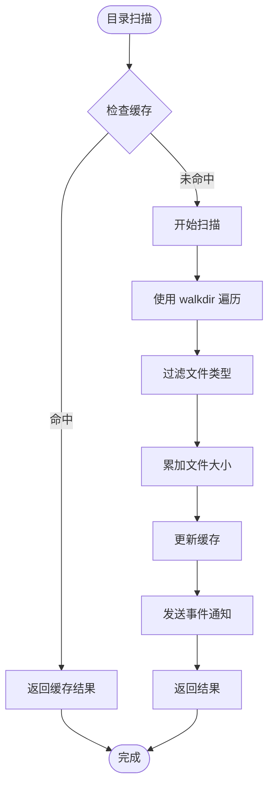

**图表来源**
- [size_index.rs:106-134](file://src-tauri/src/core/size_index.rs#L106-L134)

#### 文本文件读取优化

对于大文件的文本读取，系统采用了内存友好的策略：

- **限制读取大小**: 默认最大读取 1MB 内容
- **流式读取**: 使用 `std::io::Read` 接口进行流式读取
- **UTF-8 容错**: 自动替换无效的 UTF-8 字符
- **截断标记**: 明确标识内容是否被截断

**章节来源**
- [fs_ops.rs:294-318](file://src-tauri/src/core/fs_ops.rs#L294-L318)
- [size_index.rs:1-135](file://src-tauri/src/core/size_index.rs#L1-L135)

## 依赖关系分析

LocalBro 的文件元数据读取系统依赖于多个外部库和内部模块：

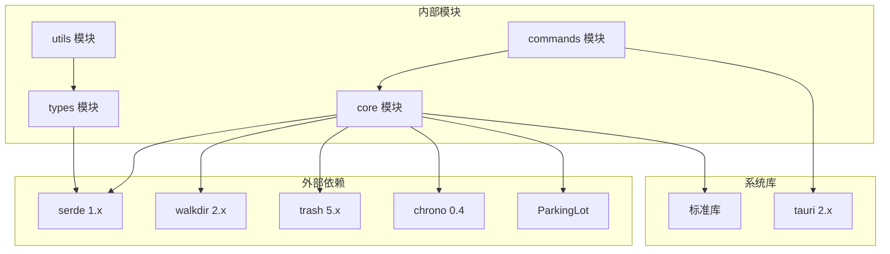

**图表来源**
- [Cargo.toml:17-31](file://src-tauri/Cargo.toml#L17-L31)
- [lib.rs:1-70](file://src-tauri/src/lib.rs#L1-L70)

### 关键依赖说明

| 依赖库 | 版本 | 用途 | 关键特性 |
|--------|------|------|----------|
| `serde` | 1.x | 序列化/反序列化 | JSON 支持，derive 宏 |
| `walkdir` | 2.x | 目录遍历 | 递归遍历，符号链接控制 |
| `trash` | 5.x | 系统回收站 | 跨平台删除到回收站 |
| `chrono` | 0.4 | 时间处理 | UTC 时间戳，序列化支持 |
| `parking_lot` | 0.12 | 并发原语 | 高性能互斥锁 |

**章节来源**
- [Cargo.toml:17-31](file://src-tauri/Cargo.toml#L17-L31)

## 性能考虑

### 内存使用优化

1. **延迟加载**: 目录大小计算采用惰性求值，仅在需要时计算
2. **流式处理**: 文本文件读取使用流式接口，避免一次性加载大文件
3. **缓存机制**: 目录大小结果通过 `SizeIndex` 进行缓存

### 并发处理

- **线程池**: 使用独立线程执行耗时的目录扫描任务
- **并发安全**: 使用 `parking_lot::Mutex` 确保线程安全
- **请求去重**: 防止重复请求相同路径的扫描任务

### I/O 操作优化

- **批量操作**: 目录列表读取时批量处理所有条目
- **错误容忍**: 单个条目读取失败不影响整体操作
- **资源管理**: 正确关闭文件句柄和清理临时资源

## 故障排除指南

### 常见问题及解决方案

#### 权限相关错误

**问题**: 访问某些文件或目录时报错
**原因**: 用户权限不足或文件被其他进程占用
**解决方案**: 
1. 检查文件权限设置
2. 关闭可能占用文件的应用程序
3. 以管理员权限运行应用

#### 路径相关错误

**问题**: 路径解析失败或找不到文件
**原因**: 路径格式不正确或路径不存在
**解决方案**:
1. 验证路径字符串的有效性
2. 检查路径中的特殊字符
3. 确认路径指向的实际位置

#### 性能问题

**问题**: 目录扫描或文件读取速度慢
**原因**: 磁盘 I/O 性能或网络驱动器响应慢
**解决方案**:
1. 检查磁盘健康状况
2. 避免同时进行大量 I/O 操作
3. 考虑使用缓存机制

### 调试技巧

1. **启用详细日志**: 在开发环境中启用更详细的错误信息
2. **分步调试**: 将复杂操作分解为简单的步骤进行测试
3. **边界测试**: 测试极端情况如空目录、大文件、特殊字符等

**章节来源**
- [error.rs:31-41](file://src-tauri/src/core/error.rs#L31-L41)

## 结论

LocalBro 的文件元数据读取系统展现了优秀的跨平台设计和工程实践。通过精心设计的 `FsEntry` 结构体、完善的错误处理机制和性能优化策略，该系统能够可靠地处理各种文件系统操作需求。

系统的主要优势包括：

1. **跨平台兼容性**: 统一的 API 设计支持 Windows、macOS 和 Linux
2. **性能优化**: 采用缓存、流式处理和并发机制提升性能
3. **错误处理**: 完善的错误分类和用户友好的错误信息
4. **扩展性**: 模块化的架构设计便于功能扩展和维护

未来可以考虑的功能增强包括：
- 更详细的文件属性支持
- 增强的符号链接处理能力
- 更智能的缓存策略
- 更丰富的文件类型检测