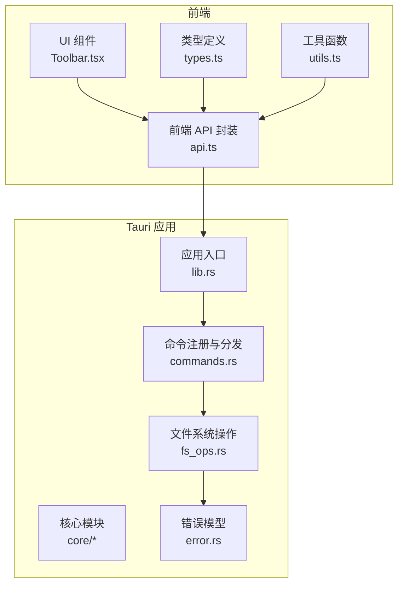
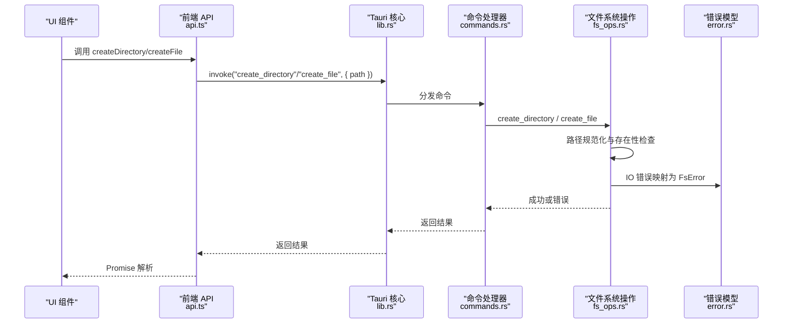
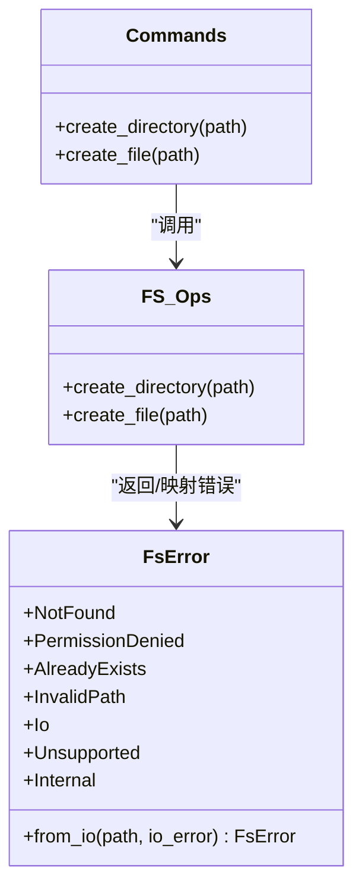

# 文件创建操作

<cite>
**本文引用的文件**
- [fs_ops.rs](file://src-tauri/src/core/fs_ops.rs)
- [commands.rs](file://src-tauri/src/commands.rs)
- [error.rs](file://src-tauri/src/core/error.rs)
- [lib.rs](file://src-tauri/src/lib.rs)
- [api.ts](file://src/api.ts)
- [types.ts](file://src/types.ts)
- [utils.ts](file://src/utils.ts)
- [Toolbar.tsx](file://src/components/Toolbar.tsx)
</cite>

## 目录
1. [简介](#简介)
2. [项目结构](#项目结构)
3. [核心组件](#核心组件)
4. [架构总览](#架构总览)
5. [详细组件分析](#详细组件分析)
6. [依赖关系分析](#依赖关系分析)
7. [性能考量](#性能考量)
8. [故障排查指南](#故障排查指南)
9. [结论](#结论)

## 简介
本文件聚焦 LocalBro 中“文件创建”能力的技术实现，围绕后端 Rust 核心模块中的 create_directory 与 create_file 两个函数展开，系统性说明：
- 路径规范化处理与存在性检查机制
- 权限验证与错误传播流程
- 安全检查逻辑（重复创建防护、路径有效性验证）
- 跨平台兼容性策略（Windows/macOS/Linux 差异）
- 错误处理示例与异常场景处置方案
- 前端调用链路与使用场景

## 项目结构
LocalBro 采用 Tauri 架构，前端通过 @tauri-apps/api 调用后端命令；后端在 Rust 模块中实现具体文件系统操作，并通过 Tauri 注册为可调用命令。

图表来源
- [lib.rs:26-66](file://src-tauri/src/lib.rs#L26-L66)
- [commands.rs:16-54](file://src-tauri/src/commands.rs#L16-L54)
- [fs_ops.rs:189-204](file://src-tauri/src/core/fs_ops.rs#L189-L204)
- [error.rs:8-41](file://src-tauri/src/core/error.rs#L8-L41)

章节来源
- [lib.rs:12-69](file://src-tauri/src/lib.rs#L12-L69)
- [commands.rs:16-54](file://src-tauri/src/commands.rs#L16-L54)
- [fs_ops.rs:189-204](file://src-tauri/src/core/fs_ops.rs#L189-L204)
- [error.rs:8-41](file://src-tauri/src/core/error.rs#L8-L41)

## 核心组件
- create_directory：创建目录（支持多级父目录自动创建）
- create_file：创建空文件
- 命令层封装：将 Rust 函数暴露为 Tauri 命令
- 错误模型：统一的 FsError 枚举与序列化策略
- 前端 API：对命令进行封装，便于 React 组件调用

章节来源
- [fs_ops.rs:189-204](file://src-tauri/src/core/fs_ops.rs#L189-L204)
- [commands.rs:47-54](file://src-tauri/src/commands.rs#L47-L54)
- [error.rs:8-41](file://src-tauri/src/core/error.rs#L8-L41)
- [api.ts:71-77](file://src/api.ts#L71-L77)

## 架构总览
文件创建的端到端调用链如下：

图表来源
- [api.ts:71-77](file://src/api.ts#L71-L77)
- [lib.rs:26-66](file://src-tauri/src/lib.rs#L26-L66)
- [commands.rs:47-54](file://src-tauri/src/commands.rs#L47-L54)
- [fs_ops.rs:189-204](file://src-tauri/src/core/fs_ops.rs#L189-L204)
- [error.rs:31-41](file://src-tauri/src/core/error.rs#L31-L41)

## 详细组件分析

### 路径规范化与存在性检查
- 规范化函数负责将输入路径转换为 PathBuf，并在空路径时直接返回无效路径错误。
- 创建前均执行 exists() 检查，若目标已存在则返回“已存在”错误，避免覆盖已有条目。
- 这一策略同时适用于目录与文件创建，形成一致的重复创建防护。

章节来源
- [fs_ops.rs:49-54](file://src-tauri/src/core/fs_ops.rs#L49-L54)
- [fs_ops.rs:189-194](file://src-tauri/src/core/fs_ops.rs#L189-L194)
- [fs_ops.rs:197-203](file://src-tauri/src/core/fs_ops.rs#L197-L203)

### create_directory 实现原理
- 步骤
  1) 规范化路径
  2) 若目标已存在，返回“已存在”错误
  3) 使用标准库递归创建目录（包含缺失的父目录）
- 安全性
  - 重复创建防护：显式 exists() 判断
  - 跨平台：标准库行为在各平台保持一致
- 性能
  - 递归创建通常只进行一次系统调用，成本较低

图表来源
- [fs_ops.rs:189-195](file://src-tauri/src/core/fs_ops.rs#L189-L195)

章节来源
- [fs_ops.rs:189-195](file://src-tauri/src/core/fs_ops.rs#L189-L195)

### create_file 实现原理
- 步骤
  1) 规范化路径
  2) 若目标已存在，返回“已存在”错误
  3) 打开或创建空文件（标准库 File::create）
- 安全性
  - 重复创建防护：显式 exists() 判断
  - 不会覆盖现有文件
- 性能
  - 创建空文件通常为 O(1) 系统调用

图表来源
- [fs_ops.rs:197-204](file://src-tauri/src/core/fs_ops.rs#L197-L204)

章节来源
- [fs_ops.rs:197-204](file://src-tauri/src/core/fs_ops.rs#L197-L204)

### 权限验证与错误传播
- IO 错误映射
  - NotFound → NotFound
  - PermissionDenied → PermissionDenied
  - AlreadyExists → AlreadyExists
  - 其他 IO 错误 → Io（附带路径与原始错误信息）
- 前端序列化
  - FsError 实现为字符串序列化，便于 IPC 层传递

图表来源
- [error.rs:8-41](file://src-tauri/src/core/error.rs#L8-L41)
- [commands.rs:47-54](file://src-tauri/src/commands.rs#L47-L54)
- [fs_ops.rs:189-204](file://src-tauri/src/core/fs_ops.rs#L189-L204)

章节来源
- [error.rs:8-41](file://src-tauri/src/core/error.rs#L8-L41)
- [commands.rs:47-54](file://src-tauri/src/commands.rs#L47-L54)
- [fs_ops.rs:189-204](file://src-tauri/src/core/fs_ops.rs#L189-L204)

### 跨平台兼容性处理
- 路径与文件系统
  - Rust 标准库在 Windows/macOS/Linux 上对路径与文件系统的抽象一致，无需额外适配
- 隐藏文件检测
  - Unix 风格以点开头的隐藏文件
  - Windows 通过文件属性判断隐藏位
- 命令注册与 IPC
  - Tauri 在各平台统一暴露命令接口，前端调用一致

章节来源
- [fs_ops.rs:62-85](file://src-tauri/src/core/fs_ops.rs#L62-L85)
- [lib.rs:26-66](file://src-tauri/src/lib.rs#L26-L66)

### 前端调用与使用场景
- 前端 API
  - 提供 createDirectory(path) 与 createFile(path) 两个方法
  - 返回 Promise<void>，成功无返回值，失败抛出错误
- UI 使用
  - 可在上下文菜单、工具栏等交互中触发创建操作
  - 与 store 状态管理配合，刷新列表视图

章节来源
- [api.ts:71-77](file://src/api.ts#L71-L77)
- [Toolbar.tsx:158-282](file://src/components/Toolbar.tsx#L158-L282)

## 依赖关系分析
- 命令注册
  - lib.rs 中集中注册所有命令，包括 create_directory 与 create_file
- 命令分发
  - commands.rs 将前端调用转发至 fs_ops.rs 的具体实现
- 错误模型
  - error.rs 定义统一错误类型，fs_ops.rs 在 IO 失败时映射为 FsError

图表来源
- [lib.rs:26-66](file://src-tauri/src/lib.rs#L26-L66)
- [commands.rs:47-54](file://src-tauri/src/commands.rs#L47-L54)
- [fs_ops.rs:189-204](file://src-tauri/src/core/fs_ops.rs#L189-L204)
- [error.rs:8-41](file://src-tauri/src/core/error.rs#L8-L41)

章节来源
- [lib.rs:26-66](file://src-tauri/src/lib.rs#L26-L66)
- [commands.rs:47-54](file://src-tauri/src/commands.rs#L47-L54)
- [fs_ops.rs:189-204](file://src-tauri/src/core/fs_ops.rs#L189-L204)
- [error.rs:8-41](file://src-tauri/src/core/error.rs#L8-L41)

## 性能考量
- 路径规范化与存在性检查均为常数时间复杂度，开销极低
- 目录创建采用递归创建，通常只需一次系统调用
- 文件创建为 O(1) 系统调用
- 建议
  - 在 UI 层进行输入校验（例如禁止空名），减少不必要的后端调用
  - 对批量创建操作，建议合并为单次调用以降低 IPC 开销

[本节为通用性能讨论，不涉及特定文件分析]

## 故障排查指南
- 常见错误与处理
  - 路径为空：返回“无效路径”，需确保传入非空字符串
  - 目标已存在：返回“已存在”，请先重命名或删除
  - 权限不足：返回“权限不足”，检查目标目录写权限
  - 路径不存在的父目录：目录创建会自动创建缺失的父目录
- 前端捕获与提示
  - 建议在 UI 中对不同错误类型给出明确提示
  - 对于“已存在”错误，可引导用户选择重命名或覆盖策略

章节来源
- [error.rs:8-29](file://src-tauri/src/core/error.rs#L8-L29)
- [fs_ops.rs:49-54](file://src-tauri/src/core/fs_ops.rs#L49-L54)
- [fs_ops.rs:189-194](file://src-tauri/src/core/fs_ops.rs#L189-L194)
- [fs_ops.rs:197-203](file://src-tauri/src/core/fs_ops.rs#L197-L203)

## 结论
LocalBro 的文件创建功能以简洁稳健的设计实现了跨平台一致性：
- 通过显式的路径规范化与存在性检查，有效防止重复创建与非法路径
- 统一的错误模型使前后端协作清晰可靠
- 前端 API 易于集成，可在多种 UI 场景中快速落地