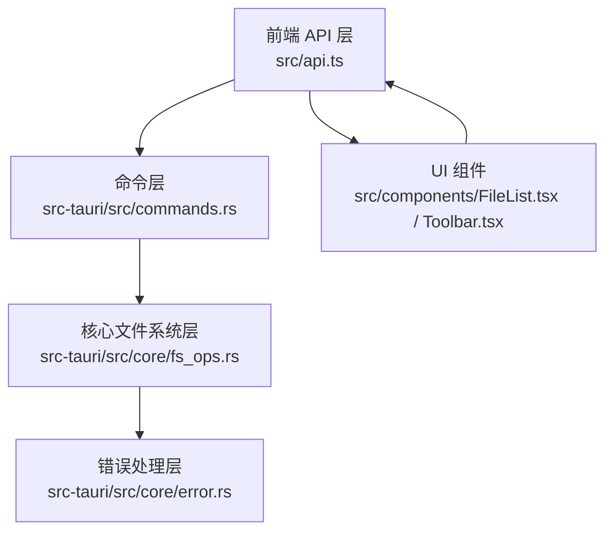
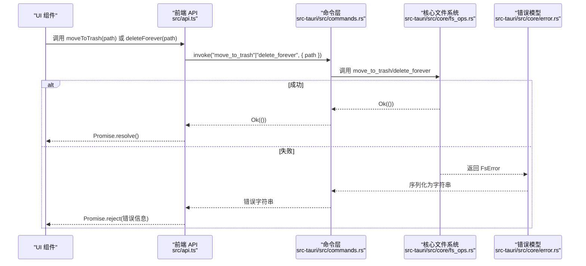
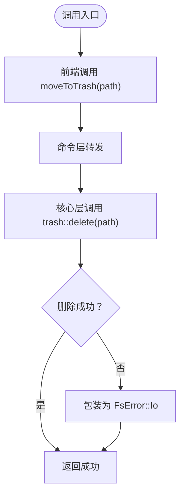
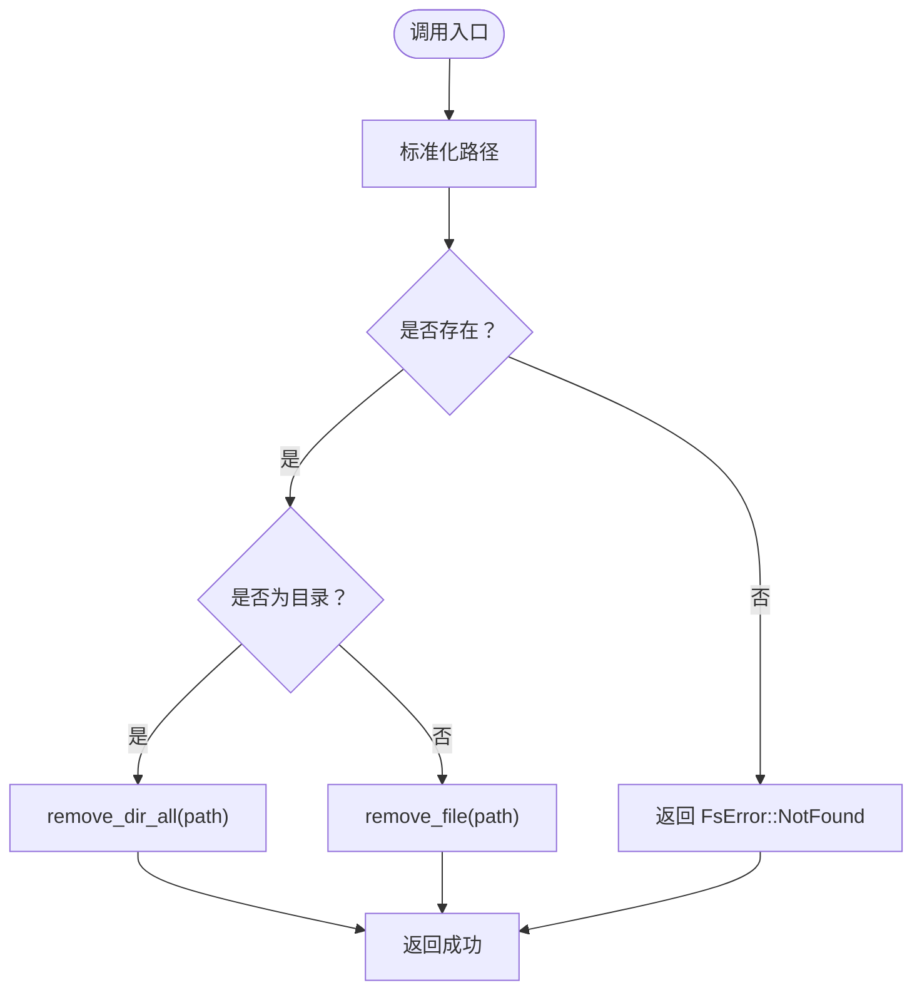
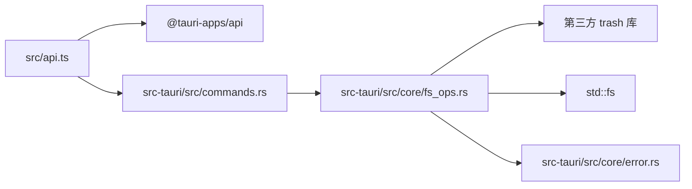

# 文件删除操作

<cite>
**本文引用的文件**
- [fs_ops.rs](file://src-tauri/src/core/fs_ops.rs)
- [commands.rs](file://src-tauri/src/commands.rs)
- [lib.rs](file://src-tauri/src/lib.rs)
- [error.rs](file://src-tauri/src/core/error.rs)
- [api.ts](file://src/api.ts)
- [FileList.tsx](file://src/components/FileList.tsx)
- [Toolbar.tsx](file://src/components/Toolbar.tsx)
- [store.ts](file://src/store.ts)
</cite>

## 目录
1. [简介](#简介)
2. [项目结构](#项目结构)
3. [核心组件](#核心组件)
4. [架构总览](#架构总览)
5. [详细组件分析](#详细组件分析)
6. [依赖关系分析](#依赖关系分析)
7. [性能考量](#性能考量)
8. [故障排查指南](#故障排查指南)
9. [结论](#结论)

## 简介
本文件面向 LocalBro 的“文件删除”能力，围绕两个关键函数展开：move_to_trash（移至回收站）与 delete_forever（永久删除）。文档将从系统架构、数据流、处理逻辑、安全检查、跨平台兼容性、错误处理与异常恢复等方面进行深入解析，并给出可操作的使用场景与最佳实践。

## 项目结构
LocalBro 采用 Tauri 桌面应用框架，前端通过 @tauri-apps/api 调用后端命令；后端在 Rust 中实现文件系统操作，暴露为 Tauri 命令供前端调用。删除功能涉及以下模块：
- 前端 API 层：封装 invoke 调用，提供 moveToTrash 与 deleteForever 方法
- 后端命令层：将前端调用映射到具体命令处理器
- 核心文件系统层：实现 move_to_trash 与 delete_forever 的业务逻辑
- 错误处理层：统一 FsError 枚举与序列化策略

图表来源
- [api.ts:83-89](file://src/api.ts#L83-L89)
- [commands.rs:61-69](file://src-tauri/src/commands.rs#L61-L69)
- [fs_ops.rs:219-235](file://src-tauri/src/core/fs_ops.rs#L219-L235)
- [error.rs:1-50](file://src-tauri/src/core/error.rs#L1-L50)

章节来源
- [api.ts:83-89](file://src/api.ts#L83-L89)
- [commands.rs:61-69](file://src-tauri/src/commands.rs#L61-L69)
- [fs_ops.rs:219-235](file://src-tauri/src/core/fs_ops.rs#L219-L235)
- [error.rs:1-50](file://src-tauri/src/core/error.rs#L1-L50)

## 核心组件
- 前端 API 封装：提供 moveToTrash 与 deleteForever 两个方法，分别对应后端命令 move_to_trash 与 delete_forever
- 命令处理器：在 commands.rs 中声明并转发调用至 core 层
- 核心实现：fs_ops.rs 提供 move_to_trash 与 delete_forever 的具体逻辑，前者委托第三方 trash 库，后者执行本地删除
- 错误模型：error.rs 定义 FsError 枚举，统一错误类型并在 IPC 层序列化为字符串

章节来源
- [api.ts:83-89](file://src/api.ts#L83-L89)
- [commands.rs:61-69](file://src-tauri/src/commands.rs#L61-L69)
- [fs_ops.rs:219-235](file://src-tauri/src/core/fs_ops.rs#L219-L235)
- [error.rs:1-50](file://src-tauri/src/core/error.rs#L1-L50)

## 架构总览
下图展示了从前端到后端再到系统调用的整体流程，以及错误传播路径。

图表来源
- [api.ts:83-89](file://src/api.ts#L83-L89)
- [commands.rs:61-69](file://src-tauri/src/commands.rs#L61-L69)
- [fs_ops.rs:219-235](file://src-tauri/src/core/fs_ops.rs#L219-L235)
- [error.rs:31-47](file://src-tauri/src/core/error.rs#L31-L47)

## 详细组件分析

### move_to_trash 移动到回收站
- 实现机制
  - 前端通过 api.moveToTrash(path) 触发
  - 命令层 commands.rs 将请求转发给 core::fs_ops::move_to_trash
  - 核心层直接调用第三方 trash::delete(path)，将文件移动到系统回收站/垃圾桶
- 安全检查
  - 核心层未对路径进行额外校验，仅依赖第三方库处理
  - 若第三方库返回错误，会被包装为 FsError::Io 并上抛
- 跨平台兼容性
  - 使用第三方 trash 库，自动适配各平台回收站语义（Windows 回收站、macOS 垃圾箱、Linux 桌面环境回收站）
- 错误处理
  - 任何 IO 错误均被转换为 FsError::Io，并由前端捕获显示

图表来源
- [api.ts:83-85](file://src/api.ts#L83-L85)
- [commands.rs:61-64](file://src-tauri/src/commands.rs#L61-L64)
- [fs_ops.rs:219-222](file://src-tauri/src/core/fs_ops.rs#L219-L222)

章节来源
- [api.ts:83-85](file://src/api.ts#L83-L85)
- [commands.rs:61-64](file://src-tauri/src/commands.rs#L61-L64)
- [fs_ops.rs:219-222](file://src-tauri/src/core/fs_ops.rs#L219-L222)

### delete_forever 永久删除
- 实现机制
  - 前端通过 api.deleteForever(path) 触发
  - 命令层 commands.rs 转发到 core::fs_ops::delete_forever
  - 核心层先进行存在性与类型判断，再根据是否为目录选择删除单文件或整目录
- 安全检查
  - 存在性验证：若路径不存在，返回 FsError::NotFound
  - 类型判断：目录走 remove_dir_all，文件走 remove_file
- 跨平台兼容性
  - 使用标准库 fs::remove_file/remove_dir_all，天然支持 Windows/Linux/macOS
- 错误处理
  - 任何 IO 错误统一转换为 FsError::Io，前端捕获并提示

图表来源
- [api.ts:87-89](file://src/api.ts#L87-L89)
- [commands.rs:66-69](file://src-tauri/src/commands.rs#L66-L69)
- [fs_ops.rs:224-235](file://src-tauri/src/core/fs_ops.rs#L224-L235)

章节来源
- [api.ts:87-89](file://src/api.ts#L87-L89)
- [commands.rs:66-69](file://src-tauri/src/commands.rs#L66-L69)
- [fs_ops.rs:224-235](file://src-tauri/src/core/fs_ops.rs#L224-L235)

### 回收站系统工作原理与回退机制
- 工作原理
  - move_to_trash 通过第三方 trash 库实现，不需自建回收站索引或元数据管理
  - 删除行为由操作系统或桌面环境回收站负责，具备撤销/清空等常见能力
- 回退机制
  - 当第三方库不可用或失败时，delete_forever 作为最终回退路径，直接调用系统删除接口
  - 前端 UI 可结合用户确认对话框，降低误删风险

章节来源
- [fs_ops.rs:219-222](file://src-tauri/src/core/fs_ops.rs#L219-L222)
- [fs_ops.rs:224-235](file://src-tauri/src/core/fs_ops.rs#L224-L235)

### 路径合法性与权限检查
- 路径合法性
  - delete_forever 在执行前会检查路径存在性，不存在则报错
  - move_to_trash 未显式做存在性检查，依赖第三方库处理
- 权限检查
  - 两者均依赖底层系统权限模型，错误通过 FsError::PermissionDenied 或 FsError::Io 上抛
- 建议
  - 前端可在调用前进行简单校验（例如是否为根路径、是否只读），并在 UI 中提示用户

章节来源
- [fs_ops.rs:224-235](file://src-tauri/src/core/fs_ops.rs#L224-L235)
- [error.rs:12-13](file://src-tauri/src/core/error.rs#L12-L13)

### 前端调用与 UI 集成
- 前端 API
  - api.ts 提供 moveToTrash 与 deleteForever 两个方法，内部通过 @tauri-apps/api.invoke 调用后端命令
- UI 组件
  - FileList.tsx 与 Toolbar.tsx 未直接展示删除按钮实现，但可通过选择文件后触发相应 API 调用
  - store.ts 提供状态管理，刷新列表与错误提示可配合删除操作使用

章节来源
- [api.ts:83-89](file://src/api.ts#L83-L89)
- [FileList.tsx:1-197](file://src/components/FileList.tsx#L1-L197)
- [Toolbar.tsx:1-283](file://src/components/Toolbar.tsx#L1-L283)
- [store.ts:1-308](file://src/store.ts#L1-L308)

## 依赖关系分析
- 前端依赖
  - @tauri-apps/api：用于 invoke 后端命令
  - 自身封装的 api.ts：统一错误处理与返回值格式
- 后端依赖
  - tauri：命令注册与 IPC 通道
  - trash：跨平台回收站操作
  - 标准库 std::fs：文件系统删除操作
- 错误处理
  - error.rs 提供 FsError 枚举与序列化策略，确保错误在 IPC 层可传递

图表来源
- [api.ts:1-317](file://src/api.ts#L1-L317)
- [commands.rs:1-291](file://src-tauri/src/commands.rs#L1-L291)
- [fs_ops.rs:1-360](file://src-tauri/src/core/fs_ops.rs#L1-L360)
- [error.rs:1-50](file://src-tauri/src/core/error.rs#L1-L50)

章节来源
- [api.ts:1-317](file://src/api.ts#L1-L317)
- [commands.rs:1-291](file://src-tauri/src/commands.rs#L1-L291)
- [fs_ops.rs:1-360](file://src-tauri/src/core/fs_ops.rs#L1-L360)
- [error.rs:1-50](file://src-tauri/src/core/error.rs#L1-L50)

## 性能考量
- 回收站操作（move_to_trash）
  - 依赖第三方库，通常为轻量级系统调用，性能开销极低
  - 不涉及大文件扫描或索引构建
- 永久删除（delete_forever）
  - 目录删除为递归删除，文件删除为单文件删除
  - 性能主要受磁盘 I/O 影响，建议避免在超大目录上频繁触发
- 建议
  - 对批量删除，优先使用回收站路径，减少不可逆操作带来的系统压力
  - 在 UI 中提供进度反馈与取消机制（若需要）

## 故障排查指南
- 常见错误与定位
  - FsError::NotFound：路径不存在或已被删除
  - FsError::PermissionDenied：无权限访问或删除目标
  - FsError::Io：底层 IO 异常（磁盘空间不足、文件被占用等）
- 排查步骤
  - 确认路径有效性与可访问性
  - 检查目标是否为只读或被其他进程占用
  - 在 Windows 上确认回收站服务可用；在 Linux 上确认桌面环境回收站可用
- 前端处理建议
  - 捕获 Promise 拒绝并弹窗提示
  - 提供重试与回退（先尝试回收站，失败再尝试永久删除）

章节来源
- [error.rs:8-29](file://src-tauri/src/core/error.rs#L8-L29)
- [fs_ops.rs:219-235](file://src-tauri/src/core/fs_ops.rs#L219-L235)

## 结论
LocalBro 的删除功能以简洁清晰的方式实现了“回收站移动”与“永久删除”两类操作。move_to_trash 通过第三方库实现跨平台回收站集成，delete_forever 则提供最终的永久删除能力。整体设计遵循最小耦合原则：前端仅负责调用，后端统一处理错误与平台差异。建议在生产环境中配合用户确认与回退策略，进一步提升安全性与用户体验。