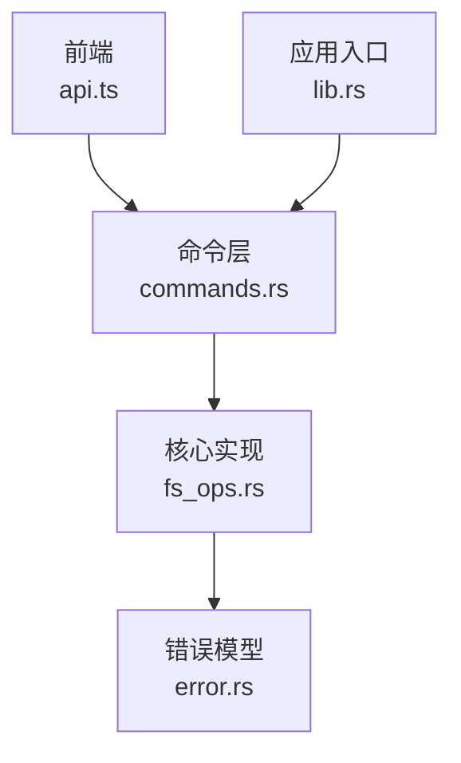
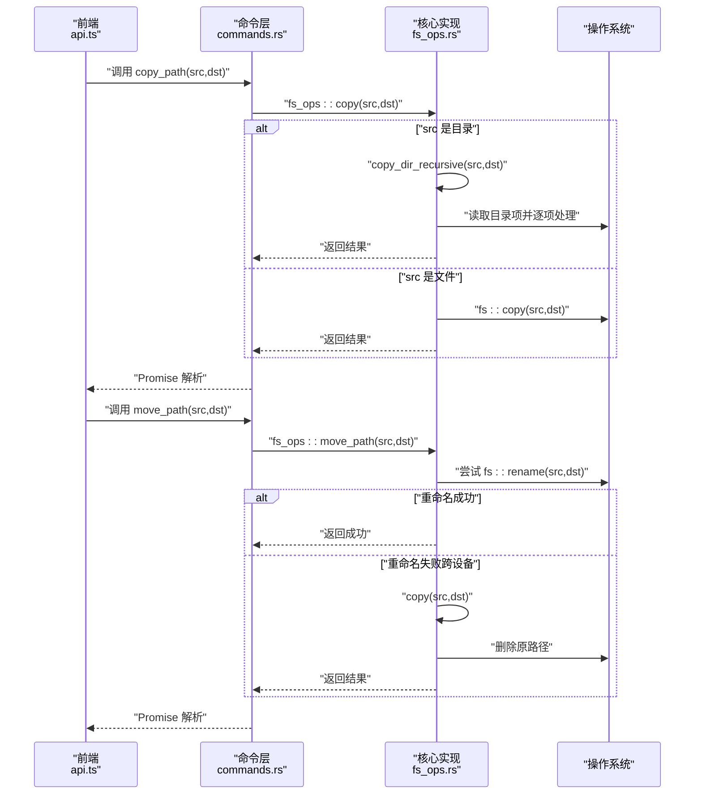
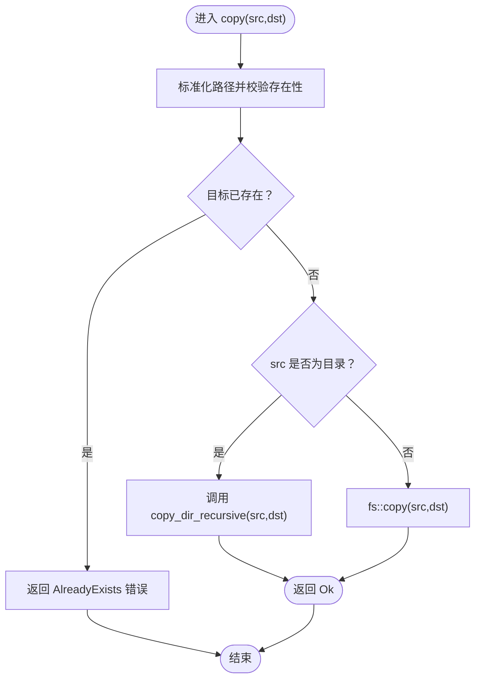
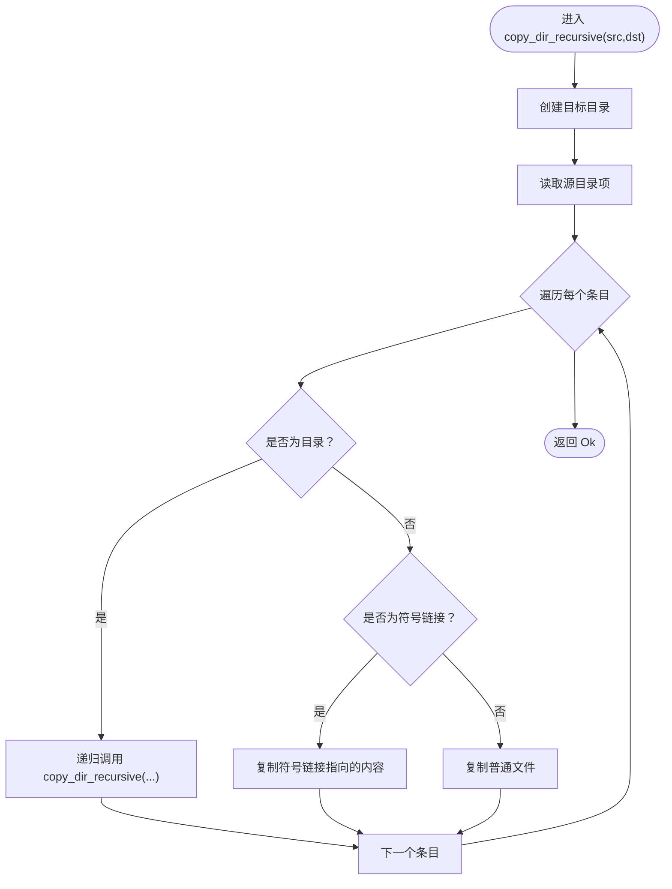
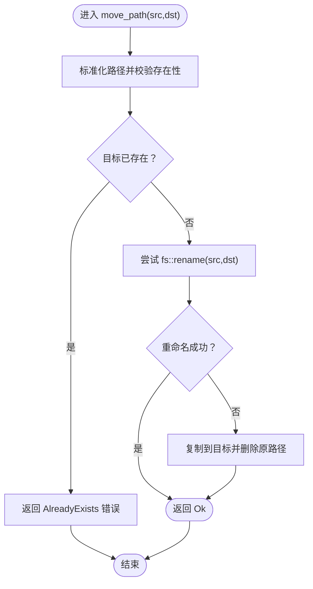
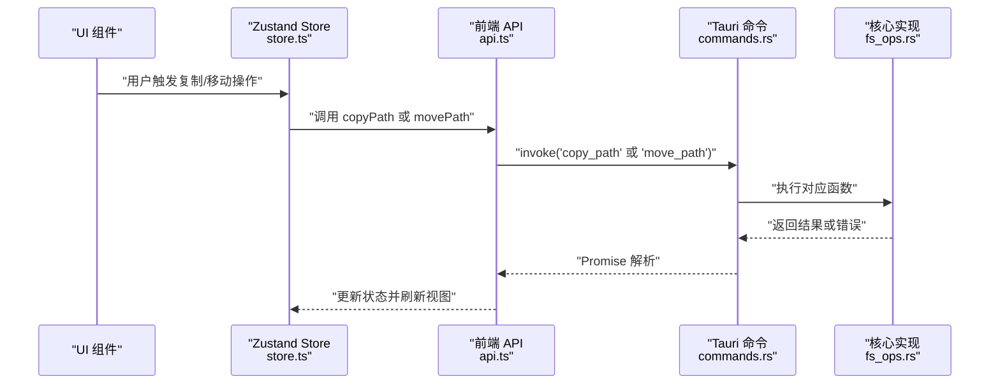
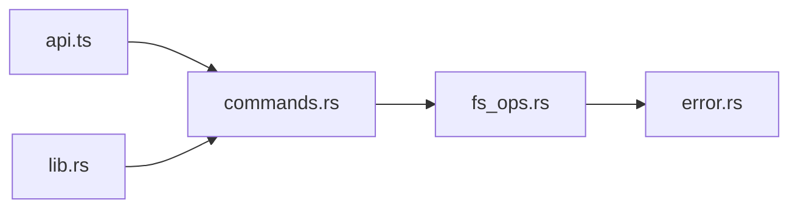

# 文件复制移动操作

<cite>
**本文档引用的文件**
- [fs_ops.rs](file://src-tauri/src/core/fs_ops.rs)
- [commands.rs](file://src-tauri/src/commands.rs)
- [lib.rs](file://src-tauri/src/lib.rs)
- [error.rs](file://src-tauri/src/core/error.rs)
- [api.ts](file://src/api.ts)
- [store.ts](file://src/store.ts)
- [types.ts](file://src/types.ts)
</cite>

## 目录
1. [简介](#简介)
2. [项目结构](#项目结构)
3. [核心组件](#核心组件)
4. [架构总览](#架构总览)
5. [详细组件分析](#详细组件分析)
6. [依赖关系分析](#依赖关系分析)
7. [性能考量](#性能考量)
8. [故障排除指南](#故障排除指南)
9. [结论](#结论)
10. [附录](#附录)

## 简介
本文件聚焦 LocalBro 的文件复制与移动功能，系统性解析后端 Rust 实现中的 copy 与 move_path 函数，涵盖以下要点：
- 复制：支持文件与目录的递归复制，符号链接按目标内容复制（非符号链接本身），并保持文件大小等元数据可见性。
- 移动：优先使用本地重命名；当跨设备无法重命名时自动回退到“复制+删除”，确保原子性与一致性。
- 错误处理：统一的 FsError 枚举与 IoError 映射，便于前端进行明确提示。
- 性能与可用性：避免不必要的 IO 操作，合理处理隐藏文件与权限属性。

## 项目结构
LocalBro 的复制/移动能力由 Tauri 后端提供，前端通过 @tauri-apps/api 调用命令。关键路径如下：
- 后端命令层：commands.rs 将前端调用映射到核心函数
- 核心实现层：fs_ops.rs 提供 copy、move_path 及其他文件系统操作
- 错误模型：error.rs 定义 FsError 枚举
- 前端封装：api.ts 提供 copyPath 与 movePath 方法
- 应用入口：lib.rs 注册命令处理器

图表来源
- [commands.rs:16-79](file://src-tauri/src/commands.rs#L16-L79)
- [fs_ops.rs:258-292](file://src-tauri/src/core/fs_ops.rs#L258-L292)
- [error.rs:8-41](file://src-tauri/src/core/error.rs#L8-L41)
- [lib.rs:27-66](file://src-tauri/src/lib.rs#L27-L66)

章节来源
- [commands.rs:16-79](file://src-tauri/src/commands.rs#L16-L79)
- [fs_ops.rs:258-292](file://src-tauri/src/core/fs_ops.rs#L258-L292)
- [error.rs:8-41](file://src-tauri/src/core/error.rs#L8-L41)
- [lib.rs:27-66](file://src-tauri/src/lib.rs#L27-L66)

## 核心组件
- 复制函数 copy
  - 输入校验：源存在性检查、目标不存在检查
  - 递归复制：目录采用 copy_dir_recursive，文件直接复制
  - 符号链接策略：遵循符号链接并复制其指向内容（非符号链接本身）
- 移动函数 move_path
  - 本地重命名优先：fs::rename 成功则直接完成
  - 跨设备回退：失败时先复制再删除原路径，保证最终一致性
- 命令封装
  - 前端通过 api.ts 的 copyPath 与 movePath 调用后端命令
  - 后端在 commands.rs 中暴露 copy_path 与 move_path 命令

章节来源
- [fs_ops.rs:258-274](file://src-tauri/src/core/fs_ops.rs#L258-L274)
- [fs_ops.rs:276-292](file://src-tauri/src/core/fs_ops.rs#L276-L292)
- [commands.rs:72-79](file://src-tauri/src/commands.rs#L72-L79)
- [api.ts:91-97](file://src/api.ts#L91-L97)

## 架构总览
下图展示从前端到后端的完整调用链路与控制流：

图表来源
- [api.ts:91-97](file://src/api.ts#L91-L97)
- [commands.rs:72-79](file://src-tauri/src/commands.rs#L72-L79)
- [fs_ops.rs:258-274](file://src-tauri/src/core/fs_ops.rs#L258-L274)
- [fs_ops.rs:276-292](file://src-tauri/src/core/fs_ops.rs#L276-L292)

## 详细组件分析

### 复制函数 copy 的实现机制
- 输入验证
  - 源路径存在性检查
  - 目标路径不存在检查（避免覆盖）
- 递归复制（目录）
  - 创建目标目录
  - 遍历源目录项，区分目录/符号链接/普通文件
  - 目录递归调用；符号链接按目标内容复制；普通文件直接复制
- 单文件复制
  - 直接调用底层复制接口
- 符号链接处理策略
  - 通过遵循符号链接的方式复制其指向内容，确保跨平台一致行为

图表来源
- [fs_ops.rs:258-274](file://src-tauri/src/core/fs_ops.rs#L258-L274)
- [fs_ops.rs:237-256](file://src-tauri/src/core/fs_ops.rs#L237-L256)

章节来源
- [fs_ops.rs:258-274](file://src-tauri/src/core/fs_ops.rs#L258-L274)
- [fs_ops.rs:237-256](file://src-tauri/src/core/fs_ops.rs#L237-L256)

### 递归目录复制 copy_dir_recursive 的遍历逻辑
- 创建目标根目录
- 读取源目录条目
- 对每个条目判断类型并执行对应操作：
  - 子目录：递归复制
  - 符号链接：若目标存在则复制其内容（遵循链接）
  - 普通文件：直接复制
- 错误传播：任何一步 IO 失败均转换为 FsError 返回

图表来源
- [fs_ops.rs:237-256](file://src-tauri/src/core/fs_ops.rs#L237-L256)

章节来源
- [fs_ops.rs:237-256](file://src-tauri/src/core/fs_ops.rs#L237-L256)

### 移动函数 move_path 的智能处理
- 本地重命名优化
  - 优先尝试 fs::rename，若成功则直接完成，避免数据拷贝
- 跨设备复制回退
  - 若重命名失败（常见于跨设备），先复制到目标位置，再删除原路径
  - 该策略确保即使在不同挂载点或卷之间也能可靠完成移动

图表来源
- [fs_ops.rs:276-292](file://src-tauri/src/core/fs_ops.rs#L276-L292)

章节来源
- [fs_ops.rs:276-292](file://src-tauri/src/core/fs_ops.rs#L276-L292)

### 前端调用与集成
- 前端封装
  - api.ts 提供 copyPath 与 movePath 方法，分别调用后端命令
- 命令注册
  - lib.rs 在应用启动时注册命令处理器，包括 copy_path 与 move_path
- 类型与状态
  - types.ts 定义 FsEntry 结构，store.ts 维护浏览器状态与导航历史

图表来源
- [api.ts:91-97](file://src/api.ts#L91-L97)
- [lib.rs:27-66](file://src-tauri/src/lib.rs#L27-L66)
- [commands.rs:72-79](file://src-tauri/src/commands.rs#L72-L79)
- [fs_ops.rs:258-292](file://src-tauri/src/core/fs_ops.rs#L258-L292)

章节来源
- [api.ts:91-97](file://src/api.ts#L91-L97)
- [lib.rs:27-66](file://src-tauri/src/lib.rs#L27-L66)
- [commands.rs:72-79](file://src-tauri/src/commands.rs#L72-L79)
- [store.ts:73-263](file://src/store.ts#L73-L263)
- [types.ts:3-13](file://src/types.ts#L3-L13)

## 依赖关系分析
- 命令到核心的依赖
  - commands.rs 依赖 fs_ops.rs 的具体实现
  - lib.rs 依赖 commands.rs 进行命令注册
- 错误模型
  - error.rs 提供统一错误枚举，fs_ops.rs 将底层 IoError 映射为 FsError
- 前后端交互
  - api.ts 通过 @tauri-apps/api 调用后端命令，返回 Promise

图表来源
- [api.ts:91-97](file://src/api.ts#L91-L97)
- [commands.rs:72-79](file://src-tauri/src/commands.rs#L72-L79)
- [fs_ops.rs:258-292](file://src-tauri/src/core/fs_ops.rs#L258-L292)
- [error.rs:8-41](file://src-tauri/src/core/error.rs#L8-L41)
- [lib.rs:27-66](file://src-tauri/src/lib.rs#L27-L66)

章节来源
- [api.ts:91-97](file://src/api.ts#L91-L97)
- [commands.rs:72-79](file://src-tauri/src/commands.rs#L72-L79)
- [fs_ops.rs:258-292](file://src-tauri/src/core/fs_ops.rs#L258-L292)
- [error.rs:8-41](file://src-tauri/src/core/error.rs#L8-L41)
- [lib.rs:27-66](file://src-tauri/src/lib.rs#L27-L66)

## 性能考量
- 本地重命名优先
  - move_path 优先使用 fs::rename，避免数据拷贝，提升性能并减少磁盘写入
- 递归复制的开销
  - 目录复制涉及多次系统调用与遍历，建议在 UI 层提供进度反馈与取消机制（当前实现未包含）
- 符号链接处理
  - 复制符号链接指向内容而非链接本身，可能带来额外的数据传输，但确保跨平台一致性
- 错误早返回
  - 在源不存在或目标已存在时立即返回，避免无效 IO

[本节为通用性能讨论，不直接分析具体文件，故无章节来源]

## 故障排除指南
- 常见错误类型
  - 路径不存在：NotFound
  - 权限不足：PermissionDenied
  - 目标已存在：AlreadyExists
  - IO 异常：Io（包含具体路径与错误信息）
- 前端处理建议
  - 在调用 copyPath 与 movePath 前确保目标路径不存在
  - 对 PermissionDenied 与 Io 错误向用户显示可理解的提示
  - 对跨设备移动失败时，可提示用户切换到同一设备或等待复制完成

章节来源
- [error.rs:8-41](file://src-tauri/src/core/error.rs#L8-L41)
- [fs_ops.rs:258-274](file://src-tauri/src/core/fs_ops.rs#L258-L274)
- [fs_ops.rs:276-292](file://src-tauri/src/core/fs_ops.rs#L276-L292)

## 结论
LocalBro 的复制与移动功能以简洁可靠的策略实现了跨平台兼容：
- 复制：支持目录递归与符号链接内容复制，满足大多数使用场景
- 移动：优先本地重命名，跨设备自动回退，兼顾性能与正确性
- 错误模型：统一的 FsError 枚举便于前端友好提示
- 前后端协作：清晰的命令层与核心实现分层，易于扩展与维护

[本节为总结性内容，不直接分析具体文件，故无章节来源]

## 附录
- 使用场景示例（描述性）
  - 在同一磁盘内移动大文件夹：优先本地重命名，速度快且安全
  - 跨设备移动：自动回退为复制+删除，完成后清理原路径
  - 批量复制多个子目录：利用递归复制，无需手动逐层处理
- 数据结构参考
  - FsEntry 字段用于前端展示与排序，包含名称、路径、类型、大小、时间戳、只读与扩展名等

章节来源
- [types.ts:3-13](file://src/types.ts#L3-L13)
- [store.ts:278-307](file://src/store.ts#L278-L307)