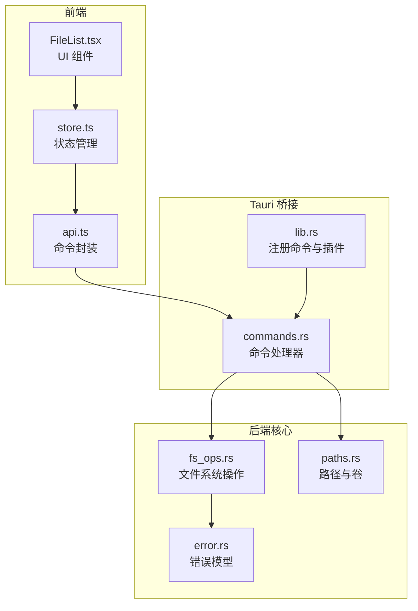
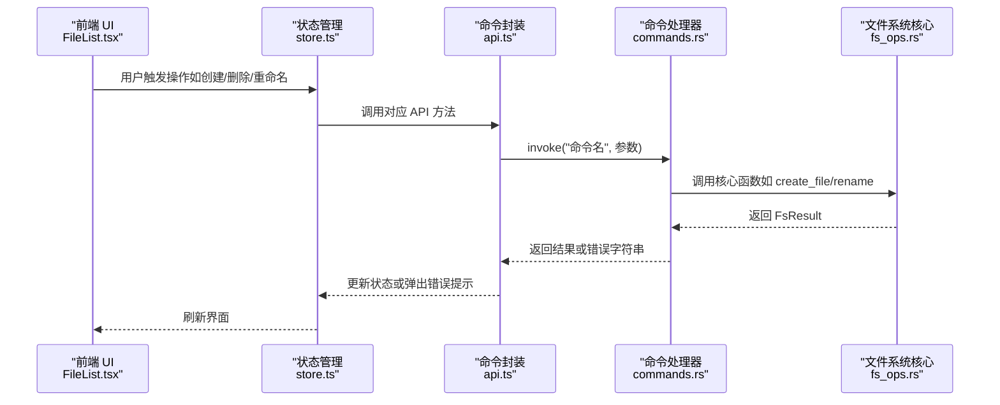
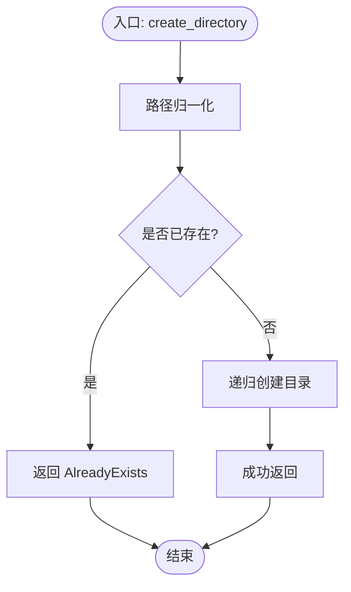
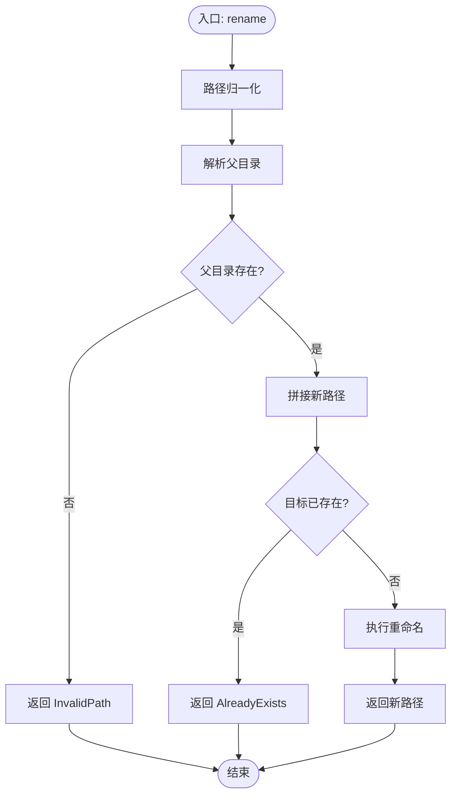
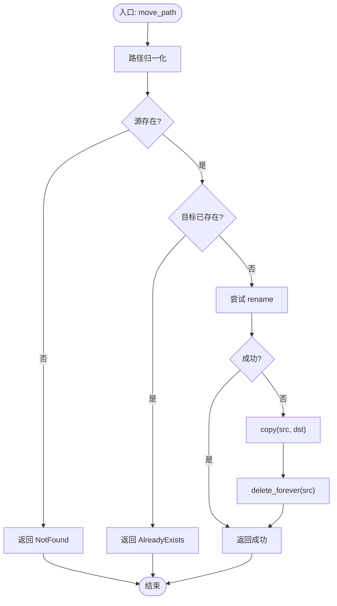
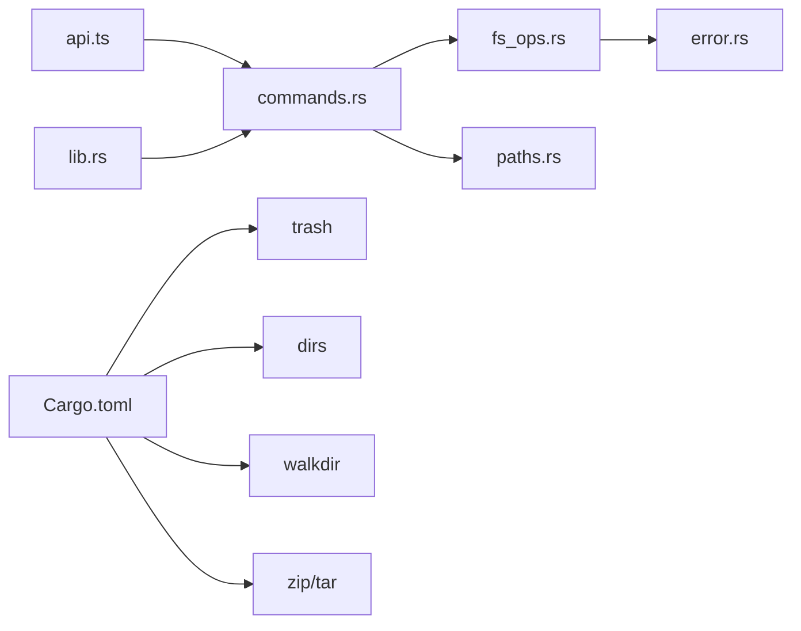

# 文件操作功能

<cite>
**本文引用的文件**
- [fs_ops.rs](file://src-tauri/src/core/fs_ops.rs)
- [commands.rs](file://src-tauri/src/commands.rs)
- [error.rs](file://src-tauri/src/core/error.rs)
- [paths.rs](file://src-tauri/src/core/paths.rs)
- [Cargo.toml](file://src-tauri/Cargo.toml)
- [lib.rs](file://src-tauri/src/lib.rs)
- [api.ts](file://src/api.ts)
- [store.ts](file://src/store.ts)
- [FileList.tsx](file://src/components/FileList.tsx)
</cite>

## 目录
1. [简介](#简介)
2. [项目结构](#项目结构)
3. [核心组件](#核心组件)
4. [架构总览](#架构总览)
5. [详细组件分析](#详细组件分析)
6. [依赖关系分析](#依赖关系分析)
7. [性能考量](#性能考量)
8. [故障排查指南](#故障排查指南)
9. [结论](#结论)
10. [附录](#附录)

## 简介
本文件面向 LocalBro 的文件与目录操作能力，系统化梳理后端 Rust 核心（src-tauri）与前端（src）之间的交互，覆盖以下核心功能：创建目录与文件、移动到回收站、永久删除、重命名、复制与移动（含跨设备）、读取文本文件、在原生文件管理器中定位文件等。文档重点说明安全检查机制（存在性、权限、路径有效性）、跨平台兼容性处理（Windows 隐藏属性、macOS/Linux 原生定位）、错误处理策略与异常场景，并给出前端使用场景与调用流程。

## 项目结构
LocalBro 的文件操作由 Tauri 应用桥接，前端通过 @tauri-apps/api 调用后端命令；后端命令再委托给核心模块完成具体文件系统操作。关键位置如下：
- 后端命令层：commands.rs 将前端调用映射到核心函数
- 核心文件系统：fs_ops.rs 提供 list/stat/rename/delete 等操作
- 错误模型：error.rs 定义统一错误类型与序列化策略
- 平台路径与卷枚举：paths.rs 提供快捷方式与卷列表
- 构建与依赖：Cargo.toml 指定 trash、dirs 等依赖
- 前端 API 层：api.ts 对应命令封装，store.ts 管理状态，FileList.tsx 展示与交互

**图表来源**
- [lib.rs:12-69](file://src-tauri/src/lib.rs#L12-L69)
- [commands.rs:16-84](file://src-tauri/src/commands.rs#L16-L84)
- [fs_ops.rs:140-360](file://src-tauri/src/core/fs_ops.rs#L140-L360)
- [error.rs:1-50](file://src-tauri/src/core/error.rs#L1-L50)
- [paths.rs:41-127](file://src-tauri/src/core/paths.rs#L41-L127)

**章节来源**
- [lib.rs:12-69](file://src-tauri/src/lib.rs#L12-L69)
- [commands.rs:16-84](file://src-tauri/src/commands.rs#L16-L84)
- [fs_ops.rs:140-360](file://src-tauri/src/core/fs_ops.rs#L140-L360)
- [error.rs:1-50](file://src-tauri/src/core/error.rs#L1-L50)
- [paths.rs:41-127](file://src-tauri/src/core/paths.rs#L41-L127)

## 核心组件
- 文件系统操作核心（fs_ops.rs）
  - 列表与统计：list_dir、stat、parent_of
  - 创建：create_directory、create_file
  - 删除：move_to_trash（回收站）、delete_forever（永久删除）
  - 重命名：rename
  - 复制与移动：copy、move_path（跨设备回退）
  - 文本读取：read_text_file（限制大小、UTF-8 容错）
  - 原生定位：reveal_in_native（macOS/Windows/Linux 不同实现）
- 命令层（commands.rs）
  - 将前端参数转为后端调用，返回 FsResult
- 错误模型（error.rs）
  - 统一错误类型与 serde 序列化，便于前端接收
- 路径与卷（paths.rs）
  - 快捷方式与卷枚举，按平台差异实现

**章节来源**
- [fs_ops.rs:140-360](file://src-tauri/src/core/fs_ops.rs#L140-L360)
- [commands.rs:16-84](file://src-tauri/src/commands.rs#L16-L84)
- [error.rs:1-50](file://src-tauri/src/core/error.rs#L1-L50)
- [paths.rs:41-127](file://src-tauri/src/core/paths.rs#L41-L127)

## 架构总览
下图展示从前端到后端命令，再到核心文件系统操作的完整链路，以及错误传播路径。

**图表来源**
- [api.ts:37-101](file://src/api.ts#L37-L101)
- [commands.rs:16-84](file://src-tauri/src/commands.rs#L16-L84)
- [fs_ops.rs:188-235](file://src-tauri/src/core/fs_ops.rs#L188-L235)
- [error.rs:31-47](file://src-tauri/src/core/error.rs#L31-L47)

## 详细组件分析

### 创建目录（create_directory）
- 功能要点
  - 路径归一化与存在性检查：若目标已存在则报“已存在”
  - 使用标准库递归创建目录
- 安全检查
  - 空路径保护（空字符串视为无效）
  - 已存在路径拒绝
- 错误处理
  - IO 错误映射为统一 FsError（NotFound/PermissionDenied/AlreadyExists/Io）
- 跨平台
  - 使用标准库接口，无需平台分支

**图表来源**
- [fs_ops.rs:188-195](file://src-tauri/src/core/fs_ops.rs#L188-L195)
- [error.rs:31-41](file://src-tauri/src/core/error.rs#L31-L41)

**章节来源**
- [fs_ops.rs:188-195](file://src-tauri/src/core/fs_ops.rs#L188-L195)
- [error.rs:31-41](file://src-tauri/src/core/error.rs#L31-L41)

### 创建文件（create_file）
- 功能要点
  - 路径归一化与存在性检查
  - 创建空文件
- 安全检查
  - 已存在路径拒绝
- 错误处理
  - IO 错误映射为 FsError

**章节来源**
- [fs_ops.rs:196-204](file://src-tauri/src/core/fs_ops.rs#L196-L204)
- [error.rs:31-41](file://src-tauri/src/core/error.rs#L31-L41)

### 重命名（rename）
- 功能要点
  - 获取父目录，拼接新名称为目标路径
  - 若目标已存在则拒绝
  - 执行重命名
- 安全检查
  - 父目录存在性校验失败时返回“无效路径”
  - 目标已存在返回“已存在”
- 错误处理
  - IO 错误映射为 FsError

**图表来源**
- [fs_ops.rs:205-217](file://src-tauri/src/core/fs_ops.rs#L205-L217)
- [error.rs:31-41](file://src-tauri/src/core/error.rs#L31-L41)

**章节来源**
- [fs_ops.rs:205-217](file://src-tauri/src/core/fs_ops.rs#L205-L217)
- [error.rs:31-41](file://src-tauri/src/core/error.rs#L31-L41)

### 移动到回收站（move_to_trash）
- 功能要点
  - 委托第三方库 trash::delete 执行跨平台回收站操作
- 错误处理
  - 失败时包装为 FsError::Io

**章节来源**
- [fs_ops.rs:219-222](file://src-tauri/src/core/fs_ops.rs#L219-L222)
- [Cargo.toml:23](file://src-tauri/Cargo.toml#L23)

### 永久删除（delete_forever）
- 功能要点
  - 路径归一化与存在性检查
  - 目录使用递归删除，文件直接删除
- 安全检查
  - 不存在路径返回“未找到”
- 错误处理
  - IO 错误映射为 FsError

**章节来源**
- [fs_ops.rs:224-235](file://src-tauri/src/core/fs_ops.rs#L224-L235)
- [error.rs:31-41](file://src-tauri/src/core/error.rs#L31-L41)

### 复制（copy）
- 功能要点
  - 支持文件与目录递归复制
  - 符号链接按目标内容复制（遵循链接）
- 安全检查
  - 源不存在返回“未找到”
  - 目标已存在返回“已存在”
- 错误处理
  - IO 错误映射为 FsError

**章节来源**
- [fs_ops.rs:258-274](file://src-tauri/src/core/fs_ops.rs#L258-L274)
- [error.rs:31-41](file://src-tauri/src/core/error.rs#L31-L41)

### 移动（move_path，跨设备回退）
- 功能要点
  - 优先尝试 rename；失败则回退为 copy + delete_forever
- 安全检查
  - 源不存在、目标已存在均拒绝
- 错误处理
  - IO 错误映射为 FsError

**图表来源**
- [fs_ops.rs:275-292](file://src-tauri/src/core/fs_ops.rs#L275-L292)
- [error.rs:31-41](file://src-tauri/src/core/error.rs#L31-L41)

**章节来源**
- [fs_ops.rs:275-292](file://src-tauri/src/core/fs_ops.rs#L275-L292)
- [error.rs:31-41](file://src-tauri/src/core/error.rs#L31-L41)

### 读取文本文件（read_text_file）
- 功能要点
  - 限制最大读取字节数，避免大文件阻塞
  - 返回内容、截断标记与总字节
  - 非法 UTF-8 替换为替换字符
- 安全检查
  - 不存在路径返回“未找到”
- 错误处理
  - IO 错误映射为 FsError

**章节来源**
- [fs_ops.rs:294-318](file://src-tauri/src/core/fs_ops.rs#L294-L318)
- [error.rs:31-41](file://src-tauri/src/core/error.rs#L31-L41)

### 在原生文件管理器中定位（reveal_in_native）
- 功能要点
  - macOS：使用 open -R
  - Windows：使用 explorer /select
  - Linux：尝试 xdg-open 打开父目录（尽力而为）
  - 其他平台：返回“不支持”
- 错误处理
  - 子进程启动失败映射为 FsError::Io

**章节来源**
- [fs_ops.rs:320-359](file://src-tauri/src/core/fs_ops.rs#L320-L359)
- [error.rs:31-41](file://src-tauri/src/core/error.rs#L31-L41)

### 列表与统计（list_dir/stat/parent_of）
- 列表：遍历目录，可选择跟随符号链接与隐藏项过滤
- 统计：单个路径元数据（类型、大小、时间戳、只读、扩展名、隐藏）
- 父目录：返回绝对父路径，根目录返回空串

**章节来源**
- [fs_ops.rs:140-187](file://src-tauri/src/core/fs_ops.rs#L140-L187)

## 依赖关系分析
- 前端依赖
  - @tauri-apps/api 用于调用后端命令
  - zustand 用于状态管理
  - 自定义 UI 组件展示与交互
- 后端依赖
  - tauri、serde、thiserror、trash、dirs、walkdir、zip/tar 等
- 命令注册
  - lib.rs 中集中注册所有命令，确保前端可调用

**图表来源**
- [api.ts:1-317](file://src/api.ts#L1-L317)
- [commands.rs:16-84](file://src-tauri/src/commands.rs#L16-L84)
- [fs_ops.rs:140-360](file://src-tauri/src/core/fs_ops.rs#L140-L360)
- [paths.rs:41-127](file://src-tauri/src/core/paths.rs#L41-L127)
- [error.rs:1-50](file://src-tauri/src/core/error.rs#L1-L50)
- [lib.rs:12-69](file://src-tauri/src/lib.rs#L12-L69)
- [Cargo.toml:17-31](file://src-tauri/Cargo.toml#L17-L31)

**章节来源**
- [Cargo.toml:17-31](file://src-tauri/Cargo.toml#L17-L31)
- [lib.rs:12-69](file://src-tauri/src/lib.rs#L12-L69)

## 性能考量
- 目录列表与统计
  - 默认不跟随符号链接，避免深层循环与额外 IO
  - 可配置显示隐藏项，减少后续过滤成本
- 大文件读取
  - read_text_file 限制最大读取字节数，防止内存占用过高
- 目录大小索引
  - 通过 SizeIndex 缓存与后台扫描降低重复计算成本（命令层已提供缓存与事件通知）

**章节来源**
- [fs_ops.rs:140-170](file://src-tauri/src/core/fs_ops.rs#L140-L170)
- [fs_ops.rs:294-318](file://src-tauri/src/core/fs_ops.rs#L294-L318)
- [commands.rs:105-129](file://src-tauri/src/commands.rs#L105-L129)

## 故障排查指南
- 常见错误类型与含义
  - NotFound：路径不存在
  - PermissionDenied：权限不足
  - AlreadyExists：目标已存在
  - InvalidPath：路径无效（如空字符串、无法解析父目录）
  - Io：其他 IO 异常
  - Unsupported：当前平台不支持的操作
- 排查步骤
  - 确认路径非空且可解析（父目录存在）
  - 检查权限（只读、隐藏属性）
  - 检查目标是否已存在
  - 回收站失败时确认第三方库可用
  - 跨设备移动失败时回退为复制+删除
- 前端提示
  - store.ts 中对错误进行捕获与展示，便于用户理解问题

**章节来源**
- [error.rs:8-29](file://src-tauri/src/core/error.rs#L8-L29)
- [error.rs:31-41](file://src-tauri/src/core/error.rs#L31-L41)
- [store.ts:112-136](file://src-tauri/src/store.ts#L112-L136)

## 结论
LocalBro 的文件操作以清晰的命令分层与统一错误模型为核心，结合跨平台兼容与安全检查，提供了稳定可靠的本地文件浏览体验。前端通过 @tauri-apps/api 以命令形式调用后端，后端命令再委托核心模块执行具体操作，形成高内聚、低耦合的架构。建议在生产环境中：
- 严格控制路径输入，避免相对路径与越权访问
- 对大文件读取设置合理上限
- 在需要时启用目录大小索引以提升性能
- 对跨设备移动做好回退策略的用户提示

## 附录

### 前端使用场景与调用示例（路径参考）
- 创建目录
  - 前端调用：[api.ts:71-77](file://src/api.ts#L71-L77)
  - 命令处理器：[commands.rs:46-54](file://src-tauri/src/commands.rs#L46-L54)
  - 核心实现：[fs_ops.rs:188-195](file://src-tauri/src/core/fs_ops.rs#L188-L195)
- 创建文件
  - 前端调用：[api.ts:75-77](file://src/api.ts#L75-L77)
  - 命令处理器：[commands.rs:51-54](file://src-tauri/src/commands.rs#L51-L54)
  - 核心实现：[fs_ops.rs:196-204](file://src-tauri/src/core/fs_ops.rs#L196-L204)
- 重命名
  - 前端调用：[api.ts:79-81](file://src/api.ts#L79-L81)
  - 命令处理器：[commands.rs:56-59](file://src-tauri/src/commands.rs#L56-L59)
  - 核心实现：[fs_ops.rs:205-217](file://src-tauri/src/core/fs_ops.rs#L205-L217)
- 移动到回收站
  - 前端调用：[api.ts:83-85](file://src/api.ts#L83-L85)
  - 命令处理器：[commands.rs:61-64](file://src-tauri/src/commands.rs#L61-L64)
  - 核心实现：[fs_ops.rs:219-222](file://src-tauri/src/core/fs_ops.rs#L219-L222)
- 永久删除
  - 前端调用：[api.ts:87-89](file://src/api.ts#L87-L89)
  - 命令处理器：[commands.rs:66-69](file://src-tauri/src/commands.rs#L66-L69)
  - 核心实现：[fs_ops.rs:224-235](file://src-tauri/src/core/fs_ops.rs#L224-L235)
- 复制
  - 前端调用：[api.ts:91-93](file://src/api.ts#L91-L93)
  - 命令处理器：[commands.rs:72-74](file://src-tauri/src/commands.rs#L72-L74)
  - 核心实现：[fs_ops.rs:258-274](file://src-tauri/src/core/fs_ops.rs#L258-L274)
- 移动（跨设备回退）
  - 前端调用：[api.ts:95-97](file://src/api.ts#L95-L97)
  - 命令处理器：[commands.rs:77-79](file://src-tauri/src/commands.rs#L77-L79)
  - 核心实现：[fs_ops.rs:275-292](file://src-tauri/src/core/fs_ops.rs#L275-L292)
- 读取文本文件
  - 前端调用：[api.ts:131-136](file://src/api.ts#L131-L136)
  - 命令处理器：[commands.rs:94-103](file://src-tauri/src/commands.rs#L94-L103)
  - 核心实现：[fs_ops.rs:294-318](file://src-tauri/src/core/fs_ops.rs#L294-L318)
- 在原生文件管理器中定位
  - 前端调用：[api.ts:99-101](file://src/api.ts#L99-L101)
  - 命令处理器：[commands.rs:82-84](file://src-tauri/src/commands.rs#L82-L84)
  - 核心实现：[fs_ops.rs:320-359](file://src-tauri/src/core/fs_ops.rs#L320-L359)