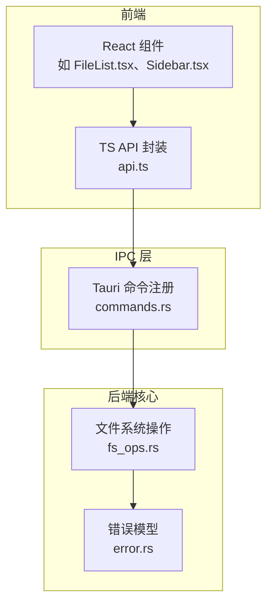
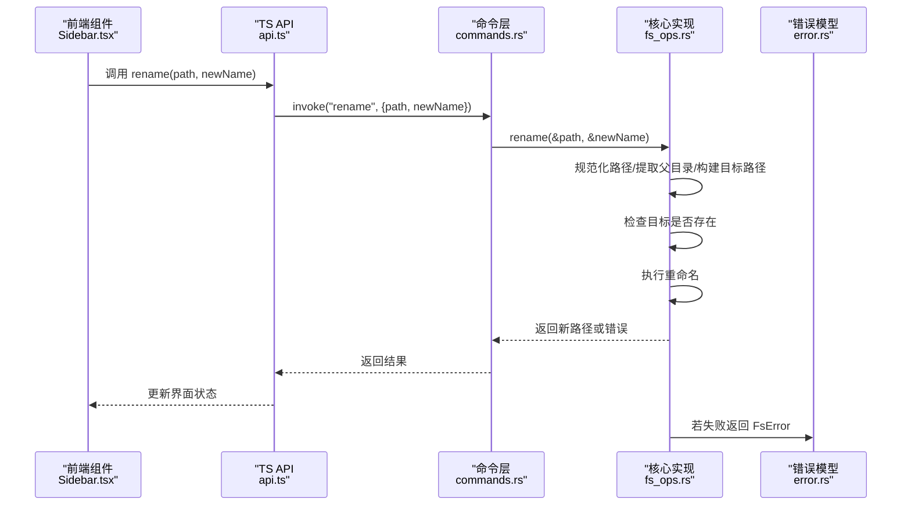
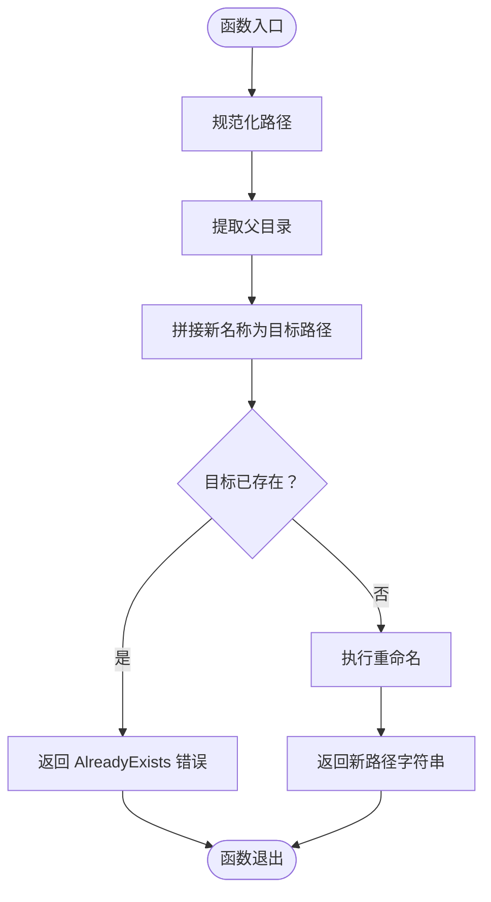
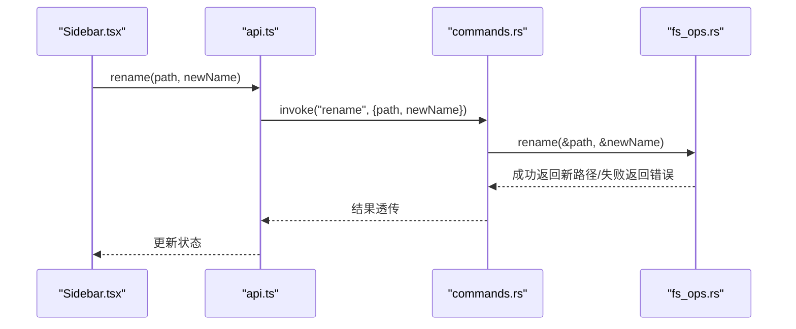

# 文件重命名操作

<cite>
**本文引用的文件**
- [fs_ops.rs](file://src-tauri/src/core/fs_ops.rs)
- [commands.rs](file://src-tauri/src/commands.rs)
- [error.rs](file://src-tauri/src/core/error.rs)
- [api.ts](file://src/api.ts)
- [types.ts](file://src/types.ts)
- [Sidebar.tsx](file://src/components/Sidebar.tsx)
</cite>

## 目录
1. [简介](#简介)
2. [项目结构](#项目结构)
3. [核心组件](#核心组件)
4. [架构总览](#架构总览)
5. [详细组件分析](#详细组件分析)
6. [依赖关系分析](#依赖关系分析)
7. [性能考量](#性能考量)
8. [故障排查指南](#故障排查指南)
9. [结论](#结论)
10. [附录](#附录)

## 简介
本文件围绕 LocalBro 的文件重命名功能进行系统化技术说明，重点聚焦 Rust 后端的 rename 实现与前端调用链路。内容涵盖：
- 父目录提取、目标路径构建与重名检测机制
- 安全检查逻辑（路径有效性、目标存在性、权限）
- 跨平台路径处理与兼容性注意事项
- 错误处理与边界情况处理方案
- 使用场景与调用流程图示

## 项目结构
LocalBro 采用 Tauri 架构，前端通过 @tauri-apps/api 调用后端命令；后端在 Rust 模块中实现文件系统操作，并通过命令暴露给前端。

图表来源
- [commands.rs:16-59](file://src-tauri/src/commands.rs#L16-L59)
- [fs_ops.rs:206-217](file://src-tauri/src/core/fs_ops.rs#L206-L217)
- [error.rs:7-29](file://src-tauri/src/core/error.rs#L7-L29)

章节来源
- [commands.rs:1-291](file://src-tauri/src/commands.rs#L1-L291)
- [fs_ops.rs:1-360](file://src-tauri/src/core/fs_ops.rs#L1-L360)
- [api.ts:1-317](file://src/api.ts#L1-L317)
- [types.ts:1-37](file://src/types.ts#L1-L37)

## 核心组件
- 前端封装：提供 rename(path, newName) 方法，通过 invoke 触发后端命令。
- 命令层：将前端参数转发至后端 fs_ops 模块。
- 核心实现：fs_ops::rename 执行路径规范化、父目录提取、目标路径构建、重名检测与实际重命名。
- 错误模型：统一的 FsError 枚举，映射 IO 错误到语义化错误类型。

章节来源
- [api.ts:79-81](file://src/api.ts#L79-L81)
- [commands.rs:56-59](file://src-tauri/src/commands.rs#L56-L59)
- [fs_ops.rs:206-217](file://src-tauri/src/core/fs_ops.rs#L206-L217)
- [error.rs:7-29](file://src-tauri/src/core/error.rs#L7-L29)

## 架构总览
下图展示从 UI 到后端的完整调用链与关键数据流。

图表来源
- [Sidebar.tsx:120-142](file://src/components/Sidebar.tsx#L120-L142)
- [api.ts:79-81](file://src/api.ts#L79-L81)
- [commands.rs:56-59](file://src-tauri/src/commands.rs#L56-L59)
- [fs_ops.rs:206-217](file://src-tauri/src/core/fs_ops.rs#L206-L217)
- [error.rs:7-29](file://src-tauri/src/core/error.rs#L7-L29)

## 详细组件分析

### 后端实现：rename 函数
- 输入参数
  - path：待重命名项的当前绝对或相对路径字符串
  - new_name：新的文件名（不含路径分隔符）
- 关键步骤
  1) 路径规范化：将输入转换为 PathBuf，空路径视为无效
  2) 父目录提取：从规范化路径中取出父目录
  3) 目标路径构建：将 new_name 连接到父目录形成目标路径
  4) 重名检测：若目标已存在则报 AlreadyExists
  5) 执行重命名：调用标准库 fs::rename
  6) 返回值：成功时返回新路径字符串
- 错误处理
  - NotFound：源路径不存在
  - AlreadyExists：目标已存在
  - InvalidPath：父目录缺失或路径为空
  - PermissionDenied：权限不足
  - Io：其他 IO 异常
- 性能特征
  - 时间复杂度：O(1)，仅一次系统调用
  - 内存占用：临时 PathBuf 构造，开销极小

图表来源
- [fs_ops.rs:206-217](file://src-tauri/src/core/fs_ops.rs#L206-L217)

章节来源
- [fs_ops.rs:206-217](file://src-tauri/src/core/fs_ops.rs#L206-L217)
- [error.rs:7-29](file://src-tauri/src/core/error.rs#L7-L29)

### 前端调用链：rename
- 前端封装
  - api.ts 提供 rename(path, newName) 方法，内部通过 invoke("rename", ...) 调用后端命令
- 命令注册
  - commands.rs 中 #[tauri::command] 注解将 rename 映射为 IPC 接口
- 类型定义
  - types.ts 定义 FsEntry 等类型，确保前后端一致的数据契约

图表来源
- [Sidebar.tsx:120-142](file://src/components/Sidebar.tsx#L120-L142)
- [api.ts:79-81](file://src/api.ts#L79-L81)
- [commands.rs:56-59](file://src-tauri/src/commands.rs#L56-L59)
- [fs_ops.rs:206-217](file://src-tauri/src/core/fs_ops.rs#L206-L217)

章节来源
- [api.ts:79-81](file://src/api.ts#L79-L81)
- [commands.rs:56-59](file://src-tauri/src/commands.rs#L56-L59)
- [types.ts:1-37](file://src/types.ts#L1-L37)

### 安全检查与边界情况
- 路径有效性
  - 空字符串路径直接判定为 InvalidPath
  - 非法字符或不被支持的路径格式由底层 IO 抛错并映射为 Io 或 PermissionDenied
- 目标存在性
  - 重命名前严格检查目标路径是否已存在，避免覆盖
- 权限验证
  - 无权限时返回 PermissionDenied
- 跨卷移动
  - rename 在跨设备/卷时可能失败，此时 move_path 提供回退策略（复制+删除），但 rename 本身不自动回退
- 边界情况
  - 新名称为空：由上层 UI 控制，建议在调用前 trim 并校验
  - 目标与源相同：重名检测会阻止覆盖自身
  - 父目录不存在：父目录提取失败将触发 InvalidPath

章节来源
- [fs_ops.rs:206-217](file://src-tauri/src/core/fs_ops.rs#L206-L217)
- [error.rs:7-29](file://src-tauri/src/core/error.rs#L7-L29)

### 跨平台路径处理与兼容性
- 路径分隔符
  - Rust 使用标准库 Path/PathBuf 处理，自动适配不同平台的分隔符
  - 重命名仅接收 new_name（不含路径分隔符），避免跨平台路径拼接歧义
- 平台差异
  - Windows：隐藏属性、权限模型与 Unix 不同，但 rename 仍以底层文件系统为准
  - macOS/Linux：遵循 POSIX 语义，注意符号链接与权限位
- 兼容性建议
  - 前端 UI 应限制 new_name 只允许合法文件名字符，避免注入非法路径片段
  - 对于需要跨卷移动的场景，使用 move_path 而非 rename

章节来源
- [fs_ops.rs:206-217](file://src-tauri/src/core/fs_ops.rs#L206-L217)

## 依赖关系分析
- 前端依赖
  - api.ts 依赖 @tauri-apps/api 的 invoke
  - Sidebar.tsx 通过 api.ts 调用 rename
- 命令层依赖
  - commands.rs 依赖 core::fs_ops::rename
- 核心实现依赖
  - fs_ops.rs 依赖 std::fs、std::path、自定义错误模型
- 错误模型
  - error.rs 定义 FsError 并提供 from_io 工具，统一映射 IO 错误

图表来源
- [Sidebar.tsx:120-142](file://src/components/Sidebar.tsx#L120-L142)
- [api.ts:79-81](file://src/api.ts#L79-L81)
- [commands.rs:56-59](file://src-tauri/src/commands.rs#L56-L59)
- [fs_ops.rs:206-217](file://src-tauri/src/core/fs_ops.rs#L206-L217)
- [error.rs:7-29](file://src-tauri/src/core/error.rs#L7-L29)

章节来源
- [commands.rs:56-59](file://src-tauri/src/commands.rs#L56-L59)
- [fs_ops.rs:206-217](file://src-tauri/src/core/fs_ops.rs#L206-L217)
- [error.rs:7-29](file://src-tauri/src/core/error.rs#L7-L29)

## 性能考量
- rename 为 O(1) 操作，系统调用次数固定
- 路径规范化与父目录提取均为轻量级内存操作
- 建议在 UI 层做输入校验，减少无效调用
- 对于大目录批量重命名，可考虑节流或批处理策略

## 故障排查指南
- 常见错误与定位
  - NotFound：确认源路径存在且可访问
  - AlreadyExists：检查目标路径是否已被占用
  - InvalidPath：检查 new_name 是否为空或包含路径分隔符
  - PermissionDenied：检查目标目录写权限与文件只读属性
  - Io：查看系统日志，确认磁盘空间、文件句柄限制等
- 建议的日志与提示
  - 前端捕获异常并提示用户具体原因
  - 后端记录 FsError 的上下文（路径、操作类型）

章节来源
- [error.rs:7-29](file://src-tauri/src/core/error.rs#L7-L29)
- [fs_ops.rs:206-217](file://src-tauri/src/core/fs_ops.rs#L206-L217)

## 结论
LocalBro 的文件重命名通过简洁的后端实现与清晰的前端调用链完成。其核心在于严格的路径规范化、父目录提取与目标存在性检查，辅以统一的错误模型与跨平台路径处理。对于更复杂的跨卷移动需求，应结合 move_path 使用。在生产环境中，建议配合前端输入校验与完善的错误提示，提升用户体验与系统稳定性。

## 附录
- 使用场景示例
  - 用户在侧边栏双击集合名称进入重命名模式，输入新名称并提交，前端调用 rename，后端执行重命名并返回新路径，前端刷新列表
- 相关接口参考
  - 前端：api.ts 中 rename(path, newName)
  - 命令：commands.rs 中 #[tauri::command] pub fn rename(...)
  - 核心：fs_ops.rs 中 pub fn rename(path, new_name)
  - 错误：error.rs 中 FsError 枚举

章节来源
- [api.ts:79-81](file://src/api.ts#L79-L81)
- [commands.rs:56-59](file://src-tauri/src/commands.rs#L56-L59)
- [fs_ops.rs:206-217](file://src-tauri/src/core/fs_ops.rs#L206-L217)
- [error.rs:7-29](file://src-tauri/src/core/error.rs#L7-L29)
- [Sidebar.tsx:120-142](file://src/components/Sidebar.tsx#L120-L142)