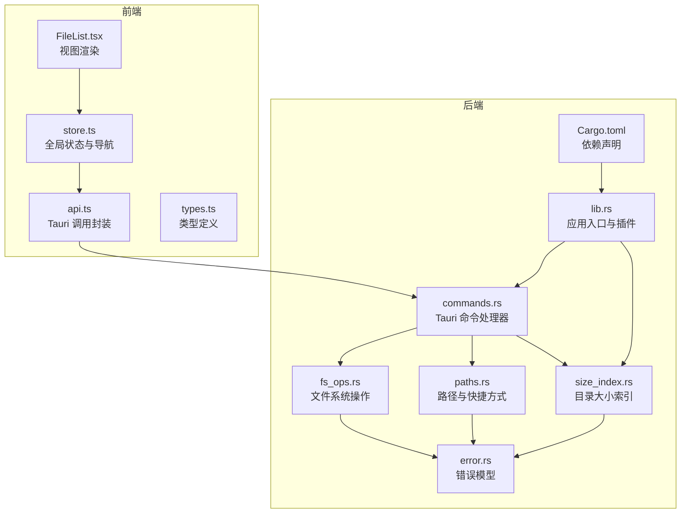
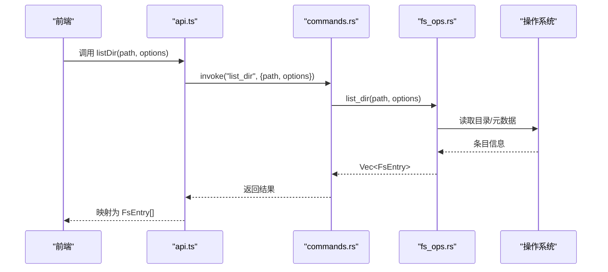
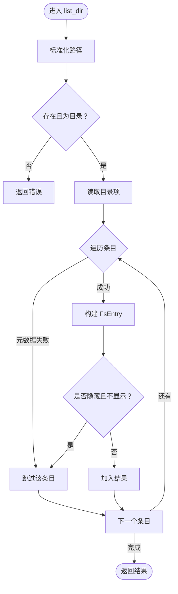
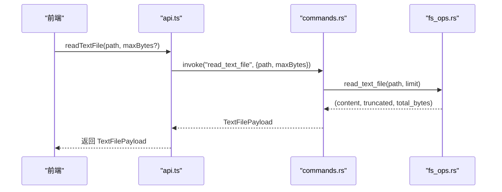
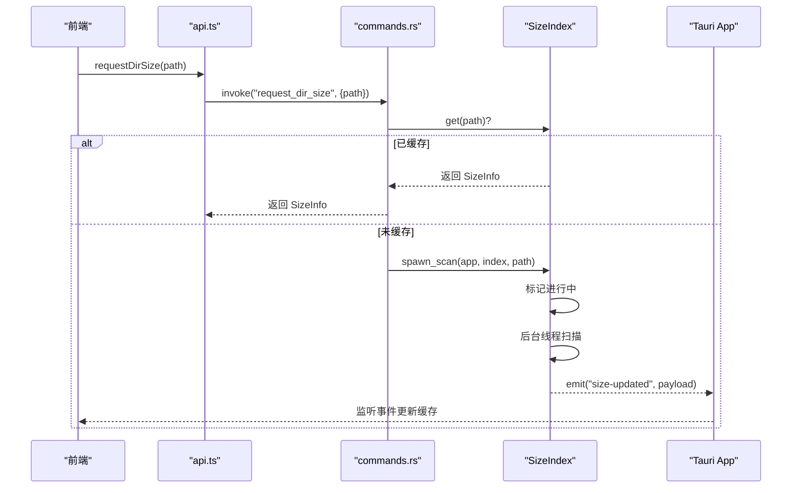
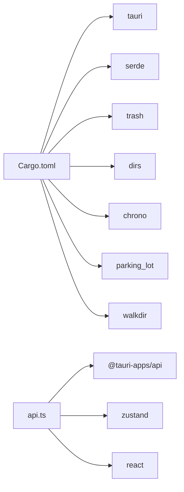

# 文件系统操作

<cite>
**本文引用的文件**
- [fs_ops.rs](file://src-tauri/src/core/fs_ops.rs)
- [commands.rs](file://src-tauri/src/commands.rs)
- [error.rs](file://src-tauri/src/core/error.rs)
- [paths.rs](file://src-tauri/src/core/paths.rs)
- [size_index.rs](file://src-tauri/src/core/size_index.rs)
- [lib.rs](file://src-tauri/src/lib.rs)
- [Cargo.toml](file://src-tauri/Cargo.toml)
- [api.ts](file://src/api.ts)
- [store.ts](file://src/store.ts)
- [types.ts](file://src/types.ts)
- [FileList.tsx](file://src/components/FileList.tsx)
</cite>

## 目录
1. [简介](#简介)
2. [项目结构](#项目结构)
3. [核心组件](#核心组件)
4. [架构总览](#架构总览)
5. [详细组件分析](#详细组件分析)
6. [依赖关系分析](#依赖关系分析)
7. [性能考量](#性能考量)
8. [故障排查指南](#故障排查指南)
9. [结论](#结论)
10. [附录：调用与错误处理示例](#附录调用与错误处理示例)

## 简介
本文件系统操作模块为 LocalBro 提供了跨平台的文件与目录管理能力，覆盖列表、统计、创建、删除、重命名、复制、移动（含跨设备）、回收站、原生定位、文本预览以及目录大小索引等核心功能。模块以 Rust 实现后端命令，通过 Tauri 暴露给前端，统一错误模型与元数据格式，确保在 Windows、macOS、Linux 上的一致行为与良好的用户体验。

## 项目结构
- 后端（Rust）位于 src-tauri：
  - 核心命令与业务逻辑：commands.rs
  - 文件系统操作：core/fs_ops.rs
  - 路径与快捷方式：core/paths.rs
  - 错误模型：core/error.rs
  - 目录大小索引：core/size_index.rs
  - 应用入口与插件注册：src/lib.rs
  - 依赖声明：Cargo.toml
- 前端（TypeScript + React）位于 src：
  - API 封装与调用：api.ts
  - 全局状态与导航：store.ts
  - 类型定义：types.ts
  - 视图组件：components/FileList.tsx

图表来源
- [commands.rs:1-266](file://src-tauri/src/commands.rs#L1-L266)
- [fs_ops.rs:1-360](file://src-tauri/src/core/fs_ops.rs#L1-L360)
- [paths.rs:1-127](file://src-tauri/src/core/paths.rs#L1-L127)
- [size_index.rs:1-135](file://src-tauri/src/core/size_index.rs#L1-L135)
- [lib.rs:1-66](file://src-tauri/src/lib.rs#L1-L66)
- [Cargo.toml:1-36](file://src-tauri/Cargo.toml#L1-L36)
- [api.ts:1-280](file://src/api.ts#L1-L280)
- [store.ts:1-308](file://src/store.ts#L1-L308)
- [types.ts:1-37](file://src/types.ts#L1-L37)
- [FileList.tsx:1-173](file://src/components/FileList.tsx#L1-L173)

章节来源
- [commands.rs:1-266](file://src-tauri/src/commands.rs#L1-L266)
- [lib.rs:1-66](file://src-tauri/src/lib.rs#L1-L66)
- [Cargo.toml:1-36](file://src-tauri/Cargo.toml#L1-L36)

## 核心组件
- 文件系统操作（fs_ops.rs）
  - 列表与统计：list_dir、stat
  - 创建与删除：create_directory、create_file、delete_forever
  - 重命名与移动：rename、move_to_trash、move_path
  - 复制：copy
  - 文本读取：read_text_file
  - 原生定位：reveal_in_native
  - 元数据：FsEntry、EntryKind、ListOptions
  - 跨平台隐藏属性检测：is_os_hidden
- 命令层（commands.rs）
  - 将 Rust 函数暴露为 Tauri 命令，参数与返回值序列化/反序列化
  - 集成路径、集合、打包、设置等其他子系统
- 错误模型（error.rs）
  - 统一错误类型与序列化策略，便于前端消费
- 路径与快捷方式（paths.rs）
  - 快捷方式生成、卷枚举、家目录解析
- 目录大小索引（size_index.rs）
  - 缓存 + 后台扫描，事件通知
- 前端集成（api.ts、store.ts、types.ts、FileList.tsx）
  - 命令调用封装、状态管理、UI 渲染与排序

章节来源
- [fs_ops.rs:9-138](file://src-tauri/src/core/fs_ops.rs#L9-L138)
- [commands.rs:15-128](file://src-tauri/src/commands.rs#L15-L128)
- [error.rs:7-49](file://src-tauri/src/core/error.rs#L7-L49)
- [paths.rs:6-127](file://src-tauri/src/core/paths.rs#L6-L127)
- [size_index.rs:17-135](file://src-tauri/src/core/size_index.rs#L17-L135)
- [api.ts:32-136](file://src/api.ts#L32-L136)
- [store.ts:16-263](file://src/store.ts#L16-L263)
- [types.ts:1-37](file://src/types.ts#L1-L37)
- [FileList.tsx:1-173](file://src/components/FileList.tsx#L1-L173)

## 架构总览
后端通过 Tauri 将 Rust 命令暴露给前端，前端以函数式 API 调用，后端执行文件系统操作并返回结构化结果或错误信息。错误统一由 FsError 序列化为字符串，前端据此进行提示与降级处理。目录大小采用缓存 + 异步扫描，避免阻塞 UI。

图表来源
- [api.ts:37-48](file://src/api.ts#L37-L48)
- [commands.rs:15-18](file://src-tauri/src/commands.rs#L15-L18)
- [fs_ops.rs:141-170](file://src-tauri/src/core/fs_ops.rs#L141-L170)

## 详细组件分析

### 文件系统操作（fs_ops.rs）
- 数据模型
  - FsEntry：包含名称、路径、类型、大小、修改/创建时间、隐藏/只读、扩展名等字段
  - EntryKind：文件、目录、符号链接、其他
  - ListOptions：显示隐藏项、跟随符号链接
- 关键流程
  - 列表与统计：list_dir/stat 使用 PathBuf 标准化路径，读取元数据并转换为 FsEntry；支持跳过不可读条目
  - 创建：create_directory/create_file 在目标不存在时创建，避免覆盖
  - 删除：delete_forever 支持文件/目录；move_to_trash 使用第三方库归档到回收站
  - 重命名：rename 仅在同一父目录下重命名，避免跨盘符冲突
  - 移动：move_path 优先 rename，失败则回退为 copy + delete_forever（覆盖跨设备场景）
  - 复制：copy 对文件直接复制，对目录递归复制；符号链接按目标内容复制
  - 文本读取：read_text_file 限制最大字节数，UTF-8 替换非法字节，返回截断标记
  - 原生定位：reveal_in_native 在不同平台调用 open/explorer/xdg-open 定位文件
  - 跨平台隐藏：is_os_hidden 在 Unix 以点前缀识别，在 Windows 检查隐藏属性
- 性能与健壮性
  - 列表时跳过不可读条目，避免整表失败
  - 复制/移动时先检查目标是否存在，避免覆盖
  - 文本读取限制缓冲区大小，防止大文件内存压力

图表来源
- [fs_ops.rs:141-170](file://src-tauri/src/core/fs_ops.rs#L141-L170)
- [fs_ops.rs:87-138](file://src-tauri/src/core/fs_ops.rs#L87-L138)

章节来源
- [fs_ops.rs:9-138](file://src-tauri/src/core/fs_ops.rs#L9-L138)
- [fs_ops.rs:141-360](file://src-tauri/src/core/fs_ops.rs#L141-L360)

### 命令层（commands.rs）
- 将 fs_ops.rs 中的函数包装为 Tauri 命令，负责参数解包、默认值处理、返回值封装
- 集成路径、集合、打包、设置等子系统命令
- 文本文件读取命令返回结构化载荷，包含内容、截断标记与总字节数

图表来源
- [api.ts:131-136](file://src/api.ts#L131-L136)
- [commands.rs:93-102](file://src-tauri/src/commands.rs#L93-L102)
- [fs_ops.rs:297-318](file://src-tauri/src/core/fs_ops.rs#L297-L318)

章节来源
- [commands.rs:15-128](file://src-tauri/src/commands.rs#L15-L128)

### 错误模型（error.rs）
- 统一错误类型：未找到、权限不足、已存在、无效路径、IO 错误、不支持、内部错误
- 自动从 std::io::Error 推导具体错误类别
- 序列化为字符串，便于前端直接展示

章节来源
- [error.rs:7-49](file://src-tauri/src/core/error.rs#L7-L49)

### 路径与快捷方式（paths.rs）
- 快捷方式：Home/Desktop/Documents/Downloads/Pictures/Music/Videos/Volume/Recent
- 卷枚举：macOS 基于 /Volumes；Windows 基于 A:–Z:；Linux 基于 /mnt 与 /media/<user>
- 家目录解析：home_path，回退到根目录

章节来源
- [paths.rs:6-127](file://src-tauri/src/core/paths.rs#L6-L127)

### 目录大小索引（size_index.rs）
- 结构：共享缓存 + 进行中扫描集合
- 功能：请求目录大小、后台扫描、事件通知、失效
- 扫描策略：walkdir 递归遍历，忽略符号链接，累加文件大小与计数

图表来源
- [api.ts:115-121](file://src/api.ts#L115-L121)
- [commands.rs:113-128](file://src-tauri/src/commands.rs#L113-L128)
- [size_index.rs:60-104](file://src-tauri/src/core/size_index.rs#L60-L104)

章节来源
- [size_index.rs:17-135](file://src-tauri/src/core/size_index.rs#L17-L135)

### 前端集成（api.ts、store.ts、types.ts、FileList.tsx）
- api.ts：封装 invoke 调用，将后端 snake_case 字段映射为前端 camelCase
- store.ts：全局状态管理，包含历史、选择、排序、视图模式、目录大小缓存、预览等
- FileList.tsx：根据目录大小索引动态显示目录大小，支持网格/详情/列表视图与排序
- 类型定义：FsEntry、Shortcut、SortKey/SortDir 等

章节来源
- [api.ts:32-136](file://src/api.ts#L32-L136)
- [store.ts:16-263](file://src/store.ts#L16-L263)
- [types.ts:1-37](file://src/types.ts#L1-L37)
- [FileList.tsx:1-173](file://src/components/FileList.tsx#L1-L173)

## 依赖关系分析
- 后端依赖
  - tauri：命令系统与插件生态
  - serde/serde_json：序列化
  - thiserror：错误派生
  - trash：回收站
  - dirs：用户目录解析
  - chrono/parking_lot：时间与并发
  - walkdir：目录遍历
- 前端依赖
  - @tauri-apps/api：Tauri IPC
  - zustand：状态管理
  - react：UI 渲染

图表来源
- [Cargo.toml:17-27](file://src-tauri/Cargo.toml#L17-L27)
- [api.ts:1](file://src/api.ts#L1)

章节来源
- [Cargo.toml:17-27](file://src-tauri/Cargo.toml#L17-L27)
- [api.ts:1-280](file://src/api.ts#L1-L280)

## 性能考量
- 目录扫描与缓存
  - 使用 SizeIndex 缓存目录大小，避免重复计算
  - 同一路径并发请求合并为一次扫描，减少资源消耗
- IO 与内存
  - read_text_file 限制读取字节数，避免大文件导致内存峰值
  - 列表时跳过不可读条目，降低异常开销
- 跨设备移动
  - move_path 优先 rename，失败再回退 copy+delete，兼顾性能与正确性
- 并发与事件
  - 后台扫描使用独立线程，完成后通过事件更新缓存，保持 UI 流畅

[本节为通用性能建议，无需特定文件来源]

## 故障排查指南
- 常见错误与处理
  - 未找到：检查路径是否存在，确认父目录可访问
  - 权限不足：确认当前用户对目标路径有读写权限
  - 已存在：在创建/复制/移动前检查目标是否已存在
  - 不支持：某些平台不支持的操作会返回不支持错误
- 前端提示
  - 命令调用失败时，前端捕获错误并显示友好提示
  - 目录大小扫描失败不会影响 UI，仅不显示大小
- 回收站与原生定位
  - 回收站失败通常为外部库问题，可改用永久删除
  - 原生定位在 Linux 下为打开父目录，非精确选中

章节来源
- [error.rs:7-49](file://src-tauri/src/core/error.rs#L7-L49)
- [fs_ops.rs:220-235](file://src-tauri/src/core/fs_ops.rs#L220-L235)
- [fs_ops.rs:321-360](file://src-tauri/src/core/fs_ops.rs#L321-L360)

## 结论
LocalBro 的文件系统操作模块以清晰的分层设计实现了跨平台的文件管理能力。后端通过 Tauri 命令统一暴露接口，前端以类型安全的方式调用，配合错误模型与缓存机制，既保证了易用性也兼顾了性能与可靠性。后续可在目录大小索引上引入增量监听，进一步提升响应速度。

[本节为总结，无需特定文件来源]

## 附录：调用与错误处理示例
以下示例展示常见文件操作的调用方式与错误处理策略（以路径与参数为主，避免直接粘贴代码）：

- 列出目录
  - 前端调用：listDir(path, { showHidden, followSymlinks })
  - 后端命令：list_dir
  - 错误处理：未找到/权限不足/IO 错误
  - 参考路径
    - [api.ts:37-48](file://src/api.ts#L37-L48)
    - [commands.rs:15-18](file://src-tauri/src/commands.rs#L15-L18)
    - [fs_ops.rs:141-170](file://src-tauri/src/core/fs_ops.rs#L141-L170)

- 统计单个路径
  - 前端调用：stat(path)
  - 后端命令：stat
  - 错误处理：未找到/IO 错误
  - 参考路径
    - [api.ts:50-53](file://src/api.ts#L50-L53)
    - [commands.rs:20-23](file://src-tauri/src/commands.rs#L20-L23)
    - [fs_ops.rs:173-179](file://src-tauri/src/core/fs_ops.rs#L173-L179)

- 创建文件/目录
  - 前端调用：createFile(path)、createDirectory(path)
  - 后端命令：create_file、create_directory
  - 错误处理：已存在/权限不足/IO 错误
  - 参考路径
    - [api.ts:71-77](file://src/api.ts#L71-L77)
    - [commands.rs:46-53](file://src-tauri/src/commands.rs#L46-L53)
    - [fs_ops.rs:189-204](file://src-tauri/src/core/fs_ops.rs#L189-L204)

- 重命名
  - 前端调用：rename(path, newName)
  - 后端命令：rename
  - 错误处理：无效路径/已存在/IO 错误
  - 参考路径
    - [api.ts:79-81](file://src/api.ts#L79-L81)
    - [commands.rs:55-58](file://src-tauri/src/commands.rs#L55-L58)
    - [fs_ops.rs:206-217](file://src-tauri/src/core/fs_ops.rs#L206-L217)

- 复制/移动
  - 前端调用：copyPath(src, dst)、movePath(src, dst)
  - 后端命令：copy_path、move_path
  - 错误处理：源不存在/目标已存在/跨设备回退
  - 参考路径
    - [api.ts:91-97](file://src/api.ts#L91-L97)
    - [commands.rs:70-78](file://src-tauri/src/commands.rs#L70-L78)
    - [fs_ops.rs:258-292](file://src-tauri/src/core/fs_ops.rs#L258-L292)

- 删除/回收站
  - 前端调用：moveToTrash(path)、deleteForever(path)
  - 后端命令：move_to_trash、delete_forever
  - 错误处理：未找到/IO 错误
  - 参考路径
    - [api.ts:83-89](file://src/api.ts#L83-L89)
    - [commands.rs:60-68](file://src-tauri/src/commands.rs#L60-L68)
    - [fs_ops.rs:220-235](file://src-tauri/src/core/fs_ops.rs#L220-L235)

- 文本预览
  - 前端调用：readTextFile(path, maxBytes?)
  - 后端命令：read_text_file
  - 错误处理：未找到/IO 错误
  - 参考路径
    - [api.ts:131-136](file://src/api.ts#L131-L136)
    - [commands.rs:93-102](file://src-tauri/src/commands.rs#L93-L102)
    - [fs_ops.rs:297-318](file://src-tauri/src/core/fs_ops.rs#L297-L318)

- 目录大小索引
  - 前端调用：dirSizeCached(path)、requestDirSize(path)、invalidateDirSize(path)
  - 后端命令：dir_size_cached、request_dir_size、invalidate_dir_size
  - 参考路径
    - [api.ts:111-121](file://src/api.ts#L111-L121)
    - [commands.rs:104-128](file://src-tauri/src/commands.rs#L104-L128)
    - [size_index.rs:41-104](file://src-tauri/src/core/size_index.rs#L41-L104)

- 原生定位
  - 前端调用：revealInNative(path)
  - 后端命令：reveal_in_native
  - 错误处理：未找到/不支持/IO 错误
  - 参考路径
    - [api.ts:99-101](file://src/api.ts#L99-L101)
    - [commands.rs:80-83](file://src-tauri/src/commands.rs#L80-L83)
    - [fs_ops.rs:321-360](file://src-tauri/src/core/fs_ops.rs#L321-L360)