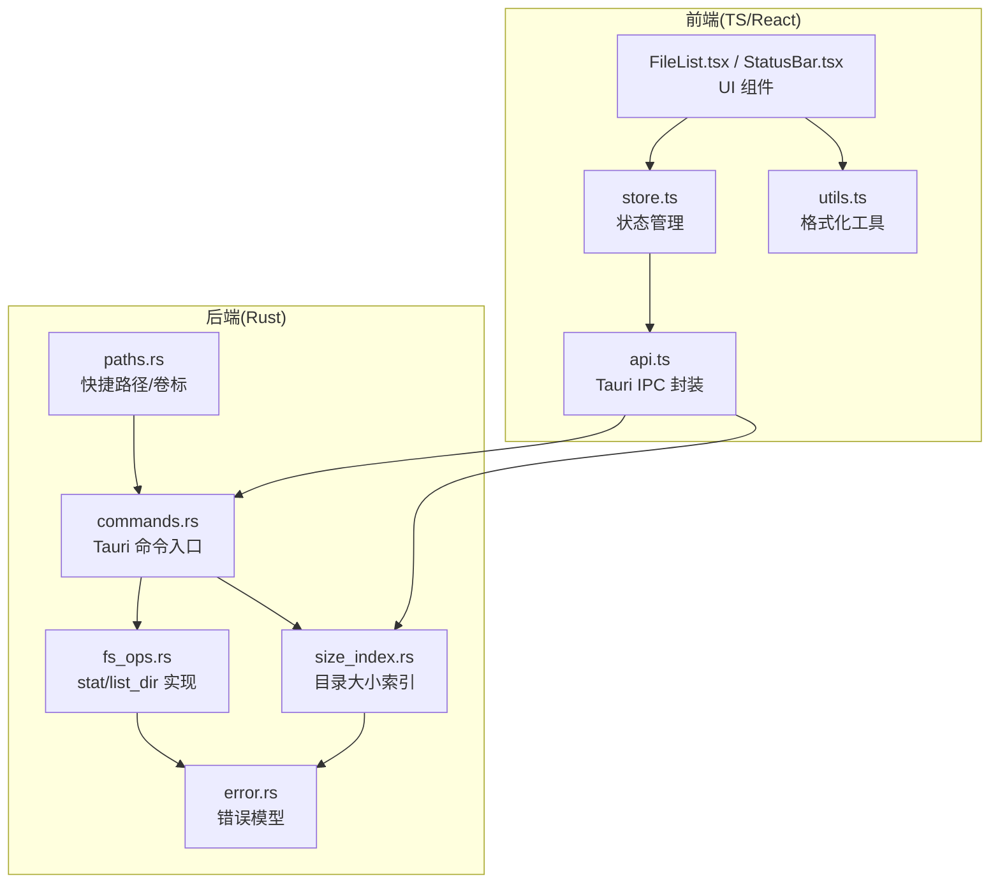
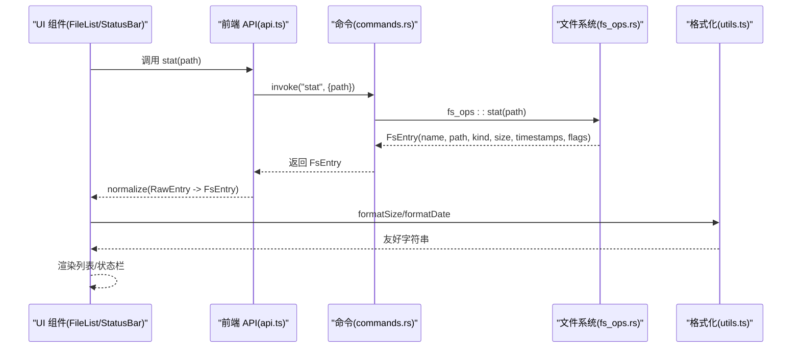
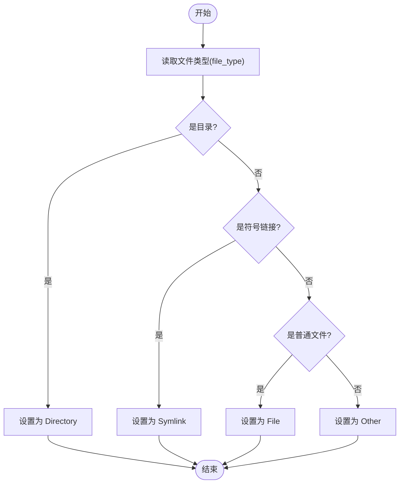
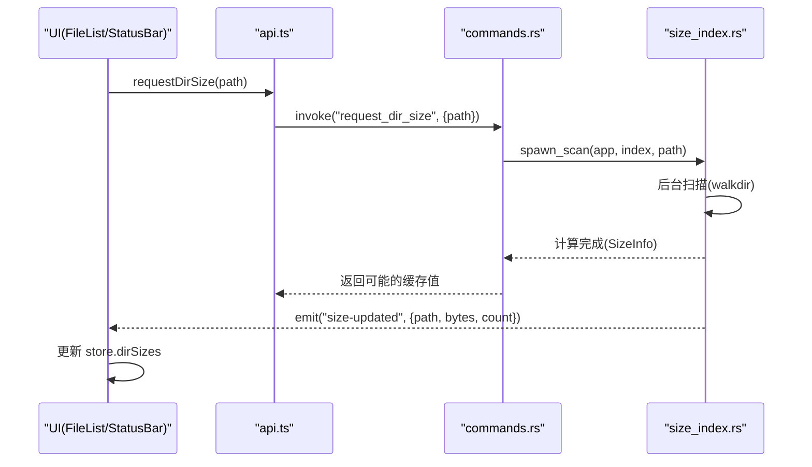
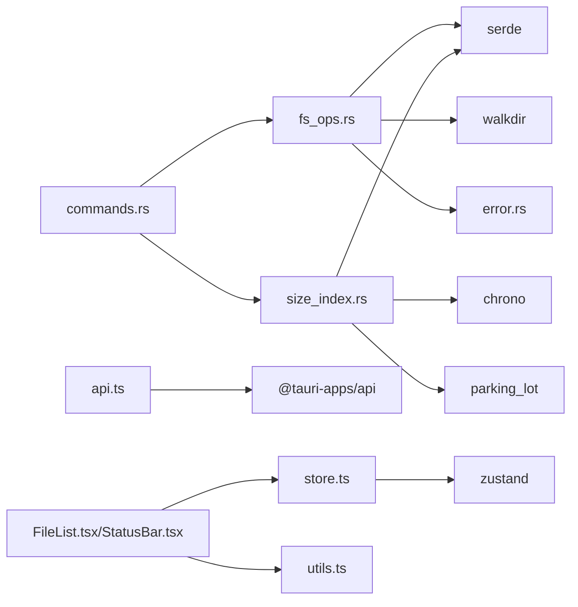

# 文件统计信息

<cite>
**本文引用的文件**
- [fs_ops.rs](file://src-tauri/src/core/fs_ops.rs)
- [commands.rs](file://src-tauri/src/commands.rs)
- [error.rs](file://src-tauri/src/core/error.rs)
- [size_index.rs](file://src-tauri/src/core/size_index.rs)
- [paths.rs](file://src-tauri/src/core/paths.rs)
- [api.ts](file://src/api.ts)
- [store.ts](file://src/store.ts)
- [FileList.tsx](file://src/components/FileList.tsx)
- [StatusBar.tsx](file://src/components/StatusBar.tsx)
- [types.ts](file://src/types.ts)
- [utils.ts](file://src/utils.ts)
- [Cargo.toml](file://src-tauri/Cargo.toml)
</cite>

## 目录
1. [简介](#简介)
2. [项目结构](#项目结构)
3. [核心组件](#核心组件)
4. [架构总览](#架构总览)
5. [详细组件分析](#详细组件分析)
6. [依赖关系分析](#依赖关系分析)
7. [性能考虑](#性能考虑)
8. [故障排查指南](#故障排查指南)
9. [结论](#结论)
10. [附录](#附录)

## 简介
本文件面向 LocalBro 的“文件统计信息”模块，系统性说明 stat 函数如何获取单个文件或目录的详细信息，涵盖文件类型检测、大小计算、时间戳获取、权限状态判断等；并深入解析 FsEntry 结构体各字段语义与用途，EntryKind 枚举的识别逻辑，以及在前端中的使用方式与性能优化策略。读者可据此快速理解从底层 Rust 到前端 TypeScript 的数据流转，并掌握在实际开发中如何高效利用这些统计信息。

## 项目结构
该模块横跨后端 Rust 与前端 TypeScript/Tauri 两部分：
- 后端核心：在 Rust 中通过命令暴露 stat/list_dir 等能力，生成 FsEntry 并返回给前端。
- 前端集成：通过 Tauri IPC 调用后端命令，接收 FsEntry 数据并在界面中展示（列表、网格、详情视图）。

图表来源
- [commands.rs:16-24](file://src-tauri/src/commands.rs#L16-L24)
- [fs_ops.rs:172-179](file://src-tauri/src/core/fs_ops.rs#L172-L179)
- [size_index.rs:105-134](file://src-tauri/src/core/size_index.rs#L105-L134)
- [api.ts:37-53](file://src/api.ts#L37-L53)
- [store.ts:73-263](file://src/store.ts#L73-L263)
- [FileList.tsx:66-197](file://src/components/FileList.tsx#L66-L197)
- [StatusBar.tsx:1-37](file://src/components/StatusBar.tsx#L1-L37)
- [utils.ts:1-66](file://src/utils.ts#L1-L66)

章节来源
- [commands.rs:16-24](file://src-tauri/src/commands.rs#L16-L24)
- [fs_ops.rs:172-179](file://src-tauri/src/core/fs_ops.rs#L172-L179)
- [api.ts:37-53](file://src/api.ts#L37-L53)
- [store.ts:73-263](file://src/store.ts#L73-L263)
- [FileList.tsx:66-197](file://src/components/FileList.tsx#L66-L197)
- [StatusBar.tsx:1-37](file://src/components/StatusBar.tsx#L1-L37)
- [utils.ts:1-66](file://src/utils.ts#L1-L66)

## 核心组件
- stat 命令与实现
  - 前端调用：api.ts 的 stat(path) 通过 invoke 调用后端命令。
  - 后端命令：commands.rs 的 #[tauri::command] pub fn stat(...) 调用 fs_ops::stat。
  - 核心实现：fs_ops.rs 的 stat(path) 返回 FsEntry，内部委托 entry_from 进行元数据采集。
- FsEntry 字段
  - name、path、kind、size、modified_ms、created_ms、hidden、readonly、extension。
- EntryKind 枚举
  - File、Directory、Symlink、Other，依据文件类型判定。
- 目录大小索引
  - 对于目录，FsEntry.size 为 None，由 size_index 提供懒计算与缓存。

章节来源
- [commands.rs:16-24](file://src-tauri/src/commands.rs#L16-L24)
- [fs_ops.rs:172-179](file://src-tauri/src/core/fs_ops.rs#L172-L179)
- [fs_ops.rs:18-37](file://src-tauri/src/core/fs_ops.rs#L18-L37)
- [fs_ops.rs:9-16](file://src-tauri/src/core/fs_ops.rs#L9-L16)
- [size_index.rs:17-53](file://src-tauri/src/core/size_index.rs#L17-L53)

## 架构总览
下图展示了从用户操作到最终渲染的关键流程：前端调用命令 -> 后端执行 stat -> 生成 FsEntry -> 前端格式化显示。

图表来源
- [api.ts:50-53](file://src/api.ts#L50-L53)
- [commands.rs:21-24](file://src-tauri/src/commands.rs#L21-L24)
- [fs_ops.rs:172-179](file://src-tauri/src/core/fs_ops.rs#L172-L179)
- [utils.ts:1-66](file://src/utils.ts#L1-L66)

## 详细组件分析

### stat 函数与 FsEntry 字段详解
- 功能定位
  - 针对单个路径进行“统计”，返回 FsEntry，包含名称、路径、类型、大小、时间戳、隐藏/只读标志、扩展名等。
- 关键实现点
  - 路径归一化与存在性检查。
  - 元数据读取：根据是否跟随符号链接决定使用 metadata 或 symlink_metadata。
  - 文件类型判定：基于 file_type 判断 File/Directory/Symlink/Other。
  - 大小：仅文件返回字节数，目录返回 None（由目录大小索引懒计算）。
  - 时间戳：modified_ms 与 created_ms 从系统时间转换为毫秒时间戳。
  - 权限：readonly 由文件权限决定。
  - 扩展名：从路径扩展名提取并转为小写。
  - 隐藏：Unix 以点开头即隐藏；Windows 检查 HIDDEN 属性。
- FsEntry 字段语义
  - name：条目名称（文件/目录名）。
  - path：绝对路径字符串。
  - kind：EntryKind（file/directory/symlink/other）。
  - size：文件大小（字节），目录为 None。
  - modified_ms：最后修改时间（毫秒）。
  - created_ms：创建时间（最佳努力，毫秒）。
  - hidden：是否隐藏（平台差异处理）。
  - readonly：是否只读。
  - extension：扩展名（小写，无点号），目录或无扩展名为 None。

章节来源
- [fs_ops.rs:87-138](file://src-tauri/src/core/fs_ops.rs#L87-L138)
- [fs_ops.rs:18-37](file://src-tauri/src/core/fs_ops.rs#L18-L37)
- [fs_ops.rs:62-85](file://src-tauri/src/core/fs_ops.rs#L62-L85)
- [fs_ops.rs:116-118](file://src-tauri/src/core/fs_ops.rs#L116-L118)
- [fs_ops.rs:120-123](file://src-tauri/src/core/fs_ops.rs#L120-L123)

### EntryKind 类型识别逻辑
- 识别规则
  - 目录：is_dir() → Directory
  - 符号链接：is_symlink() → Symlink
  - 普通文件：is_file() → File
  - 其他：Other
- 适用场景
  - UI 图标选择、排序优先级（目录优先）、行为差异（双击进入目录 vs 预览/解压）。

图表来源
- [fs_ops.rs:100-109](file://src-tauri/src/core/fs_ops.rs#L100-L109)

章节来源
- [fs_ops.rs:9-16](file://src-tauri/src/core/fs_ops.rs#L9-L16)
- [fs_ops.rs:100-109](file://src-tauri/src/core/fs_ops.rs#L100-L109)

### 目录大小懒计算与缓存
- 设计目标
  - 目录大小不直接在 stat 中计算，避免阻塞；通过 size_index 提供后台扫描与缓存。
- 关键机制
  - SizeIndex：内存缓存 + inflight 去重。
  - spawn_scan：后台线程递归扫描（walkdir），聚合文件数量与字节数。
  - 事件通知：扫描完成后通过 Tauri 事件向前端推送更新。
- 前端消费
  - store.ts 维护 dirSizes 映射；FileList/StatusBar 使用该映射为目录显示真实大小。

图表来源
- [commands.rs:113-124](file://src-tauri/src/commands.rs#L113-L124)
- [size_index.rs:60-104](file://src-tauri/src/core/size_index.rs#L60-L104)
- [size_index.rs:106-134](file://src-tauri/src/core/size_index.rs#L106-L134)
- [store.ts:205-206](file://src/store.ts#L205-L206)

章节来源
- [size_index.rs:17-53](file://src-tauri/src/core/size_index.rs#L17-L53)
- [size_index.rs:60-104](file://src-tauri/src/core/size_index.rs#L60-L104)
- [size_index.rs:106-134](file://src-tauri/src/core/size_index.rs#L106-L134)
- [store.ts:205-206](file://src/store.ts#L205-L206)

### 前端集成与使用示例
- 调用链路
  - api.ts 提供 stat(path) → commands.rs 的 #[tauri::command] stat → fs_ops::stat → 返回 FsEntry。
  - 前端在 FileList/StatusBar 中使用 formatSize/formatDate 进行展示。
- 示例场景
  - 单文件预览：stat 获取 size/modifiedMs/extension，用于状态栏与预览面板。
  - 目录统计：stat 获取目录信息，结合 size_index 的 dirSizes 显示真实大小。
  - 排序与筛选：按 name/size/modified 排序，受 showHidden 影响（列表时生效）。

章节来源
- [api.ts:50-53](file://src/api.ts#L50-L53)
- [commands.rs:21-24](file://src-tauri/src/commands.rs#L21-L24)
- [fs_ops.rs:172-179](file://src-tauri/src/core/fs_ops.rs#L172-L179)
- [FileList.tsx:66-197](file://src/components/FileList.tsx#L66-L197)
- [StatusBar.tsx:1-37](file://src/components/StatusBar.tsx#L1-L37)
- [utils.ts:1-66](file://src/utils.ts#L1-L66)

## 依赖关系分析
- Rust 侧依赖
  - serde：序列化 FsEntry/SizeInfo。
  - walkdir：目录递归扫描。
  - chrono/parking_lot：事件时间戳与并发锁。
  - thiserror/trash/dirs：错误封装与系统交互。
- 前端侧依赖
  - @tauri-apps/api：IPC 调用 invoke。
  - zustand：状态管理（store.ts）。
  - react：组件渲染（FileList.tsx/StatusBar.tsx）。

图表来源
- [Cargo.toml:17-31](file://src-tauri/Cargo.toml#L17-L31)
- [fs_ops.rs:1-10](file://src-tauri/src/core/fs_ops.rs#L1-L10)
- [size_index.rs:1-16](file://src-tauri/src/core/size_index.rs#L1-L16)
- [commands.rs:1-15](file://src-tauri/src/commands.rs#L1-L15)
- [api.ts:1-6](file://src/api.ts#L1-L6)
- [store.ts:1-5](file://src/store.ts#L1-L5)

章节来源
- [Cargo.toml:17-31](file://src-tauri/Cargo.toml#L17-L31)
- [fs_ops.rs:1-10](file://src-tauri/src/core/fs_ops.rs#L1-L10)
- [size_index.rs:1-16](file://src-tauri/src/core/size_index.rs#L1-L16)
- [commands.rs:1-15](file://src-tauri/src/commands.rs#L1-L15)
- [api.ts:1-6](file://src/api.ts#L1-L6)
- [store.ts:1-5](file://src/store.ts#L1-L5)

## 性能考虑
- stat 的轻量性
  - 仅读取一次元数据，避免重复 IO；目录大小延迟到 size_index 计算。
- 目录扫描优化
  - 使用 walkdir 且关闭 follow_links，减少符号链接遍历开销。
  - inflight 去重：同一路径并发请求仅启动一次扫描。
- 前端渲染优化
  - 使用 useMemo 缓存排序结果，避免重复计算。
  - 目录大小采用缓存映射，仅在事件到达时更新。
- I/O 与线程
  - 后台线程扫描，不影响主线程 UI；事件驱动更新，降低轮询成本。

章节来源
- [size_index.rs:60-104](file://src-tauri/src/core/size_index.rs#L60-L104)
- [size_index.rs:106-134](file://src-tauri/src/core/size_index.rs#L106-L134)
- [FileList.tsx:18-23](file://src/components/FileList.tsx#L18-L23)
- [store.ts:205-206](file://src/store.ts#L205-L206)

## 故障排查指南
- 常见错误类型
  - NotFound：路径不存在。
  - PermissionDenied：权限不足。
  - AlreadyExists：目标已存在。
  - InvalidPath：非期望路径（例如对非目录执行 list_dir）。
  - Io/Unsupported/Internal：IO 错误或不支持的操作。
- 定位方法
  - 查看后端错误封装与序列化输出（FsError → 字符串）。
  - 在前端捕获异常并提示用户。
- 建议
  - 调试时先确认路径有效性与权限。
  - 对目录大小请求使用 requestDirSize 并监听 size-updated 事件验证缓存命中。

章节来源
- [error.rs:8-29](file://src-tauri/src/core/error.rs#L8-L29)
- [error.rs:31-41](file://src-tauri/src/core/error.rs#L31-L41)
- [api.ts:131-136](file://src/api.ts#L131-L136)

## 结论
LocalBro 的文件统计信息模块以 stat 为核心，结合 FsEntry 的丰富字段与 EntryKind 的清晰分类，实现了对文件/目录的轻量统计与高效展示。通过 size_index 的懒计算与缓存，系统在保证响应性的前提下提供了准确的目录大小信息。前后端通过 Tauri IPC 紧密协作，前端组件负责渲染与交互，后端负责数据采集与计算，整体架构清晰、可维护性强。

## 附录
- TypeScript 类型映射
  - 后端 FsEntry 字段与前端 FsEntry 类型一一对应，api.ts 提供 normalize 适配层。
- 常用字段速览
  - name/path：标识条目。
  - kind：控制 UI 行为与图标。
  - size：文件大小；目录大小由 size_index 提供。
  - modified_ms/created_ms：时间戳（毫秒）。
  - hidden/readonly：平台隐藏与只读标志。
  - extension：扩展名（小写）。

章节来源
- [types.ts:1-37](file://src/types.ts#L1-L37)
- [api.ts:18-30](file://src/api.ts#L18-L30)
- [fs_ops.rs:18-37](file://src-tauri/src/core/fs_ops.rs#L18-L37)