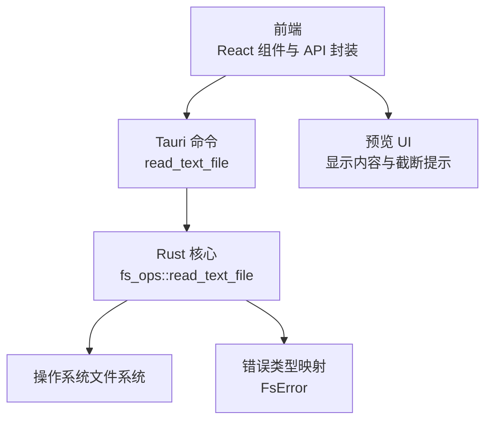
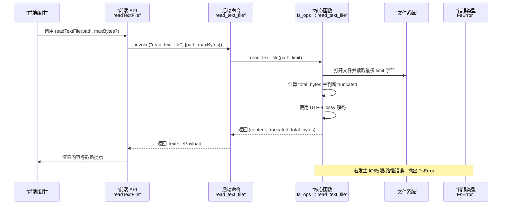
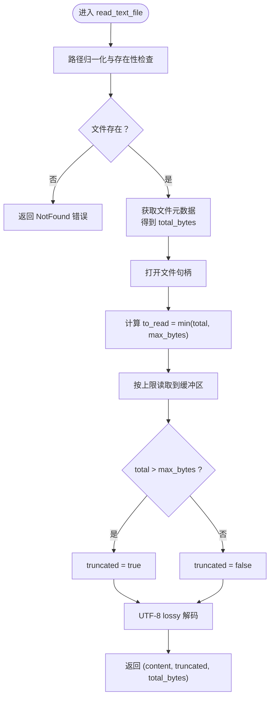
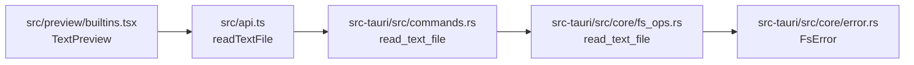

# 文本文件读取

<cite>
**本文引用的文件**
- [commands.rs](file://src-tauri/src/commands.rs)
- [fs_ops.rs](file://src-tauri/src/core/fs_ops.rs)
- [error.rs](file://src-tauri/src/core/error.rs)
- [api.ts](file://src/api.ts)
- [builtins.tsx](file://src/preview/builtins.tsx)
- [types.ts](file://src/types.ts)
</cite>

## 目录
1. [简介](#简介)
2. [项目结构](#项目结构)
3. [核心组件](#核心组件)
4. [架构总览](#架构总览)
5. [详细组件分析](#详细组件分析)
6. [依赖关系分析](#依赖关系分析)
7. [性能考量](#性能考量)
8. [故障排查指南](#故障排查指南)
9. [结论](#结论)
10. [附录：使用示例与最佳实践](#附录使用示例与最佳实践)

## 简介
本文档围绕 LocalBro 的文本文件读取功能进行深入技术解析，重点覆盖以下方面：
- read_text_file 命令在 Rust 后端的实现机制
- 文件大小限制、内存管理与 UTF-8 解码策略
- 截断检测逻辑（truncated 标志）与 max_bytes 参数的使用
- 错误处理策略（文件不存在、权限不足、编码错误等）
- 在前端中的使用示例与安全读取大文件的最佳实践

## 项目结构
LocalBro 采用 Tauri + React + TypeScript 架构，文本文件读取涉及前后端协作：
- 前端通过 @tauri-apps/api 调用后端命令 read_text_file
- 后端命令在 Rust 中实现，负责文件读取、截断判断与 UTF-8 解码
- 前端接收返回的文本内容、截断标志与总字节数，用于 UI 展示

图表来源
- [api.ts:131-136](file://src/api.ts#L131-L136)
- [commands.rs:94-103](file://src-tauri/src/commands.rs#L94-L103)
- [fs_ops.rs:294-318](file://src-tauri/src/core/fs_ops.rs#L294-L318)
- [builtins.tsx:76-115](file://src/preview/builtins.tsx#L76-L115)

章节来源
- [api.ts:131-136](file://src/api.ts#L131-L136)
- [commands.rs:94-103](file://src-tauri/src/commands.rs#L94-L103)
- [fs_ops.rs:294-318](file://src-tauri/src/core/fs_ops.rs#L294-L318)
- [builtins.tsx:76-115](file://src/preview/builtins.tsx#L76-L115)

## 核心组件
- 前端 API 封装：提供 readTextFile(path, maxBytes?) 接口，调用 Tauri 命令并返回 TextFilePayload
- 后端命令：read_text_file(path, max_bytes?) 将 max_bytes 缺省值设为 1 MiB，并转发给核心函数
- 核心函数：fs_ops::read_text_file(path, max_bytes) 执行实际读取、截断判断与 UTF-8 解码
- 错误类型：FsError 提供统一的错误映射（NotFound、PermissionDenied、Io 等）

章节来源
- [api.ts:125-136](file://src/api.ts#L125-L136)
- [commands.rs:86-103](file://src-tauri/src/commands.rs#L86-L103)
- [fs_ops.rs:294-318](file://src-tauri/src/core/fs_ops.rs#L294-L318)
- [error.rs:8-41](file://src-tauri/src/core/error.rs#L8-L41)

## 架构总览
下图展示了从用户触发到最终 UI 展示的完整流程，包含错误处理与截断提示。

图表来源
- [api.ts:131-136](file://src/api.ts#L131-L136)
- [commands.rs:94-103](file://src-tauri/src/commands.rs#L94-L103)
- [fs_ops.rs:294-318](file://src-tauri/src/core/fs_ops.rs#L294-L318)
- [error.rs:8-41](file://src-tauri/src/core/error.rs#L8-L41)

## 详细组件分析

### 命令层：read_text_file
- 默认行为：当未传入 max_bytes 时，默认读取上限为 1 MiB（1024*1024 字节）
- 数据封装：将核心返回的三元组封装为 TextFilePayload，包含 content、truncated、total_bytes
- 类型定义：TextFilePayload 在命令层声明，便于序列化与 IPC 传输

章节来源
- [commands.rs:86-103](file://src-tauri/src/commands.rs#L86-L103)

### 核心层：fs_ops::read_text_file
- 输入校验：先对路径进行归一化与存在性检查
- 大小查询：通过 metadata 获取文件总长度 total_bytes
- 读取策略：计算 to_read = min(total, max_bytes)，以最小容量分配缓冲区，使用 take(max_bytes) 限制读取量
- 截断判定：truncated = total > max_bytes
- 编码处理：使用 UTF-8 lossy 解码，将非法字节替换为 U+FFFD
- 返回值：(content, truncated, total_bytes)

图表来源
- [fs_ops.rs:294-318](file://src-tauri/src/core/fs_ops.rs#L294-L318)

章节来源
- [fs_ops.rs:294-318](file://src-tauri/src/core/fs_ops.rs#L294-L318)

### 错误处理：FsError 映射
- NotFound：文件不存在或路径无效
- PermissionDenied：权限不足
- Io：其他 IO 错误（含路径前缀）
- Unsupported：不支持的操作（当前与文本读取无关）
- 错误序列化：FsError 实现为字符串，便于前端直接消费

章节来源
- [error.rs:8-41](file://src-tauri/src/core/error.rs#L8-L41)

### 前端集成：Text 预览适配器
- 默认读取上限：1 MiB
- 截断提示：当 data.truncated 为真时，显示“仅显示前 X 字节，共 Y 字节（已截断）”
- 异常处理：捕获错误并在 UI 中提示失败原因

章节来源
- [builtins.tsx:76-115](file://src/preview/builtins.tsx#L76-L115)
- [api.ts:125-136](file://src/api.ts#L125-L136)

## 依赖关系分析
- 前端 API 依赖 Tauri invoke 机制
- 命令层依赖核心函数与错误类型
- 核心函数依赖标准库 io 与文件系统接口
- 前端预览组件依赖 API 返回的数据结构

图表来源
- [api.ts:131-136](file://src/api.ts#L131-L136)
- [commands.rs:94-103](file://src-tauri/src/commands.rs#L94-L103)
- [fs_ops.rs:294-318](file://src-tauri/src/core/fs_ops.rs#L294-L318)
- [error.rs:8-41](file://src-tauri/src/core/error.rs#L8-L41)
- [builtins.tsx:76-115](file://src/preview/builtins.tsx#L76-L115)

章节来源
- [api.ts:131-136](file://src/api.ts#L131-L136)
- [commands.rs:94-103](file://src-tauri/src/commands.rs#L94-L103)
- [fs_ops.rs:294-318](file://src-tauri/src/core/fs_ops.rs#L294-L318)
- [error.rs:8-41](file://src-tauri/src/core/error.rs#L8-L41)
- [builtins.tsx:76-115](file://src/preview/builtins.tsx#L76-L115)

## 性能考量
- 读取上限控制：通过 take(max_bytes) 限制读取量，避免一次性加载超大文件导致内存峰值过高
- 内存分配：缓冲区容量基于 to_read（min(total, max_bytes)），减少不必要的扩容
- UTF-8 解码：lossy 解码确保即使遇到非法字节也能稳定返回字符串，避免解码异常
- 截断提示：前端根据 total_bytes 与 content.length 提示用户已截断，避免误导

章节来源
- [fs_ops.rs:294-318](file://src-tauri/src/core/fs_ops.rs#L294-L318)
- [builtins.tsx:106-111](file://src/preview/builtins.tsx#L106-L111)

## 故障排查指南
- 文件不存在：命令会返回 NotFound 错误；前端应提示用户文件已被删除或移动
- 权限不足：返回 PermissionDenied；建议检查文件权限或以更高权限运行
- 编码错误：UTF-8 lossy 解码会将非法字节替换为 U+FFFD，若出现大量替换字符，可考虑以二进制方式读取或切换编码
- 超大文件：默认上限为 1 MiB；如需查看更多内容，可在调用时传入更大的 maxBytes
- 跨设备移动：该功能与文本读取无关，但与文件操作相关，若遇到跨设备移动问题，请参考对应命令的实现

章节来源
- [error.rs:8-41](file://src-tauri/src/core/error.rs#L8-L41)
- [fs_ops.rs:294-318](file://src-tauri/src/core/fs_ops.rs#L294-L318)
- [builtins.tsx:101-102](file://src/preview/builtins.tsx#L101-L102)

## 结论
LocalBro 的文本文件读取功能通过命令层、核心层与前端 UI 的协同，实现了安全、可控且用户友好的文本预览体验。其关键特性包括：
- 可配置的读取上限与自动截断检测
- 稳健的 UTF-8 解码策略
- 完善的错误映射与前端提示
- 明确的内存与性能边界

## 附录：使用示例与最佳实践
- 基本用法
  - 读取默认上限（1 MiB）：调用 readTextFile(path)
  - 指定上限：readTextFile(path, maxBytes)
- 大文件安全读取
  - 设置合理的 maxBytes，避免内存压力
  - 结合 truncated 标志提示用户内容被截断
  - 对于超大文件，考虑分页或流式处理
- 异常处理
  - 捕获并展示 FsError 的人类可读信息
  - 对于权限问题，引导用户检查文件权限
  - 对于编码问题，提供切换编码或以二进制方式查看的选项

章节来源
- [api.ts:131-136](file://src/api.ts#L131-L136)
- [builtins.tsx:76-115](file://src/preview/builtins.tsx#L76-L115)
- [types.ts:1-13](file://src/types.ts#L1-L13)