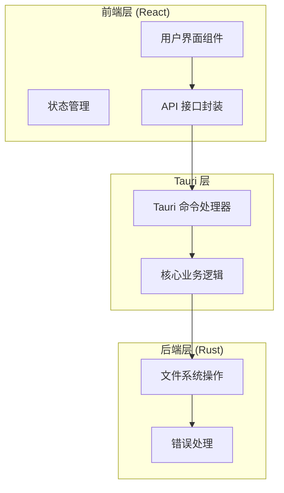
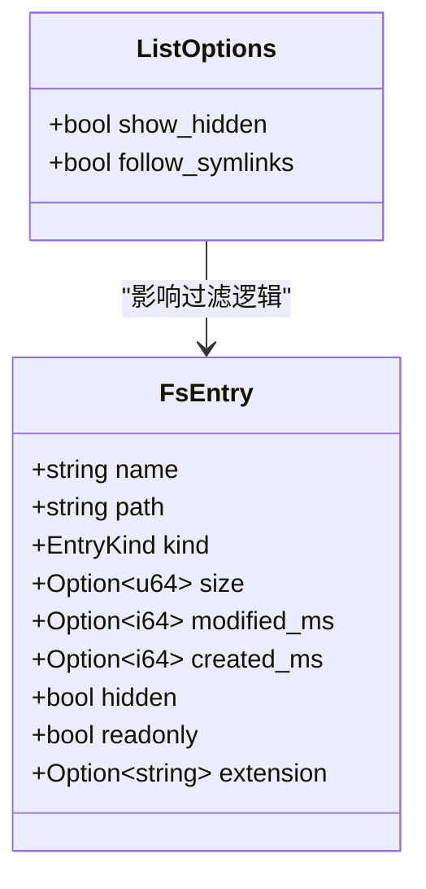
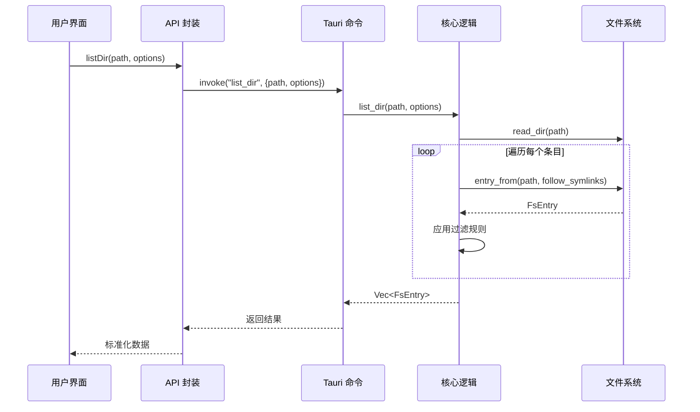
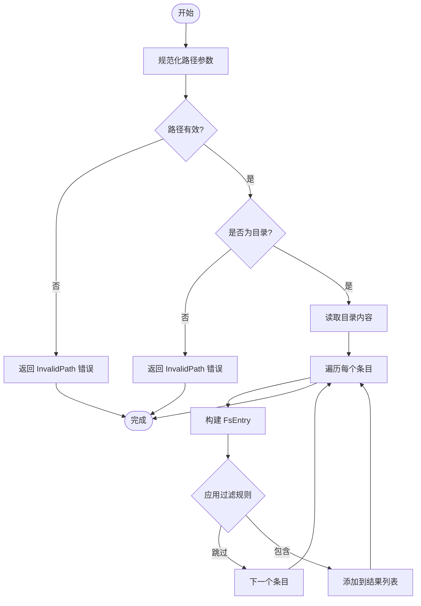
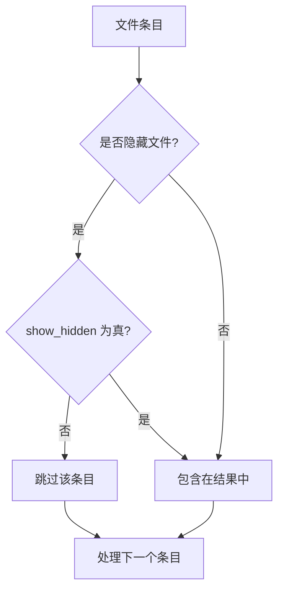
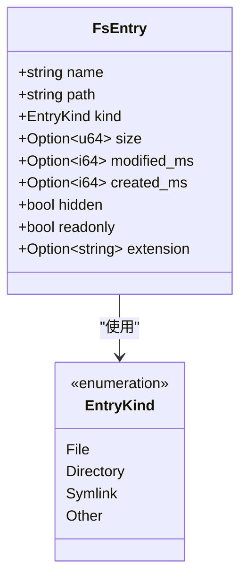
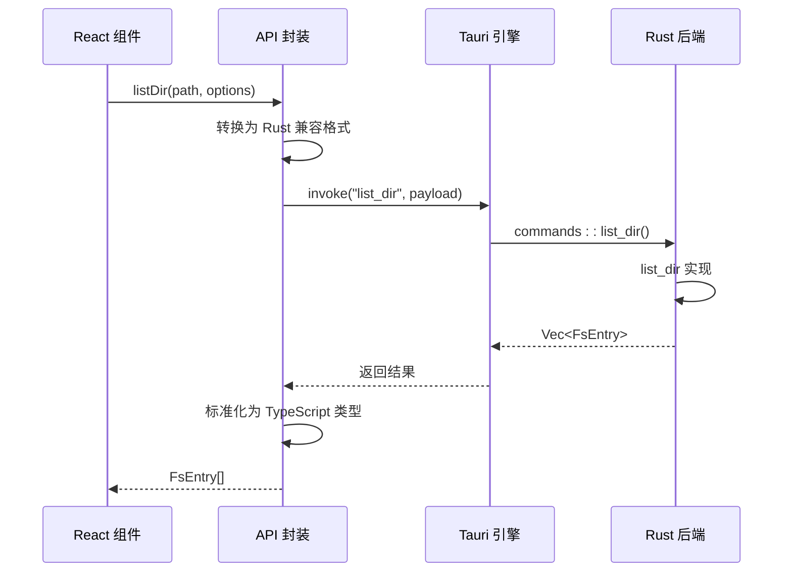
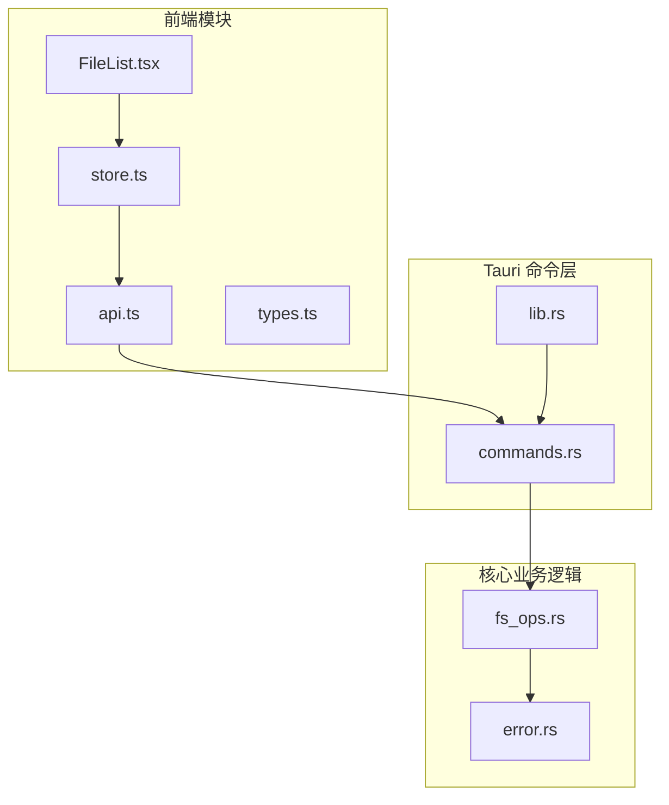
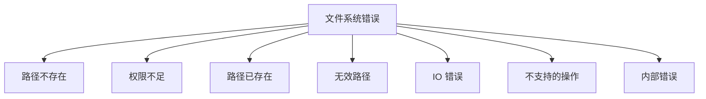

# 目录列表功能

<cite>
**本文档引用的文件**
- [fs_ops.rs](file://src-tauri/src/core/fs_ops.rs)
- [commands.rs](file://src-tauri/src/commands.rs)
- [error.rs](file://src-tauri/src/core/error.rs)
- [lib.rs](file://src-tauri/src/lib.rs)
- [api.ts](file://src/api.ts)
- [store.ts](file://src/store.ts)
- [types.ts](file://src/types.ts)
- [FileList.tsx](file://src/components/FileList.tsx)
</cite>

## 目录
1. [简介](#简介)
2. [项目结构](#项目结构)
3. [核心组件](#核心组件)
4. [架构概览](#架构概览)
5. [详细组件分析](#详细组件分析)
6. [依赖关系分析](#依赖关系分析)
7. [性能考虑](#性能考虑)
8. [故障排除指南](#故障排除指南)
9. [结论](#结论)

## 简介

LocalBro 是一个基于 Tauri + React + TypeScript 构建的文件管理器应用。本文档深入解析其目录列表功能的实现机制，重点涵盖以下方面：

- `list_dir` 函数的实现原理和目录遍历算法
- 文件过滤逻辑和隐藏文件处理策略
- `ListOptions` 配置选项的作用机制
- `entry_from` 函数如何从文件系统元数据构建 `FsEntry` 结构体
- 完整的调用流程和错误处理最佳实践

## 项目结构

LocalBro 采用前后端分离的架构设计，核心功能分布在以下模块中：



**图表来源**
- [lib.rs:13-69](file://src-tauri/src/lib.rs#L13-L69)
- [commands.rs:16-19](file://src-tauri/src/commands.rs#L16-L19)

**章节来源**
- [lib.rs:1-70](file://src-tauri/src/lib.rs#L1-L70)
- [commands.rs:1-291](file://src-tauri/src/commands.rs#L1-L291)

## 核心组件

### 目录列表函数 (list_dir)

`list_dir` 函数是目录列表功能的核心实现，负责遍历指定路径下的所有条目并返回标准化的数据结构。

**关键特性：**
- 支持异步目录遍历
- 智能文件类型识别
- 可配置的过滤策略
- 错误容错处理

**章节来源**
- [fs_ops.rs:140-170](file://src-tauri/src/core/fs_ops.rs#L140-L170)

### 列表选项配置 (ListOptions)

`ListOptions` 结构体提供了灵活的目录列表配置能力：



**图表来源**
- [fs_ops.rs:39-47](file://src-tauri/src/core/fs_ops.rs#L39-L47)
- [fs_ops.rs:18-37](file://src-tauri/src/core/fs_ops.rs#L18-L37)

**章节来源**
- [fs_ops.rs:39-47](file://src-tauri/src/core/fs_ops.rs#L39-L47)

### 文件条目构建 (entry_from)

`entry_from` 函数负责将底层文件系统元数据转换为统一的 `FsEntry` 结构体：

**处理流程：**
1. 提取文件名和路径信息
2. 获取文件元数据（支持跟随符号链接）
3. 判断文件类型（文件、目录、符号链接、其他）
4. 提取文件属性（大小、时间戳、权限）
5. 处理扩展名和隐藏属性

**章节来源**
- [fs_ops.rs:87-138](file://src-tauri/src/core/fs_ops.rs#L87-L138)

## 架构概览

LocalBro 的目录列表功能采用分层架构设计，确保了清晰的职责分离和良好的可维护性：



**图表来源**
- [api.ts:37-48](file://src/api.ts#L37-L48)
- [commands.rs:16-19](file://src-tauri/src/commands.rs#L16-L19)
- [fs_ops.rs:140-170](file://src-tauri/src/core/fs_ops.rs#L140-L170)

## 详细组件分析

### 目录遍历算法

`list_dir` 函数实现了高效的目录遍历算法：



**图表来源**
- [fs_ops.rs:140-170](file://src-tauri/src/core/fs_ops.rs#L140-L170)

**章节来源**
- [fs_ops.rs:140-170](file://src-tauri/src/core/fs_ops.rs#L140-L170)

### 文件过滤逻辑

目录列表功能实现了智能的文件过滤机制：

#### 隐藏文件处理策略



**图表来源**
- [fs_ops.rs:159-167](file://src-tauri/src/core/fs_ops.rs#L159-L167)

#### 符号链接处理

`follow_symlinks` 参数控制符号链接的处理方式：
- `true`: 跟随符号链接，获取目标文件的真实元数据
- `false`: 使用 `symlink_metadata` 获取符号链接本身的元数据

**章节来源**
- [fs_ops.rs:93-97](file://src-tauri/src/core/fs_ops.rs#L93-L97)
- [fs_ops.rs:159](file://src-tauri/src/core/fs_ops.rs#L159)

### FsEntry 数据结构

`FsEntry` 结构体提供了统一的文件信息表示：



**图表来源**
- [fs_ops.rs:18-37](file://src-tauri/src/core/fs_ops.rs#L18-L37)
- [fs_ops.rs:9-16](file://src-tauri/src/core/fs_ops.rs#L9-L16)

**章节来源**
- [fs_ops.rs:18-37](file://src-tauri/src/core/fs_ops.rs#L18-L37)

### 前端集成实现

#### API 封装层

前端通过 `api.ts` 提供了类型安全的 API 封装：



**图表来源**
- [api.ts:37-48](file://src/api.ts#L37-L48)
- [commands.rs:16-19](file://src-tauri/src/commands.rs#L16-L19)

**章节来源**
- [api.ts:37-48](file://src/api.ts#L37-L48)
- [store.ts:112-136](file://src/store.ts#L112-L136)

#### 状态管理集成

前端使用 Zustand 进行状态管理，实现了完整的目录浏览体验：

**章节来源**
- [store.ts:73-263](file://src/store.ts#L73-L263)

## 依赖关系分析

### 模块间依赖关系



**图表来源**
- [lib.rs:1-70](file://src-tauri/src/lib.rs#L1-L70)
- [commands.rs:1-291](file://src-tauri/src/commands.rs#L1-L291)
- [fs_ops.rs:1-360](file://src-tauri/src/core/fs_ops.rs#L1-L360)

### 关键依赖链

1. **前端到后端的调用链**：`api.ts` → `commands.rs` → `fs_ops.rs`
2. **错误传播链**：`fs_ops.rs` → `error.rs` → `commands.rs` → `api.ts`
3. **状态管理链**：`store.ts` → `api.ts` → `commands.rs` → `fs_ops.rs`

**章节来源**
- [lib.rs:26-66](file://src-tauri/src/lib.rs#L26-L66)
- [commands.rs:7-8](file://src-tauri/src/commands.rs#L7-L8)

## 性能考虑

### 目录遍历优化

1. **流式处理**：使用迭代器逐个处理目录项，避免一次性加载所有数据
2. **错误容错**：单个条目的读取失败不会影响整个目录的遍历
3. **懒加载策略**：目录大小计算采用延迟索引机制

### 内存管理

- **增量处理**：逐个构建 `FsEntry` 对象，减少内存峰值
- **智能缓存**：前端实现目录大小缓存，避免重复计算
- **类型安全**：使用 TypeScript 确保运行时内存安全

### 并发处理

- **异步调用**：所有文件系统操作都是异步的
- **状态更新**：使用 React hooks 确保 UI 更新的响应性

## 故障排除指南

### 常见错误类型

根据 `FsError` 枚举定义，目录列表功能可能遇到以下错误：



**图表来源**
- [error.rs:8-29](file://src-tauri/src/core/error.rs#L8-L29)

### 错误处理最佳实践

#### 前端错误处理

```typescript
// 建议的错误处理模式
try {
  const entries = await api.listDir(path, options);
  // 处理成功结果
} catch (error) {
  if (error.includes('not found')) {
    // 处理路径不存在
  } else if (error.includes('permission')) {
    // 处理权限问题
  } else {
    // 处理其他错误
  }
}
```

#### 后端错误处理

后端实现了完善的错误映射机制：

**章节来源**
- [error.rs:31-41](file://src-tauri/src/core/error.rs#L31-L41)

### 调试技巧

1. **启用详细日志**：检查 Tauri 控制台输出
2. **验证路径权限**：确保应用程序有访问目标目录的权限
3. **检查符号链接**：确认符号链接指向的有效性
4. **监控内存使用**：大目录的遍历可能消耗较多内存

**章节来源**
- [fs_ops.rs:154-167](file://src-tauri/src/core/fs_ops.rs#L154-L167)

## 结论

LocalBro 的目录列表功能展现了现代文件管理器的优秀设计原则：

### 技术优势

1. **分层架构**：清晰的职责分离确保了代码的可维护性
2. **类型安全**：前后端都实现了强类型约束
3. **错误处理**：完善的错误传播和处理机制
4. **性能优化**：流式处理和缓存策略提升了用户体验

### 设计亮点

- **灵活的配置选项**：`ListOptions` 提供了强大的定制能力
- **智能的过滤逻辑**：隐藏文件处理符合用户预期
- **统一的数据模型**：`FsEntry` 简化了前端数据处理
- **完整的生命周期**：从调用到渲染的完整流程

### 扩展建议

1. **批量操作支持**：可以扩展支持多选文件的批量处理
2. **进度反馈**：对于大型目录，可以添加进度指示器
3. **缓存策略**：实现更智能的目录内容缓存机制
4. **并发优化**：对于超大目录，可以考虑分页加载

这个实现为开发者提供了一个优秀的参考案例，展示了如何在跨平台应用中实现高效、可靠的文件系统操作功能。