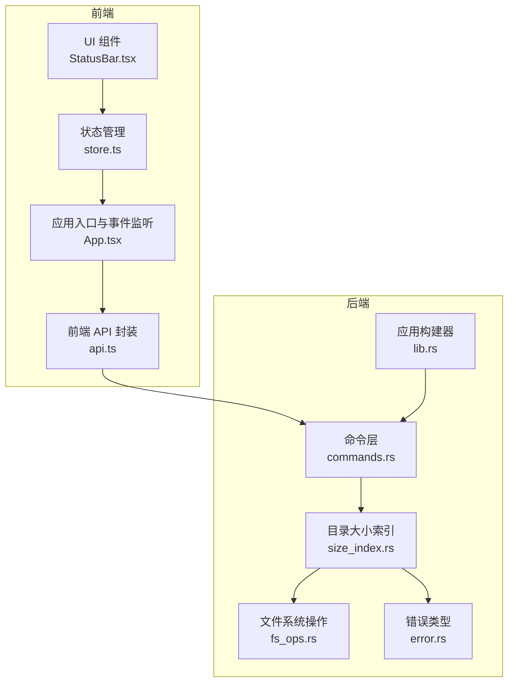
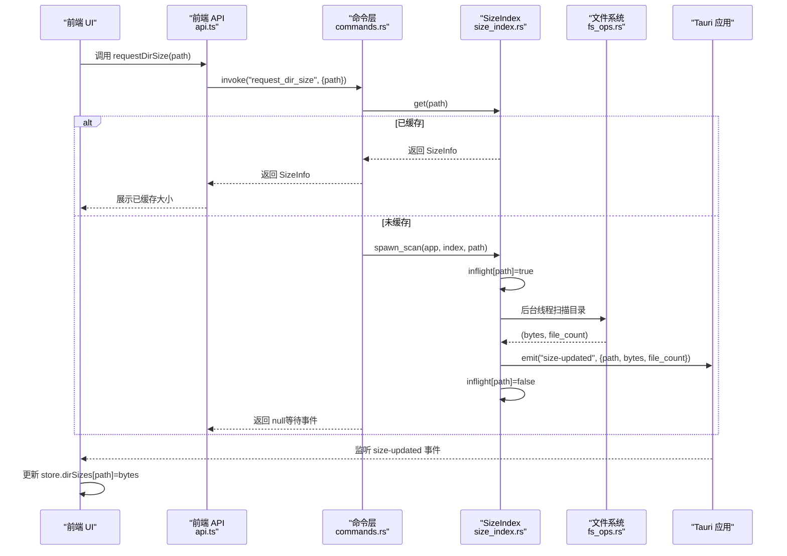
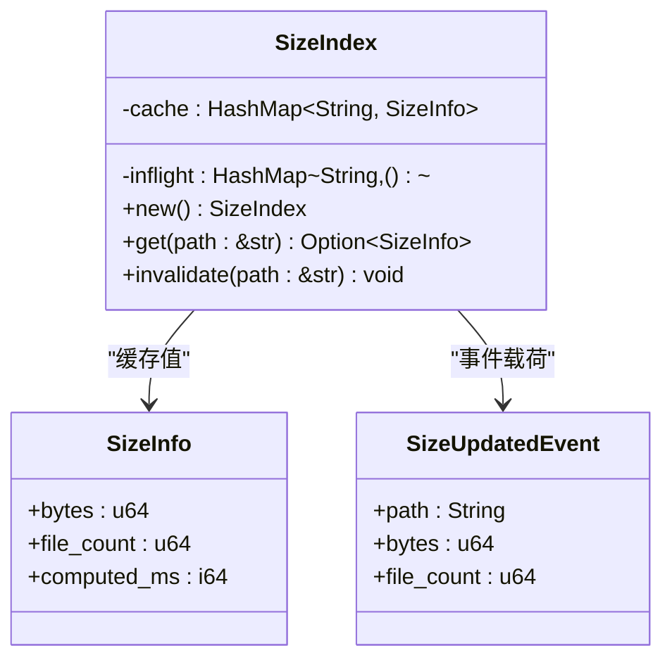
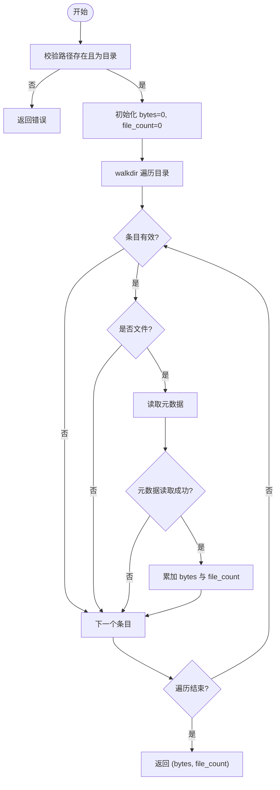
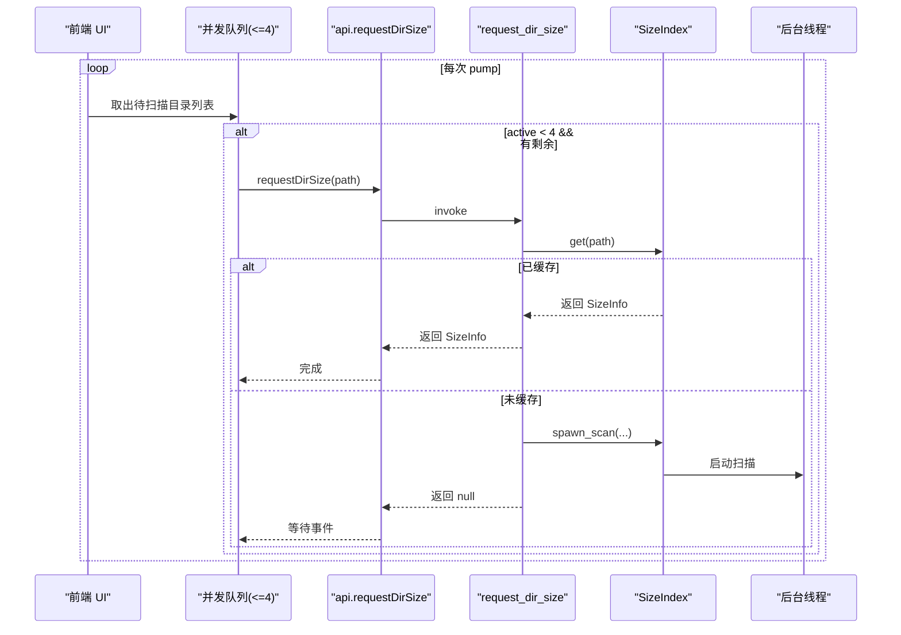
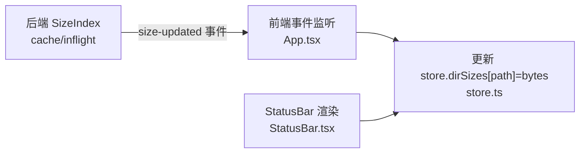
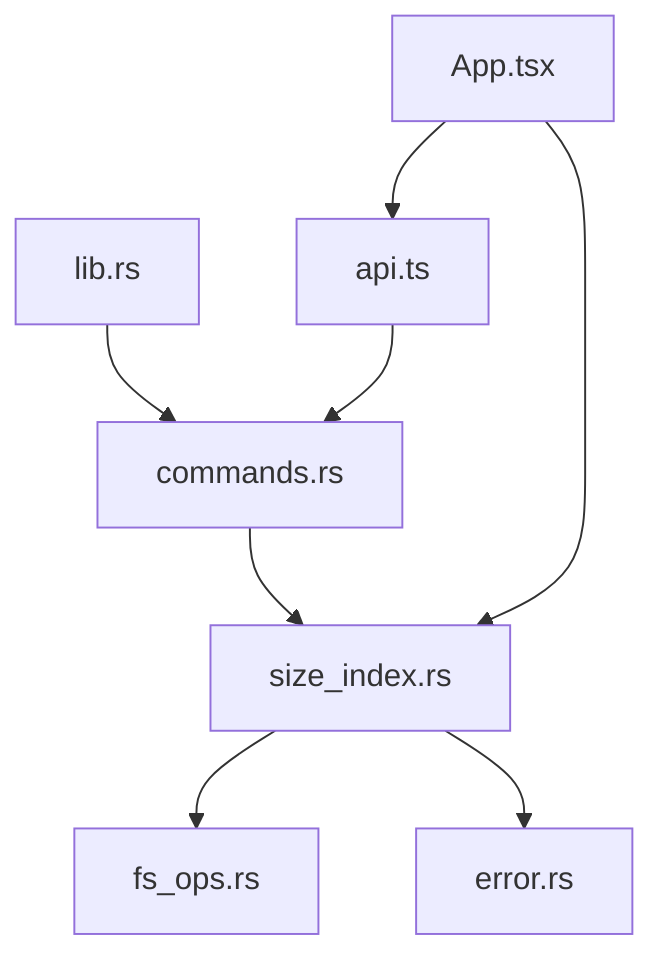

# 目录大小索引

<cite>
**本文引用的文件**
- [size_index.rs](file://src-tauri/src/core/size_index.rs)
- [commands.rs](file://src-tauri/src/commands.rs)
- [lib.rs](file://src-tauri/src/lib.rs)
- [Cargo.toml](file://src-tauri/Cargo.toml)
- [api.ts](file://src/api.ts)
- [App.tsx](file://src/App.tsx)
- [store.ts](file://src/store.ts)
- [StatusBar.tsx](file://src/components/StatusBar.tsx)
- [fs_ops.rs](file://src-tauri/src/core/fs_ops.rs)
- [error.rs](file://src-tauri/src/core/error.rs)
</cite>

## 目录
1. [简介](#简介)
2. [项目结构](#项目结构)
3. [核心组件](#核心组件)
4. [架构总览](#架构总览)
5. [详细组件分析](#详细组件分析)
6. [依赖关系分析](#依赖关系分析)
7. [性能考量](#性能考量)
8. [故障排除指南](#故障排除指南)
9. [结论](#结论)
10. [附录：API 使用示例与最佳实践](#附录api-使用示例与最佳实践)

## 简介
本文件针对 LocalBro 的“目录大小索引”子系统进行深入技术说明，涵盖以下方面：
- 缓存机制设计与实现：内存缓存结构、键值策略、并发去重与失效机制
- 目录大小计算算法：递归遍历、文件计数与字节统计、边界处理
- 并发扫描实现：后台线程管理、请求合并、资源限制与性能优化
- 数据存储与一致性：前端状态管理、事件驱动更新、缓存一致性保障
- API 使用示例：缓存查询、手动触发刷新、性能监控与故障排除

## 项目结构
该功能横跨 Rust 后端与 TypeScript 前端两部分：
- 后端（Tauri）：负责目录扫描、缓存维护、事件派发
- 前端（React + Zustand）：负责发起请求、接收事件、更新 UI

图表来源
- [api.ts:103-121](file://src/api.ts#L103-L121)
- [App.tsx:106-122](file://src/App.tsx#L106-L122)
- [store.ts:16-71](file://src/store.ts#L16-L71)
- [commands.rs:104-128](file://src-tauri/src/commands.rs#L104-L128)
- [size_index.rs:33-53](file://src-tauri/src/core/size_index.rs#L33-L53)
- [fs_ops.rs:140-170](file://src-tauri/src/core/fs_ops.rs#L140-L170)
- [error.rs:7-29](file://src-tauri/src/core/error.rs#L7-L29)
- [lib.rs:12-65](file://src-tauri/src/lib.rs#L12-L65)

章节来源
- [lib.rs:12-65](file://src-tauri/src/lib.rs#L12-L65)
- [commands.rs:104-128](file://src-tauri/src/commands.rs#L104-L128)
- [size_index.rs:33-53](file://src-tauri/src/core/size_index.rs#L33-L53)
- [api.ts:103-121](file://src/api.ts#L103-L121)
- [store.ts:16-71](file://src/store.ts#L16-L71)
- [App.tsx:106-122](file://src/App.tsx#L106-L122)
- [StatusBar.tsx:1-37](file://src/components/StatusBar.tsx#L1-L37)

## 核心组件
- SizeIndex：共享的内存缓存，键为绝对路径字符串，值为 SizeInfo；同时维护“飞行中”请求集合以避免重复扫描
- SizeInfo：包含字节数、文件数量与计算完成时间戳
- SizeUpdatedEvent：扫描完成后通过 Tauri 事件向前端推送结果
- 命令层：dir_size_cached、request_dir_size、invalidate_dir_size
- 前端：通过 invoke 调用命令，监听 size-updated 事件更新本地状态

章节来源
- [size_index.rs:17-31](file://src-tauri/src/core/size_index.rs#L17-L31)
- [size_index.rs:33-53](file://src-tauri/src/core/size_index.rs#L33-L53)
- [commands.rs:104-128](file://src-tauri/src/commands.rs#L104-L128)
- [api.ts:103-121](file://src/api.ts#L103-L121)
- [store.ts:58-60](file://src/store.ts#L58-L60)

## 架构总览
后端在应用启动时创建 SizeIndex 并注入到全局状态；前端通过命令查询缓存或触发后台扫描；扫描完成后通过事件回传结果，前端更新本地状态并渲染。

图表来源
- [commands.rs:104-128](file://src-tauri/src/commands.rs#L104-L128)
- [size_index.rs:60-104](file://src-tauri/src/core/size_index.rs#L60-L104)
- [fs_ops.rs:140-170](file://src-tauri/src/core/fs_ops.rs#L140-L170)
- [App.tsx:114-122](file://src/App.tsx#L114-L122)

## 详细组件分析

### SizeIndex 与缓存策略
- 结构
  - cache: HashMap<String, SizeInfo>，键为绝对路径字符串，值为 SizeInfo
  - inflight: HashMap<String, ()>，用于请求去重，避免同一路径重复扫描
- 查询与失效
  - get(path): 直接从缓存返回 SizeInfo 或 None
  - invalidate(path): 清除缓存项
- 并发控制
  - 在 spawn_scan 中先检查缓存，再检查 inflight，若均无则插入 inflight 并启动后台线程
  - 扫描结束后写入缓存并发出 size-updated 事件，最后移除 inflight 标记

图表来源
- [size_index.rs:17-31](file://src-tauri/src/core/size_index.rs#L17-L31)
- [size_index.rs:33-53](file://src-tauri/src/core/size_index.rs#L33-L53)

章节来源
- [size_index.rs:33-53](file://src-tauri/src/core/size_index.rs#L33-L53)

### 目录大小计算算法
- 输入校验：路径存在性与目录有效性
- 遍历策略：使用 walkdir::WalkDir 进行迭代，禁用跟随符号链接、跨文件系统
- 统计逻辑：仅对文件类型累加字节与计数，忽略不可读条目
- 边界处理：元数据读取失败时跳过该条目，防止整体失败

图表来源
- [size_index.rs:106-134](file://src-tauri/src/core/size_index.rs#L106-L134)
- [fs_ops.rs:140-170](file://src-tauri/src/core/fs_ops.rs#L140-L170)

章节来源
- [size_index.rs:106-134](file://src-tauri/src/core/size_index.rs#L106-L134)

### 并发扫描与资源限制
- 请求去重：inflight 防止同一路径重复扫描
- 后台线程：spawn_scan 在独立线程执行扫描，避免阻塞主线程
- 前端并发队列：App.tsx 中使用固定并发上限（如 4）的队列，按需批量触发扫描
- 错误处理：扫描失败不影响缓存，前端忽略单点错误

图表来源
- [App.tsx:28-69](file://src/App.tsx#L28-L69)
- [commands.rs:109-123](file://src-tauri/src/commands.rs#L109-L123)
- [size_index.rs:60-104](file://src-tauri/src/core/size_index.rs#L60-L104)

章节来源
- [App.tsx:28-69](file://src/App.tsx#L28-L69)
- [commands.rs:109-123](file://src-tauri/src/commands.rs#L109-L123)
- [size_index.rs:60-104](file://src-tauri/src/core/size_index.rs#L60-L104)

### 缓存数据存储与一致性
- 前端存储：Zustand store 中的 dirSizes 字典，键为绝对路径，值为字节数
- 事件驱动更新：后端通过 size-updated 事件推送 bytes，前端 setDirSize 合并更新
- 一致性保障：缓存键为绝对路径，避免同名不同目录的混淆；inflight 避免重复计算；扫描失败不写缓存，前端静默忽略

图表来源
- [size_index.rs:86-93](file://src-tauri/src/core/size_index.rs#L86-L93)
- [App.tsx:114-122](file://src/App.tsx#L114-L122)
- [store.ts:205-206](file://src/store.ts#L205-L206)
- [StatusBar.tsx:9-10](file://src/components/StatusBar.tsx#L9-L10)

章节来源
- [store.ts:31-32](file://src/store.ts#L31-L32)
- [store.ts:58-60](file://src/store.ts#L58-L60)
- [App.tsx:114-122](file://src/App.tsx#L114-L122)
- [StatusBar.tsx:9-10](file://src/components/StatusBar.tsx#L9-L10)

### 错误处理与健壮性
- 路径与权限：NotFound、InvalidPath、PermissionDenied 等错误通过 FsError 统一表达
- IO 失败：扫描过程中元数据读取失败会跳过该条目，避免整体失败
- 前端容错：并发队列中的单点错误被忽略，不影响其他任务

章节来源
- [error.rs:7-29](file://src-tauri/src/core/error.rs#L7-L29)
- [size_index.rs:106-134](file://src-tauri/src/core/size_index.rs#L106-L134)

## 依赖关系分析
- 外部库
  - walkdir：目录遍历
  - parking_lot::Mutex：高性能互斥锁
  - chrono：时间戳生成
  - serde：序列化
  - tauri::Emitter：事件派发
- 内部模块
  - commands.rs：暴露命令给前端
  - size_index.rs：缓存与扫描
  - fs_ops.rs：通用文件系统操作
  - error.rs：统一错误类型

图表来源
- [commands.rs:104-128](file://src-tauri/src/commands.rs#L104-L128)
- [size_index.rs:106-134](file://src-tauri/src/core/size_index.rs#L106-L134)
- [fs_ops.rs:140-170](file://src-tauri/src/core/fs_ops.rs#L140-L170)
- [error.rs:7-29](file://src-tauri/src/core/error.rs#L7-L29)
- [lib.rs:12-65](file://src-tauri/src/lib.rs#L12-L65)
- [api.ts:103-121](file://src/api.ts#L103-L121)
- [App.tsx:106-122](file://src/App.tsx#L106-L122)

章节来源
- [Cargo.toml:17-27](file://src-tauri/Cargo.toml#L17-L27)
- [lib.rs:12-65](file://src-tauri/src/lib.rs#L12-L65)

## 性能考量
- 时间复杂度
  - 单次扫描：O(N)，N 为目录下文件总数
  - 查询：O(1) 哈希表查找
- 空间复杂度
  - 缓存占用：每个已扫描路径占用常量级额外空间
- 并发与吞吐
  - 前端并发队列限制：避免过多后台线程导致 CPU/IO 抖动
  - inflight 去重：减少重复工作
- I/O 优化
  - walkdir 不跟随符号链接，避免循环与重复访问
  - 元数据读取失败即跳过，降低 I/O 阻塞风险
- 建议
  - 对大目录可考虑分批扫描或延迟加载
  - 增加缓存容量上限与淘汰策略（当前版本未实现）
  - 增加增量监控（后续里程碑）

[本节为通用性能讨论，无需特定文件来源]

## 故障排除指南
- 症状：点击目录无大小显示
  - 检查是否已触发扫描（前端并发队列是否在运行）
  - 检查 size-updated 事件是否被监听
- 症状：扫描卡住或重复
  - 检查 inflight 是否被正确清理
  - 检查路径是否为绝对路径
- 症状：权限不足导致扫描失败
  - 查看错误类型是否为 PermissionDenied
  - 确认用户权限与符号链接设置
- 症状：UI 显示异常
  - 检查 store.dirSizes 是否正确更新
  - 检查 StatusBar 的路径匹配逻辑

章节来源
- [error.rs:7-29](file://src-tauri/src/core/error.rs#L7-L29)
- [size_index.rs:60-104](file://src-tauri/src/core/size_index.rs#L60-L104)
- [App.tsx:114-122](file://src/App.tsx#L114-L122)
- [store.ts:205-206](file://src/store.ts#L205-L206)

## 结论
LocalBro 的目录大小索引采用“按需扫描 + 内存缓存 + 事件驱动”的设计，在保证简单可用的同时兼顾了并发与性能。当前版本通过 inflight 去重与前端并发队列实现了较好的用户体验；未来可引入增量监控与缓存淘汰策略以进一步提升稳定性与扩展性。

[本节为总结性内容，无需特定文件来源]

## 附录：API 使用示例与最佳实践

### 前端 API 使用
- 查询缓存：调用 [dirSizeCached:111-113](file://src/api.ts#L111-L113)
- 触发后台扫描：调用 [requestDirSize:115-117](file://src/api.ts#L115-L117)
- 失效缓存：调用 [invalidateDirSize:119-121](file://src/api.ts#L119-L121)

最佳实践
- 先调用缓存查询，若为空再触发扫描
- 使用并发队列限制扫描并发度，避免系统过载
- 监听 size-updated 事件，及时更新 UI

章节来源
- [api.ts:103-121](file://src/api.ts#L103-L121)
- [App.tsx:28-69](file://src/App.tsx#L28-L69)
- [store.ts:58-60](file://src/store.ts#L58-L60)

### 后端命令与事件
- 命令定义
  - [dir_size_cached:104-107](file://src-tauri/src/commands.rs#L104-L107)
  - [request_dir_size:109-123](file://src-tauri/src/commands.rs#L109-L123)
  - [invalidate_dir_size:125-128](file://src-tauri/src/commands.rs#L125-L128)
- 事件
  - 事件名："size-updated"
  - 载荷：SizeUpdatedEvent（path、bytes、file_count）

章节来源
- [commands.rs:104-128](file://src-tauri/src/commands.rs#L104-L128)
- [size_index.rs:25-31](file://src-tauri/src/core/size_index.rs#L25-L31)
- [size_index.rs:86-93](file://src-tauri/src/core/size_index.rs#L86-L93)

### 性能监控建议
- 记录扫描耗时与文件数量，辅助评估目录规模
- 监控 inflight 队列长度与完成率，识别热点路径
- 对超大目录采用分页或懒加载策略

[本节为通用建议，无需特定文件来源]