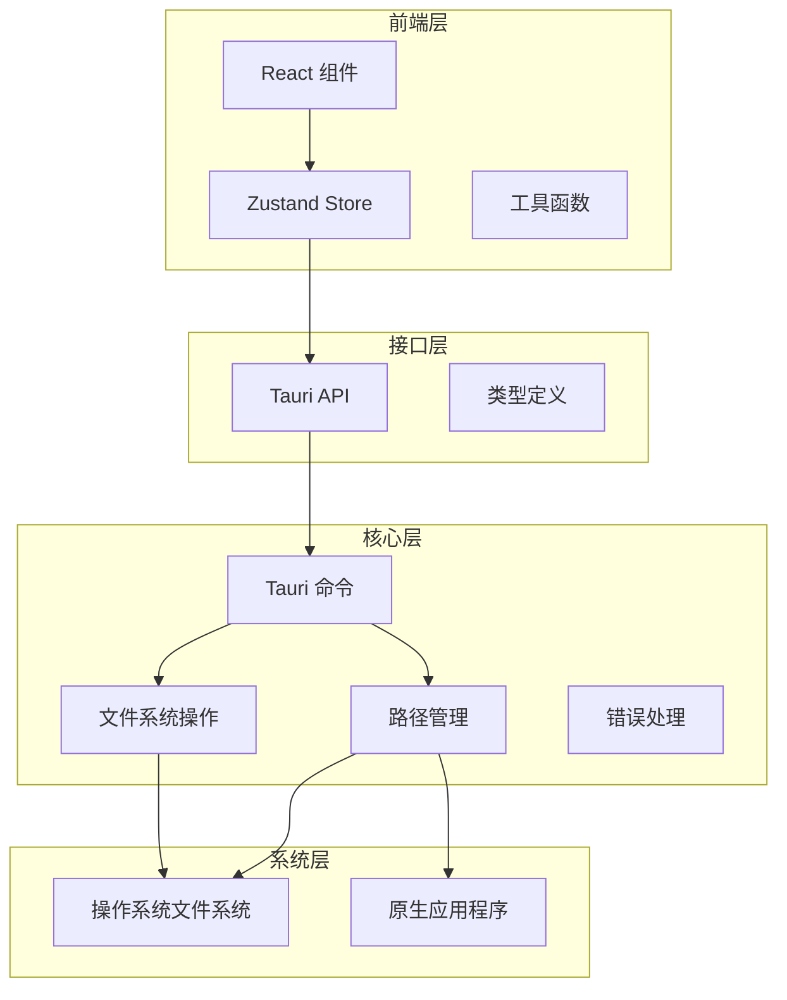
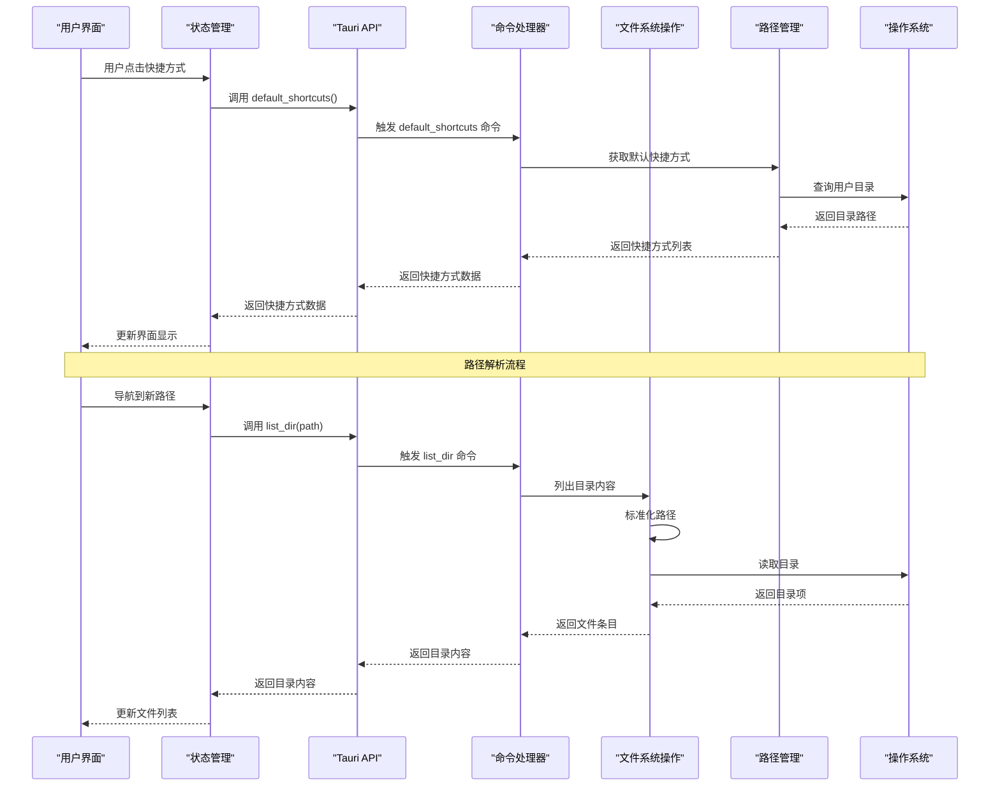
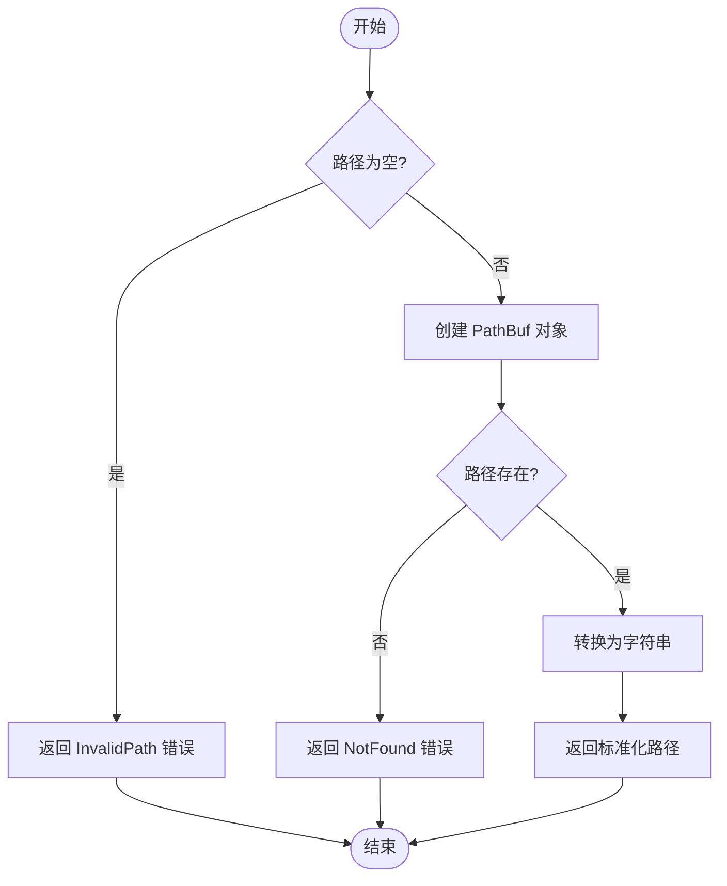
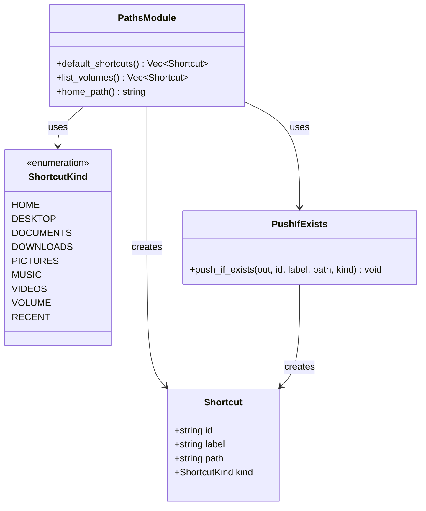
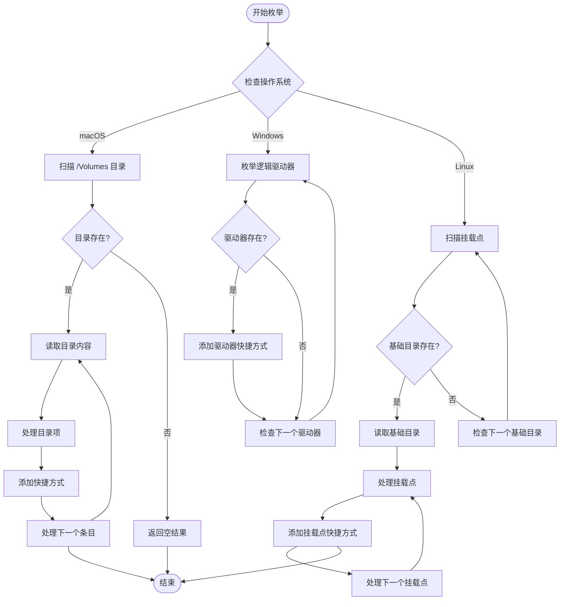
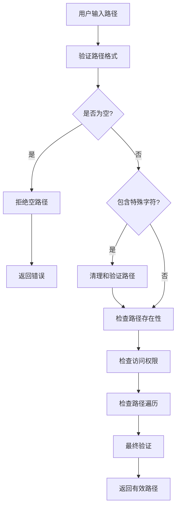
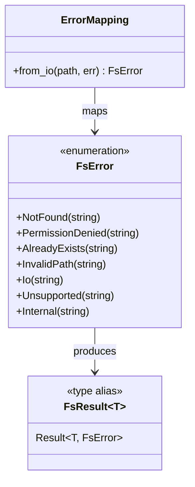
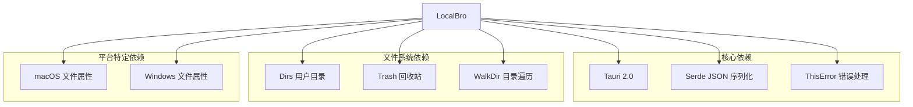
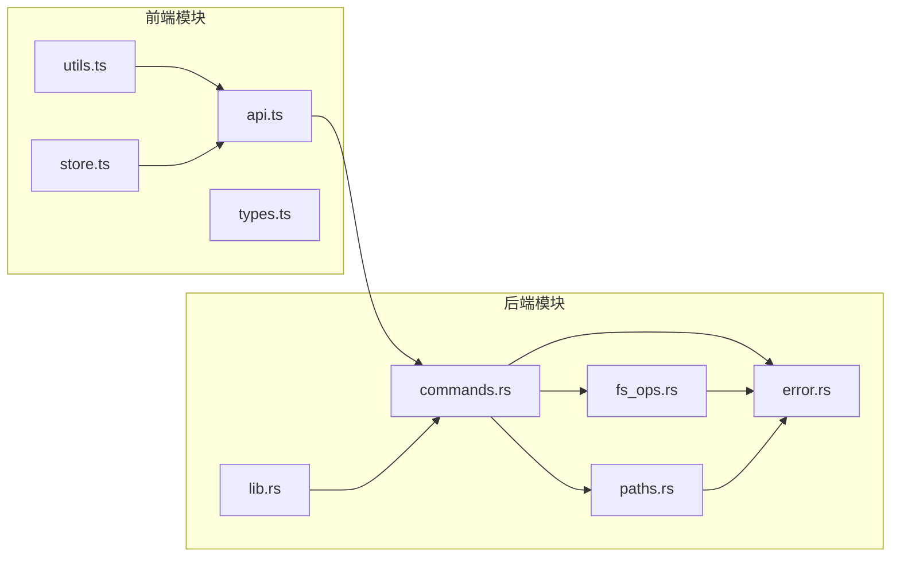

# 路径管理

<cite>
**本文档引用的文件**
- [paths.rs](file://src-tauri/src/core/paths.rs)
- [fs_ops.rs](file://src-tauri/src/core/fs_ops.rs)
- [error.rs](file://src-tauri/src/core/error.rs)
- [commands.rs](file://src-tauri/src/commands.rs)
- [lib.rs](file://src-tauri/src/lib.rs)
- [utils.ts](file://src/utils.ts)
- [store.ts](file://src/store.ts)
- [api.ts](file://src/api.ts)
- [types.ts](file://src/types.ts)
- [Cargo.toml](file://src-tauri/Cargo.toml)
</cite>

## 目录
1. [简介](#简介)
2. [项目结构](#项目结构)
3. [核心组件](#核心组件)
4. [架构概览](#架构概览)
5. [详细组件分析](#详细组件分析)
6. [依赖关系分析](#依赖关系分析)
7. [性能考虑](#性能考虑)
8. [故障排除指南](#故障排除指南)
9. [结论](#结论)

## 简介

LocalBro 是一个跨平台的本地文件浏览器，其路径管理系统是整个应用的核心基础设施。该系统提供了完整的路径解析、标准化和跨平台兼容性支持，包括：

- **路径解析与标准化**：处理绝对路径和相对路径，统一路径分隔符
- **快捷方式系统**：定义常用路径（桌面、文档、下载等）和磁盘卷枚举
- **跨平台兼容**：针对 macOS、Windows 和 Linux 的特定实现
- **安全验证**：路径有效性检查和权限验证
- **错误处理**：完善的错误类型和异常处理机制

## 项目结构

LocalBro 的路径管理功能分布在多个层次中，形成了清晰的分层架构：

**图表来源**
- [lib.rs:13-65](file://src-tauri/src/lib.rs#L13-L65)
- [commands.rs:1-266](file://src-tauri/src/commands.rs#L1-L266)

**章节来源**
- [lib.rs:1-66](file://src-tauri/src/lib.rs#L1-L66)
- [Cargo.toml:1-36](file://src-tauri/Cargo.toml#L1-L36)

## 核心组件

### 路径管理模块 (paths.rs)

路径管理模块是 LocalBro 路径系统的核心，负责处理各种路径相关的操作：

#### 快捷方式系统
- **内置快捷方式**：桌面、文档、下载、图片、音乐、视频等
- **动态枚举**：根据操作系统自动检测可用的快捷方式
- **存在性验证**：只返回实际存在的路径

#### 磁盘卷枚举
- **macOS**：扫描 `/Volumes` 目录下的所有卷
- **Windows**：枚举逻辑驱动器 A: 到 Z:
- **Linux**：扫描 `/mnt` 和 `/media/<user>` 目录

#### 跨平台路径处理
- **路径标准化**：统一使用 `PathBuf` 进行路径处理
- **编码转换**：使用 `to_string_lossy()` 处理非 UTF-8 路径
- **回退机制**：在无法获取用户主目录时回退到根目录

**章节来源**
- [paths.rs:1-127](file://src-tauri/src/core/paths.rs#L1-L127)

### 文件系统操作模块 (fs_ops.rs)

文件系统操作模块提供了底层的文件系统访问能力：

#### 路径标准化
- **空路径检查**：防止空字符串作为路径
- **路径验证**：确保路径存在且有效
- **错误处理**：详细的错误信息和类型

#### 文件属性提取
- **元数据获取**：文件大小、修改时间、创建时间
- **隐藏文件检测**：跨平台的隐藏文件识别
- **权限信息**：只读状态和其他权限标志

#### 操作类型定义
- **EntryKind**：文件、目录、符号链接、其他类型
- **ListOptions**：列表选项配置
- **FsEntry**：文件系统条目结构

**章节来源**
- [fs_ops.rs:1-360](file://src-tauri/src/core/fs_ops.rs#L1-L360)

### 错误处理模块 (error.rs)

错误处理模块定义了完整的错误类型系统：

#### 错误类型
- **NotFound**：路径不存在
- **PermissionDenied**：权限不足
- **AlreadyExists**：目标已存在
- **InvalidPath**：无效路径
- **IoError**：IO 操作错误
- **Unsupported**：不支持的操作

#### 错误映射
- **IO 错误转换**：将标准 IO 错误转换为应用特定错误
- **序列化支持**：错误类型可序列化为字符串
- **调试友好**：提供详细的错误信息

**章节来源**
- [error.rs:1-50](file://src-tauri/src/core/error.rs#L1-L50)

## 架构概览

LocalBro 的路径管理采用分层架构设计，确保了良好的模块化和可维护性：

**图表来源**
- [store.ts:97-136](file://src/store.ts#L97-L136)
- [api.ts:37-48](file://src/api.ts#L37-L48)
- [commands.rs:15-38](file://src-tauri/src/commands.rs#L15-L38)

## 详细组件分析

### 路径解析与标准化

#### 路径标准化流程

**图表来源**
- [fs_ops.rs:49-54](file://src-tauri/src/core/fs_ops.rs#L49-L54)
- [fs_ops.rs:141-148](file://src-tauri/src/core/fs_ops.rs#L141-L148)

#### 跨平台路径处理策略

LocalBro 采用了多种策略来处理不同操作系统的路径差异：

1. **统一路径表示**：使用 `PathBuf` 作为内部路径表示
2. **编码处理**：使用 `to_string_lossy()` 处理非 UTF-8 字符
3. **分隔符标准化**：在需要时统一使用正斜杠 `/`
4. **平台特定逻辑**：针对不同操作系统实现特定功能

**章节来源**
- [fs_ops.rs:49-54](file://src-tauri/src/core/fs_ops.rs#L49-L54)
- [paths.rs:122-126](file://src-tauri/src/core/paths.rs#L122-L126)

### 快捷方式系统实现

#### 快捷方式定义与枚举

**图表来源**
- [paths.rs:6-26](file://src-tauri/src/core/paths.rs#L6-L26)
- [paths.rs:42-52](file://src-tauri/src/core/paths.rs#L42-L52)

#### 平台特定的快捷方式实现

每个操作系统都有其特定的快捷方式实现：

**macOS 实现特点**：
- 使用 `dirs` crate 获取标准用户目录
- 自动检测用户目录的存在性
- 支持国际化路径名称

**Windows 实现特点**：
- 枚举逻辑驱动器 A: 到 Z:
- 检测每个驱动器的存在性
- 使用驱动器字母作为标识符

**Linux 实现特点**：
- 扫描 `/mnt` 和 `/media/<user>` 目录
- 支持用户特定的挂载点
- 动态发现可用的存储设备

**章节来源**
- [paths.rs:42-52](file://src-tauri/src/core/paths.rs#L42-L52)
- [paths.rs:58-119](file://src-tauri/src/core/paths.rs#L58-L119)

### 磁盘卷枚举机制

#### 卷枚举算法

**图表来源**
- [paths.rs:58-119](file://src-tauri/src/core/paths.rs#L58-L119)

#### 动态更新机制

磁盘卷枚举支持动态更新，当系统中的存储设备发生变化时能够及时反映：

- **实时检测**：每次调用 `list_volumes()` 时重新枚举
- **存在性验证**：确保返回的卷都处于可访问状态
- **错误容错**：即使部分卷不可访问也返回可用的卷列表

**章节来源**
- [paths.rs:58-119](file://src-tauri/src/core/paths.rs#L58-L119)

### 路径验证与安全检查

#### 路径验证策略

LocalBro 实施了多层次的路径验证机制：

1. **格式验证**：检查路径是否为空或格式正确
2. **存在性验证**：确认路径指向的资源存在
3. **权限验证**：检查用户是否有访问权限
4. **安全性检查**：防止路径遍历攻击

#### 安全性防护措施

**图表来源**
- [fs_ops.rs:141-148](file://src-tauri/src/core/fs_ops.rs#L141-L148)
- [fs_ops.rs:206-217](file://src-tauri/src/core/fs_ops.rs#L206-L217)

#### 权限检查机制

不同操作系统有不同的权限模型：

**Unix/Linux 权限检查**：
- 检查文件名是否以点开头
- 使用 `stat` 系统调用获取文件属性
- 验证用户权限位

**Windows 权限检查**：
- 使用 `FILE_ATTRIBUTE_HIDDEN` 标志
- 检查文件属性中的隐藏标志
- 验证访问控制列表

**章节来源**
- [fs_ops.rs:62-85](file://src-tauri/src/core/fs_ops.rs#L62-L85)
- [fs_ops.rs:173-179](file://src-tauri/src/core/fs_ops.rs#L173-L179)

### 错误处理策略

#### 错误分类与处理

LocalBro 的错误处理遵循严格的分类原则：

**图表来源**
- [error.rs:8-29](file://src-tauri/src/core/error.rs#L8-L29)
- [error.rs:31-41](file://src-tauri/src/core/error.rs#L31-L41)

#### 错误传播机制

错误在系统中的传播遵循以下模式：

1. **底层错误捕获**：文件系统操作捕获原始错误
2. **错误类型转换**：转换为应用特定的错误类型
3. **错误信息保留**：保持原始错误的上下文信息
4. **上层错误处理**：通过 API 层返回给前端

**章节来源**
- [error.rs:1-50](file://src-tauri/src/core/error.rs#L1-L50)
- [fs_ops.rs:32-41](file://src-tauri/src/core/fs_ops.rs#L32-L41)

## 依赖关系分析

### 外部依赖

LocalBro 的路径管理功能依赖于以下关键外部库：

**图表来源**
- [Cargo.toml:17-27](file://src-tauri/Cargo.toml#L17-L27)

### 内部模块依赖

**图表来源**
- [lib.rs:1-66](file://src-tauri/src/lib.rs#L1-L66)
- [commands.rs:1-266](file://src-tauri/src/commands.rs#L1-L266)

**章节来源**
- [Cargo.toml:1-36](file://src-tauri/Cargo.toml#L1-L36)
- [lib.rs:1-66](file://src-tauri/src/lib.rs#L1-L66)

## 性能考虑

### 路径操作性能优化

LocalBro 在路径管理方面实施了多项性能优化策略：

#### 缓存机制
- **目录大小缓存**：使用 `SizeIndex` 缓存目录大小计算结果
- **快捷方式缓存**：避免重复的系统调用
- **路径标准化缓存**：减少重复的路径处理开销

#### 异步操作
- **后台扫描**：目录大小扫描在后台线程执行
- **批量操作**：支持批量文件操作以减少系统调用次数
- **事件驱动更新**：通过事件通知更新 UI 状态

#### 内存管理
- **零拷贝字符串**：使用 `to_string_lossy()` 避免不必要的内存分配
- **流式读取**：大文件读取使用流式处理
- **智能释放**：及时释放不再使用的资源

### 最佳实践建议

#### 路径操作最佳实践

1. **始终进行路径验证**：在执行任何文件操作前验证路径的有效性
2. **使用适当的错误处理**：为不同的错误情况提供合适的处理策略
3. **避免路径遍历**：确保用户输入不会导致路径遍历攻击
4. **合理使用缓存**：利用缓存机制提高性能但要注意缓存一致性

#### 性能优化建议

1. **批量操作**：对于大量文件操作，使用批量 API 而不是单个操作
2. **异步处理**：长耗时操作应该异步执行，避免阻塞 UI
3. **延迟加载**：目录内容可以按需加载，而不是一次性加载所有内容
4. **资源池管理**：对于频繁创建销毁的对象，使用对象池模式

## 故障排除指南

### 常见问题及解决方案

#### 路径解析问题

**问题**：路径解析失败或返回空结果
**可能原因**：
- 路径为空或格式不正确
- 路径指向的资源不存在
- 权限不足无法访问路径

**解决方案**：
1. 验证路径格式和长度
2. 检查路径是否存在
3. 确认用户具有访问权限
4. 使用 `normalize` 函数标准化路径

#### 快捷方式显示问题

**问题**：某些快捷方式不显示或显示错误
**可能原因**：
- 对应的用户目录不存在
- 权限不足无法访问目录
- 路径编码问题

**解决方案**：
1. 检查用户目录的实际存在性
2. 验证目录的可访问权限
3. 使用 `exists()` 方法验证路径
4. 查看日志获取详细的错误信息

#### 磁盘卷枚举问题

**问题**：磁盘卷列表不完整或显示错误
**可能原因**：
- 某些卷不可访问或未挂载
- 权限不足无法枚举卷
- 路径扫描过程中出现错误

**解决方案**：
1. 检查卷的状态和挂载情况
2. 验证用户的管理员权限
3. 尝试手动访问卷路径
4. 查看系统日志获取更多信息

### 调试技巧

#### 日志记录
- 启用详细的日志记录以跟踪路径操作
- 记录路径标准化过程中的关键步骤
- 监控错误发生的具体位置和原因

#### 性能监控
- 监控路径操作的执行时间
- 跟踪内存使用情况
- 分析缓存命中率

#### 测试策略
- 创建单元测试覆盖各种路径场景
- 使用集成测试验证跨平台兼容性
- 实施压力测试评估性能表现

**章节来源**
- [error.rs:1-50](file://src-tauri/src/core/error.rs#L1-L50)
- [fs_ops.rs:141-170](file://src-tauri/src/core/fs_ops.rs#L141-L170)

## 结论

LocalBro 的路径管理系统展现了优秀的跨平台设计和实现质量。通过精心设计的分层架构、完善的错误处理机制和性能优化策略，该系统能够可靠地处理各种复杂的路径操作需求。

### 主要优势

1. **跨平台兼容性**：通过平台特定的实现确保在所有支持的操作系统上都能正常工作
2. **安全性保障**：多层次的安全检查和验证机制防止潜在的安全威胁
3. **性能优化**：合理的缓存策略和异步处理机制保证了良好的用户体验
4. **可维护性**：清晰的模块划分和标准化的接口设计便于后续维护和扩展

### 技术亮点

- **灵活的路径处理**：支持各种路径格式和编码方式
- **智能的错误处理**：提供详细的错误信息和适当的错误恢复策略
- **高效的资源管理**：通过缓存和异步处理提升系统性能
- **完善的测试覆盖**：确保代码质量和系统稳定性

该路径管理系统为 LocalBro 提供了坚实的基础，使其能够在各种复杂的文件管理场景中表现出色。通过持续的优化和改进，该系统将继续为用户提供可靠的文件浏览体验。