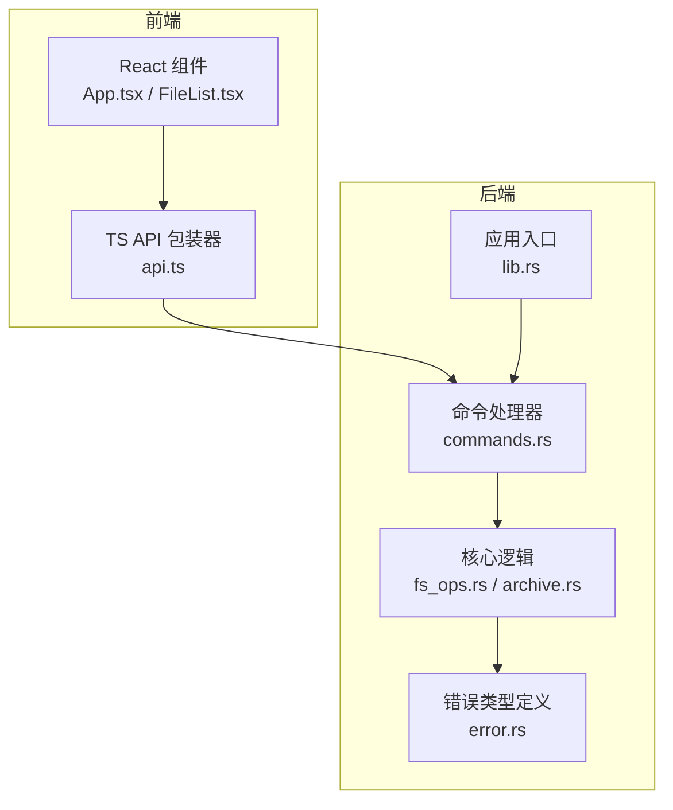
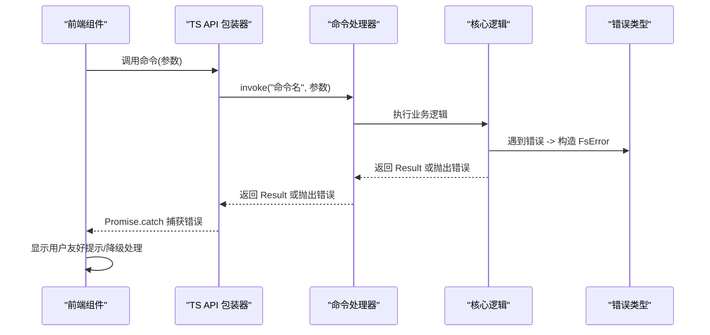
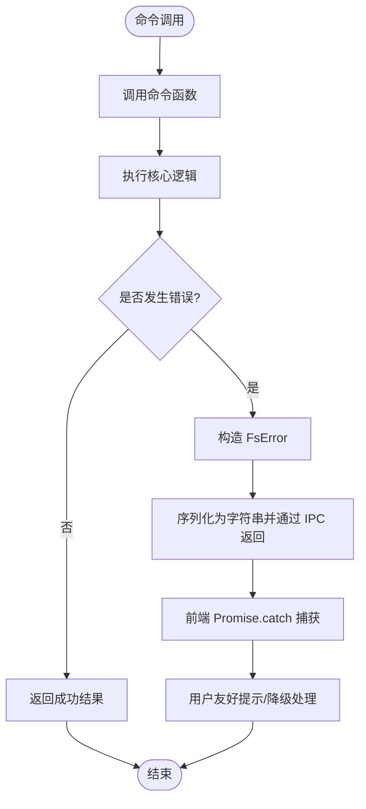
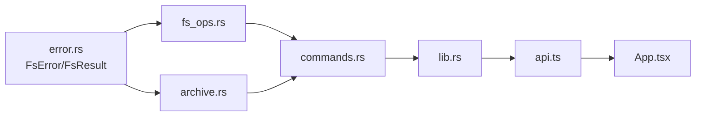

# 错误处理系统

<cite>
**本文引用的文件**
- [error.rs](file://src-tauri/src/core/error.rs)
- [fs_ops.rs](file://src-tauri/src/core/fs_ops.rs)
- [archive.rs](file://src-tauri/src/core/archive.rs)
- [commands.rs](file://src-tauri/src/commands.rs)
- [lib.rs](file://src-tauri/src/lib.rs)
- [api.ts](file://src/api.ts)
- [App.tsx](file://src/App.tsx)
- [Cargo.toml](file://src-tauri/Cargo.toml)
</cite>

## 目录
1. [简介](#简介)
2. [项目结构](#项目结构)
3. [核心组件](#核心组件)
4. [架构总览](#架构总览)
5. [详细组件分析](#详细组件分析)
6. [依赖关系分析](#依赖关系分析)
7. [性能考量](#性能考量)
8. [故障排查指南](#故障排查指南)
9. [结论](#结论)
10. [附录](#附录)

## 简介
本文件系统性梳理 LocalBro 的错误处理体系，覆盖错误类型定义与分类（文件系统错误、网络错误、权限错误、归档错误等）、错误传播机制（从底层系统调用到上层 API 的完整链路）、用户友好提示设计原则与实现方式、最佳实践示例（错误捕获、日志记录、用户反馈）、错误恢复策略与降级处理、以及调试辅助功能。目标是帮助开发者在不深入源码的前提下理解并正确使用错误处理机制。

## 项目结构
LocalBro 的错误处理主要分布在 Rust 后端与 TypeScript 前端两部分：
- 后端（Tauri/Rust）：统一定义 FsError 枚举，封装底层 IO 错误，暴露命令接口；归档模块独立定义归档相关错误；IPC 层通过 thiserror 与 serde 实现跨语言错误表示。
- 前端（React/TypeScript）：通过 @tauri-apps/api 调用后端命令，对错误进行捕获与用户反馈；在批量操作中采用“忽略单点失败”的降级策略。

图表来源
- [lib.rs:12-65](file://src-tauri/src/lib.rs#L12-L65)
- [commands.rs:15-266](file://src-tauri/src/commands.rs#L15-L266)
- [fs_ops.rs:140-360](file://src-tauri/src/core/fs_ops.rs#L140-L360)
- [archive.rs:67-360](file://src-tauri/src/core/archive.rs#L67-L360)
- [error.rs:7-50](file://src-tauri/src/core/error.rs#L7-L50)

章节来源
- [lib.rs:12-65](file://src-tauri/src/lib.rs#L12-L65)
- [commands.rs:15-266](file://src-tauri/src/commands.rs#L15-L266)

## 核心组件
- 错误类型与传播
  - FsError：统一的文件系统错误枚举，包含路径不存在、权限不足、路径已存在、无效路径、IO 错误、不支持的操作、内部错误等变体。通过 from_io 将标准 IO 错误映射为 FsError，并通过手动实现的序列化为字符串，便于 IPC 返回给前端。
  - FsResult：Result<T, FsError> 类型别名，贯穿命令层与核心逻辑。
- 命令层
  - commands.rs 中每个命令函数返回 FsResult<T>，直接将底层错误透传至 IPC 层，由前端统一处理。
- 核心逻辑层
  - fs_ops.rs：对路径规范化、元数据读取、目录/文件操作、文本读取、原生定位等进行错误处理，遵循“遇到不可修复错误则返回 FsError，可跳过的异常则吞掉或降级”。
  - archive.rs：归档模块独立定义归档相关错误（如未知格式、解压/压缩内部错误），同样返回 FsResult。
- 前端
  - api.ts：对 invoke 的结果进行类型转换与标准化，错误通过 Promise.catch 捕获。
  - App.tsx：在批量目录大小扫描等场景采用“忽略单点失败”的降级策略，避免影响整体体验。

章节来源
- [error.rs:7-50](file://src-tauri/src/core/error.rs#L7-L50)
- [commands.rs:15-266](file://src-tauri/src/commands.rs#L15-L266)
- [fs_ops.rs:140-360](file://src-tauri/src/core/fs_ops.rs#L140-L360)
- [archive.rs:67-360](file://src-tauri/src/core/archive.rs#L67-L360)
- [api.ts:37-280](file://src/api.ts#L37-L280)
- [App.tsx:28-69](file://src/App.tsx#L28-L69)

## 架构总览
下图展示了从用户触发到错误返回的完整链路：前端调用命令 → 命令层执行 → 核心逻辑处理 → 错误类型化 → IPC 序列化 → 前端捕获与反馈。

图表来源
- [api.ts:37-136](file://src/api.ts#L37-L136)
- [commands.rs:15-266](file://src-tauri/src/commands.rs#L15-L266)
- [fs_ops.rs:140-360](file://src-tauri/src/core/fs_ops.rs#L140-L360)
- [error.rs:7-50](file://src-tauri/src/core/error.rs#L7-L50)

## 详细组件分析

### 错误类型与分类
- 文件系统错误
  - 路径不存在：用于 stat/list/rename/delete 等操作前的前置校验。
  - 权限不足：来自 IO 错误映射，常见于只读文件、受限目录。
  - 路径已存在：创建目录/文件、重命名、复制/移动时的目标冲突。
  - 无效路径：空字符串、非法字符等。
  - IO 错误：底层文件系统访问失败。
  - 不支持的操作：当前平台不支持的功能（如 reveal_in_native 在某些平台）。
  - 内部错误：第三方库或归档处理过程中的异常。
- 归档错误
  - 未知归档格式：无法识别 zip/tar/tar.gz。
  - 解析/写入内部错误：第三方库解析失败或写入异常。
- 网络错误
  - 当前代码未直接体现网络错误类型，但可通过 Io 变体承载网络相关错误信息（例如外部资源访问失败）。建议在网络操作处显式包装为 NetworkError 并在前端提供更明确的提示。

章节来源
- [error.rs:8-29](file://src-tauri/src/core/error.rs#L8-L29)
- [fs_ops.rs:189-235](file://src-tauri/src/core/fs_ops.rs#L189-L235)
- [archive.rs:67-124](file://src-tauri/src/core/archive.rs#L67-L124)

### 错误传播机制
- 命令层到 IPC 层
  - commands.rs 中所有命令函数返回 FsResult<T>，错误被 thiserror 自动格式化为字符串，通过 IPC 层以字符串形式返回前端。
- 前端捕获与反馈
  - api.ts 使用 Promise.catch 捕获错误；App.tsx 在批量任务中采用“忽略单点失败”的降级策略，保证主流程稳定运行。

图表来源
- [commands.rs:15-266](file://src-tauri/src/commands.rs#L15-L266)
- [error.rs:43-47](file://src-tauri/src/core/error.rs#L43-L47)
- [api.ts:37-136](file://src/api.ts#L37-L136)
- [App.tsx:54-56](file://src/App.tsx#L54-L56)

章节来源
- [commands.rs:15-266](file://src-tauri/src/commands.rs#L15-L266)
- [error.rs:43-47](file://src-tauri/src/core/error.rs#L43-L47)
- [api.ts:37-136](file://src/api.ts#L37-L136)
- [App.tsx:54-56](file://src/App.tsx#L54-L56)

### 用户友好错误提示设计
- 设计原则
  - 明确性：错误消息包含关键上下文（如路径、操作类型）。
  - 可操作性：提供下一步建议（例如检查权限、选择其他位置）。
  - 一致性：统一的错误样式与文案风格，避免前后矛盾。
  - 降级与容错：在批量操作中允许单点失败不影响整体流程。
- 实现要点
  - 后端：FsError 已内置清晰的错误模板，IPC 层直接传递字符串，前端无需二次翻译。
  - 前端：在 api.ts 中对 invoke 的错误进行捕获；在 App.tsx 中对批量任务采用忽略单点失败策略，避免阻塞主流程。

章节来源
- [error.rs:8-29](file://src-tauri/src/core/error.rs#L8-L29)
- [api.ts:37-136](file://src/api.ts#L37-L136)
- [App.tsx:54-56](file://src/App.tsx#L54-L56)

### 具体代码示例与最佳实践
- 错误捕获
  - 前端：在调用命令后使用 Promise.catch 捕获错误，避免未处理异常导致崩溃。
    - 示例路径：[api.ts:37-136](file://src/api.ts#L37-L136)
  - 批量任务降级：在批量目录大小扫描中，对单个路径失败进行忽略，保证整体进度。
    - 示例路径：[App.tsx:54-56](file://src/App.tsx#L54-L56)
- 日志记录
  - 建议在命令层或核心逻辑层增加日志记录（例如使用 tracing 或 log），以便在开发与生产环境中追踪错误来源。
  - 参考 Cargo.toml 中的依赖项，可引入日志相关 crate。
    - 参考路径：[Cargo.toml:17-31](file://src-tauri/Cargo.toml#L17-L31)
- 用户反馈
  - 前端组件根据错误类型显示不同提示（例如权限不足、路径不存在），并在 UI 中提供重试或替代方案按钮。
  - 对于批量操作，提供进度条与汇总提示，避免频繁弹窗打扰用户。

章节来源
- [api.ts:37-136](file://src/api.ts#L37-L136)
- [App.tsx:54-56](file://src/App.tsx#L54-L56)
- [Cargo.toml:17-31](file://src-tauri/Cargo.toml#L17-L31)

### 错误恢复策略与降级处理
- 单点失败降级
  - 在批量目录大小扫描中，单个路径失败不影响其他路径的计算与更新。
    - 示例路径：[App.tsx:48-60](file://src/App.tsx#L48-L60)
- 操作回退
  - 移动操作失败时尝试复制后删除（跨设备移动的回退策略）。
    - 示例路径：[fs_ops.rs:286-292](file://src-tauri/src/core/fs_ops.rs#L286-L292)
- 安全边界
  - 归档解压时进行路径越界检测（zip-slip/tar-slip），拒绝危险路径并跳过对应条目。
    - 示例路径：[archive.rs:227-240](file://src-tauri/src/core/archive.rs#L227-L240)

章节来源
- [App.tsx:48-60](file://src/App.tsx#L48-L60)
- [fs_ops.rs:286-292](file://src-tauri/src/core/fs_ops.rs#L286-L292)
- [archive.rs:227-240](file://src-tauri/src/core/archive.rs#L227-L240)

### 调试辅助功能
- 事件驱动的后台扫描
  - 后台线程计算目录大小完成后通过事件通知前端，前端监听并更新状态，便于调试与监控。
    - 示例路径：[lib.rs:16-25](file://src-tauri/src/lib.rs#L16-L25)，[App.tsx:114-122](file://src/App.tsx#L114-L122)
- IPC 错误可视化
  - 由于错误以字符串形式返回，前端可直接将其显示在状态栏或错误面板，便于快速定位问题。

章节来源
- [lib.rs:16-25](file://src-tauri/src/lib.rs#L16-L25)
- [App.tsx:114-122](file://src/App.tsx#L114-L122)

## 依赖关系分析
- 错误类型依赖
  - fs_ops.rs 与 archive.rs 通过 use crate::core::error::{FsError, FsResult} 引入统一错误类型。
  - commands.rs 通过 use crate::core::error::FsResult 引入类型别名。
- IPC 与序列化
  - error.rs 手动实现 Serialize 为字符串，确保 IPC 层能稳定传输错误信息。
- 外部依赖
  - thiserror 提供错误派生能力；trash 提供跨平台回收站支持；zip/tar/flate2 提供归档处理能力。

图表来源
- [error.rs:7-50](file://src-tauri/src/core/error.rs#L7-L50)
- [fs_ops.rs:7-8](file://src-tauri/src/core/fs_ops.rs#L7-L8)
- [archive.rs:26](file://src-tauri/src/core/archive.rs#L26)
- [commands.rs:7-8](file://src-tauri/src/commands.rs#L7-L8)
- [lib.rs:12-65](file://src-tauri/src/lib.rs#L12-L65)
- [api.ts:1-280](file://src/api.ts#L1-L280)
- [App.tsx:1-146](file://src/App.tsx#L1-L146)

章节来源
- [error.rs:7-50](file://src-tauri/src/core/error.rs#L7-L50)
- [fs_ops.rs:7-8](file://src-tauri/src/core/fs_ops.rs#L7-L8)
- [archive.rs:26](file://src-tauri/src/core/archive.rs#L26)
- [commands.rs:7-8](file://src-tauri/src/commands.rs#L7-L8)
- [lib.rs:12-65](file://src-tauri/src/lib.rs#L12-L65)
- [api.ts:1-280](file://src/api.ts#L1-L280)
- [App.tsx:1-146](file://src/App.tsx#L1-L146)

## 性能考量
- 错误处理开销
  - 错误类型化与字符串序列化成本极低，对性能影响可忽略。
- 批量操作优化
  - 在批量目录大小扫描中限制并发度（示例中为 4），避免过多 IO 压力。
    - 示例路径：[App.tsx:34-68](file://src/App.tsx#L34-L68)
- 跳过不可读条目
  - 目录列举时跳过不可读条目而非中断整个列表，提升鲁棒性。
    - 示例路径：[fs_ops.rs:166](file://src-tauri/src/core/fs_ops.rs#L166)

章节来源
- [App.tsx:34-68](file://src/App.tsx#L34-L68)
- [fs_ops.rs:166](file://src-tauri/src/core/fs_ops.rs#L166)

## 故障排查指南
- 常见问题定位
  - 路径不存在：检查路径拼接与权限；确认目标是否存在。
    - 参考路径：[fs_ops.rs:143-148](file://src-tauri/src/core/fs_ops.rs#L143-L148)
  - 权限不足：检查文件/目录权限与运行环境；必要时提权或更换位置。
    - 参考路径：[fs_ops.rs:98](file://src-tauri/src/core/fs_ops.rs#L98)
  - 跨设备移动失败：系统会自动回退为复制+删除，确认磁盘空间与权限。
    - 参考路径：[fs_ops.rs:286-292](file://src-tauri/src/core/fs_ops.rs#L286-L292)
  - 归档解压失败：检查归档格式与完整性；确认目标路径安全。
    - 参考路径：[archive.rs:67-124](file://src-tauri/src/core/archive.rs#L67-L124)
- 前端调试
  - 在 Promise.catch 中打印错误字符串，结合事件监听确认后台扫描状态。
    - 参考路径：[api.ts:37-136](file://src/api.ts#L37-L136)，[App.tsx:114-122](file://src/App.tsx#L114-L122)

章节来源
- [fs_ops.rs:143-148](file://src-tauri/src/core/fs_ops.rs#L143-L148)
- [fs_ops.rs:98](file://src-tauri/src/core/fs_ops.rs#L98)
- [fs_ops.rs:286-292](file://src-tauri/src/core/fs_ops.rs#L286-L292)
- [archive.rs:67-124](file://src-tauri/src/core/archive.rs#L67-L124)
- [api.ts:37-136](file://src/api.ts#L37-L136)
- [App.tsx:114-122](file://src/App.tsx#L114-L122)

## 结论
LocalBro 的错误处理体系以 FsError 为核心，实现了从底层系统调用到上层 API 的一致化错误传播。通过 IPC 字符串化与前端统一捕获，既保证了错误信息的可读性，又提供了良好的用户体验。在批量操作中采用“忽略单点失败”的降级策略，提升了系统的鲁棒性。建议后续在网络错误场景中引入更细粒度的错误类型，并在命令层增加日志记录以增强可观测性。

## 附录
- 关键实现路径索引
  - 错误类型定义与序列化：[error.rs:7-50](file://src-tauri/src/core/error.rs#L7-L50)
  - 文件系统操作与错误映射：[fs_ops.rs:140-360](file://src-tauri/src/core/fs_ops.rs#L140-L360)
  - 归档操作与安全边界：[archive.rs:67-360](file://src-tauri/src/core/archive.rs#L67-L360)
  - 命令层返回类型：[commands.rs:15-266](file://src-tauri/src/commands.rs#L15-L266)
  - 应用入口与 IPC 注册：[lib.rs:12-65](file://src-tauri/src/lib.rs#L12-L65)
  - 前端 API 包装与错误捕获：[api.ts:37-280](file://src/api.ts#L37-L280)
  - 批量任务降级策略：[App.tsx:28-69](file://src/App.tsx#L28-L69)