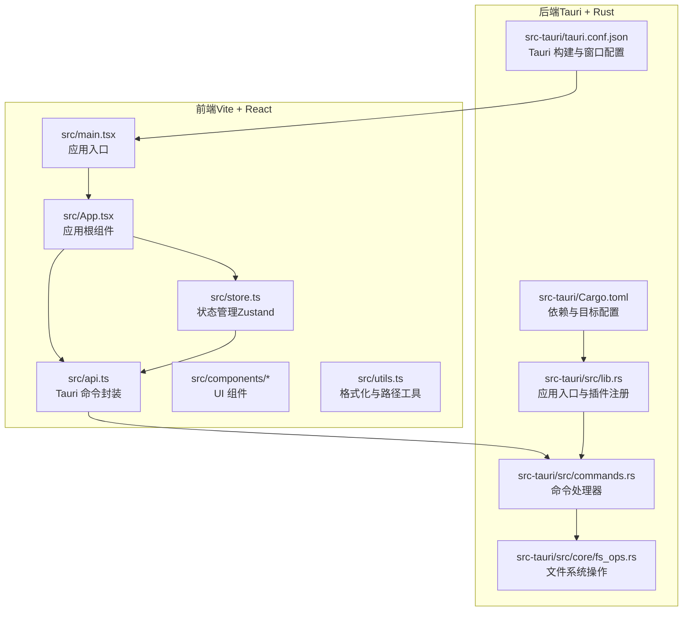
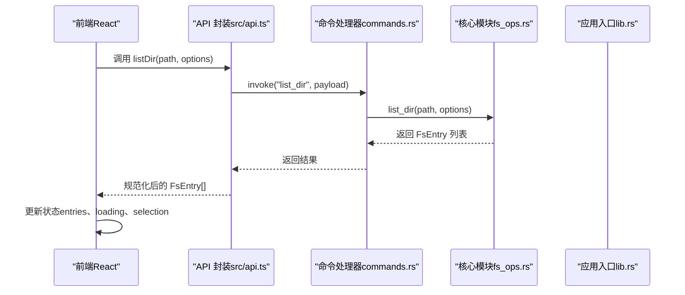
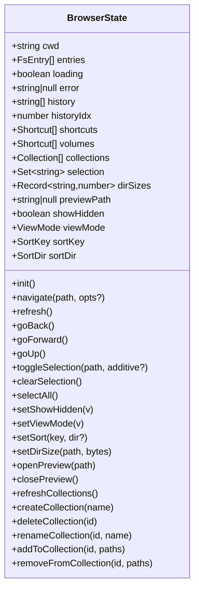
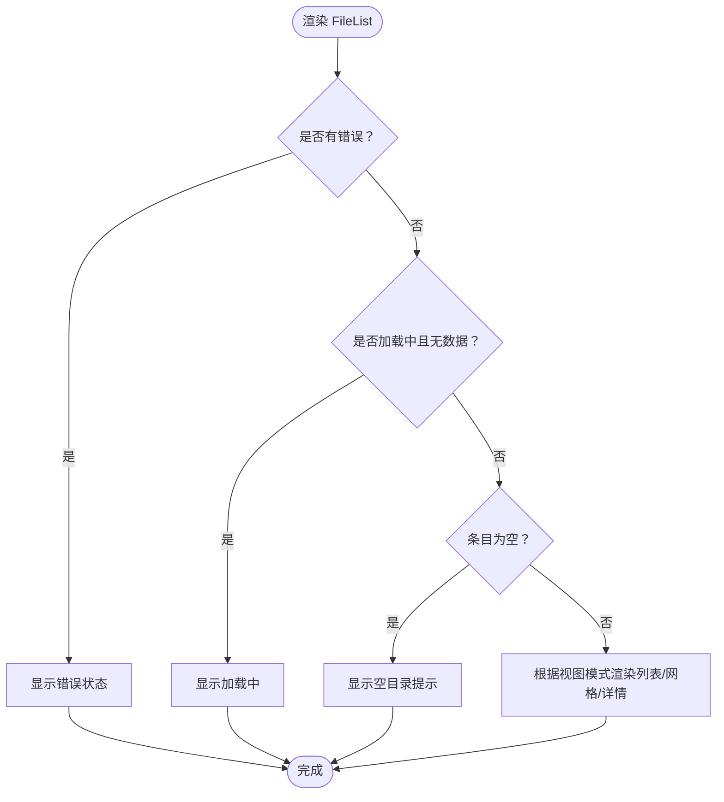
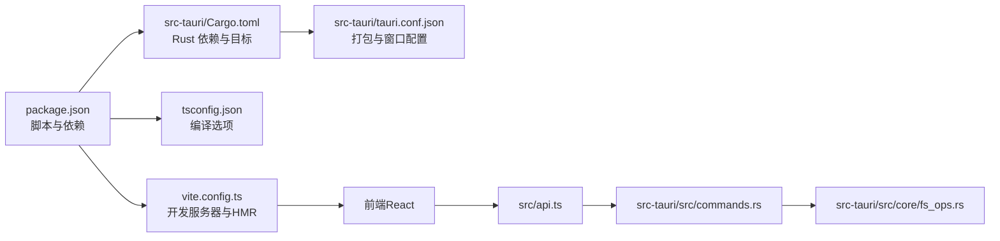

# 开发指南

<cite>
**本文引用的文件**
- [package.json](file://package.json)
- [vite.config.ts](file://vite.config.ts)
- [tsconfig.json](file://tsconfig.json)
- [tsconfig.node.json](file://tsconfig.node.json)
- [src-tauri/Cargo.toml](file://src-tauri/Cargo.toml)
- [src-tauri/tauri.conf.json](file://src-tauri/tauri.conf.json)
- [src/main.tsx](file://src/main.tsx)
- [src/App.tsx](file://src/App.tsx)
- [src/store.ts](file://src/store.ts)
- [src/api.ts](file://src/api.ts)
- [src/types.ts](file://src/types.ts)
- [src/utils.ts](file://src/utils.ts)
- [src/components/FileList.tsx](file://src/components/FileList.tsx)
- [src/components/Sidebar.tsx](file://src/components/Sidebar.tsx)
- [src-tauri/src/lib.rs](file://src-tauri/src/lib.rs)
- [src-tauri/src/commands.rs](file://src-tauri/src/commands.rs)
- [src-tauri/src/core/fs_ops.rs](file://src-tauri/src/core/fs_ops.rs)
- [README.md](file://README.md)
</cite>

## 目录
1. [简介](#简介)
2. [项目结构](#项目结构)
3. [核心组件](#核心组件)
4. [架构总览](#架构总览)
5. [详细组件分析](#详细组件分析)
6. [依赖关系分析](#依赖关系分析)
7. [性能考虑](#性能考虑)
8. [调试与故障排除](#调试与故障排除)
9. [版本管理与发布](#版本管理与发布)
10. [结论](#结论)
11. [附录：开发工作流程](#附录开发工作流程)

## 简介
本指南面向新贡献者与维护者，系统性说明 LocalBro 的开发环境搭建、代码贡献规范、构建配置、调试方法、故障排除、版本管理与发布流程，并提供性能优化建议与最佳实践。LocalBro 是一个基于 Tauri + React + TypeScript 的跨平台本地文件浏览器，前端通过 Vite 进行开发与热更新，后端使用 Rust 提供文件系统操作与事件通信。

## 项目结构
项目采用“前端（React/Vite）+ 后端（Tauri/Rust）”分层组织，核心目录与职责如下：
- public/：静态资源（如图标、HTML 模板等）
- src/：前端源码，包含入口、应用主组件、状态管理、API 封装、类型定义、工具函数与 UI 组件
- src-tauri/：Tauri 应用的 Rust 后端，包含命令处理、核心文件系统逻辑、依赖声明与打包配置
- 配置文件：package.json、vite.config.ts、tsconfig.json、tsconfig.node.json、Cargo.toml、tauri.conf.json

图表来源
- [src/main.tsx:1-12](file://src/main.tsx#L1-L12)
- [src/App.tsx:100-140](file://src/App.tsx#L100-L140)
- [src/store.ts:73-263](file://src/store.ts#L73-L263)
- [src/api.ts:1-195](file://src/api.ts#L1-L195)
- [src-tauri/src/lib.rs:12-52](file://src-tauri/src/lib.rs#L12-L52)
- [src-tauri/src/commands.rs:13-198](file://src-tauri/src/commands.rs#L13-L198)
- [src-tauri/src/core/fs_ops.rs:140-360](file://src-tauri/src/core/fs_ops.rs#L140-L360)
- [src-tauri/Cargo.toml:1-36](file://src-tauri/Cargo.toml#L1-L36)
- [src-tauri/tauri.conf.json:1-43](file://src-tauri/tauri.conf.json#L1-L43)

章节来源
- [package.json:1-28](file://package.json#L1-L28)
- [vite.config.ts:1-33](file://vite.config.ts#L1-L33)
- [tsconfig.json:1-26](file://tsconfig.json#L1-L26)
- [src-tauri/Cargo.toml:1-36](file://src-tauri/Cargo.toml#L1-L36)
- [src-tauri/tauri.conf.json:1-43](file://src-tauri/tauri.conf.json#L1-L43)

## 核心组件
- 应用入口与渲染
  - 前端入口负责挂载 React 根节点与样式初始化，随后渲染应用根组件
  - 参考路径：[src/main.tsx:1-12](file://src/main.tsx#L1-L12)
- 应用根组件
  - 负责初始化状态、监听后端事件、调度目录大小扫描队列、绑定快捷键预览
  - 参考路径：[src/App.tsx:100-140](file://src/App.tsx#L100-L140)
- 状态管理（Zustand）
  - 管理当前目录、条目列表、历史导航、选择集、排序与视图模式、集合与目录大小缓存、预览状态等
  - 导航、刷新、前进/后退、切换显示隐藏、排序、集合增删改查等动作均在此实现
  - 参考路径：[src/store.ts:73-263](file://src/store.ts#L73-L263)
- API 封装
  - 通过 Tauri invoke 调用后端命令，统一返回类型转换与错误处理
  - 包含目录列表、统计、父目录、家目录、卷列表、集合、文本读取、目录大小索引等接口
  - 参考路径：[src/api.ts:1-195](file://src/api.ts#L1-L195)
- 文件系统操作（Rust）
  - 提供目录枚举、条目统计、重命名、移动到回收站、永久删除、复制/移动、文本读取、在原生文件管理器中定位等
  - 参考路径：[src-tauri/src/core/fs_ops.rs:140-360](file://src-tauri/src/core/fs_ops.rs#L140-L360)
- 命令处理器（Rust）
  - 将前端调用映射到具体后端实现，支持集合管理、目录大小索引、文本读取等
  - 参考路径：[src-tauri/src/commands.rs:13-198](file://src-tauri/src/commands.rs#L13-L198)

章节来源
- [src/main.tsx:1-12](file://src/main.tsx#L1-L12)
- [src/App.tsx:100-140](file://src/App.tsx#L100-L140)
- [src/store.ts:73-263](file://src/store.ts#L73-L263)
- [src/api.ts:1-195](file://src/api.ts#L1-L195)
- [src-tauri/src/core/fs_ops.rs:140-360](file://src-tauri/src/core/fs_ops.rs#L140-L360)
- [src-tauri/src/commands.rs:13-198](file://src-tauri/src/commands.rs#L13-L198)

## 架构总览
前端通过 Tauri 的 invoke 与后端命令交互，后端命令委托给核心模块执行文件系统操作或集合/索引管理。应用启动时注册内置预览适配器，初始化收藏夹、卷与集合，并进入主界面。

图表来源
- [src/api.ts:37-48](file://src/api.ts#L37-L48)
- [src-tauri/src/commands.rs:14-16](file://src-tauri/src/commands.rs#L14-L16)
- [src-tauri/src/core/fs_ops.rs:140-170](file://src-tauri/src/core/fs_ops.rs#L140-L170)
- [src-tauri/src/lib.rs:23-49](file://src-tauri/src/lib.rs#L23-L49)

## 详细组件分析

### 状态管理（Zustand Store）
- 关键状态
  - 当前工作目录、条目列表、加载状态、错误信息
  - 历史记录与索引（用于前进/后退）
  - 收藏夹、卷、集合
  - 选择集（Set<string>）、目录大小缓存（Record<string, number>）
  - 预览路径、显示隐藏开关、视图模式、排序键与方向
- 关键动作
  - 初始化：拉取家目录、默认收藏、卷与集合，随后进入家目录
  - 导航：区分集合虚拟路径与真实路径，维护历史栈
  - 刷新、前进/后退、向上级目录
  - 选择控制：单选、多选、全选、清空
  - 排序：按名称/大小/修改时间/类型升/降序
  - 预览：打开/关闭
  - 集合：创建、删除、重命名、增删项；若当前浏览集合则自动刷新
- 性能要点
  - 使用不可变更新与浅拷贝合并，避免不必要的重渲染
  - 目录大小缓存以路径为键，减少重复计算
  - 排序在渲染前进行，避免每次渲染都重新计算

图表来源
- [src/store.ts:16-71](file://src/store.ts#L16-L71)
- [src/store.ts:73-263](file://src/store.ts#L73-L263)

章节来源
- [src/store.ts:73-263](file://src/store.ts#L73-L263)
- [src/types.ts:1-37](file://src/types.ts#L1-L37)

### 文件列表组件（FileList）
- 功能
  - 根据当前排序与视图模式渲染列表/网格/详情视图
  - 处理点击（可叠加选择）与双击（目录进入/文件预览）
  - 目录尺寸优先使用缓存值，文件使用实际大小
- 渲染策略
  - 错误状态、加载中、空目录三种占位提示
  - 详情视图支持点击列头触发排序

图表来源
- [src/components/FileList.tsx:42-83](file://src/components/FileList.tsx#L42-L83)

章节来源
- [src/components/FileList.tsx:1-173](file://src/components/FileList.tsx#L1-L173)

### 侧边栏组件（Sidebar）
- 功能
  - 展示收藏夹、卷与集合
  - 新建/重命名/删除集合
  - 点击跳转至对应路径（支持集合虚拟路径）
- 用户交互
  - 双击集合进入重命名输入框
  - 删除前确认提示
  - 输入框失焦或回车确认新建/重命名

章节来源
- [src/components/Sidebar.tsx:19-200](file://src/components/Sidebar.tsx#L19-L200)

### 应用根组件（App）
- 初始化
  - 调用初始化动作，订阅后端“size-updated”事件，更新目录大小缓存
- 目录大小扫描
  - 并发限制为 4 的队列，逐个请求目录大小，忽略单点错误
- 快捷键
  - 空格键打开/关闭快速预览（需聚焦非输入元素）

章节来源
- [src/App.tsx:100-140](file://src/App.tsx#L100-L140)

### 类型与工具
- 类型定义
  - 文件条目、快捷方式、视图模式、排序键与方向
- 工具函数
  - 大小格式化、日期格式化、路径分段、图标映射

章节来源
- [src/types.ts:1-37](file://src/types.ts#L1-L37)
- [src/utils.ts:1-66](file://src/utils.ts#L1-L66)

## 依赖关系分析
- 前端依赖
  - React 生态与 Zustand 状态管理
  - @tauri-apps/api 与 @tauri-apps/plugin-opener 提供系统集成能力
- 后端依赖
  - Tauri 2 核心、序列化（serde）、trash 回收站、walkdir 遍历、dirs 用户目录等
- 构建与开发
  - Vite + React 插件、TypeScript 编译、Tauri CLI

图表来源
- [package.json:6-26](file://package.json#L6-L26)
- [vite.config.ts:8-32](file://vite.config.ts#L8-L32)
- [tsconfig.json:1-26](file://tsconfig.json#L1-L26)
- [src-tauri/Cargo.toml:17-28](file://src-tauri/Cargo.toml#L17-L28)
- [src-tauri/tauri.conf.json:6-11](file://src-tauri/tauri.conf.json#L6-L11)

章节来源
- [package.json:1-28](file://package.json#L1-L28)
- [src-tauri/Cargo.toml:1-36](file://src-tauri/Cargo.toml#L1-L36)

## 性能考虑
- 目录大小扫描并发控制
  - 使用固定并发上限的队列，避免大量 IO 并发导致卡顿
  - 参考路径：[src/App.tsx:22-63](file://src/App.tsx#L22-L63)
- 目录大小缓存
  - 以绝对路径为键缓存目录大小，减少重复计算
  - 参考路径：[src/store.ts:31-32](file://src/store.ts#L31-L32)
- 渲染优化
  - 排序在渲染前完成，避免重复计算
  - 使用选择性渲染与占位提示，降低空列表场景的开销
  - 参考路径：[src/components/FileList.tsx:17-22](file://src/components/FileList.tsx#L17-L22)
- 文本读取截断
  - 默认最大读取 1MiB，避免大文件预览造成内存压力
  - 参考路径：[src-tauri/src/commands.rs:90-100](file://src-tauri/src/commands.rs#L90-L100)

## 调试与故障排除
- 开发环境调试
  - 使用 Vite HMR 与 Tauri Dev 混合开发，前端端口固定为 1420，严格端口占用
  - 可通过环境变量指定主机地址以支持远程设备联调
  - 参考路径：[vite.config.ts:5-32](file://vite.config.ts#L5-L32)
- 常见问题
  - 端口被占用：确保 1420/1421 未被占用，或调整配置
  - 前端无法连接后端：检查 Tauri Dev Host 环境变量与 HMR 配置
  - 权限不足：某些平台对隐藏文件、回收站操作有权限限制
- 日志与事件
  - 在命令处理处添加日志输出，便于定位后端异常
  - 使用浏览器开发者工具观察网络面板与控制台错误
- 建议
  - 对于大目录，先启用“显示隐藏”过滤后再展开，减少一次性渲染压力
  - 预览大文件时注意内存占用，必要时手动限制读取字节数

章节来源
- [vite.config.ts:5-32](file://vite.config.ts#L5-L32)
- [src-tauri/src/commands.rs:90-100](file://src-tauri/src/commands.rs#L90-L100)

## 版本管理与发布
- 版本号位置
  - 前端与后端均包含版本号字段，发布前请保持一致
  - 参考路径：[package.json:4](file://package.json#L4)、[src-tauri/Cargo.toml:3](file://src-tauri/Cargo.toml#L3)、[src-tauri/tauri.conf.json:4](file://src-tauri/tauri.conf.json#L4)
- 打包与分发
  - Tauri 配置启用打包，目标为 all，包含多平台图标
  - 参考路径：[src-tauri/tauri.conf.json:31-41](file://src-tauri/tauri.conf.json#L31-L41)
- 发布流程建议
  - 先在本地运行构建与预览，确认 UI 与功能正常
  - 使用 Tauri CLI 执行打包命令生成各平台安装包
  - 上传至发布渠道并附带变更日志

章节来源
- [package.json:4](file://package.json#L4)
- [src-tauri/Cargo.toml:3](file://src-tauri/Cargo.toml#L3)
- [src-tauri/tauri.conf.json:4](file://src-tauri/tauri.conf.json#L4)
- [src-tauri/tauri.conf.json:31-41](file://src-tauri/tauri.conf.json#L31-L41)

## 结论
LocalBro 采用清晰的前后端分离架构，前端以 React + Zustand 实现状态与 UI，后端以 Rust + Tauri 提供安全高效的文件系统能力。通过并发控制、缓存与合理的渲染策略，可在多平台下获得流畅体验。建议在开发中遵循本文档的规范与最佳实践，确保代码质量与可维护性。

## 附录：开发工作流程
- 环境准备
  - 安装 Node.js、Rust 工具链与 Tauri 依赖
  - VS Code 推荐安装 Tauri 与 rust-analyzer 插件
  - 参考路径：[README.md:5-8](file://README.md#L5-L8)
- 启动开发
  - 安装依赖后运行前端开发服务器与 Tauri Dev，保持前后端联动
  - 参考路径：[package.json:6-11](file://package.json#L6-L11)、[vite.config.ts:8-32](file://vite.config.ts#L8-L32)
- 代码贡献
  - 遵循 TypeScript 严格模式与 ESLint 规范（如已配置）
  - 提交信息建议采用清晰语义，描述变更内容与影响范围
- 测试与验证
  - 在多平台（Windows/macOS/Linux）上验证核心功能（导航、预览、集合、回收站）
  - 对大目录与大文件进行性能与稳定性测试
- 构建与发布
  - 本地构建预览，确认 UI 与交互无误
  - 使用 Tauri 打包生成安装包并上传发布

章节来源
- [README.md:5-8](file://README.md#L5-L8)
- [package.json:6-11](file://package.json#L6-L11)
- [vite.config.ts:8-32](file://vite.config.ts#L8-L32)