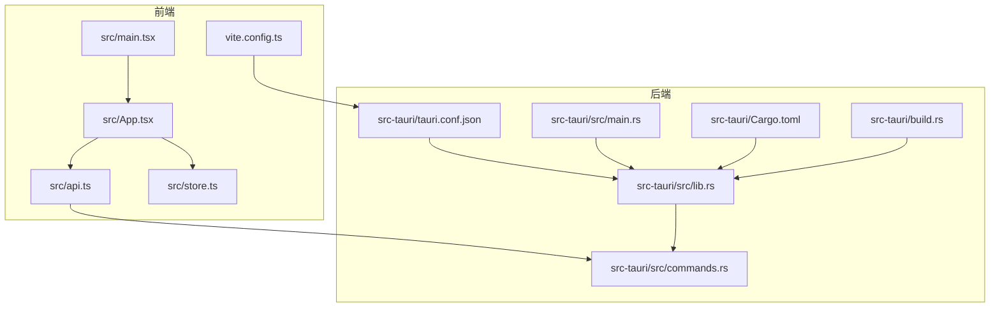
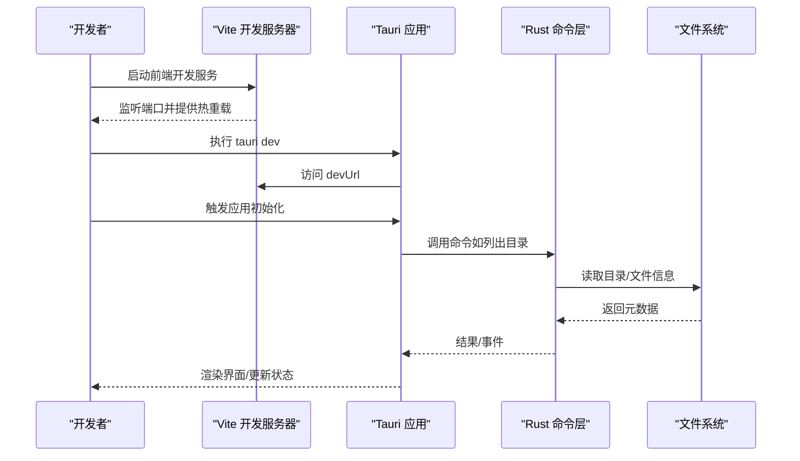
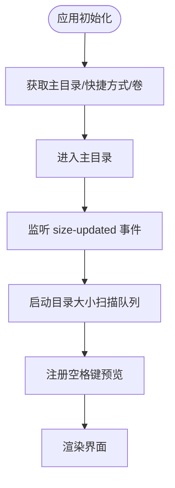
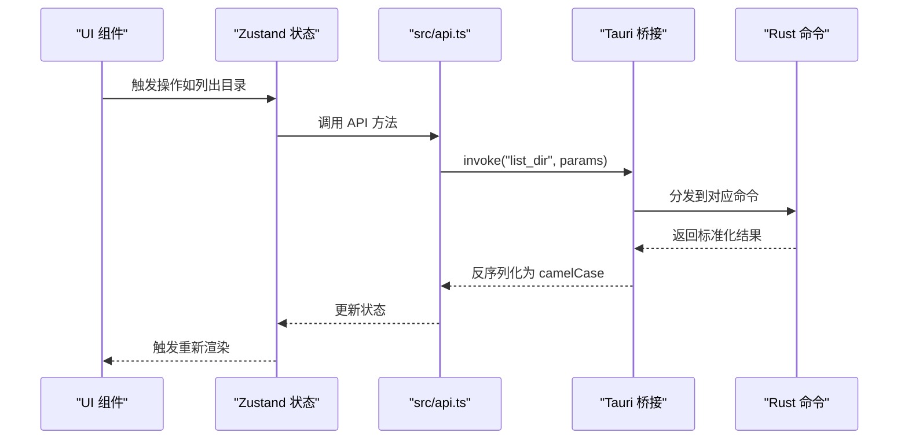
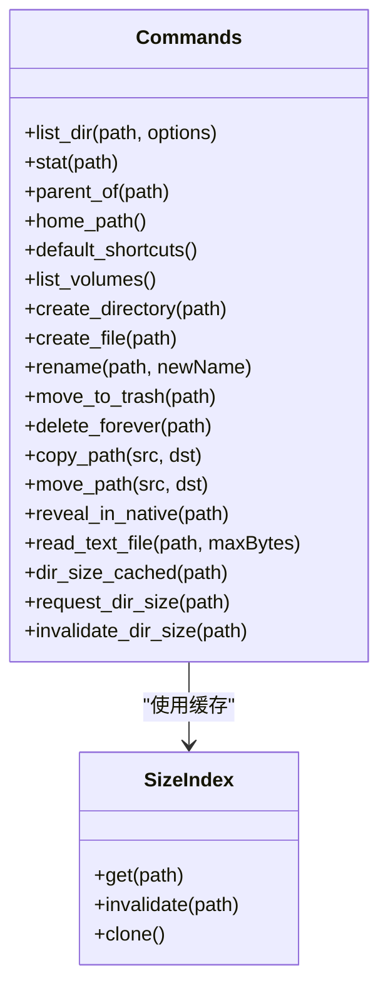
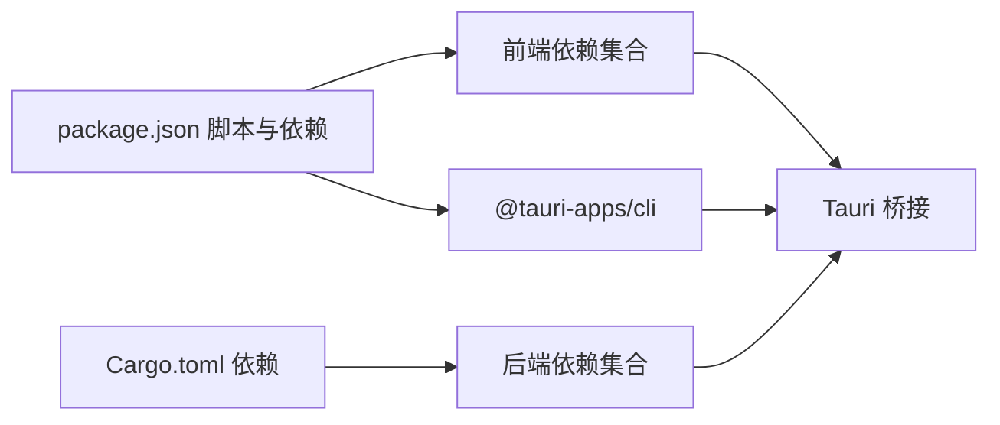

# 快速开始

<cite>
**本文引用的文件**
- [README.md](file://README.md)
- [package.json](file://package.json)
- [vite.config.ts](file://vite.config.ts)
- [tsconfig.json](file://tsconfig.json)
- [src-tauri/Cargo.toml](file://src-tauri/Cargo.toml)
- [src-tauri/tauri.conf.json](file://src-tauri/tauri.conf.json)
- [src-tauri/src/main.rs](file://src-tauri/src/main.rs)
- [src-tauri/src/lib.rs](file://src-tauri/src/lib.rs)
- [src-tauri/src/commands.rs](file://src-tauri/src/commands.rs)
- [src-tauri/build.rs](file://src-tauri/build.rs)
- [src/main.tsx](file://src/main.tsx)
- [src/App.tsx](file://src/App.tsx)
- [src/api.ts](file://src/api.ts)
- [src/store.ts](file://src/store.ts)
</cite>

## 目录
1. [简介](#简介)
2. [项目结构](#项目结构)
3. [核心组件](#核心组件)
4. [架构总览](#架构总览)
5. [详细组件分析](#详细组件分析)
6. [依赖关系分析](#依赖关系分析)
7. [性能考虑](#性能考虑)
8. [故障排除指南](#故障排除指南)
9. [结论](#结论)
10. [附录](#附录)

## 简介
本指南面向新手开发者，帮助你在本地快速搭建 LocalBro 的开发与运行环境。LocalBro 是一个基于 Tauri + React + TypeScript 的跨平台本地文件浏览器，采用 Vite 进行前端开发与热重载，Rust 提供系统级文件操作能力，并通过 Tauri 命令桥接前后端。

## 项目结构
LocalBro 采用“前端（React/Vite）+ 后端（Tauri/Rust）”双栈架构：
- 前端位于 src/ 与 public/，使用 React + TypeScript + Vite 开发，支持热重载与构建打包。
- 后端位于 src-tauri/，使用 Rust + Tauri，提供文件系统操作、目录大小缓存、事件通信等能力。
- 构建与运行由 Tauri 配置统一管理，Vite 与 Tauri 在开发模式下协同工作。

图表来源
- [src/main.tsx:1-12](file://src/main.tsx#L1-L12)
- [src/App.tsx:1-140](file://src/App.tsx#L1-L140)
- [src/api.ts:1-137](file://src/api.ts#L1-L137)
- [src/store.ts:1-226](file://src/store.ts#L1-L226)
- [vite.config.ts:1-33](file://vite.config.ts#L1-L33)
- [src-tauri/tauri.conf.json:1-43](file://src-tauri/tauri.conf.json#L1-L43)
- [src-tauri/Cargo.toml:1-36](file://src-tauri/Cargo.toml#L1-L36)
- [src-tauri/src/main.rs:1-7](file://src-tauri/src/main.rs#L1-L7)
- [src-tauri/src/lib.rs:1-38](file://src-tauri/src/lib.rs#L1-L38)
- [src-tauri/src/commands.rs:1-126](file://src-tauri/src/commands.rs#L1-L126)
- [src-tauri/build.rs:1-4](file://src-tauri/build.rs#L1-L4)

章节来源
- [README.md:1-8](file://README.md#L1-L8)
- [package.json:1-28](file://package.json#L1-L28)
- [vite.config.ts:1-33](file://vite.config.ts#L1-L33)
- [src-tauri/tauri.conf.json:1-43](file://src-tauri/tauri.conf.json#L1-L43)
- [src-tauri/Cargo.toml:1-36](file://src-tauri/Cargo.toml#L1-L36)

## 核心组件
- 前端入口与渲染：React 应用在入口文件中挂载根组件，随后由应用主组件负责布局与状态管理。
- 应用逻辑与状态：应用主组件负责初始化、事件监听、快捷键处理与预览模态框控制；状态管理使用 Zustand。
- API 层：封装 Tauri invoke 调用，统一参数与返回值的命名转换，屏蔽 Rust 层字段命名差异。
- Tauri 命令：Rust 侧暴露一系列命令，覆盖文件列表、统计、路径操作、目录大小计算与文本文件读取等。
- 构建与配置：Vite 配置固定端口与 HMR，Tauri 配置开发/构建流程、窗口与安全策略、打包图标等。

章节来源
- [src/main.tsx:1-12](file://src/main.tsx#L1-L12)
- [src/App.tsx:100-140](file://src/App.tsx#L100-L140)
- [src/api.ts:1-137](file://src/api.ts#L1-L137)
- [src/store.ts:53-194](file://src/store.ts#L53-L194)
- [src-tauri/src/lib.rs:8-37](file://src-tauri/src/lib.rs#L8-L37)
- [src-tauri/src/commands.rs:12-126](file://src-tauri/src/commands.rs#L12-L126)

## 架构总览
下面的时序图展示了从启动到首次运行的关键流程：前端通过 Vite 启动开发服务器，Tauri 在开发模式下以 devUrl 指向前端地址；用户交互触发 API 调用，Rust 命令处理后返回结果或触发事件。

图表来源
- [vite.config.ts:16-31](file://vite.config.ts#L16-L31)
- [src-tauri/tauri.conf.json:6-11](file://src-tauri/tauri.conf.json#L6-L11)
- [src-tauri/src/lib.rs:12-36](file://src-tauri/src/lib.rs#L12-L36)
- [src-tauri/src/commands.rs:12-126](file://src-tauri/src/commands.rs#L12-L126)

## 详细组件分析

### 前端应用与状态管理
- 初始化与事件监听：应用启动时执行初始化逻辑，拉取用户主目录、默认快捷方式与卷信息，并订阅目录大小更新事件。
- 目录大小并发扫描：使用有限并发队列对可见目录发起后台扫描，避免阻塞 UI。
- 快捷键与预览：空格键打开预览，支持在预览模态框内导航。

图表来源
- [src/App.tsx:76-116](file://src/App.tsx#L76-L116)
- [src/store.ts:76-88](file://src/store.ts#L76-L88)
- [src/store.ts:189-190](file://src/store.ts#L189-L190)

章节来源
- [src/App.tsx:1-140](file://src/App.tsx#L1-L140)
- [src/store.ts:1-226](file://src/store.ts#L1-L226)

### API 封装与调用约定
- 参数与返回值转换：Rust 使用 snake_case 字段名，TS 侧统一转换为 camelCase，保证类型安全。
- 命令映射：每个 API 函数对应一个 Tauri 命令，参数与返回值通过 invoke 传递。
- 文本文件读取：支持限制最大读取字节数，避免大文件导致内存压力。

图表来源
- [src/api.ts:37-48](file://src/api.ts#L37-L48)
- [src-tauri/src/commands.rs:12-15](file://src-tauri/src/commands.rs#L12-L15)

章节来源
- [src/api.ts:1-137](file://src/api.ts#L1-L137)
- [src-tauri/src/commands.rs:1-126](file://src-tauri/src/commands.rs#L1-L126)

### Rust 命令与文件系统操作
- 命令清单：包含目录列举、文件统计、父路径查询、主目录、默认快捷方式、卷列表、新建/重命名、移动到回收站、删除、复制/移动、在原生资源管理器中定位、文本文件读取、目录大小缓存与请求、失效等。
- 大小索引：通过共享的 SizeIndex 缓存目录大小，支持后台扫描与事件通知。
- 插件集成：启用 opener 插件用于打开外部链接或文件。

图表来源
- [src-tauri/src/commands.rs:12-126](file://src-tauri/src/commands.rs#L12-L126)
- [src-tauri/src/lib.rs:8-37](file://src-tauri/src/lib.rs#L8-L37)

章节来源
- [src-tauri/src/commands.rs:1-126](file://src-tauri/src/commands.rs#L1-L126)
- [src-tauri/src/lib.rs:1-38](file://src-tauri/src/lib.rs#L1-L38)

### 构建与运行配置
- Vite 固定端口与 HMR：开发时固定端口与严格端口策略，支持跨主机热重载。
- Tauri 开发/构建流程：devUrl 指向前端地址，构建前先执行前端构建，输出到 dist。
- 安全与窗口：启用资产协议作用域，设置窗口尺寸与最小尺寸，允许拖拽。

章节来源
- [vite.config.ts:14-31](file://vite.config.ts#L14-L31)
- [src-tauri/tauri.conf.json:6-11](file://src-tauri/tauri.conf.json#L6-L11)
- [src-tauri/tauri.conf.json:13-22](file://src-tauri/tauri.conf.json#L13-L22)
- [src-tauri/tauri.conf.json:23-29](file://src-tauri/tauri.conf.json#L23-L29)

## 依赖关系分析
- 前端依赖：React、React DOM、@tauri-apps/api、@tauri-apps/plugin-opener、zustand、@vitejs/plugin-react、typescript、vite、@tauri-apps/cli。
- 后端依赖：tauri（含协议资产特性）、tauri-plugin-opener、serde、serde_json、thiserror、trash、dirs、chrono、parking_lot、walkdir。
- 构建脚本：dev、build、preview、tauri。

图表来源
- [package.json:6-26](file://package.json#L6-L26)
- [src-tauri/Cargo.toml:17-28](file://src-tauri/Cargo.toml#L17-L28)

章节来源
- [package.json:1-28](file://package.json#L1-L28)
- [src-tauri/Cargo.toml:1-36](file://src-tauri/Cargo.toml#L1-L36)

## 性能考虑
- 目录大小扫描并发控制：使用有限并发队列，避免同时扫描过多目录造成卡顿。
- 缓存与事件：目录大小通过缓存与事件机制减少重复计算，提升交互响应速度。
- 前端渲染优化：按需刷新与选择集管理，降低不必要的重渲染。

章节来源
- [src/App.tsx:23-63](file://src/App.tsx#L23-L63)
- [src/store.ts:189-190](file://src/store.ts#L189-L190)

## 故障排除指南
- 端口占用
  - 现象：开发时 Vite 报端口冲突。
  - 处理：确认 1420/1421 端口未被占用，或调整 Vite server.port 与 HMR 配置。
  - 参考：[vite.config.ts:16-26](file://vite.config.ts#L16-L26)
- 跨主机开发
  - 现象：无法通过指定主机访问开发服务器。
  - 处理：设置环境变量以启用跨主机 HMR，参考 Vite 配置中的 host 与 HMR 设置。
  - 参考：[vite.config.ts:5-26](file://vite.config.ts#L5-L26)
- Tauri 开发命令失败
  - 现象：执行 tauri dev 时找不到前端构建或 devUrl 不可达。
  - 处理：确保先运行前端开发服务，检查 tauri.conf.json 中 beforeDevCommand 与 devUrl。
  - 参考：[src-tauri/tauri.conf.json:6-11](file://src-tauri/tauri.conf.json#L6-L11)
- 权限与沙箱
  - 现象：文件操作受限或权限不足。
  - 处理：检查操作系统权限与 Tauri 安全策略配置，必要时调整 CSP 与资产协议作用域。
  - 参考：[src-tauri/tauri.conf.json:23-29](file://src-tauri/tauri.conf.json#L23-L29)
- TypeScript 类型错误
  - 现象：类型检查失败。
  - 处理：核对 tsconfig.json 的编译选项与模块解析策略，确保严格模式下的类型安全。
  - 参考：[tsconfig.json:1-26](file://tsconfig.json#L1-L26)

## 结论
通过本指南，你可以在本地完成 LocalBro 的环境准备、项目克隆、依赖安装与首次运行。建议优先安装 Node.js、Rust 工具链与 Tauri 依赖，再进行项目初始化与开发调试。遇到问题时，可依据故障排除章节逐项排查。

## 附录

### 环境准备与安装步骤
- 安装 Node.js（推荐使用版本管理工具以切换版本）
  - Windows/macOS/Linux 建议使用官方安装包或包管理器安装
- 安装 Rust 工具链
  - 使用 rustup 安装稳定版工具链
- 安装 Tauri 依赖
  - 根据操作系统安装 Tauri 所需系统依赖（如 Linux 需要额外 GTK/WebKit 库）
- 安装 VS Code 及推荐插件
  - VS Code + Tauri 插件 + rust-analyzer 插件

章节来源
- [README.md:5-8](file://README.md#L5-L8)

### 克隆、安装与首次运行
- 克隆仓库
  - 使用 git clone 获取项目源码
- 安装前端依赖
  - 在项目根目录执行前端依赖安装
- 安装后端依赖
  - 在 src-tauri 目录执行 Cargo 依赖安装
- 首次运行
  - 在项目根目录执行开发命令，启动前端与 Tauri 应用

章节来源
- [package.json:6-11](file://package.json#L6-L11)
- [src-tauri/Cargo.toml:1-36](file://src-tauri/Cargo.toml#L1-L36)

### 开发环境准备（VS Code 插件）
- VS Code + Tauri 插件 + rust-analyzer 插件
- 建议启用格式化与类型检查相关扩展，提升开发体验

章节来源
- [README.md:5-8](file://README.md#L5-L8)