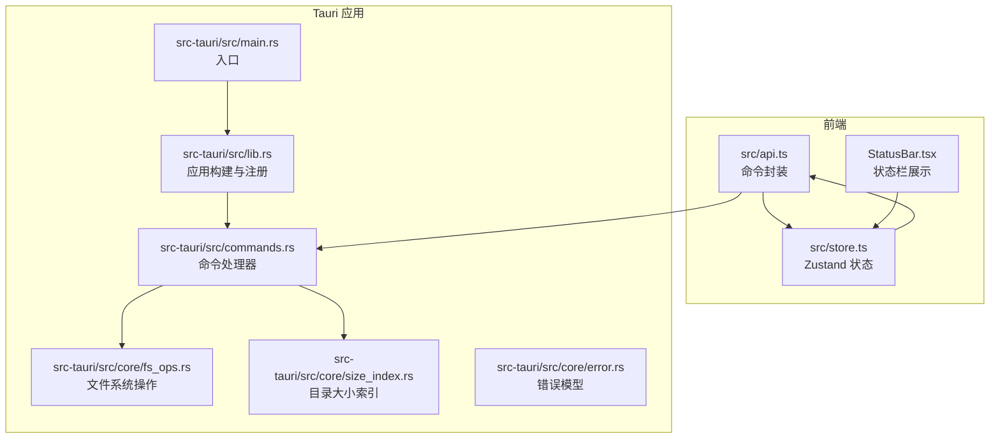
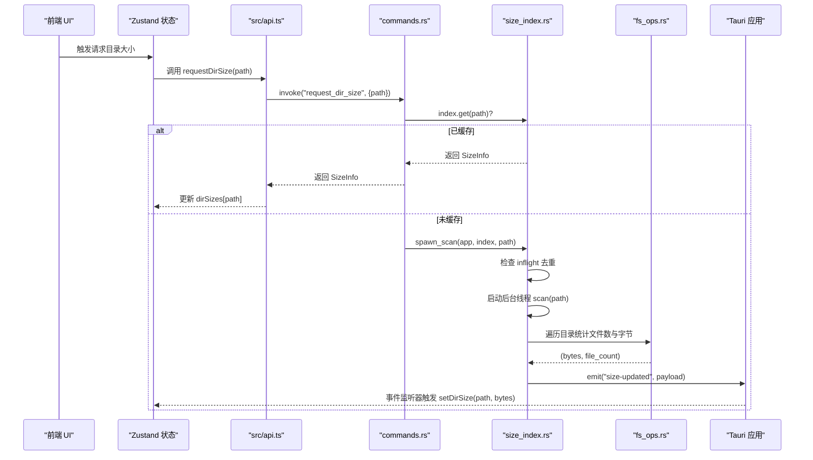
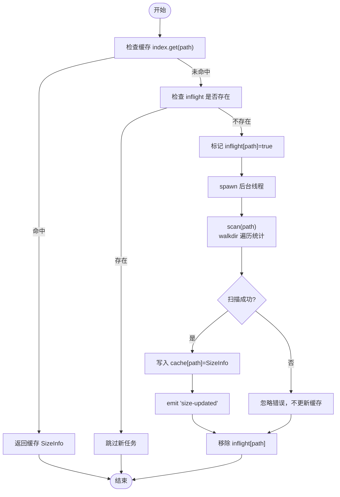
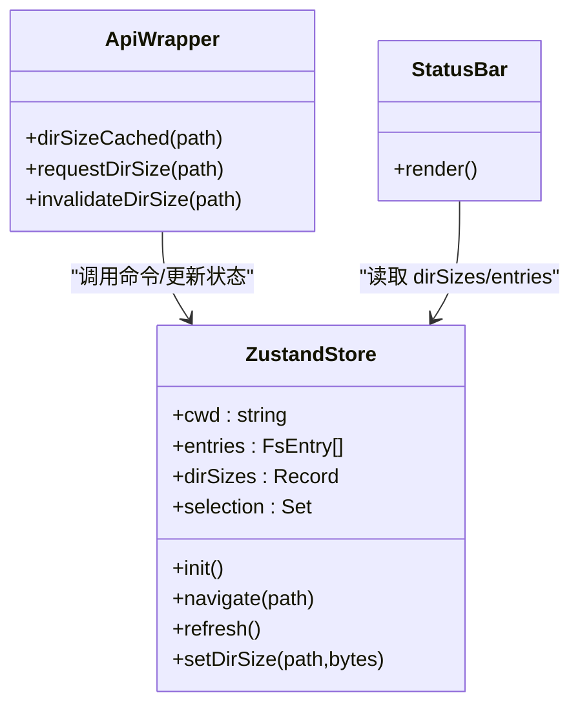
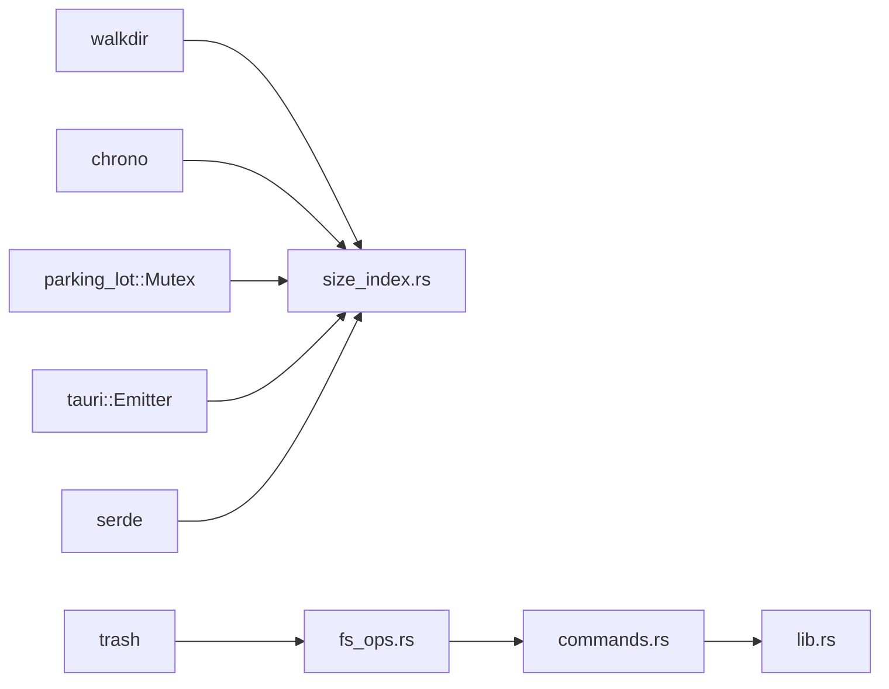

# 性能优化

<cite>
**本文引用的文件**
- [src-tauri/src/core/fs_ops.rs](file://src-tauri/src/core/fs_ops.rs)
- [src-tauri/src/core/size_index.rs](file://src-tauri/src/core/size_index.rs)
- [src-tauri/src/lib.rs](file://src-tauri/src/lib.rs)
- [src-tauri/src/commands.rs](file://src-tauri/src/commands.rs)
- [src-tauri/src/core/error.rs](file://src-tauri/src/core/error.rs)
- [src-tauri/Cargo.toml](file://src-tauri/Cargo.toml)
- [src/store.ts](file://src/store.ts)
- [src/api.ts](file://src/api.ts)
- [src/components/StatusBar.tsx](file://src/components/StatusBar.tsx)
- [src/types.ts](file://src/types.ts)
- [src-tauri/src/main.rs](file://src-tauri/src/main.rs)
</cite>

## 目录
1. [简介](#简介)
2. [项目结构](#项目结构)
3. [核心组件](#核心组件)
4. [架构总览](#架构总览)
5. [详细组件分析](#详细组件分析)
6. [依赖关系分析](#依赖关系分析)
7. [性能考量与优化建议](#性能考量与优化建议)
8. [故障排查指南](#故障排查指南)
9. [结论](#结论)
10. [附录：性能测试与基准方法](#附录性能测试与基准方法)

## 简介
本文件聚焦 LocalBro 的性能优化设计与实现，围绕以下主题展开：
- 并发处理：目录扫描的并发队列、后台线程管理与重复请求合并
- 缓存策略：目录大小缓存、状态持久化与前端内存管理
- 性能监控与分析：关键指标测量与瓶颈识别
- 内存使用优化：垃圾回收策略与资源释放
- 测试方法与基准：可复现的性能评估流程
- 不同硬件配置下的优化建议与最佳实践

## 项目结构
LocalBro 采用 Tauri v2 架构，前端为 React/Zustand，后端为 Rust 核心模块，通过 Tauri 命令桥接调用。核心性能相关模块位于 src-tauri/src/core 下，包含文件系统操作、目录大小索引、集合存储等。

图表来源
- [src-tauri/src/main.rs:1-7](file://src-tauri/src/main.rs#L1-L7)
- [src-tauri/src/lib.rs:11-52](file://src-tauri/src/lib.rs#L11-L52)
- [src-tauri/src/commands.rs:13-126](file://src-tauri/src/commands.rs#L13-L126)
- [src-tauri/src/core/fs_ops.rs:141-170](file://src-tauri/src/core/fs_ops.rs#L141-L170)
- [src-tauri/src/core/size_index.rs:60-104](file://src-tauri/src/core/size_index.rs#L60-L104)
- [src/api.ts:37-121](file://src/api.ts#L37-L121)
- [src/store.ts:53-194](file://src/store.ts#L53-L194)

章节来源
- [src-tauri/src/main.rs:1-7](file://src-tauri/src/main.rs#L1-L7)
- [src-tauri/src/lib.rs:11-52](file://src-tauri/src/lib.rs#L11-L52)
- [src-tauri/src/commands.rs:13-126](file://src-tauri/src/commands.rs#L13-L126)
- [src-tauri/src/core/fs_ops.rs:141-170](file://src-tauri/src/core/fs_ops.rs#L141-L170)
- [src-tauri/src/core/size_index.rs:60-104](file://src-tauri/src/core/size_index.rs#L60-L104)
- [src/api.ts:37-121](file://src/api.ts#L37-L121)
- [src/store.ts:53-194](file://src/store.ts#L53-L194)

## 核心组件
- 文件系统操作（fs_ops）：负责目录列举、单文件统计、路径解析、文本文件读取等，返回轻量级 FsEntry 结构体，避免一次性加载大文件内容。
- 目录大小索引（size_index）：提供按需递归扫描、后台线程执行、共享缓存与“飞行中”去重、事件通知。
- 前端状态与缓存（store + api）：前端维护目录大小缓存字典、历史导航、选择集等；通过 invoke 调用后端命令，接收事件更新缓存。
- 错误模型（error）：统一错误类型与序列化，便于前后端一致处理。

章节来源
- [src-tauri/src/core/fs_ops.rs:18-138](file://src-tauri/src/core/fs_ops.rs#L18-L138)
- [src-tauri/src/core/size_index.rs:17-53](file://src-tauri/src/core/size_index.rs#L17-L53)
- [src/store.ts:19-20](file://src/store.ts#L19-L20)
- [src/api.ts:105-121](file://src/api.ts#L105-L121)
- [src-tauri/src/core/error.rs:7-47](file://src-tauri/src/core/error.rs#L7-L47)

## 架构总览
下面以“目录大小计算”的关键流程为例，展示从前端到后端再到事件回传的完整链路。

图表来源
- [src/api.ts:115-121](file://src/api.ts#L115-L121)
- [src-tauri/src/commands.rs:110-126](file://src-tauri/src/commands.rs#L110-L126)
- [src-tauri/src/core/size_index.rs:60-104](file://src-tauri/src/core/size_index.rs#L60-L104)
- [src-tauri/src/core/size_index.rs:106-134](file://src-tauri/src/core/size_index.rs#L106-L134)
- [src-tauri/src/core/fs_ops.rs:141-170](file://src-tauri/src/core/fs_ops.rs#L141-L170)
- [src/store.ts:189-190](file://src/store.ts#L189-L190)

## 详细组件分析

### 目录扫描与并发队列
- 请求去重：通过“飞行中”哈希表避免对同一路径的重复扫描。
- 后台线程：使用标准库线程启动扫描任务，完成后写入共享缓存并发出事件。
- 扫描算法：walkdir 迭代器过滤非文件项，仅累加文件大小与计数，减少元数据开销。

图表来源
- [src-tauri/src/core/size_index.rs:60-104](file://src-tauri/src/core/size_index.rs#L60-L104)
- [src-tauri/src/core/size_index.rs:106-134](file://src-tauri/src/core/size_index.rs#L106-L134)

章节来源
- [src-tauri/src/core/size_index.rs:60-104](file://src-tauri/src/core/size_index.rs#L60-L104)
- [src-tauri/src/core/size_index.rs:106-134](file://src-tauri/src/core/size_index.rs#L106-L134)

### 前端缓存与状态管理
- 目录大小缓存：前端以路径为键的字典保存 bytes，用于状态栏与排序显示。
- 事件驱动更新：收到 size-updated 事件后，通过 setDirSize 合并更新。
- 列表渲染：StatusBar 计算总大小、选中大小与待计算目录数量，提示用户进度。

图表来源
- [src/store.ts:53-194](file://src/store.ts#L53-L194)
- [src/api.ts:111-121](file://src/api.ts#L111-L121)
- [src/components/StatusBar.tsx:4-37](file://src/components/StatusBar.tsx#L4-L37)

章节来源
- [src/store.ts:53-194](file://src/store.ts#L53-L194)
- [src/api.ts:111-121](file://src/api.ts#L111-L121)
- [src/components/StatusBar.tsx:4-37](file://src/components/StatusBar.tsx#L4-L37)

### 文件系统操作与 I/O 优化
- 目录列举：逐条转换 FsEntry，跳过不可读条目，避免整批失败。
- 单文件统计：按需 stat，区分文件/目录/符号链接，仅文件返回 size。
- 文本预览：限制最大读取字节数，默认 1MiB，避免大文件阻塞 UI。

章节来源
- [src-tauri/src/core/fs_ops.rs:141-170](file://src-tauri/src/core/fs_ops.rs#L141-L170)
- [src-tauri/src/core/fs_ops.rs:173-179](file://src-tauri/src/core/fs_ops.rs#L173-L179)
- [src-tauri/src/core/fs_ops.rs:297-318](file://src-tauri/src/core/fs_ops.rs#L297-L318)

### 错误处理与健壮性
- 统一错误类型：NotFound、PermissionDenied、AlreadyExists、Io、Unsupported、Internal。
- 序列化为字符串：便于 IPC 传输，同时保留内部枚举细节用于日志。

章节来源
- [src-tauri/src/core/error.rs:7-47](file://src-tauri/src/core/error.rs#L7-L47)

## 依赖关系分析
- 外部依赖：tauri、serde、trash、parking_lot、walkdir、chrono 等。
- 并发原语：parking_lot::Mutex 提供细粒度锁；std::thread 用于后台扫描。
- IPC 通道：Tauri invoke 与事件系统连接前端与后端。

图表来源
- [src-tauri/Cargo.toml:17-27](file://src-tauri/Cargo.toml#L17-L27)
- [src-tauri/src/core/size_index.rs:60-104](file://src-tauri/src/core/size_index.rs#L60-L104)
- [src-tauri/src/core/fs_ops.rs:220-235](file://src-tauri/src/core/fs_ops.rs#L220-L235)
- [src-tauri/src/lib.rs:12-21](file://src-tauri/src/lib.rs#L12-L21)

章节来源
- [src-tauri/Cargo.toml:17-27](file://src-tauri/Cargo.toml#L17-L27)
- [src-tauri/src/core/size_index.rs:60-104](file://src-tauri/src/core/size_index.rs#L60-L104)
- [src-tauri/src/core/fs_ops.rs:220-235](file://src-tauri/src/core/fs_ops.rs#L220-L235)
- [src-tauri/src/lib.rs:12-21](file://src-tauri/src/lib.rs#L12-L21)

## 性能考量与优化建议

### 并发处理与资源限制
- 当前实现
  - 使用标准库线程进行后台扫描，无全局线程池或队列调度。
  - inflight 去重避免重复工作，但未限制并发扫描总数。
- 建议
  - 引入有限并发的线程池（如 rayon 或自建 bounded pool），根据 CPU 核心数设置上限。
  - 对热点目录增加 TTL 或 LRU 淘汰策略，防止缓存无限增长。
  - 在 UI 层对快速连续请求做节流/防抖，减少重复触发。

### 缓存策略与内存管理
- 当前实现
  - 后端：HashMap + Mutex 缓存 SizeInfo；前端：Record<string,number> 存放 bytes。
  - 收到 size-updated 事件时合并更新，避免全量替换。
- 建议
  - 后端：为 SizeInfo 增加过期时间字段，定期清理陈旧条目；必要时引入 LRU 容量上限。
  - 前端：对 dirSizes 做弱引用或分页式更新，避免在超大目录下内存峰值过高。
  - 集合存储（collections）已具备 JSON 持久化，可借鉴其策略在缓存层增加落盘或压缩。

章节来源
- [src-tauri/src/core/size_index.rs:33-53](file://src-tauri/src/core/size_index.rs#L33-L53)
- [src/store.ts:67](file://src/store.ts#L67)
- [src/store.ts:189-190](file://src/store.ts#L189-L190)

### I/O 与遍历优化
- 当前实现
  - walkdir 遍历，过滤非文件项；对每个文件读取元数据累加。
- 建议
  - 对只读场景可考虑分块读取与增量汇总，降低元数据查询次数。
  - 在 Windows/macOS 上利用平台特性（如文件系统通知）实现增量更新（见 size_index 注释中的后续计划）。

章节来源
- [src-tauri/src/core/size_index.rs:118-131](file://src-tauri/src/core/size_index.rs#L118-L131)

### 文本预览与内存占用
- 当前实现
  - 默认最大读取 1MiB，超过则截断；使用 by_ref().take() 控制读取长度。
- 建议
  - 对超大文件采用流式预览或分页加载；UI 层提供“全文加载”按钮以满足需求。

章节来源
- [src-tauri/src/core/fs_ops.rs:297-318](file://src-tauri/src/core/fs_ops.rs#L297-L318)

### 性能监控与瓶颈识别
- 关键指标
  - 目录扫描耗时（从发起到 size-updated 事件）、并发扫描数、缓存命中率、内存峰值。
- 方法
  - 在命令层记录 start/end 时间戳，结合事件时间差计算端到端延迟。
  - 使用浏览器性能面板与 Rust 日志（release 时可降级为轻量采样）。
  - 对热点函数（scan、list_dir、stat）添加轻量埋点，定位慢点。

### 内存使用优化与资源释放
- 线程与锁
  - 后台线程生命周期由 spawn 管理，结束后自动释放；inflight 清理确保下次请求可用。
- 前端内存
  - 使用不可变拷贝与浅合并更新状态，避免不必要的深拷贝。
  - 对长列表渲染采用虚拟滚动（如已有 UI 组件支持）。

章节来源
- [src-tauri/src/core/size_index.rs:73-101](file://src-tauri/src/core/size_index.rs#L73-L101)
- [src/store.ts:189-190](file://src/store.ts#L189-L190)

### 不同硬件配置的优化建议
- 低配设备（单核/低主频）
  - 降低并发扫描上限至 1；增大请求间隔；启用更保守的缓存 TTL。
- 中配设备（双核/多核）
  - 并发扫描 2–4 个；启用 LRU 缓存；对超大目录开启懒加载。
- 高配设备（多核/SSD）
  - 并发扫描 4–8 个；缓存容量扩大；启用增量更新与预热策略。

## 故障排查指南
- 症状：目录大小长时间未更新
  - 检查是否已在 inflight 中；确认事件监听器是否正确注册；查看后端日志。
- 症状：UI 卡顿或内存飙升
  - 检查前端是否对超大 dirSizes 做了分页/弱引用；确认是否频繁全量替换状态。
- 症状：权限错误导致扫描失败
  - 使用错误模型中的 PermissionDenied/NotFound 类型，定位具体路径并提示用户。

章节来源
- [src-tauri/src/core/error.rs:7-47](file://src-tauri/src/core/error.rs#L7-L47)
- [src-tauri/src/core/size_index.rs:77-98](file://src-tauri/src/core/size_index.rs#L77-L98)
- [src/store.ts:189-190](file://src/store.ts#L189-L190)

## 结论
LocalBro 的性能优化以“按需扫描 + 后台线程 + 共享缓存 + 事件回传”为核心路径，已在前端与后端形成清晰的职责边界。为进一步提升吞吐与稳定性，建议引入有限并发线程池、缓存淘汰策略、增量更新与更精细的监控埋点，并针对不同硬件配置提供可调节的运行参数。

## 附录：性能测试与基准方法
- 测试目标
  - 目录扫描延迟、并发扫描吞吐、缓存命中率、UI 响应时间、内存峰值。
- 测试步骤
  - 准备测试数据：创建 N 个层级、M 个文件的目录树（含大量小文件/少量大文件）。
  - 基准：单次扫描、多次连续扫描、并发扫描（1/2/4/8 线程）。
  - 指标采集：命令发起时间、size-updated 事件到达时间、Zustand 状态更新耗时、内存采样。
- 报告模板
  - 硬件配置、测试数据规模、并发参数、平均/第95百分位延迟、内存峰值、缓存命中率、异常分布。