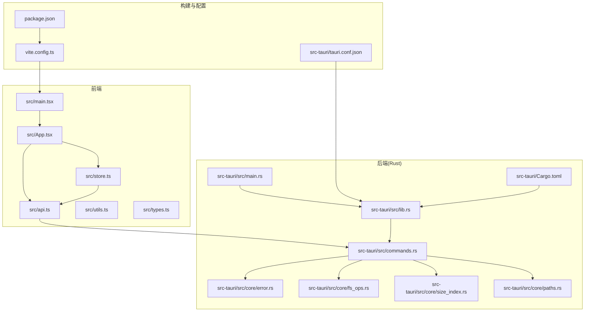
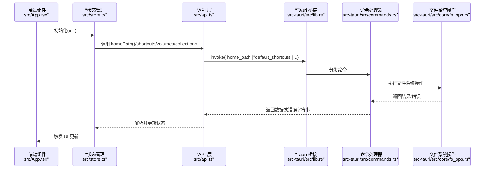
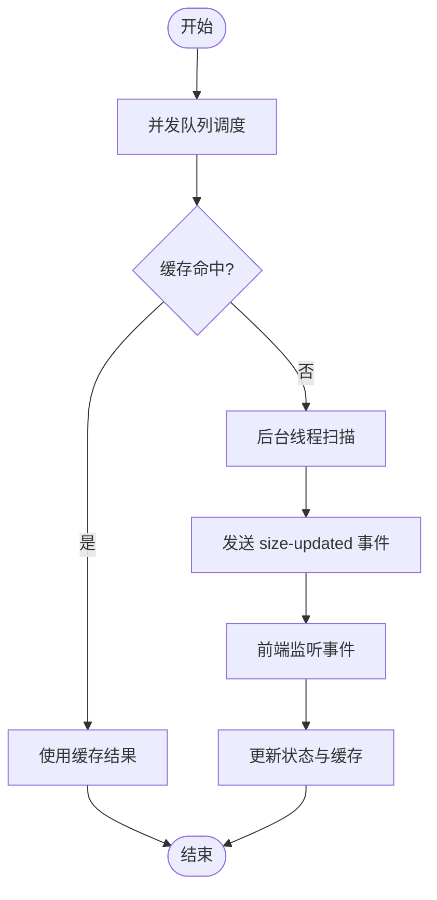
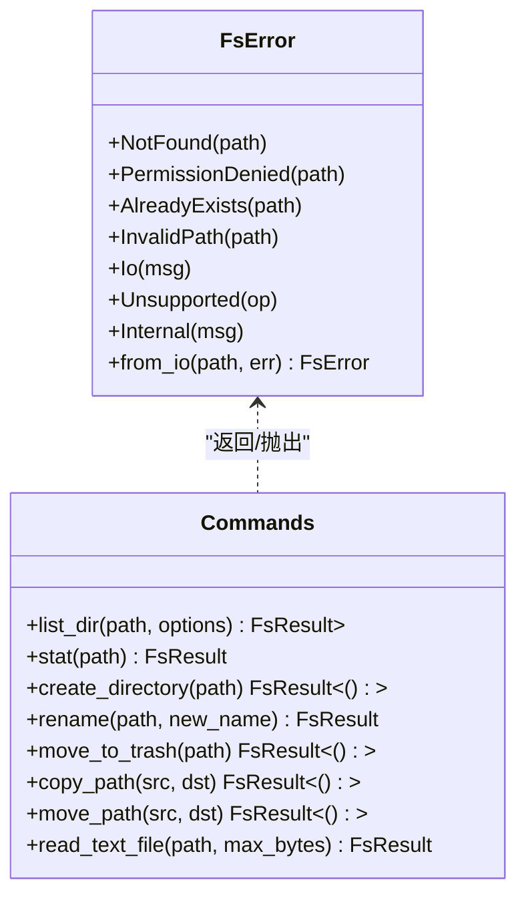
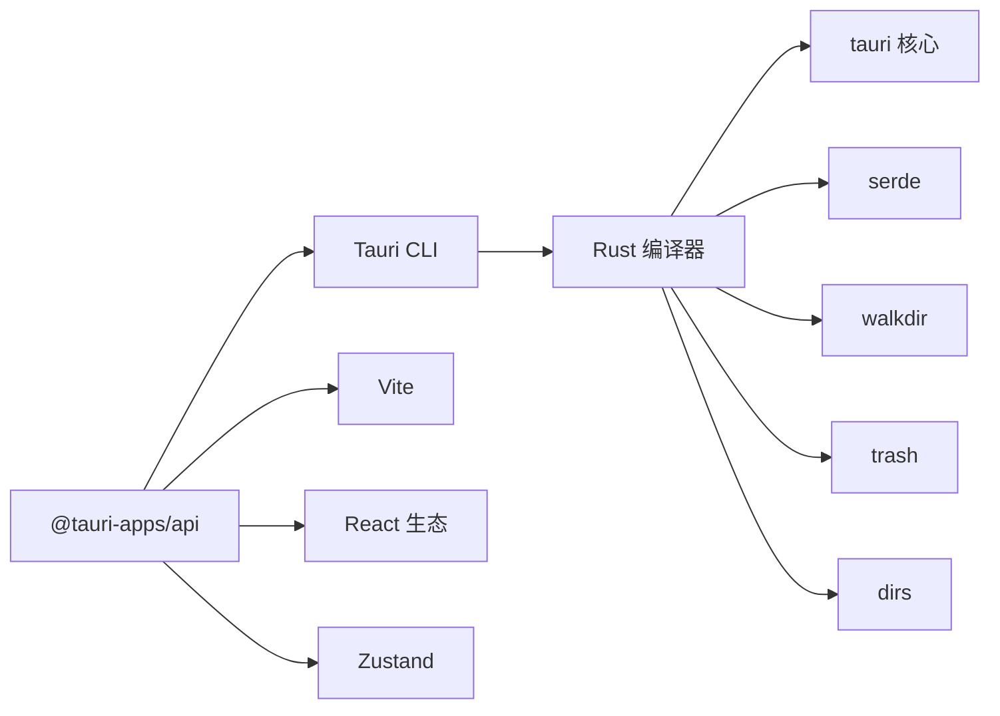

# 故障排除

<cite>
**本文引用的文件**
- [README.md](file://README.md)
- [package.json](file://package.json)
- [vite.config.ts](file://vite.config.ts)
- [tauri.conf.json](file://src-tauri/tauri.conf.json)
- [Cargo.toml](file://src-tauri/Cargo.toml)
- [src/main.tsx](file://src/main.tsx)
- [src/App.tsx](file://src/App.tsx)
- [src/api.ts](file://src/api.ts)
- [src/store.ts](file://src/store.ts)
- [src/types.ts](file://src/types.ts)
- [src/utils.ts](file://src/utils.ts)
- [src-tauri/src/main.rs](file://src-tauri/src/main.rs)
- [src-tauri/src/lib.rs](file://src-tauri/src/lib.rs)
- [src-tauri/src/core/error.rs](file://src-tauri/src/core/error.rs)
- [src-tauri/src/core/fs_ops.rs](file://src-tauri/src/core/fs_ops.rs)
- [src-tauri/src/core/size_index.rs](file://src-tauri/src/core/size_index.rs)
- [src-tauri/src/core/paths.rs](file://src-tauri/src/core/paths.rs)
- [src-tauri/src/commands.rs](file://src-tauri/src/commands.rs)
</cite>

## 目录
1. [简介](#简介)
2. [项目结构](#项目结构)
3. [核心组件](#核心组件)
4. [架构总览](#架构总览)
5. [详细组件分析](#详细组件分析)
6. [依赖关系分析](#依赖关系分析)
7. [性能考虑](#性能考虑)
8. [故障排除指南](#故障排除指南)
9. [结论](#结论)
10. [附录](#附录)

## 简介
本指南面向技术支持与高级用户，聚焦 LocalBro 的故障排除与运维实践，覆盖启动问题、性能问题、跨平台兼容性问题；提供错误日志记录与分析方法（错误分类、日志格式、分析工具）；阐述性能监控与诊断技巧（指标监控、瓶颈识别、优化建议）；说明用户反馈收集与问题跟踪流程；给出调试工具使用方法与配置示例；并提供紧急问题的应急处理与恢复策略。

## 项目结构
LocalBro 是基于 Tauri + React + TypeScript 的桌面应用，前端通过 Vite 开发，后端 Rust 提供系统级文件操作与目录大小扫描等能力，二者通过 Tauri IPC 通信。

图表来源
- [src/main.tsx:1-12](file://src/main.tsx#L1-L12)
- [src/App.tsx:1-140](file://src/App.tsx#L1-L140)
- [src/api.ts:1-195](file://src/api.ts#L1-L195)
- [src/store.ts:1-308](file://src/store.ts#L1-L308)
- [vite.config.ts:1-33](file://vite.config.ts#L1-L33)
- [tauri.conf.json:1-43](file://src-tauri/tauri.conf.json#L1-L43)
- [src-tauri/src/main.rs:1-7](file://src-tauri/src/main.rs#L1-L7)
- [src-tauri/src/lib.rs:1-53](file://src-tauri/src/lib.rs#L1-L53)
- [src-tauri/src/commands.rs:1-198](file://src-tauri/src/commands.rs#L1-L198)
- [src-tauri/src/core/error.rs:1-50](file://src-tauri/src/core/error.rs#L1-L50)
- [src-tauri/src/core/fs_ops.rs:1-360](file://src-tauri/src/core/fs_ops.rs#L1-L360)
- [src-tauri/src/core/size_index.rs:1-135](file://src-tauri/src/core/size_index.rs#L1-L135)
- [src-tauri/src/core/paths.rs:1-127](file://src-tauri/src/core/paths.rs#L1-L127)
- [Cargo.toml:1-36](file://src-tauri/Cargo.toml#L1-L36)

章节来源
- [README.md:1-8](file://README.md#L1-L8)
- [package.json:1-28](file://package.json#L1-L28)
- [vite.config.ts:1-33](file://vite.config.ts#L1-L33)
- [tauri.conf.json:1-43](file://src-tauri/tauri.conf.json#L1-L43)
- [src-tauri/Cargo.toml:1-36](file://src-tauri/Cargo.toml#L1-L36)

## 核心组件
- 前端入口与渲染：React 根节点挂载与 StrictMode 包裹，确保应用在开发模式下更严格地检查潜在问题。
- 应用主组件：负责初始化、事件监听（目录大小更新）、并发队列扫描、快捷键预览等。
- API 层：统一调用 Tauri invoke，封装命令参数与返回值转换，保持前后端数据契约一致。
- 状态管理：Zustand Store 维护当前工作目录、条目列表、历史导航、选择集、排序与视图、目录大小缓存、预览状态、集合等。
- 后端命令：暴露文件系统操作、文本读取、目录大小索引、集合管理等命令。
- 错误模型：统一的 FsError 枚举，便于前端识别与提示。

章节来源
- [src/main.tsx:1-12](file://src/main.tsx#L1-L12)
- [src/App.tsx:100-140](file://src/App.tsx#L100-L140)
- [src/api.ts:1-195](file://src/api.ts#L1-L195)
- [src/store.ts:16-71](file://src/store.ts#L16-L71)
- [src-tauri/src/lib.rs:11-52](file://src-tauri/src/lib.rs#L11-L52)
- [src-tauri/src/core/error.rs:7-29](file://src-tauri/src/core/error.rs#L7-L29)

## 架构总览
前端通过 @tauri-apps/api 的 invoke 调用后端命令，后端命令在 Tauri Builder 中注册，执行具体文件系统操作或业务逻辑，并通过事件向前端推送进度或结果。

图表来源
- [src/App.tsx:108-116](file://src/App.tsx#L108-L116)
- [src/store.ts:97-110](file://src/store.ts#L97-L110)
- [src/api.ts:37-61](file://src/api.ts#L37-L61)
- [src-tauri/src/lib.rs:15-49](file://src-tauri/src/lib.rs#L15-L49)
- [src-tauri/src/commands.rs:13-31](file://src-tauri/src/commands.rs#L13-L31)
- [src-tauri/src/core/fs_ops.rs:140-179](file://src-tauri/src/core/fs_ops.rs#L140-L179)

## 详细组件分析

### 目录大小扫描与事件推送
- 前端使用并发队列触发目录大小扫描请求，若缓存命中则直接使用；否则后台线程计算并推送 size-updated 事件。
- 前端监听该事件并更新缓存，避免重复扫描。

图表来源
- [src/App.tsx:22-63](file://src/App.tsx#L22-L63)
- [src-tauri/src/core/size_index.rs:60-104](file://src-tauri/src/core/size_index.rs#L60-L104)
- [src-tauri/src/commands.rs:110-126](file://src-tauri/src/commands.rs#L110-L126)
- [src-tauri/src/core/fs_ops.rs:140-179](file://src-tauri/src/core/fs_ops.rs#L140-L179)

章节来源
- [src/App.tsx:22-63](file://src/App.tsx#L22-L63)
- [src-tauri/src/core/size_index.rs:17-53](file://src-tauri/src/core/size_index.rs#L17-L53)
- [src-tauri/src/commands.rs:110-126](file://src-tauri/src/commands.rs#L110-L126)

### 文件系统操作与错误模型
- 统一的 FsError 枚举涵盖路径不存在、权限不足、路径已存在、无效路径、IO 错误、不支持的操作、内部错误等。
- Rust 层将 std::io::Error 映射为 FsError，并序列化为字符串返回给前端，前端据此展示用户可理解的提示。

图表来源
- [src-tauri/src/core/error.rs:7-29](file://src-tauri/src/core/error.rs#L7-L29)
- [src-tauri/src/commands.rs:13-81](file://src-tauri/src/commands.rs#L13-L81)
- [src-tauri/src/core/fs_ops.rs:140-359](file://src-tauri/src/core/fs_ops.rs#L140-L359)

章节来源
- [src-tauri/src/core/error.rs:31-47](file://src-tauri/src/core/error.rs#L31-L47)
- [src-tauri/src/commands.rs:13-81](file://src-tauri/src/commands.rs#L13-L81)

### 预览与快捷键
- 空格键打开快速预览（QuickLook 风格），在输入框/文本域中忽略快捷键。
- 预览关闭由模态组件自行处理，避免与全局快捷键冲突。

章节来源
- [src/App.tsx:65-98](file://src/App.tsx#L65-L98)

### 导航与历史
- 历史栈支持前进/后退，切换显示隐藏文件会立即刷新列表。
- 支持集合虚拟路径（collection:<id>）浏览，集合视图不可“向上”。

章节来源
- [src/store.ts:112-170](file://src/store.ts#L112-L170)
- [src/store.ts:265-276](file://src/store.ts#L265-L276)

## 依赖关系分析
- 前端依赖：React、ReactDOM、@tauri-apps/api、@tauri-apps/plugin-opener、zustand。
- 后端依赖：tauri、serde、serde_json、thiserror、trash、dirs、chrono、parking_lot、walkdir。
- 构建与运行：Vite（开发服务器、HMR）、Tauri CLI（打包与运行）、Rust 工具链。

图表来源
- [package.json:12-26](file://package.json#L12-L26)
- [src-tauri/Cargo.toml:17-27](file://src-tauri/Cargo.toml#L17-L27)
- [vite.config.ts:8-32](file://vite.config.ts#L8-L32)
- [tauri.conf.json:6-11](file://src-tauri/tauri.conf.json#L6-L11)

章节来源
- [package.json:12-26](file://package.json#L12-L26)
- [src-tauri/Cargo.toml:17-27](file://src-tauri/Cargo.toml#L17-L27)

## 性能考虑
- 目录大小扫描采用后台线程与共享缓存，避免阻塞 UI；重复请求通过 in-flight 集合去重。
- 列表渲染前对隐藏项进行过滤，减少前端渲染负担。
- 文本预览默认限制读取字节数，防止大文件导致内存压力。
- 使用并发队列控制扫描并发度，避免同时对大量目录发起扫描。

章节来源
- [src-tauri/src/core/size_index.rs:60-104](file://src-tauri/src/core/size_index.rs#L60-L104)
- [src/App.tsx:22-63](file://src/App.tsx#L22-L63)
- [src/api.ts:131-136](file://src/api.ts#L131-L136)
- [src/store.ts:187-197](file://src/store.ts#L187-L197)

## 故障排除指南

### 启动问题
- 症状
  - 开发时无法访问前端页面或热更新失效
  - 打包后应用无法启动或白屏
- 诊断步骤
  - 检查开发服务器端口占用与严格端口设置
  - 确认 Tauri 配置中的 devUrl 与前端端口一致
  - 查看构建脚本与依赖安装是否完整
- 解决方案
  - 若端口被占用，调整 Vite server.port 或释放端口
  - 确保 beforeDevCommand 正确指向 npm run dev
  - 清理 node_modules 并重新安装依赖
  - 在生产环境检查 bundle.targets 与图标资源路径

章节来源
- [vite.config.ts:16-31](file://vite.config.ts#L16-L31)
- [tauri.conf.json:6-11](file://src-tauri/tauri.conf.json#L6-L11)
- [package.json:6-11](file://package.json#L6-L11)

### 权限与路径相关问题
- 症状
  - 访问特定目录报“权限不足”或“路径不存在”
  - 移动/复制/删除失败
- 诊断步骤
  - 在后端命令层捕获 FsError 并映射到用户可读信息
  - 检查目标路径是否存在、是否为符号链接、是否只读
- 解决方案
  - 提升进程权限或切换到有权限的用户
  - 对只读文件先解除只读再操作
  - 避免对不存在的路径执行操作

章节来源
- [src-tauri/src/core/error.rs:32-41](file://src-tauri/src/core/error.rs#L32-L41)
- [src-tauri/src/core/fs_ops.rs:140-179](file://src-tauri/src/core/fs_ops.rs#L140-L179)
- [src-tauri/src/commands.rs:13-81](file://src-tauri/src/commands.rs#L13-L81)

### 目录大小扫描异常
- 症状
  - 大目录长时间无响应或扫描卡住
  - 事件未到达导致 UI 不更新
- 诊断步骤
  - 检查 size-updated 事件是否发出
  - 查看 in-flight 去重是否生效
  - 确认后台线程未因异常退出
- 解决方案
  - 适当降低并发度或分批扫描
  - 对异常路径跳过并记录日志
  - 前端超时回退与手动刷新

章节来源
- [src-tauri/src/core/size_index.rs:60-104](file://src-tauri/src/core/size_index.rs#L60-L104)
- [src/App.tsx:108-116](file://src/App.tsx#L108-L116)

### 预览与文本读取问题
- 症状
  - 预览无法打开或空白
  - 文本文件读取截断或乱码
- 诊断步骤
  - 检查空格键快捷键是否被输入框拦截
  - 确认 read_text_file 的 max_bytes 是否合理
  - 校验文件编码与大小
- 解决方案
  - 在输入框/文本域中禁用空格快捷键
  - 调整 max_bytes 或允许用户手动扩大
  - 对二进制文件避免读取文本内容

章节来源
- [src/App.tsx:65-98](file://src/App.tsx#L65-L98)
- [src/api.ts:131-136](file://src/api.ts#L131-L136)
- [src-tauri/src/core/fs_ops.rs:294-318](file://src-tauri/src/core/fs_ops.rs#L294-L318)

### 跨平台兼容性问题
- 症状
  - Windows 下卷标显示异常
  - macOS/Linux 下隐藏文件识别不一致
  - 打开原生文件管理器失败
- 诊断步骤
  - 检查各平台路径解析与卷标枚举逻辑
  - 验证隐藏文件判断规则（Unix 以点开头、Windows HIDDEN 属性）
  - 确认原生打开命令在各平台可用
- 解决方案
  - 使用平台条件编译与特性开关
  - 对不可用功能提供降级提示
  - 统一路径分隔符与大小写处理

章节来源
- [src-tauri/src/core/paths.rs:58-119](file://src-tauri/src/core/paths.rs#L58-L119)
- [src-tauri/src/core/fs_ops.rs:62-85](file://src-tauri/src/core/fs_ops.rs#L62-L85)
- [src-tauri/src/core/fs_ops.rs:320-359](file://src-tauri/src/core/fs_ops.rs#L320-L359)

### 用户反馈与问题跟踪流程
- 收集要点
  - 系统版本、LocalBro 版本、操作系统版本
  - 复现步骤、涉及路径、操作类型（移动/复制/删除/预览）
  - 日志片段（见下一节）
- 跟踪建议
  - 使用 issue 模板分类：启动问题、权限问题、性能问题、跨平台问题
  - 为每类问题建立标签与优先级

[本节为通用流程说明，无需列出章节来源]

### 错误日志记录与分析方法
- 错误分类
  - 路径类：NotFound、InvalidPath、AlreadyExists
  - 权限类：PermissionDenied
  - IO 类：Io（含系统错误映射）
  - 不支持：Unsupported
  - 内部：Internal
- 日志格式
  - 前端：将 FsError 序列化为字符串，携带路径上下文
  - 后端：统一错误类型与消息，必要时附加时间戳与调用栈
- 分析工具
  - 浏览器开发者工具 Network/Console
  - Tauri 日志输出（开发模式下更清晰）
  - 系统日志（Windows 事件查看器、macOS Console、Linux journalctl）

章节来源
- [src-tauri/src/core/error.rs:7-29](file://src-tauri/src/core/error.rs#L7-L29)
- [src-tauri/src/core/error.rs:43-47](file://src-tauri/src/core/error.rs#L43-L47)
- [src-tauri/src/commands.rs:13-81](file://src-tauri/src/commands.rs#L13-L81)

### 性能监控与诊断技巧
- 指标监控
  - 目录扫描耗时、并发数、缓存命中率
  - 列表渲染耗时、预览加载耗时
  - 文本读取字节数与截断比例
- 瓶颈识别
  - 大目录扫描：优先缓存与增量更新
  - 高并发：限制并发度，合并重复请求
  - UI 卡顿：延迟渲染、虚拟滚动（如后续扩展）
- 优化建议
  - 合理设置 read_text_file 的 max_bytes
  - 对隐藏文件过滤在后端完成，减少前端负担
  - 使用事件驱动的异步更新，避免同步阻塞

章节来源
- [src-tauri/src/core/size_index.rs:60-104](file://src-tauri/src/core/size_index.rs#L60-L104)
- [src/App.tsx:22-63](file://src/App.tsx#L22-L63)
- [src/api.ts:131-136](file://src/api.ts#L131-L136)
- [src/store.ts:187-197](file://src/store.ts#L187-L197)

### 调试工具使用与配置示例
- 开发调试
  - 使用 Vite HMR 与严格端口设置，确保热更新稳定
  - 在 Tauri 开发模式下启用详细日志
- 前端调试
  - React DevTools、Redux DevTools（Zustand 可配合插件）
  - 控制台观察 invoke 调用与事件监听
- 后端调试
  - 在 Rust 中添加日志输出（如 tracing），区分命令与扫描线程
  - 使用断点定位命令处理与文件系统调用

章节来源
- [vite.config.ts:16-31](file://vite.config.ts#L16-L31)
- [src-tauri/src/lib.rs:15-51](file://src-tauri/src/lib.rs#L15-L51)

### 紧急问题应急处理与恢复策略
- 启动失败
  - 回滚到上一个稳定版本
  - 清理应用缓存与配置（注意：需明确用户数据位置）
- 权限问题
  - 临时提升权限执行关键操作（如删除/移动）
  - 将受影响路径迁移至有权限目录
- 性能崩溃
  - 关闭后台扫描任务，清空缓存
  - 降低并发或禁用目录大小预览
- 数据丢失风险
  - 使用 trash 插件进行回收站操作
  - 对重要操作提供确认与备份提示

章节来源
- [src-tauri/src/commands.rs:19-81](file://src-tauri/src/commands.rs#L19-L81)
- [src-tauri/src/core/fs_ops.rs:219-235](file://src-tauri/src/core/fs_ops.rs#L219-L235)

## 结论
通过统一的错误模型、事件驱动的异步更新、平台化的路径与权限处理，LocalBro 在跨平台文件浏览场景下具备较好的稳定性与可维护性。建议在生产环境中完善日志分级、性能指标采集与告警机制，并持续优化大目录扫描与 UI 渲染体验。

## 附录
- 快速检查清单
  - 开发端口与 HMR 正常
  - Tauri devUrl 与前端端口一致
  - 路径存在且具备访问权限
  - 目录大小扫描事件可达前端
  - 文本读取字节数合理
  - 跨平台隐藏文件与卷标识别正确

[本节为通用附录，无需列出章节来源]