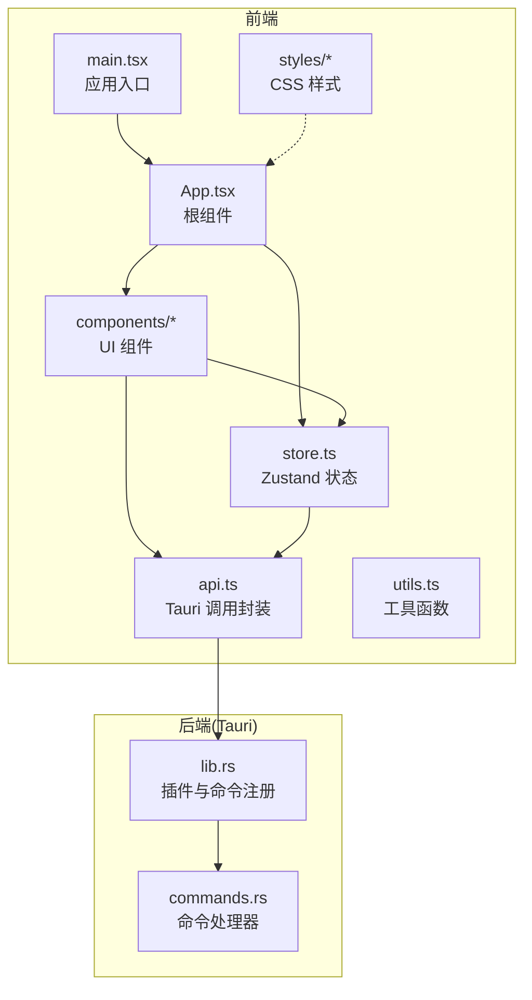
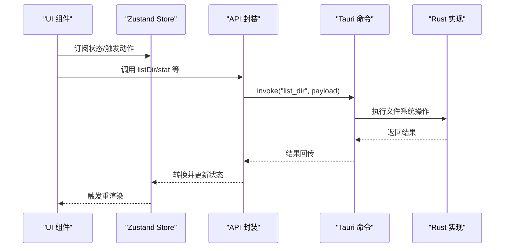
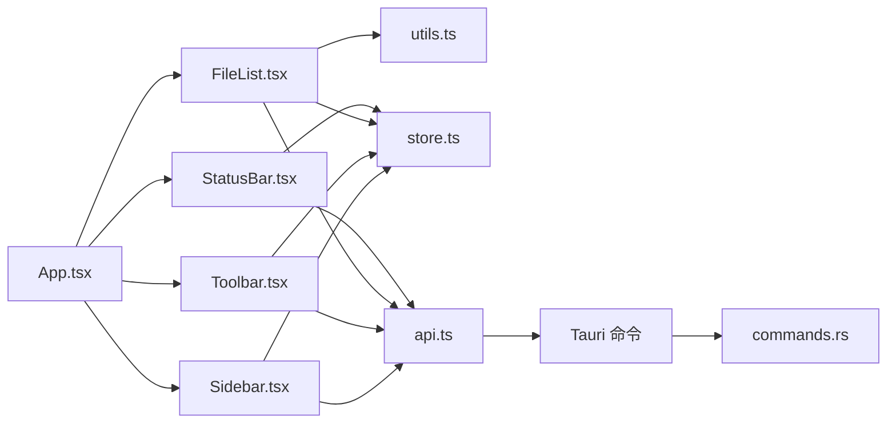
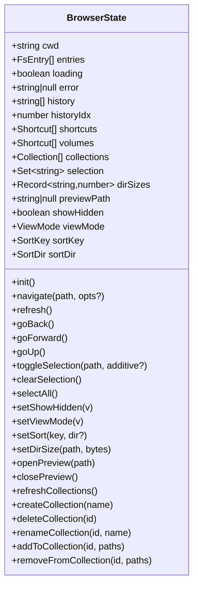
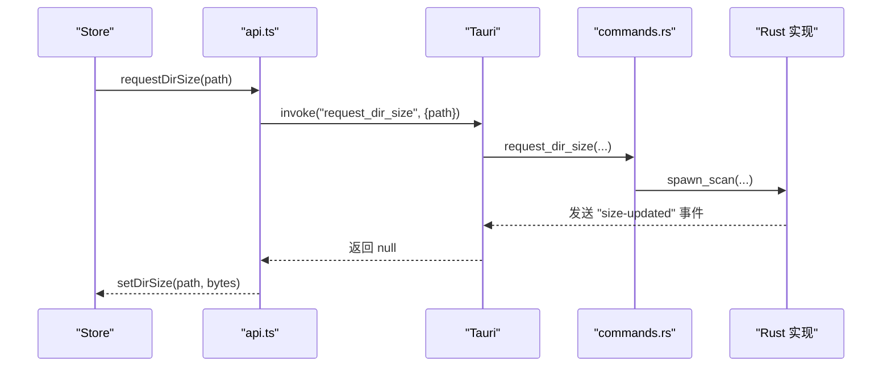
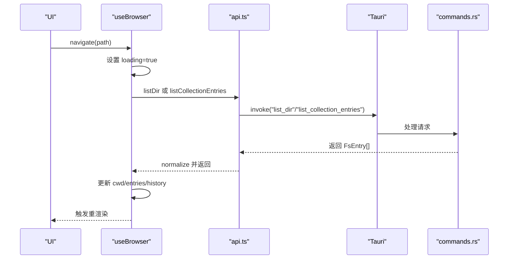
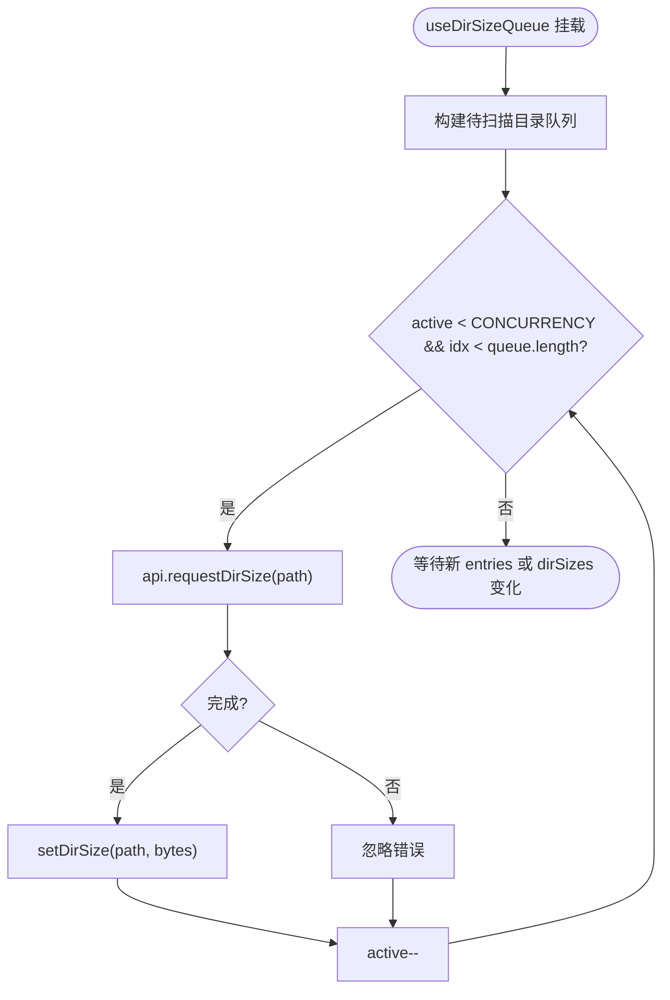
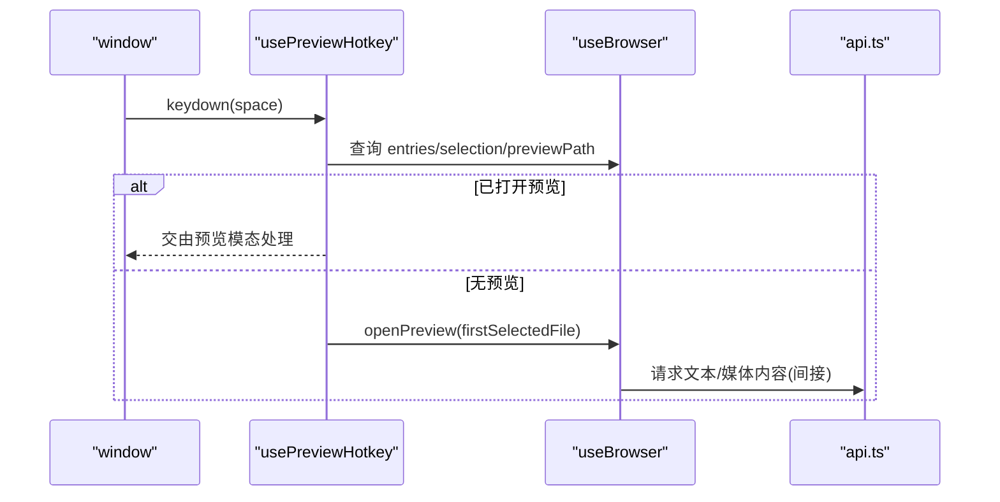
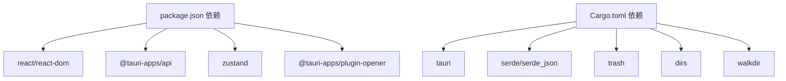

# 前端架构设计

<cite>
**本文档引用的文件**
- [src/App.tsx](file://src/App.tsx)
- [src/main.tsx](file://src/main.tsx)
- [src/store.ts](file://src/store.ts)
- [src/api.ts](file://src/api.ts)
- [src/types.ts](file://src/types.ts)
- [src/utils.ts](file://src/utils.ts)
- [src/components/Sidebar.tsx](file://src/components/Sidebar.tsx)
- [src/components/Toolbar.tsx](file://src/components/Toolbar.tsx)
- [src/components/FileList.tsx](file://src/components/FileList.tsx)
- [src/components/StatusBar.tsx](file://src/components/StatusBar.tsx)
- [src/styles/app.css](file://src/styles/app.css)
- [src/styles/tokens.css](file://src/styles/tokens.css)
- [package.json](file://package.json)
- [README.md](file://README.md)
- [src-tauri/src/lib.rs](file://src-tauri/src/lib.rs)
- [src-tauri/src/commands.rs](file://src-tauri/src/commands.rs)
- [src-tauri/Cargo.toml](file://src-tauri/Cargo.toml)
</cite>

## 目录
1. [简介](#简介)
2. [项目结构](#项目结构)
3. [核心组件](#核心组件)
4. [架构总览](#架构总览)
5. [详细组件分析](#详细组件分析)
6. [依赖关系分析](#依赖关系分析)
7. [性能考量](#性能考量)
8. [故障排查指南](#故障排查指南)
9. [结论](#结论)
10. [附录](#附录)

## 简介
本文件为 LocalBro 项目的前端架构设计文档，聚焦于 React 组件架构、Zustand 状态管理模式、API 通信层设计与组件化设计原则。文档面向初学者提供基础概念解释，同时为高级开发者提供性能优化与最佳实践建议，并通过图示与具体代码路径帮助读者快速理解系统工作原理。

## 项目结构
LocalBro 采用 React + TypeScript + Vite 开发，结合 Tauri 提供原生能力（文件系统、目录大小索引、集合管理等）。前端主要由入口应用、组件层、状态层、API 层与样式层构成；后端（Rust）通过 Tauri 暴露命令接口给前端调用。

**图表来源**
- [src/main.tsx:1-12](file://src/main.tsx#L1-L12)
- [src/App.tsx:100-140](file://src/App.tsx#L100-L140)
- [src/store.ts:73-263](file://src/store.ts#L73-L263)
- [src/api.ts:1-280](file://src/api.ts#L1-L280)
- [src-tauri/src/lib.rs:12-66](file://src-tauri/src/lib.rs#L12-L66)
- [src-tauri/src/commands.rs:15-266](file://src-tauri/src/commands.rs#L15-L266)

**章节来源**
- [src/main.tsx:1-12](file://src/main.tsx#L1-L12)
- [src/App.tsx:100-140](file://src/App.tsx#L100-L140)
- [src/store.ts:73-263](file://src/store.ts#L73-L263)
- [src/api.ts:1-280](file://src/api.ts#L1-L280)
- [src-tauri/src/lib.rs:12-66](file://src-tauri/src/lib.rs#L12-L66)
- [src-tauri/src/commands.rs:15-266](file://src-tauri/src/commands.rs#L15-L266)

## 核心组件
- 应用入口与根组件：负责初始化、事件监听、并发扫描队列与快捷键处理，并组合侧边栏、工具栏、文件列表与状态栏。
- 组件层：Sidebar、Toolbar、FileList、StatusBar 各司其职，通过 Zustand 订阅状态变化。
- 状态层：Zustand store 定义浏览器状态与动作，统一管理目录浏览、历史导航、选择集、排序、视图模式、预览、集合等。
- API 层：对 @tauri-apps/api 的 invoke 封装，统一字段命名与返回值转换。
- 工具层：格式化、路径解析、图标映射等通用逻辑。
- 样式层：基于 CSS 变量的主题系统，支持明暗主题切换。

**章节来源**
- [src/App.tsx:100-140](file://src/App.tsx#L100-L140)
- [src/components/Sidebar.tsx:19-200](file://src/components/Sidebar.tsx#L19-L200)
- [src/components/Toolbar.tsx:6-216](file://src/components/Toolbar.tsx#L6-L216)
- [src/components/FileList.tsx:42-173](file://src/components/FileList.tsx#L42-L173)
- [src/components/StatusBar.tsx:4-38](file://src/components/StatusBar.tsx#L4-L38)
- [src/store.ts:16-71](file://src/store.ts#L16-L71)
- [src/api.ts:18-48](file://src/api.ts#L18-L48)
- [src/utils.ts:1-66](file://src/utils.ts#L1-L66)
- [src/styles/app.css:1-651](file://src/styles/app.css#L1-L651)
- [src/styles/tokens.css:9-79](file://src/styles/tokens.css#L9-L79)

## 架构总览
前端通过 Zustand 维护全局状态，组件通过订阅状态进行渲染；API 层以 Tauri invoke 方式与后端交互，后端命令在 Rust 中实现并暴露到 Webview。目录大小计算采用缓存+后台扫描机制，通过事件驱动更新状态。

**图表来源**
- [src/store.ts:112-136](file://src/store.ts#L112-L136)
- [src/api.ts:37-48](file://src/api.ts#L37-L48)
- [src-tauri/src/commands.rs:15-23](file://src-tauri/src/commands.rs#L15-L23)
- [src-tauri/src/lib.rs:26-62](file://src-tauri/src/lib.rs#L26-L62)

## 详细组件分析

### 组件层次结构与通信机制
- 层次结构：App 作为根容器，内部组合 Sidebar、Toolbar、FileList、StatusBar；FileList 内部根据视图模式渲染 ListView/Grid/Details。
- 通信机制：组件通过 useBrowser 订阅状态；动作通过 store 的方法触发；API 层负责与后端通信；事件通过 @tauri-apps/api 的 listen 接收并更新状态。
- 生命周期管理：useEffect 在挂载时初始化、注册事件监听；卸载时清理监听；并发扫描队列使用闭包变量控制取消。

**图表来源**
- [src/App.tsx:100-140](file://src/App.tsx#L100-L140)
- [src/components/Sidebar.tsx:19-200](file://src/components/Sidebar.tsx#L19-L200)
- [src/components/Toolbar.tsx:6-216](file://src/components/Toolbar.tsx#L6-L216)
- [src/components/FileList.tsx:42-173](file://src/components/FileList.tsx#L42-L173)
- [src/components/StatusBar.tsx:4-38](file://src/components/StatusBar.tsx#L4-L38)
- [src/store.ts:73-263](file://src/store.ts#L73-L263)
- [src/api.ts:1-280](file://src/api.ts#L1-L280)
- [src-tauri/src/commands.rs:15-266](file://src-tauri/src/commands.rs#L15-L266)

**章节来源**
- [src/App.tsx:100-140](file://src/App.tsx#L100-L140)
- [src/components/Sidebar.tsx:19-200](file://src/components/Sidebar.tsx#L19-L200)
- [src/components/Toolbar.tsx:6-216](file://src/components/Toolbar.tsx#L6-L216)
- [src/components/FileList.tsx:42-173](file://src/components/FileList.tsx#L42-L173)
- [src/components/StatusBar.tsx:4-38](file://src/components/StatusBar.tsx#L4-L38)

### Zustand 状态管理设计
- 全局状态设计：cwd、entries、loading、error、history、shortcuts、volumes、collections、selection、dirSizes、previewPath、viewMode、sortKey、sortDir 等。
- 动作设计：导航、刷新、前进后退、上一级、选择管理、显示隐藏、排序、目录大小设置、预览开关、集合 CRUD 等。
- 更新机制：同步更新（set）、基于旧状态的部分更新（set((s)=>...)）、批量更新（replayNav）。
- 持久化策略：当前未见本地持久化实现，可通过扩展 settings_get/settings_set 或引入本地存储适配器实现。

**图表来源**
- [src/store.ts:16-71](file://src/store.ts#L16-L71)
- [src/types.ts:1-37](file://src/types.ts#L1-L37)

**章节来源**
- [src/store.ts:73-263](file://src/store.ts#L73-L263)
- [src/types.ts:1-37](file://src/types.ts#L1-L37)

### API 通信层设计
- 协议与调用：前端通过 @tauri-apps/api/core 的 invoke 调用后端命令，命令名与参数在 api.ts 中统一封装。
- 数据转换：后端返回 snake_case 字段，前端在 normalize 函数中转换为 camelCase，确保类型安全。
- 验证与错误：API 层不进行业务校验，错误通过 Promise 拒绝或状态 error 字段反馈；调用方需处理异常与加载态。
- 目录大小：dirSizeCached 同步查询缓存，requestDirSize 若未命中则启动后台扫描并通过事件推送更新。

**图表来源**
- [src/api.ts:115-121](file://src/api.ts#L115-L121)
- [src-tauri/src/commands.rs:112-123](file://src-tauri/src/commands.rs#L112-L123)
- [src-tauri/src/lib.rs:16-25](file://src-tauri/src/lib.rs#L16-L25)
- [src/App.tsx:110-115](file://src/App.tsx#L110-L115)

**章节来源**
- [src/api.ts:18-48](file://src/api.ts#L18-L48)
- [src/api.ts:111-121](file://src/api.ts#L111-L121)
- [src-tauri/src/commands.rs:104-128](file://src-tauri/src/commands.rs#L104-L128)
- [src/App.tsx:110-115](file://src/App.tsx#L110-L115)

### 组件化设计原则
- 单一职责：Sidebar 负责收藏、卷与集合；Toolbar 负责导航、地址栏、视图与选择操作；FileList 负责三种视图与排序；StatusBar 负责统计信息。
- 组件复用：FileList 内部按视图模式拆分 ListView/Grid/Details，减少重复逻辑；工具函数集中于 utils.ts。
- 状态提升：选择集、排序、视图模式等跨组件共享的状态集中在 store，避免 props 深度传递。
- 事件与回调：组件通过回调（如 onNavigate、onClose）与父级协作，保持解耦。

**章节来源**
- [src/components/Sidebar.tsx:19-200](file://src/components/Sidebar.tsx#L19-L200)
- [src/components/Toolbar.tsx:6-216](file://src/components/Toolbar.tsx#L6-L216)
- [src/components/FileList.tsx:42-173](file://src/components/FileList.tsx#L42-L173)
- [src/components/StatusBar.tsx:4-38](file://src/components/StatusBar.tsx#L4-L38)
- [src/utils.ts:1-66](file://src/utils.ts#L1-L66)

### 关键流程示例

#### 目录浏览与历史导航

**图表来源**
- [src/store.ts:112-136](file://src/store.ts#L112-L136)
- [src/api.ts:37-48](file://src/api.ts#L37-L48)
- [src-tauri/src/commands.rs:15-23](file://src-tauri/src/commands.rs#L15-L23)

#### 目录大小并发扫描队列

**图表来源**
- [src/App.tsx:23-63](file://src/App.tsx#L23-L63)
- [src/api.ts:115-121](file://src/api.ts#L115-L121)
- [src/store.ts:205-206](file://src/store.ts#L205-L206)

#### 快捷键预览

**图表来源**
- [src/App.tsx:66-98](file://src/App.tsx#L66-L98)
- [src/store.ts:208-209](file://src/store.ts#L208-L209)

## 依赖关系分析
- 前端依赖：React、React DOM、@tauri-apps/api、@tauri-apps/plugin-opener、zustand。
- 后端依赖：tauri、serde、trash、dirs、walkdir 等。
- 前后端通信：通过 Tauri 命令系统，命令在 lib.rs 注册，在 commands.rs 实现。

**图表来源**
- [package.json:12-26](file://package.json#L12-L26)
- [src-tauri/Cargo.toml:17-36](file://src-tauri/Cargo.toml#L17-L36)

**章节来源**
- [package.json:12-26](file://package.json#L12-L26)
- [src-tauri/Cargo.toml:17-36](file://src-tauri/Cargo.toml#L17-L36)

## 性能考量
- 渲染优化
  - 使用 useMemo 对排序结果进行缓存，避免每次渲染都重新排序。
  - 列表渲染使用稳定 key（FsEntry.path），减少重排。
- 状态更新
  - 使用局部更新（set((s)=>...)）合并多次变更，降低重渲染次数。
  - 历史导航通过 replayNav 直接设置状态，避免中间态闪烁。
- 异步与并发
  - 目录大小扫描限制并发数，避免阻塞 UI。
  - 缓存优先策略，命中直接返回，未命中再发起后台扫描。
- 样式与主题
  - CSS 变量统一主题，减少重复计算；暗/亮主题自动切换。
- 可选优化建议
  - 将目录大小缓存持久化至本地存储，重启后恢复。
  - 对大文件预览增加节流/防抖与懒加载。
  - 使用 React.memo 包裹重型子组件，配合浅比较优化。

**章节来源**
- [src/components/FileList.tsx:17-22](file://src/components/FileList.tsx#L17-L22)
- [src/store.ts:199-203](file://src/store.ts#L199-L203)
- [src/App.tsx:23-63](file://src/App.tsx#L23-L63)
- [src/styles/tokens.css:9-79](file://src/styles/tokens.css#L9-L79)

## 故障排查指南
- 初始化失败
  - 现象：状态 error 非空，界面显示错误状态。
  - 排查：检查 homePath、defaultShortcuts、listVolumes、listCollections 的调用是否抛错。
  - 参考路径：[src/store.ts:97-110](file://src/store.ts#L97-L110)
- 导航异常
  - 现象：点击面包屑或地址栏无响应。
  - 排查：确认 navigate 动作是否被调用、cwd 是否更新、entries 是否为空。
  - 参考路径：[src/store.ts:112-136](file://src/store.ts#L112-L136)
- 预览无法打开
  - 现象：空格键无效或预览不显示。
  - 排查：确认 usePreviewHotkey 是否绑定、previewPath 是否设置、entries 中是否存在目标项。
  - 参考路径：[src/App.tsx:66-98](file://src/App.tsx#L66-L98)
- 目录大小不更新
  - 现象：状态栏显示“正在计算”但数值不变。
  - 排查：确认 requestDirSize 是否返回 null、后台扫描是否执行、事件是否收到。
  - 参考路径：[src/api.ts:115-121](file://src/api.ts#L115-L121)，[src-tauri/src/commands.rs:112-123](file://src-tauri/src/commands.rs#L112-L123)，[src/App.tsx:110-115](file://src/App.tsx#L110-L115)
- 收藏/集合操作失败
  - 现象：新建/重命名/删除集合无反应。
  - 排查：确认 create/rename/deleteCollection 的调用链路与错误日志。
  - 参考路径：[src/store.ts:211-234](file://src/store.ts#L211-L234)

**章节来源**
- [src/store.ts:97-110](file://src/store.ts#L97-L110)
- [src/store.ts:112-136](file://src/store.ts#L112-L136)
- [src/App.tsx:66-98](file://src/App.tsx#L66-L98)
- [src/api.ts:115-121](file://src/api.ts#L115-L121)
- [src-tauri/src/commands.rs:112-123](file://src-tauri/src/commands.rs#L112-L123)
- [src/store.ts:211-234](file://src/store.ts#L211-L234)

## 结论
LocalBro 前端采用清晰的分层架构：组件层专注 UI 与交互，状态层统一管理业务状态，API 层屏蔽平台差异，工具与样式层提供通用能力与主题。Zustand 提供轻量且直观的状态管理，Tauri 命令系统连接前后端。通过并发扫描、缓存优先与 useMemo 等手段，系统在功能与性能之间取得良好平衡。建议后续引入状态持久化与更完善的错误边界，进一步提升用户体验与稳定性。

## 附录
- 概念解释（面向初学者）
  - 组件：可复用的 UI 单元，接收 props 并返回 JSX。
  - 状态：组件内部或全局的状态，驱动 UI 更新。
  - 订阅：组件通过 hooks 订阅状态变化，实现响应式渲染。
  - 动作：改变状态的方法，通常在 store 中定义。
  - 命令：后端提供的可调用接口，前端通过 invoke 调用。
- 最佳实践（面向高级开发者）
  - 使用局部状态与全局状态分离，避免过度提升。
  - 对昂贵计算使用 useMemo/useCallback 缓存。
  - 对异步操作统一错误处理与加载态管理。
  - 对高频事件（如滚动、键盘）使用节流/防抖。
  - 对大列表使用虚拟化或分页策略。