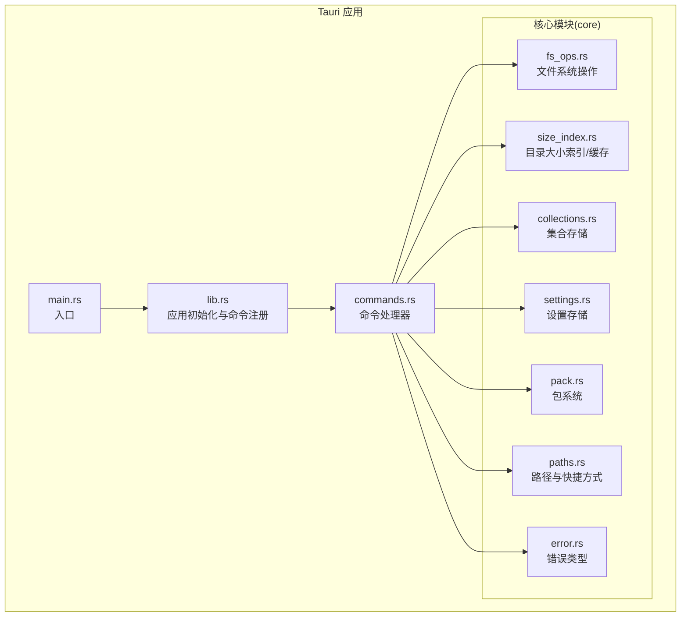
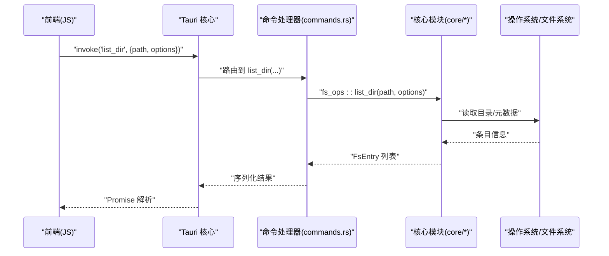
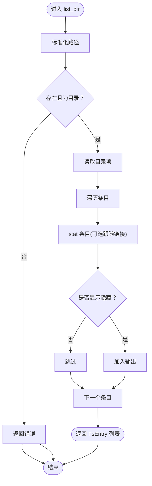
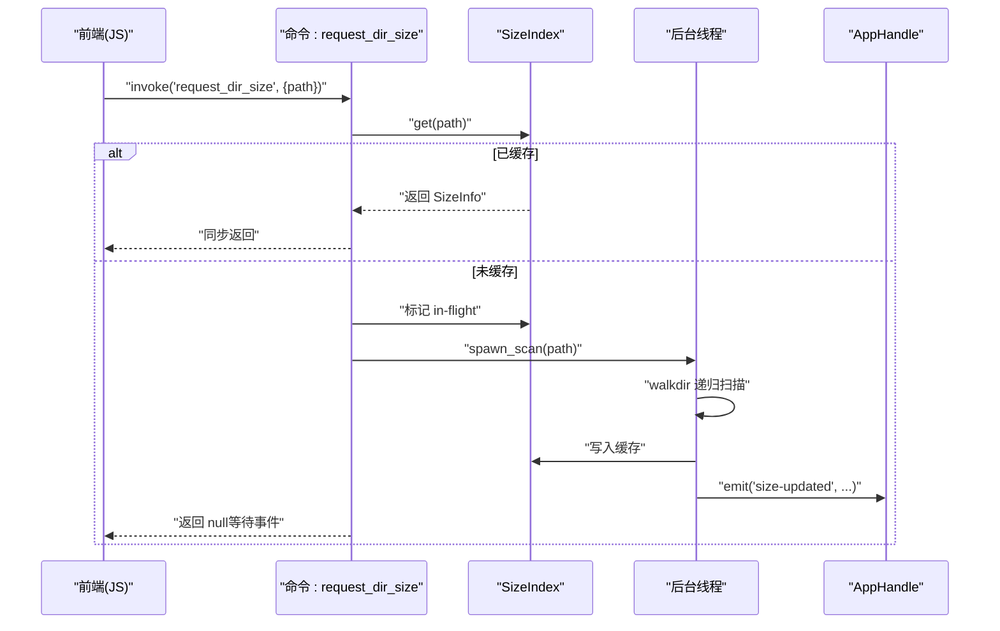
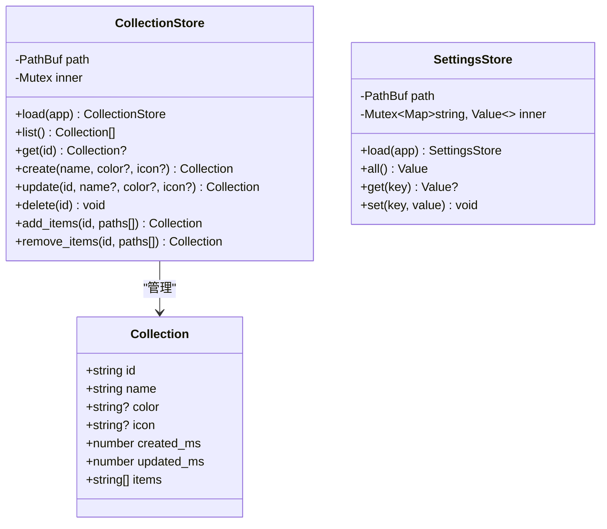
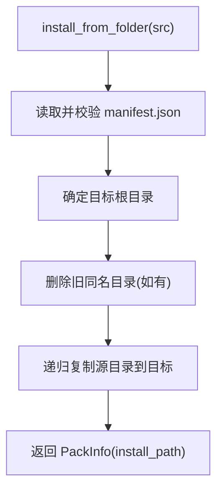
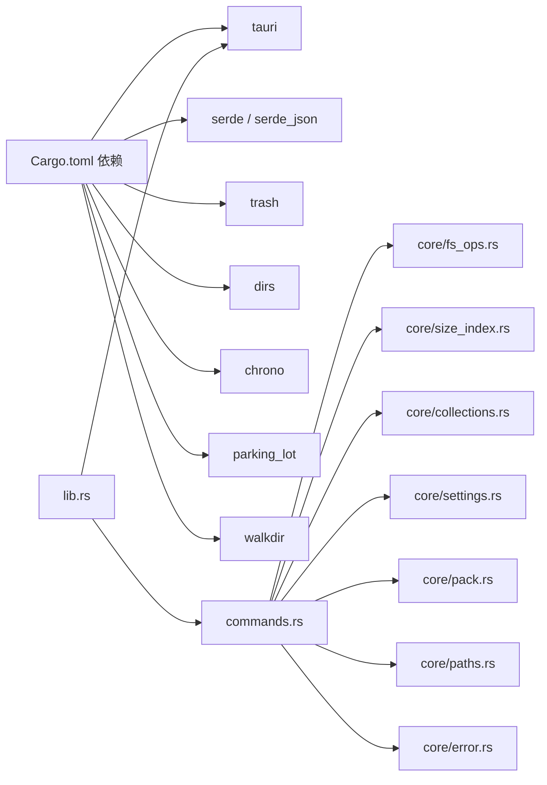

# 后端架构设计

<cite>
**本文引用的文件**
- [Cargo.toml](file://src-tauri/Cargo.toml)
- [main.rs](file://src-tauri/src/main.rs)
- [lib.rs](file://src-tauri/src/lib.rs)
- [commands.rs](file://src-tauri/src/commands.rs)
- [core/mod.rs](file://src-tauri/src/core/mod.rs)
- [core/fs_ops.rs](file://src-tauri/src/core/fs_ops.rs)
- [core/size_index.rs](file://src-tauri/src/core/size_index.rs)
- [core/error.rs](file://src-tauri/src/core/error.rs)
- [core/collections.rs](file://src-tauri/src/core/collections.rs)
- [core/settings.rs](file://src-tauri/src/core/settings.rs)
- [core/pack.rs](file://src-tauri/src/core/pack.rs)
- [core/paths.rs](file://src-tauri/src/core/paths.rs)
- [tauri.conf.json](file://src-tauri/tauri.conf.json)
- [api.ts](file://src/api.ts)
- [main.tsx](file://src/main.tsx)
</cite>

## 目录
1. [简介](#简介)
2. [项目结构](#项目结构)
3. [核心组件](#核心组件)
4. [架构总览](#架构总览)
5. [详细组件分析](#详细组件分析)
6. [依赖关系分析](#依赖关系分析)
7. [性能考量](#性能考量)
8. [故障排查指南](#故障排查指南)
9. [结论](#结论)
10. [附录](#附录)

## 简介
本文件面向 LocalBro 项目的后端架构设计文档，聚焦 Rust 后端服务在 Tauri 框架中的组织方式，涵盖应用入口初始化、命令系统、核心业务模块（文件系统、目录大小索引、集合与设置、包系统、路径与快捷方式）以及并发与错误处理策略。文档同时给出与前端 JavaScript 的交互模式与性能优化建议，并为初学者提供 Rust 架构概念解释，为高级开发者提供内存安全与并发编程最佳实践。

## 项目结构
后端位于 src-tauri 目录，采用“模块化分层 + Tauri 命令暴露”的组织方式：
- 应用入口：main.rs 调用 lib.rs 的 run 函数启动 Tauri。
- 核心模块：core 子目录按功能划分，如 fs_ops、size_index、collections、settings、pack、paths、error。
- 命令层：commands.rs 将核心模块封装为 Tauri 命令，供前端通过 invoke 调用。
- 配置：tauri.conf.json 定义窗口、安全策略与打包配置；Cargo.toml 管理依赖与构建目标。

图表来源
- [main.rs:1-7](file://src-tauri/src/main.rs#L1-L7)
- [lib.rs:1-66](file://src-tauri/src/lib.rs#L1-L66)
- [commands.rs:1-266](file://src-tauri/src/commands.rs#L1-L266)
- [core/mod.rs:1-8](file://src-tauri/src/core/mod.rs#L1-L8)

章节来源
- [Cargo.toml:1-36](file://src-tauri/Cargo.toml#L1-L36)
- [tauri.conf.json:1-43](file://src-tauri/tauri.conf.json#L1-L43)
- [main.rs:1-7](file://src-tauri/src/main.rs#L1-L7)
- [lib.rs:1-66](file://src-tauri/src/lib.rs#L1-L66)

## 核心组件
- 应用入口与初始化
  - 入口函数在 main.rs 中调用 lib.rs::run，完成 Tauri Builder 初始化、共享状态注入（SizeIndex、CollectionStore、SettingsStore）、插件加载（opener）与命令注册。
- 命令系统
  - 通过 generate_handler! 注册所有命令，前端以 invoke("命令名", payload) 调用，Rust 使用 #[tauri::command] 标注对应函数。
- 核心业务模块
  - 文件系统操作：列出目录、统计条目、复制/移动/删除、文本预览等。
  - 目录大小索引：带缓存的目录大小与文件数统计，支持后台扫描与事件通知。
  - 集合与设置：JSON 持久化的用户集合与通用键值设置。
  - 包系统：皮肤与插件的清单解析、安装/卸载、资源读取。
  - 路径与快捷方式：跨平台默认目录与卷盘枚举。

章节来源
- [lib.rs:12-65](file://src-tauri/src/lib.rs#L12-L65)
- [commands.rs:15-266](file://src-tauri/src/commands.rs#L15-L266)
- [core/fs_ops.rs:140-360](file://src-tauri/src/core/fs_ops.rs#L140-L360)
- [core/size_index.rs:33-135](file://src-tauri/src/core/size_index.rs#L33-L135)
- [core/collections.rs:39-191](file://src-tauri/src/core/collections.rs#L39-L191)
- [core/settings.rs:15-71](file://src-tauri/src/core/settings.rs#L15-L71)
- [core/pack.rs:151-311](file://src-tauri/src/core/pack.rs#L151-L311)
- [core/paths.rs:42-127](file://src-tauri/src/core/paths.rs#L42-L127)

## 架构总览
下图展示了从前端到后端命令、再到核心模块的数据流与控制流：

图表来源
- [api.ts:37-48](file://src/api.ts#L37-L48)
- [commands.rs:15-23](file://src-tauri/src/commands.rs#L15-L23)
- [core/fs_ops.rs:140-170](file://src-tauri/src/core/fs_ops.rs#L140-L170)

章节来源
- [lib.rs:26-62](file://src-tauri/src/lib.rs#L26-L62)
- [commands.rs:15-266](file://src-tauri/src/commands.rs#L15-L266)

## 详细组件分析

### 应用入口与初始化
- 入口：main.rs 设置 Windows 子系统并在发布版隐藏控制台，随后调用 lib.rs::run。
- 初始化流程：
  - 构造 SizeIndex 并通过 manage 注入到应用上下文。
  - setup 阶段加载 CollectionStore 与 SettingsStore 并注入。
  - 注册 tauri-plugin-opener 插件。
  - 通过 generate_handler! 统一注册全部命令。
- 关键点：共享状态使用 Arc 包装，确保多命令间安全共享；State 生命周期由 Tauri 管理。

章节来源
- [main.rs:4-6](file://src-tauri/src/main.rs#L4-L6)
- [lib.rs:13-25](file://src-tauri/src/lib.rs#L13-L25)
- [lib.rs:17-62](file://src-tauri/src/lib.rs#L17-L62)

### Tauri 命令系统设计
- 命令定义与参数传递
  - 前端通过 @tauri-apps/api/core 的 invoke 调用，传入参数对象。
  - Rust 使用 #[tauri::command] 标注函数，参数自动反序列化，返回值自动序列化。
  - 复杂参数（如 ListOptions、PackKind）通过 serde 结构体传递。
- 返回值处理
  - 成功：直接返回值或 Result<T, FsError>；失败：FsError 序列化为字符串错误。
  - 文本预览返回包含内容、截断标记与总字节数的结构体。
- 事件驱动
  - 目录大小扫描完成后通过 app.emit("size-updated", ...) 推送事件给前端。

章节来源
- [api.ts:37-136](file://src/api.ts#L37-L136)
- [commands.rs:15-102](file://src-tauri/src/commands.rs#L15-L102)
- [commands.rs:112-123](file://src-tauri/src/commands.rs#L112-L123)
- [core/error.rs:43-47](file://src-tauri/src/core/error.rs#L43-L47)

### 文件系统操作模块（fs_ops）
- 数据模型
  - FsEntry：文件/目录/符号链接/其他，包含名称、路径、大小、时间戳、只读、扩展名、隐藏标志等。
  - ListOptions：显示隐藏项、跟随符号链接。
- 关键能力
  - 列出目录：过滤隐藏项、跳过不可读条目。
  - 统计单个路径：区分文件/目录/链接。
  - 创建/重命名/删除/复制/移动：跨设备移动回退为 copy+delete。
  - 文本文件预览：限制最大读取字节，UTF-8 容错替换。
  - 打开原生文件管理器：macOS 使用 open -R，Windows 使用 explorer /select,，Linux 使用 xdg-open。
- 错误处理
  - 统一映射 io::Error 到 FsError，便于前端识别。

图表来源
- [core/fs_ops.rs:140-170](file://src-tauri/src/core/fs_ops.rs#L140-L170)
- [core/fs_ops.rs:87-138](file://src-tauri/src/core/fs_ops.rs#L87-L138)

章节来源
- [core/fs_ops.rs:9-37](file://src-tauri/src/core/fs_ops.rs#L9-L37)
- [core/fs_ops.rs:39-47](file://src-tauri/src/core/fs_ops.rs#L39-L47)
- [core/fs_ops.rs:140-360](file://src-tauri/src/core/fs_ops.rs#L140-L360)

### 目录大小索引与缓存（size_index）
- 设计要点
  - SizeIndex：内存缓存（路径->SizeInfo），并发安全使用 Mutex；inflight 避免重复扫描。
  - SizeInfo：字节数、文件数、计算完成时间。
  - 事件：扫描完成后通过 app.emit("size-updated", ...) 推送。
- 并发与资源
  - 后台线程执行扫描，结束后更新缓存并发出事件。
  - 使用 parking_lot::Mutex 提升锁性能。
- 性能特性
  - 命中缓存时立即返回；未命中则异步扫描，避免阻塞主线程。

图表来源
- [commands.rs:112-123](file://src-tauri/src/commands.rs#L112-L123)
- [core/size_index.rs:60-104](file://src-tauri/src/core/size_index.rs#L60-L104)
- [core/size_index.rs:106-134](file://src-tauri/src/core/size_index.rs#L106-L134)

章节来源
- [core/size_index.rs:17-31](file://src-tauri/src/core/size_index.rs#L17-L31)
- [core/size_index.rs:33-53](file://src-tauri/src/core/size_index.rs#L33-L53)
- [core/size_index.rs:60-104](file://src-tauri/src/core/size_index.rs#L60-L104)

### 集合与设置模块
- 集合（Collections）
  - Collection：包含 id/name/color/icon/items 等字段，items 为绝对路径列表。
  - CollectionStore：基于 JSON 文件持久化，提供 CRUD 与批量增删。
  - 加载时过滤缺失条目，保持 schema 自由以便未来迁移。
- 设置（Settings）
  - SettingsStore：键值对存储，schema 自由，保留未知键以保证向前兼容。
  - 支持 get/set/all，空值表示删除键。

图表来源
- [core/collections.rs:19-31](file://src-tauri/src/core/collections.rs#L19-L31)
- [core/collections.rs:39-164](file://src-tauri/src/core/collections.rs#L39-L164)
- [core/settings.rs:15-62](file://src-tauri/src/core/settings.rs#L15-L62)

章节来源
- [core/collections.rs:39-191](file://src-tauri/src/core/collections.rs#L39-L191)
- [core/settings.rs:15-71](file://src-tauri/src/core/settings.rs#L15-L71)

### 包系统（皮肤与插件）
- 清单与验证
  - PackManifest：包含版本、id、类型、名称、版本、描述、作者、主页、许可证、图标、引擎要求、skin 或 plugin 字段。
  - 校验规则：manifestVersion、id 合法性、类型与字段一致性。
- 扫描与读取
  - scan：扫描 app_data 下 skins/plugins 子目录，解析并校验清单。
  - read_asset：安全读取包内资源，防止路径逃逸。
- 安装/卸载
  - install_from_folder：从源目录复制到目标位置，覆盖同名 id。
  - uninstall：删除包目录，进行根目录逃逸检查。

图表来源
- [core/pack.rs:256-271](file://src-tauri/src/core/pack.rs#L256-L271)
- [core/pack.rs:236-251](file://src-tauri/src/core/pack.rs#L236-L251)

章节来源
- [core/pack.rs:151-311](file://src-tauri/src/core/pack.rs#L151-L311)

### 路径与快捷方式
- 默认快捷方式：根据 dirs crate 获取各平台常用目录（桌面、文档、下载、图片、音乐、视频等）。
- 卷盘枚举：macOS 基于 /Volumes，Windows 基于 A:–Z:，Linux 基于 /mnt 与 /media/<user>。
- 主页路径：优先返回用户主目录，失败时回退为根路径。

章节来源
- [core/paths.rs:42-127](file://src-tauri/src/core/paths.rs#L42-L127)

### 错误处理与类型系统
- FsError：统一错误类型，包含 not found、permission denied、already exists、invalid path、io、unsupported、internal 等变体。
- 序列化：FsError 实现了自定义序列化，便于 Tauri IPC 返回简洁字符串。
- IO 映射：FsError::from_io 将标准 io::Error 映射为具体 FsError 变体。

章节来源
- [core/error.rs:7-49](file://src-tauri/src/core/error.rs#L7-L49)

## 依赖关系分析
- 依赖与构建
  - 依赖：tauri、tauri-plugin-opener、serde、serde_json、thiserror、trash、dirs、chrono、parking_lot、walkdir。
  - 构建目标：lib crate-type 包含 staticlib、cdylib、rlib，适配 Web 前端调用。
- 模块耦合
  - commands.rs 作为唯一对外暴露层，集中调用 core/* 模块。
  - core/mod.rs 汇总导出子模块，保持接口稳定。
- 外部集成
  - tauri.conf.json 开启 asset protocol，允许前端访问本地资源。

图表来源
- [Cargo.toml:17-28](file://src-tauri/Cargo.toml#L17-L28)
- [lib.rs:16-26](file://src-tauri/src/lib.rs#L16-L26)
- [commands.rs:7-13](file://src-tauri/src/commands.rs#L7-L13)

章节来源
- [Cargo.toml:1-36](file://src-tauri/Cargo.toml#L1-L36)
- [core/mod.rs:1-8](file://src-tauri/src/core/mod.rs#L1-L8)

## 性能考量
- I/O 与并发
  - 目录大小扫描在后台线程执行，避免阻塞 UI；使用 Mutex 保护共享状态。
  - 使用 parking_lot::Mutex 提升锁性能；inflight 避免重复扫描。
- 内存与序列化
  - FsEntry 字段尽量惰性计算（目录大小在 SizeIndex 中计算），减少前端负担。
  - 文本预览限制最大读取字节，避免大文件导致内存峰值过高。
- 跨平台行为
  - 路径与权限判断在各平台分支中处理，减少不必要的系统调用。
- 前端交互优化
  - invoke 参数采用 Option/默认值，减少前端构造成本。
  - 事件推送（size-updated）用于增量刷新，降低轮询成本。

## 故障排查指南
- 常见错误定位
  - 文件不存在/路径非法：FsError::NotFound/InvalidPath，检查路径合法性与权限。
  - 权限不足：FsError::PermissionDenied，确认用户是否有相应权限。
  - 资源被占用/已存在：FsError::AlreadyExists，避免重复操作。
- 日志与诊断
  - 包扫描阶段遇到无效清单会打印到 stderr，不影响其他包。
  - 目录大小扫描失败不会污染缓存，前端不会收到事件。
- 建议排查步骤
  - 确认命令参数格式与类型匹配（前端 api.ts 对齐）。
  - 检查 app_data 目录权限与磁盘空间。
  - 观察 size-updated 事件是否到达，判断后台扫描是否成功。

章节来源
- [core/error.rs:31-41](file://src-tauri/src/core/error.rs#L31-L41)
- [core/pack.rs:208-231](file://src-tauri/src/core/pack.rs#L208-L231)
- [core/size_index.rs:77-98](file://src-tauri/src/core/size_index.rs#L77-L98)

## 结论
LocalBro 的后端采用清晰的模块化与命令式接口设计：前端通过 Tauri invoke 调用 Rust 命令，Rust 核心模块负责具体业务逻辑与系统交互。通过 SizeIndex 缓存与后台扫描、JSON 持久化、跨平台路径与卷盘枚举、包系统清单校验与安全读取，系统在易用性与可维护性之间取得良好平衡。并发方面使用后台线程与细粒度锁，结合事件推送实现非阻塞体验。建议后续迭代引入增量监控与更完善的错误上报机制。

## 附录
- 前端与后端交互模式
  - 前端通过 @tauri-apps/api/core 的 invoke 调用后端命令，参数与返回值在 api.ts 中声明与转换。
  - 命令注册集中在 lib.rs 的 generate_handler! 中，便于统一管理与扩展。
- 最佳实践
  - 初学者：从 core/fs_ops.rs 与 commands.rs 的简单命令入手，理解参数传递与返回值序列化。
  - 高级开发者：关注并发模型（Arc + Mutex）、错误传播链路、跨平台差异与 I/O 优化策略。

章节来源
- [api.ts:1-280](file://src/api.ts#L1-L280)
- [lib.rs:27-62](file://src-tauri/src/lib.rs#L27-L62)
- [main.tsx:1-12](file://src/main.tsx#L1-L12)