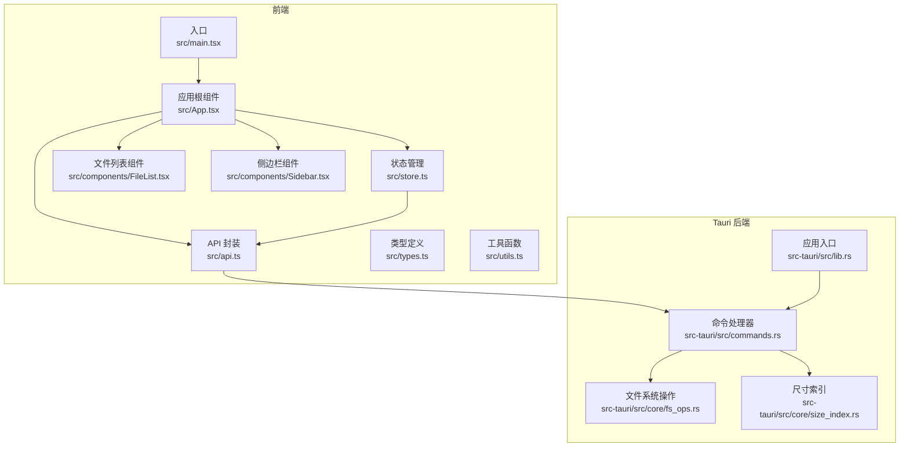
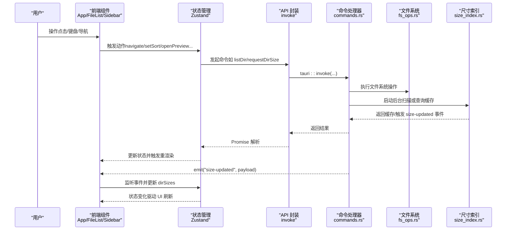
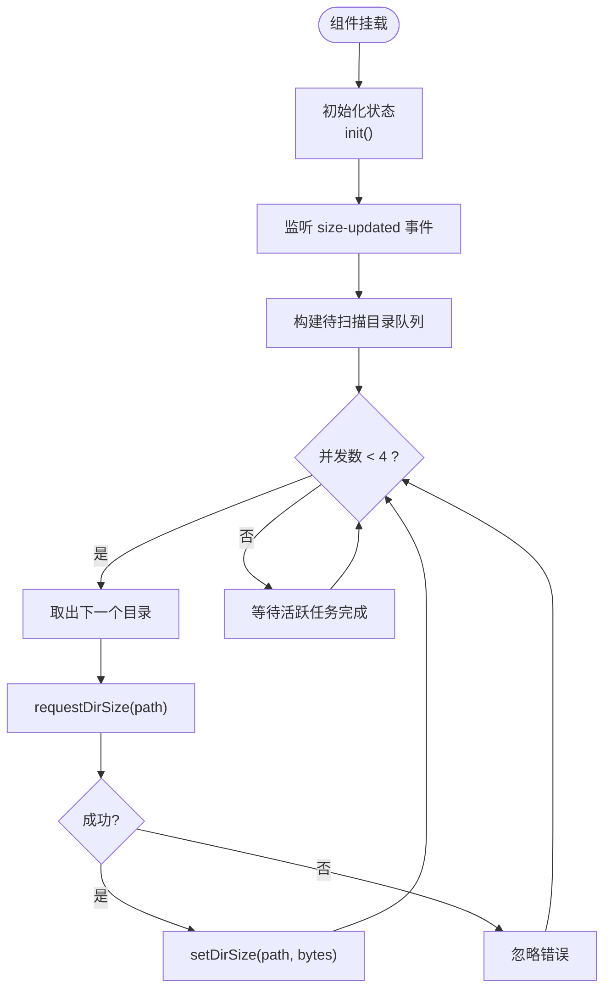
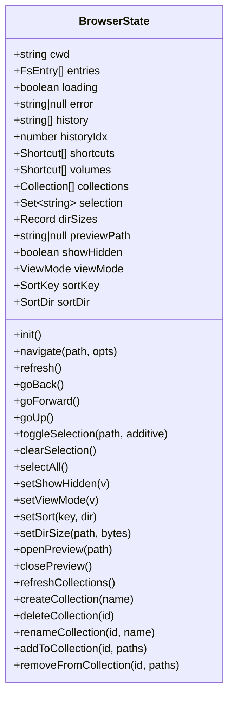
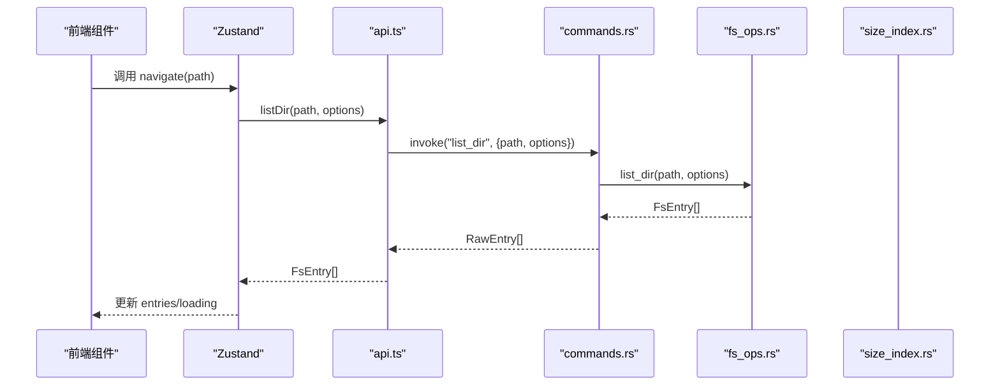
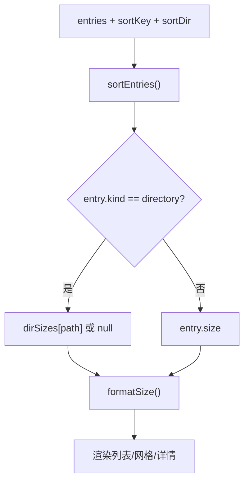
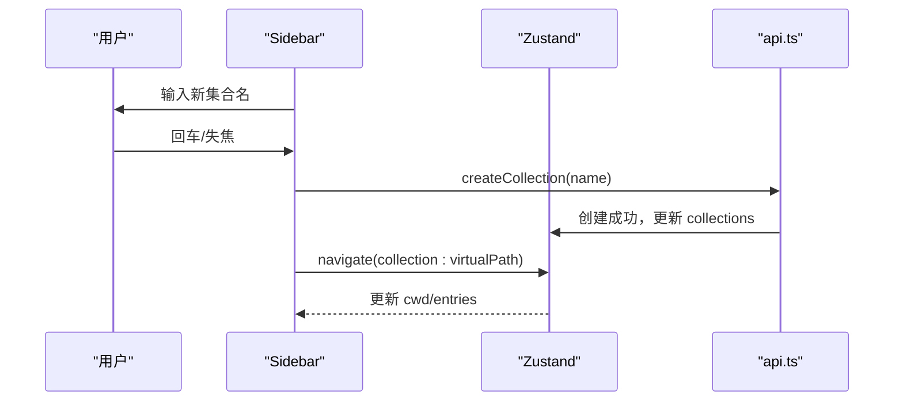
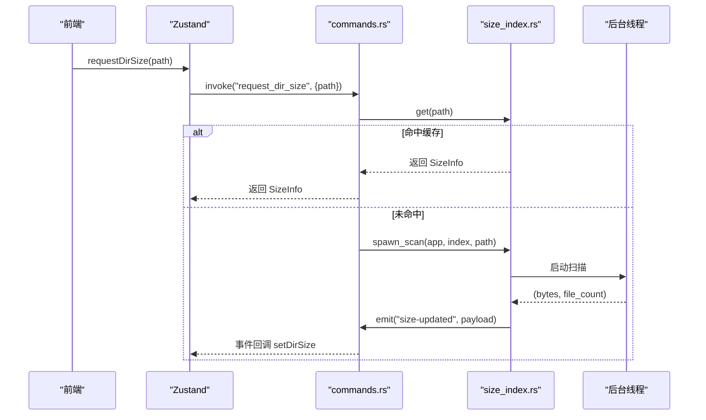
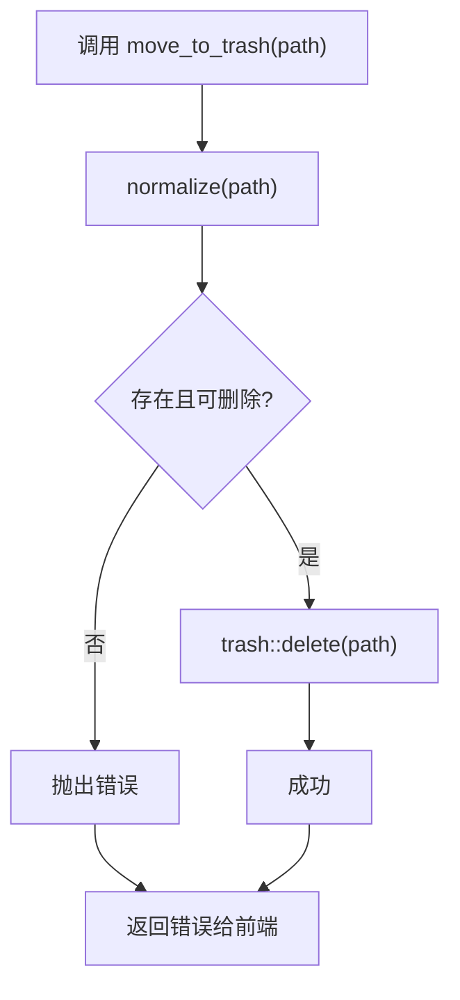
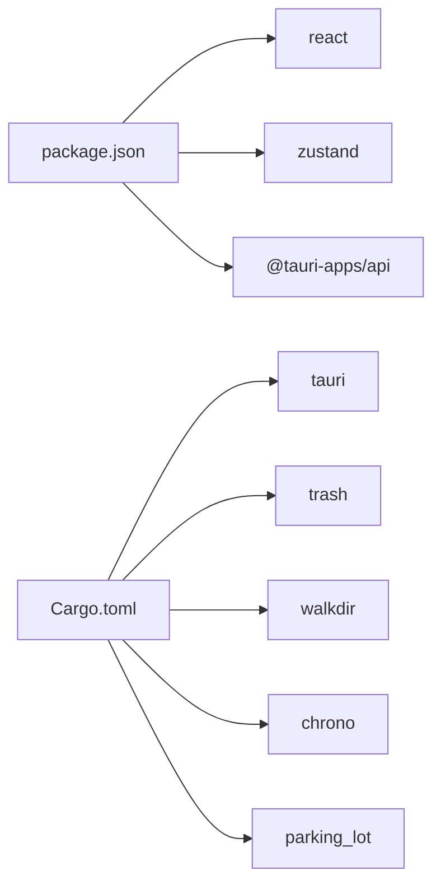

# 数据流架构

<cite>
**本文引用的文件**
- [src/main.tsx](file://src/main.tsx)
- [src/App.tsx](file://src/App.tsx)
- [src/store.ts](file://src/store.ts)
- [src/api.ts](file://src/api.ts)
- [src/types.ts](file://src/types.ts)
- [src/utils.ts](file://src/utils.ts)
- [src/components/FileList.tsx](file://src/components/FileList.tsx)
- [src/components/Sidebar.tsx](file://src/components/Sidebar.tsx)
- [src-tauri/src/lib.rs](file://src-tauri/src/lib.rs)
- [src-tauri/src/commands.rs](file://src-tauri/src/commands.rs)
- [src-tauri/src/core/size_index.rs](file://src-tauri/src/core/size_index.rs)
- [src-tauri/src/core/fs_ops.rs](file://src-tauri/src/core/fs_ops.rs)
- [package.json](file://package.json)
- [src-tauri/Cargo.toml](file://src-tauri/Cargo.toml)
</cite>

## 目录
1. [简介](#简介)
2. [项目结构](#项目结构)
3. [核心组件](#核心组件)
4. [架构总览](#架构总览)
5. [详细组件分析](#详细组件分析)
6. [依赖关系分析](#依赖关系分析)
7. [性能考量](#性能考量)
8. [故障排查指南](#故障排查指南)
9. [结论](#结论)
10. [附录](#附录)

## 简介
本文件面向 LocalBro 的数据流架构，系统性梳理从用户操作到文件系统修改的完整数据通路，覆盖前端事件驱动与状态管理、Tauri 事件系统、并发数据流（目录扫描队列与后台任务）、以及数据一致性保障（状态同步、缓存更新与错误恢复）。文档同时提供面向初学者的概念解释与面向高级开发者的性能与并发细节。

## 项目结构
LocalBro 采用前端 React + Zustand + Tauri 的分层架构：前端负责 UI 与交互、状态管理；Tauri 负责命令桥接与后端执行；核心模块在 Rust 中实现文件系统操作、集合与尺寸索引等能力。

图表来源
- [src/main.tsx:1-12](file://src/main.tsx#L1-L12)
- [src/App.tsx:106-146](file://src/App.tsx#L106-L146)
- [src/store.ts:73-263](file://src/store.ts#L73-L263)
- [src/api.ts:37-48](file://src/api.ts#L37-L48)
- [src-tauri/src/lib.rs:12-65](file://src-tauri/src/lib.rs#L12-L65)
- [src-tauri/src/commands.rs:15-123](file://src-tauri/src/commands.rs#L15-L123)
- [src-tauri/src/core/fs_ops.rs:140-170](file://src-tauri/src/core/fs_ops.rs#L140-L170)
- [src-tauri/src/core/size_index.rs:41-104](file://src-tauri/src/core/size_index.rs#L41-L104)

章节来源
- [src/main.tsx:1-12](file://src/main.tsx#L1-L12)
- [src/App.tsx:106-146](file://src/App.tsx#L106-L146)
- [src-tauri/src/lib.rs:12-65](file://src-tauri/src/lib.rs#L12-L65)

## 核心组件
- 应用入口与根组件
  - 入口挂载 React 根节点，渲染应用根组件。
  - 根组件负责初始化、注册预览适配器与皮肤、监听尺寸更新事件、启动目录大小扫描队列、绑定快捷键等。
- 状态管理（Zustand）
  - 维护当前工作目录、条目列表、历史栈、选择集、隐藏项显示、排序方式、视图模式、目录大小缓存、预览路径等。
  - 提供导航、刷新、前进后退、选择、排序、集合管理、尺寸缓存更新、预览开关等动作。
- API 封装（Tauri invoke）
  - 将前端调用映射为后端命令，统一参数与返回值格式，屏蔽前后端差异。
- 文件系统与尺寸索引（Rust）
  - 提供目录列举、统计、父路径、创建/删除/重命名、复制/移动、回收站、文本读取、尺寸索引与后台扫描、集合管理等。
- 前端组件
  - 文件列表根据排序与目录大小缓存渲染；侧边栏管理收藏、卷与集合，并支持集合的增删改与导航。

章节来源
- [src/App.tsx:106-146](file://src/App.tsx#L106-L146)
- [src/store.ts:16-71](file://src/store.ts#L16-L71)
- [src/api.ts:37-194](file://src/api.ts#L37-L194)
- [src-tauri/src/core/fs_ops.rs:140-360](file://src-tauri/src/core/fs_ops.rs#L140-L360)
- [src-tauri/src/core/size_index.rs:17-104](file://src-tauri/src/core/size_index.rs#L17-L104)
- [src/components/FileList.tsx:42-83](file://src/components/FileList.tsx#L42-L83)
- [src/components/Sidebar.tsx:20-215](file://src/components/Sidebar.tsx#L20-L215)

## 架构总览
LocalBro 的数据流遵循“前端事件 → 状态更新 → 命令调用 → 后端执行 → 事件回传 → 状态更新 → UI 渲染”的闭环。Tauri 事件系统用于后端向前端推送异步结果（如目录扫描完成），前端通过订阅事件更新状态并触发 UI 变化。

图表来源
- [src/App.tsx:114-122](file://src/App.tsx#L114-L122)
- [src/store.ts:97-136](file://src/store.ts#L97-L136)
- [src/api.ts:37-121](file://src/api.ts#L37-L121)
- [src-tauri/src/commands.rs:15-123](file://src-tauri/src/commands.rs#L15-L123)
- [src-tauri/src/core/size_index.rs:60-104](file://src-tauri/src/core/size_index.rs#L60-L104)

## 详细组件分析

### 组件一：应用根组件与事件驱动
- 初始化流程
  - 启动时加载内置预览适配器与皮肤，随后初始化状态（获取用户主目录、默认快捷方式、卷与集合）。
  - 导航至用户主目录，准备初始列表。
- 事件驱动
  - 订阅后端发出的 size-updated 事件，收到后更新目录大小缓存，触发 UI 重新计算显示。
- 并发扫描队列
  - 基于当前条目与未缓存目录，维护最多 4 个并发的请求，逐个出队并调用后端请求扫描，忽略单点错误，完成后更新缓存。

图表来源
- [src/App.tsx:28-69](file://src/App.tsx#L28-L69)
- [src/App.tsx:114-122](file://src/App.tsx#L114-L122)
- [src/store.ts:205-206](file://src/store.ts#L205-L206)

章节来源
- [src/App.tsx:106-146](file://src/App.tsx#L106-L146)
- [src/App.tsx:28-69](file://src/App.tsx#L28-L69)
- [src/store.ts:97-136](file://src/store.ts#L97-L136)

### 组件二：状态管理（Zustand）
- 状态模型
  - 关键字段：cwd、entries、loading/error、history/historyIdx、shortcuts/volumes/collections、selection、dirSizes、previewPath、showHidden/viewMode/sortKey/sortDir。
- 动作设计
  - 导航/刷新/前进后退/向上：封装 API 调用，更新列表与历史栈。
  - 选择/全选/清空：维护 Set 集合，避免重复渲染。
  - 排序：按名称/大小/修改时间/扩展名，目录优先。
  - 预览：打开/关闭预览路径。
  - 集合：增删改查、添加/移除项、刷新集合视图。
  - 目录大小：设置缓存、失效缓存、触发后台扫描。
- 数据一致性
  - 所有状态更新通过原子 set，避免竞态。
  - 前端监听 size-updated 事件，确保后端异步结果能及时反映到 UI。

图表来源
- [src/store.ts:16-71](file://src/store.ts#L16-L71)

章节来源
- [src/store.ts:73-263](file://src/store.ts#L73-L263)
- [src/types.ts:1-37](file://src/types.ts#L1-L37)

### 组件三：API 封装与命令桥接
- API 层
  - listDir/stat/parentOf/homePath/defaultShortcuts/listVolumes/createDirectory/createFile/rename/moveToTrash/deleteForever/copyPath/movePath/revealInNative/dirSizeCached/requestDirSize/invalidateDirSize/readTextFile/listCollections/createCollection/updateCollection/deleteCollection/addToCollection/removeFromCollection/listCollectionEntries/listPacks/readPackText/readPackAsset/installPackFromFolder/uninstallPack/packDir/settingsGetAll/settingsGet/settingsSet。
- 命令层
  - commands.rs 将上述 API 映射为 Tauri 命令，调用 fs_ops.rs 与 size_index.rs 实现具体功能。
- 类型转换
  - Rust 使用 snake_case，TS 使用 camelCase，API 层进行字段映射与规范化。

图表来源
- [src/api.ts:37-48](file://src/api.ts#L37-L48)
- [src-tauri/src/commands.rs:15-18](file://src-tauri/src/commands.rs#L15-L18)
- [src-tauri/src/core/fs_ops.rs:140-170](file://src-tauri/src/core/fs_ops.rs#L140-L170)

章节来源
- [src/api.ts:37-194](file://src/api.ts#L37-L194)
- [src-tauri/src/commands.rs:15-123](file://src-tauri/src/commands.rs#L15-L123)

### 组件四：文件列表与目录大小缓存
- 目录大小显示策略
  - 对于文件直接使用 size 字段；对于目录使用 dirSizes 缓存值，若无则显示占位符。
- 排序与渲染
  - 根据 sortKey/sortDir 生成排序后的列表；Details 视图支持点击列头切换排序。
- 交互行为
  - 单击切换选择（支持多选），双击进入目录或打开预览。

图表来源
- [src/components/FileList.tsx:17-22](file://src/components/FileList.tsx#L17-L22)
- [src/components/FileList.tsx:6-15](file://src/components/FileList.tsx#L6-L15)
- [src/utils.ts:1-12](file://src/utils.ts#L1-L12)

章节来源
- [src/components/FileList.tsx:42-173](file://src/components/FileList.tsx#L42-L173)
- [src/utils.ts:1-66](file://src/utils.ts#L1-L66)

### 组件五：侧边栏与集合管理
- 收藏与卷导航
  - 点击快捷方式或卷进入对应路径。
- 集合管理
  - 新建集合后立即跳转到该集合虚拟路径；重命名与删除通过后端命令更新集合信息；删除集合时若当前正在浏览该集合则回到主目录。
- 交互细节
  - 双击集合进入重命名输入框；输入框失焦或回车确认提交。

图表来源
- [src/components/Sidebar.tsx:36-51](file://src/components/Sidebar.tsx#L36-L51)
- [src/components/Sidebar.tsx:110-160](file://src/components/Sidebar.tsx#L110-L160)
- [src/store.ts:211-234](file://src/store.ts#L211-L234)

章节来源
- [src/components/Sidebar.tsx:20-215](file://src/components/Sidebar.tsx#L20-L215)
- [src/store.ts:211-234](file://src/store.ts#L211-L234)

### 组件六：尺寸索引与后台扫描
- 缓存结构
  - 以绝对路径为键的内存缓存，记录字节总数、文件计数与计算时间。
- 请求与并发
  - 若缓存命中，直接返回；否则启动后台线程扫描，期间标记 in-flight 避免重复请求。
- 事件回传
  - 扫描完成后写入缓存并通过 Tauri 事件广播 size-updated，前端监听并更新状态。

图表来源
- [src/api.ts:115-121](file://src/api.ts#L115-L121)
- [src-tauri/src/commands.rs:112-123](file://src-tauri/src/commands.rs#L112-L123)
- [src-tauri/src/core/size_index.rs:60-104](file://src-tauri/src/core/size_index.rs#L60-L104)
- [src/App.tsx:114-122](file://src/App.tsx#L114-L122)

章节来源
- [src-tauri/src/core/size_index.rs:17-104](file://src-tauri/src/core/size_index.rs#L17-L104)
- [src-tauri/src/commands.rs:104-128](file://src-tauri/src/commands.rs#L104-L128)

### 组件七：文件系统操作与错误处理
- 列举与统计
  - list_dir 支持是否显示隐藏项与跟随符号链接；stat 获取单个条目信息。
- 修改操作
  - 创建/删除/重命名/复制/移动/回收站；跨设备移动采用先拷贝再删除的降级策略。
- 文本读取
  - 限制最大读取字节数，返回内容与截断标记。
- 错误处理
  - 统一包装为 FsError，前端捕获并设置 error 状态，避免中断 UI。

图表来源
- [src-tauri/src/core/fs_ops.rs:219-222](file://src-tauri/src/core/fs_ops.rs#L219-L222)
- [src-tauri/src/commands.rs:60-63](file://src-tauri/src/commands.rs#L60-L63)

章节来源
- [src-tauri/src/core/fs_ops.rs:140-360](file://src-tauri/src/core/fs_ops.rs#L140-L360)
- [src-tauri/src/commands.rs:60-83](file://src-tauri/src/commands.rs#L60-L83)

## 依赖关系分析
- 前端依赖
  - React、Zustand、@tauri-apps/api、@tauri-apps/plugin-opener。
- 后端依赖
  - tauri、trash、dirs、chrono、parking_lot、walkdir、zip/tar/flate2 等。
- 关键耦合点
  - API.ts 与 commands.rs 的一一对应命令映射。
  - size_index.rs 作为共享缓存与事件源，被 commands.rs 与 App.tsx 监听事件双向依赖。

图表来源
- [package.json:12-26](file://package.json#L12-L26)
- [src-tauri/Cargo.toml:17-31](file://src-tauri/Cargo.toml#L17-L31)

章节来源
- [package.json:12-26](file://package.json#L12-L26)
- [src-tauri/Cargo.toml:17-31](file://src-tauri/Cargo.toml#L17-L31)

## 性能考量
- 并发扫描队列
  - 通过固定并发上限（默认 4）平衡吞吐与资源占用；利用 in-flight 避免重复扫描。
- 缓存策略
  - 目录大小缓存减少重复 IO；失效接口允许手动清理过期数据。
- UI 渲染优化
  - useMemo 仅在依赖变化时重排；目录大小按需计算，避免全量重算。
- I/O 降级
  - 跨设备移动采用 copy + delete，保证正确性；大文件读取限制最大字节数，避免阻塞。

[本节为通用性能建议，不直接分析具体文件，故无章节来源]

## 故障排查指南
- 列表为空或加载失败
  - 检查 error 状态与 API 返回；确认路径存在且具有访问权限。
- 目录大小不更新
  - 确认 size-updated 事件已监听；检查缓存是否命中；必要时调用失效接口后重试。
- 删除/移动异常
  - 检查是否存在同名目标；跨设备移动会触发降级路径；查看后端日志定位具体错误。
- 预览无法打开
  - 确认预览路径有效且非目录；检查预览适配器注册情况。

章节来源
- [src/store.ts:133-135](file://src/store.ts#L133-L135)
- [src-tauri/src/commands.rs:112-123](file://src-tauri/src/commands.rs#L112-L123)
- [src-tauri/src/core/fs_ops.rs:276-292](file://src-tauri/src/core/fs_ops.rs#L276-L292)

## 结论
LocalBro 的数据流以事件驱动为核心，前端通过 Zustand 管理状态，借助 Tauri invoke 与命令处理器连接 Rust 后端，实现文件系统操作与异步结果回传。并发扫描与缓存机制提升性能，事件驱动确保 UI 与后端状态保持一致。整体架构清晰、职责分离，适合进一步扩展插件与增量索引能力。

[本节为总结性内容，不直接分析具体文件，故无章节来源]

## 附录
- 关键数据结构与类型
  - FsEntry：文件/目录元信息（名称、路径、类型、大小、时间戳、隐藏/只读、扩展名）。
  - SizeInfo：目录大小统计（字节、文件数、计算时间）。
  - Collection：集合（id/name/color/icon/时间戳/项列表）。
- 常用命令一览
  - 列举与统计：list_dir、stat、parent_of、home_path、default_shortcuts、list_volumes。
  - 文件操作：create_directory、create_file、rename、move_to_trash、delete_forever、copy_path、move_path、reveal_in_native。
  - 文本预览：read_text_file。
  - 目录大小：dir_size_cached、request_dir_size、invalidate_dir_size。
  - 集合：list_collections、create_collection、update_collection、delete_collection、add_to_collection、remove_from_collection、list_collection_entries。
  - 插件与皮肤：list_packs、read_pack_text、read_pack_asset、install_pack_from_folder、uninstall_pack、pack_dir。
  - 设置：settings_get_all、settings_get、settings_set。

章节来源
- [src/types.ts:1-37](file://src/types.ts#L1-L37)
- [src-tauri/src/core/size_index.rs:17-31](file://src-tauri/src/core/size_index.rs#L17-L31)
- [src-tauri/src/commands.rs:15-265](file://src-tauri/src/commands.rs#L15-L265)