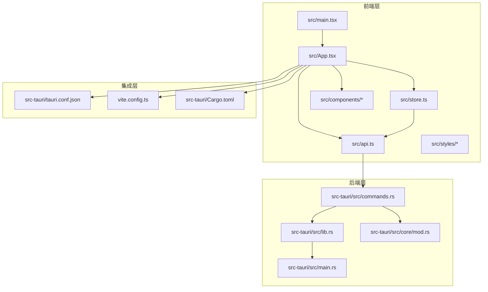
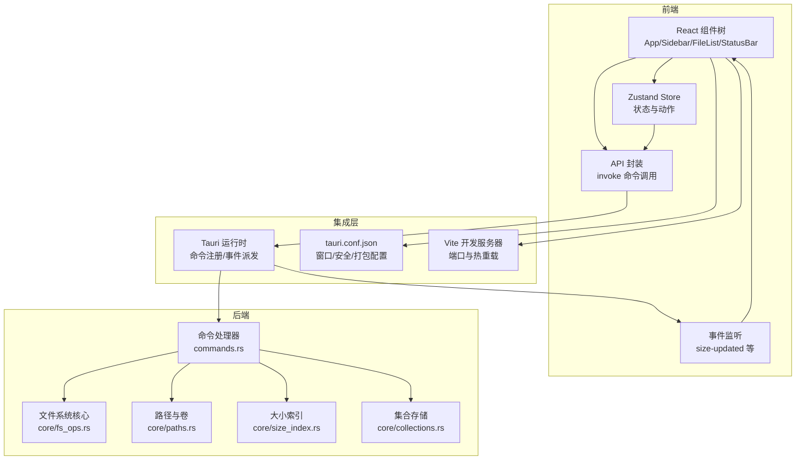
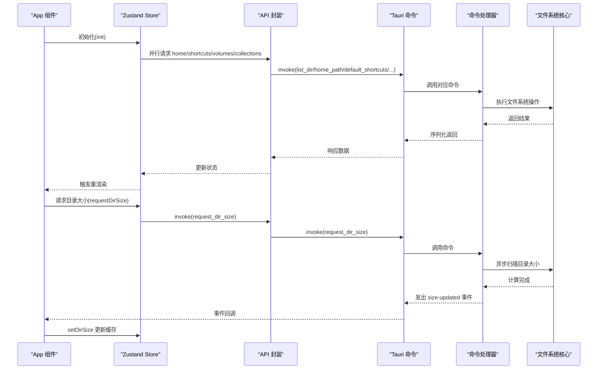
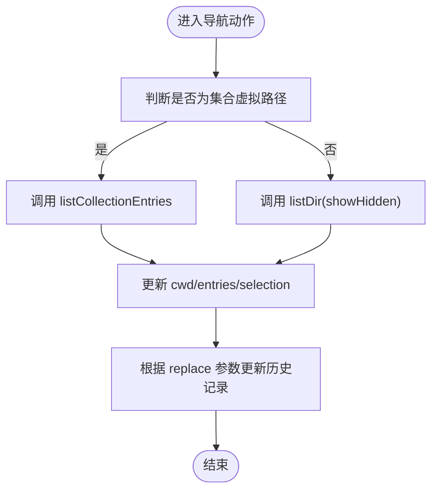
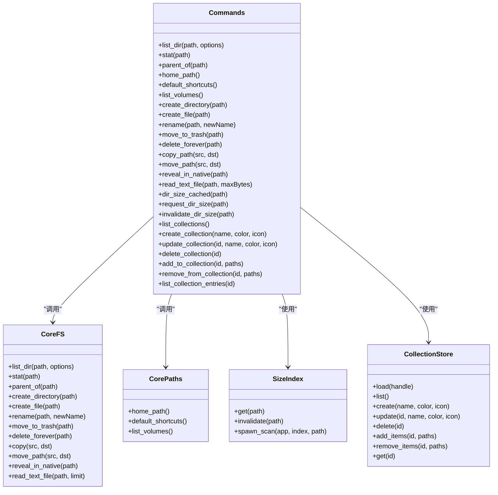
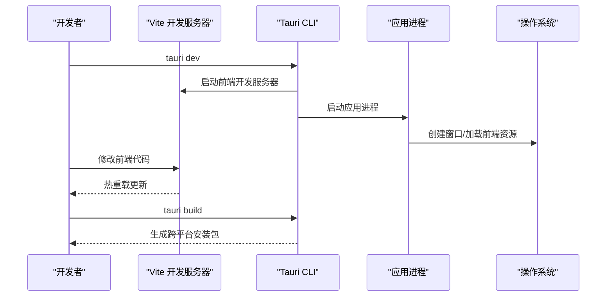
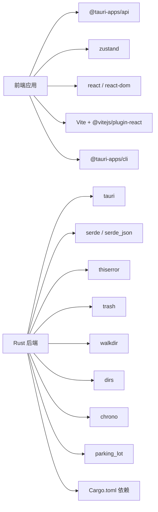

# 整体架构概览

<cite>
**本文档引用的文件**
- [README.md](file://README.md)
- [package.json](file://package.json)
- [vite.config.ts](file://vite.config.ts)
- [src/main.tsx](file://src/main.tsx)
- [src/App.tsx](file://src/App.tsx)
- [src/store.ts](file://src/store.ts)
- [src/api.ts](file://src/api.ts)
- [src/types.ts](file://src/types.ts)
- [src/styles/app.css](file://src/styles/app.css)
- [src-tauri/tauri.conf.json](file://src-tauri/tauri.conf.json)
- [src-tauri/Cargo.toml](file://src-tauri/Cargo.toml)
- [src-tauri/src/lib.rs](file://src-tauri/src/lib.rs)
- [src-tauri/src/main.rs](file://src-tauri/src/main.rs)
- [src-tauri/src/commands.rs](file://src-tauri/src/commands.rs)
- [src-tauri/src/core/mod.rs](file://src-tauri/src/core/mod.rs)
- [src/components/Sidebar.tsx](file://src/components/Sidebar.tsx)
</cite>

## 目录
1. [简介](#简介)
2. [项目结构](#项目结构)
3. [核心组件](#核心组件)
4. [架构总览](#架构总览)
5. [详细组件分析](#详细组件分析)
6. [依赖分析](#依赖分析)
7. [性能考虑](#性能考虑)
8. [故障排除指南](#故障排除指南)
9. [结论](#结论)

## 简介
本项目采用 Tauri + React + TypeScript 技术栈，构建跨平台本地文件浏览器。前端使用 React 和 Zustand 状态管理，后端使用 Rust 提供文件系统操作与系统能力，通过 Tauri 的命令通道实现前后端通信。项目遵循前后端分离与职责分离原则，前端负责用户界面与交互逻辑，后端负责系统级文件操作与数据处理，中间通过类型安全的命令调用进行解耦。

## 项目结构
项目采用“前端 React 层 + 后端 Rust 层 + 系统集成层”的三层架构：
- 前端层：React 应用，包含组件、样式、状态管理与 API 调用封装。
- 后端层：Rust 应用，通过 Tauri 命令暴露文件系统操作与集合管理等能力。
- 集成层：Tauri 配置与构建脚本，负责开发服务器、打包与跨平台构建。

**图表来源**
- [src/main.tsx:1-12](file://src/main.tsx#L1-L12)
- [src/App.tsx:1-140](file://src/App.tsx#L1-L140)
- [src/store.ts:1-308](file://src/store.ts#L1-L308)
- [src/api.ts:1-195](file://src/api.ts#L1-L195)
- [src-tauri/tauri.conf.json:1-43](file://src-tauri/tauri.conf.json#L1-L43)
- [vite.config.ts:1-33](file://vite.config.ts#L1-L33)
- [src-tauri/Cargo.toml:1-36](file://src-tauri/Cargo.toml#L1-L36)
- [src-tauri/src/lib.rs:1-53](file://src-tauri/src/lib.rs#L1-L53)
- [src-tauri/src/main.rs:1-7](file://src-tauri/src/main.rs#L1-L7)
- [src-tauri/src/commands.rs:1-198](file://src-tauri/src/commands.rs#L1-L198)
- [src-tauri/src/core/mod.rs:1-6](file://src-tauri/src/core/mod.rs#L1-L6)

**章节来源**
- [README.md:1-8](file://README.md#L1-L8)
- [package.json:1-28](file://package.json#L1-L28)
- [vite.config.ts:1-33](file://vite.config.ts#L1-L33)
- [src-tauri/tauri.conf.json:1-43](file://src-tauri/tauri.conf.json#L1-L43)
- [src-tauri/Cargo.toml:1-36](file://src-tauri/Cargo.toml#L1-L36)

## 核心组件
- 前端入口与渲染：React 根节点挂载与严格模式包裹，确保应用在开发与生产环境的一致性。
- 应用主组件：负责初始化、事件监听、目录大小扫描队列与快捷键预览控制，并组合侧边栏、工具栏、文件列表与状态栏。
- 状态管理：Zustand Store 封装浏览上下文（当前目录、条目列表、历史记录、选择集、排序与视图配置、集合与虚拟路径等），并提供导航、刷新、前进后退、选择与预览控制等动作。
- API 封装：统一的命令调用接口，将前端请求映射到后端命令，同时对 Rust 返回的 snake_case 字段进行驼峰转换。
- 类型定义：定义文件系统条目、快捷方式、视图模式与排序键值等核心类型，保证前后端契约一致。
- 样式系统：基于 CSS 变量的主题系统，支持网格/列表/详情三种视图布局与响应式设计。

**章节来源**
- [src/main.tsx:1-12](file://src/main.tsx#L1-L12)
- [src/App.tsx:1-140](file://src/App.tsx#L1-L140)
- [src/store.ts:1-308](file://src/store.ts#L1-L308)
- [src/api.ts:1-195](file://src/api.ts#L1-L195)
- [src/types.ts:1-37](file://src/types.ts#L1-L37)
- [src/styles/app.css:1-651](file://src/styles/app.css#L1-L651)

## 架构总览
本项目采用“前端组件化 + 后端命令化 + Tauri 集成”的跨平台桌面应用架构。前端通过 @tauri-apps/api 的 invoke 调用后端命令，后端通过 Tauri 的命令处理器执行文件系统操作与集合管理，并通过事件机制向前端推送状态更新。系统边界清晰：前端负责 UI 与交互，后端负责系统能力，二者通过命令/事件协议通信。

**图表来源**
- [src/App.tsx:100-139](file://src/App.tsx#L100-L139)
- [src/store.ts:73-263](file://src/store.ts#L73-L263)
- [src/api.ts:37-194](file://src/api.ts#L37-L194)
- [src-tauri/src/lib.rs:15-49](file://src-tauri/src/lib.rs#L15-L49)
- [src-tauri/src/commands.rs:13-197](file://src-tauri/src/commands.rs#L13-L197)
- [src-tauri/src/core/mod.rs:1-6](file://src-tauri/src/core/mod.rs#L1-L6)
- [src-tauri/tauri.conf.json:6-30](file://src-tauri/tauri.conf.json#L6-L30)
- [vite.config.ts:8-32](file://vite.config.ts#L8-L32)

## 详细组件分析

### 前端组件与交互流程
- 应用初始化与事件监听：应用启动时初始化状态、订阅后端事件并维护目录大小缓存；侧边栏、工具栏、文件列表与状态栏按布局区域渲染。
- 目录大小扫描队列：并发限制的队列逐批触发目录大小计算，完成后通过事件更新缓存。
- 快捷键预览：空格键打开/关闭快速预览，预览模态框根据当前选中项或列表首项打开。
- 侧边栏功能：展示收藏、集合与卷，支持新建/重命名/删除集合，点击导航至对应路径（真实路径或虚拟集合路径）。

**图表来源**
- [src/App.tsx:108-116](file://src/App.tsx#L108-L116)
- [src/App.tsx:22-63](file://src/App.tsx#L22-L63)
- [src/store.ts:97-136](file://src/store.ts#L97-L136)
- [src/api.ts:115-121](file://src/api.ts#L115-L121)
- [src-tauri/src/commands.rs:110-121](file://src-tauri/src/commands.rs#L110-L121)

**章节来源**
- [src/App.tsx:1-140](file://src/App.tsx#L1-L140)
- [src/store.ts:1-308](file://src/store.ts#L1-L308)
- [src/api.ts:1-195](file://src/api.ts#L1-L195)
- [src/components/Sidebar.tsx:1-200](file://src/components/Sidebar.tsx#L1-L200)

### 状态管理与数据流
- 状态模型：包含当前工作目录、条目列表、加载状态、错误信息、历史记录、快捷方式、卷、集合、选择集、目录大小缓存、预览路径、显示隐藏项、视图模式与排序配置等。
- 动作设计：提供初始化、导航、刷新、前进后退、向上、选择控制、显示隐藏切换、排序设置、目录大小更新、预览控制与集合管理等动作。
- 排序算法：目录优先策略与多键排序，支持名称、大小、修改时间与扩展名排序，支持升/降序切换。

**图表来源**
- [src/store.ts:112-136](file://src/store.ts#L112-L136)
- [src/store.ts:265-276](file://src/store.ts#L265-L276)
- [src/api.ts:191-194](file://src/api.ts#L191-L194)

**章节来源**
- [src/store.ts:16-71](file://src/store.ts#L16-L71)
- [src/store.ts:278-307](file://src/store.ts#L278-L307)

### 后端命令与系统集成
- 命令注册：所有命令在 lib.rs 中集中注册，统一由 Tauri Builder 管理，包含文件系统操作、文本读取、目录大小索引、集合管理等。
- 文件系统操作：提供列出目录、统计条目、父目录查询、创建/重命名/移动/删除、复制/剪切、在原生资源管理器中定位等能力。
- 目录大小索引：支持缓存查询、后台扫描与失效，扫描完成后通过事件通知前端更新。
- 集合管理：支持集合的增删改查、添加/移除条目、集合条目解析与过滤缺失路径。

**图表来源**
- [src-tauri/src/lib.rs:23-49](file://src-tauri/src/lib.rs#L23-L49)
- [src-tauri/src/commands.rs:13-197](file://src-tauri/src/commands.rs#L13-L197)
- [src-tauri/src/core/mod.rs:1-6](file://src-tauri/src/core/mod.rs#L1-L6)

**章节来源**
- [src-tauri/src/lib.rs:1-53](file://src-tauri/src/lib.rs#L1-L53)
- [src-tauri/src/commands.rs:1-198](file://src-tauri/src/commands.rs#L1-L198)
- [src-tauri/src/core/mod.rs:1-6](file://src-tauri/src/core/mod.rs#L1-L6)

### Tauri 框架与跨平台桌面应用模式
- 开发与构建：Vite 作为前端开发服务器，固定端口与热重载；Tauri 配置指定前端构建产物与开发 URL；构建阶段自动打包前端静态资源。
- 安全与协议：启用资产协议作用域，限制资源访问范围；窗口尺寸与最小尺寸约束，拖拽启用以提升用户体验。
- 插件与系统能力：内置 opener 插件用于外部程序打开，结合后端命令实现“在原生资源管理器中定位”等功能。

**图表来源**
- [vite.config.ts:8-32](file://vite.config.ts#L8-L32)
- [src-tauri/tauri.conf.json:6-11](file://src-tauri/tauri.conf.json#L6-L11)
- [package.json:6-10](file://package.json#L6-L10)

**章节来源**
- [vite.config.ts:1-33](file://vite.config.ts#L1-L33)
- [src-tauri/tauri.conf.json:1-43](file://src-tauri/tauri.conf.json#L1-L43)
- [package.json:1-28](file://package.json#L1-L28)

## 依赖分析
- 前端依赖：React 生态、@tauri-apps/api 用于命令调用、@tauri-apps/plugin-opener 提供系统打开能力、Zustand 用于轻量状态管理。
- 后端依赖：Tauri 核心、序列化库、错误处理库、跨平台文件系统访问、目录遍历与垃圾箱操作等。
- 构建与工具链：Vite + React 插件用于前端开发与构建；Tauri CLI 用于应用打包与跨平台构建。

**图表来源**
- [package.json:12-26](file://package.json#L12-L26)
- [src-tauri/Cargo.toml:17-27](file://src-tauri/Cargo.toml#L17-L27)
- [vite.config.ts:8-9](file://vite.config.ts#L8-L9)

**章节来源**
- [package.json:1-28](file://package.json#L1-L28)
- [src-tauri/Cargo.toml:1-36](file://src-tauri/Cargo.toml#L1-L36)

## 性能考虑
- 目录大小扫描并发控制：前端维护固定并发上限的扫描队列，避免大量 IO 并发导致系统卡顿；后端扫描完成后通过事件异步更新缓存。
- 状态更新粒度：Zustand 使用不可变更新策略，仅在必要字段变更时触发重渲染，减少组件重绘成本。
- 前端资源加载：Vite 固定端口与热重载优化开发体验；生产构建启用压缩与 Tree Shaking。
- 后端线程与锁：使用并发容器与互斥锁保护共享状态，避免竞态条件；扫描任务在后台线程执行，不阻塞主线程。

[本节为通用性能建议，无需特定文件引用]

## 故障排除指南
- 命令调用失败：检查命令是否在 lib.rs 中正确注册，确认参数与返回类型匹配；查看后端日志定位具体错误。
- 事件未到达：确认前端已正确监听事件并在卸载时取消监听；检查后端事件派发逻辑与作用域。
- 目录大小不更新：确认扫描任务已触发且缓存未失效；检查后端事件是否成功派发。
- 开发服务器无法连接：确认 Vite 端口占用与严格端口配置；检查 tauri.conf.json 中的 devUrl 与 beforeDevCommand。

**章节来源**
- [src-tauri/src/lib.rs:15-22](file://src-tauri/src/lib.rs#L15-L22)
- [src/App.tsx:108-116](file://src/App.tsx#L108-L116)
- [src/api.ts:37-48](file://src/api.ts#L37-L48)
- [vite.config.ts:16-26](file://vite.config.ts#L16-L26)
- [src-tauri/tauri.conf.json:6-11](file://src-tauri/tauri.conf.json#L6-L11)

## 结论
本项目通过 Tauri 实现了前端 React 与后端 Rust 的高效协作，形成清晰的三层架构：前端负责 UI 与交互，后端负责系统能力与数据处理，集成层提供跨平台运行时与构建工具链。该架构在保证开发效率的同时，兼顾了性能与可维护性，适合构建高性能、可扩展的跨平台桌面应用。