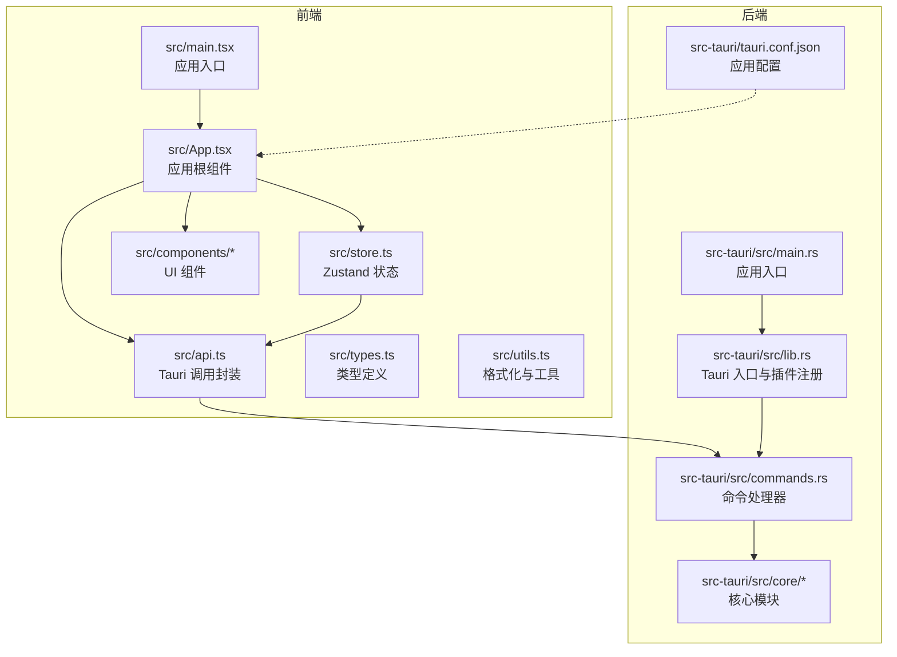
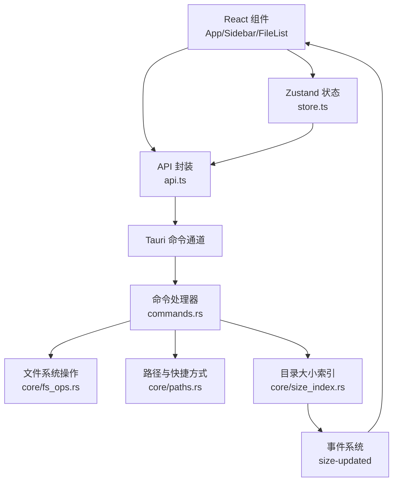
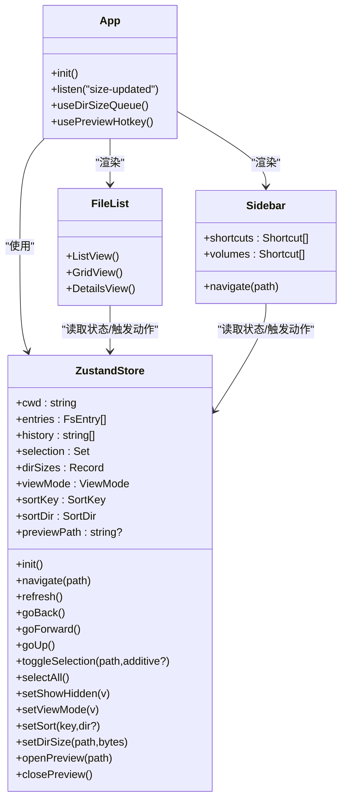
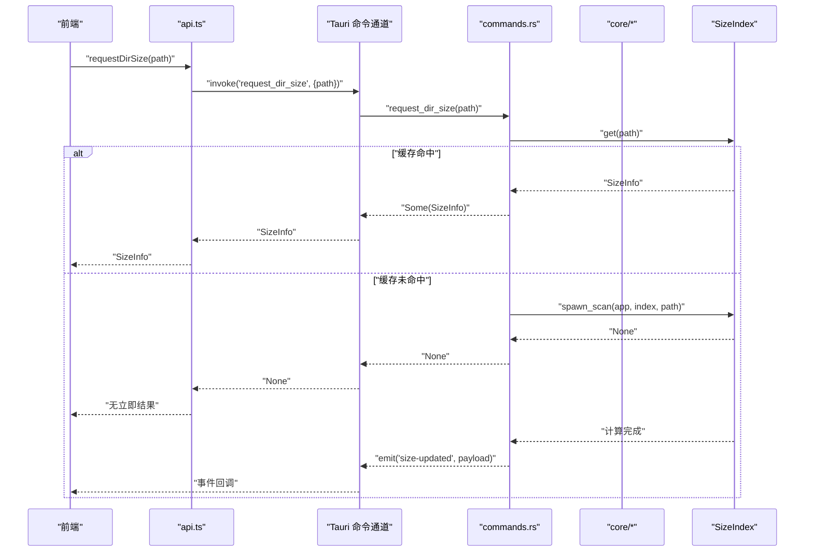
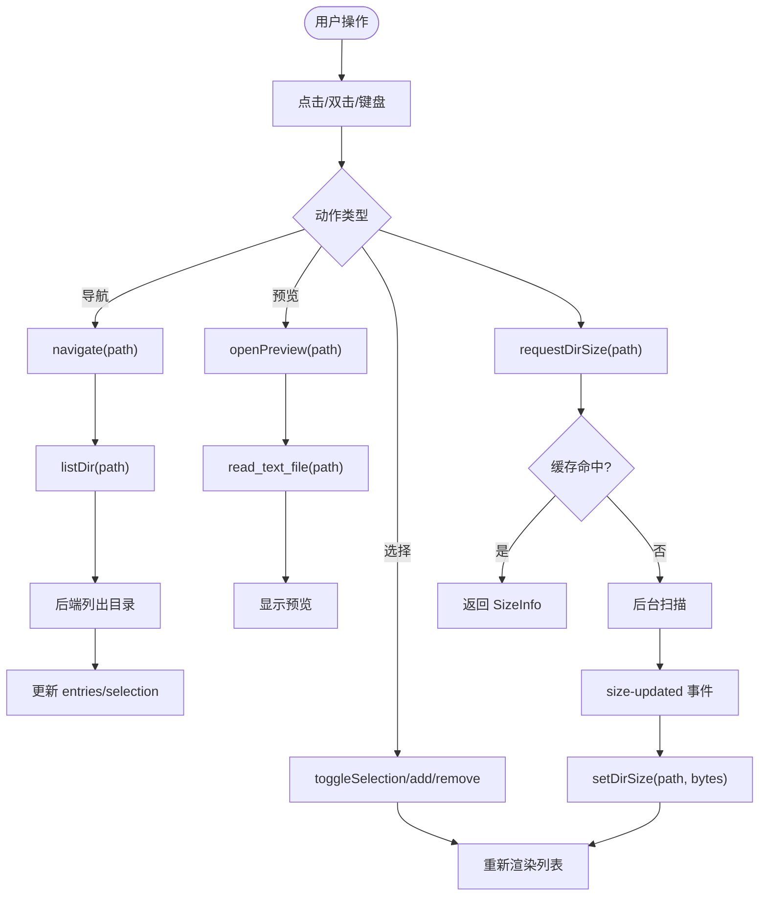
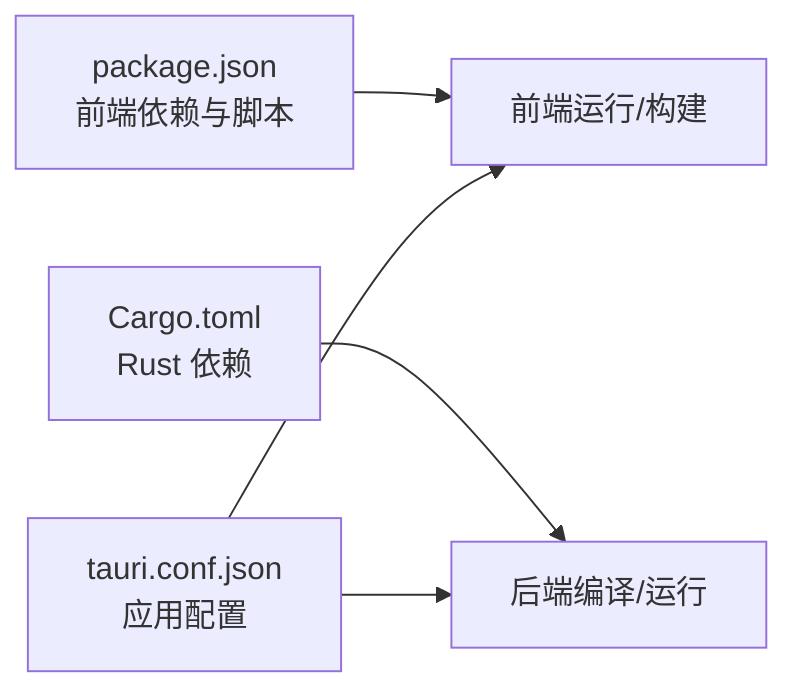

# 架构设计

<cite>
**本文引用的文件**
- [README.md](file://README.md)
- [package.json](file://package.json)
- [src-tauri/Cargo.toml](file://src-tauri/Cargo.toml)
- [src-tauri/tauri.conf.json](file://src-tauri/tauri.conf.json)
- [src/main.tsx](file://src/main.tsx)
- [src/App.tsx](file://src/App.tsx)
- [src/store.ts](file://src/store.ts)
- [src/api.ts](file://src/api.ts)
- [src/types.ts](file://src/types.ts)
- [src/utils.ts](file://src/utils.ts)
- [src/components/FileList.tsx](file://src/components/FileList.tsx)
- [src/components/Sidebar.tsx](file://src/components/Sidebar.tsx)
- [src-tauri/src/lib.rs](file://src-tauri/src/lib.rs)
- [src-tauri/src/main.rs](file://src-tauri/src/main.rs)
- [src-tauri/src/commands.rs](file://src-tauri/src/commands.rs)
- [src-tauri/src/core/mod.rs](file://src-tauri/src/core/mod.rs)
</cite>

## 目录
1. [简介](#简介)
2. [项目结构](#项目结构)
3. [核心组件](#核心组件)
4. [架构总览](#架构总览)
5. [详细组件分析](#详细组件分析)
6. [依赖分析](#依赖分析)
7. [性能考量](#性能考量)
8. [故障排查指南](#故障排查指南)
9. [结论](#结论)
10. [附录](#附录)

## 简介
本项目采用 Tauri + React + TypeScript 技术栈，构建跨平台本地文件浏览器。前端使用 React 和 Zustand 状态管理，通过 Tauri 的命令通道与原生后端通信；后端以 Rust 实现，提供文件系统操作、目录大小索引与事件通知能力。系统采用前后端分离与分层架构，结合模块化设计，支持多视图（列表/网格/详情）、排序、选择与预览等核心功能。

## 项目结构
项目采用“前端 Vite + React + Zustand”与“后端 Tauri + Rust”的双环境组织方式：
- 前端目录 src：包含入口、应用根组件、UI 组件、状态存储、类型定义、工具函数与 API 封装。
- 后端目录 src-tauri：包含 Tauri 应用入口、命令处理器、核心模块（错误处理、文件操作、路径与快捷方式、目录大小索引）以及构建配置。
- 配置文件：package.json（前端依赖与脚本）、Cargo.toml（Rust 依赖与构建）、tauri.conf.json（应用窗口、安全策略与打包配置）。

图表来源
- [src/main.tsx:1-12](file://src/main.tsx#L1-L12)
- [src/App.tsx:100-140](file://src/App.tsx#L100-L140)
- [src/store.ts:53-194](file://src/store.ts#L53-L194)
- [src/api.ts:1-137](file://src/api.ts#L1-L137)
- [src-tauri/src/lib.rs:8-37](file://src-tauri/src/lib.rs#L8-L37)
- [src-tauri/src/main.rs:4-7](file://src-tauri/src/main.rs#L4-L7)
- [src-tauri/src/commands.rs:12-126](file://src-tauri/src/commands.rs#L12-L126)
- [src-tauri/tauri.conf.json:1-43](file://src-tauri/tauri.conf.json#L1-L43)

章节来源
- [README.md:1-8](file://README.md#L1-L8)
- [package.json:1-28](file://package.json#L1-L28)
- [src-tauri/Cargo.toml:1-36](file://src-tauri/Cargo.toml#L1-L36)
- [src-tauri/tauri.conf.json:1-43](file://src-tauri/tauri.conf.json#L1-L43)

## 核心组件
- 应用入口与渲染
  - 前端入口负责挂载 React 应用，渲染根组件。
  - 根组件负责初始化应用状态、订阅后端事件、注册快捷键与并发扫描队列，并组合侧边栏、工具栏、文件列表与状态栏等子组件。
- 状态管理（Zustand）
  - 统一管理当前工作目录、条目列表、历史记录、选择集、隐藏项显示、视图模式、排序规则、目录大小缓存、预览路径等。
  - 提供导航、刷新、前进/后退、上一级、选择控制、排序设置、目录大小更新与预览开关等动作。
- API 封装
  - 通过 Tauri invoke 调用后端命令，统一参数命名（snake_case）与返回值转换（camelCase），并暴露文件系统相关方法与目录大小查询接口。
- UI 组件
  - 文件列表组件根据视图模式渲染列表/网格/详情视图，支持点击切换选择、双击打开目录或预览文件。
  - 侧边栏展示收藏与卷标，支持点击跳转。
- 后端命令与核心模块
  - 命令处理器将前端请求映射到 Rust 核心模块，执行文件系统操作、读取文本文件、目录大小索引与事件通知。
  - 核心模块包含错误处理、文件操作、路径与快捷方式、目录大小索引等。

章节来源
- [src/main.tsx:1-12](file://src/main.tsx#L1-L12)
- [src/App.tsx:100-140](file://src/App.tsx#L100-L140)
- [src/store.ts:53-194](file://src/store.ts#L53-L194)
- [src/api.ts:1-137](file://src/api.ts#L1-L137)
- [src/components/FileList.tsx:42-173](file://src/components/FileList.tsx#L42-L173)
- [src/components/Sidebar.tsx:3-75](file://src/components/Sidebar.tsx#L3-L75)
- [src-tauri/src/commands.rs:12-126](file://src-tauri/src/commands.rs#L12-L126)
- [src-tauri/src/core/mod.rs:1-5](file://src-tauri/src/core/mod.rs#L1-L5)

## 架构总览
系统采用“前端 UI + 状态管理 + API 封装”与“后端命令 + 核心模块”的分层架构。前端通过 Tauri 命令通道调用后端，后端在 Rust 中执行文件系统操作并可发出事件（如目录大小更新）。应用窗口由 Tauri 配置管理，前端开发与构建流程由 Vite 驱动。

图表来源
- [src/App.tsx:100-140](file://src/App.tsx#L100-L140)
- [src/store.ts:53-194](file://src/store.ts#L53-L194)
- [src/api.ts:1-137](file://src/api.ts#L1-L137)
- [src-tauri/src/lib.rs:12-36](file://src-tauri/src/lib.rs#L12-L36)
- [src-tauri/src/commands.rs:12-126](file://src-tauri/src/commands.rs#L12-L126)
- [src-tauri/src/core/mod.rs:1-5](file://src-tauri/src/core/mod.rs#L1-L5)

## 详细组件分析

### 前端组件架构
- 应用根组件 App
  - 初始化应用状态，监听后端“size-updated”事件以更新目录大小缓存。
  - 注册空格键预览热键，支持打开/关闭 QuickLook 风格预览。
  - 组合侧边栏、工具栏、文件列表与状态栏，并在需要时渲染预览模态框。
- 状态管理（Zustand）
  - 管理 cwd、entries、history、selection、dirSizes、viewMode、sortKey、sortDir、previewPath 等。
  - 提供 init、navigate、refresh、goBack、goForward、goUp、toggleSelection、selectAll、setShowHidden、setViewMode、setSort、setDirSize、openPreview、closePreview 等动作。
- 文件列表组件
  - 支持三种视图模式：列表、网格、详情。
  - 双击目录进入，双击文件打开预览；单击切换选择，支持 Ctrl/Cmd 多选。
  - 详情视图支持点击表头进行排序。
- 工具与工具函数
  - 格式化大小与日期、路径分段、图标映射等工具函数。

图表来源
- [src/App.tsx:100-140](file://src/App.tsx#L100-L140)
- [src/store.ts:53-194](file://src/store.ts#L53-L194)
- [src/components/FileList.tsx:42-173](file://src/components/FileList.tsx#L42-L173)
- [src/components/Sidebar.tsx:3-75](file://src/components/Sidebar.tsx#L3-L75)

章节来源
- [src/App.tsx:100-140](file://src/App.tsx#L100-L140)
- [src/store.ts:53-194](file://src/store.ts#L53-L194)
- [src/components/FileList.tsx:42-173](file://src/components/FileList.tsx#L42-L173)
- [src/components/Sidebar.tsx:3-75](file://src/components/Sidebar.tsx#L3-L75)
- [src/utils.ts:1-66](file://src/utils.ts#L1-L66)

### 后端服务架构
- 应用入口与插件
  - Tauri Builder 注册命令处理器、插件（如 opener），并注入共享资源（如目录大小索引）。
- 命令处理器
  - 将前端请求映射到 Rust 核心模块，执行文件系统操作、读取文本文件、目录大小查询与失效。
  - 对于目录大小请求，若缓存命中则直接返回，否则启动后台扫描并通过事件通知前端。
- 核心模块
  - 错误处理：统一返回结果类型，便于前端处理。
  - 文件操作：列出目录、统计、父目录、创建/删除/重命名、复制/移动、回收站与原生定位。
  - 路径与快捷方式：获取用户主目录、默认快捷方式、磁盘卷标。
  - 目录大小索引：维护目录大小缓存，支持并发扫描与失效。

图表来源
- [src/api.ts:115-121](file://src/api.ts#L115-L121)
- [src-tauri/src/commands.rs:101-125](file://src-tauri/src/commands.rs#L101-L125)
- [src-tauri/src/lib.rs:12-36](file://src-tauri/src/lib.rs#L12-L36)
- [src/App.tsx:110-116](file://src/App.tsx#L110-L116)

章节来源
- [src-tauri/src/lib.rs:8-37](file://src-tauri/src/lib.rs#L8-L37)
- [src-tauri/src/main.rs:4-7](file://src-tauri/src/main.rs#L4-L7)
- [src-tauri/src/commands.rs:12-126](file://src-tauri/src/commands.rs#L12-L126)
- [src-tauri/src/core/mod.rs:1-5](file://src-tauri/src/core/mod.rs#L1-L5)

### 数据流架构
从前端用户操作到文件系统修改的完整流程如下：
- 用户在文件列表中双击目录或文件，触发导航或预览动作。
- 点击选择或全选，更新选择集合。
- 切换视图模式或排序规则，影响渲染列表。
- 请求目录大小时，前端发起请求；若缓存未命中，后端启动后台扫描并在完成后通过事件推送更新。
- 文件系统操作（创建、删除、重命名、复制/移动、回收站）通过命令通道调用后端实现。

图表来源
- [src/App.tsx:100-140](file://src/App.tsx#L100-L140)
- [src/store.ts:53-194](file://src/store.ts#L53-L194)
- [src/api.ts:37-48](file://src/api.ts#L37-L48)
- [src-tauri/src/commands.rs:101-125](file://src-tauri/src/commands.rs#L101-L125)

章节来源
- [src/App.tsx:100-140](file://src/App.tsx#L100-L140)
- [src/store.ts:53-194](file://src/store.ts#L53-L194)
- [src/api.ts:1-137](file://src/api.ts#L1-L137)

### 设计模式应用
- MVC 模式变体
  - 视图层：React 组件（App、Sidebar、FileList 等）。
  - 控制器：Zustand 动作与事件监听（如“size-updated”）。
  - 模型层：状态存储与后端命令/核心模块。
- 状态管理模式
  - 使用 Zustand 管理全局状态与派发动作，避免深层 props 传递。
- 事件驱动架构
  - 前端监听后端事件（目录大小更新），实现松耦合的数据回传。
- 并发与限流
  - 目录大小扫描采用并发队列限制同时进行的任务数量，提升吞吐并避免阻塞。

章节来源
- [src/store.ts:53-194](file://src/store.ts#L53-L194)
- [src/App.tsx:22-63](file://src/App.tsx#L22-L63)
- [src-tauri/src/commands.rs:101-125](file://src-tauri/src/commands.rs#L101-L125)

## 依赖分析
- 前端依赖
  - React、React DOM、@tauri-apps/api、@tauri-apps/plugin-opener、zustand。
- 后端依赖
  - Tauri、序列化、错误处理、垃圾箱、目录与时间、并发锁、遍历库等。
- 构建与运行
  - Vite 开发服务器与构建，Tauri CLI 打包，前端开发 URL 与构建输出路径在配置中声明。

图表来源
- [package.json:1-28](file://package.json#L1-L28)
- [src-tauri/Cargo.toml:17-28](file://src-tauri/Cargo.toml#L17-L28)
- [src-tauri/tauri.conf.json:6-11](file://src-tauri/tauri.conf.json#L6-L11)

章节来源
- [package.json:1-28](file://package.json#L1-L28)
- [src-tauri/Cargo.toml:1-36](file://src-tauri/Cargo.toml#L1-L36)
- [src-tauri/tauri.conf.json:1-43](file://src-tauri/tauri.conf.json#L1-L43)

## 性能考量
- 目录大小扫描并发控制
  - 通过并发队列限制同时扫描的目录数量，避免 CPU 与 I/O 抖动。
- 缓存与懒加载
  - 目录大小索引缓存命中优先返回，减少重复计算；仅在需要时发起扫描。
- 渲染优化
  - 使用 useMemo 对排序后的列表进行稳定化，避免不必要的重渲染。
- 事件驱动更新
  - 通过事件异步推送扫描结果，避免阻塞主线程。
- I/O 与网络
  - 文本文件读取带上限，防止大文件导致内存压力；路径与图标映射采用常量时间计算。

章节来源
- [src/App.tsx:22-63](file://src/App.tsx#L22-L63)
- [src/components/FileList.tsx:17-22](file://src/components/FileList.tsx#L17-L22)
- [src-tauri/src/commands.rs:101-125](file://src-tauri/src/commands.rs#L101-L125)

## 故障排查指南
- 无法加载目录内容
  - 检查前端 listDir 调用是否成功，确认后端命令处理器对路径与权限的处理。
- 目录大小不更新
  - 确认“size-updated”事件是否被监听，检查缓存是否被正确失效与重建。
- 预览失败
  - 检查 read_text_file 的最大字节数限制与文件编码，确认后端命令返回的 payload 字段。
- 回收站/删除异常
  - 确认后端 trash 依赖与平台兼容性，检查权限与路径有效性。
- 打包与运行问题
  - 检查 tauri.conf.json 中的开发 URL、前端构建输出与安全策略配置。

章节来源
- [src/api.ts:37-48](file://src/api.ts#L37-L48)
- [src-tauri/src/commands.rs:101-125](file://src-tauri/src/commands.rs#L101-L125)
- [src-tauri/tauri.conf.json:6-29](file://src-tauri/tauri.conf.json#L6-L29)

## 结论
本项目通过 Tauri 将 React 前端与 Rust 后端有机结合，形成清晰的分层与模块化架构。前端以 Zustand 管理状态与 UI，后端以命令处理器对接核心模块，实现文件系统操作与目录大小索引的高效处理。事件驱动机制与并发控制提升了用户体验与系统性能。该架构既适合初学者理解前后端分离与状态管理，也为高级开发者提供了扩展点与优化空间。

## 附录
- 类型定义
  - 文件条目、快捷方式、视图模式、排序键与方向等类型在前端统一定义，确保前后端契约一致。
- 开发与构建
  - 前端开发脚本与后端 Tauri 命令在 package.json 中声明；构建产物与前端分发目录在 tauri.conf.json 中配置。

章节来源
- [src/types.ts:1-37](file://src/types.ts#L1-L37)
- [package.json:6-11](file://package.json#L6-L11)
- [src-tauri/tauri.conf.json:6-11](file://src-tauri/tauri.conf.json#L6-L11)