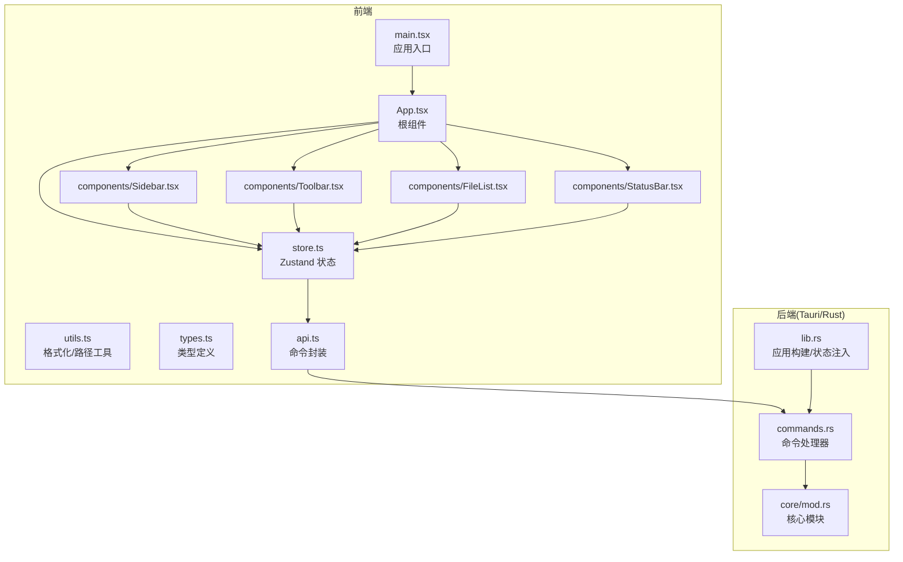
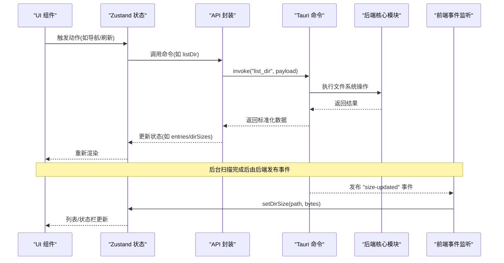
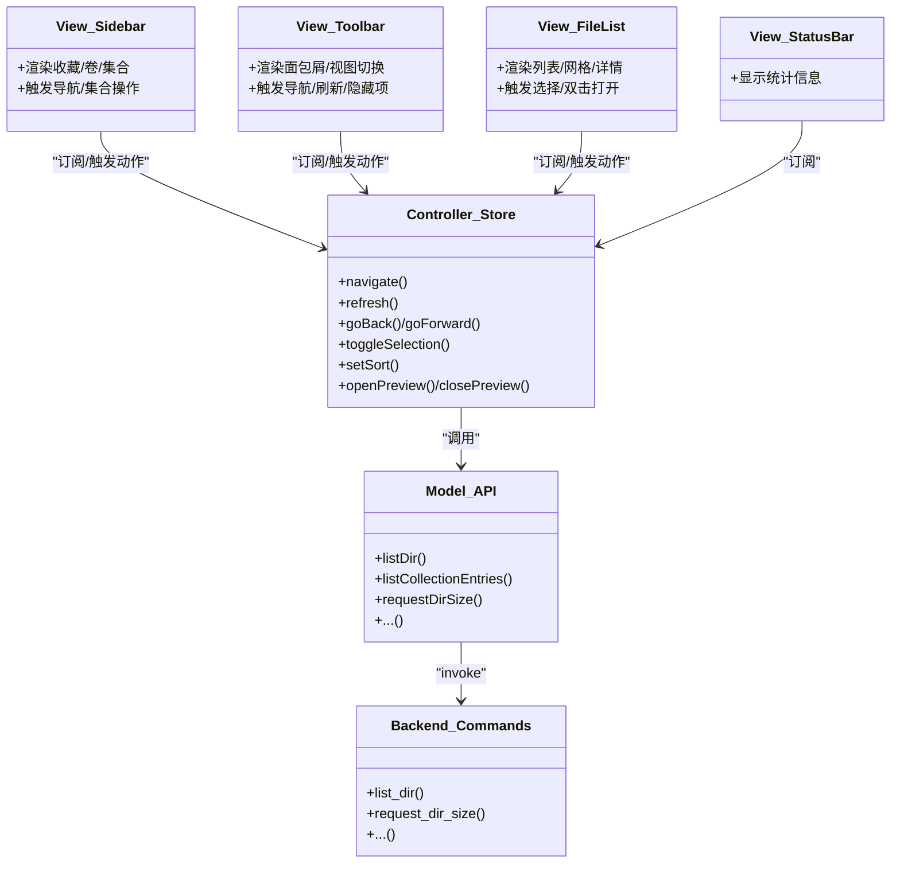
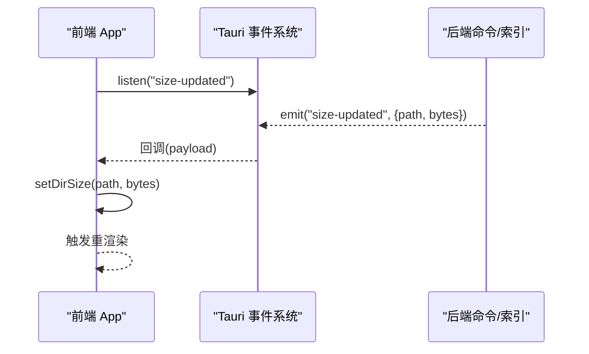
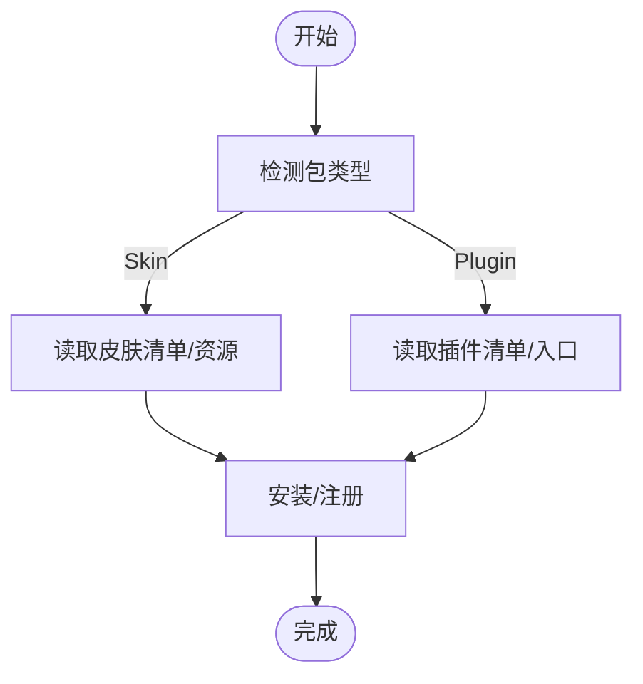
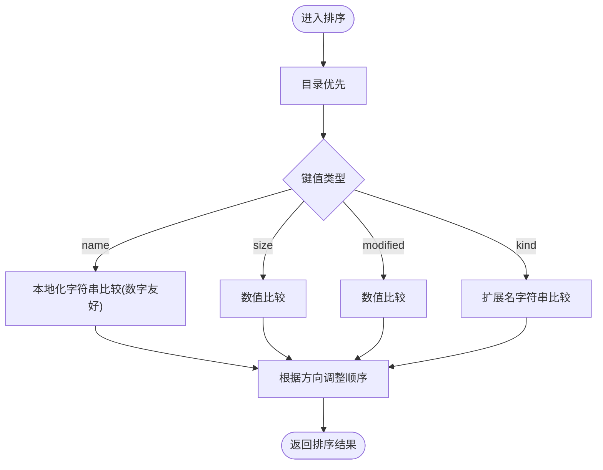
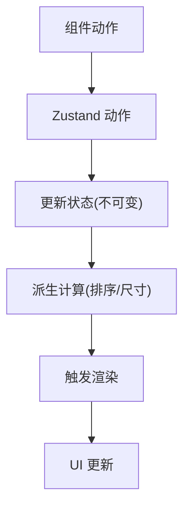
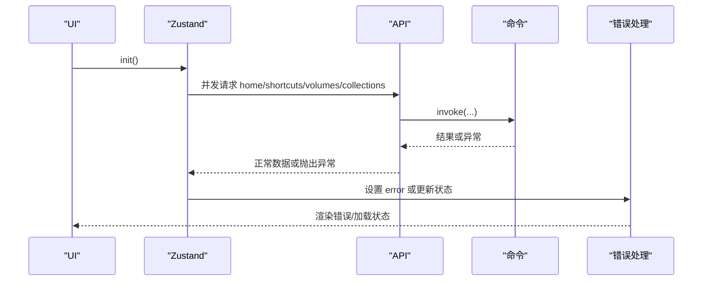
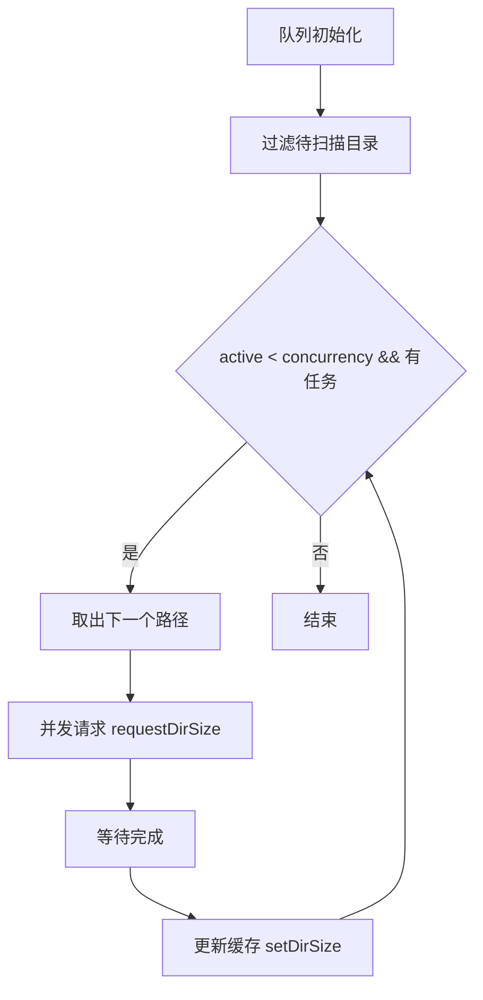

# 设计模式应用

<cite>
**本文引用的文件**
- [src/App.tsx](file://src/App.tsx)
- [src/store.ts](file://src/store.ts)
- [src/api.ts](file://src/api.ts)
- [src/main.tsx](file://src/main.tsx)
- [src/types.ts](file://src/types.ts)
- [src/utils.ts](file://src/utils.ts)
- [src/components/FileList.tsx](file://src/components/FileList.tsx)
- [src/components/Sidebar.tsx](file://src/components/Sidebar.tsx)
- [src/components/StatusBar.tsx](file://src/components/StatusBar.tsx)
- [src/components/Toolbar.tsx](file://src/components/Toolbar.tsx)
- [src-tauri/src/lib.rs](file://src-tauri/src/lib.rs)
- [src-tauri/src/main.rs](file://src-tauri/src/main.rs)
- [src-tauri/src/commands.rs](file://src-tauri/src/commands.rs)
- [src-tauri/src/core/mod.rs](file://src-tauri/src/core/mod.rs)
- [src-tauri/Cargo.toml](file://src-tauri/Cargo.toml)
</cite>

## 目录
1. [简介](#简介)
2. [项目结构](#项目结构)
3. [核心组件](#核心组件)
4. [架构总览](#架构总览)
5. [详细组件分析](#详细组件分析)
6. [依赖关系分析](#依赖关系分析)
7. [性能考量](#性能考量)
8. [故障排查指南](#故障排查指南)
9. [结论](#结论)
10. [附录](#附录)

## 简介
本文件系统性梳理 LocalBro 项目中的设计模式与架构实践，重点覆盖以下方面：
- MVC 模式变体：视图层（React 组件）、控制器（Zustand 行为）、模型（API 调用与后端命令）之间的职责划分与协作。
- 观察者模式：前端通过事件监听器订阅后端目录大小扫描完成事件，实现松耦合的状态更新。
- 工厂模式：插件与皮肤包的安装与读取流程体现“按类型创建/解析”的工厂式抽象。
- 策略模式：文件列表排序策略通过可配置键值与方向实现不同排序策略的切换。
- 状态管理模式：单向数据流、状态提升与组件解耦策略，结合 Zustand 的原子化状态与派生计算。
- 事件驱动架构：Tauri 命令到前端事件的发布订阅链路，异步处理与错误传播机制。
- 并发设计模式：生产者-消费者队列、工作池与资源池管理，用于目录大小扫描的并发控制。

## 项目结构
LocalBro 采用前端 React + Zustand + Tauri 的分层架构：
- 前端层：入口渲染、页面组件、状态管理、工具函数与类型定义。
- 后端层（Rust/Tauri）：命令处理器、核心模块（文件系统、集合、设置、索引等），通过状态共享与事件发布连接前后端。

图表来源
- [src/main.tsx:1-12](file://src/main.tsx#L1-L12)
- [src/App.tsx:106-146](file://src/App.tsx#L106-L146)
- [src/store.ts:73-263](file://src/store.ts#L73-L263)
- [src/api.ts:1-280](file://src/api.ts#L1-L280)
- [src-tauri/src/lib.rs:12-69](file://src-tauri/src/lib.rs#L12-L69)
- [src-tauri/src/commands.rs:16-291](file://src-tauri/src/commands.rs#L16-L291)
- [src-tauri/src/core/mod.rs:1-9](file://src-tauri/src/core/mod.rs#L1-L9)

章节来源
- [src/main.tsx:1-12](file://src/main.tsx#L1-L12)
- [src/App.tsx:106-146](file://src/App.tsx#L106-L146)
- [src-tauri/src/lib.rs:12-69](file://src-tauri/src/lib.rs#L12-L69)

## 核心组件
- 应用入口与根组件：负责初始化、事件监听、并发扫描队列与快捷键绑定，并组合侧边栏、工具栏、文件列表与状态栏。
- 状态管理（Zustand）：集中管理当前目录、条目列表、历史导航、选择集、排序参数、预览状态、目录大小缓存等；提供导航、刷新、前进后退、集合操作等动作。
- API 封装：对 Tauri invoke 进行统一封装，屏蔽后端字段命名差异，提供目录、集合、文本预览、打包等接口。
- 组件层：Sidebar/Toolbar/FileList/StatusBar 通过 hooks 订阅状态，执行导航、选择、排序、集合操作等行为。
- 后端命令：提供文件系统操作、集合管理、打包读取、设置读写、目录大小索引等命令；支持后台扫描并通过事件通知前端。

章节来源
- [src/App.tsx:106-146](file://src/App.tsx#L106-L146)
- [src/store.ts:16-71](file://src/store.ts#L16-L71)
- [src/api.ts:37-194](file://src/api.ts#L37-L194)
- [src/components/Sidebar.tsx:20-215](file://src/components/Sidebar.tsx#L20-L215)
- [src/components/Toolbar.tsx:6-216](file://src/components/Toolbar.tsx#L6-L216)
- [src/components/FileList.tsx:42-173](file://src/components/FileList.tsx#L42-L173)
- [src/components/StatusBar.tsx:4-38](file://src/components/StatusBar.tsx#L4-L38)
- [src-tauri/src/commands.rs:16-291](file://src-tauri/src/commands.rs#L16-L291)

## 架构总览
LocalBro 的整体交互遵循“前端单向数据流 + 后端命令驱动 + 事件驱动更新”的模式：
- 前端通过 Zustand 管理状态，组件仅订阅所需片段。
- 用户操作触发状态动作，动作通过 API 封装调用后端命令。
- 后端命令执行完成后，可能通过事件发布（如目录大小扫描完成）通知前端更新。
- 对于高代价操作（如目录大小扫描），前端使用并发受限队列进行批量处理，避免阻塞 UI。

图表来源
- [src/App.tsx:114-122](file://src/App.tsx#L114-L122)
- [src/store.ts:97-136](file://src/store.ts#L97-L136)
- [src/api.ts:37-48](file://src/api.ts#L37-L48)
- [src-tauri/src/commands.rs:16-24](file://src-tauri/src/commands.rs#L16-L24)
- [src-tauri/src/lib.rs:16-66](file://src-tauri/src/lib.rs#L16-L66)

## 详细组件分析

### MVC 模式变体与状态提升
- 视图层：Sidebar、Toolbar、FileList、StatusBar 等组件只负责渲染与用户交互，不直接管理状态。
- 控制器层：Zustand 的状态动作（navigate、refresh、goBack、goForward、toggleSelection、setSort、openPreview 等）承担业务逻辑与状态变更。
- 模型层：API 封装与后端命令提供数据访问与跨平台能力，统一返回前端可用的数据结构。

图表来源
- [src/components/Sidebar.tsx:20-215](file://src/components/Sidebar.tsx#L20-L215)
- [src/components/Toolbar.tsx:6-216](file://src/components/Toolbar.tsx#L6-L216)
- [src/components/FileList.tsx:42-173](file://src/components/FileList.tsx#L42-L173)
- [src/components/StatusBar.tsx:4-38](file://src/components/StatusBar.tsx#L4-L38)
- [src/store.ts:73-263](file://src/store.ts#L73-L263)
- [src/api.ts:37-194](file://src/api.ts#L37-L194)
- [src-tauri/src/commands.rs:16-291](file://src-tauri/src/commands.rs#L16-L291)

章节来源
- [src/store.ts:73-263](file://src/store.ts#L73-L263)
- [src/components/FileList.tsx:17-22](file://src/components/FileList.tsx#L17-L22)
- [src/components/Toolbar.tsx:6-216](file://src/components/Toolbar.tsx#L6-L216)
- [src/components/Sidebar.tsx:20-215](file://src/components/Sidebar.tsx#L20-L215)
- [src/components/StatusBar.tsx:4-38](file://src/components/StatusBar.tsx#L4-L38)

### 观察者模式：事件发布与订阅
- 前端通过事件监听器订阅后端发布的“size-updated”事件，当目录大小扫描完成时，后端通过 Tauri 发布事件，前端更新对应目录的大小缓存。
- 该模式实现了 UI 与后台扫描任务的解耦，避免轮询带来的性能开销。

图表来源
- [src/App.tsx:114-122](file://src/App.tsx#L114-L122)
- [src-tauri/src/commands.rs:113-124](file://src-tauri/src/commands.rs#L113-L124)

章节来源
- [src/App.tsx:114-122](file://src/App.tsx#L114-L122)
- [src-tauri/src/commands.rs:113-124](file://src-tauri/src/commands.rs#L113-L124)

### 工厂模式：插件与皮肤包管理
- 插件与皮肤包的清单与安装流程体现了“按类型创建/解析”的工厂式抽象：根据包类型（skin/plugin）决定读取与安装策略，统一对外暴露安装/卸载/读取接口。
- 前端通过 API 封装调用后端命令，实现包的安装、读取与卸载。

图表来源
- [src/api.ts:243-265](file://src/api.ts#L243-L265)
- [src-tauri/src/commands.rs:204-245](file://src-tauri/src/commands.rs#L204-L245)

章节来源
- [src/api.ts:243-265](file://src/api.ts#L243-L265)
- [src-tauri/src/commands.rs:204-245](file://src-tauri/src/commands.rs#L204-L245)

### 策略模式：文件排序策略
- 排序策略通过可配置的键值（名称、大小、修改时间、扩展名）与方向（升序/降序）实现，支持在不同列点击切换排序方向。
- 排序函数内部以“目录优先”的规则作为稳定策略，其余键值比较通过数值或本地化字符串比较实现。

图表来源
- [src/store.ts:278-307](file://src/store.ts#L278-L307)
- [src/components/FileList.tsx:117-118](file://src/components/FileList.tsx#L117-L118)

章节来源
- [src/store.ts:278-307](file://src/store.ts#L278-L307)
- [src/components/FileList.tsx:117-118](file://src/components/FileList.tsx#L117-L118)

### 状态管理模式：单向数据流、状态提升与组件解耦
- 单向数据流：状态变更仅通过动作发起，UI 仅从状态派生渲染，避免双向绑定导致的复杂耦合。
- 状态提升：导航、历史、选择、排序等状态集中在 Zustand，各组件通过 hooks 订阅所需片段，减少 props drilling。
- 组件解耦：组件通过动作触发状态变更，不直接依赖其他组件；工具函数（格式化、路径处理）独立于 UI，便于复用。

图表来源
- [src/store.ts:73-263](file://src/store.ts#L73-L263)
- [src/components/FileList.tsx:17-22](file://src/components/FileList.tsx#L17-L22)
- [src/utils.ts:1-66](file://src/utils.ts#L1-L66)

章节来源
- [src/store.ts:73-263](file://src/store.ts#L73-L263)
- [src/components/FileList.tsx:17-22](file://src/components/FileList.tsx#L17-L22)
- [src/utils.ts:1-66](file://src/utils.ts#L1-L66)

### 事件驱动架构：发布订阅、异步处理与错误传播
- 发布订阅：前端监听后端事件，后端在后台扫描完成后发布事件，实现 UI 与后台任务的解耦。
- 异步处理：API 封装统一返回 Promise，动作内部使用 Promise.all 并发加载初始数据，提高首屏速度。
- 错误传播：动作捕获异常并设置 error 字段，组件在渲染阶段检查 error 并提示用户；API 层对部分可选功能（如卷列表）进行容错处理。

图表来源
- [src/store.ts:97-110](file://src/store.ts#L97-L110)
- [src/api.ts:99-101](file://src/api.ts#L99-L101)
- [src-tauri/src/commands.rs:16-24](file://src-tauri/src/commands.rs#L16-L24)

章节来源
- [src/store.ts:97-110](file://src/store.ts#L97-L110)
- [src/api.ts:99-101](file://src/api.ts#L99-L101)
- [src-tauri/src/commands.rs:16-24](file://src-tauri/src/commands.rs#L16-L24)

### 并发设计模式：生产者-消费者与工作池
- 生产者-消费者：前端维护一个目录大小扫描队列，后台命令负责消费（扫描），完成后发布事件。
- 工作池：通过并发限制（固定并发数）控制同时进行的扫描任务数量，避免资源争用。
- 资源池：后端维护目录大小索引（缓存），命中则直接返回，未命中则启动后台扫描线程。

图表来源
- [src/App.tsx:28-69](file://src/App.tsx#L28-L69)
- [src-tauri/src/commands.rs:113-124](file://src-tauri/src/commands.rs#L113-L124)

章节来源
- [src/App.tsx:28-69](file://src/App.tsx#L28-L69)
- [src-tauri/src/commands.rs:113-124](file://src-tauri/src/commands.rs#L113-L124)

## 依赖关系分析
- 前端依赖：React、Zustand、@tauri-apps/api；组件间通过 hooks 解耦，状态集中管理。
- 后端依赖：Tauri、serde、parking_lot、walkdir、zip/tar 等；通过状态注入与命令导出与前端通信。
- 关键耦合点：API 封装与命令处理器之间形成稳定的契约；事件发布与前端监听形成弱耦合。

图表来源
- [src-tauri/Cargo.toml:17-31](file://src-tauri/Cargo.toml#L17-L31)
- [src-tauri/src/lib.rs:16-66](file://src-tauri/src/lib.rs#L16-L66)
- [src-tauri/src/commands.rs:16-291](file://src-tauri/src/commands.rs#L16-L291)

章节来源
- [src-tauri/Cargo.toml:17-31](file://src-tauri/Cargo.toml#L17-L31)
- [src-tauri/src/lib.rs:16-66](file://src-tauri/src/lib.rs#L16-L66)
- [src-tauri/src/commands.rs:16-291](file://src-tauri/src/commands.rs#L16-L291)

## 性能考量
- 并发限制：目录大小扫描使用固定并发上限，避免 CPU/IO 抖动；可根据系统资源动态调整。
- 缓存命中：后端索引优先返回缓存结果，减少重复扫描；前端基于路径键值更新缓存，保证一致性。
- 首屏优化：初始化阶段并行加载多源数据，缩短白屏时间；失败项进行容错处理，不影响整体体验。
- 渲染优化：排序与尺寸派生计算通过 useMemo 缓存，避免重复计算；列表渲染使用稳定 key，减少重排。

## 故障排查指南
- 初始化失败：检查 home/shortcuts/volumes/collections 请求是否全部成功；若某项失败，状态会记录错误信息，组件可在渲染阶段提示。
- 导航异常：确认 navigate 动作传入路径有效且非集合虚拟路径；集合路径需通过专用命令解析。
- 预览无法打开：确认预览路径存在且为文件；快捷键仅在焦点元素非输入框时生效。
- 目录大小未更新：确认后台扫描已触发且事件被正确监听；检查 setDirSize 是否被调用。

章节来源
- [src/store.ts:97-110](file://src/store.ts#L97-L110)
- [src/App.tsx:114-122](file://src/App.tsx#L114-L122)
- [src/components/FileList.tsx:48-54](file://src/components/FileList.tsx#L48-L54)

## 结论
LocalBro 在前端采用 React + Zustand 实现清晰的单向数据流与组件解耦，在后端通过 Tauri 命令与事件系统实现跨平台能力与异步处理。项目中自然体现了观察者模式（事件）、工厂模式（包管理）、策略模式（排序）、以及生产者-消费者与工作池的并发设计。这些设计共同确保了应用在复杂文件系统场景下的可用性与性能。

## 附录
- 类型定义：FsEntry、Shortcut、ViewMode、SortKey/SortDir 等类型贯穿前后端，保证数据结构一致。
- 工具函数：格式化、日期、路径分割与图标映射等工具函数独立于 UI，便于测试与复用。

章节来源
- [src/types.ts:1-37](file://src/types.ts#L1-L37)
- [src/utils.ts:1-66](file://src/utils.ts#L1-L66)