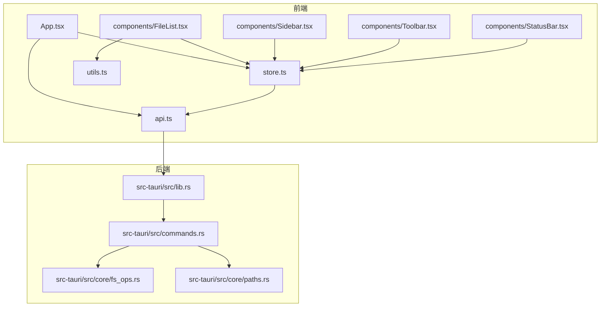
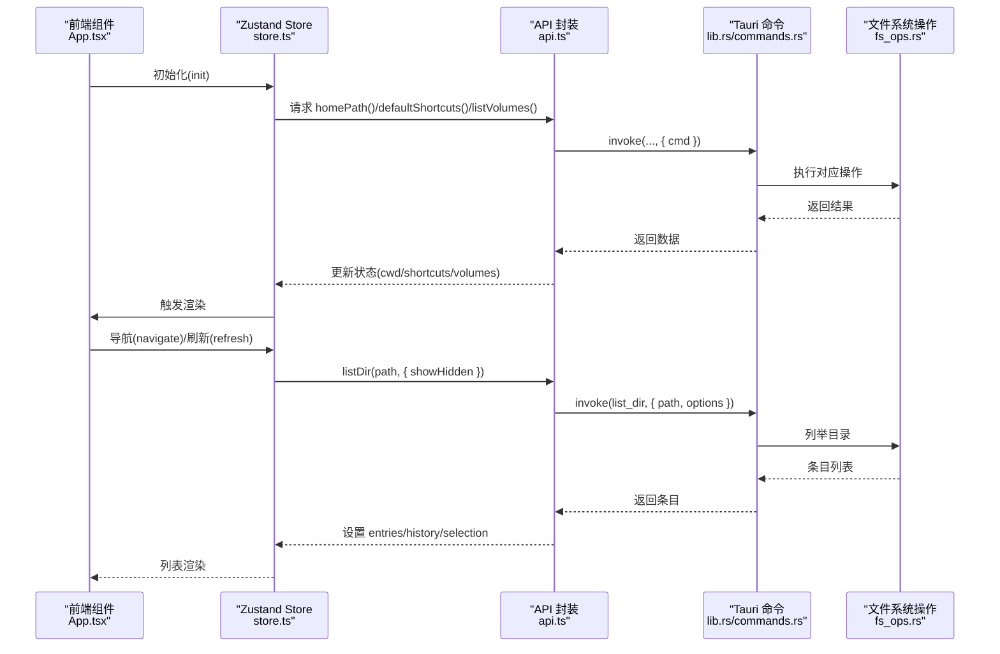
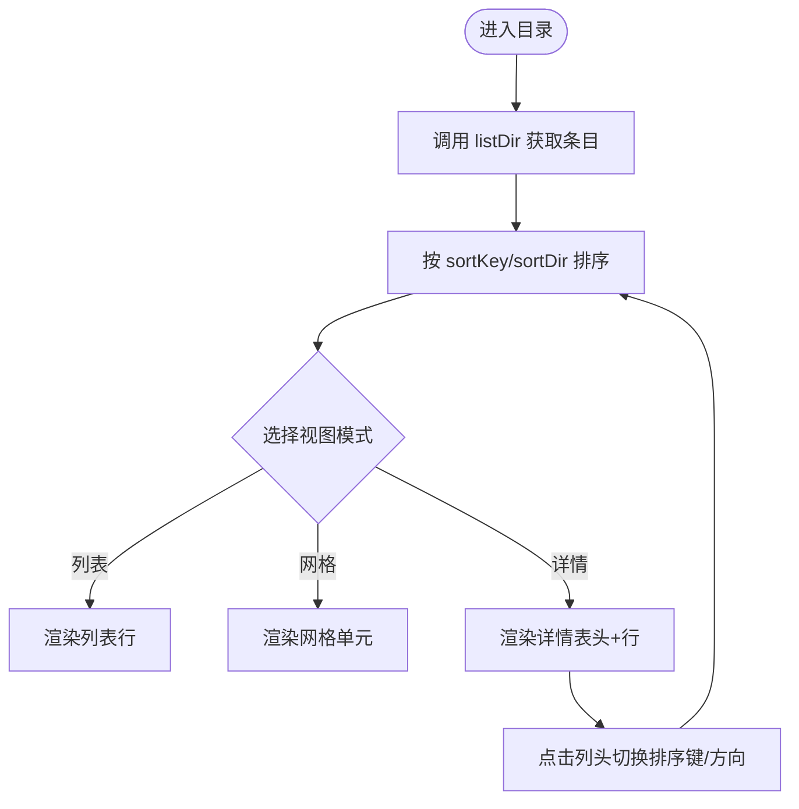
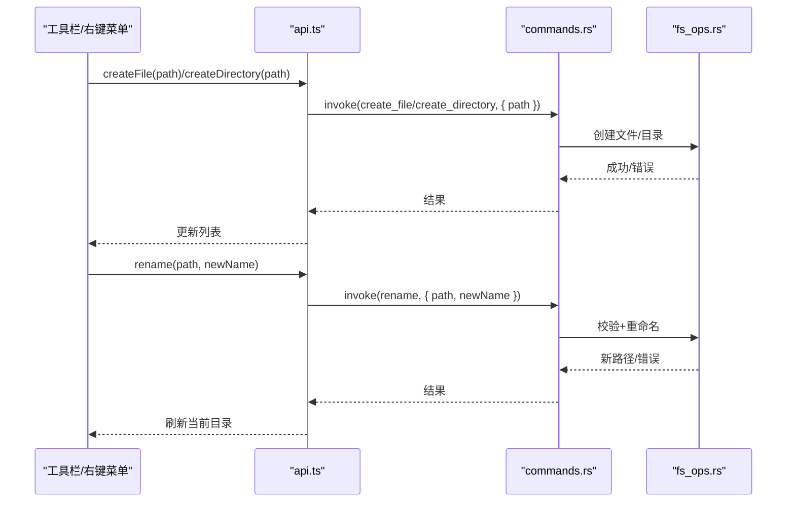
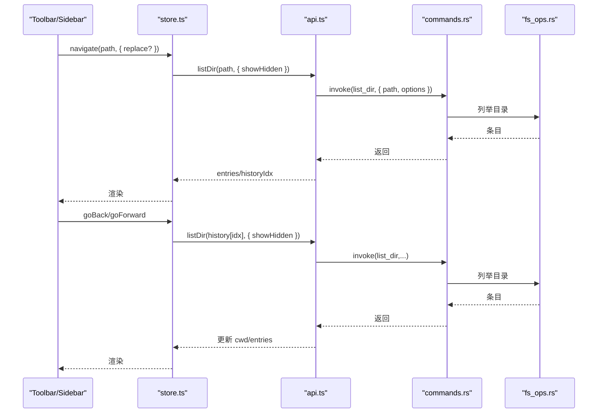
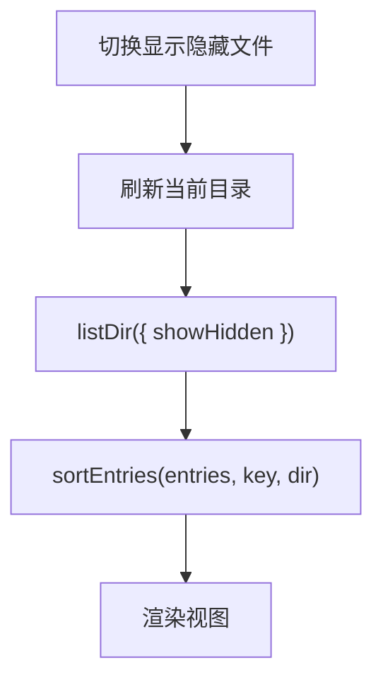
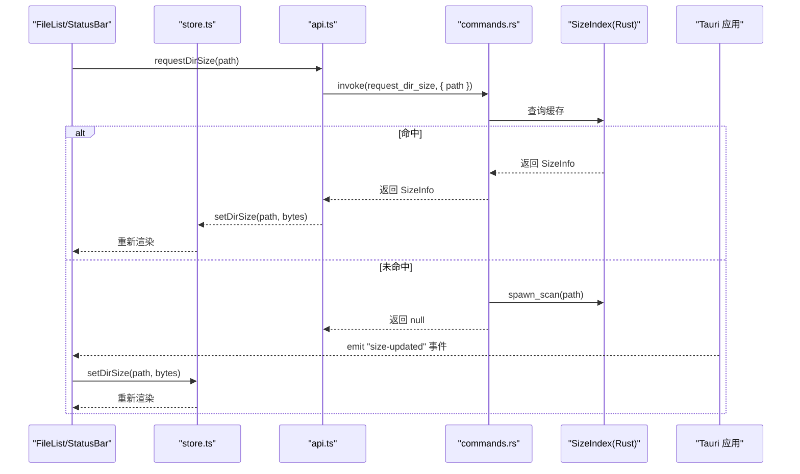
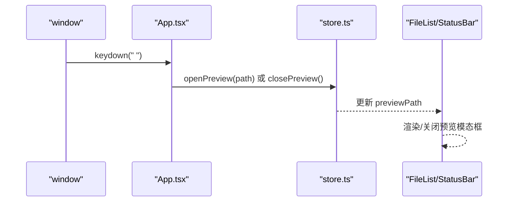
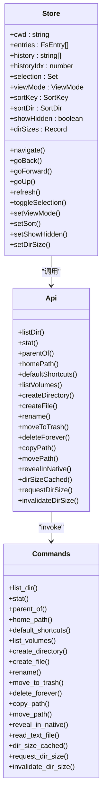

# 核心功能

<cite>
**本文引用的文件**
- [README.md](file://README.md)
- [src/App.tsx](file://src/App.tsx)
- [src/store.ts](file://src/store.ts)
- [src/types.ts](file://src/types.ts)
- [src/api.ts](file://src/api.ts)
- [src/components/FileList.tsx](file://src/components/FileList.tsx)
- [src/components/Sidebar.tsx](file://src/components/Sidebar.tsx)
- [src/components/Toolbar.tsx](file://src/components/Toolbar.tsx)
- [src/components/StatusBar.tsx](file://src/components/StatusBar.tsx)
- [src/utils.ts](file://src/utils.ts)
- [src-tauri/src/lib.rs](file://src-tauri/src/lib.rs)
- [src-tauri/src/commands.rs](file://src-tauri/src/commands.rs)
- [src-tauri/src/core/fs_ops.rs](file://src-tauri/src/core/fs_ops.rs)
- [src-tauri/src/core/paths.rs](file://src-tauri/src/core/paths.rs)
</cite>

## 目录
1. [简介](#简介)
2. [项目结构](#项目结构)
3. [核心组件](#核心组件)
4. [架构总览](#架构总览)
5. [详细组件分析](#详细组件分析)
6. [依赖关系分析](#依赖关系分析)
7. [性能考量](#性能考量)
8. [故障排查指南](#故障排查指南)
9. [结论](#结论)
10. [附录](#附录)

## 简介
本文件面向开发者与高级用户，系统化梳理 LocalBro 的核心功能与实现：文件浏览（目录列表、多视图模式、实时更新）、文件操作（创建、删除、重命名、复制、移动）、导航与历史管理（目录导航、历史记录、快捷方式）、隐藏文件控制、文件排序与过滤，以及可扩展的 API 调用模式与最佳实践。

## 项目结构
LocalBro 采用前端 React + Zustand 状态管理 + Tauri 后端的分层架构：
- 前端层：React 组件负责 UI 渲染、事件处理与状态消费；Zustand 提供全局状态；API 层封装 Tauri invoke 调用。
- 后端层：Tauri 插件注册命令处理器，Rust 模块实现文件系统操作、路径解析、大小索引与集合管理。

图表来源
- [src/App.tsx:100-139](file://src/App.tsx#L100-L139)
- [src/store.ts:53-194](file://src/store.ts#L53-L194)
- [src/api.ts:37-136](file://src/api.ts#L37-L136)
- [src-tauri/src/lib.rs:12-52](file://src-tauri/src/lib.rs#L12-L52)
- [src-tauri/src/commands.rs:13-198](file://src-tauri/src/commands.rs#L13-L198)
- [src-tauri/src/core/fs_ops.rs:140-360](file://src-tauri/src/core/fs_ops.rs#L140-L360)
- [src-tauri/src/core/paths.rs:42-127](file://src-tauri/src/core/paths.rs#L42-L127)

章节来源
- [README.md:1-8](file://README.md#L1-L8)
- [src/App.tsx:100-139](file://src/App.tsx#L100-L139)
- [src/store.ts:53-194](file://src/store.ts#L53-L194)
- [src/api.ts:37-136](file://src/api.ts#L37-L136)
- [src-tauri/src/lib.rs:12-52](file://src-tauri/src/lib.rs#L12-L52)
- [src-tauri/src/commands.rs:13-198](file://src-tauri/src/commands.rs#L13-L198)
- [src-tauri/src/core/fs_ops.rs:140-360](file://src-tauri/src/core/fs_ops.rs#L140-L360)
- [src-tauri/src/core/paths.rs:42-127](file://src-tauri/src/core/paths.rs#L42-L127)

## 核心组件
- 全局状态与导航：Zustand store 管理当前工作目录、条目列表、历史栈、选择集、视图模式、排序键与方向、隐藏文件开关、目录大小缓存、预览路径等，并提供导航、前进/后退、向上、刷新、选择等动作。
- 文件列表渲染：根据视图模式渲染列表/网格/详细信息三类视图，支持点击切换选择、双击进入或预览；详情视图支持列头点击排序。
- 工具栏与面包屑：提供返回/前进/上一级/刷新、地址编辑、显示隐藏项、视图切换与路径导航。
- 侧边栏快捷方式：展示常用目录与卷，点击即导航。
- 状态栏：统计目录/文件数量、总大小、选中项统计与待计算目录数。
- API 封装：统一调用 Tauri 命令，进行目录列举、属性查询、父目录、家目录、默认快捷方式、卷枚举、创建/删除/重命名、复制/移动、回收站、原生定位、文本读取、目录大小查询与失效等。
- 后端命令：将前端请求映射到 Rust 实现，含文件系统操作、路径解析、大小索引与集合管理。

章节来源
- [src/store.ts:53-194](file://src/store.ts#L53-L194)
- [src/components/FileList.tsx:42-173](file://src/components/FileList.tsx#L42-L173)
- [src/components/Toolbar.tsx:6-112](file://src/components/Toolbar.tsx#L6-L112)
- [src/components/Sidebar.tsx:3-74](file://src/components/Sidebar.tsx#L3-L74)
- [src/components/StatusBar.tsx:4-37](file://src/components/StatusBar.tsx#L4-L37)
- [src/api.ts:37-136](file://src/api.ts#L37-L136)
- [src-tauri/src/commands.rs:13-198](file://src-tauri/src/commands.rs#L13-L198)

## 架构总览
前端通过 @tauri-apps/api 的 invoke 与后端建立通信，后端命令在 Tauri Builder 中注册，Rust 核心模块实现具体逻辑。应用启动时初始化 store，加载家目录与默认快捷方式，随后监听来自后端的目录大小更新事件以驱动 UI 实时刷新。

图表来源
- [src/App.tsx:100-116](file://src/App.tsx#L100-L116)
- [src/store.ts:76-118](file://src/store.ts#L76-L118)
- [src/api.ts:37-48](file://src/api.ts#L37-L48)
- [src-tauri/src/lib.rs:15-49](file://src-tauri/src/lib.rs#L15-L49)
- [src-tauri/src/commands.rs:13-26](file://src-tauri/src/commands.rs#L13-L26)
- [src-tauri/src/core/fs_ops.rs:140-170](file://src-tauri/src/core/fs_ops.rs#L140-L170)

## 详细组件分析

### 文件浏览与多视图渲染
- 目录列表显示：store 在导航时拉取目录内容，FileList 根据排序键与方向生成有序列表；详情视图提供列头点击排序指示器。
- 多视图模式：列表/网格/详细信息三种渲染方式，分别展示名称、图标、大小、修改时间等字段；网格模式以卡片形式呈现。
- 实时更新机制：前端维护目录大小缓存，后台扫描通过命令触发，完成后通过事件推送，store 更新缓存并触发重渲染。

图表来源
- [src/store.ts:196-225](file://src/store.ts#L196-L225)
- [src/components/FileList.tsx:17-83](file://src/components/FileList.tsx#L17-L83)
- [src/components/FileList.tsx:109-150](file://src/components/FileList.tsx#L109-L150)
- [src/components/FileList.tsx:152-173](file://src/components/FileList.tsx#L152-L173)

章节来源
- [src/store.ts:196-225](file://src/store.ts#L196-L225)
- [src/components/FileList.tsx:17-83](file://src/components/FileList.tsx#L17-L83)
- [src/components/FileList.tsx:109-150](file://src/components/FileList.tsx#L109-L150)
- [src/components/FileList.tsx:152-173](file://src/components/FileList.tsx#L152-L173)

### 文件操作实现
- 创建：创建空文件或空目录，若目标已存在则报错。
- 删除：软删除至回收站；永久删除会直接移除。
- 重命名：校验父目录与新名唯一性，跨设备移动失败时回退为复制+删除。
- 复制/移动：目录递归复制；跨设备移动自动降级为复制+删除；目标存在时拒绝。
- 预览：Space 键打开快速预览，支持前后导航；文本文件可读取指定字节上限。

图表来源
- [src/api.ts:71-89](file://src/api.ts#L71-L89)
- [src-tauri/src/commands.rs:43-76](file://src-tauri/src/commands.rs#L43-L76)
- [src-tauri/src/core/fs_ops.rs:189-235](file://src-tauri/src/core/fs_ops.rs#L189-L235)
- [src-tauri/src/core/fs_ops.rs:258-292](file://src-tauri/src/core/fs_ops.rs#L258-L292)

章节来源
- [src/api.ts:71-89](file://src/api.ts#L71-L89)
- [src-tauri/src/commands.rs:43-76](file://src-tauri/src/commands.rs#L43-L76)
- [src-tauri/src/core/fs_ops.rs:189-235](file://src-tauri/src/core/fs_ops.rs#L189-L235)
- [src-tauri/src/core/fs_ops.rs:258-292](file://src-tauri/src/core/fs_ops.rs#L258-L292)

### 导航与历史管理
- 历史栈：每次导航在历史栈中追加，替换模式不改变前进历史；后退/前进基于索引读取历史路径并重新列出目录。
- 地址栏：支持双击编辑路径，输入回车或失焦提交；面包屑逐段可点跳转。
- 上一级：调用父目录接口，避免根目录越界。
- 快捷方式：左侧展示常用目录与卷，点击即导航。

图表来源
- [src/store.ts:90-145](file://src/store.ts#L90-L145)
- [src/components/Toolbar.tsx:37-42](file://src/components/Toolbar.tsx#L37-L42)
- [src-tauri/src/commands.rs:13-26](file://src-tauri/src/commands.rs#L13-L26)
- [src-tauri/src/core/fs_ops.rs:140-170](file://src-tauri/src/core/fs_ops.rs#L140-L170)

章节来源
- [src/store.ts:90-145](file://src/store.ts#L90-L145)
- [src/components/Toolbar.tsx:37-42](file://src/components/Toolbar.tsx#L37-L42)
- [src-tauri/src/commands.rs:13-26](file://src-tauri/src/commands.rs#L13-L26)
- [src-tauri/src/core/fs_ops.rs:140-170](file://src-tauri/src/core/fs_ops.rs#L140-L170)

### 隐藏文件控制、排序与过滤
- 隐藏文件：通过 showHidden 控制；切换时立即刷新当前目录。
- 排序：支持按名称、大小、修改时间、类型排序；目录始终排在前面；同键下支持升/降序切换。
- 过滤：当前实现未提供显式过滤器，但可通过外部 UI 扩展实现。

图表来源
- [src/store.ts:171-181](file://src/store.ts#L171-L181)
- [src/store.ts:183-187](file://src/store.ts#L183-L187)
- [src/store.ts:196-225](file://src/store.ts#L196-L225)

章节来源
- [src/store.ts:171-181](file://src/store.ts#L171-L181)
- [src/store.ts:183-187](file://src/store.ts#L183-L187)
- [src/store.ts:196-225](file://src/store.ts#L196-L225)

### 目录大小索引与实时更新
- 缓存与扫描：首次请求某目录大小时，若缓存命中则直接返回；否则后台线程扫描，完成后通过事件推送更新。
- 并发队列：前端维护并发限制的扫描队列，避免同时对大量目录发起扫描。
- UI 反馈：状态栏显示待计算目录数，预览时可显示目录大小。

图表来源
- [src/App.tsx:22-63](file://src/App.tsx#L22-L63)
- [src/App.tsx:110-116](file://src/App.tsx#L110-L116)
- [src/api.ts:115-121](file://src/api.ts#L115-L121)
- [src-tauri/src/commands.rs:110-126](file://src-tauri/src/commands.rs#L110-L126)

章节来源
- [src/App.tsx:22-63](file://src/App.tsx#L22-L63)
- [src/App.tsx:110-116](file://src/App.tsx#L110-L116)
- [src/api.ts:115-121](file://src/api.ts#L115-L121)
- [src-tauri/src/commands.rs:110-126](file://src-tauri/src/commands.rs#L110-L126)

### 预览与快捷键
- 快捷键：空格键打开/关闭快速预览；预览模态框支持前后导航。
- 预览适配器：应用启动时安装内置预览适配器，后续可扩展插件适配器。

图表来源
- [src/App.tsx:66-98](file://src/App.tsx#L66-L98)
- [src/store.ts:192-193](file://src/store.ts#L192-L193)

章节来源
- [src/App.tsx:66-98](file://src/App.tsx#L66-L98)
- [src/store.ts:192-193](file://src/store.ts#L192-L193)

## 依赖关系分析
- 组件耦合：FileList 依赖 store 的 entries、selection、sortKey、sortDir、dirSizes；Toolbar/Sidebar/StatusBar 分别依赖 store 的导航、历史、视图、隐藏文件、大小缓存等状态。
- API 与命令：api.ts 的每个函数映射到 commands.rs 的一个命令，命令再委托给 core 模块的具体实现。
- 类型一致性：前端 types.ts 定义 FsEntry、Shortcut、ViewMode、SortKey、SortDir；后端 core/paths.rs 与 core/fs_ops.rs 对应序列化结构。

图表来源
- [src/store.ts:53-194](file://src/store.ts#L53-L194)
- [src/api.ts:37-136](file://src/api.ts#L37-L136)
- [src-tauri/src/commands.rs:13-198](file://src-tauri/src/commands.rs#L13-L198)

章节来源
- [src/store.ts:53-194](file://src/store.ts#L53-L194)
- [src/api.ts:37-136](file://src/api.ts#L37-L136)
- [src-tauri/src/commands.rs:13-198](file://src-tauri/src/commands.rs#L13-L198)

## 性能考量
- 目录大小扫描并发：前端使用固定并发上限的队列，避免过度 IO 抖动；后端命中缓存时直接返回，减少重复计算。
- 列表渲染优化：排序在组件内 useMemo 包裹，仅在依赖变化时重建数组；网格/列表/详情视图按需渲染。
- 隐藏文件过滤：在后端列举阶段即过滤，避免前端二次处理。
- 文本预览限流：默认读取上限 1MiB，防止大文件阻塞 UI。

## 故障排查指南
- 目录不可读：列举目录时跳过不可读条目，若无任何条目将显示空状态；检查权限与路径有效性。
- 回收站不可用：软删除依赖系统回收站，若平台不支持或被禁用，可能失败；可改用永久删除。
- 跨设备移动：当 rename 不可行时自动降级为复制+删除，注意磁盘空间与时间成本。
- 预览空白：确认文件可读且有对应预览适配器；检查事件监听是否正常接收 size-updated。

章节来源
- [src-tauri/src/core/fs_ops.rs:140-170](file://src-tauri/src/core/fs_ops.rs#L140-L170)
- [src-tauri/src/core/fs_ops.rs:220-235](file://src-tauri/src/core/fs_ops.rs#L220-L235)
- [src-tauri/src/core/fs_ops.rs:276-292](file://src-tauri/src/core/fs_ops.rs#L276-L292)
- [src/App.tsx:110-116](file://src/App.tsx#L110-L116)

## 结论
LocalBro 通过清晰的前后端分层与完善的命令体系，提供了稳定高效的文件浏览体验。其多视图、实时大小索引、历史导航与快捷方式等特性，既满足日常使用，也为进一步扩展（如过滤器、集合管理、插件化预览）奠定了良好基础。

## 附录
- 使用示例与 API 调用模式
  - 初始化并进入家目录：调用 homePath 与 defaultShortcuts，随后 navigate 到 home。
  - 切换视图与排序：setViewMode 与 setSort；详情视图点击列头可切换排序。
  - 显示隐藏文件：setShowHidden(true/false)，立即刷新当前目录。
  - 目录大小：dirSizeCached/requestDirSize/invalidateDirSize；结合事件监听实现实时更新。
  - 文件操作：createFile/createDirectory/rename/copyPath/movePath/deleteForever/moveToTrash。
  - 原生定位：revealInNative 定位到系统文件管理器。
- 扩展建议
  - 过滤器：在 store 中增加 filter 字段并在 listDir 前置过滤。
  - 集合管理：利用现有集合命令扩展收藏与标签功能。
  - 预览插件：在应用启动时注册插件适配器，覆盖内置适配器。

章节来源
- [src/store.ts:76-118](file://src/store.ts#L76-L118)
- [src/store.ts:182-187](file://src/store.ts#L182-L187)
- [src/api.ts:111-121](file://src/api.ts#L111-L121)
- [src/api.ts:71-89](file://src/api.ts#L71-L89)
- [src/api.ts:99-101](file://src/api.ts#L99-L101)
- [src-tauri/src/commands.rs:130-197](file://src-tauri/src/commands.rs#L130-L197)