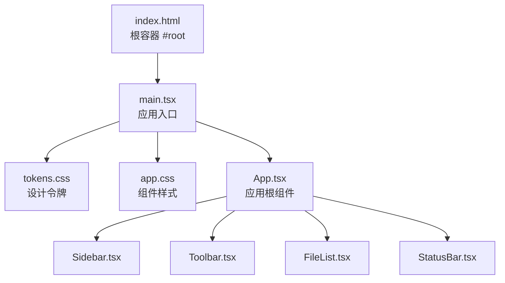
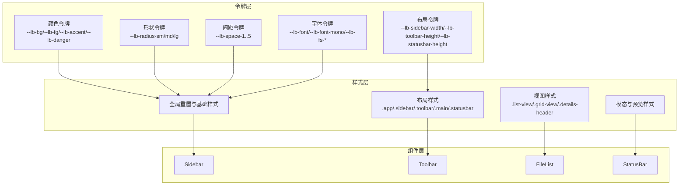
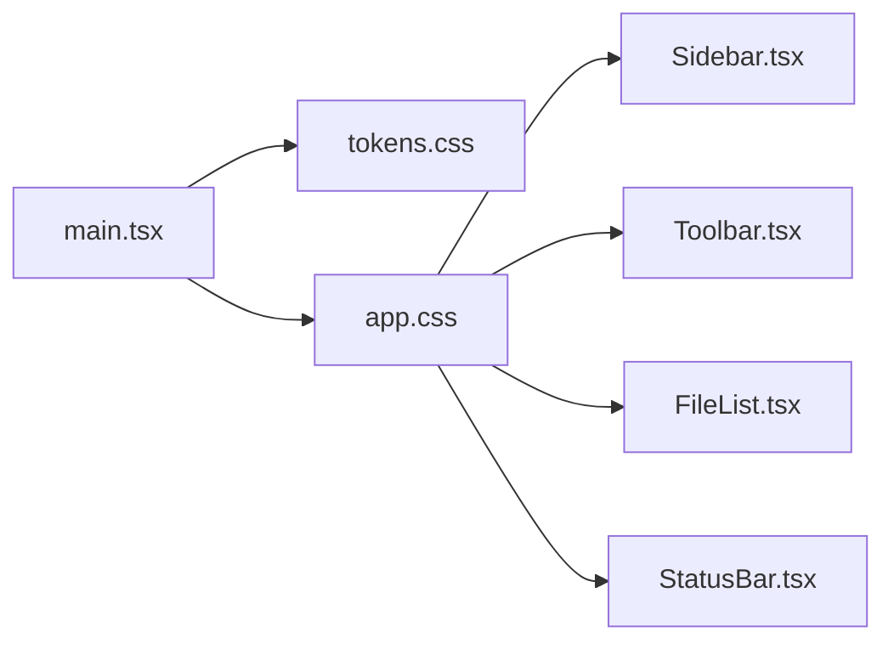
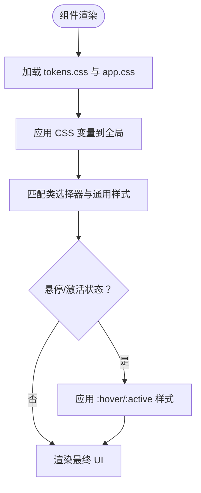

# 样式系统设计

<cite>
**本文引用的文件列表**
- [tokens.css](file://src/styles/tokens.css)
- [app.css](file://src/styles/app.css)
- [main.tsx](file://src/main.tsx)
- [App.tsx](file://src/App.tsx)
- [Sidebar.tsx](file://src/components/Sidebar.tsx)
- [Toolbar.tsx](file://src/components/Toolbar.tsx)
- [FileList.tsx](file://src/components/FileList.tsx)
- [StatusBar.tsx](file://src/components/StatusBar.tsx)
- [store.ts](file://src/store.ts)
- [index.html](file://index.html)
- [package.json](file://package.json)
</cite>

## 目录
1. [简介](#简介)
2. [项目结构](#项目结构)
3. [核心组件](#核心组件)
4. [架构总览](#架构总览)
5. [详细组件分析](#详细组件分析)
6. [依赖关系分析](#依赖关系分析)
7. [性能考量](#性能考量)
8. [故障排查指南](#故障排查指南)
9. [结论](#结论)
10. [附录](#附录)

## 简介
本文件面向 LocalBro 的样式系统，系统性阐述其基于 CSS 自定义属性（CSS 变量）的设计与实现，覆盖以下方面：
- 设计令牌（颜色、字体、间距、圆角半径、布局尺寸）的定义与使用
- 响应式设计与网格布局、媒体查询、自适应组件
- 样式组织结构：全局样式、组件样式、状态样式
- 主题定制指南：如何通过覆盖 tokens.css 创建自定义皮肤包
- 样式优先级规则、CSS-in-JS 集成方案与性能优化建议

LocalBro 采用“设计令牌 + 组件样式”的分层方式，所有视觉变量集中于 tokens.css，并通过 CSS 变量在全局生效；组件样式仅引用这些变量，确保主题切换与一致性。

## 项目结构
样式系统位于 src/styles 目录，入口在 main.tsx 中引入，组件通过类名引用样式。

图表来源
- [index.html:10-12](file://index.html#L10-L12)
- [main.tsx:4-5](file://src/main.tsx#L4-L5)
- [tokens.css:1-79](file://src/styles/tokens.css#L1-L79)
- [app.css:1-651](file://src/styles/app.css#L1-L651)
- [App.tsx:124-139](file://src/App.tsx#L124-L139)
- [Sidebar.tsx:75-198](file://src/components/Sidebar.tsx#L75-L198)
- [Toolbar.tsx:101-214](file://src/components/Toolbar.tsx#L101-L214)
- [FileList.tsx:42-83](file://src/components/FileList.tsx#L42-L83)
- [StatusBar.tsx:21-36](file://src/components/StatusBar.tsx#L21-L36)

章节来源
- [index.html:10-12](file://index.html#L10-L12)
- [main.tsx:4-5](file://src/main.tsx#L4-L5)

## 核心组件
- 设计令牌层（tokens.css）
  - 定义颜色、形状、间距、字体、布局等设计令牌，作为全局 CSS 变量
  - 支持明暗主题自动切换，通过 prefers-color-scheme 媒体查询覆盖关键变量
- 组件样式层（app.css）
  - 所有组件样式均引用 tokens.css 中的 CSS 变量
  - 使用 CSS Grid 实现应用布局，结合类名组织模块化样式
- 应用入口（main.tsx）
  - 在应用启动时引入 tokens.css 与 app.css，确保样式在组件渲染前可用
- 组件层（Sidebar/Toolbar/FileList/StatusBar）
  - 通过类名绑定样式，遵循统一的命名约定，避免硬编码颜色与尺寸

章节来源
- [tokens.css:9-79](file://src/styles/tokens.css#L9-L79)
- [app.css:1-651](file://src/styles/app.css#L1-L651)
- [main.tsx:4-5](file://src/main.tsx#L4-L5)

## 架构总览
LocalBro 的样式系统采用“令牌驱动 + 组件样式”的双层架构：
- 令牌层：集中管理设计令牌，支持主题覆盖与暗色模式
- 样式层：组件样式只读取令牌，不直接写入具体值，保证一致性与可维护性
- 布局层：使用 CSS Grid 将界面划分为侧边栏、工具栏、主内容区、状态栏四大区域

图表来源
- [tokens.css:9-79](file://src/styles/tokens.css#L9-L79)
- [app.css:1-651](file://src/styles/app.css#L1-L651)
- [Sidebar.tsx:75-198](file://src/components/Sidebar.tsx#L75-L198)
- [Toolbar.tsx:101-214](file://src/components/Toolbar.tsx#L101-L214)
- [FileList.tsx:42-83](file://src/components/FileList.tsx#L42-L83)
- [StatusBar.tsx:21-36](file://src/components/StatusBar.tsx#L21-L36)

## 详细组件分析

### 设计令牌（tokens.css）
- 颜色系统
  - 背景色系：--lb-bg（背景）、--lb-bg-elevated（层级背景）、--lb-bg-sidebar（侧边栏背景）、--lb-bg-hover（悬停背景）、--lb-bg-selected / --lb-bg-selected-fg（选中态）
  - 文字色系：--lb-fg（正文）、--lb-fg-muted（弱提示）、--lb-fg-subtle（次级）
  - 边框与强调：--lb-border / --lb-border-strong、--lb-accent / --lb-accent-fg、--lb-danger
- 形状系统
  - 圆角：--lb-radius-sm / --lb-radius-md / --lb-radius-lg
- 间距系统
  - 从 --lb-space-1 到 --lb-space-5，形成一致的栅格化间距体系
- 字体系统
  - 正文字体：--lb-font（无衬线），等宽字体：--lb-font-mono，字号：--lb-fs-xs / --lb-fs-sm / --lb-fs-md / --lb-fs-lg
- 布局系统
  - 侧边栏宽度：--lb-sidebar-width、工具栏高度：--lb-toolbar-height、状态栏高度：--lb-statusbar-height
- 暗色模式
  - 通过 @media (prefers-color-scheme: dark) 覆盖关键颜色变量，实现自动主题切换

章节来源
- [tokens.css:9-79](file://src/styles/tokens.css#L9-L79)

### 全局样式与布局（app.css）
- 全局重置与基础
  - 重置盒模型、设置根元素背景/文字/字体/字号，启用抗锯齿
- 布局网格
  - .app 使用 CSS Grid，模板区域为 sidebar/toolbar/main/status，尺寸来自布局令牌
- 侧边栏
  - 侧边栏背景、边框、滚动、标题与条目样式，条目悬停与选中态均使用令牌变量
- 工具栏
  - 导航按钮、面包屑、选择操作菜单、视图切换按钮，均引用令牌变量控制尺寸与颜色
- 主内容区
  - 空状态与错误状态统一使用 --lb-fg-muted 与 --lb-danger
- 视图样式
  - 列表视图：行高、选中态、尺寸与日期列对齐
  - 详情视图：表头吸顶、列宽与排序指示器
  - 网格视图：auto-fill + minmax 实现自适应网格，间距与圆角由令牌控制
- 状态栏
  - 文件/目录统计、总大小、选中项统计，数字使用 tabular-nums 等宽字体
- 预览与模态
  - 背景蒙层、模态框尺寸、圆角、阴影、图片/媒体/文本/PDF/音频等不同预览区域的样式

章节来源
- [app.css:1-651](file://src/styles/app.css#L1-L651)

### 组件样式与状态样式
- Sidebar
  - 类名：.sidebar、.sidebar-item、.sidebar-heading、.sidebar-input、.icon-btn
  - 状态：active（选中）、hover（悬停）、collection（集合项）及其子元素计数与删除按钮
- Toolbar
  - 类名：.toolbar、.nav-btns、.crumbs、.sel-actions、.menu、.menu-item、.view-switch
  - 状态：面包屑最后一项、视图切换 active、选择菜单展开
- FileList
  - 类名：.main、.list-view、.list-row、.details-header、.grid-view、.grid-cell
  - 状态：selected（选中）、hover（悬停）
- StatusBar
  - 类名：.statusbar，展示统计信息

章节来源
- [Sidebar.tsx:75-198](file://src/components/Sidebar.tsx#L75-L198)
- [Toolbar.tsx:101-214](file://src/components/Toolbar.tsx#L101-L214)
- [FileList.tsx:42-83](file://src/components/FileList.tsx#L42-L83)
- [StatusBar.tsx:21-36](file://src/components/StatusBar.tsx#L21-L36)

### 响应式设计与自适应组件
- 布局自适应
  - .app 使用 CSS Grid，列宽与行高来自 --lb-sidebar-width、--lb-toolbar-height、--lb-statusbar-height
  - 主内容区使用 1fr 占满剩余空间，溢出滚动
- 网格自适应
  - .grid-view 使用 repeat(auto-fill, minmax(110px, 1fr))，在不同屏幕宽度下自动调整列数
- 暗色模式
  - 通过 @media (prefers-color-scheme: dark) 覆盖颜色变量，无需修改组件样式即可切换主题
- 数字与排版
  - 使用 font-variant-numeric: tabular-nums 保证数字对齐
  - 等宽字体用于代码/日志/终端类内容

章节来源
- [app.css:50-61](file://src/styles/app.css#L50-L61)
- [app.css:408-445](file://src/styles/app.css#L408-L445)
- [app.css:594-607](file://src/styles/app.css#L594-L607)
- [tokens.css:59-78](file://src/styles/tokens.css#L59-L78)

### 样式优先级与作用域
- 优先级
  - 全局样式（app.css）中的通用选择器（如 button、input[type="text"]）与组件特定类名（如 .sidebar-item）在同一层级，组件类名通过类选择器覆盖通用样式
  - 伪类（:hover/:active/:disabled）在组件类名之后声明，保持明确的覆盖顺序
- 作用域
  - 所有样式均为全局生效，组件通过语义化类名组织，避免样式泄漏
  - tokens.css 作为全局令牌源，确保全站一致性

章节来源
- [app.css:20-35](file://src/styles/app.css#L20-L35)
- [app.css:78-95](file://src/styles/app.css#L78-L95)
- [app.css:286-301](file://src/styles/app.css#L286-L301)

### CSS-in-JS 集成方案
当前项目未使用 CSS-in-JS，但若需要集成，建议：
- 保持现有 tokens.css 作为单一事实源，CSS-in-JS 仅用于动态状态或运行时计算
- 对于动态尺寸/颜色，可在组件内以 CSS 变量形式注入，而非硬编码
- 避免在组件内重复定义令牌，确保与 tokens.css 同步

章节来源
- [tokens.css:9-79](file://src/styles/tokens.css#L9-L79)
- [main.tsx:4-5](file://src/main.tsx#L4-L5)

## 依赖关系分析
- 入口依赖
  - main.tsx 引入 tokens.css 与 app.css，确保样式在组件挂载前加载
- 组件依赖
  - 各组件通过类名引用 app.css 中的样式，间接依赖 tokens.css
- 主题扩展
  - 通过覆盖 tokens.css 与可选的 overrides.css 实现皮肤包（skin pack）

图表来源
- [main.tsx:4-5](file://src/main.tsx#L4-L5)
- [tokens.css:1-79](file://src/styles/tokens.css#L1-L79)
- [app.css:1-651](file://src/styles/app.css#L1-L651)
- [Sidebar.tsx:75-198](file://src/components/Sidebar.tsx#L75-L198)
- [Toolbar.tsx:101-214](file://src/components/Toolbar.tsx#L101-L214)
- [FileList.tsx:42-83](file://src/components/FileList.tsx#L42-L83)
- [StatusBar.tsx:21-36](file://src/components/StatusBar.tsx#L21-L36)

章节来源
- [main.tsx:4-5](file://src/main.tsx#L4-L5)
- [store.ts:1-200](file://src/store.ts#L1-L200)

## 性能考量
- 样式体积
  - tokens.css 仅包含设计令牌，体积小且稳定，适合缓存
  - app.css 采用类名复用与变量引用，减少重复声明
- 渲染性能
  - 使用 CSS Grid 与 Flex 布局，避免复杂 JS 计算
  - 预览区域采用背景棋盘格渐变，提升大图加载体验
- 主题切换
  - 通过媒体查询自动切换，无需重新渲染组件
- 优化建议
  - 将常用类名组合抽象为更细粒度的工具类，减少重复样式
  - 对于高频交互（悬停/选中）使用 CSS 变量而非 JavaScript 动态样式
  - 避免在组件内频繁写入内联样式，保持样式与逻辑分离

[本节为通用性能指导，不直接分析具体文件]

## 故障排查指南
- 样式未生效
  - 确认 main.tsx 中已引入 tokens.css 与 app.css
  - 检查类名是否正确拼写，组件是否使用了正确的类名
- 主题不切换
  - 确认浏览器系统主题设置为深色，或检查 prefers-color-scheme 媒体查询是否被覆盖
- 布局异常
  - 检查 .app 的 grid-template-columns/rows 是否被外部样式覆盖
  - 确认 --lb-sidebar-width、--lb-toolbar-height、--lb-statusbar-height 未被意外重写
- 预览区域显示异常
  - 检查 .preview-modal 的尺寸与圆角是否被其他样式影响
  - 确认 .preview-image 的棋盘格背景是否被覆盖

章节来源
- [main.tsx:4-5](file://src/main.tsx#L4-L5)
- [tokens.css:59-78](file://src/styles/tokens.css#L59-L78)
- [app.css:50-61](file://src/styles/app.css#L50-L61)
- [app.css:460-593](file://src/styles/app.css#L460-L593)

## 结论
LocalBro 的样式系统以 CSS 变量为核心，通过 tokens.css 统一管理设计令牌，app.css 以类名组织组件样式，实现了高内聚、低耦合的主题体系。配合 CSS Grid 与媒体查询，系统具备良好的响应式与可扩展性。通过覆盖 tokens.css，即可快速构建自定义皮肤包，满足不同品牌与用户偏好的需求。

[本节为总结性内容，不直接分析具体文件]

## 附录

### 主题定制指南（覆盖 tokens.css）
- 创建自定义皮肤包
  - 新建 tokens.css 并覆盖所需变量（颜色、形状、间距、字体、布局）
  - 可选：新增 overrides.css 以补充或微调样式
- 发布与加载
  - 将皮肤包放置于应用资源目录，按需替换默认 tokens.css
  - 保持与默认 tokens.css 的变量名一致，确保兼容性

章节来源
- [tokens.css:1-7](file://src/styles/tokens.css#L1-L7)
- [main.tsx:4-5](file://src/main.tsx#L4-L5)

### 样式优先级流程图

图表来源
- [main.tsx:4-5](file://src/main.tsx#L4-L5)
- [app.css:20-35](file://src/styles/app.css#L20-L35)
- [app.css:78-95](file://src/styles/app.css#L78-L95)