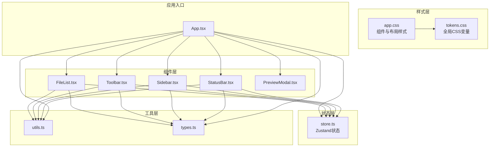
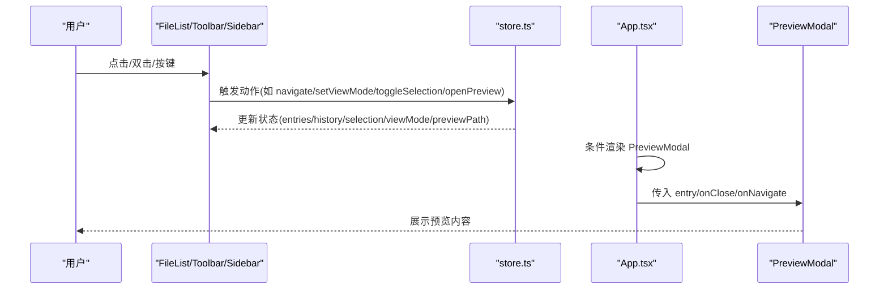
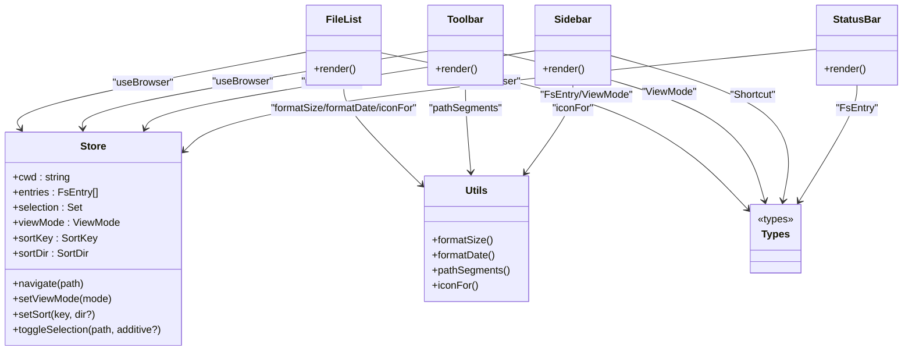

# 用户界面组件

<cite>
**本文引用的文件**
- [tokens.css](file://src/styles/tokens.css)
- [app.css](file://src/styles/app.css)
- [FileList.tsx](file://src/components/FileList.tsx)
- [Sidebar.tsx](file://src/components/Sidebar.tsx)
- [StatusBar.tsx](file://src/components/StatusBar.tsx)
- [Toolbar.tsx](file://src/components/Toolbar.tsx)
- [store.ts](file://src/store.ts)
- [utils.ts](file://src/utils.ts)
- [types.ts](file://src/types.ts)
- [App.tsx](file://src/App.tsx)
- [package.json](file://package.json)
</cite>

## 目录
1. [简介](#简介)
2. [项目结构](#项目结构)
3. [核心组件](#核心组件)
4. [架构总览](#架构总览)
5. [组件详细分析](#组件详细分析)
6. [依赖关系分析](#依赖关系分析)
7. [性能考量](#性能考量)
8. [故障排查指南](#故障排查指南)
9. [结论](#结论)
10. [附录](#附录)

## 简介
本文件面向 LocalBro 的用户界面组件，系统性阐述其 CSS 样式体系（CSS 变量、主题系统与响应式设计）、各 UI 组件的视觉外观与交互行为、组件属性/事件/插槽与可定制项，并提供组合模式与集成建议。文档同时覆盖跨浏览器兼容性与性能优化策略，帮助开发者在不直接阅读源码的情况下快速理解与扩展 UI。

## 项目结构
LocalBro 前端采用 React + Zustand 架构，样式通过 CSS 自定义属性与原子化类名组织，布局基于 CSS Grid。核心目录与文件如下：
- 样式层：tokens.css 定义全局变量；app.css 提供组件级样式与布局。
- 组件层：Sidebar、Toolbar、FileList、StatusBar 四大组件构成主界面。
- 状态层：store.ts 使用 Zustand 管理浏览状态、历史、选择、排序等。
- 工具层：utils.ts 提供格式化与路径处理；types.ts 定义类型。
- 应用入口：App.tsx 负责初始化、事件监听与预览模态框集成。

图表来源
- [tokens.css](file://src/styles/tokens.css)
- [app.css](file://src/styles/app.css)
- [FileList.tsx](file://src/components/FileList.tsx)
- [Sidebar.tsx](file://src/components/Sidebar.tsx)
- [StatusBar.tsx](file://src/components/StatusBar.tsx)
- [Toolbar.tsx](file://src/components/Toolbar.tsx)
- [store.ts](file://src/store.ts)
- [utils.ts](file://src/utils.ts)
- [types.ts](file://src/types.ts)
- [App.tsx](file://src/App.tsx)

章节来源
- [tokens.css](file://src/styles/tokens.css)
- [app.css](file://src/styles/app.css)
- [store.ts](file://src/store.ts)
- [utils.ts](file://src/utils.ts)
- [types.ts](file://src/types.ts)
- [App.tsx](file://src/App.tsx)

## 核心组件
- Sidebar：侧边栏导航，展示收藏夹与卷标，支持点击切换目录。
- Toolbar：顶部工具栏，包含导航按钮、面包屑地址栏、视图切换、隐藏文件开关等。
- FileList：主内容区，按列表/网格/详情三种视图渲染文件条目，支持多选、双击进入或预览。
- StatusBar：底部状态栏，显示目录统计、选中项统计与大小信息。
- 预览模态框：由 App.tsx 条件渲染，用于快速查看文件内容。

章节来源
- [Sidebar.tsx](file://src/components/Sidebar.tsx)
- [Toolbar.tsx](file://src/components/Toolbar.tsx)
- [FileList.tsx](file://src/components/FileList.tsx)
- [StatusBar.tsx](file://src/components/StatusBar.tsx)
- [App.tsx](file://src/App.tsx)

## 架构总览
UI 架构围绕“样式变量 + 组件 + 状态”展开：
- 样式系统：以 tokens.css 为核心，定义颜色、间距、半径、字体、布局尺寸等变量；app.css 通过 var(--lb-*) 引用这些变量，形成统一的主题与风格。
- 组件交互：组件通过 store.ts 暴露的动作更新状态，如导航、切换视图、排序、选择等；FileList 根据当前视图模式渲染不同布局。
- 预览与快捷键：App.tsx 监听事件与键盘事件，触发预览模态框的打开与关闭。

图表来源
- [store.ts](file://src/store.ts)
- [FileList.tsx](file://src/components/FileList.tsx)
- [Toolbar.tsx](file://src/components/Toolbar.tsx)
- [Sidebar.tsx](file://src/components/Sidebar.tsx)
- [App.tsx](file://src/App.tsx)

## 组件详细分析

### Sidebar 侧边栏
- 视觉外观
  - 背景与边框：使用侧边栏背景色与分隔线，营造层级感。
  - 项目项：悬停高亮、选中高亮，图标与文本对齐，圆角与间距一致。
- 行为与交互
  - 点击任一项目触发导航到对应路径。
  - 当前路径高亮显示。
- 属性/事件
  - 无外部 props；内部通过 store 获取数据并调用导航动作。
- 插槽与自定义
  - 支持通过数据源扩展收藏夹与卷标。
- 主题与样式
  - 使用 --lb-bg-sidebar、--lb-border、--lb-fg、--lb-bg-hover、--lb-bg-selected 等变量。

章节来源
- [Sidebar.tsx](file://src/components/Sidebar.tsx)
- [app.css](file://src/styles/app.css)
- [store.ts](file://src/store.ts)

### Toolbar 工具栏
- 视觉外观
  - 导航按钮组、面包屑容器、隐藏文件开关、视图切换器，均使用统一的圆角、边框与间距。
  - 面包屑在编辑模式下以输入框呈现，非编辑模式以只读段落展示。
- 行为与交互
  - 导航按钮：后退/前进/上一级/刷新。
  - 面包屑：双击进入编辑，回车或失焦提交；点击段落跳转。
  - 隐藏文件：勾选后立即刷新列表。
  - 视图切换：列表/网格/详情三态切换。
- 属性/事件
  - 无外部 props；内部通过 store 访问状态与动作。
- 插槽与自定义
  - 可通过扩展数据源添加更多导航入口。
- 主题与样式
  - 使用 --lb-bg-elevated、--lb-border、--lb-fg、--lb-fg-muted、--lb-accent 等变量。

章节来源
- [Toolbar.tsx](file://src/components/Toolbar.tsx)
- [app.css](file://src/styles/app.css)
- [store.ts](file://src/store.ts)
- [utils.ts](file://src/utils.ts)

### FileList 文件列表
- 视觉外观
  - 列表视图：行高、图标、名称、大小、修改时间列，选中态高亮。
  - 详情视图：表头可点击排序，行内信息与列表一致。
  - 网格视图：单元格居中显示图标与名称，选中态高亮。
  - 空态/错误态：居中提示，错误态使用危险色。
- 行为与交互
  - 单击：切换选择（支持 Ctrl/Cmd 多选）。
  - 双击：目录则进入，文件则打开预览。
  - 排序：详情表头点击切换排序键与方向。
  - 视图切换：根据 store 中的 viewMode 渲染不同布局。
- 属性/事件
  - 无外部 props；内部通过 store 获取 entries、selection、sortKey、sortDir 并调用动作。
- 插槽与自定义
  - 可通过扩展数据源与排序键扩展更多列或排序规则。
- 主题与样式
  - 使用 --lb-bg、--lb-bg-hover、--lb-bg-selected、--lb-fg、--lb-fg-muted、--lb-border 等变量。

章节来源
- [FileList.tsx](file://src/components/FileList.tsx)
- [app.css](file://src/styles/app.css)
- [store.ts](file://src/store.ts)
- [utils.ts](file://src/utils.ts)
- [types.ts](file://src/types.ts)

### StatusBar 状态栏
- 视觉外观
  - 显示目录/文件数量、总大小、待计算目录数、选中项数量与大小。
  - 数字使用等宽数字样式，提升可读性。
- 行为与交互
  - 实时统计：基于 entries 与 selection 动态计算。
  - 待计算目录：当目录大小未缓存时显示 +N 计算中提示。
- 属性/事件
  - 无外部 props；内部通过 store 获取 entries、selection、dirSizes。
- 插槽与自定义
  - 可扩展更多统计维度（如 MIME 类型分布）。
- 主题与样式
  - 使用 --lb-bg-elevated、--lb-fg-muted、--lb-border 等变量。

章节来源
- [StatusBar.tsx](file://src/components/StatusBar.tsx)
- [app.css](file://src/styles/app.css)
- [store.ts](file://src/store.ts)
- [utils.ts](file://src/utils.ts)

### 预览模态框（由 App.tsx 条件渲染）
- 视觉外观
  - 背景半透明遮罩、居中弹窗、标题栏、主体区域与空态/错误态提示。
  - 图片、媒体、PDF、文本等不同类型内容有专门的渲染区域。
- 行为与交互
  - 通过空格键打开/关闭（需聚焦到列表项），支持键盘导航。
  - 关闭时回调关闭动作，支持在预览中继续导航到其他文件。
- 属性/事件
  - 由 App.tsx 传入 entry/onClose/onNavigate。
- 插槽与自定义
  - 通过内置适配器注册机制扩展更多类型预览。
- 主题与样式
  - 使用 --lb-bg、--lb-bg-elevated、--lb-border、--lb-border-strong、--lb-fg、--lb-danger 等变量。

章节来源
- [App.tsx](file://src/App.tsx)
- [app.css](file://src/styles/app.css)

## 依赖关系分析
- 组件与状态
  - FileList、Toolbar、Sidebar、StatusBar 通过 store.ts 的 hooks 访问状态与动作。
  - App.tsx 作为顶层容器，负责初始化、事件监听与预览模态框的条件渲染。
- 组件与工具
  - FileList、Toolbar、Sidebar、StatusBar 使用 utils.ts 的格式化与路径处理函数。
  - FileList 使用 sortEntries 对条目进行排序。
- 组件与样式
  - 所有组件样式均来自 app.css，变量来源于 tokens.css。
- 类型约束
  - types.ts 定义了 FsEntry、Shortcut、ViewMode、SortKey、SortDir 等类型，确保组件间契约清晰。

图表来源
- [store.ts](file://src/store.ts)
- [FileList.tsx](file://src/components/FileList.tsx)
- [Toolbar.tsx](file://src/components/Toolbar.tsx)
- [Sidebar.tsx](file://src/components/Sidebar.tsx)
- [StatusBar.tsx](file://src/components/StatusBar.tsx)
- [utils.ts](file://src/utils.ts)
- [types.ts](file://src/types.ts)

章节来源
- [store.ts](file://src/store.ts)
- [FileList.tsx](file://src/components/FileList.tsx)
- [Toolbar.tsx](file://src/components/Toolbar.tsx)
- [Sidebar.tsx](file://src/components/Sidebar.tsx)
- [StatusBar.tsx](file://src/components/StatusBar.tsx)
- [utils.ts](file://src/utils.ts)
- [types.ts](file://src/types.ts)

## 性能考量
- 列表渲染
  - FileList 使用 useMemo 对排序结果进行缓存，避免重复排序开销。
  - 列表/网格/详情三种视图按需渲染，减少 DOM 结构复杂度。
- 选择与状态
  - selection 使用 Set 存储路径，便于 O(1) 查找与切换。
  - 切换视图/排序/隐藏文件时仅更新必要字段，避免全量重渲染。
- 预览与并发
  - 目录大小扫描采用并发队列（固定并发数），避免阻塞主线程。
  - 预览模态框按需渲染，减少不必要的组件实例化。
- 样式与主题
  - 使用 CSS 变量统一主题，减少重复样式与重排重绘。
  - 暗/亮色主题通过媒体查询自动切换，无需额外脚本。

章节来源
- [FileList.tsx](file://src/components/FileList.tsx)
- [store.ts](file://src/store.ts)
- [App.tsx](file://src/App.tsx)
- [tokens.css](file://src/styles/tokens.css)

## 故障排查指南
- 预览无法打开
  - 检查是否选择了文件而非目录；确认 store 中 previewPath 是否正确设置。
  - 确认事件监听是否生效（size-updated）。
- 面包屑编辑无效
  - 确认地址值变化已提交（回车/失焦）；检查 navigate 动作是否被调用。
- 视图切换异常
  - 确认 viewMode 状态是否更新；检查 setViewMode 动作是否被调用。
- 选择状态错乱
  - 检查 toggleSelection 的 additive 参数逻辑；确认 selection Set 是否正确更新。
- 目录大小未显示
  - 确认目录大小扫描任务是否启动；检查并发队列与 setDirSize 动作。

章节来源
- [App.tsx](file://src/App.tsx)
- [store.ts](file://src/store.ts)
- [FileList.tsx](file://src/components/FileList.tsx)
- [Toolbar.tsx](file://src/components/Toolbar.tsx)

## 结论
LocalBro 的 UI 组件以 CSS 变量为核心构建主题系统，结合原子化类名与 CSS Grid 布局，实现了清晰、可维护且可扩展的界面。组件通过 Zustand 管理状态，行为明确、职责单一，具备良好的可测试性与可定制性。建议在后续迭代中：
- 增加皮肤包机制，允许用户切换主题。
- 扩展预览适配器接口，支持更多文件类型。
- 优化键盘导航与无障碍访问。
- 引入虚拟滚动以提升大数据集下的渲染性能。

## 附录

### 样式系统与主题
- CSS 变量
  - 颜色：背景、前景、边框、强调色、危险色。
  - 形状：圆角半径。
  - 间距：基础间距单位。
  - 字体：无衬线与等宽字体、字号。
  - 布局：侧边栏宽度、工具栏高度、状态栏高度。
- 主题系统
  - 通过 :root 与 @media (prefers-color-scheme: dark) 定义亮/暗两套变量，自动适配系统偏好。
- 响应式设计
  - 网格视图使用 CSS Grid 与 minmax，随窗口宽度自适应列数。
  - 预览模态框使用 min() 限制最大尺寸，保证在大屏/小屏下均有良好体验。

章节来源
- [tokens.css](file://src/styles/tokens.css)
- [app.css](file://src/styles/app.css)

### 组件属性与事件清单
- Sidebar
  - 数据来源：shortcuts、volumes、cwd
  - 动作：navigate(path)
- Toolbar
  - 数据来源：cwd、history、historyIdx、viewMode、showHidden
  - 动作：goBack、goForward、goUp、refresh、navigate(path)、setViewMode(mode)、setShowHidden(flag)
- FileList
  - 数据来源：entries、selection、viewMode、sortKey、sortDir
  - 动作：toggleSelection(path, additive?)、openPreview(path)、navigate(path)
- StatusBar
  - 数据来源：entries、selection、dirSizes
- 预览模态框（由 App.tsx 传入）
  - 属性：entry、onClose、onNavigate

章节来源
- [store.ts](file://src/store.ts)
- [Sidebar.tsx](file://src/components/Sidebar.tsx)
- [Toolbar.tsx](file://src/components/Toolbar.tsx)
- [FileList.tsx](file://src/components/FileList.tsx)
- [StatusBar.tsx](file://src/components/StatusBar.tsx)
- [App.tsx](file://src/App.tsx)

### 使用示例与最佳实践
- 在现有组件基础上扩展新视图
  - 新增视图模式枚举并在 Toolbar 中暴露切换按钮，再在 FileList 中按模式渲染。
- 自定义主题
  - 通过覆盖 tokens.css 中的变量即可实现主题替换；若需更复杂的覆盖，可在应用入口引入 overrides.css。
- 组合模式
  - 将 Sidebar、Toolbar、FileList、StatusBar 组合在 .app 容器中，保持 Grid 布局不变。
- 与系统事件集成
  - 通过 App.tsx 的事件监听与键盘事件处理，实现空间键快速预览等增强功能。

章节来源
- [app.css](file://src/styles/app.css)
- [store.ts](file://src/store.ts)
- [App.tsx](file://src/App.tsx)

### 跨浏览器兼容性与性能优化建议
- 兼容性
  - 使用 CSS Grid 与 Flexbox 时，注意目标浏览器的支持情况；为旧版浏览器提供降级方案。
  - 使用 CSS 变量时，确保目标浏览器支持；可考虑提供后备值。
- 性能
  - 列表渲染使用 useMemo 与 Set 结构；避免在渲染过程中执行昂贵计算。
  - 合理控制并发任务数量，避免 UI 阻塞。
  - 使用等宽数字与合理的字体缩放，提升可读性与渲染效率。

章节来源
- [FileList.tsx](file://src/components/FileList.tsx)
- [store.ts](file://src/store.ts)
- [App.tsx](file://src/App.tsx)
- [tokens.css](file://src/styles/tokens.css)