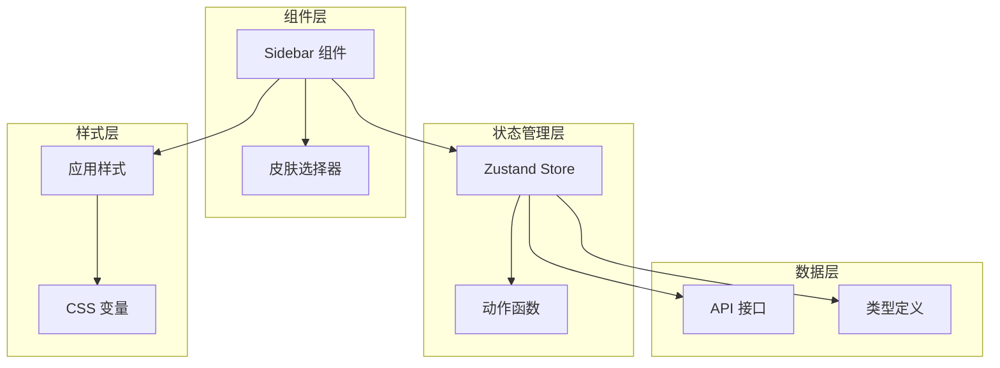
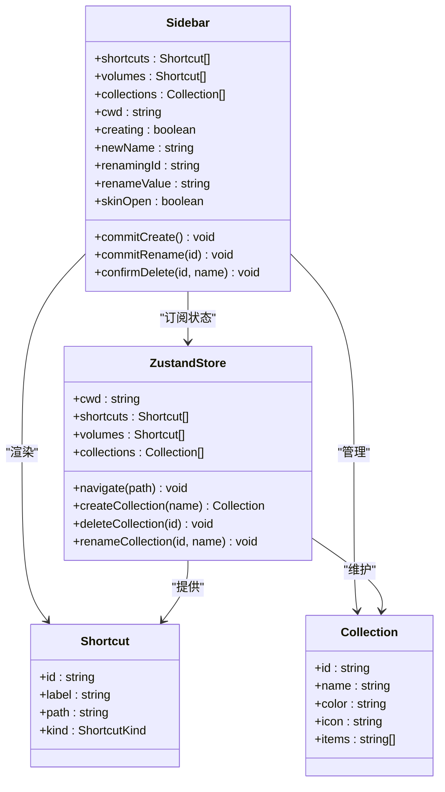
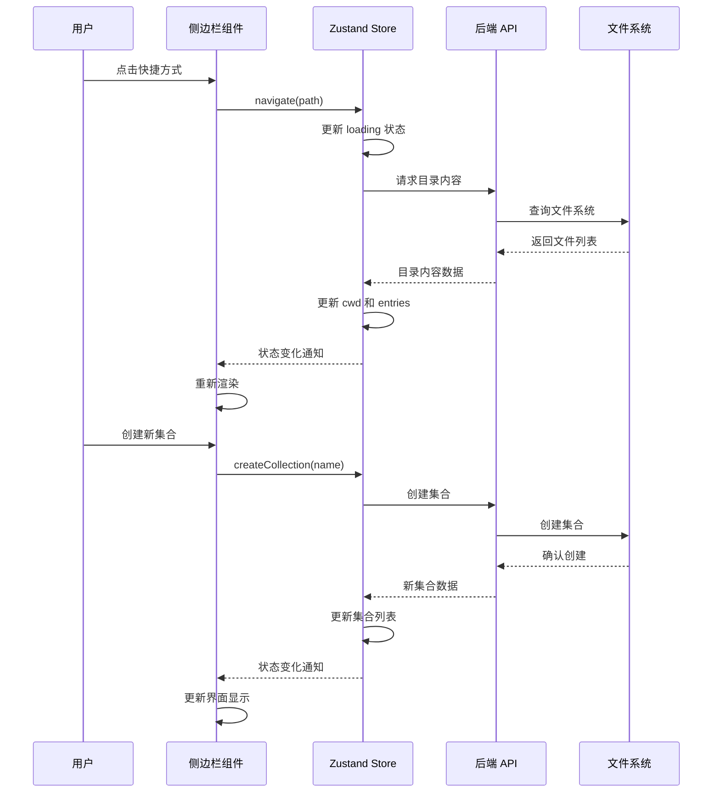
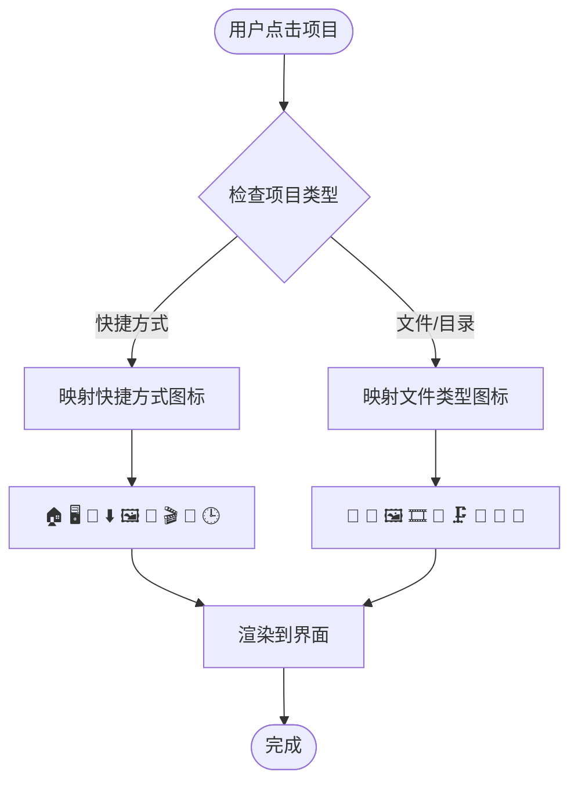
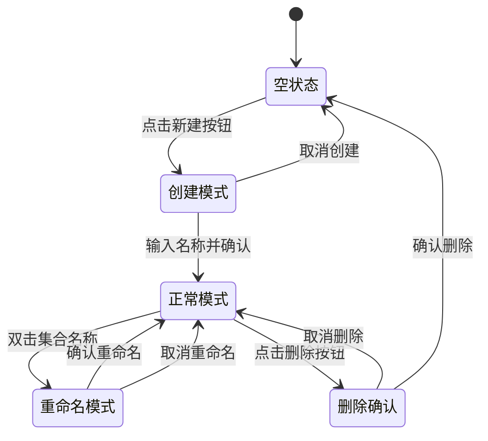
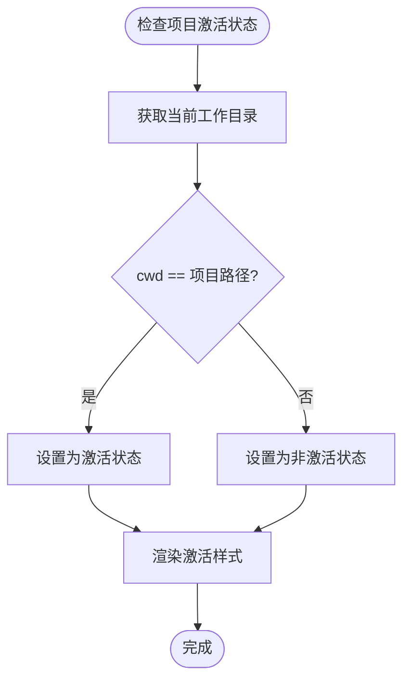
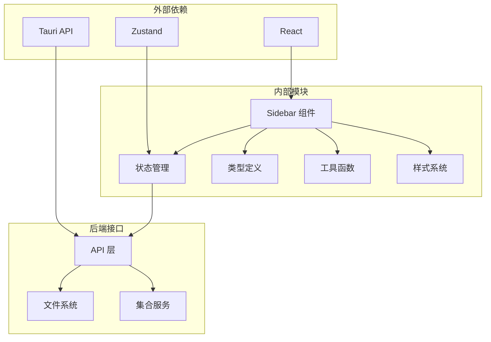

# 侧边栏组件

<cite>
**本文档引用的文件**
- [Sidebar.tsx](file://src/components/Sidebar.tsx)
- [store.ts](file://src/store.ts)
- [types.ts](file://src/types.ts)
- [api.ts](file://src/api.ts)
- [App.tsx](file://src/App.tsx)
- [SkinPicker.tsx](file://src/components/SkinPicker.tsx)
- [app.css](file://src/styles/app.css)
- [tokens.css](file://src/styles/tokens.css)
- [utils.ts](file://src/utils.ts)
</cite>

## 目录
1. [简介](#简介)
2. [项目结构](#项目结构)
3. [核心组件](#核心组件)
4. [架构概览](#架构概览)
5. [详细组件分析](#详细组件分析)
6. [依赖关系分析](#依赖关系分析)
7. [性能考虑](#性能考虑)
8. [故障排除指南](#故障排除指南)
9. [结论](#结论)

## 简介

LocalBro 的侧边栏组件是文件浏览器界面的重要组成部分，负责提供用户快速访问常用位置、管理个人收藏集合以及浏览系统磁盘卷的功能。该组件采用 React Hooks 和 Zustand 状态管理库构建，实现了响应式的用户界面和流畅的交互体验。

侧边栏主要包含三个核心功能区域：
- 快捷方式导航：提供用户常用目录的快速访问
- 收藏集合管理：允许用户创建、编辑和删除自定义文件夹集合
- 磁盘卷显示：展示系统中的可用存储设备

## 项目结构

LocalBro 项目采用模块化架构，侧边栏组件位于 `src/components/` 目录下，与状态管理、类型定义和样式文件协同工作。



**图表来源**
- [Sidebar.tsx:1-215](file://src/components/Sidebar.tsx#L1-L215)
- [store.ts:1-308](file://src/store.ts#L1-L308)
- [App.tsx:1-146](file://src/App.tsx#L1-L146)

**章节来源**
- [Sidebar.tsx:1-215](file://src/components/Sidebar.tsx#L1-L215)
- [store.ts:1-308](file://src/store.ts#L1-L308)
- [App.tsx:106-146](file://src/App.tsx#L106-L146)

## 核心组件

### 组件架构设计

侧边栏组件采用函数式组件设计，使用 React 的 hooks 进行状态管理和副作用处理。组件通过自定义的 `useBrowser` hook 访问 Zustand store 中的状态和动作函数。



**图表来源**
- [Sidebar.tsx:20-28](file://src/components/Sidebar.tsx#L20-L28)
- [store.ts:16-71](file://src/store.ts#L16-L71)
- [types.ts:26-31](file://src/types.ts#L26-L31)

### 状态管理模式

组件通过以下方式从 Zustand store 获取数据：

1. **快捷方式导航**：`useBrowser(s => s.shortcuts)`
2. **磁盘卷显示**：`useBrowser(s => s.volumes)`
3. **活动状态管理**：`useBrowser(s => s.cwd)`
4. **集合管理**：`useBrowser(s => s.collections)`
5. **导航功能**：`useBrowser(s => s.navigate)`

**章节来源**
- [Sidebar.tsx:21-28](file://src/components/Sidebar.tsx#L21-L28)
- [store.ts:73-263](file://src/store.ts#L73-L263)

## 架构概览

### 数据流架构

侧边栏组件的数据流遵循单向数据流原则，从 Zustand store 到组件渲染，再到用户交互触发的动作更新。



**图表来源**
- [store.ts:112-136](file://src/store.ts#L112-L136)
- [store.ts:216-220](file://src/store.ts#L216-L220)
- [Sidebar.tsx:36-51](file://src/components/Sidebar.tsx#L36-L51)

### 图标映射机制

侧边栏实现了两级图标映射系统：

1. **快捷方式图标映射**：根据快捷方式类型映射到相应的 Unicode 字符
2. **文件类型图标映射**：根据文件扩展名映射到合适的文件类型图标



**图表来源**
- [Sidebar.tsx:5-18](file://src/components/Sidebar.tsx#L5-L18)
- [utils.ts:53-65](file://src/utils.ts#L53-L65)

**章节来源**
- [Sidebar.tsx:5-18](file://src/components/Sidebar.tsx#L5-L18)
- [utils.ts:53-65](file://src/utils.ts#L53-L65)

## 详细组件分析

### 快捷方式导航系统

快捷方式导航是侧边栏的核心功能之一，提供了用户最常用的文件系统位置的快速访问。

#### 快捷方式数据结构

快捷方式对象包含以下关键属性：
- `id`: 唯一标识符
- `label`: 显示名称
- `path`: 实际路径
- `kind`: 类型标识符

#### 图标映射规则

快捷方式图标映射基于 `kind` 属性进行：

| 类型 | 图标 | 描述 |
|------|------|------|
| home | 🏠 | 主目录 |
| desktop | 🖥️ | 桌面目录 |
| documents | 📄 | 文档目录 |
| downloads | ⬆️ | 下载目录 |
| pictures | 🖼️ | 图片目录 |
| music | 🎵 | 音乐目录 |
| videos | 🎬 | 视频目录 |
| volume | 💽 | 磁盘卷 |
| recent | 🕒 | 最近文件 |

**章节来源**
- [Sidebar.tsx:80-90](file://src/components/Sidebar.tsx#L80-L90)
- [Sidebar.tsx:5-18](file://src/components/Sidebar.tsx#L5-L18)

### 收藏集合管理系统

收藏集合是 LocalBro 的特色功能，允许用户创建自定义的文件组织方式。

#### 集合生命周期管理



**图表来源**
- [Sidebar.tsx:110-160](file://src/components/Sidebar.tsx#L110-L160)
- [Sidebar.tsx:162-181](file://src/components/Sidebar.tsx#L162-L181)

#### 集合数据结构

每个集合包含以下信息：
- `id`: 集合唯一标识符
- `name`: 集合名称
- `color`: 自定义颜色
- `icon`: 自定义图标
- `items`: 包含的文件路径数组
- `created_ms`: 创建时间戳
- `updated_ms`: 更新时间戳

**章节来源**
- [Sidebar.tsx:110-160](file://src/components/Sidebar.tsx#L110-L160)
- [api.ts:140-148](file://src/api.ts#L140-L148)

### 磁盘卷显示系统

磁盘卷显示功能提供了系统中所有可用存储设备的列表，包括本地磁盘、网络驱动器等。

#### 卷信息结构

卷对象具有以下属性：
- `id`: 卷唯一标识符
- `label`: 卷显示名称
- `path`: 卷根路径
- `kind`: 卷类型（通常为 "volume"）

#### 动态更新机制

卷列表通过 `useBrowser(s => s.volumes)` 订阅，当系统存储设备发生变化时会自动更新显示。

**章节来源**
- [Sidebar.tsx:183-198](file://src/components/Sidebar.tsx#L183-L198)
- [store.ts:82-84](file://src/store.ts#L82-L84)

### 活动状态管理

活动状态管理确保当前选中的项目在视觉上突出显示，提供清晰的导航反馈。

#### 激活条件判断

激活状态通过比较当前工作目录 (`cwd`) 与项目路径来确定：



**图表来源**
- [Sidebar.tsx:83](file://src/components/Sidebar.tsx#L83)
- [Sidebar.tsx:112](file://src/components/Sidebar.tsx#L112)
- [Sidebar.tsx:189](file://src/components/Sidebar.tsx#L189)

**章节来源**
- [Sidebar.tsx:83](file://src/components/Sidebar.tsx#L83)
- [Sidebar.tsx:112](file://src/components/Sidebar.tsx#L112)
- [Sidebar.tsx:189](file://src/components/Sidebar.tsx#L189)

### 用户交互处理

侧边栏组件实现了丰富的用户交互功能，包括点击导航、双击重命名、键盘快捷键等。

#### 交互事件处理

| 事件类型 | 处理逻辑 | 用户反馈 |
|----------|----------|----------|
| 点击导航 | 调用 `navigate()` 函数 | 页面跳转到目标路径 |
| 双击重命名 | 进入重命名输入模式 | 显示文本输入框 |
| 键盘输入 | 处理 Enter/Escape 键 | 确认或取消操作 |
| 删除确认 | 弹出确认对话框 | 防止误删操作 |

**章节来源**
- [Sidebar.tsx:84](file://src/components/Sidebar.tsx#L84)
- [Sidebar.tsx:119-123](file://src/components/Sidebar.tsx#L119-L123)
- [Sidebar.tsx:149-155](file://src/components/Sidebar.tsx#L149-L155)

## 依赖关系分析

### 组件间依赖关系



**图表来源**
- [Sidebar.tsx:1-3](file://src/components/Sidebar.tsx#L1-L3)
- [store.ts:1-5](file://src/store.ts#L1-L5)
- [App.tsx:1-11](file://src/App.tsx#L1-L11)

### 状态依赖分析

侧边栏组件依赖于 Zustand store 中的多个状态字段：

```mermaid
erDiagram
BrowserState {
string cwd
FsEntry[] entries
boolean loading
string error
string[] history
number historyIdx
Shortcut[] shortcuts
Shortcut[] volumes
Collection[] collections
Set<string> selection
Record<string,number> dirSizes
string previewPath
boolean showHidden
ViewMode viewMode
SortKey sortKey
SortDir sortDir
}
SidebarState {
boolean creating
string newName
string? renamingId
string renameValue
boolean skinOpen
}
BrowserState ||--o{ SidebarState : "组合"
```

**图表来源**
- [store.ts:16-71](file://src/store.ts#L16-L71)
- [Sidebar.tsx:30-34](file://src/components/Sidebar.tsx#L30-L34)

**章节来源**
- [store.ts:16-71](file://src/store.ts#L16-L71)
- [Sidebar.tsx:30-34](file://src/components/Sidebar.tsx#L30-L34)

## 性能考虑

### 渲染优化策略

1. **状态订阅优化**：组件只订阅必要的状态字段，避免不必要的重渲染
2. **虚拟路径处理**：使用 `COLLECTION_SCHEME` 前缀区分虚拟路径和真实路径
3. **条件渲染**：根据数据存在性进行条件渲染，减少 DOM 元素数量

### 内存管理

1. **集合列表优化**：空集合时显示占位符而非空列表项
2. **输入状态清理**：操作完成后及时清理临时状态
3. **事件监听清理**：组件卸载时清理键盘事件监听器

### 网络请求优化

1. **批量初始化**：应用启动时并行获取多个数据源
2. **错误边界处理**：对网络请求失败进行优雅降级
3. **缓存机制**：利用后端提供的缓存机制减少重复请求

## 故障排除指南

### 常见问题及解决方案

#### 快捷方式不显示

**症状**：快捷方式列表为空
**可能原因**：
- API 调用失败
- 系统权限不足
- 路径不存在

**解决方法**：
1. 检查网络连接状态
2. 验证系统权限配置
3. 查看控制台错误日志

#### 集合创建失败

**症状**：创建集合时出现错误提示
**可能原因**：
- 网络请求超时
- 服务器端验证失败
- 存储空间不足

**解决方法**：
1. 检查后端服务状态
2. 验证集合名称格式
3. 确认磁盘空间充足

#### 激活状态异常

**症状**：当前目录高亮显示不正确
**可能原因**：
- 虚拟路径解析错误
- 路径比较逻辑问题
- 状态同步延迟

**解决方法**：
1. 检查 `COLLECTION_SCHEME` 前缀处理
2. 验证路径字符串比较
3. 确认状态更新时机

**章节来源**
- [Sidebar.tsx:46-48](file://src/components/Sidebar.tsx#L46-L48)
- [Sidebar.tsx:58-60](file://src/components/Sidebar.tsx#L58-L60)
- [store.ts:112-136](file://src/store.ts#L112-L136)

## 结论

LocalBro 的侧边栏组件展现了现代前端开发的最佳实践，通过合理的架构设计和状态管理模式，实现了功能丰富且用户体验优秀的文件导航界面。

### 主要优势

1. **清晰的架构分离**：组件职责明确，状态管理集中
2. **高效的渲染机制**：最小化重渲染，提升性能表现
3. **完善的交互设计**：支持多种用户操作模式
4. **可扩展的样式系统**：基于 CSS 变量的主题支持

### 技术亮点

- 使用 Zustand 替代 Redux，简化状态管理复杂度
- 实现虚拟路径系统，支持集合视图导航
- 采用图标映射机制，提供直观的视觉反馈
- 集成皮肤系统，支持主题定制

### 发展建议

1. **增强错误处理**：添加更详细的错误提示和恢复机制
2. **优化移动端体验**：适配触摸交互和小屏幕显示
3. **扩展快捷方式类型**：支持更多自定义快捷方式
4. **改进搜索功能**：添加侧边栏内搜索能力

该组件为 LocalBro 提供了稳定可靠的基础导航功能，为后续功能扩展奠定了良好的技术基础。