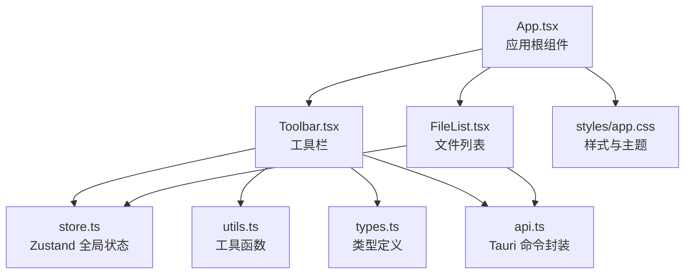
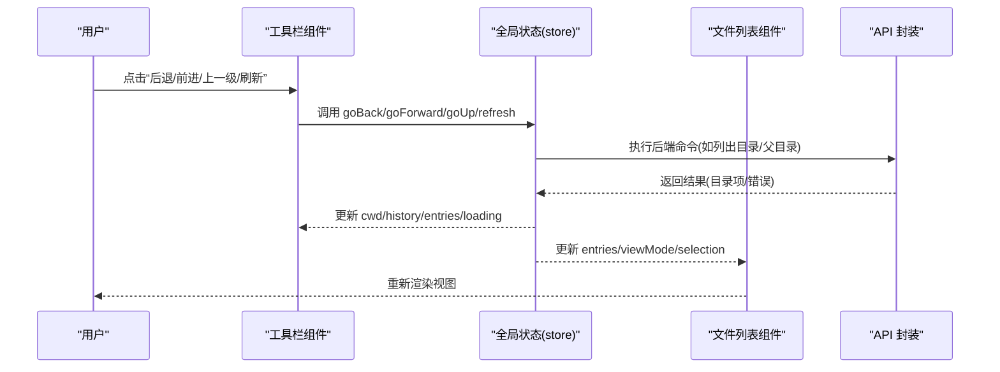
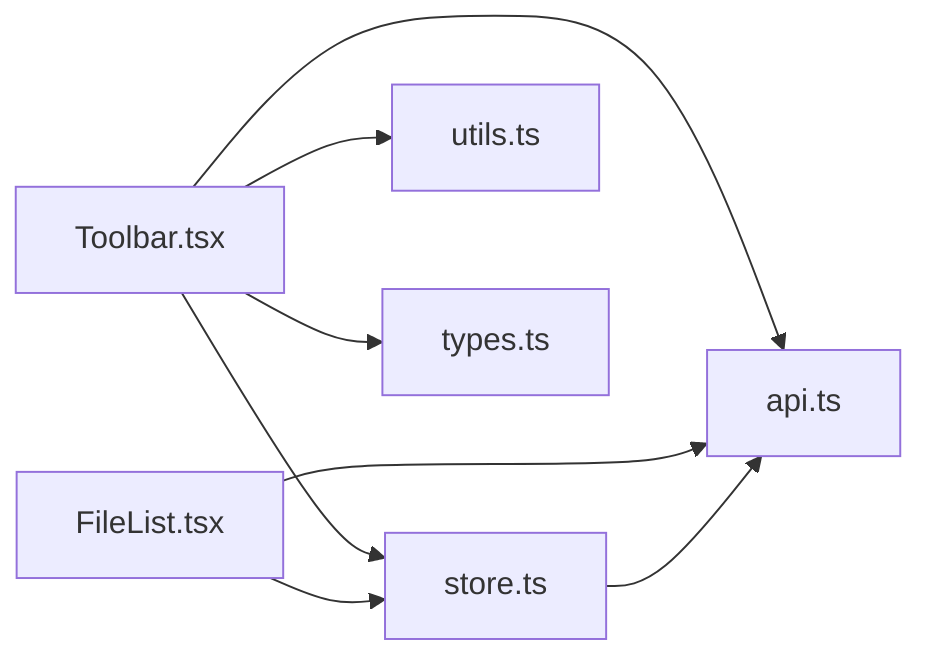
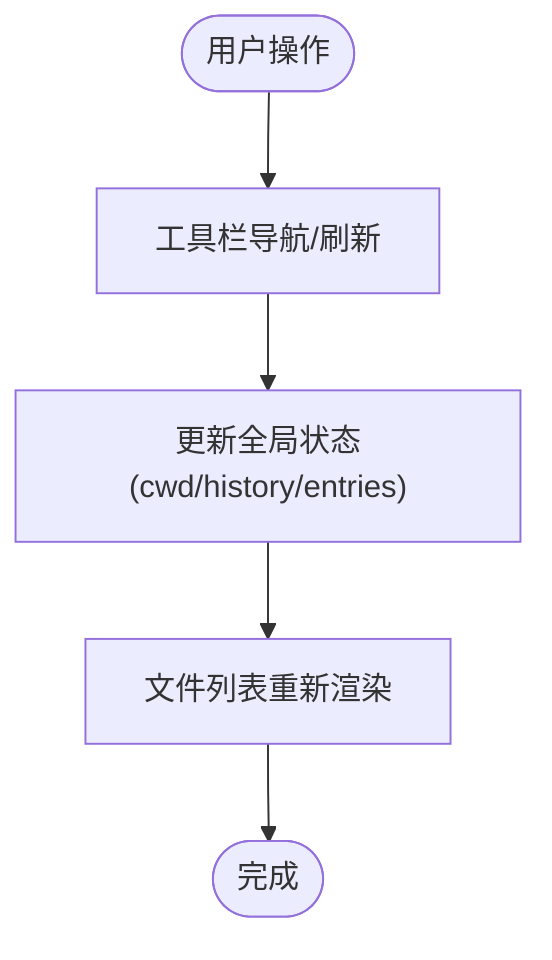

# 工具栏组件

<cite>
**本文引用的文件**
- [Toolbar.tsx](file://src/components/Toolbar.tsx)
- [store.ts](file://src/store.ts)
- [types.ts](file://src/types.ts)
- [App.tsx](file://src/App.tsx)
- [FileList.tsx](file://src/components/FileList.tsx)
- [utils.ts](file://src/utils.ts)
- [api.ts](file://src/api.ts)
- [app.css](file://src/styles/app.css)
</cite>

## 目录
1. [简介](#简介)
2. [项目结构](#项目结构)
3. [核心组件](#核心组件)
4. [架构总览](#架构总览)
5. [详细组件分析](#详细组件分析)
6. [依赖关系分析](#依赖关系分析)
7. [性能考量](#性能考量)
8. [故障排查指南](#故障排查指南)
9. [结论](#结论)
10. [附录](#附录)

## 简介
LocalBro 的工具栏组件位于应用顶部，负责提供文件浏览的核心导航与视图控制能力。它集成了以下功能：
- 导航控制：后退、前进、返回上一级、刷新
- 地址栏与路径面包屑导航：支持双击编辑地址、点击跳转到任意层级
- 视图切换：列表、网格、详情三种模式
- 隐藏文件显示开关
- 选择项集合管理：将选中的条目添加到收藏集合或从当前集合移除
- 收藏集合菜单：查看现有集合、新建集合并将选中项加入

工具栏通过全局状态管理与文件列表组件紧密协作，实现一致的浏览体验与响应式布局。

## 项目结构
工具栏组件位于 src/components/Toolbar.tsx，配合全局状态管理 store.ts 使用，并与 App.tsx、FileList.tsx 等组件共同构成主界面布局。

图表来源
- [App.tsx:106-145](file://src/App.tsx#L106-L145)
- [Toolbar.tsx:1-216](file://src/components/Toolbar.tsx#L1-L216)
- [store.ts:1-308](file://src/store.ts#L1-L308)
- [FileList.tsx:1-197](file://src/components/FileList.tsx#L1-L197)
- [utils.ts:1-66](file://src/utils.ts#L1-L66)
- [api.ts:1-317](file://src/api.ts#L1-L317)
- [app.css:240-303](file://src/styles/app.css#L240-L303)

章节来源
- [App.tsx:106-145](file://src/App.tsx#L106-L145)
- [Toolbar.tsx:1-216](file://src/components/Toolbar.tsx#L1-L216)
- [store.ts:1-308](file://src/store.ts#L1-L308)
- [FileList.tsx:1-197](file://src/components/FileList.tsx#L1-L197)
- [utils.ts:1-66](file://src/utils.ts#L1-L66)
- [api.ts:1-317](file://src/api.ts#L1-L317)
- [app.css:240-303](file://src/styles/app.css#L240-L303)

## 核心组件
- 工具栏组件：提供导航、地址栏、视图切换、隐藏文件开关、集合操作等入口
- 全局状态管理：集中管理当前目录、历史记录、排序、视图模式、选择集、集合等
- 文件列表组件：根据当前视图模式渲染列表、网格或详情视图，并与工具栏共享状态
- 类型系统：统一定义文件条目、快捷方式、视图模式、排序键值等类型
- 工具函数：路径分段、图标映射、格式化等辅助逻辑
- API 封装：与后端（Tauri）通信，执行文件系统操作与集合管理

章节来源
- [Toolbar.tsx:6-216](file://src/components/Toolbar.tsx#L6-L216)
- [store.ts:16-263](file://src/store.ts#L16-L263)
- [FileList.tsx:66-107](file://src/components/FileList.tsx#L66-L107)
- [types.ts:1-37](file://src/types.ts#L1-L37)
- [utils.ts:29-51](file://src/utils.ts#L29-L51)
- [api.ts:138-194](file://src/api.ts#L138-L194)

## 架构总览
工具栏与全局状态的交互遵循“单向数据流”：UI 事件触发状态更新，状态变化驱动渲染；文件列表组件同样订阅状态，实现跨组件一致性。

图表来源
- [Toolbar.tsx:104-108](file://src/components/Toolbar.tsx#L104-L108)
- [store.ts:143-170](file://src/store.ts#L143-L170)
- [FileList.tsx:66-107](file://src/components/FileList.tsx#L66-L107)
- [api.ts:37-57](file://src/api.ts#L37-L57)

## 详细组件分析

### 工具栏组件职责与功能
- 导航按钮：后退、前进、返回上一级、刷新
- 地址栏与面包屑：在非集合路径下展示可编辑地址；在集合路径下展示“收藏夹”标签与集合名称
- 视图切换：列表、网格、详情三种模式
- 隐藏文件开关：仅在非集合路径下启用
- 选择项集合操作：批量添加到集合、从当前集合移除
- 集合菜单：列出所有集合，支持新建集合并将选中项加入

章节来源
- [Toolbar.tsx:101-212](file://src/components/Toolbar.tsx#L101-L212)

### 状态订阅与事件处理
- 订阅全局状态：cwd、history、historyIdx、viewMode、showHidden、collections、selection
- 导航事件：调用 goBack、goForward、goUp、refresh、navigate
- 视图切换：setViewMode
- 隐藏文件：setShowHidden
- 集合操作：addToCollection、removeFromCollection、createCollection

章节来源
- [Toolbar.tsx:7-24](file://src/components/Toolbar.tsx#L7-L24)
- [store.ts:46-71](file://src/store.ts#L46-L71)

### 地址栏与面包屑
- 双击进入编辑模式，支持回车确认或 ESC 取消
- 非集合路径下按层级渲染面包屑，点击任一层级跳转
- 集合路径下显示“收藏夹”与集合名称

章节来源
- [Toolbar.tsx:110-150](file://src/components/Toolbar.tsx#L110-L150)
- [utils.ts:29-51](file://src/utils.ts#L29-L51)

### 视图切换与可用性
- 列表/网格/详情三种模式，对应不同布局与信息密度
- 活动视图按钮高亮，便于识别当前模式
- 详情模式支持列头点击进行排序

章节来源
- [Toolbar.tsx:201-212](file://src/components/Toolbar.tsx#L201-L212)
- [FileList.tsx:133-174](file://src/components/FileList.tsx#L133-L174)

### 集合菜单与选择项操作
- 选中项数量动态显示
- 点击“添加到…”打开菜单，列出所有集合
- 支持新建集合并将选中项加入
- 在集合视图中可从当前集合移除选中项

章节来源
- [Toolbar.tsx:153-189](file://src/components/Toolbar.tsx#L153-L189)
- [store.ts:243-262](file://src/store.ts#L243-L262)

### 与文件列表组件的协作
- 文件列表根据当前视图模式渲染
- 工具栏的导航与刷新会更新 entries，文件列表随之重绘
- 选择集在工具栏与文件列表之间共享，实现一致的多选行为

章节来源
- [FileList.tsx:66-107](file://src/components/FileList.tsx#L66-L107)
- [store.ts:172-185](file://src/store.ts#L172-L185)

### 响应式设计与可用性
- 工具栏采用 Flex 布局，各控件紧凑排列，适配不同窗口尺寸
- 面包屑区域支持横向滚动与省略号，避免过长路径溢出
- 活跃视图按钮高亮，隐藏文件开关禁用时有明确视觉反馈
- 集合菜单定位在选择操作区域下方，避免遮挡内容

章节来源
- [app.css:240-303](file://src/styles/app.css#L240-L303)

### 错误处理与边界情况
- 导航失败时设置错误状态，由文件列表组件统一展示
- 集合操作异常时记录日志并保持界面稳定
- 集合路径下禁用“上一级”与“隐藏文件”开关，防止无效操作

章节来源
- [store.ts:133-135](file://src/store.ts#L133-L135)
- [Toolbar.tsx:92-99](file://src/components/Toolbar.tsx#L92-L99)
- [Toolbar.tsx:106-107](file://src/components/Toolbar.tsx#L106-L107)
- [Toolbar.tsx:195-196](file://src/components/Toolbar.tsx#L195-L196)

### 性能与优化建议
- 集合菜单使用绝对定位，避免频繁重排
- 面包屑渲染使用最小 DOM 结构，减少重绘
- 隐藏文件开关即时刷新目录列表，避免不必要的等待
- 详情模式下的排序通过状态切换触发，避免重复计算

章节来源
- [Toolbar.tsx:161-182](file://src/components/Toolbar.tsx#L161-L182)
- [store.ts:187-197](file://src/store.ts#L187-L197)

## 依赖关系分析
工具栏组件依赖于全局状态管理与工具函数，同时与文件列表组件共享状态，形成清晰的单向数据流。

图表来源
- [Toolbar.tsx:1-5](file://src/components/Toolbar.tsx#L1-L5)
- [store.ts:1-3](file://src/store.ts#L1-L3)
- [FileList.tsx:1-5](file://src/components/FileList.tsx#L1-L5)
- [api.ts:1-3](file://src/api.ts#L1-L3)

章节来源
- [Toolbar.tsx:1-5](file://src/components/Toolbar.tsx#L1-L5)
- [store.ts:1-3](file://src/store.ts#L1-L3)
- [FileList.tsx:1-5](file://src/components/FileList.tsx#L1-L5)
- [api.ts:1-3](file://src/api.ts#L1-L3)

## 性能考量
- 单向数据流：状态变更只影响订阅者，避免循环依赖与重复渲染
- 懒加载与条件渲染：集合菜单仅在需要时展开，减少 DOM 节点数量
- 事件去抖：地址栏编辑提交在失焦或回车时触发，避免频繁请求
- 视图切换：通过状态切换而非重新挂载组件，降低开销

## 故障排查指南
- 导航无响应：检查全局状态中的 cwd 与 history 是否正确更新；确认 API 调用是否抛错
- 面包屑不显示：确认当前路径不是集合路径；检查 pathSegments 的分段逻辑
- 视图切换无效：确认 viewMode 状态已更新；检查文件列表对视图模式的订阅
- 隐藏文件开关失效：确认当前路径不是集合路径；检查 setShowHidden 的刷新逻辑
- 集合操作失败：查看控制台错误日志；确认集合 ID 与选中项路径有效

章节来源
- [store.ts:112-136](file://src/store.ts#L112-L136)
- [utils.ts:29-51](file://src/utils.ts#L29-L51)
- [Toolbar.tsx:191-199](file://src/components/Toolbar.tsx#L191-L199)
- [store.ts:243-262](file://src/store.ts#L243-L262)

## 结论
工具栏组件以简洁直观的方式整合了文件浏览的核心操作，通过全局状态管理与文件列表组件的协同，实现了高效、一致的用户体验。其响应式布局与可用性设计确保在不同场景下都能提供良好的操作体验。未来可在集合菜单中增加搜索与分组、支持键盘快捷键导航等方面进一步增强。

## 附录

### 工具栏与文件列表协作流程

图表来源
- [Toolbar.tsx:104-108](file://src/components/Toolbar.tsx#L104-L108)
- [store.ts:112-136](file://src/store.ts#L112-L136)
- [FileList.tsx:66-107](file://src/components/FileList.tsx#L66-L107)

### 工具栏扩展与自定义指南
- 新增导航按钮：在工具栏中添加按钮并绑定到全局状态的动作函数
- 自定义视图模式：扩展 ViewMode 类型并在工具栏中添加对应按钮
- 集合菜单增强：在集合菜单中添加更多操作（如批量删除、导出）
- 主题适配：通过 CSS 变量调整工具栏颜色与间距，确保与皮肤一致

章节来源
- [types.ts:33-36](file://src/types.ts#L33-L36)
- [app.css:240-303](file://src/styles/app.css#L240-L303)