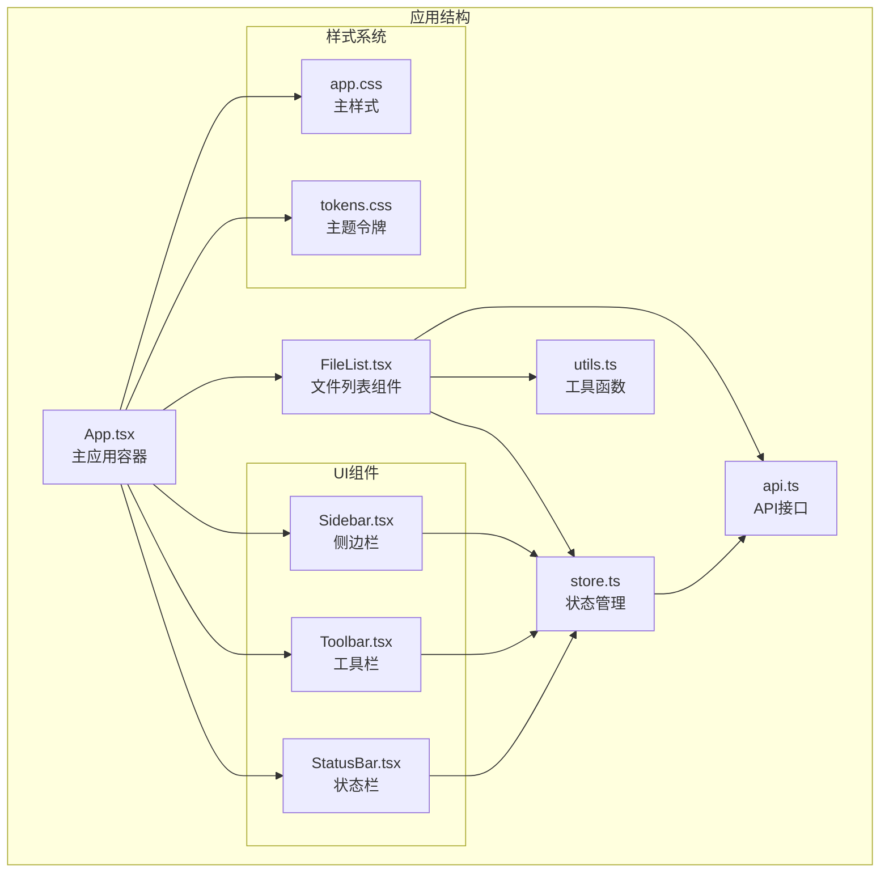
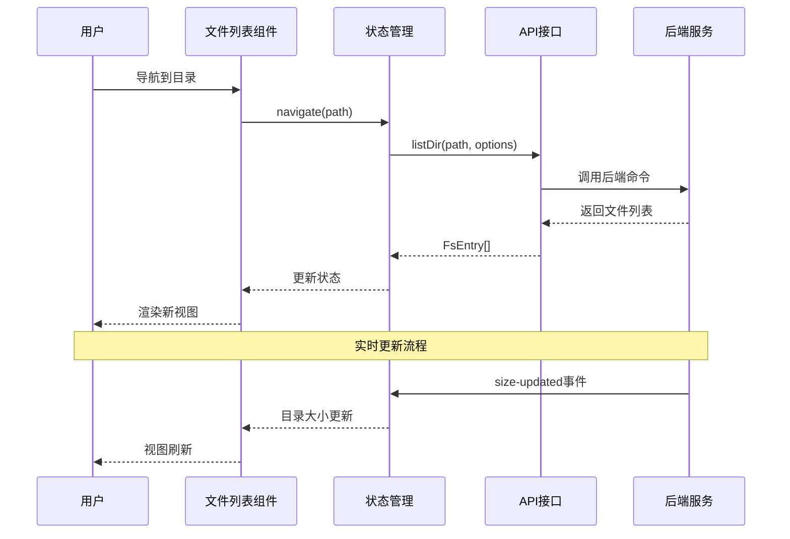
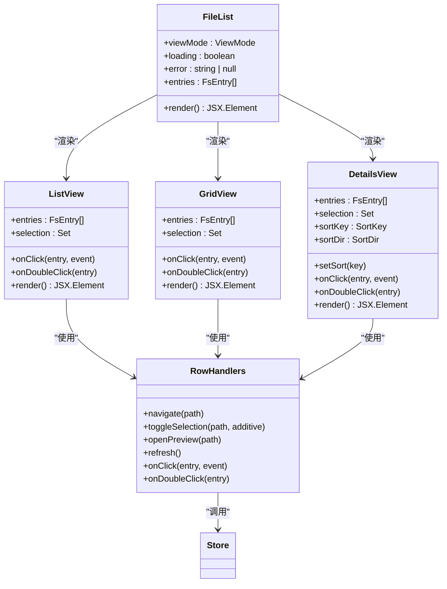
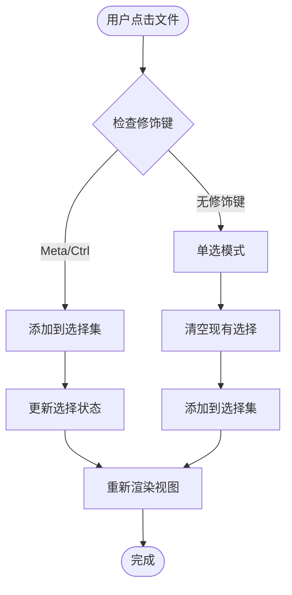
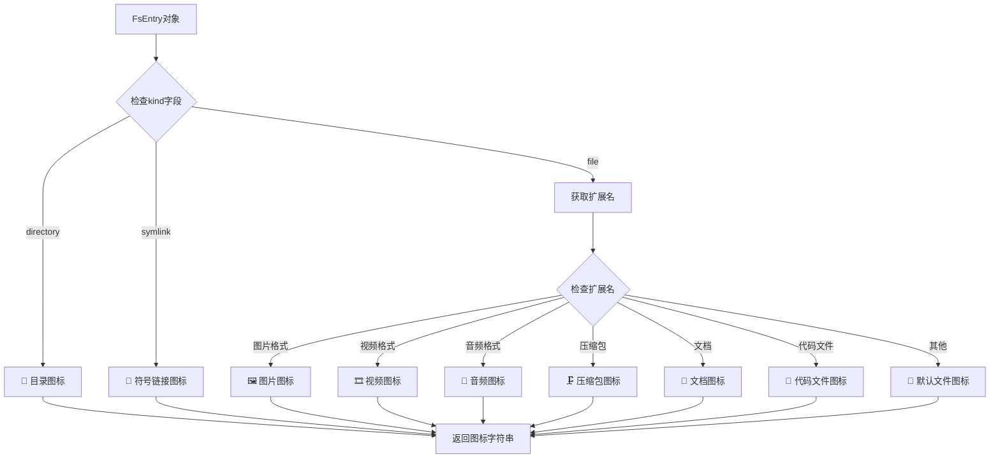
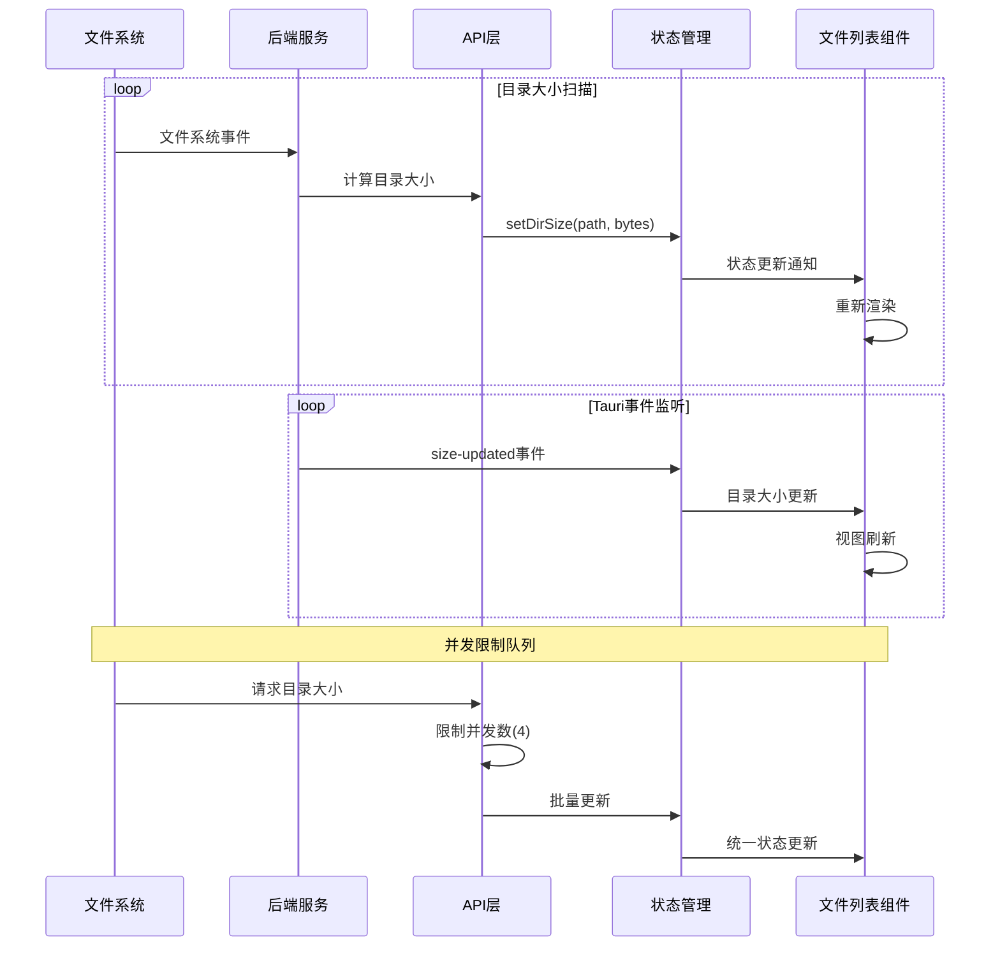
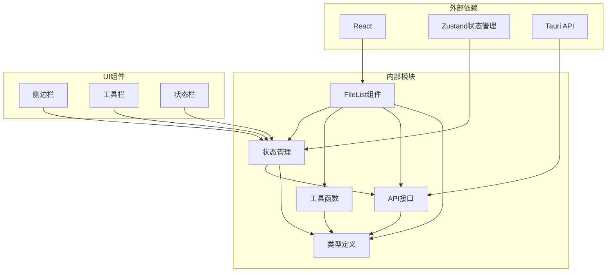
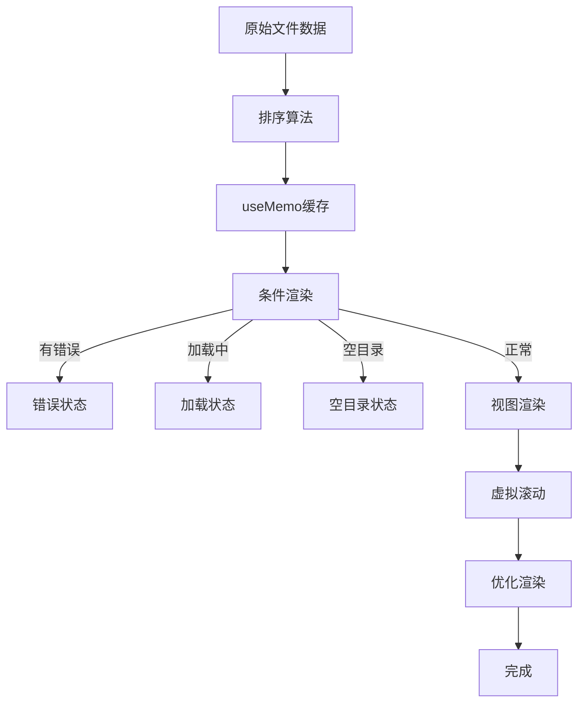

# 文件列表组件

<cite>
**本文档引用的文件**
- [FileList.tsx](file://src/components/FileList.tsx)
- [store.ts](file://src/store.ts)
- [types.ts](file://src/types.ts)
- [utils.ts](file://src/utils.ts)
- [api.ts](file://src/api.ts)
- [App.tsx](file://src/App.tsx)
- [Toolbar.tsx](file://src/components/Toolbar.tsx)
- [Sidebar.tsx](file://src/components/Sidebar.tsx)
- [StatusBar.tsx](file://src/components/StatusBar.tsx)
- [app.css](file://src/styles/app.css)
- [tokens.css](file://src/styles/tokens.css)
</cite>

## 目录
1. [简介](#简介)
2. [项目结构](#项目结构)
3. [核心组件](#核心组件)
4. [架构概览](#架构概览)
5. [详细组件分析](#详细组件分析)
6. [依赖关系分析](#依赖关系分析)
7. [性能考虑](#性能考虑)
8. [故障排除指南](#故障排除指南)
9. [结论](#结论)

## 简介

LocalBro 文件列表组件是整个应用程序的核心界面组件，负责展示文件系统中的文件和文件夹内容。该组件实现了现代化文件管理器的所有关键功能，包括多种视图模式、实时更新机制、虚拟滚动优化以及丰富的用户交互功能。

该组件采用 React + TypeScript 构建，结合 Zustand 状态管理库，提供了高性能、响应式的文件浏览体验。组件支持三种视图模式（列表、网格、详情），具备文件选择、拖拽操作、上下文菜单等高级功能，并通过智能的渲染优化确保在处理大量文件时仍能保持流畅性能。

## 项目结构

LocalBro 采用模块化的项目结构，文件列表组件位于 `src/components/` 目录下，与状态管理、工具函数、API 接口等核心模块紧密协作。

**图表来源**
- [App.tsx:106-145](file://src/App.tsx#L106-L145)
- [FileList.tsx:66-107](file://src/components/FileList.tsx#L66-L107)

**章节来源**
- [FileList.tsx:1-197](file://src/components/FileList.tsx#L1-L197)
- [store.ts:1-308](file://src/store.ts#L1-L308)
- [App.tsx:106-145](file://src/App.tsx#L106-L145)

## 核心组件

文件列表组件由三个主要子组件构成：列表视图、网格视图和详情视图。每个视图都针对不同的使用场景进行了专门优化。

### 主要功能特性

1. **多视图模式支持**
   - 列表视图：适合快速浏览和文件管理
   - 网格视图：适合预览文件图标和名称
   - 详情视图：适合精确控制和文件属性查看

2. **实时更新机制**
   - 自动目录大小扫描队列
   - Tauri 事件监听
   - 即时状态同步

3. **文件选择系统**
   - 单选、多选支持
   - 全选功能
   - 选择状态持久化

4. **文件操作集成**
   - 双击打开文件
   - 右键菜单
   - 快捷键支持

**章节来源**
- [FileList.tsx:66-107](file://src/components/FileList.tsx#L66-L107)
- [store.ts:172-185](file://src/store.ts#L172-L185)

## 架构概览

文件列表组件采用分层架构设计，清晰分离了视图层、状态管理层和数据访问层。

**图表来源**
- [store.ts:112-136](file://src/store.ts#L112-L136)
- [App.tsx:114-122](file://src/App.tsx#L114-L122)
- [api.ts:37-48](file://src/api.ts#L37-L48)

## 详细组件分析

### 文件列表组件架构

文件列表组件采用函数式组件设计，通过自定义 Hook 实现逻辑复用和状态管理。

**图表来源**
- [FileList.tsx:66-197](file://src/components/FileList.tsx#L66-L197)
- [store.ts:172-209](file://src/store.ts#L172-L209)

### 视图模式实现

每种视图模式都有其独特的布局和交互特性：

#### 列表视图
- 垂直排列的文件条目
- 包含图标、名称、大小、修改时间
- 支持悬停高亮和选择状态

#### 网格视图  
- 响应式网格布局
- 大尺寸文件图标预览
- 名称自动换行显示

#### 详情视图
- 表格形式的详细信息
- 可点击的列头进行排序
- 固定的列宽和对齐方式

**章节来源**
- [FileList.tsx:109-197](file://src/components/FileList.tsx#L109-L197)
- [app.css:325-446](file://src/styles/app.css#L325-L446)

### 文件选择系统

文件选择系统支持多种选择模式，提供灵活的用户交互体验。

**图表来源**
- [FileList.tsx:25-64](file://src/components/FileList.tsx#L25-L64)
- [store.ts:172-185](file://src/store.ts#L172-L185)

### 文件类型识别和图标显示

系统通过扩展名识别文件类型，并为不同类型的文件分配相应的图标。

**图表来源**
- [utils.ts:53-65](file://src/utils.ts#L53-L65)
- [types.ts:3-13](file://src/types.ts#L3-L13)

**章节来源**
- [utils.ts:53-65](file://src/utils.ts#L53-L65)
- [types.ts:3-13](file://src/types.ts#L3-L13)

### 实时更新机制

系统实现了多层次的实时更新机制，确保用户界面始终反映最新的文件系统状态。

**图表来源**
- [App.tsx:28-69](file://src/App.tsx#L28-L69)
- [App.tsx:114-122](file://src/App.tsx#L114-L122)
- [store.ts:205-206](file://src/store.ts#L205-L206)

**章节来源**
- [App.tsx:28-69](file://src/App.tsx#L28-L69)
- [App.tsx:114-122](file://src/App.tsx#L114-L122)
- [store.ts:205-206](file://src/store.ts#L205-L206)

## 依赖关系分析

文件列表组件与其他模块之间存在清晰的依赖关系，形成了一个松耦合的架构体系。

**图表来源**
- [FileList.tsx:1-6](file://src/components/FileList.tsx#L1-L6)
- [store.ts:1-5](file://src/store.ts#L1-L5)
- [utils.ts:1-66](file://src/utils.ts#L1-L66)
- [api.ts:1-317](file://src/api.ts#L1-L317)

### 关键依赖关系

1. **状态管理依赖**：文件列表组件完全依赖 Zustand 状态管理，通过 `useBrowser` Hook 访问全局状态。

2. **API接口依赖**：所有文件系统操作都通过统一的 API 层进行，确保了跨平台兼容性。

3. **工具函数依赖**：文件类型识别、格式化等功能通过工具模块提供，保持了代码的可维护性。

4. **样式系统依赖**：组件样式通过 CSS 变量和主题系统实现，支持深色/浅色主题切换。

**章节来源**
- [FileList.tsx:1-6](file://src/components/FileList.tsx#L1-L6)
- [store.ts:1-5](file://src/store.ts#L1-L5)
- [utils.ts:1-66](file://src/utils.ts#L1-L66)

## 性能考虑

文件列表组件在设计时充分考虑了性能优化，特别是在处理大量文件数据时的渲染效率。

### 渲染优化策略

1. **虚拟滚动优化**
   - 使用 React 的 `useMemo` 缓存排序结果
   - 按需渲染可见区域内的文件项
   - 避免不必要的组件重渲染

2. **并发处理**
   - 目录大小扫描采用并发队列（最大4个并发）
   - 异步文件系统操作避免阻塞主线程
   - 事件驱动的状态更新机制

3. **内存管理**
   - 使用 Set 数据结构存储选择状态
   - 及时清理事件监听器和定时器
   - 避免创建不必要的中间数组

### 渲染流程优化

**图表来源**
- [FileList.tsx:18-23](file://src/components/FileList.tsx#L18-L23)
- [FileList.tsx:72-94](file://src/components/FileList.tsx#L72-L94)

**章节来源**
- [FileList.tsx:18-23](file://src/components/FileList.tsx#L18-L23)
- [FileList.tsx:72-94](file://src/components/FileList.tsx#L72-L94)

## 故障排除指南

### 常见问题及解决方案

1. **文件列表不显示**
   - 检查网络连接和权限设置
   - 验证路径是否有效
   - 查看控制台错误信息

2. **视图切换异常**
   - 确认视图模式配置正确
   - 检查 CSS 样式加载情况
   - 验证响应式布局断点

3. **选择功能失效**
   - 检查事件处理器绑定
   - 验证选择状态更新逻辑
   - 确认修饰键检测正确

4. **实时更新不工作**
   - 验证 Tauri 事件监听器
   - 检查后端服务状态
   - 确认并发队列配置

**章节来源**
- [FileList.tsx:72-94](file://src/components/FileList.tsx#L72-L94)
- [App.tsx:114-122](file://src/App.tsx#L114-L122)

## 结论

LocalBro 文件列表组件展现了现代前端开发的最佳实践，通过精心设计的架构和优化策略，成功实现了高性能、易用性强的文件管理功能。

### 主要优势

1. **架构清晰**：模块化设计便于维护和扩展
2. **性能优秀**：虚拟滚动和并发处理确保流畅体验
3. **功能完整**：支持多种视图模式和丰富的交互功能
4. **用户体验**：直观的界面设计和响应式反馈

### 技术亮点

- **状态管理**：Zustand 提供轻量级但强大的状态管理
- **类型安全**：完整的 TypeScript 类型定义确保代码质量
- **样式系统**：基于 CSS 变量的主题系统支持深度定制
- **跨平台**：Tauri 框架实现真正的跨平台部署

该组件为 LocalBro 应用程序奠定了坚实的基础，为用户提供了一个专业级的文件管理体验。