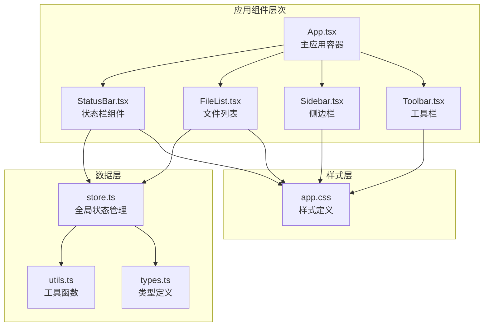
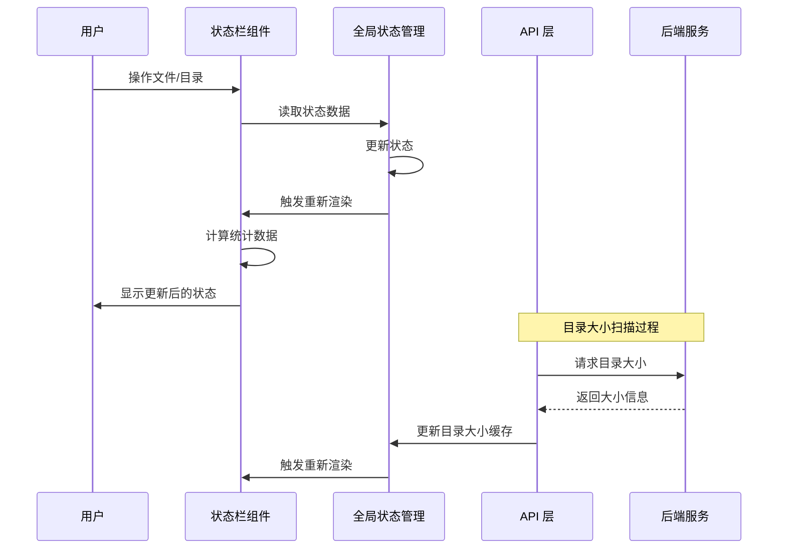
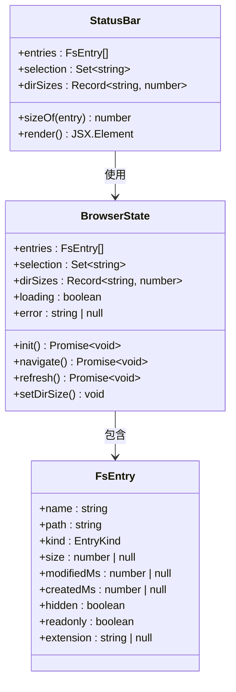
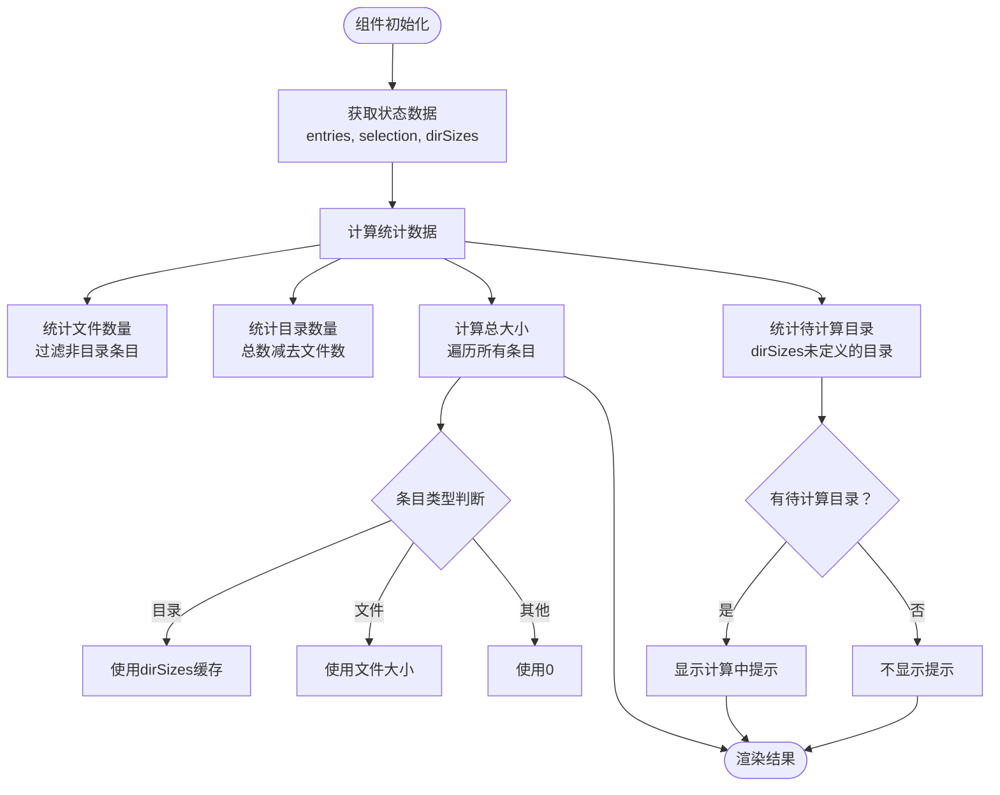
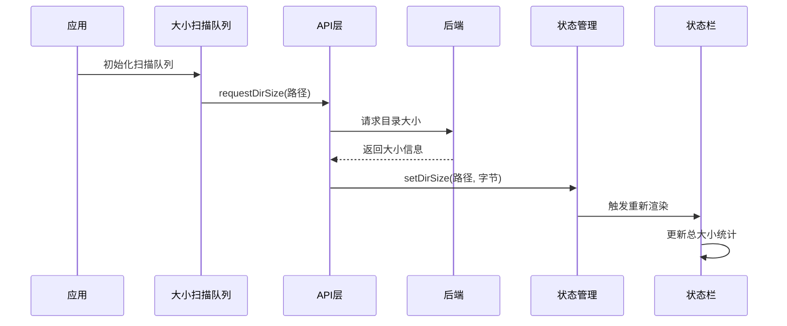
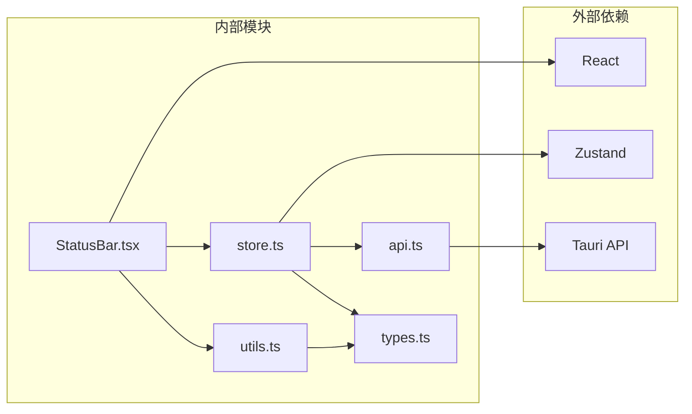

# 状态栏组件

<cite>
**本文档引用的文件**
- [StatusBar.tsx](file://src/components/StatusBar.tsx)
- [store.ts](file://src/store.ts)
- [App.tsx](file://src/App.tsx)
- [utils.ts](file://src/utils.ts)
- [types.ts](file://src/types.ts)
- [api.ts](file://src/api.ts)
- [app.css](file://src/styles/app.css)
- [FileList.tsx](file://src/components/FileList.tsx)
</cite>

## 目录
1. [简介](#简介)
2. [项目结构](#项目结构)
3. [核心组件](#核心组件)
4. [架构概览](#架构概览)
5. [详细组件分析](#详细组件分析)
6. [依赖关系分析](#依赖关系分析)
7. [性能考虑](#性能考虑)
8. [故障排除指南](#故障排除指南)
9. [结论](#结论)

## 简介

LocalBro 的状态栏组件是应用程序界面的重要组成部分，位于应用窗口底部，负责实时显示当前目录的文件统计信息、进度状态和系统状态指示。该组件通过响应式数据绑定，能够动态反映文件操作状态和系统信息的变化，为用户提供直观的操作反馈。

状态栏组件采用简洁的设计理念，主要包含三个信息区域：
- 文件统计信息：显示文件夹数量和文件数量
- 总容量信息：显示当前目录的总大小，并标注正在计算的目录数量
- 选中项信息：当用户选择文件时，显示选中项目的数量和总大小

## 项目结构

状态栏组件位于 `src/components/` 目录下，与应用的主要组件形成清晰的层次结构：

**图表来源**
- [App.tsx:106-145](file://src/App.tsx#L106-L145)
- [StatusBar.tsx:1-38](file://src/components/StatusBar.tsx#L1-L38)

**章节来源**
- [App.tsx:106-145](file://src/App.tsx#L106-L145)
- [StatusBar.tsx:1-38](file://src/components/StatusBar.tsx#L1-L38)

## 核心组件

状态栏组件的核心功能由以下关键要素构成：

### 数据绑定机制
状态栏通过 `useBrowser` Hook 与全局状态管理器建立连接，实时监听以下状态变化：
- `entries`: 当前目录的所有文件条目
- `selection`: 用户选中的文件路径集合
- `dirSizes`: 目录大小缓存映射表

### 计算逻辑
组件内部实现了三种核心计算：
1. **文件统计**：计算文件夹数量和文件数量
2. **容量统计**：计算总大小，支持目录递归大小和文件直接大小
3. **选中项统计**：计算选中项目的数量和总大小

### 实时更新机制
状态栏通过 React 的响应式渲染，在以下情况下自动更新：
- 目录内容发生变化
- 用户进行文件选择操作
- 目录大小扫描完成

**章节来源**
- [StatusBar.tsx:4-37](file://src/components/StatusBar.tsx#L4-L37)
- [store.ts:16-71](file://src/store.ts#L16-L71)

## 架构概览

状态栏组件在整个应用架构中扮演着数据展示层的角色，与上层组件和数据层形成清晰的分层关系：

**图表来源**
- [App.tsx:114-122](file://src/App.tsx#L114-L122)
- [store.ts:205-206](file://src/store.ts#L205-L206)
- [StatusBar.tsx:5-7](file://src/components/StatusBar.tsx#L5-L7)

### 组件间通信流程

状态栏组件通过以下机制与其他组件进行数据同步：

1. **单向数据流**：从全局状态到组件渲染
2. **事件驱动更新**：通过 Tauri 事件接收后端通知
3. **异步数据加载**：支持目录大小的异步计算

**章节来源**
- [App.tsx:28-69](file://src/App.tsx#L28-L69)
- [store.ts:58-62](file://src/store.ts#L58-L62)

## 详细组件分析

### 状态栏组件结构

**图表来源**
- [StatusBar.tsx:4-37](file://src/components/StatusBar.tsx#L4-L37)
- [store.ts:16-71](file://src/store.ts#L16-L71)
- [types.ts:3-13](file://src/types.ts#L3-L13)

### 数据处理算法

状态栏组件实现了高效的统计算法：

**图表来源**
- [StatusBar.tsx:9-19](file://src/components/StatusBar.tsx#L9-L19)
- [StatusBar.tsx:12-16](file://src/components/StatusBar.tsx#L12-L16)

### 布局设计策略

状态栏采用栅格布局系统，具有以下设计特点：

#### 响应式布局
- 使用 CSS Grid 定位在应用网格中的位置
- 支持不同屏幕尺寸的自适应调整
- 采用统一的间距系统（var(--lb-space-*)）

#### 信息层次结构
- **左侧区域**：基础统计信息（文件夹/文件数量）
- **中间区域**：容量统计信息（总大小 + 待计算目录提示）
- **右侧区域**：选中项信息（仅在有选中项时显示）

#### 视觉设计原则
- 使用浅色背景和柔和的边框
- 采用等宽数字字体显示容量值
- 文本颜色采用次级色调，避免视觉干扰
- 间距使用统一的令牌系统

**章节来源**
- [app.css:447-459](file://src/styles/app.css#L447-L459)
- [StatusBar.tsx:21-35](file://src/components/StatusBar.tsx#L21-L35)

### 实时状态同步机制

状态栏通过多种机制确保与应用状态的实时同步：

#### 目录大小扫描集成

**图表来源**
- [App.tsx:28-69](file://src/App.tsx#L28-L69)
- [store.ts:205-206](file://src/store.ts#L205-L206)

#### 错误处理机制
虽然状态栏本身不直接处理错误，但通过全局状态管理器的错误传播机制，能够间接反映系统状态：

- 全局错误状态存储在 `BrowserState.error`
- 文件列表组件负责显示错误信息
- 状态栏专注于正常状态下的数据展示

**章节来源**
- [store.ts:16-21](file://src/store.ts#L16-L21)
- [FileList.tsx:72-78](file://src/components/FileList.tsx#L72-L78)

## 依赖关系分析

状态栏组件的依赖关系体现了清晰的关注点分离：

**图表来源**
- [StatusBar.tsx:1-2](file://src/components/StatusBar.tsx#L1-L2)
- [store.ts:1-4](file://src/store.ts#L1-L4)

### 关键依赖特性

#### 类型安全
- 使用 TypeScript 接口确保数据结构一致性
- 通过 `FsEntry` 类型定义保证文件条目属性的正确性
- 编译时检查减少运行时错误

#### 状态管理
- 采用 Zustand 简化状态管理复杂度
- 单一状态源避免状态不一致问题
- 细粒度的状态订阅提高渲染效率

#### 工具函数复用
- `formatSize` 函数提供统一的大小格式化
- 支持多种单位转换（B, KB, MB, GB, TB, PB）
- 自动数值精度控制

**章节来源**
- [types.ts:1-37](file://src/types.ts#L1-L37)
- [utils.ts:1-12](file://src/utils.ts#L1-L12)

## 性能考虑

状态栏组件在设计时充分考虑了性能优化：

### 渲染优化
- **最小化重渲染**：仅在相关状态变化时更新
- **高效计算**：使用单次遍历完成多项统计计算
- **条件渲染**：选中项信息仅在需要时显示

### 内存管理
- **对象池模式**：避免频繁创建临时对象
- **引用共享**：复用现有的状态引用
- **垃圾回收友好**：及时释放不需要的对象引用

### 异步处理
- **并发扫描**：支持最多4个目录同时计算大小
- **队列管理**：智能的任务调度避免过度负载
- **错误隔离**：单个目录扫描失败不影响整体性能

**章节来源**
- [App.tsx:28-69](file://src/App.tsx#L28-L69)
- [store.ts:205-206](file://src/store.ts#L205-L206)

## 故障排除指南

### 常见问题及解决方案

#### 状态栏不更新
**症状**：切换目录或选择文件后状态栏没有变化
**可能原因**：
- 状态订阅未正确设置
- 全局状态更新失败
- 组件渲染被阻止

**解决步骤**：
1. 检查 `useBrowser` Hook 的使用是否正确
2. 验证状态更新调用链路
3. 确认组件重新渲染触发条件

#### 目录大小显示异常
**症状**：总大小显示为 0 或显示异常值
**可能原因**：
- 目录大小缓存未正确更新
- 异步扫描任务失败
- 数据类型转换错误

**解决步骤**：
1. 检查 `dirSizes` 缓存状态
2. 验证异步扫描队列执行情况
3. 确认数据类型转换逻辑

#### 性能问题
**症状**：大目录浏览时状态栏响应缓慢
**可能原因**：
- 统计计算过于频繁
- 渲染更新过于频繁
- 内存泄漏

**优化建议**：
1. 考虑实现计算结果缓存
2. 优化渲染频率
3. 检查内存使用情况

**章节来源**
- [StatusBar.tsx:9-19](file://src/components/StatusBar.tsx#L9-L19)
- [App.tsx:114-122](file://src/App.tsx#L114-L122)

## 结论

LocalBro 的状态栏组件是一个设计精良、功能完备的界面元素，它成功地将复杂的文件系统信息以简洁直观的方式呈现给用户。通过响应式数据绑定、高效的计算算法和优雅的视觉设计，状态栏不仅提供了丰富的系统状态信息，还保持了良好的用户体验。

组件的关键优势包括：
- **实时性**：通过全局状态管理和事件驱动机制实现实时更新
- **准确性**：精确的文件统计和容量计算
- **可扩展性**：清晰的架构设计便于功能扩展
- **性能优化**：高效的渲染和计算策略

未来可以考虑的改进方向：
- 添加更多系统状态指示器
- 实现更精细的错误处理和用户反馈
- 优化大目录场景下的性能表现
- 增强可访问性支持