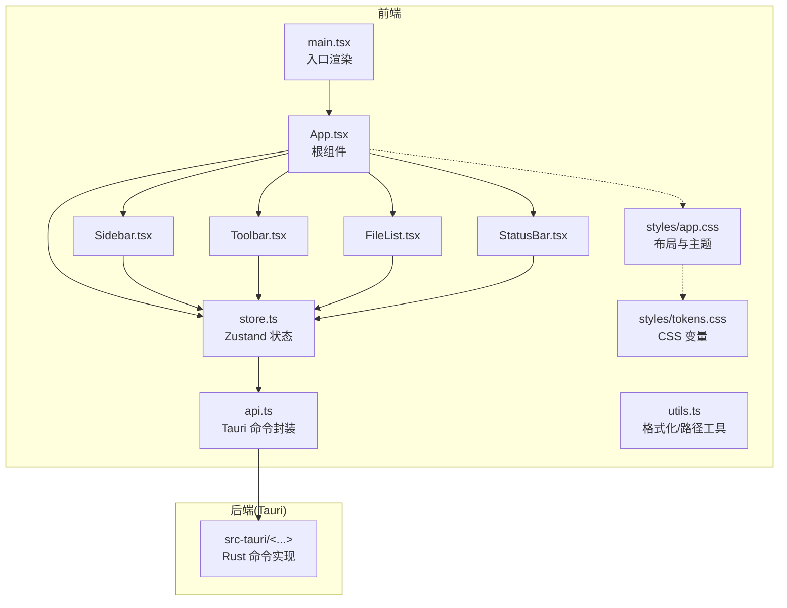
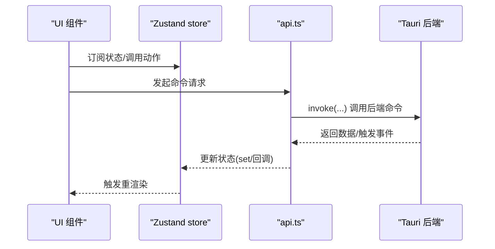
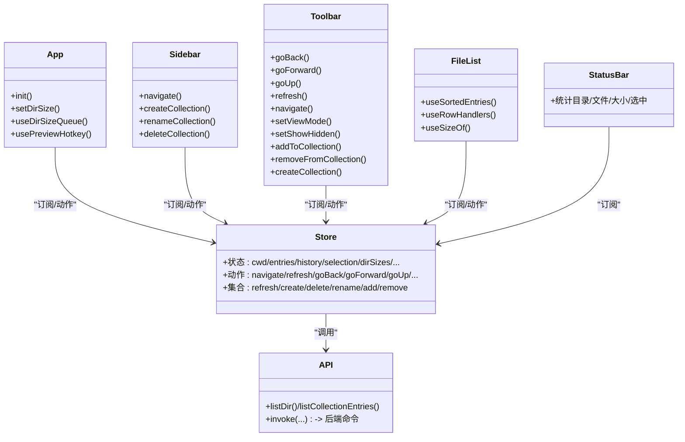
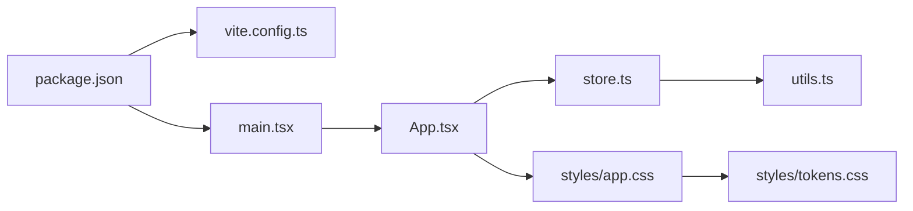
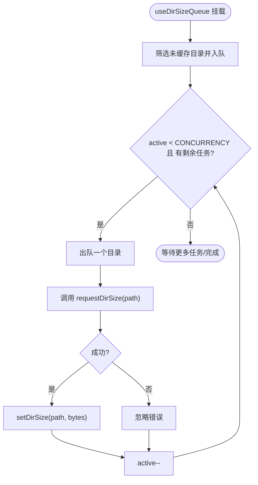
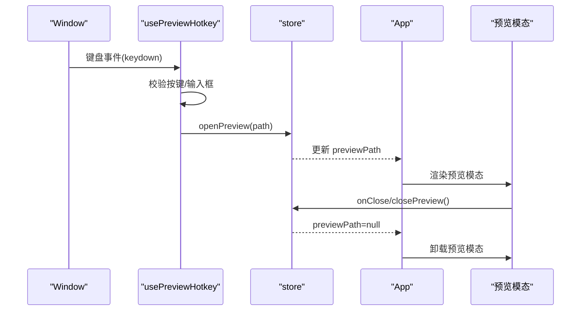

# 组件架构

<cite>
**本文引用的文件**
- [src/App.tsx](file://src/App.tsx)
- [src/main.tsx](file://src/main.tsx)
- [src/store.ts](file://src/store.ts)
- [src/types.ts](file://src/types.ts)
- [src/components/FileList.tsx](file://src/components/FileList.tsx)
- [src/components/Sidebar.tsx](file://src/components/Sidebar.tsx)
- [src/components/Toolbar.tsx](file://src/components/Toolbar.tsx)
- [src/components/StatusBar.tsx](file://src/components/StatusBar.tsx)
- [src/api.ts](file://src/api.ts)
- [src/utils.ts](file://src/utils.ts)
- [src/styles/app.css](file://src/styles/app.css)
- [src/styles/tokens.css](file://src/styles/tokens.css)
- [package.json](file://package.json)
- [vite.config.ts](file://vite.config.ts)
</cite>

## 目录
1. [简介](#简介)
2. [项目结构](#项目结构)
3. [核心组件](#核心组件)
4. [架构总览](#架构总览)
5. [组件详解](#组件详解)
6. [依赖关系分析](#依赖关系分析)
7. [性能与优化](#性能与优化)
8. [测试与调试](#测试与调试)
9. [结论](#结论)
10. [附录](#附录)

## 简介
本文件系统性梳理 LocalBro 的组件架构与设计原则，围绕 React 组件层次、props 传递、状态管理、组件间通信、生命周期与性能优化、组件复用与组合实践、以及测试与调试策略展开，帮助开发者快速理解并高效扩展该应用。

## 项目结构
LocalBro 采用前端与后端（Rust）分离的架构：前端使用 React + TypeScript，通过 @tauri-apps/api 调用后端命令；状态管理采用 Zustand；UI 样式通过 CSS 变量与模块化样式组织。

图示来源
- [src/main.tsx:1-12](file://src/main.tsx#L1-L12)
- [src/App.tsx:100-140](file://src/App.tsx#L100-L140)
- [src/store.ts:73-263](file://src/store.ts#L73-L263)
- [src/api.ts:1-280](file://src/api.ts#L1-L280)
- [src/styles/app.css:1-651](file://src/styles/app.css#L1-L651)
- [src/styles/tokens.css:1-79](file://src/styles/tokens.css#L1-L79)

章节来源
- [src/main.tsx:1-12](file://src/main.tsx#L1-L12)
- [src/App.tsx:100-140](file://src/App.tsx#L100-L140)
- [src/store.ts:73-263](file://src/store.ts#L73-L263)
- [src/api.ts:1-280](file://src/api.ts#L1-L280)
- [src/styles/app.css:1-651](file://src/styles/app.css#L1-L651)
- [src/styles/tokens.css:1-79](file://src/styles/tokens.css#L1-L79)

## 核心组件
- 根组件 App：负责初始化、事件监听、并发目录大小扫描队列、快捷键预览、以及根据状态渲染子组件与预览模态。
- 状态中心 store：集中管理当前工作目录、条目列表、历史导航、选择集、排序与视图、目录大小缓存、预览路径、集合等，并提供导航、刷新、前进后退、集合操作等动作。
- 视图组件：Sidebar（收藏/卷标/集合）、Toolbar（地址栏/导航/视图切换/隐藏项/集合操作）、FileList（列表/网格/详情三种视图）、StatusBar（统计信息）。
- 工具与接口：api.ts 封装 Tauri 命令；utils.ts 提供格式化与路径处理；样式通过 tokens.css 与 app.css 组织。

章节来源
- [src/App.tsx:100-140](file://src/App.tsx#L100-L140)
- [src/store.ts:16-71](file://src/store.ts#L16-L71)
- [src/components/Sidebar.tsx:19-200](file://src/components/Sidebar.tsx#L19-L200)
- [src/components/Toolbar.tsx:6-216](file://src/components/Toolbar.tsx#L6-L216)
- [src/components/FileList.tsx:42-173](file://src/components/FileList.tsx#L42-L173)
- [src/components/StatusBar.tsx:4-38](file://src/components/StatusBar.tsx#L4-L38)
- [src/api.ts:1-280](file://src/api.ts#L1-L280)
- [src/utils.ts:1-66](file://src/utils.ts#L1-L66)

## 架构总览
LocalBro 采用“单向数据流 + 全局状态”的设计：组件通过 hooks 订阅 store 中的状态片段，调用 store 暴露的动作函数以更新状态；后端通过 Tauri 命令返回数据或触发事件，前端在副作用中同步到 store。

图示来源
- [src/store.ts:73-263](file://src/store.ts#L73-L263)
- [src/api.ts:1-280](file://src/api.ts#L1-L280)
- [src/App.tsx:108-116](file://src/App.tsx#L108-L116)

## 组件详解

### 组件层次与职责
- App：顶层容器，负责初始化、事件监听、并发扫描队列、快捷键处理、以及根据状态决定是否渲染预览模态。
- Sidebar：展示收藏、卷标与集合，支持新建/重命名/删除集合，点击导航至对应路径或集合虚拟路径。
- Toolbar：提供导航、地址编辑、视图切换、显示隐藏项、集合添加/移除、刷新等能力。
- FileList：根据当前视图模式渲染列表/网格/详情，处理点击/双击选择与打开预览，按排序规则显示。
- StatusBar：汇总目录/文件数量、总大小、选中统计与待计算目录数。

章节来源
- [src/App.tsx:100-140](file://src/App.tsx#L100-L140)
- [src/components/Sidebar.tsx:19-200](file://src/components/Sidebar.tsx#L19-L200)
- [src/components/Toolbar.tsx:6-216](file://src/components/Toolbar.tsx#L6-L216)
- [src/components/FileList.tsx:42-173](file://src/components/FileList.tsx#L42-L173)
- [src/components/StatusBar.tsx:4-38](file://src/components/StatusBar.tsx#L4-L38)

### props 传递与状态订阅
- 子组件通过 useBrowser(selector) 订阅所需状态片段，避免跨层级传递 props。
- 动作函数以闭包形式注入到子组件，如 navigate、toggleSelection、openPreview、setSort 等。
- FileList 内部通过自定义 hooks（useSortedEntries、useRowHandlers、useSizeOf）封装逻辑，减少重复代码。

章节来源
- [src/components/FileList.tsx:17-40](file://src/components/FileList.tsx#L17-L40)
- [src/components/Toolbar.tsx:6-24](file://src/components/Toolbar.tsx#L6-L24)
- [src/components/Sidebar.tsx:19-28](file://src/components/Sidebar.tsx#L19-L28)

### 组件间通信机制
- 父子通信：通过 hooks 订阅与动作回调完成，无需显式 props 下传。
- 兄弟通信：通过共享的全局状态 store 实现，例如 Toolbar 的集合操作影响 Sidebar 的集合列表。
- 全局状态共享：Zustand store 作为单一事实来源，所有组件只读订阅或写入动作。

章节来源
- [src/store.ts:73-263](file://src/store.ts#L73-L263)
- [src/components/Toolbar.tsx:69-99](file://src/components/Toolbar.tsx#L69-L99)
- [src/components/Sidebar.tsx:34-73](file://src/components/Sidebar.tsx#L34-L73)

### 生命周期管理
- 初始化：App 在首次挂载时执行 init，拉取用户主目录、默认收藏、卷标与集合，并进入用户主目录。
- 事件监听：App 监听后端 size-updated 事件，将目录大小写入 store。
- 并发扫描：useDirSizeQueue 基于 entries 与 dirSizes 计算未缓存目录，限制并发度进行批量扫描。
- 快捷键：usePreviewHotkey 处理空格键打开/关闭预览，避免在输入框内触发。
- 清理：各 useEffect 返回清理函数，确保事件解绑与取消任务。

章节来源
- [src/App.tsx:108-119](file://src/App.tsx#L108-L119)
- [src/App.tsx:23-63](file://src/App.tsx#L23-L63)
- [src/App.tsx:66-98](file://src/App.tsx#L66-L98)

### 数据流与排序
- 排序：store 内部提供 sortEntries，FileList 使用 useMemo 仅在 entries、sortKey、sortDir 变化时重新排序。
- 目录大小：FileList 通过 useSizeOf 优先使用索引缓存值；StatusBar 统计选中与全部条目的大小。

章节来源
- [src/store.ts:278-307](file://src/store.ts#L278-L307)
- [src/components/FileList.tsx:7-22](file://src/components/FileList.tsx#L7-L22)
- [src/components/StatusBar.tsx:9-19](file://src/components/StatusBar.tsx#L9-L19)

### 预览与模态
- 预览触发：双击文件或空格键打开；预览路径来自 store.previewPath。
- 导航与关闭：预览模态暴露 onNavigate 与 onClose 回调，由 store 动作控制。

章节来源
- [src/App.tsx:121-136](file://src/App.tsx#L121-L136)
- [src/App.tsx:66-98](file://src/App.tsx#L66-L98)
- [src/store.ts:208-209](file://src/store.ts#L208-L209)

### 类图（组件与状态）

图示来源
- [src/App.tsx:100-140](file://src/App.tsx#L100-L140)
- [src/components/Sidebar.tsx:19-200](file://src/components/Sidebar.tsx#L19-L200)
- [src/components/Toolbar.tsx:6-216](file://src/components/Toolbar.tsx#L6-L216)
- [src/components/FileList.tsx:42-173](file://src/components/FileList.tsx#L42-L173)
- [src/components/StatusBar.tsx:4-38](file://src/components/StatusBar.tsx#L4-L38)
- [src/store.ts:73-263](file://src/store.ts#L73-L263)
- [src/api.ts:1-280](file://src/api.ts#L1-L280)

## 依赖关系分析
- 运行时依赖：React、ReactDOM、@tauri-apps/api、zustand。
- 开发依赖：@vitejs/plugin-react、TypeScript、Vite、@tauri/cli。
- Vite 配置：固定开发端口、禁用清屏、忽略 src-tauri 目录监控、支持 HMR。

图示来源
- [package.json:1-28](file://package.json#L1-L28)
- [vite.config.ts:1-33](file://vite.config.ts#L1-L33)
- [src/main.tsx:1-12](file://src/main.tsx#L1-L12)
- [src/App.tsx:100-140](file://src/App.tsx#L100-L140)
- [src/store.ts:73-263](file://src/store.ts#L73-L263)
- [src/utils.ts:1-66](file://src/utils.ts#L1-L66)
- [src/styles/app.css:1-651](file://src/styles/app.css#L1-L651)
- [src/styles/tokens.css:1-79](file://src/styles/tokens.css#L1-L79)

章节来源
- [package.json:1-28](file://package.json#L1-L28)
- [vite.config.ts:1-33](file://vite.config.ts#L1-L33)

## 性能与优化
- 状态粒度与订阅：组件仅订阅所需字段，降低重渲染范围。
- 计算结果缓存：useMemo 包裹排序与派生计算，避免每次渲染都重新排序。
- 并发控制：目录大小扫描限制并发度，避免阻塞 UI。
- 事件去抖与清理：useEffect 返回清理函数，防止内存泄漏与重复绑定。
- 视图切换与懒加载：Grid/Details/List 三视图按需渲染，结合 CSS 与布局优化滚动性能。
- 样式变量：通过 tokens.css 统一主题变量，便于皮肤替换与暗色模式适配。

章节来源
- [src/components/FileList.tsx:17-22](file://src/components/FileList.tsx#L17-L22)
- [src/App.tsx:23-63](file://src/App.tsx#L23-L63)
- [src/styles/app.css:1-651](file://src/styles/app.css#L1-L651)
- [src/styles/tokens.css:1-79](file://src/styles/tokens.css#L1-L79)

## 测试与调试
- 单元测试建议
  - store 动作：对 navigate/refresh/goBack/goForward/setSort 等进行参数与状态断言。
  - 工具函数：对 formatSize/formatDate/pathSegments/iconFor 进行边界与异常输入测试。
  - 排序逻辑：针对 sortEntries 的多键排序与目录优先策略编写用例。
- 集成测试建议
  - 组件交互：模拟 Toolbar 的集合操作对 Sidebar 与 FileList 的影响。
  - 预览流程：从 FileList 双击到 App 预览模态的完整链路。
- 调试技巧
  - 使用 React DevTools 审查组件树与 hooks 状态。
  - 在 store 中打印关键动作与状态变化，定位异步流程问题。
  - 利用浏览器网络面板观察 Tauri invoke 请求与响应。
  - 对并发扫描与键盘事件进行日志记录，排查竞态与重复触发。

章节来源
- [src/store.ts:73-263](file://src/store.ts#L73-L263)
- [src/utils.ts:1-66](file://src/utils.ts#L1-L66)
- [src/components/FileList.tsx:17-40](file://src/components/FileList.tsx#L17-L40)

## 结论
LocalBro 的组件架构以 Zustand 为核心，结合 Tauri 命令实现前后端协同，形成清晰的单向数据流与高内聚低耦合的组件体系。通过 hooks 订阅与动作封装、合理的并发与缓存策略、以及模块化的样式与工具函数，既保证了可维护性，也兼顾了性能与可扩展性。遵循本文的复用与组合最佳实践，可进一步提升开发效率与质量。

## 附录

### 关键流程图：目录大小扫描队列

图示来源
- [src/App.tsx:23-63](file://src/App.tsx#L23-L63)
- [src/api.ts:115-121](file://src/api.ts#L115-L121)
- [src/store.ts:205-206](file://src/store.ts#L205-L206)

### 关键序列图：打开预览快捷键

图示来源
- [src/App.tsx:66-98](file://src/App.tsx#L66-L98)
- [src/store.ts:208-209](file://src/store.ts#L208-L209)
- [src/App.tsx:121-136](file://src/App.tsx#L121-L136)