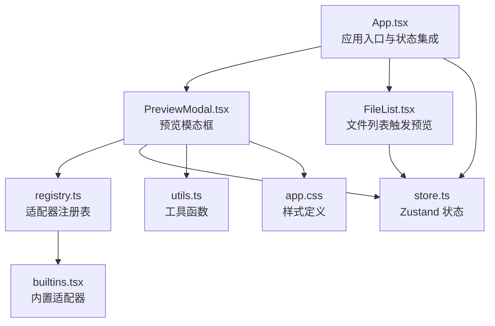
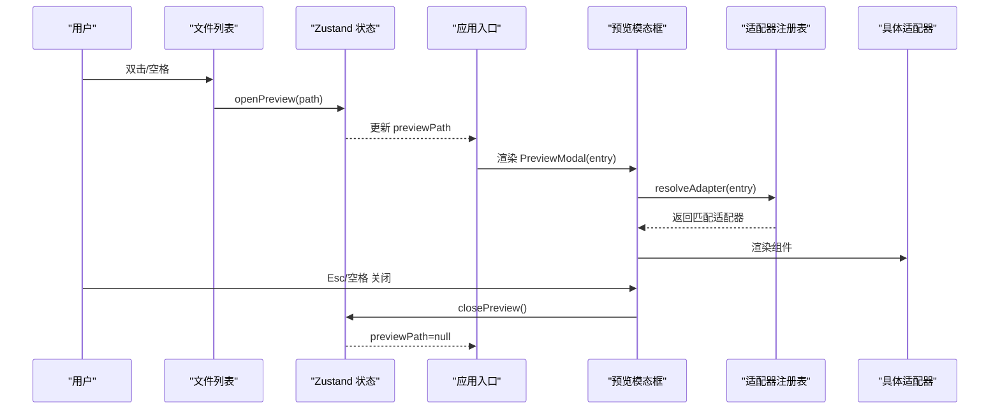
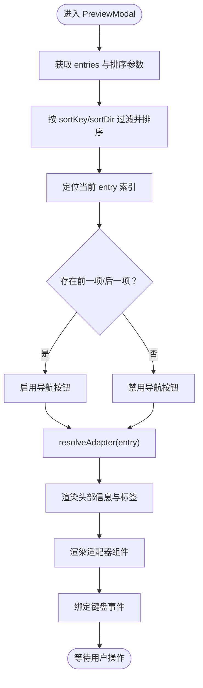
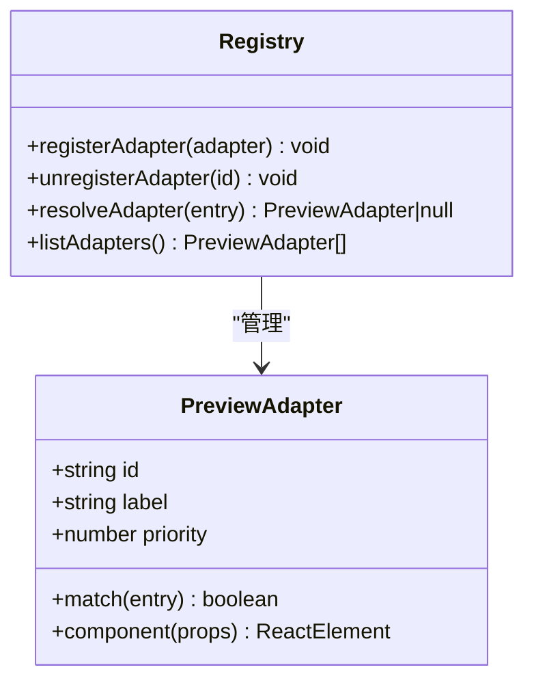
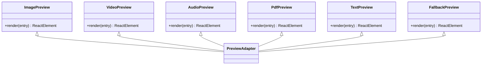
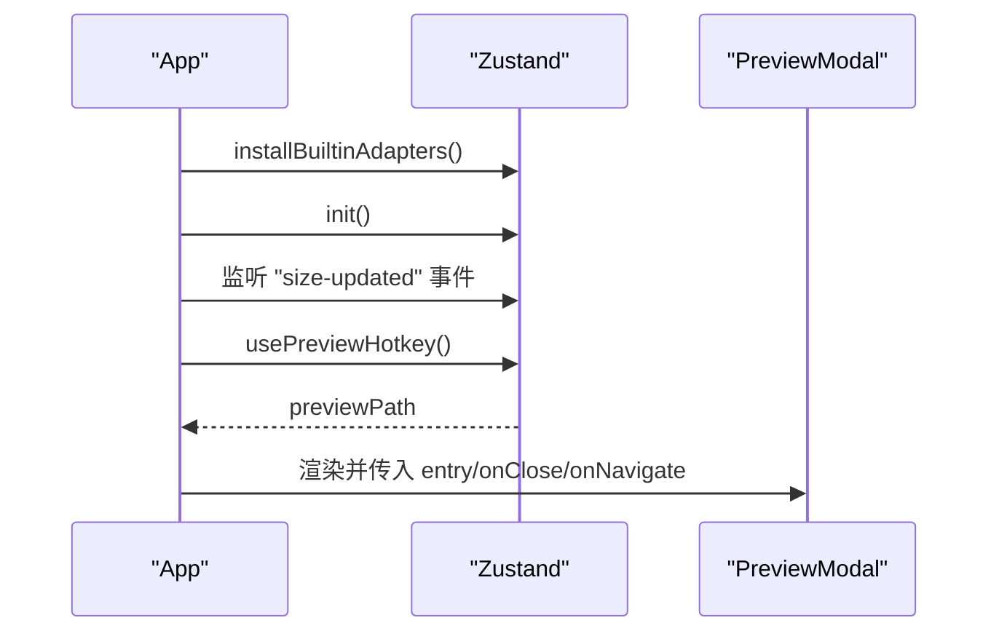
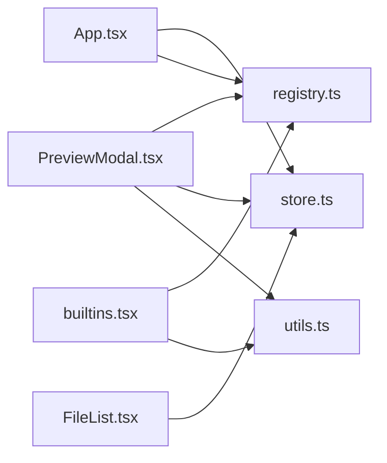

# 预览模态框组件

<cite>
**本文档引用的文件**
- [src/App.tsx](file://src/App.tsx)
- [src/components/PreviewModal.tsx](file://src/components/PreviewModal.tsx)
- [src/components/FileList.tsx](file://src/components/FileList.tsx)
- [src/preview/registry.ts](file://src/preview/registry.ts)
- [src/preview/builtins.tsx](file://src/preview/builtins.tsx)
- [src/store.ts](file://src/store.ts)
- [src/types.ts](file://src/types.ts)
- [src/utils.ts](file://src/utils.ts)
- [src/styles/app.css](file://src/styles/app.css)
</cite>

## 目录
1. [简介](#简介)
2. [项目结构](#项目结构)
3. [核心组件](#核心组件)
4. [架构总览](#架构总览)
5. [详细组件分析](#详细组件分析)
6. [依赖关系分析](#依赖关系分析)
7. [性能考虑](#性能考虑)
8. [故障排除指南](#故障排除指南)
9. [结论](#结论)
10. [附录](#附录)

## 简介
本文件为 LocalBro 的预览模态框组件提供系统化技术文档。该组件负责在用户选择文件后以模态框形式展示文件内容，并通过“适配器”机制支持多种文件类型的预览（图片、视频、音频、PDF、文本等）。文档涵盖：
- 设计目的：提供快速、直观的文件预览体验，减少切换窗口或外部应用的需要
- 实现架构：基于“适配器注册表”的可扩展预览体系
- 文件类型支持：内置图片、视频、音频、PDF、文本等适配器
- 交互机制：键盘快捷键、鼠标点击、前后导航
- 动画与体验：背景遮罩、尺寸与布局、响应式样式
- 扩展性：如何新增自定义适配器与插件系统
- 与主应用状态集成：Zustand 状态管理、事件监听与热键绑定

## 项目结构
预览模态框组件位于前端 React 层，与状态管理、文件列表、样式系统紧密协作：
- 应用入口与状态：App 组件负责初始化皮肤、注册内置适配器、监听目录大小更新事件，并根据状态渲染预览模态框
- 预览模态框：PreviewModal 负责渲染头部信息、调用适配器组件、处理键盘导航与关闭逻辑
- 适配器注册表：registry 提供统一的适配器注册、排序与解析接口
- 内置适配器：builtins 定义图片、视频、音频、PDF、文本等适配器及其匹配规则
- 文件列表：FileList 触发预览行为（双击或空格）
- 样式系统：app.css 定义模态框外观与各适配器的专用样式

图表来源
- [src/App.tsx:106-145](file://src/App.tsx#L106-L145)
- [src/components/PreviewModal.tsx:13-82](file://src/components/PreviewModal.tsx#L13-L82)
- [src/preview/registry.ts:29-57](file://src/preview/registry.ts#L29-L57)
- [src/preview/builtins.tsx:185-190](file://src/preview/builtins.tsx#L185-L190)
- [src/store.ts:73-263](file://src/store.ts#L73-L263)
- [src/utils.ts:53-65](file://src/utils.ts#L53-L65)
- [src/styles/app.css:461-651](file://src/styles/app.css#L461-L651)

章节来源
- [src/App.tsx:106-145](file://src/App.tsx#L106-L145)
- [src/components/PreviewModal.tsx:13-82](file://src/components/PreviewModal.tsx#L13-L82)
- [src/preview/registry.ts:29-57](file://src/preview/registry.ts#L29-L57)
- [src/preview/builtins.tsx:185-190](file://src/preview/builtins.tsx#L185-L190)
- [src/store.ts:73-263](file://src/store.ts#L73-L263)
- [src/utils.ts:53-65](file://src/utils.ts#L53-L65)
- [src/styles/app.css:461-651](file://src/styles/app.css#L461-L651)

## 核心组件
- 预览模态框（PreviewModal）：接收当前条目、关闭回调与导航回调，解析适配器并渲染对应组件；支持 Esc/空格关闭，左右箭头在同级文件间导航
- 适配器注册表（registry）：维护适配器数组，按优先级排序，提供注册、注销与解析能力
- 内置适配器（builtins）：定义图片、视频、音频、PDF、文本与回退适配器，按扩展名或类型匹配
- 应用入口（App）：初始化皮肤与内置适配器，监听目录大小事件，根据 previewPath 渲染模态框
- 文件列表（FileList）：双击非目录项触发预览，或在空格热键下打开第一个选中文件
- 状态管理（store）：维护 previewPath，提供 openPreview/closePreview 动作
- 工具函数（utils）：图标映射、格式化显示等

章节来源
- [src/components/PreviewModal.tsx:13-82](file://src/components/PreviewModal.tsx#L13-L82)
- [src/preview/registry.ts:29-57](file://src/preview/registry.ts#L29-L57)
- [src/preview/builtins.tsx:140-183](file://src/preview/builtins.tsx#L140-L183)
- [src/App.tsx:106-145](file://src/App.tsx#L106-L145)
- [src/components/FileList.tsx:36-61](file://src/components/FileList.tsx#L36-L61)
- [src/store.ts:208-209](file://src/store.ts#L208-L209)
- [src/utils.ts:53-65](file://src/utils.ts#L53-L65)

## 架构总览
预览模态框采用“适配器模式”，通过注册表集中管理不同文件类型的渲染组件。流程如下：
- 用户操作（双击/空格）触发 openPreview
- App 根据 previewPath 渲染 PreviewModal
- PreviewModal 解析适配器并渲染对应组件
- 键盘事件驱动导航与关闭
- 样式系统提供统一的视觉风格

图表来源
- [src/components/FileList.tsx:36-61](file://src/components/FileList.tsx#L36-L61)
- [src/store.ts:208-209](file://src/store.ts#L208-L209)
- [src/App.tsx:127-142](file://src/App.tsx#L127-L142)
- [src/components/PreviewModal.tsx:45-46](file://src/components/PreviewModal.tsx#L45-L46)
- [src/preview/registry.ts:44-53](file://src/preview/registry.ts#L44-L53)

## 详细组件分析

### 预览模态框（PreviewModal）
- 职责：渲染预览头部（图标、名称、大小、适配器标签）、主体内容（由适配器组件渲染）、底部导航按钮与关闭按钮
- 导航逻辑：使用当前排序规则对同级文件进行排序，定位当前索引并计算前一项与后一项
- 键盘事件：Esc/空格关闭；左右箭头在有相邻文件时导航
- 适配器解析：通过 resolveAdapter(entry) 获取组件类型并渲染

图表来源
- [src/components/PreviewModal.tsx:19-26](file://src/components/PreviewModal.tsx#L19-L26)
- [src/components/PreviewModal.tsx:45-46](file://src/components/PreviewModal.tsx#L45-L46)
- [src/components/PreviewModal.tsx:48-81](file://src/components/PreviewModal.tsx#L48-L81)

章节来源
- [src/components/PreviewModal.tsx:13-82](file://src/components/PreviewModal.tsx#L13-L82)

### 适配器注册表（registry）
- 结构：适配器对象包含 id、label、priority、match、component 字段
- 注册：registerAdapter 支持重复注册替换，随后按 priority 降序排序
- 解析：resolveAdapter 按顺序尝试匹配，忽略异常适配器
- 列表：listAdapters 返回当前已注册适配器快照

图表来源
- [src/preview/registry.ts:16-27](file://src/preview/registry.ts#L16-L27)
- [src/preview/registry.ts:31-57](file://src/preview/registry.ts#L31-L57)

章节来源
- [src/preview/registry.ts:29-57](file://src/preview/registry.ts#L29-L57)

### 内置适配器（builtins）
- 图片：支持常见图片格式，使用原生 img 标签
- 视频：支持常见视频格式，使用 video 标签并自动播放
- 音频：支持常见音频格式，显示元信息与播放控件
- PDF：使用 embed 嵌入 PDF
- 文本：异步读取文本内容，限制最大读取大小，支持截断提示
- 回退：当无适配器可用时显示文件基本信息与提示

图表来源
- [src/preview/builtins.tsx:27-34](file://src/preview/builtins.tsx#L27-L34)
- [src/preview/builtins.tsx:38-45](file://src/preview/builtins.tsx#L38-L45)
- [src/preview/builtins.tsx:49-61](file://src/preview/builtins.tsx#L49-L61)
- [src/preview/builtins.tsx:65-72](file://src/preview/builtins.tsx#L65-L72)
- [src/preview/builtins.tsx:76-115](file://src/preview/builtins.tsx#L76-L115)
- [src/preview/builtins.tsx:119-138](file://src/preview/builtins.tsx#L119-L138)

章节来源
- [src/preview/builtins.tsx:14-23](file://src/preview/builtins.tsx#L14-L23)
- [src/preview/builtins.tsx:27-138](file://src/preview/builtins.tsx#L27-L138)

### 应用入口与状态集成（App）
- 初始化：安装内置适配器、应用皮肤、监听目录大小事件
- 预览热键：空格键打开/关闭预览；焦点不在输入框时生效
- 预览渲染：根据 previewPath 查找条目并传入 PreviewModal

图表来源
- [src/App.tsx:10-15](file://src/App.tsx#L10-L15)
- [src/App.tsx:114-122](file://src/App.tsx#L114-L122)
- [src/App.tsx:72-103](file://src/App.tsx#L72-L103)
- [src/App.tsx:127-142](file://src/App.tsx#L127-L142)

章节来源
- [src/App.tsx:10-15](file://src/App.tsx#L10-L15)
- [src/App.tsx:72-103](file://src/App.tsx#L72-L103)
- [src/App.tsx:127-142](file://src/App.tsx#L127-L142)

### 文件列表交互（FileList）
- 单击：切换选择（支持多选）
- 双击：若为目录则导航，否则触发预览；对于压缩包提供解压选项
- 预览入口：openPreview(entry.path)

章节来源
- [src/components/FileList.tsx:25-64](file://src/components/FileList.tsx#L25-L64)

### 样式与视觉（app.css）
- 背景遮罩：固定定位、半透明背景、居中布局
- 模态框容器：固定宽高上限、圆角边框、阴影
- 头部区域：图标、名称、大小、适配器标签、导航按钮、关闭按钮
- 各适配器样式：图片、视频、音频、PDF、文本、回退组件的专用布局与尺寸

章节来源
- [src/styles/app.css:461-519](file://src/styles/app.css#L461-L519)
- [src/styles/app.css:576-651](file://src/styles/app.css#L576-L651)

## 依赖关系分析
- 组件耦合
  - PreviewModal 依赖 registry 解析适配器，依赖 store 获取 entries 与排序参数，依赖 utils 提供图标与格式化
  - App 依赖 store 管理 previewPath，依赖 registry 安装内置适配器
  - FileList 依赖 store 触发 openPreview
- 外部依赖
  - @tauri-apps/api：convertFileSrc 用于本地文件路径转换
  - @tauri-apps/api/event：事件监听
  - Zustand：状态管理
- 循环依赖
  - 未发现循环依赖：registry 仅被注册，不反向依赖组件；组件通过注册表间接使用

图表来源
- [src/components/PreviewModal.tsx:1-5](file://src/components/PreviewModal.tsx#L1-L5)
- [src/App.tsx:1-11](file://src/App.tsx#L1-L11)
- [src/components/FileList.tsx:1-5](file://src/components/FileList.tsx#L1-L5)
- [src/preview/builtins.tsx:1-10](file://src/preview/builtins.tsx#L1-L10)

章节来源
- [src/components/PreviewModal.tsx:1-5](file://src/components/PreviewModal.tsx#L1-L5)
- [src/App.tsx:1-11](file://src/App.tsx#L1-L11)
- [src/components/FileList.tsx:1-5](file://src/components/FileList.tsx#L1-L5)
- [src/preview/builtins.tsx:1-10](file://src/preview/builtins.tsx#L1-L10)

## 性能考虑
- 适配器解析：resolveAdapter 逐个尝试匹配，优先级排序确保高效命中；异常适配器被忽略，避免影响整体性能
- 文本预览：限制最大读取大小，防止大文件导致内存压力与渲染卡顿
- 导航计算：仅在 entries、排序参数或当前条目变化时重新计算前后项，避免频繁排序
- 图片/视频/音频：使用原生媒体元素，浏览器层面优化加载与播放
- 样式：CSS 自定义属性与响应式布局，减少重排与重绘

## 故障排除指南
- 无法打开预览
  - 检查是否为目录（目录不触发预览）
  - 检查 previewPath 是否正确设置
  - 检查是否有匹配的适配器
- 预览空白或报错
  - 文本过大被截断：调整读取上限或分页加载
  - 媒体格式不受支持：确认扩展名是否在内置列表中
  - 权限问题：检查文件访问权限
- 导航无效
  - 当前视图可能无相邻文件：检查排序与过滤条件
  - 键盘事件被输入框拦截：确保焦点不在输入框内
- 适配器冲突
  - 优先级相同：调整 priority 或修改 match 条件
  - 适配器异常：检查 match 函数与组件渲染逻辑

章节来源
- [src/components/PreviewModal.tsx:28-43](file://src/components/PreviewModal.tsx#L28-L43)
- [src/preview/builtins.tsx:76-115](file://src/preview/builtins.tsx#L76-L115)
- [src/preview/registry.ts:44-53](file://src/preview/registry.ts#L44-L53)

## 结论
LocalBro 的预览模态框组件通过“适配器注册表”实现了高度可扩展的文件预览能力。其设计将渲染逻辑与匹配规则分离，既保证了内置适配器的稳定运行，也为后续插件系统预留了扩展空间。配合键盘快捷键、导航与样式系统，提供了良好的用户体验。未来可通过新增适配器与优化媒体加载策略进一步提升性能与覆盖度。

## 附录

### 新增文件类型支持步骤
- 定义适配器
  - 创建组件：接收 entry 参数并渲染内容
  - 定义匹配规则：根据扩展名或类型判断是否适用
  - 设置优先级：决定与其他适配器的匹配顺序
- 注册适配器
  - 在模块加载时调用 registerAdapter 注册
  - 若需热更新，支持重复注册替换
- 集成到主应用
  - 确保入口处已安装内置适配器
  - 预览模态框会自动解析并渲染

章节来源
- [src/preview/registry.ts:31-37](file://src/preview/registry.ts#L31-L37)
- [src/preview/builtins.tsx:185-190](file://src/preview/builtins.tsx#L185-L190)

### 与主应用状态的集成要点
- 状态字段：previewPath 控制模态框显示与隐藏
- 动作函数：openPreview/closePreview 更新状态
- 事件监听：应用层监听后端事件并更新目录大小
- 预览热键：空格键在合适时机打开/关闭预览

章节来源
- [src/store.ts:34-35](file://src/store.ts#L34-L35)
- [src/store.ts:208-209](file://src/store.ts#L208-L209)
- [src/App.tsx:72-103](file://src/App.tsx#L72-L103)
- [src/App.tsx:114-122](file://src/App.tsx#L114-L122)