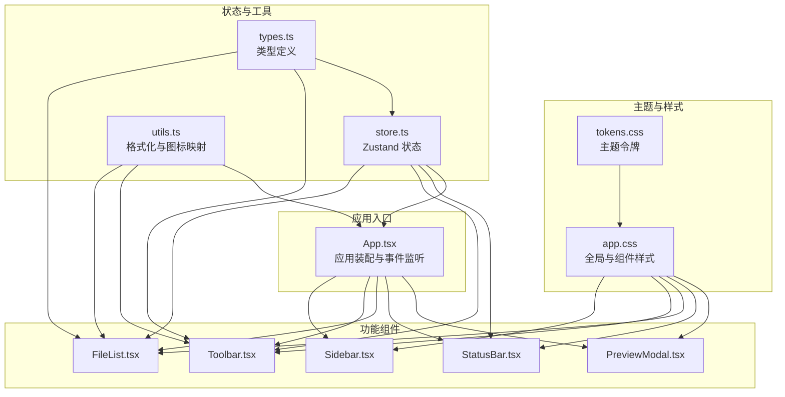
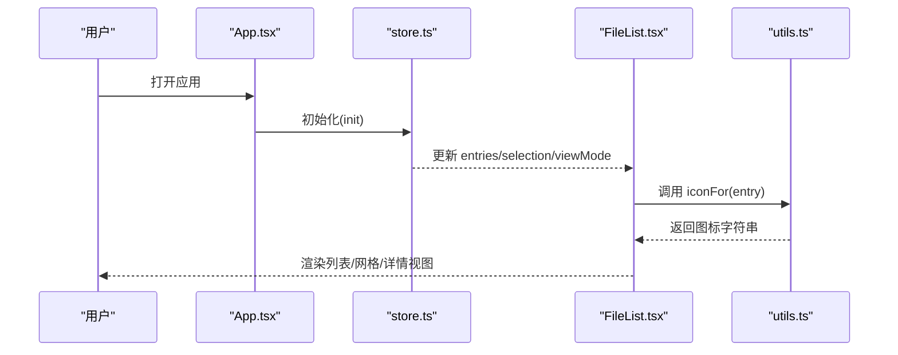
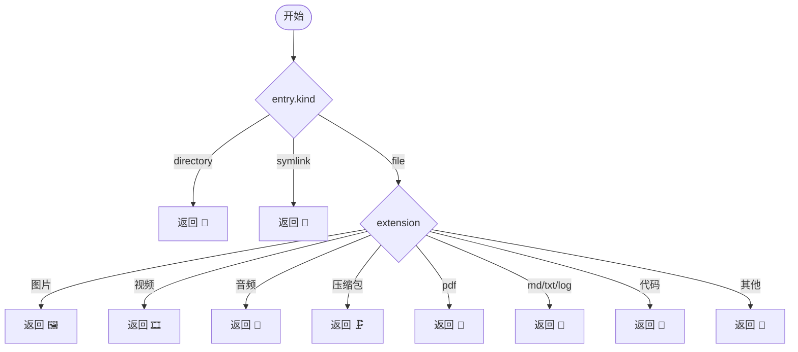
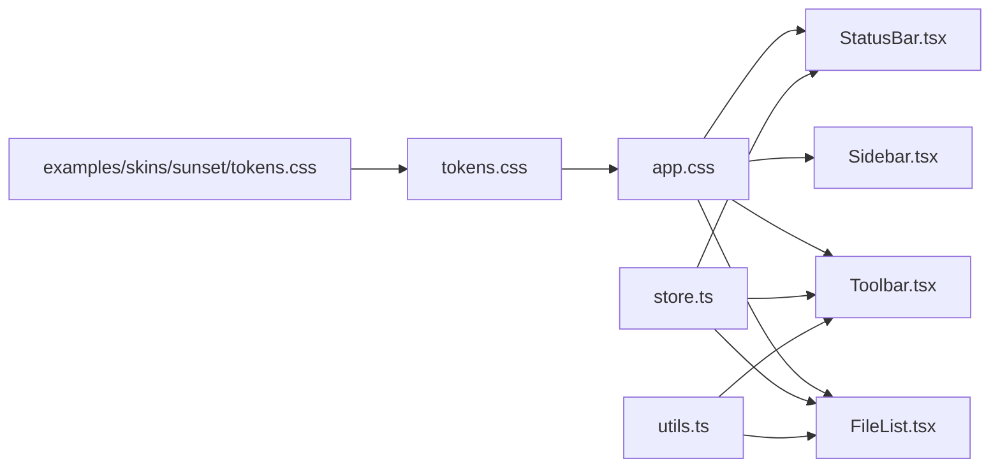

# 视觉设计规范

<cite>
**本文引用的文件**
- [src/styles/tokens.css](file://src/styles/tokens.css)
- [src/styles/app.css](file://src/styles/app.css)
- [src/components/FileList.tsx](file://src/components/FileList.tsx)
- [src/components/Sidebar.tsx](file://src/components/Sidebar.tsx)
- [src/components/Toolbar.tsx](file://src/components/Toolbar.tsx)
- [src/components/StatusBar.tsx](file://src/components/StatusBar.tsx)
- [src/components/PreviewModal.tsx](file://src/components/PreviewModal.tsx)
- [src/store.ts](file://src/store.ts)
- [src/utils.ts](file://src/utils.ts)
- [src/types.ts](file://src/types.ts)
- [examples/skins/sunset/tokens.css](file://examples/skins/sunset/tokens.css)
- [src/App.tsx](file://src/App.tsx)
</cite>

## 目录
1. [简介](#简介)
2. [项目结构](#项目结构)
3. [核心组件](#核心组件)
4. [架构总览](#架构总览)
5. [详细组件分析](#详细组件分析)
6. [依赖分析](#依赖分析)
7. [性能考量](#性能考量)
8. [故障排查指南](#故障排查指南)
9. [结论](#结论)
10. [附录](#附录)

## 简介
本规范面向 LocalBro 的视觉设计与交互呈现，聚焦以下目标：
- 图标系统：图标选择标准、尺寸规范与颜色搭配
- 文件类型识别与可视化：图标映射与颜色编码策略
- 视觉层次与信息架构：层级关系、对比度与可读性
- 视觉反馈机制：悬停、选中、禁用等状态表现
- 无障碍设计与视觉辅助：对比度、键盘可达性与语义化

## 项目结构
LocalBro 采用“主题令牌 + 组件样式”的分层设计：
- 主题令牌集中于 tokens.css，定义颜色、间距、圆角、字体与布局参数
- 全局与组件样式集中在 app.css，通过 CSS 变量统一调用令牌
- 功能组件（侧边栏、工具栏、文件列表、状态栏）在各自 TSX 中消费状态与样式类名
- 预览模态、皮肤选择器等扩展组件提供增强体验

图表来源
- [src/styles/tokens.css:1-79](file://src/styles/tokens.css#L1-L79)
- [src/styles/app.css:1-808](file://src/styles/app.css#L1-L808)
- [src/App.tsx:106-145](file://src/App.tsx#L106-L145)
- [src/components/Sidebar.tsx:1-215](file://src/components/Sidebar.tsx#L1-L215)
- [src/components/Toolbar.tsx:1-216](file://src/components/Toolbar.tsx#L1-L216)
- [src/components/FileList.tsx:1-173](file://src/components/FileList.tsx#L1-L173)
- [src/components/StatusBar.tsx:1-38](file://src/components/StatusBar.tsx#L1-L38)
- [src/components/PreviewModal.tsx](file://src/components/PreviewModal.tsx)
- [src/store.ts:1-308](file://src/store.ts#L1-L308)
- [src/utils.ts:1-66](file://src/utils.ts#L1-L66)
- [src/types.ts:1-37](file://src/types.ts#L1-L37)

章节来源
- [src/styles/tokens.css:1-79](file://src/styles/tokens.css#L1-L79)
- [src/styles/app.css:1-808](file://src/styles/app.css#L1-L808)
- [src/App.tsx:106-145](file://src/App.tsx#L106-L145)

## 核心组件
- 主题令牌与变量：定义背景、前景、边框、强调色、半径、间距、字号与布局尺寸
- 全局样式：统一字体、按钮、输入框、网格布局、视图切换与状态栏样式
- 文件列表：按视图模式渲染列表、详情与网格，并根据选中状态切换高亮
- 侧边栏：收藏、集合与卷标的图标映射与交互
- 工具栏：面包屑导航、视图切换、隐藏文件开关与集合操作菜单
- 状态栏：统计信息与选中项汇总
- 预览模态：多类型内容预览与占位展示

章节来源
- [src/styles/tokens.css:9-79](file://src/styles/tokens.css#L9-L79)
- [src/styles/app.css:1-808](file://src/styles/app.css#L1-L808)
- [src/components/FileList.tsx:42-173](file://src/components/FileList.tsx#L42-L173)
- [src/components/Sidebar.tsx:1-215](file://src/components/Sidebar.tsx#L1-L215)
- [src/components/Toolbar.tsx:1-216](file://src/components/Toolbar.tsx#L1-L216)
- [src/components/StatusBar.tsx:1-38](file://src/components/StatusBar.tsx#L1-L38)
- [src/components/PreviewModal.tsx](file://src/components/PreviewModal.tsx)

## 架构总览
LocalBro 的视觉设计以“主题令牌”为中心，所有组件样式通过 CSS 变量引用，确保跨组件一致性与可替换性。状态管理由 Zustand 提供，文件列表与交互行为通过 store 消费与更新。

图表来源
- [src/App.tsx:106-145](file://src/App.tsx#L106-L145)
- [src/store.ts:97-136](file://src/store.ts#L97-L136)
- [src/components/FileList.tsx:85-173](file://src/components/FileList.tsx#L85-L173)
- [src/utils.ts:53-65](file://src/utils.ts#L53-L65)

## 详细组件分析

### 图标系统设计与使用规范
- 图标来源与选择标准
  - 目录：📁
  - 符号链接：🔗
  - 图片：🖼️（扩展名：png、jpg、jpeg、gif、webp、heic、avif、bmp、svg）
  - 视频：🎞️（扩展名：mp4、mov、avi、mkv、webm）
  - 音频：🎵（扩展名：mp3、wav、flac、aac、ogg、m4a）
  - 压缩包：🗜️（扩展名：zip、tar、gz、bz2、xz、7z、rar）
  - PDF：📕
  - 文档/日志：📝（扩展名：md、txt、log）
  - 代码/文本：📄（扩展名：js、ts、tsx、jsx、rs、py、go、java、c、cpp、h、json）
  - 其他：📄
- 尺寸规范
  - 列表/详情行内图标：宽度 20px，居中对齐
  - 网格单元图标：字号 34px，行高 1，底部留白
  - 侧边栏与面包屑图标：宽度约 18px，居中对齐
- 颜色搭配
  - 图标颜色遵循当前前景色变量，保持与文本一致的可读性
  - 选中状态下，图标颜色与选中前景色一致，确保高对比度
- 可访问性
  - 图标仅作装饰时，不作为唯一语义载体；文本名称与扩展名同时提供
  - 选中与悬停状态通过背景色变化与文本色变化双重反馈

章节来源
- [src/utils.ts:53-65](file://src/utils.ts#L53-L65)
- [src/styles/app.css:97-100](file://src/styles/app.css#L97-L100)
- [src/styles/app.css:346-350](file://src/styles/app.css#L346-L350)
- [src/styles/app.css:433-437](file://src/styles/app.css#L433-L437)
- [src/components/FileList.tsx:99-102](file://src/components/FileList.tsx#L99-L102)
- [src/components/FileList.tsx:166-168](file://src/components/FileList.tsx#L166-L168)
- [src/components/Sidebar.tsx:5-18](file://src/components/Sidebar.tsx#L5-L18)

### 文件类型识别与可视化表示
- 识别逻辑
  - 基于条目 kind 与 extension 进行分类
  - 目录优先显示，其余按扩展名映射到对应图标
- 可视化映射
  - 列表/详情：行内图标 + 名称 + 大小/修改时间
  - 网格：大图标 + 名称（两行省略）
- 颜色编码
  - 选中行/单元：背景强调色 + 对比前景色
  - 悬停行/单元：浅色悬停背景
  - 禁用元素：透明度降低与默认指针

图表来源
- [src/utils.ts:53-65](file://src/utils.ts#L53-L65)

章节来源
- [src/utils.ts:53-65](file://src/utils.ts#L53-L65)
- [src/components/FileList.tsx:85-173](file://src/components/FileList.tsx#L85-L173)
- [src/styles/app.css:325-446](file://src/styles/app.css#L325-L446)

### 用户界面视觉层次与信息架构
- 层级关系
  - 应用容器：三区域布局（侧边栏、工具栏、主内容区、状态栏）
  - 主内容区：视图切换（列表/网格/详情），每种视图有独立的列宽与对齐规则
- 对比度与可读性
  - 使用强调色与选中前景色形成足够对比
  - 数值采用等宽数字（tabular-nums）提升对齐与可读性
  - 字体族与字号变量统一，保证跨组件一致性
- 信息密度
  - 列表/详情：名称为主，辅以大小与时间
  - 网格：名称两行省略，强调图标与数量标签

章节来源
- [src/styles/app.css:50-61](file://src/styles/app.css#L50-L61)
- [src/styles/app.css:376-407](file://src/styles/app.css#L376-L407)
- [src/styles/app.css:409-446](file://src/styles/app.css#L409-L446)
- [src/styles/tokens.css:42-52](file://src/styles/tokens.css#L42-L52)

### 视觉反馈机制
- 悬停状态
  - 按钮与可点击项：浅色悬停背景
  - 列表/网格行：悬停背景色变化
- 选中状态
  - 行/单元：强调背景与对比前景色
  - 详情头部列标题：悬停变色
- 禁用状态
  - 按钮：降低透明度与默认指针
  - 导航按钮：基于历史记录可用性动态禁用
- 状态指示
  - 面包屑编辑态：输入框样式
  - 集合菜单：下拉菜单与分隔线

章节来源
- [src/styles/app.css:20-35](file://src/styles/app.css#L20-L35)
- [src/styles/app.css:89-96](file://src/styles/app.css#L89-L96)
- [src/styles/app.css:339-345](file://src/styles/app.css#L339-L345)
- [src/styles/app.css:426-432](file://src/styles/app.css#L426-L432)
- [src/styles/app.css:104-108](file://src/styles/app.css#L104-L108)
- [src/styles/app.css:152-189](file://src/styles/app.css#L152-L189)

### 无障碍设计与视觉辅助
- 对比度
  - 强调色与选中前景色在明暗主题下均满足对比度要求
  - 暗色主题下悬停与选中背景采用更高对比度
- 键盘可达性
  - 空格键触发快速预览（在非输入焦点时）
  - 面包屑双击进入编辑模式
- 语义化与替代文本
  - 图标作为装饰，名称与扩展名提供语义
  - 预览模态包含文件名与元信息占位

章节来源
- [src/styles/tokens.css:59-78](file://src/styles/tokens.css#L59-L78)
- [src/styles/app.css:20-35](file://src/styles/app.css#L20-L35)
- [src/styles/app.css:115-135](file://src/styles/app.css#L115-L135)
- [src/App.tsx:71-104](file://src/App.tsx#L71-L104)

## 依赖分析
- 主题令牌依赖
  - tokens.css 定义变量，app.css 通过 var(--lb-*) 引用
- 组件样式依赖
  - 各组件类名（如 .list-row、.grid-cell、.sidebar-item）在 app.css 中定义
- 业务逻辑依赖
  - FileList 依赖 store 的 entries、selection、viewMode 与工具函数 iconFor/formatSize/formatDate
  - Sidebar/Toolbar/StatusBar 依赖 store 的状态与动作
- 皮肤系统
  - 示例皮肤通过覆盖 tokens.css 变量实现主题替换

图表来源
- [src/styles/tokens.css:1-79](file://src/styles/tokens.css#L1-L79)
- [src/styles/app.css:1-808](file://src/styles/app.css#L1-L808)
- [src/components/FileList.tsx:1-173](file://src/components/FileList.tsx#L1-L173)
- [src/components/Sidebar.tsx:1-215](file://src/components/Sidebar.tsx#L1-L215)
- [src/components/Toolbar.tsx:1-216](file://src/components/Toolbar.tsx#L1-L216)
- [src/components/StatusBar.tsx:1-38](file://src/components/StatusBar.tsx#L1-L38)
- [src/store.ts:1-308](file://src/store.ts#L1-L308)
- [src/utils.ts:1-66](file://src/utils.ts#L1-L66)
- [examples/skins/sunset/tokens.css:1-26](file://examples/skins/sunset/tokens.css#L1-L26)

章节来源
- [src/styles/tokens.css:1-79](file://src/styles/tokens.css#L1-L79)
- [src/styles/app.css:1-808](file://src/styles/app.css#L1-L808)
- [src/store.ts:1-308](file://src/store.ts#L1-L308)
- [src/utils.ts:1-66](file://src/utils.ts#L1-L66)
- [examples/skins/sunset/tokens.css:1-26](file://examples/skins/sunset/tokens.css#L1-L26)

## 性能考量
- 并发目录扫描队列：限制并发数，避免阻塞 UI
- 选中与悬停：纯 CSS 背景切换，无复杂动画
- 预览模态：按需渲染，减少不必要的 DOM 结构
- 皮肤加载：应用启动即初始化，避免闪烁

章节来源
- [src/App.tsx:28-69](file://src/App.tsx#L28-L69)
- [src/styles/app.css:1-808](file://src/styles/app.css#L1-L808)

## 故障排查指南
- 图标未按预期显示
  - 检查 entry.kind 与 extension 是否正确传入
  - 确认 utils.ts 中 iconFor 的映射分支
- 选中状态不生效
  - 确认 FileList 的 selection Set 与类名 selected 绑定
  - 检查 toggleSelection 的添加/删除逻辑
- 暗色主题对比度不足
  - 调整 tokens.css 中 --lb-bg-hover/--lb-bg-selected 等变量
  - 参考示例皮肤 sunset 的变量覆盖方式
- 预览无法打开
  - 确认 Space 键事件未在输入框内触发
  - 检查 store 的 previewPath 与 PreviewModal 的条件渲染

章节来源
- [src/utils.ts:53-65](file://src/utils.ts#L53-L65)
- [src/components/FileList.tsx:172-182](file://src/components/FileList.tsx#L172-L182)
- [src/styles/tokens.css:59-78](file://src/styles/tokens.css#L59-L78)
- [examples/skins/sunset/tokens.css:6-25](file://examples/skins/sunset/tokens.css#L6-L25)
- [src/App.tsx:71-104](file://src/App.tsx#L71-L104)

## 结论
LocalBro 的视觉设计以“主题令牌 + 统一样式”为核心，结合明确的图标映射与状态反馈，构建了清晰、一致且可扩展的界面体系。通过对比度优化与键盘可达性设计，兼顾可用性与可访问性。建议在后续升级中持续维护令牌一致性与状态反馈的统一性。

## 附录
- 皮肤定制参考
  - 示例皮肤通过覆盖 tokens.css 变量实现主题替换
  - 支持明/暗/自动基底的视觉卡片展示

章节来源
- [examples/skins/sunset/tokens.css:1-26](file://examples/skins/sunset/tokens.css#L1-L26)
- [src/styles/tokens.css:1-79](file://src/styles/tokens.css#L1-L79)
- [src/styles/app.css:679-795](file://src/styles/app.css#L679-L795)