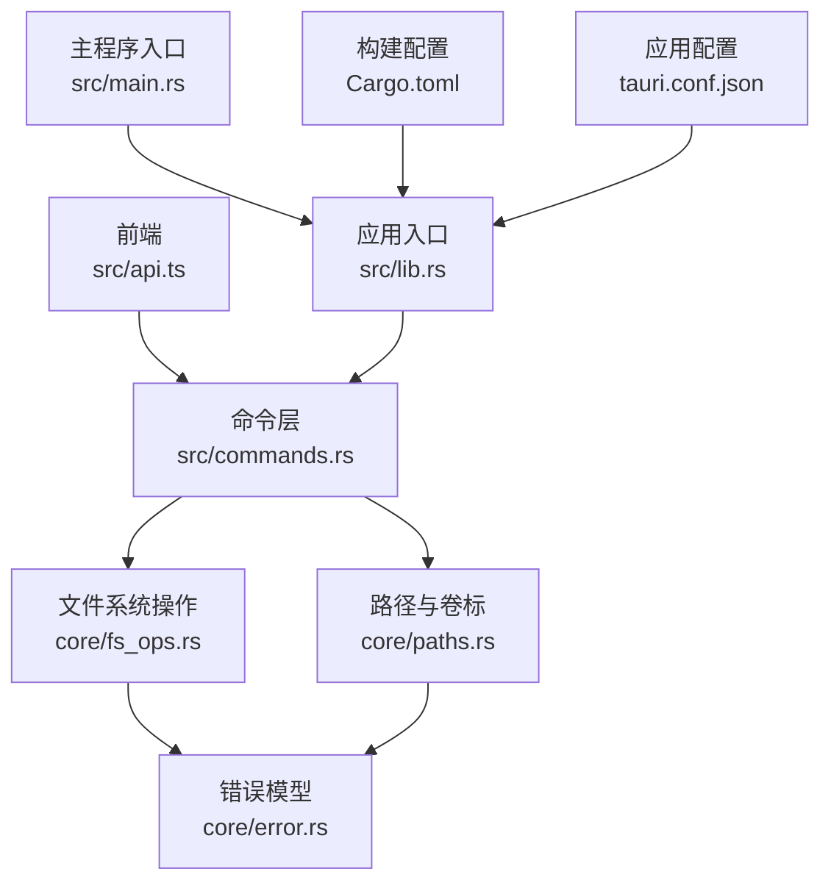
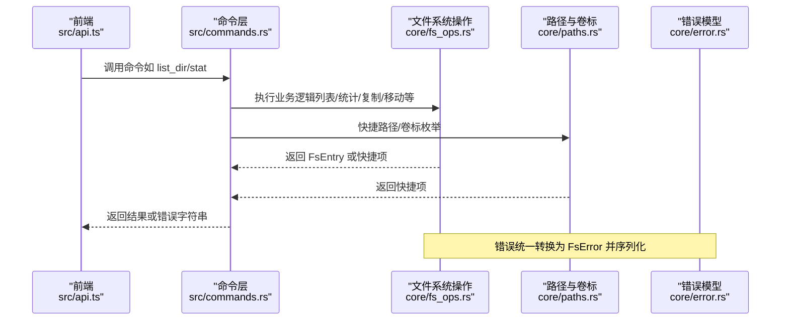
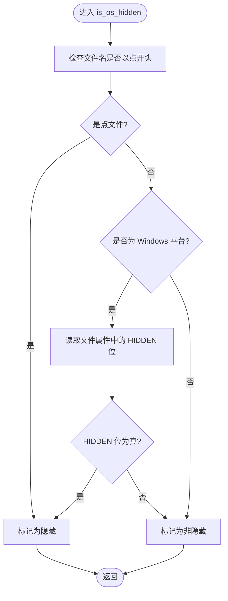
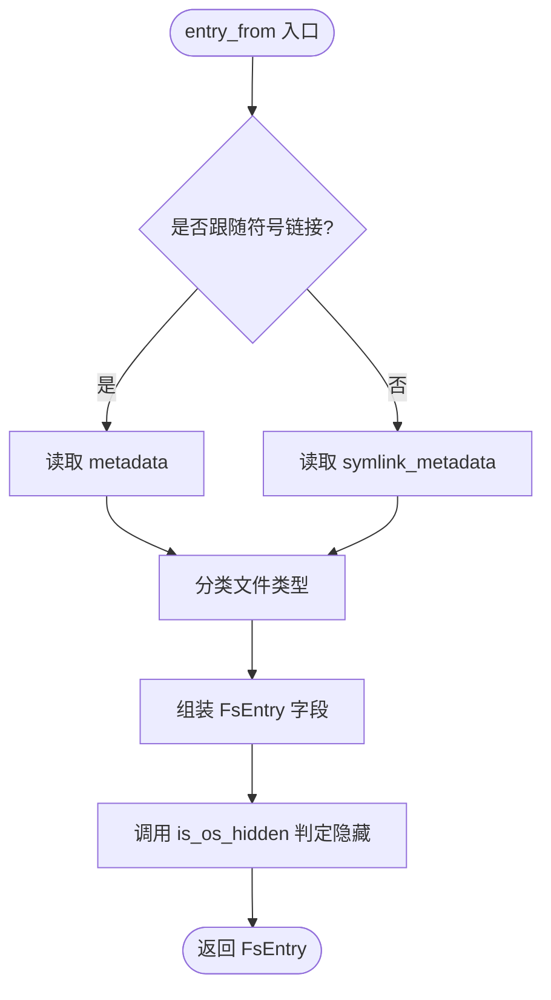
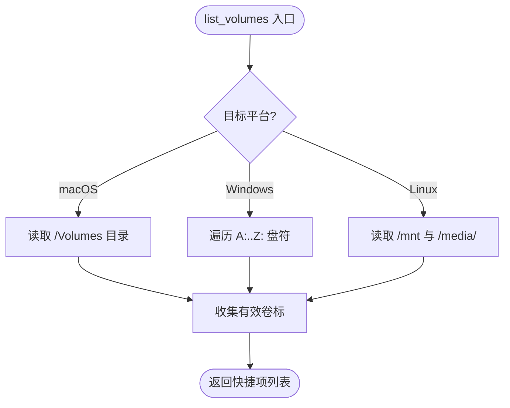
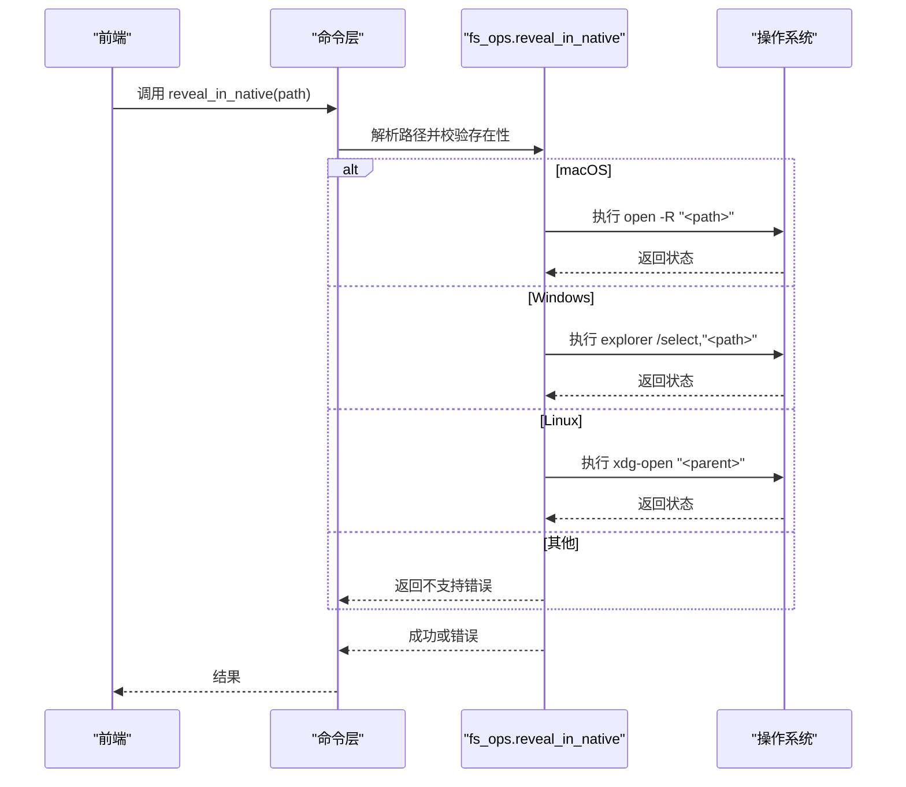
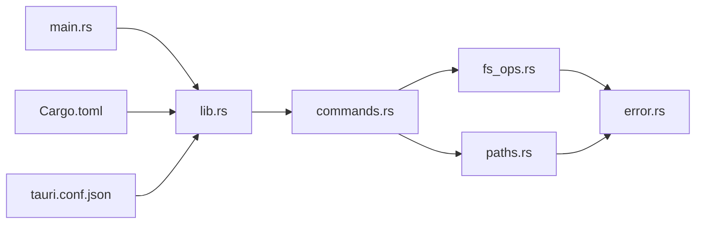

# 平台特定实现

<cite>
**本文引用的文件**
- [fs_ops.rs](file://src-tauri/src/core/fs_ops.rs)
- [paths.rs](file://src-tauri/src/core/paths.rs)
- [error.rs](file://src-tauri/src/core/error.rs)
- [commands.rs](file://src-tauri/src/commands.rs)
- [lib.rs](file://src-tauri/src/lib.rs)
- [main.rs](file://src-tauri/src/main.rs)
- [Cargo.toml](file://src-tauri/Cargo.toml)
- [tauri.conf.json](file://src-tauri/tauri.conf.json)
- [api.ts](file://src/api.ts)
- [types.ts](file://src/types.ts)
- [utils.ts](file://src/utils.ts)
</cite>

## 目录
1. [引言](#引言)
2. [项目结构](#项目结构)
3. [核心组件](#核心组件)
4. [架构总览](#架构总览)
5. [详细组件分析](#详细组件分析)
6. [依赖关系分析](#依赖关系分析)
7. [性能考量](#性能考量)
8. [故障排查指南](#故障排查指南)
9. [结论](#结论)
10. [附录](#附录)

## 引言
本文件聚焦 LocalBro 在 Windows、macOS 和 Linux 三大桌面平台上的“平台特定实现”。围绕文件系统操作、权限处理、路径与卷标管理、隐藏文件检测、符号链接处理与元数据获取等主题，系统阐述条件编译指令（如 #[cfg(target_os = "windows")]）的使用机制与适配策略，并给出各平台特定功能的调用路径与最佳实践，以及错误处理与异常场景的应对方案。

## 项目结构
LocalBro 的后端核心位于 Tauri 应用的 Rust 子工程中，前端通过 Tauri IPC 调用后端命令。平台特定逻辑主要分布在以下模块：
- 文件系统与条目元数据：core/fs_ops.rs
- 快捷路径与卷标枚举：core/paths.rs
- 错误类型与统一返回：core/error.rs
- 命令暴露层：src/commands.rs
- 应用入口与插件注册：src/lib.rs、src/main.rs
- 构建与目标配置：Cargo.toml、tauri.conf.json
- 前端调用封装：src/api.ts、src/types.ts、src/utils.ts

图表来源
- [lib.rs:11-52](file://src-tauri/src/lib.rs#L11-L52)
- [main.rs:1-7](file://src-tauri/src/main.rs#L1-L7)
- [commands.rs:1-198](file://src-tauri/src/commands.rs#L1-L198)
- [fs_ops.rs:1-360](file://src-tauri/src/core/fs_ops.rs#L1-L360)
- [paths.rs:1-127](file://src-tauri/src/core/paths.rs#L1-L127)
- [error.rs:1-50](file://src-tauri/src/core/error.rs#L1-L50)
- [Cargo.toml:1-36](file://src-tauri/Cargo.toml#L1-L36)
- [tauri.conf.json:1-43](file://src-tauri/tauri.conf.json#L1-L43)

章节来源
- [lib.rs:11-52](file://src-tauri/src/lib.rs#L11-L52)
- [main.rs:1-7](file://src-tauri/src/main.rs#L1-L7)
- [Cargo.toml:1-36](file://src-tauri/Cargo.toml#L1-L36)
- [tauri.conf.json:1-43](file://src-tauri/tauri.conf.json#L1-L43)

## 核心组件
- 文件系统操作与条目元数据
  - 条目类型与字段：文件、目录、符号链接、其他；大小、修改/创建时间（毫秒）、是否隐藏、只读、扩展名
  - 列表与统计：支持显示/隐藏过滤、跟随符号链接、跨设备移动回退、文本文件预览
- 路径与卷标
  - 快捷路径：家目录、桌面、文档、下载、图片、音乐、视频等
  - 外部卷标：macOS 的 /Volumes、Windows 的逻辑盘符、Linux 的 /mnt 与 /media
- 错误模型
  - 统一错误类型与序列化，便于前端消费
- 命令层
  - 将 Rust 函数暴露为 Tauri 命令，供前端调用

章节来源
- [fs_ops.rs:9-138](file://src-tauri/src/core/fs_ops.rs#L9-L138)
- [paths.rs:6-52](file://src-tauri/src/core/paths.rs#L6-L52)
- [error.rs:7-49](file://src-tauri/src/core/error.rs#L7-L49)
- [commands.rs:13-100](file://src-tauri/src/commands.rs#L13-L100)

## 架构总览
下图展示从前端到后端命令、再到平台特定实现的调用链路与关键节点。

图表来源
- [api.ts:37-101](file://src/api.ts#L37-L101)
- [commands.rs:13-100](file://src-tauri/src/commands.rs#L13-L100)
- [fs_ops.rs:140-179](file://src-tauri/src/core/fs_ops.rs#L140-L179)
- [paths.rs:42-52](file://src-tauri/src/core/paths.rs#L42-L52)
- [error.rs:31-47](file://src-tauri/src/core/error.rs#L31-L47)

## 详细组件分析

### 隐藏文件检测与平台差异
- Unix 风格：以点开头的文件名即视为隐藏（适用于 macOS）
- Windows：通过文件属性中的 HIDDEN 位判断
- 其他平台：当前未做特殊处理，返回非隐藏

图表来源
- [fs_ops.rs:62-85](file://src-tauri/src/core/fs_ops.rs#L62-L85)

章节来源
- [fs_ops.rs:62-85](file://src-tauri/src/core/fs_ops.rs#L62-L85)

### 符号链接处理与元数据获取
- 统一入口：entry_from
  - 可选择跟随符号链接（follow_symlinks）或不跟随（保持符号链接本身）
  - 获取文件类型、大小、修改/创建时间、只读标志、扩展名
- 隐藏文件：结合 is_os_hidden 进行判定
- 列表过滤：根据 ListOptions.show_hidden 控制是否显示隐藏项

图表来源
- [fs_ops.rs:87-138](file://src-tauri/src/core/fs_ops.rs#L87-L138)

章节来源
- [fs_ops.rs:87-138](file://src-tauri/src/core/fs_ops.rs#L87-L138)

### 跨平台路径与卷标管理
- 快捷路径：基于 dirs crate 提供的用户目录，存在性检查后返回
- 卷标枚举：
  - macOS：扫描 /Volumes 下的可访问卷
  - Windows：遍历 A: 到 Z: 逻辑盘符
  - Linux：扫描 /mnt 与 /media/<user> 下的挂载点
- 家目录回退：若无法解析用户主目录，则回退到根路径

图表来源
- [paths.rs:58-119](file://src-tauri/src/core/paths.rs#L58-L119)

章节来源
- [paths.rs:42-127](file://src-tauri/src/core/paths.rs#L42-L127)

### 平台特定的“在原生文件管理器中定位”
- macOS：使用 open -R 定位到文件所在位置
- Windows：使用 explorer /select 参数选中文件
- Linux：尽力而为，打开父目录
- 其他平台：返回不支持错误

图表来源
- [fs_ops.rs:320-359](file://src-tauri/src/core/fs_ops.rs#L320-L359)
- [commands.rs:78-81](file://src-tauri/src/commands.rs#L78-L81)

章节来源
- [fs_ops.rs:320-359](file://src-tauri/src/core/fs_ops.rs#L320-L359)
- [commands.rs:78-81](file://src-tauri/src/commands.rs#L78-L81)

### 条件编译与平台适配机制
- 目标平台条件编译：通过 #[cfg(target_os = "...")] 在编译期选择不同分支
- 适用范围：隐藏文件检测（Windows）、原生文件管理器定位、未来可扩展的平台特性
- 编译期依赖：当前 Cargo.toml 中未为 macOS/Windows 添加额外依赖块，但保留了注释占位，便于后续扩展

章节来源
- [fs_ops.rs:68-77](file://src-tauri/src/core/fs_ops.rs#L68-L77)
- [fs_ops.rs:327-355](file://src-tauri/src/core/fs_ops.rs#L327-L355)
- [Cargo.toml:29-34](file://src-tauri/Cargo.toml#L29-L34)

### 前端调用与数据映射
- 前端通过 @tauri-apps/api/core 的 invoke 调用后端命令
- Rust 层返回的 snake_case 字段在前端转换为 camelCase
- 列表选项（显示隐藏、跟随符号链接）通过 JSON 传递给后端

章节来源
- [api.ts:1-195](file://src/api.ts#L1-L195)
- [types.ts:1-37](file://src/types.ts#L1-L37)
- [commands.rs:13-100](file://src-tauri/src/commands.rs#L13-L100)

## 依赖关系分析
- 命令层依赖 core 模块提供的文件系统与路径能力
- 错误模型统一由 core/error.rs 提供，保证前后端一致的错误语义
- 应用入口负责注册命令与插件，构建运行时环境
- 构建配置声明了目标平台与依赖，确保条件编译生效

图表来源
- [commands.rs:1-12](file://src-tauri/src/commands.rs#L1-L12)
- [fs_ops.rs:1-8](file://src-tauri/src/core/fs_ops.rs#L1-L8)
- [paths.rs:1-4](file://src-tauri/src/core/paths.rs#L1-L4)
- [error.rs:1-7](file://src-tauri/src/core/error.rs#L1-L7)
- [lib.rs:11-52](file://src-tauri/src/lib.rs#L11-L52)
- [main.rs:1-7](file://src-tauri/src/main.rs#L1-L7)
- [Cargo.toml:1-36](file://src-tauri/Cargo.toml#L1-L36)
- [tauri.conf.json:1-43](file://src-tauri/tauri.conf.json#L1-L43)

章节来源
- [lib.rs:11-52](file://src-tauri/src/lib.rs#L11-L52)
- [Cargo.toml:1-36](file://src-tauri/Cargo.toml#L1-L36)
- [tauri.conf.json:1-43](file://src-tauri/tauri.conf.json#L1-L43)

## 性能考量
- 目录列表：按项逐个 stat，跳过不可读条目避免整体失败
- 文本预览：限制最大读取字节数，避免大文件导致内存压力
- 跨设备移动：先尝试 rename，失败则回退到 copy + 删除，兼顾正确性与性能
- 大小索引：目录总大小采用缓存与后台扫描，减少频繁计算开销（由命令层 SizeIndex 支持）

章节来源
- [fs_ops.rs:140-179](file://src-tauri/src/core/fs_ops.rs#L140-L179)
- [fs_ops.rs:276-292](file://src-tauri/src/core/fs_ops.rs#L276-L292)
- [commands.rs:102-126](file://src-tauri/src/commands.rs#L102-L126)

## 故障排查指南
- 常见错误类型
  - 路径不存在、权限不足、路径已存在、无效路径、IO 错误、不支持的操作、内部错误
- 错误转换规则
  - 将标准 io::Error 映射为 FsError 的具体变体，便于前端识别
- 平台特定问题
  - Windows 隐藏文件需依赖文件属性；若属性查询失败，默认不视为隐藏
  - Linux 定位文件时仅打开父目录，属于尽力而为的行为
- 建议
  - 对于不可读目录，前端应提示用户调整权限或选择其他路径
  - 跨平台路径拼接建议使用后端返回的标准化路径，避免手动拼接

章节来源
- [error.rs:7-49](file://src-tauri/src/core/error.rs#L7-L49)
- [fs_ops.rs:320-359](file://src-tauri/src/core/fs_ops.rs#L320-L359)

## 结论
LocalBro 在平台特定实现上采用“条件编译 + 统一错误模型”的设计：通过 #[cfg(target_os = "...")] 在编译期选择平台分支，结合 core 模块抽象出一致的文件系统与路径能力，前端通过 Tauri IPC 以命令形式调用。该架构在隐藏文件检测、符号链接处理、元数据获取、原生文件管理器集成等方面实现了跨平台一致性与可维护性。

## 附录

### 平台差异与适配要点速览
- 隐藏文件
  - Unix/macOS：点文件名约定
  - Windows：FILE_ATTRIBUTE_HIDDEN
- 符号链接
  - 可选择跟随或不跟随；不跟随时以符号链接本身信息为准
- 元数据
  - 修改/创建时间统一为毫秒级 UNIX 时间戳
  - 只读标志来自文件权限
- 路径与卷标
  - 快捷路径依赖 dirs crate
  - 卷标枚举针对三平台分别实现
- 原生文件管理器
  - macOS：open -R
  - Windows：explorer /select
  - Linux：xdg-open 父目录

章节来源
- [fs_ops.rs:62-85](file://src-tauri/src/core/fs_ops.rs#L62-L85)
- [fs_ops.rs:87-138](file://src-tauri/src/core/fs_ops.rs#L87-L138)
- [paths.rs:58-119](file://src-tauri/src/core/paths.rs#L58-L119)
- [fs_ops.rs:320-359](file://src-tauri/src/core/fs_ops.rs#L320-L359)