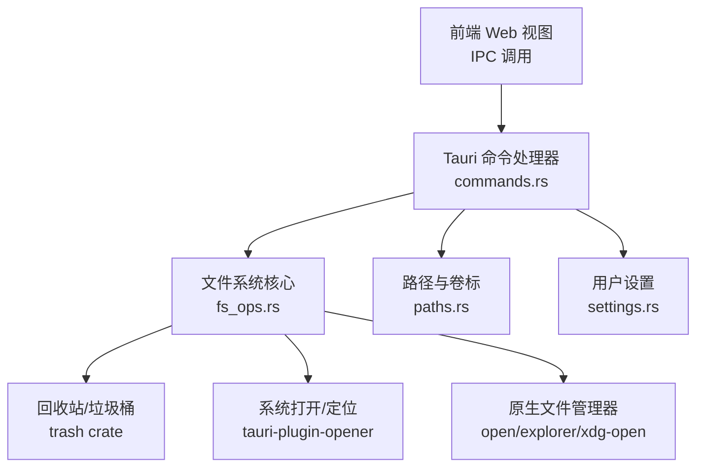
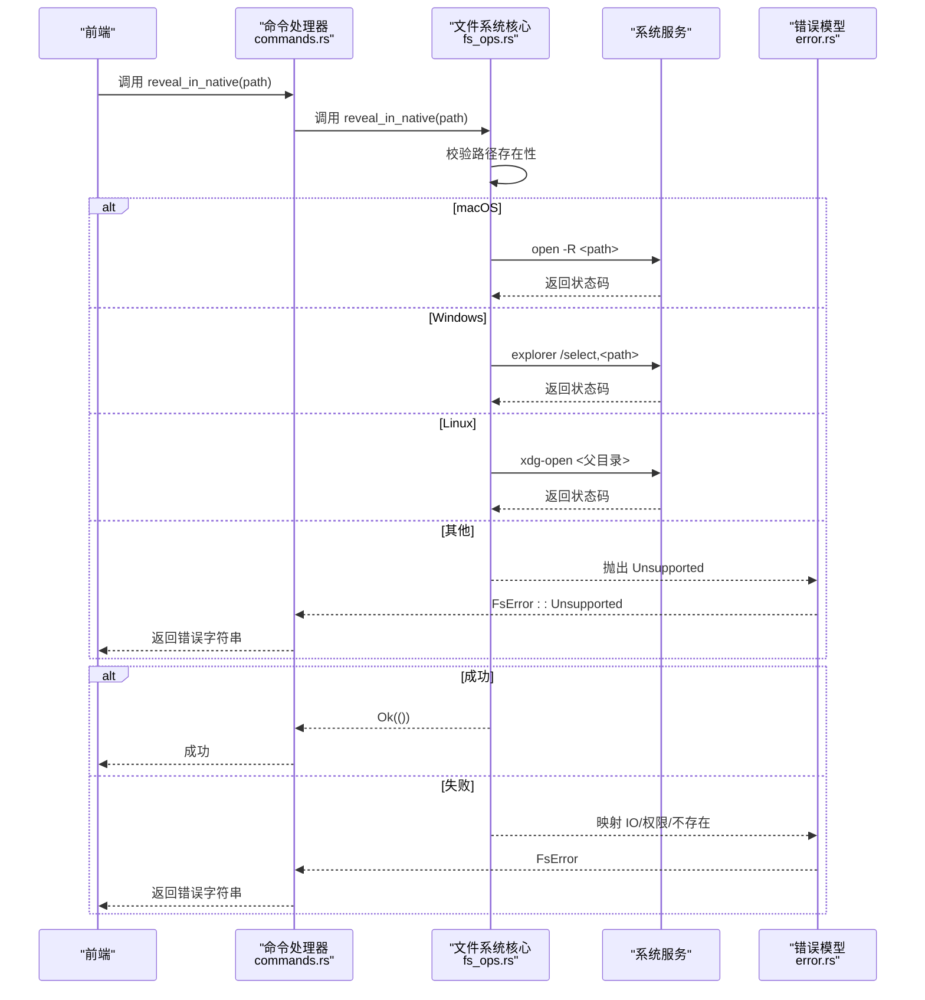
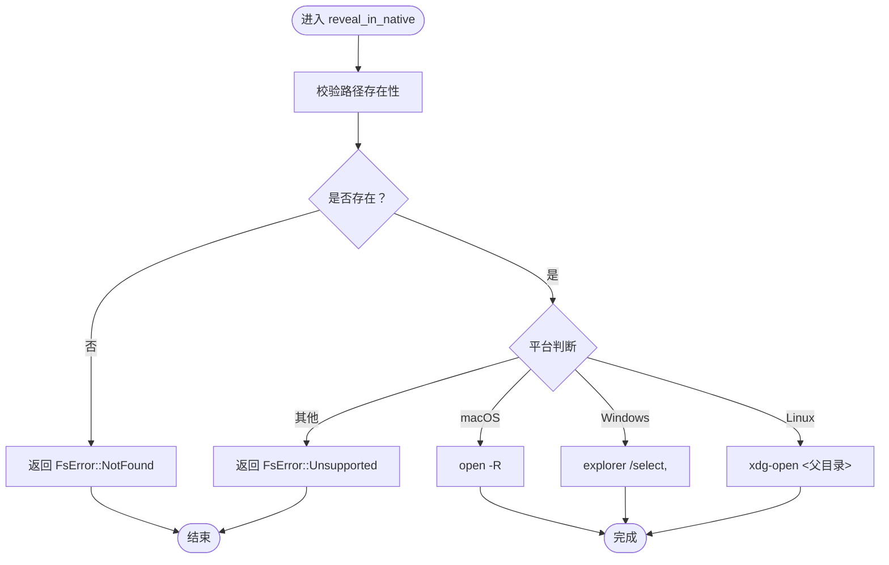
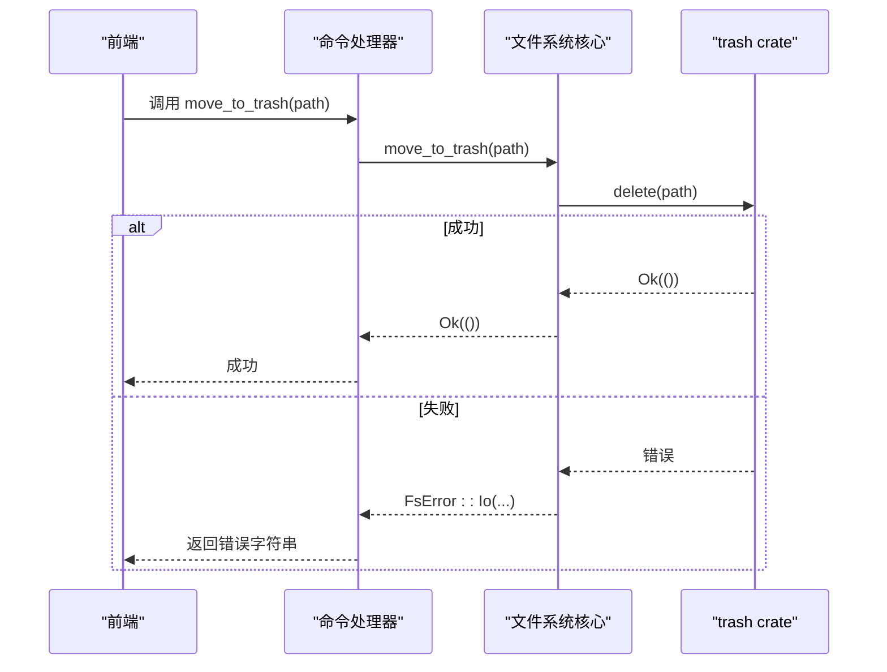
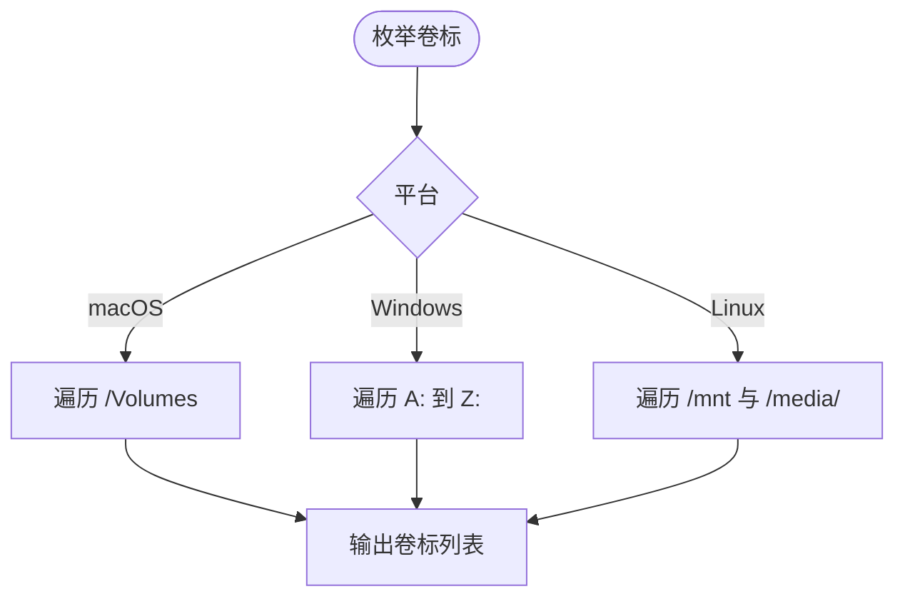
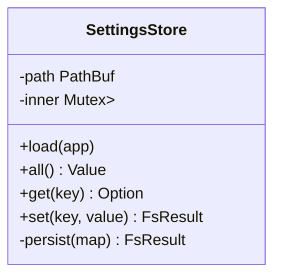
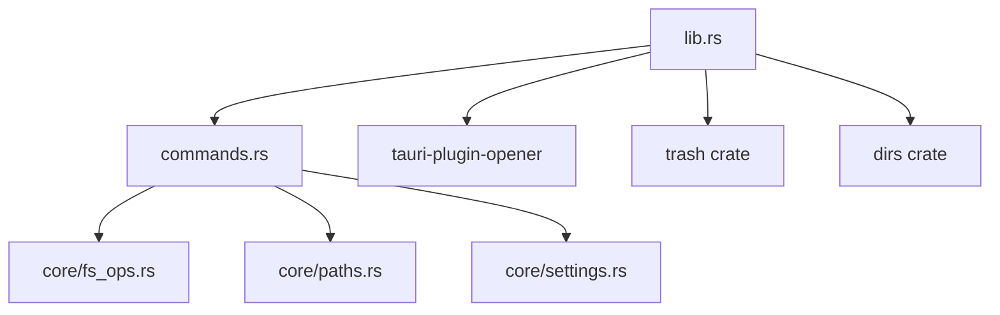

# 系统集成功能

<cite>
**本文引用的文件**
- [src-tauri/src/lib.rs](file://src-tauri/src/lib.rs)
- [src-tauri/src/main.rs](file://src-tauri/src/main.rs)
- [src-tauri/src/commands.rs](file://src-tauri/src/commands.rs)
- [src-tauri/src/core/fs_ops.rs](file://src-tauri/src/core/fs_ops.rs)
- [src-tauri/src/core/error.rs](file://src-tauri/src/core/error.rs)
- [src-tauri/src/core/paths.rs](file://src-tauri/src/core/paths.rs)
- [src-tauri/src/core/settings.rs](file://src-tauri/src/core/settings.rs)
- [src-tauri/Cargo.toml](file://src-tauri/Cargo.toml)
- [src-tauri/tauri.conf.json](file://src-tauri/tauri.conf.json)
- [src-tauri/capabilities/default.json](file://src-tauri/capabilities/default.json)
</cite>

## 目录
1. [简介](#简介)
2. [项目结构](#项目结构)
3. [核心组件](#核心组件)
4. [架构总览](#架构总览)
5. [详细组件分析](#详细组件分析)
6. [依赖关系分析](#依赖关系分析)
7. [性能考虑](#性能考虑)
8. [故障排查指南](#故障排查指南)
9. [结论](#结论)
10. [附录：配置与扩展指南](#附录配置与扩展指南)

## 简介
本文件面向 LocalBro 的系统集成功能，聚焦以下方面：
- 与各平台原生文件管理器的集成：Windows 的 explorer.exe、macOS 的 Finder、Linux 的 xdg-open。
- 回收站/垃圾桶系统：基于 trash crate 的跨平台删除实现。
- 文件关联与打开：通过 tauri-plugin-opener 插件实现默认程序关联与文件类型处理。
- 命令调用与参数传递：Tauri 命令层到系统调用层的完整链路。
- 配置项与自定义：能力权限、插件启用、路径与卷标枚举等。
- 失败降级与错误处理：统一错误模型与跨平台兼容策略。
- 扩展指南：如何为新平台或新系统特性添加支持。

## 项目结构
LocalBro 的系统集成功能主要位于 Tauri 后端（Rust）侧，前端通过 Tauri IPC 调用后端命令。核心目录与职责如下：
- src-tauri/src/lib.rs：应用入口与命令注册，初始化尺寸索引、设置存储，并注册系统集成功能命令。
- src-tauri/src/commands.rs：Tauri 命令处理器，暴露文件系统操作、回收站、原生定位、设置读写等接口。
- src-tauri/src/core/fs_ops.rs：文件系统核心逻辑，包含回收站移动、原生文件管理器定位、文本读取等。
- src-tauri/src/core/error.rs：统一错误模型，便于前端捕获与展示。
- src-tauri/src/core/paths.rs：路径与快捷方式、卷标枚举等。
- src-tauri/src/core/settings.rs：用户设置持久化。
- src-tauri/Cargo.toml：依赖声明，含 trash、tauri-plugin-opener、dirs 等。
- src-tauri/tauri.conf.json：应用配置，窗口、安全策略、打包图标等。
- src-tauri/capabilities/default.json：能力权限，开启 opener 权限以支持系统打开。

**图表来源**
- [src-tauri/src/lib.rs:12-65](file://src-tauri/src/lib.rs#L12-L65)
- [src-tauri/src/commands.rs:15-83](file://src-tauri/src/commands.rs#L15-L83)
- [src-tauri/src/core/fs_ops.rs:219-359](file://src-tauri/src/core/fs_ops.rs#L219-L359)
- [src-tauri/Cargo.toml:17-27](file://src-tauri/Cargo.toml#L17-L27)

**章节来源**
- [src-tauri/src/lib.rs:12-65](file://src-tauri/src/lib.rs#L12-L65)
- [src-tauri/src/commands.rs:15-83](file://src-tauri/src/commands.rs#L15-L83)
- [src-tauri/src/core/fs_ops.rs:219-359](file://src-tauri/src/core/fs_ops.rs#L219-L359)
- [src-tauri/Cargo.toml:17-27](file://src-tauri/Cargo.toml#L17-L27)

## 核心组件
- 原生文件管理器集成
  - macOS：通过 open -R 定位文件。
  - Windows：通过 explorer /select 参数选中文件。
  - Linux：通过 xdg-open 打开父目录（尽力而为）。
- 回收站/垃圾桶
  - 使用 trash crate 的 delete 接口，跨平台统一行为。
- 文件关联与打开
  - 通过 tauri-plugin-opener 插件，调用系统默认程序打开文件或 URL。
- 错误处理
  - 统一 FsError 枚举，映射 IO、权限、不存在、不支持等场景。
- 设置与能力
  - 用户设置持久化；capabilities 中启用 opener 权限。

**章节来源**
- [src-tauri/src/core/fs_ops.rs:320-359](file://src-tauri/src/core/fs_ops.rs#L320-L359)
- [src-tauri/src/core/fs_ops.rs:219-222](file://src-tauri/src/core/fs_ops.rs#L219-L222)
- [src-tauri/src/commands.rs:80-83](file://src-tauri/src/commands.rs#L80-L83)
- [src-tauri/src/core/error.rs:8-29](file://src-tauri/src/core/error.rs#L8-L29)
- [src-tauri/capabilities/default.json:6-9](file://src-tauri/capabilities/default.json#L6-L9)

## 架构总览
下图展示了从前端发起系统集成功能请求到系统执行的完整流程，包括错误处理与降级策略。

**图表来源**
- [src-tauri/src/commands.rs:80-83](file://src-tauri/src/commands.rs#L80-L83)
- [src-tauri/src/core/fs_ops.rs:320-359](file://src-tauri/src/core/fs_ops.rs#L320-L359)
- [src-tauri/src/core/error.rs:31-41](file://src-tauri/src/core/error.rs#L31-L41)

## 详细组件分析

### 原生文件管理器集成（reveal_in_native）
- 功能目标：在不同平台上打开对应文件管理器并定位到指定路径。
- 实现要点：
  - macOS：使用 open -R 定位文件。
  - Windows：使用 explorer /select 参数选中文件。
  - Linux：使用 xdg-open 打开父目录（尽力而为，因为多数桌面环境对“选中”支持有限）。
- 参数传递：
  - 前端传入绝对路径字符串，后端先校验存在性，再按平台拼接命令参数。
- 错误处理：
  - 路径不存在返回 NotFound；命令执行失败返回 Io；其他平台返回 Unsupported。
- 降级策略：
  - Linux 无法精确选中文件时，打开其父目录作为替代方案。

**图表来源**
- [src-tauri/src/core/fs_ops.rs:320-359](file://src-tauri/src/core/fs_ops.rs#L320-L359)
- [src-tauri/src/core/error.rs:8-29](file://src-tauri/src/core/error.rs#L8-L29)

**章节来源**
- [src-tauri/src/core/fs_ops.rs:320-359](file://src-tauri/src/core/fs_ops.rs#L320-L359)
- [src-tauri/src/commands.rs:80-83](file://src-tauri/src/commands.rs#L80-L83)

### 回收站/垃圾桶（move_to_trash）
- 功能目标：将文件或目录移入系统回收站/垃圾桶。
- 实现要点：
  - 统一调用 trash crate 的 delete 接口，跨平台行为一致。
- 错误处理：
  - 将底层错误包装为 FsError::Io，便于前端统一处理。
- 降级策略：
  - 若 trash 行为异常，可回退到永久删除（需谨慎使用）。

**图表来源**
- [src-tauri/src/commands.rs:60-63](file://src-tauri/src/commands.rs#L60-L63)
- [src-tauri/src/core/fs_ops.rs:219-222](file://src-tauri/src/core/fs_ops.rs#L219-L222)

**章节来源**
- [src-tauri/src/commands.rs:60-63](file://src-tauri/src/commands.rs#L60-L63)
- [src-tauri/src/core/fs_ops.rs:219-222](file://src-tauri/src/core/fs_ops.rs#L219-L222)

### 文件关联与打开（tauri-plugin-opener）
- 功能目标：通过系统默认程序打开文件或 URL。
- 实现要点：
  - 在 capabilities/default.json 中启用 opener 权限。
  - 通过 tauri::plugin::opener 提供的 API 进行调用（在 lib.rs 中初始化）。
- 适用场景：
  - 右键菜单“打开方式”、双击预览、外部链接跳转等。
- 注意事项：
  - 不同平台的默认程序可能不同，需确保系统已正确配置关联。

**图表来源**
- [src-tauri/capabilities/default.json:6-9](file://src-tauri/capabilities/default.json#L6-L9)
- [src-tauri/src/lib.rs:26](file://src-tauri/src/lib.rs#L26)

**章节来源**
- [src-tauri/capabilities/default.json:6-9](file://src-tauri/capabilities/default.json#L6-L9)
- [src-tauri/src/lib.rs:26](file://src-tauri/src/lib.rs#L26)

### 路径与卷标枚举（default_shortcuts / list_volumes）
- 功能目标：提供常用快捷路径与外部卷标，用于侧边栏导航。
- 实现要点：
  - default_shortcuts：基于 dirs crate 解析用户主目录及常用子目录。
  - list_volumes：按平台枚举卷标或驱动器根路径。
- 平台差异：
  - macOS：/Volumes 下的卷。
  - Windows：A: 到 Z: 的逻辑盘符。
  - Linux：/mnt 与 /media/<user> 下的挂载点。

**图表来源**
- [src-tauri/src/core/paths.rs:54-119](file://src-tauri/src/core/paths.rs#L54-L119)

**章节来源**
- [src-tauri/src/core/paths.rs:42-52](file://src-tauri/src/core/paths.rs#L42-L52)
- [src-tauri/src/core/paths.rs:54-119](file://src-tauri/src/core/paths.rs#L54-L119)

### 用户设置（settings_get / settings_set）
- 功能目标：持久化用户偏好，如界面主题、语言、是否显示隐藏文件等。
- 实现要点：
  - 存储位置：应用数据目录下的 settings.json。
  - 并发安全：使用 Mutex 保护内存映射。
  - 模式设计：schema-free，便于向前兼容与迁移。

**图表来源**
- [src-tauri/src/core/settings.rs:15-62](file://src-tauri/src/core/settings.rs#L15-L62)

**章节来源**
- [src-tauri/src/core/settings.rs:20-32](file://src-tauri/src/core/settings.rs#L20-L32)
- [src-tauri/src/core/settings.rs:42-50](file://src-tauri/src/core/settings.rs#L42-L50)
- [src-tauri/src/commands.rs:248-265](file://src-tauri/src/commands.rs#L248-L265)

## 依赖关系分析
- 外部依赖
  - trash：跨平台回收站操作。
  - tauri-plugin-opener：系统打开能力。
  - dirs：解析用户目录。
  - serde/serde_json：序列化与反序列化。
- 内部模块耦合
  - commands.rs 依赖 core 模块（fs_ops、paths、settings 等）。
  - lib.rs 注册命令并初始化插件与状态。

**图表来源**
- [src-tauri/src/commands.rs:15-14](file://src-tauri/src/commands.rs#L15-L14)
- [src-tauri/src/lib.rs:26-27](file://src-tauri/src/lib.rs#L26-L27)
- [src-tauri/Cargo.toml:17-27](file://src-tauri/Cargo.toml#L17-L27)

**章节来源**
- [src-tauri/src/commands.rs:15-14](file://src-tauri/src/commands.rs#L15-L14)
- [src-tauri/src/lib.rs:26-27](file://src-tauri/src/lib.rs#L26-L27)
- [src-tauri/Cargo.toml:17-27](file://src-tauri/Cargo.toml#L17-L27)

## 性能考虑
- 原生定位命令：仅触发系统进程，开销极低，适合频繁调用。
- 回收站操作：trash crate 通常为同步调用，建议避免在 UI 主线程中大量并发触发。
- 文本读取：限制最大读取字节数，避免大文件阻塞 UI。
- 卷标枚举：按平台扫描卷标，建议缓存结果并在系统事件变化时刷新。

## 故障排查指南
- 常见错误与处理
  - 路径不存在：检查路径合法性与存在性，必要时提示用户。
  - 权限不足：提示用户提升权限或切换账户。
  - 不支持的操作：在非支持平台返回 FsError::Unsupported，前端给出友好提示。
  - 原生命令失败：记录系统返回的状态码，尝试降级（如 Linux 无法选中时打开父目录）。
- 日志与诊断
  - 使用 FsError::from_io 将底层 IO 错误映射为统一格式，便于前端展示。
  - 对于 trash 删除失败，可回退到永久删除（需二次确认）。

**章节来源**
- [src-tauri/src/core/error.rs:31-41](file://src-tauri/src/core/error.rs#L31-L41)
- [src-tauri/src/core/fs_ops.rs:320-359](file://src-tauri/src/core/fs_ops.rs#L320-L359)

## 结论
LocalBro 的系统集成功能以清晰的模块划分与统一的错误模型为基础，实现了跨平台的原生文件管理器集成、回收站操作与系统打开能力。通过 tauri-plugin-opener 与 trash crate 的组合，既保证了易用性，又兼顾了跨平台一致性。建议在生产环境中结合前端的降级提示与日志上报，进一步提升用户体验与可观测性。

## 附录：配置与扩展指南

### 配置选项与自定义
- 能力权限
  - 在 capabilities/default.json 中确保启用 opener 权限，以便调用系统默认程序。
- 应用配置
  - tauri.conf.json 控制窗口大小、最小尺寸、安全策略与打包图标等。
- 用户设置
  - 通过 settings_get_all/settings_get/settings_set 命令读写用户偏好，存储于应用数据目录。

**章节来源**
- [src-tauri/capabilities/default.json:6-9](file://src-tauri/capabilities/default.json#L6-L9)
- [src-tauri/tauri.conf.json:12-30](file://src-tauri/tauri.conf.json#L12-L30)
- [src-tauri/src/commands.rs:248-265](file://src-tauri/src/commands.rs#L248-L265)

### 扩展新系统集成功能
- 新增平台支持
  - 在 fs_ops.rs 的 reveal_in_native 中增加新的平台分支，参考现有 macOS/Windows/Linux 分支。
  - 确保命令参数与系统工具版本兼容。
- 新增系统能力
  - 在 Cargo.toml 添加所需依赖（如新的系统打开库）。
  - 在 capabilities/default.json 中声明相应权限。
  - 在 lib.rs 中初始化插件或注册新命令。
- 错误与降级
  - 为新能力补充 FsError 映射与降级策略，确保在失败时提供可用的替代方案。
- 测试与验证
  - 在目标平台进行回归测试，覆盖常见路径、权限与边界条件。

**章节来源**
- [src-tauri/src/core/fs_ops.rs:320-359](file://src-tauri/src/core/fs_ops.rs#L320-L359)
- [src-tauri/Cargo.toml:17-27](file://src-tauri/Cargo.toml#L17-L27)
- [src-tauri/capabilities/default.json:6-9](file://src-tauri/capabilities/default.json#L6-L9)
- [src-tauri/src/lib.rs:26](file://src-tauri/src/lib.rs#L26)