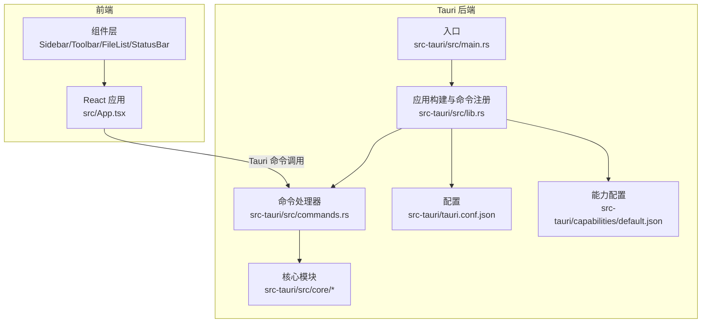
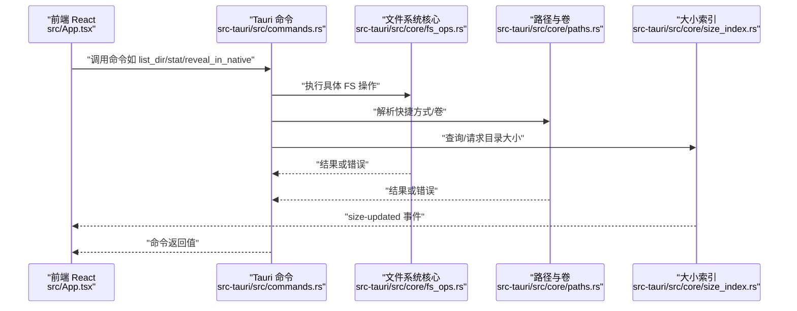
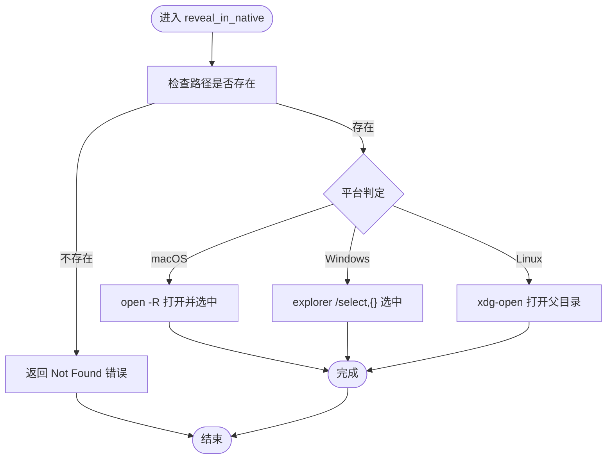
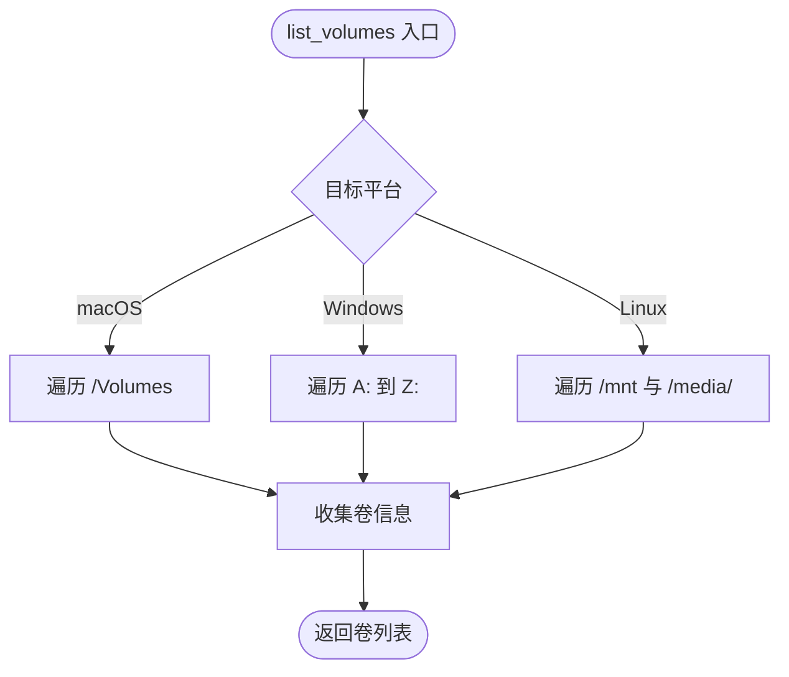
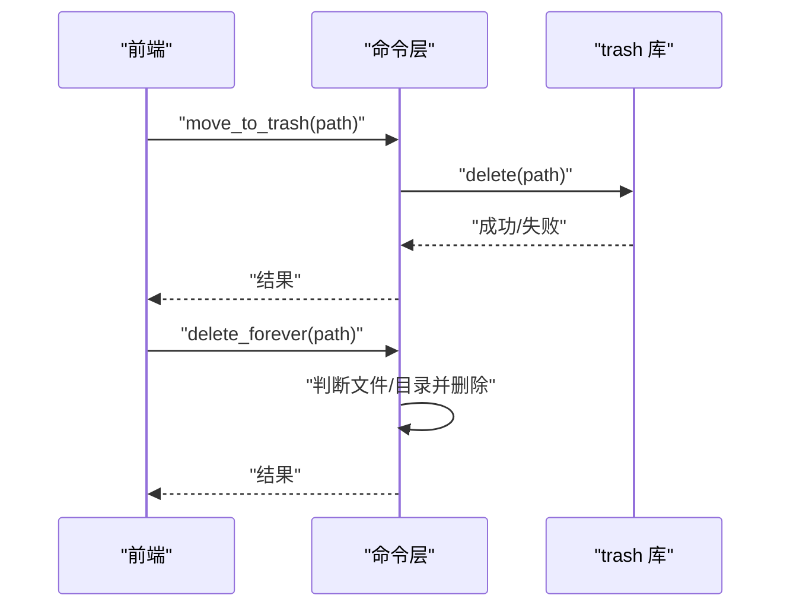
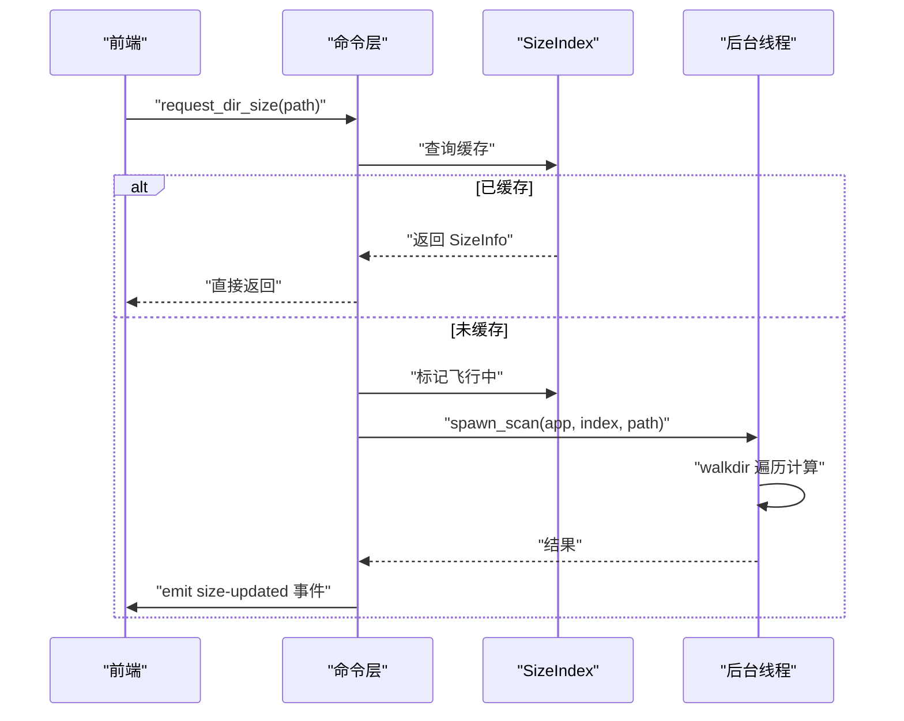
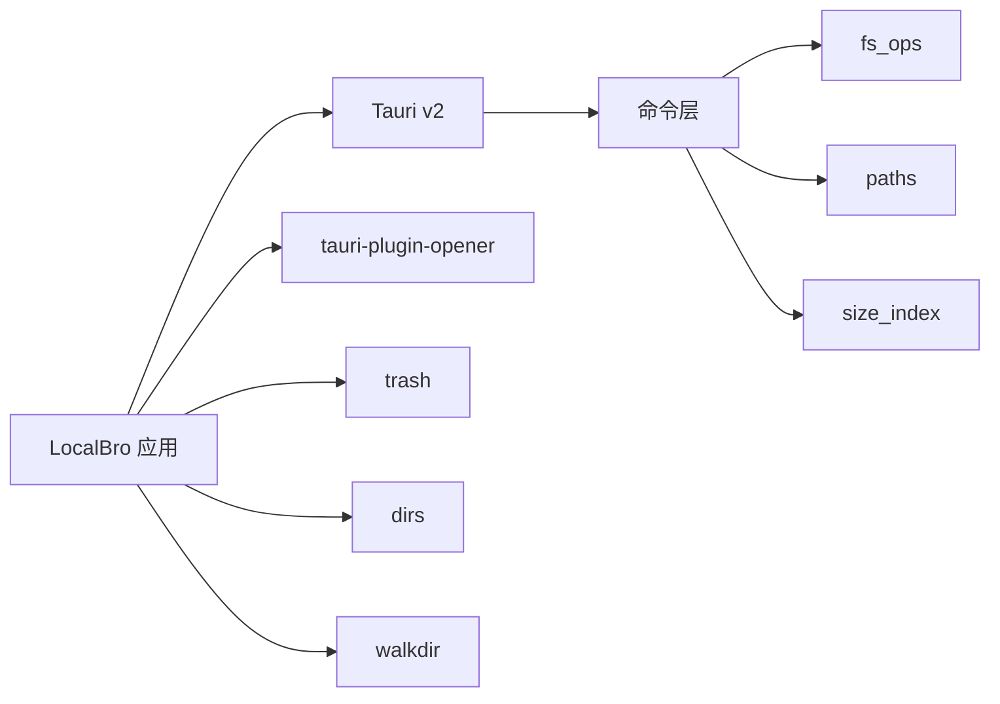

# 跨平台兼容性

<cite>
**本文引用的文件**
- [src-tauri/src/lib.rs](file://src-tauri/src/lib.rs)
- [src-tauri/src/main.rs](file://src-tauri/src/main.rs)
- [src-tauri/Cargo.toml](file://src-tauri/Cargo.toml)
- [src-tauri/tauri.conf.json](file://src-tauri/tauri.conf.json)
- [src-tauri/src/commands.rs](file://src-tauri/src/commands.rs)
- [src-tauri/src/core/mod.rs](file://src-tauri/src/core/mod.rs)
- [src-tauri/src/core/fs_ops.rs](file://src-tauri/src/core/fs_ops.rs)
- [src-tauri/src/core/paths.rs](file://src-tauri/src/core/paths.rs)
- [src-tauri/src/core/error.rs](file://src-tauri/src/core/error.rs)
- [src-tauri/src/core/size_index.rs](file://src-tauri/src/core/size_index.rs)
- [src-tauri/src/core/collections.rs](file://src-tauri/src/core/collections.rs)
- [src-tauri/build.rs](file://src-tauri/build.rs)
- [src-tauri/capabilities/default.json](file://src-tauri/capabilities/default.json)
- [src/App.tsx](file://src/App.tsx)
</cite>

## 目录
1. [引言](#引言)
2. [项目结构](#项目结构)
3. [核心组件](#核心组件)
4. [架构总览](#架构总览)
5. [详细组件分析](#详细组件分析)
6. [依赖关系分析](#依赖关系分析)
7. [性能考量](#性能考量)
8. [故障排查指南](#故障排查指南)
9. [结论](#结论)
10. [附录：平台测试与扩展指南](#附录平台测试与扩展指南)

## 引言
本文件聚焦 LocalBro 的跨平台兼容性设计与实现，覆盖 Windows、macOS 与 Linux 三大桌面平台在文件系统、权限模型、路径处理、系统集成（原生文件管理器、回收站/垃圾桶）以及条件编译与平台检测机制上的差异与适配策略。同时给出性能优化建议、测试策略与扩展新平台的实践指导。

## 项目结构
LocalBro 采用 Tauri v2 架构，前端使用 React/Vite，后端 Rust 核心通过 Tauri 命令暴露能力至 Webview。跨平台逻辑集中在 Rust 核心模块中，通过条件编译与第三方库实现差异化行为。

图表来源
- [src-tauri/src/main.rs:1-7](file://src-tauri/src/main.rs#L1-L7)
- [src-tauri/src/lib.rs:11-52](file://src-tauri/src/lib.rs#L11-L52)
- [src-tauri/src/commands.rs:13-49](file://src-tauri/src/commands.rs#L13-L49)
- [src-tauri/src/core/mod.rs:1-6](file://src-tauri/src/core/mod.rs#L1-L6)
- [src-tauri/tauri.conf.json:1-43](file://src-tauri/tauri.conf.json#L1-L43)
- [src-tauri/capabilities/default.json:1-11](file://src-tauri/capabilities/default.json#L1-L11)

章节来源
- [src-tauri/src/main.rs:1-7](file://src-tauri/src/main.rs#L1-L7)
- [src-tauri/src/lib.rs:11-52](file://src-tauri/src/lib.rs#L11-L52)
- [src-tauri/tauri.conf.json:1-43](file://src-tauri/tauri.conf.json#L1-L43)
- [src-tauri/capabilities/default.json:1-11](file://src-tauri/capabilities/default.json#L1-L11)

## 核心组件
- 命令层：将前端请求映射到 Rust 核心函数，统一错误类型与返回格式。
- 文件系统操作：目录枚举、统计、复制移动、删除、文本读取、隐藏属性判断等。
- 路径与快捷方式：跨平台用户目录解析、卷/驱动器枚举、家目录回退。
- 回收站/垃圾桶：统一调用跨平台 trash 库。
- 系统集成：原生文件管理器打开、选中定位。
- 目录大小缓存：后台扫描、事件通知、内存缓存。
- 收藏夹集合：本地 JSON 存储、并发安全、持久化。

章节来源
- [src-tauri/src/commands.rs:13-198](file://src-tauri/src/commands.rs#L13-L198)
- [src-tauri/src/core/fs_ops.rs:9-360](file://src-tauri/src/core/fs_ops.rs#L9-L360)
- [src-tauri/src/core/paths.rs:6-127](file://src-tauri/src/core/paths.rs#L6-L127)
- [src-tauri/src/core/size_index.rs:17-135](file://src-tauri/src/core/size_index.rs#L17-L135)
- [src-tauri/src/core/collections.rs:19-191](file://src-tauri/src/core/collections.rs#L19-L191)

## 架构总览
下图展示前端与后端的交互、命令分发与核心模块的关系，以及平台特定分支的分布。

图表来源
- [src-tauri/src/commands.rs:13-198](file://src-tauri/src/commands.rs#L13-L198)
- [src-tauri/src/core/fs_ops.rs:140-360](file://src-tauri/src/core/fs_ops.rs#L140-L360)
- [src-tauri/src/core/paths.rs:42-127](file://src-tauri/src/core/paths.rs#L42-L127)
- [src-tauri/src/core/size_index.rs:60-135](file://src-tauri/src/core/size_index.rs#L60-L135)
- [src/App.tsx:108-116](file://src/App.tsx#L108-L116)

## 详细组件分析

### 文件系统与平台差异
- 隐藏文件识别
  - Unix/Linux：以点开头的名称视为隐藏。
  - Windows：检查文件属性中的隐藏位。
- 权限模型
  - 只读标志来自文件权限；跨平台统一通过元数据读取。
- 路径处理
  - 统一使用绝对路径规范化，避免空路径与非法路径。
- 复制/移动
  - 移动失败时自动回退为复制+删除，保证跨设备移动一致性。
- 文本读取
  - 限制最大读取字节数，UTF-8 解码失败时替换为替代字符，避免崩溃。
- 原生打开
  - macOS 使用 open -R 定位到文件；
  - Windows 使用 explorer /select,{} 选中文件；
  - Linux 使用 xdg-open 打开父目录作为最佳努力。

图表来源
- [src-tauri/src/core/fs_ops.rs:320-360](file://src-tauri/src/core/fs_ops.rs#L320-L360)

章节来源
- [src-tauri/src/core/fs_ops.rs:62-85](file://src-tauri/src/core/fs_ops.rs#L62-L85)
- [src-tauri/src/core/fs_ops.rs:118-137](file://src-tauri/src/core/fs_ops.rs#L118-L137)
- [src-tauri/src/core/fs_ops.rs:276-292](file://src-tauri/src/core/fs_ops.rs#L276-L292)
- [src-tauri/src/core/fs_ops.rs:294-318](file://src-tauri/src/core/fs_ops.rs#L294-L318)
- [src-tauri/src/core/fs_ops.rs:320-360](file://src-tauri/src/core/fs_ops.rs#L320-L360)

### 路径与卷枚举（跨平台）
- 快捷方式
  - 解析用户主目录、桌面、文档、下载、图片、音乐、视频等常用位置。
- 卷/驱动器
  - macOS：/Volumes 下的挂载卷。
  - Windows：A: 到 Z: 的逻辑盘符。
  - Linux：/mnt 与 /media/<user> 下的挂载点（尽力而为）。

图表来源
- [src-tauri/src/core/paths.rs:54-119](file://src-tauri/src/core/paths.rs#L54-L119)

章节来源
- [src-tauri/src/core/paths.rs:42-52](file://src-tauri/src/core/paths.rs#L42-L52)
- [src-tauri/src/core/paths.rs:54-119](file://src-tauri/src/core/paths.rs#L54-L119)

### 回收站/垃圾桶集成
- 统一通过 trash 库进行跨平台删除到回收站。
- 删除永久文件时，按文件或目录分别处理。

图表来源
- [src-tauri/src/commands.rs:58-66](file://src-tauri/src/commands.rs#L58-L66)
- [src-tauri/src/core/fs_ops.rs:219-235](file://src-tauri/src/core/fs_ops.rs#L219-L235)

章节来源
- [src-tauri/src/core/fs_ops.rs:219-235](file://src-tauri/src/core/fs_ops.rs#L219-L235)

### 目录大小缓存与事件
- 内存缓存 + 后台扫描线程，避免阻塞 UI。
- 重复请求合并，飞行中状态去重。
- 计算完成后通过事件推送更新。

图表来源
- [src-tauri/src/commands.rs:102-126](file://src-tauri/src/commands.rs#L102-L126)
- [src-tauri/src/core/size_index.rs:60-104](file://src-tauri/src/core/size_index.rs#L60-L104)
- [src/App.tsx:108-116](file://src/App.tsx#L108-L116)

章节来源
- [src-tauri/src/core/size_index.rs:17-53](file://src-tauri/src/core/size_index.rs#L17-L53)
- [src-tauri/src/core/size_index.rs:106-135](file://src-tauri/src/core/size_index.rs#L106-L135)
- [src-tauri/src/commands.rs:102-126](file://src-tauri/src/commands.rs#L102-L126)
- [src/App.tsx:108-116](file://src/App.tsx#L108-L116)

### 收藏夹集合（本地存储）
- JSON 文件存储于应用数据目录，绝对路径保存，缺失项静默过滤。
- 并发安全通过互斥锁保护，持久化前排序保证稳定输出。

章节来源
- [src-tauri/src/core/collections.rs:39-191](file://src-tauri/src/core/collections.rs#L39-L191)

### 错误模型与统一返回
- 自定义错误类型，序列化为字符串返回前端，便于调试与用户提示。
- IO 错误映射到具体语义（未找到、权限不足、已存在等）。

章节来源
- [src-tauri/src/core/error.rs:7-49](file://src-tauri/src/core/error.rs#L7-L49)

## 依赖关系分析
- 构建与运行
  - Tauri v2 作为宿主框架，启用协议资产与插件系统。
  - tauri-plugin-opener 提供原生打开能力。
  - trash 库用于回收站/垃圾桶。
  - dirs 库解析用户目录。
  - walkdir 递归扫描目录。
- 平台特定依赖
  - macOS/Windows 目标块用于未来扩展（当前未添加额外依赖）。

图表来源
- [src-tauri/Cargo.toml:17-28](file://src-tauri/Cargo.toml#L17-L28)
- [src-tauri/src/lib.rs:22-22](file://src-tauri/src/lib.rs#L22-L22)
- [src-tauri/src/commands.rs:7-11](file://src-tauri/src/commands.rs#L7-L11)

章节来源
- [src-tauri/Cargo.toml:17-36](file://src-tauri/Cargo.toml#L17-L36)
- [src-tauri/src/lib.rs:22-22](file://src-tauri/src/lib.rs#L22-L22)

## 性能考量
- 目录大小扫描
  - 后台线程 + 飞行中去重，避免重复计算。
  - 事件驱动更新，前端批量渲染。
- I/O 与错误处理
  - 目录枚举跳过不可读条目，避免整表失败。
  - 文本预览限制最大读取量，防止大文件阻塞。
- 并发与锁
  - 使用互斥锁保护共享状态，避免竞态。
- 资源占用
  - 跨设备移动采用复制+删除回退，确保正确性但会增加磁盘写入；建议在同盘移动优先使用 rename。

章节来源
- [src-tauri/src/core/size_index.rs:60-104](file://src-tauri/src/core/size_index.rs#L60-L104)
- [src-tauri/src/core/fs_ops.rs:140-170](file://src-tauri/src/core/fs_ops.rs#L140-L170)
- [src-tauri/src/core/fs_ops.rs:294-318](file://src-tauri/src/core/fs_ops.rs#L294-L318)
- [src-tauri/src/core/collections.rs:61-74](file://src-tauri/src/core/collections.rs#L61-L74)

## 故障排查指南
- 常见错误与定位
  - 未找到路径：检查路径是否为空、是否存在。
  - 权限不足：确认目标文件/目录权限与所在卷挂载状态。
  - 已存在：创建/移动目标路径冲突。
  - 不支持的操作：当前平台不支持的功能（如 reveal_in_native 在某些环境）。
- 日志与调试
  - 前端监听 size-updated 事件，确认后台扫描是否触发。
  - 检查命令返回的错误字符串，结合后端日志定位。
- 平台特有问题
  - Windows 驱动器枚举：若部分盘符不可访问，属于正常现象。
  - Linux xdg-open：若无图形环境，可能无法打开文件管理器。

章节来源
- [src-tauri/src/core/error.rs:7-49](file://src-tauri/src/core/error.rs#L7-L49)
- [src-tauri/src/core/fs_ops.rs:320-360](file://src-tauri/src/core/fs_ops.rs#L320-L360)
- [src-tauri/src/core/paths.rs:58-119](file://src-tauri/src/core/paths.rs#L58-L119)
- [src/App.tsx:108-116](file://src/App.tsx#L108-L116)

## 结论
LocalBro 通过条件编译与第三方库实现了对 Windows、macOS、Linux 的稳健支持。核心策略包括：
- 明确的平台分支与回退策略（如 Linux 最佳努力打开父目录）。
- 统一的错误模型与事件驱动更新。
- 以缓存与后台任务为主的性能优化。
- 可扩展的收藏夹与集合存储方案。

## 附录：平台测试与扩展指南

### 平台测试策略
- 功能覆盖
  - 文件/目录操作：创建、重命名、复制、移动、删除、永久删除。
  - 回收站：移动到回收站、清空回收站（如可用）。
  - 原生打开：reveal_in_native 在各平台的行为验证。
  - 路径与卷：快捷方式与卷枚举的准确性。
  - 文本预览：超大文件截断、编码异常处理。
- 性能验证
  - 大目录扫描：并发队列、事件推送、UI 响应时间。
  - 跨设备移动：磁盘写入与耗时对比。
- 兼容性验证
  - 权限场景：只读文件、隐藏文件、无权限目录。
  - 特殊路径：符号链接、网络挂载、FUSE 文件系统。

### 条件编译与平台检测
- 当前实现
  - 使用 #[cfg(target_os = "...")] 对平台分支进行编译期选择。
  - Windows 控制台窗口抑制仅在非调试构建生效。
- 扩展建议
  - 新增平台时，在 Cargo.toml 中为目标添加依赖块，并在 Rust 源中新增对应分支。
  - 将平台特定常量与行为抽象为独立模块，便于维护。

章节来源
- [src-tauri/src/core/fs_ops.rs:68-84](file://src-tauri/src/core/fs_ops.rs#L68-L84)
- [src-tauri/src/core/paths.rs:61-116](file://src-tauri/src/core/paths.rs#L61-L116)
- [src-tauri/src/main.rs:1-2](file://src-tauri/src/main.rs#L1-L2)

### 系统集成功能
- 原生文件管理器集成
  - macOS：open -R 定位文件。
  - Windows：explorer /select,{} 选中文件。
  - Linux：xdg-open 打开父目录。
- 回收站/垃圾桶
  - 统一通过 trash 库，跨平台一致行为。
- 文件关联
  - 通过 tauri-plugin-opener 能力与默认权限配置，允许应用打开外部资源。

章节来源
- [src-tauri/src/core/fs_ops.rs:320-360](file://src-tauri/src/core/fs_ops.rs#L320-L360)
- [src-tauri/src/core/fs_ops.rs:219-222](file://src-tauri/src/core/fs_ops.rs#L219-L222)
- [src-tauri/capabilities/default.json:6-9](file://src-tauri/capabilities/default.json#L6-L9)

### 扩展新平台支持步骤
- Cargo.toml
  - 添加目标平台依赖块（如 target.'cfg(target_os = "newos")'）。
- Rust 源码
  - 在需要的模块中新增 #[cfg(target_os = "newos")] 分支。
  - 实现平台特定行为（如原生打开、卷枚举、隐藏属性）。
- 配置
  - 更新 tauri.conf.json 的 bundle.targets 与图标资源。
  - 如需新能力，扩展 capabilities/default.json。
- 测试
  - 在目标平台上验证所有关键流程与边界条件。

章节来源
- [src-tauri/Cargo.toml:29-34](file://src-tauri/Cargo.toml#L29-L34)
- [src-tauri/tauri.conf.json:31-41](file://src-tauri/tauri.conf.json#L31-L41)
- [src-tauri/capabilities/default.json:1-11](file://src-tauri/capabilities/default.json#L1-L11)