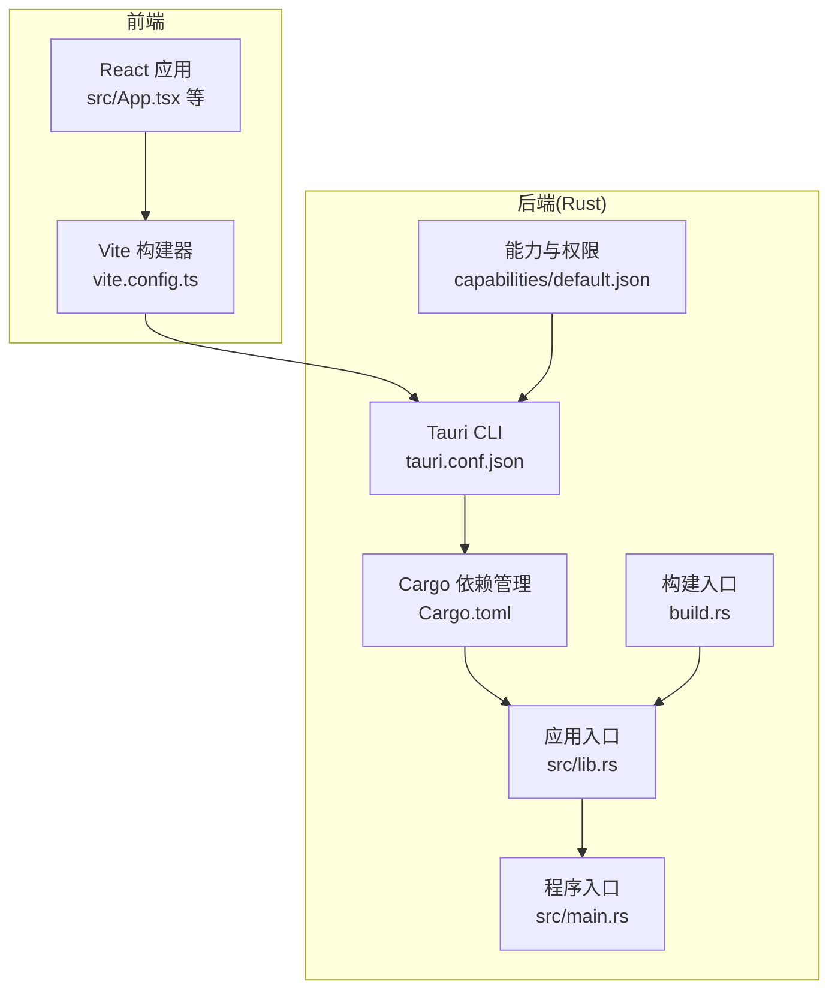
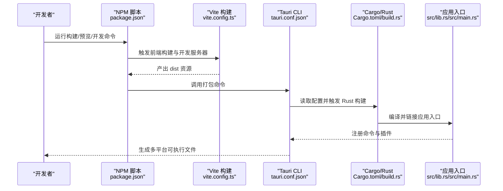
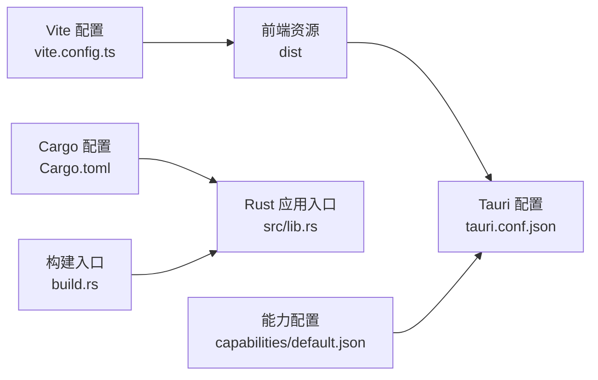

# 部署和打包

<cite>
**本文引用的文件**
- [package.json](file://package.json)
- [vite.config.ts](file://vite.config.ts)
- [src-tauri/tauri.conf.json](file://src-tauri/tauri.conf.json)
- [src-tauri/Cargo.toml](file://src-tauri/Cargo.toml)
- [src-tauri/build.rs](file://src-tauri/build.rs)
- [src-tauri/src/lib.rs](file://src-tauri/src/lib.rs)
- [src-tauri/src/main.rs](file://src-tauri/src/main.rs)
- [src-tauri/capabilities/default.json](file://src-tauri/capabilities/default.json)
- [README.md](file://README.md)
</cite>

## 目录
1. [简介](#简介)
2. [项目结构](#项目结构)
3. [核心组件](#核心组件)
4. [架构总览](#架构总览)
5. [详细组件分析](#详细组件分析)
6. [依赖关系分析](#依赖关系分析)
7. [性能考虑](#性能考虑)
8. [故障排除指南](#故障排除指南)
9. [结论](#结论)
10. [附录](#附录)

## 简介
本文件面向运维与开发团队，系统化梳理 LocalBro 在多平台（Windows、macOS、Linux）的部署与打包流程，覆盖前端构建、后端 Rust 侧集成、Tauri 打包配置、资源与依赖管理、最终可执行文件生成、签名与安全策略、分发与发布、以及持续集成与自动化部署建议。文档同时提供部署后的监控与维护建议，并附带运维检查清单与故障排除指引。

## 项目结构
LocalBro 采用 Tauri + React + TypeScript 技术栈，前端通过 Vite 构建，后端 Rust 通过 Tauri CLI 驱动打包。关键配置集中在根目录的 package.json、vite.config.ts，以及 src-tauri 目录下的 tauri.conf.json、Cargo.toml、build.rs、src/lib.rs、src/main.rs 与 capabilities/default.json。

**图表来源**
- [vite.config.ts:1-33](file://vite.config.ts#L1-L33)
- [src-tauri/tauri.conf.json:1-43](file://src-tauri/tauri.conf.json#L1-L43)
- [src-tauri/Cargo.toml:1-36](file://src-tauri/Cargo.toml#L1-L36)
- [src-tauri/build.rs:1-4](file://src-tauri/build.rs#L1-L4)
- [src-tauri/src/lib.rs:1-53](file://src-tauri/src/lib.rs#L1-L53)
- [src-tauri/src/main.rs:1-7](file://src-tauri/src/main.rs#L1-L7)
- [src-tauri/capabilities/default.json:1-11](file://src-tauri/capabilities/default.json#L1-L11)

**章节来源**
- [package.json:1-28](file://package.json#L1-L28)
- [vite.config.ts:1-33](file://vite.config.ts#L1-L33)
- [src-tauri/tauri.conf.json:1-43](file://src-tauri/tauri.conf.json#L1-L43)
- [src-tauri/Cargo.toml:1-36](file://src-tauri/Cargo.toml#L1-L36)
- [src-tauri/build.rs:1-4](file://src-tauri/build.rs#L1-L4)
- [src-tauri/src/lib.rs:1-53](file://src-tauri/src/lib.rs#L1-L53)
- [src-tauri/src/main.rs:1-7](file://src-tauri/src/main.rs#L1-L7)
- [src-tauri/capabilities/default.json:1-11](file://src-tauri/capabilities/default.json#L1-L11)
- [README.md:1-8](file://README.md#L1-L8)

## 核心组件
- 前端构建与开发服务器：Vite 配置在 vite.config.ts，使用固定端口 1420 并启用 HMR；开发命令由 package.json 中的脚本驱动。
- 后端打包与运行：Tauri 配置在 tauri.conf.json，定义窗口、安全策略、资源与图标、构建前后钩子；Rust 侧通过 Cargo 管理依赖与目标；build.rs 调用 tauri_build::build() 完成构建集成。
- 应用入口与插件：src/lib.rs 注册插件与命令处理器；src/main.rs 设置 Windows 子系统并在发布时隐藏控制台。
- 权限与能力：capabilities/default.json 定义默认能力集，声明主窗口与权限集合。

**章节来源**
- [package.json:6-11](file://package.json#L6-L11)
- [vite.config.ts:8-32](file://vite.config.ts#L8-L32)
- [src-tauri/tauri.conf.json:6-11](file://src-tauri/tauri.conf.json#L6-L11)
- [src-tauri/Cargo.toml:10-28](file://src-tauri/Cargo.toml#L10-L28)
- [src-tauri/build.rs:1-4](file://src-tauri/build.rs#L1-L4)
- [src-tauri/src/lib.rs:12-51](file://src-tauri/src/lib.rs#L12-L51)
- [src-tauri/src/main.rs:1-7](file://src-tauri/src/main.rs#L1-L7)
- [src-tauri/capabilities/default.json:1-11](file://src-tauri/capabilities/default.json#L1-L11)

## 架构总览
下图展示从开发到打包的关键流程：前端构建产物被注入 Tauri，Rust 侧通过 Tauri CLI 与能力配置进行打包，最终生成多平台可执行文件。

**图表来源**
- [package.json:6-11](file://package.json#L6-L11)
- [vite.config.ts:8-32](file://vite.config.ts#L8-L32)
- [src-tauri/tauri.conf.json:6-11](file://src-tauri/tauri.conf.json#L6-L11)
- [src-tauri/Cargo.toml:14-28](file://src-tauri/Cargo.toml#L14-L28)
- [src-tauri/build.rs:1-4](file://src-tauri/build.rs#L1-L4)
- [src-tauri/src/lib.rs:12-51](file://src-tauri/src/lib.rs#L12-L51)
- [src-tauri/src/main.rs:4-6](file://src-tauri/src/main.rs#L4-L6)

## 详细组件分析

### 前端构建与开发服务器
- 固定端口与 HMR：Vite 在开发模式下监听固定端口 1420，严格端口占用；支持热更新，且可按环境变量配置远程主机。
- 忽略监听路径：避免监听 src-tauri 目录，减少不必要的文件变更扫描。
- 与 Tauri 集成：devUrl 指向 http://localhost:1420，确保 Tauri 开发时加载前端开发服务器。

**章节来源**
- [vite.config.ts:8-32](file://vite.config.ts#L8-L32)
- [src-tauri/tauri.conf.json:7-9](file://src-tauri/tauri.conf.json#L7-L9)

### Tauri 打包配置与资源管理
- 构建钩子：beforeDevCommand 与 beforeBuildCommand 分别指向前端开发与构建脚本；frontendDist 指向 dist。
- 窗口与尺寸：定义主窗口标题、最小宽高、拖拽等行为。
- 安全策略：启用 asset 协议并允许全部作用域，便于本地资源访问。
- 打包目标：targets 设为 all，自动为所有可用平台生成安装包；icon 列表包含各平台所需图标尺寸与格式。

**章节来源**
- [src-tauri/tauri.conf.json:6-11](file://src-tauri/tauri.conf.json#L6-L11)
- [src-tauri/tauri.conf.json:13-22](file://src-tauri/tauri.conf.json#L13-L22)
- [src-tauri/tauri.conf.json:23-29](file://src-tauri/tauri.conf.json#L23-L29)
- [src-tauri/tauri.conf.json:31-41](file://src-tauri/tauri.conf.json#L31-L41)

### Rust 侧依赖与构建
- 依赖项：tauri、tauri-plugin-opener、serde、trash、dirs、chrono、parking_lot、walkdir 等。
- 构建特性：lib crate 类型包含 staticlib、cdylib、rlib，便于跨语言调用与打包。
- 平台特定依赖：当前未添加 macOS/Windows 特定依赖，可在相应条件块中扩展。
- 构建入口：build.rs 调用 tauri_build::build() 完成 Tauri 构建集成。

**章节来源**
- [src-tauri/Cargo.toml:10-28](file://src-tauri/Cargo.toml#L10-L28)
- [src-tauri/Cargo.toml:29-34](file://src-tauri/Cargo.toml#L29-L34)
- [src-tauri/build.rs:1-4](file://src-tauri/build.rs#L1-L4)

### 应用入口与命令注册
- 入口函数：lib.rs 中 run() 初始化 SizeIndex 与 CollectionStore，并注册插件与命令处理函数。
- 主入口：main.rs 设置 Windows 发布时隐藏控制台，调用 lib.rs::run()。
- 插件：引入 tauri-plugin-opener，用于系统默认应用打开文件或目录。

**章节来源**
- [src-tauri/src/lib.rs:12-51](file://src-tauri/src/lib.rs#L12-L51)
- [src-tauri/src/main.rs:1-7](file://src-tauri/src/main.rs#L1-L7)

### 权限与能力配置
- 能力标识：default.json 定义主窗口与权限集合，包含 core:default 与 opener:default。
- 使用场景：用于限制前端通过 Tauri API 可访问的能力范围，提升安全性。

**章节来源**
- [src-tauri/capabilities/default.json:1-11](file://src-tauri/capabilities/default.json#L1-L11)

### 多平台构建与优化策略
- Windows
  - 控制台隐藏：发布时通过 windows_subsystem = "windows" 隐藏控制台窗口。
  - 图标与安装包：tauri.conf.json 的 icon 列表包含 .ico，打包时自动生成安装包。
- macOS
  - 图标与安装包：icon 列表包含 .icns，打包时生成 DMG 或 PKG。
  - 权限与沙箱：如需 App Store 分发，建议在 tauri.conf.json 中完善权限声明与签名配置。
- Linux
  - 安装包：targets=all 将生成 DEB、RPM、AppImage 等格式，具体取决于打包工具链。
  - 依赖：确保系统具备对应打包工具（如 dpkg、rpm、appimage-runtime）。

**章节来源**
- [src-tauri/src/main.rs:1-2](file://src-tauri/src/main.rs#L1-L2)
- [src-tauri/tauri.conf.json:34-40](file://src-tauri/tauri.conf.json#L34-L40)

### 应用签名与安全配置
- 代码签名
  - Windows：使用 SignTool 对可执行文件与安装包签名，建议在 CI 中配置证书与密钥。
  - macOS：使用 Apple Developer 证书对应用签名并公证，确保 Gatekeeper 放行。
  - Linux：通常不强制签名，但可使用 GPG 对发布包进行签名以增强完整性校验。
- 权限配置
  - 通过 capabilities/default.json 明确授权范围，避免授予不必要的系统权限。
  - 在 tauri.conf.json 的 security.csp 字段可进一步强化内容安全策略（当前为 null，表示使用资产协议）。
- 安全策略
  - 仅暴露必要命令与 API，避免开放任意系统调用。
  - 使用 asset 协议并限定作用域，防止越权访问。

**章节来源**
- [src-tauri/capabilities/default.json:6-9](file://src-tauri/capabilities/default.json#L6-L9)
- [src-tauri/tauri.conf.json:23-29](file://src-tauri/tauri.conf.json#L23-L29)

### 分发策略与发布流程
- 应用商店发布（macOS）
  - 准备 Apple Developer 证书与 App ID，完成签名与公证。
  - 使用 Xcode 或 altool 上传至 Mac App Store Connect。
- 手动分发
  - Windows：提供 EXE/MSI 安装包，附带更新说明与校验信息。
  - macOS：提供 DMG/PKG，附带公证日志与完整性校验。
  - Linux：提供 DEB/RPM/AppImage，附带 GPG 签名与校验摘要。
- 自动化发布
  - 使用 GitHub Actions 或 GitLab CI，按平台矩阵构建并上传制品库。
  - 在 CI 中集成签名步骤，确保每次发布均包含有效签名。

[本节为通用实践说明，不直接分析具体文件，故无“章节来源”]

### 持续集成与自动化部署
- 构建矩阵
  - Windows/macOS/Linux 三平台并行构建，分别执行 npm run build 与 tauri build。
- 签名与公证
  - Windows：使用 SignTool，证书与密钥通过 CI 密钥管理服务注入。
  - macOS：使用 codesign 与 notarytool，Apple ID 与 API Key 通过 CI 密钥管理服务注入。
- 制品归档
  - 将各平台安装包与校验文件上传至制品库或发布页面。
- 自动发布
  - 成功构建后触发发布流程，更新版本标签与发布说明。

[本节为通用实践说明，不直接分析具体文件，故无“章节来源”]

## 依赖关系分析
- 前端到后端：Vite 构建输出 dist，由 Tauri 作为前端资源加载；开发时 devUrl 指向 Vite 开发服务器。
- 后端到打包：Tauri CLI 读取 tauri.conf.json，Cargo 读取 Cargo.toml，build.rs 触发 Tauri 构建集成。
- 权限到能力：capabilities/default.json 与 Tauri 安全策略共同决定前端可调用的系统能力。

**图表来源**
- [vite.config.ts:8-32](file://vite.config.ts#L8-L32)
- [src-tauri/tauri.conf.json:6-11](file://src-tauri/tauri.conf.json#L6-L11)
- [src-tauri/Cargo.toml:10-28](file://src-tauri/Cargo.toml#L10-L28)
- [src-tauri/build.rs:1-4](file://src-tauri/build.rs#L1-L4)
- [src-tauri/capabilities/default.json:1-11](file://src-tauri/capabilities/default.json#L1-L11)

**章节来源**
- [vite.config.ts:8-32](file://vite.config.ts#L8-L32)
- [src-tauri/tauri.conf.json:6-11](file://src-tauri/tauri.conf.json#L6-L11)
- [src-tauri/Cargo.toml:10-28](file://src-tauri/Cargo.toml#L10-L28)
- [src-tauri/build.rs:1-4](file://src-tauri/build.rs#L1-L4)
- [src-tauri/capabilities/default.json:1-11](file://src-tauri/capabilities/default.json#L1-L11)

## 性能考虑
- 前端构建
  - 使用 Vite 的 HMR 与严格端口策略，减少开发时切换成本。
  - 避免监听 src-tauri，降低文件系统扫描开销。
- 后端打包
  - Cargo.toml 中的依赖精简与按需启用特性，有助于缩短编译时间。
  - 构建类型包含 cdylib/rlib，便于动态加载与模块化组织。
- 安全与资源
  - 仅在需要时开启 CSP，避免过度限制影响前端资源加载。
  - 资源路径与作用域明确，减少运行时解析成本。

[本节为通用指导，不直接分析具体文件，故无“章节来源”]

## 故障排除指南
- 开发服务器无法启动
  - 端口冲突：确认 1420 未被占用；若使用远程主机，检查 HMR 配置与网络可达性。
  - 依赖缺失：执行 npm ci 或 npm install，确保 node_modules 完整。
- 打包失败
  - 前端构建产物缺失：确认 npm run build 已成功生成 dist。
  - Tauri CLI 未找到：确保已安装 @tauri-apps/cli，并在 PATH 中可用。
  - Rust 工具链问题：检查 rustc 与 cargo 版本，确保与 Cargo.toml 兼容。
- Windows 控制台闪现
  - 发布时未隐藏控制台：确认 src-tauri/src/main.rs 中 windows_subsystem 设置为 "windows"。
- macOS 安装包无法打开
  - 未签名或未公证：检查签名证书与 notarization 流程。
- Linux 安装包不可执行
  - 缺少打包工具：安装 dpkg、rpm 或 appimage-runtime。
- 权限不足导致功能异常
  - 检查 capabilities/default.json 与 Tauri 安全策略，确保授予必要权限。

**章节来源**
- [vite.config.ts:16-26](file://vite.config.ts#L16-L26)
- [src-tauri/src/main.rs:1-2](file://src-tauri/src/main.rs#L1-L2)
- [src-tauri/tauri.conf.json:31-41](file://src-tauri/tauri.conf.json#L31-L41)

## 结论
LocalBro 的部署与打包以 Tauri 为核心，结合 Vite 前端构建与 Cargo/Rust 后端，形成跨平台可执行文件的完整流水线。通过明确的配置文件与能力边界，可实现安全可控的分发与发布。建议在 CI 中集成签名与公证流程，确保各平台发布质量与合规性。

[本节为总结性内容，不直接分析具体文件，故无“章节来源”]

## 附录

### 部署检查清单
- 开发环境
  - Node.js 与 npm 版本满足要求
  - Rust 工具链与目标平台工具链已安装
  - 本地开发服务器可正常启动（端口 1420）
- 构建与打包
  - 前端构建成功，dist 目录存在
  - Tauri CLI 可用，targets=all 生效
  - Cargo 依赖完整，编译无错误
- 安全与签名
  - Windows：SignTool 证书可用，安装包已签名
  - macOS：Apple 证书与公证可用，应用已签名
  - Linux：安装包可执行，必要工具已安装
- 分发准备
  - 各平台安装包已生成并校验
  - 发布说明与校验文件已准备
  - CI 已配置自动发布流程

[本节为通用清单，不直接分析具体文件，故无“章节来源”]