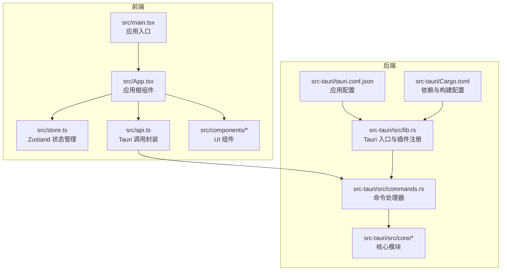
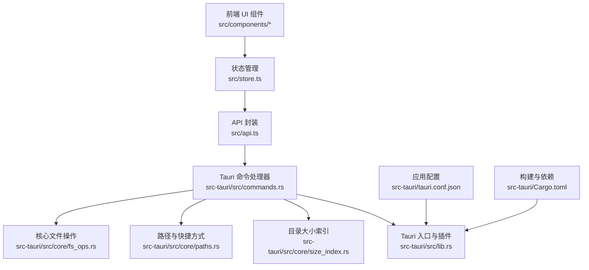
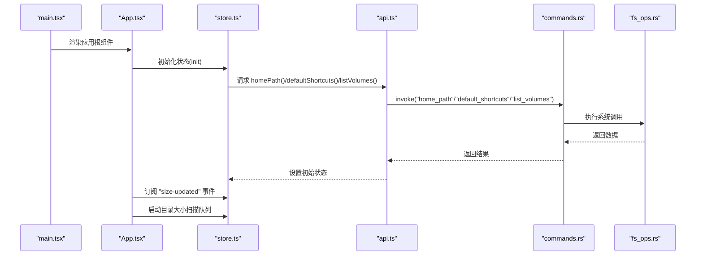
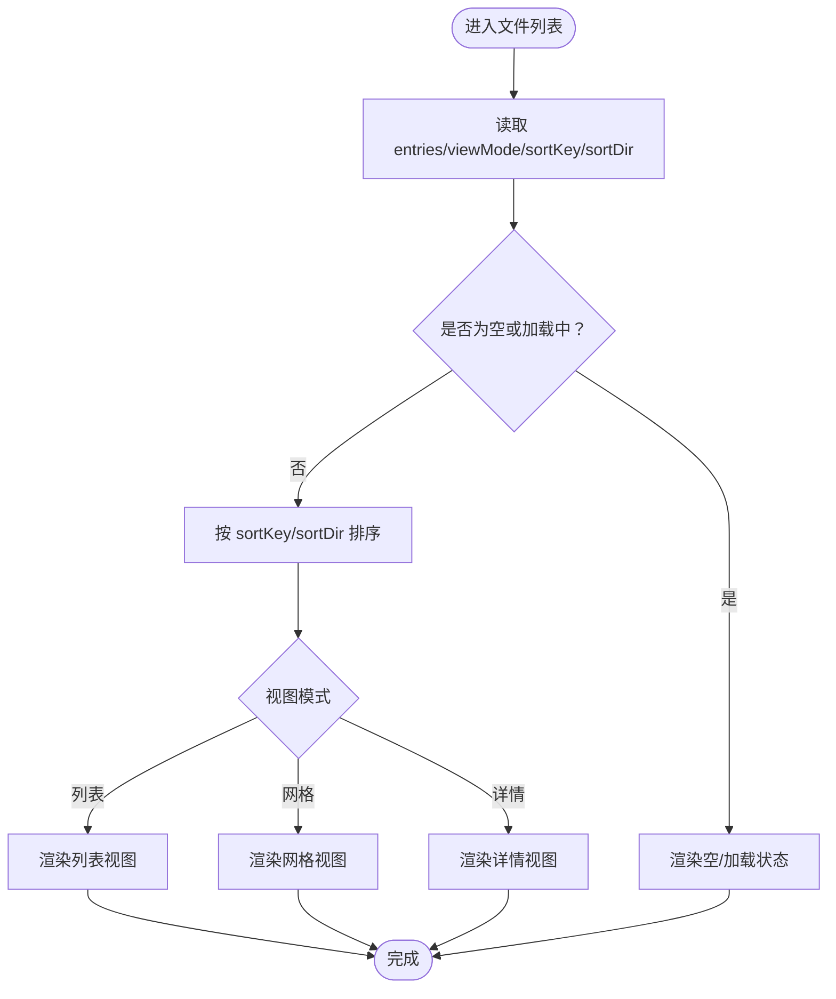
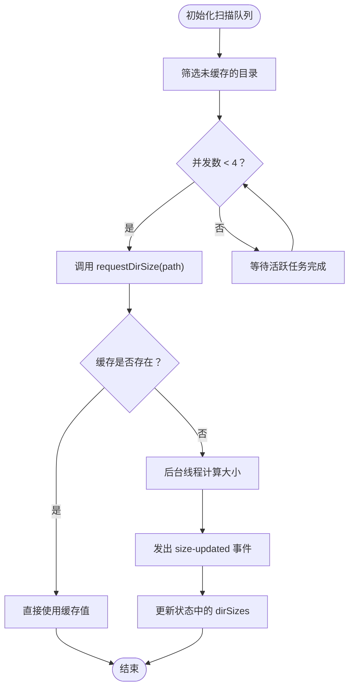
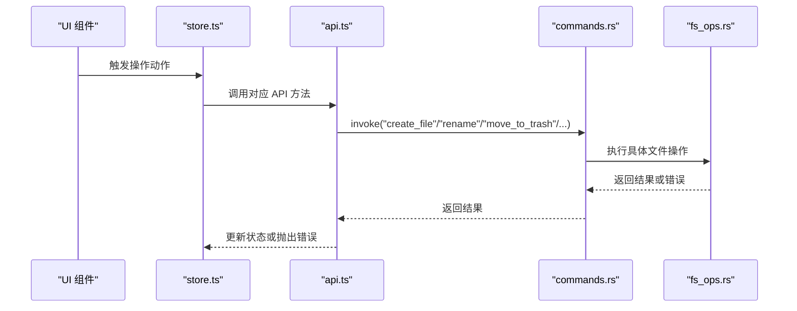
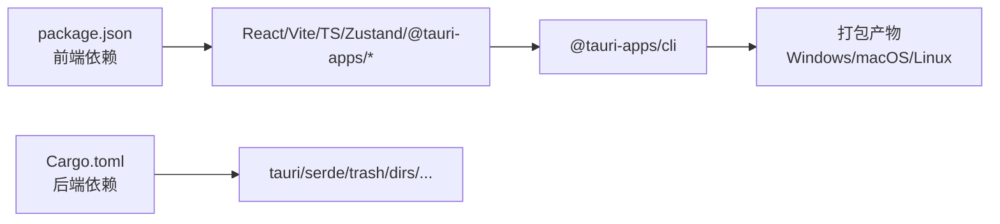

# 项目概述

<cite>
**本文档引用的文件**
- [README.md](file://README.md)
- [package.json](file://package.json)
- [src-tauri/Cargo.toml](file://src-tauri/Cargo.toml)
- [src-tauri/tauri.conf.json](file://src-tauri/tauri.conf.json)
- [src/main.tsx](file://src/main.tsx)
- [src/App.tsx](file://src/App.tsx)
- [src/api.ts](file://src/api.ts)
- [src/store.ts](file://src/store.ts)
- [src/types.ts](file://src/types.ts)
- [src-tauri/src/lib.rs](file://src-tauri/src/lib.rs)
- [src-tauri/src/commands.rs](file://src-tauri/src/commands.rs)
- [src-tauri/src/core/fs_ops.rs](file://src-tauri/src/core/fs_ops.rs)
- [src/components/FileList.tsx](file://src/components/FileList.tsx)
- [src/components/Sidebar.tsx](file://src/components/Sidebar.tsx)
</cite>

## 目录
1. [简介](#简介)
2. [项目结构](#项目结构)
3. [核心组件](#核心组件)
4. [架构总览](#架构总览)
5. [详细组件分析](#详细组件分析)
6. [依赖关系分析](#依赖关系分析)
7. [性能考虑](#性能考虑)
8. [故障排除指南](#故障排除指南)
9. [结论](#结论)

## 简介
LocalBro 是一款基于 Tauri + React + TypeScript 构建的跨平台桌面文件管理器，支持 Windows、macOS 和 Linux 系统。项目目标是提供一个高性能、可定制且安全的本地文件浏览与管理工具，具备文件浏览、文件操作、目录管理、智能缓存与预览等功能。

技术选型理由与优势：
- Tauri 框架：以 Web 技术构建原生应用，结合 Rust 后端实现系统级安全与低资源占用，同时保持跨平台一致性。
- React + TypeScript：提供清晰的组件化 UI 与类型安全，便于维护与扩展。
- 前端状态管理：使用 Zustand 简化状态逻辑，降低样板代码复杂度。
- 插件生态：通过 @tauri-apps/plugin-opener 实现系统默认程序打开文件的能力。

适用人群：
- 初学者：可快速上手开发与调试，借助 Tauri CLI 与 Vite 开发服务器体验流畅的热更新。
- 有经验的开发者：可利用 Rust 核心模块进行性能优化与安全加固，同时通过命令系统扩展更多文件操作能力。

## 项目结构
项目采用前后端分离的组织方式：
- 前端（React + TypeScript）位于 src/ 目录，包含组件、样式、状态管理与类型定义。
- 后端（Tauri + Rust）位于 src-tauri/ 目录，包含命令处理、核心文件操作与跨平台适配。

图表来源
- [src/main.tsx:1-12](file://src/main.tsx#L1-L12)
- [src/App.tsx:100-140](file://src/App.tsx#L100-L140)
- [src/store.ts:53-194](file://src/store.ts#L53-L194)
- [src/api.ts:1-137](file://src/api.ts#L1-L137)
- [src-tauri/src/lib.rs:8-37](file://src-tauri/src/lib.rs#L8-L37)
- [src-tauri/src/commands.rs:12-126](file://src-tauri/src/commands.rs#L12-L126)
- [src-tauri/src/core/fs_ops.rs:140-360](file://src-tauri/src/core/fs_ops.rs#L140-L360)
- [src-tauri/tauri.conf.json:1-43](file://src-tauri/tauri.conf.json#L1-L43)
- [src-tauri/Cargo.toml:1-36](file://src-tauri/Cargo.toml#L1-L36)

章节来源
- [README.md:1-8](file://README.md#L1-L8)
- [package.json:1-28](file://package.json#L1-L28)
- [src-tauri/Cargo.toml:1-36](file://src-tauri/Cargo.toml#L1-L36)
- [src-tauri/tauri.conf.json:1-43](file://src-tauri/tauri.conf.json#L1-L43)

## 核心组件
- 应用入口与渲染：前端入口负责挂载 React 应用并引入全局样式；应用根组件负责初始化、事件监听与组件布局。
- 状态管理：使用 Zustand 管理当前工作目录、条目列表、历史记录、选择集、排序与视图模式等状态，并提供导航、刷新、前进后退、选择与预览控制等动作。
- API 封装：统一通过 @tauri-apps/api 的 invoke 调用后端命令，返回标准化的数据模型，同时提供目录大小查询与文本文件读取等高级功能。
- 核心文件操作：Rust 层实现目录列举、文件统计、重命名、移动到回收站、永久删除、复制/移动、在原生文件管理器中定位以及文本文件读取等。
- UI 组件：侧边栏展示快捷方式与卷标，文件列表支持多种视图（列表/网格/详情），并提供排序、选择与双击进入/预览行为。

章节来源
- [src/main.tsx:1-12](file://src/main.tsx#L1-L12)
- [src/App.tsx:100-140](file://src/App.tsx#L100-L140)
- [src/store.ts:53-194](file://src/store.ts#L53-L194)
- [src/api.ts:1-137](file://src/api.ts#L1-L137)
- [src-tauri/src/lib.rs:8-37](file://src-tauri/src/lib.rs#L8-L37)
- [src-tauri/src/commands.rs:12-126](file://src-tauri/src/commands.rs#L12-L126)
- [src-tauri/src/core/fs_ops.rs:140-360](file://src-tauri/src/core/fs_ops.rs#L140-L360)
- [src/components/FileList.tsx:42-173](file://src/components/FileList.tsx#L42-L173)
- [src/components/Sidebar.tsx:3-75](file://src/components/Sidebar.tsx#L3-L75)

## 架构总览
LocalBro 采用“前端 Web 视图 + 后端 Tauri/Rust 命令”的分层架构。前端通过 API 封装调用后端命令，后端命令再委托到核心模块执行具体文件系统操作。应用配置与打包由 Tauri 配置文件与 Cargo 管理。

图表来源
- [src/components/FileList.tsx:42-173](file://src/components/FileList.tsx#L42-L173)
- [src/components/Sidebar.tsx:3-75](file://src/components/Sidebar.tsx#L3-L75)
- [src/store.ts:53-194](file://src/store.ts#L53-L194)
- [src/api.ts:1-137](file://src/api.ts#L1-L137)
- [src-tauri/src/commands.rs:12-126](file://src-tauri/src/commands.rs#L12-L126)
- [src-tauri/src/core/fs_ops.rs:140-360](file://src-tauri/src/core/fs_ops.rs#L140-L360)
- [src-tauri/src/lib.rs:8-37](file://src-tauri/src/lib.rs#L8-L37)
- [src-tauri/tauri.conf.json:1-43](file://src-tauri/tauri.conf.json#L1-L43)
- [src-tauri/Cargo.toml:1-36](file://src-tauri/Cargo.toml#L1-L36)

## 详细组件分析

### 应用启动与初始化流程
应用启动时，前端入口负责渲染根组件；根组件初始化状态、订阅后端事件并启动目录大小扫描队列与快捷键预览逻辑。

图表来源
- [src/main.tsx:1-12](file://src/main.tsx#L1-L12)
- [src/App.tsx:100-140](file://src/App.tsx#L100-L140)
- [src/store.ts:76-88](file://src/store.ts#L76-L88)
- [src/api.ts:59-69](file://src/api.ts#L59-L69)
- [src-tauri/src/commands.rs:28-40](file://src-tauri/src/commands.rs#L28-L40)
- [src-tauri/src/core/fs_ops.rs:172-187](file://src-tauri/src/core/fs_ops.rs#L172-L187)

章节来源
- [src/main.tsx:1-12](file://src/main.tsx#L1-L12)
- [src/App.tsx:100-140](file://src/App.tsx#L100-L140)
- [src/store.ts:76-88](file://src/store.ts#L76-L88)
- [src/api.ts:59-69](file://src/api.ts#L59-L69)
- [src-tauri/src/commands.rs:28-40](file://src-tauri/src/commands.rs#L28-L40)
- [src-tauri/src/core/fs_ops.rs:172-187](file://src-tauri/src/core/fs_ops.rs#L172-L187)

### 文件列表与视图切换
文件列表组件根据当前视图模式渲染不同布局，并提供排序、选择与双击行为。目录大小通过状态中的 dirSizes 缓存显示。

图表来源
- [src/components/FileList.tsx:42-173](file://src/components/FileList.tsx#L42-L173)
- [src/store.ts:196-225](file://src/store.ts#L196-L225)

章节来源
- [src/components/FileList.tsx:42-173](file://src/components/FileList.tsx#L42-L173)
- [src/store.ts:196-225](file://src/store.ts#L196-L225)

### 目录大小缓存与并发扫描
应用通过并发队列对目录发起大小扫描请求，优先使用缓存值；若未缓存则异步计算并通过事件更新状态。

图表来源
- [src/App.tsx:22-63](file://src/App.tsx#L22-L63)
- [src/api.ts:111-121](file://src/api.ts#L111-L121)
- [src-tauri/src/commands.rs:101-125](file://src-tauri/src/commands.rs#L101-L125)

章节来源
- [src/App.tsx:22-63](file://src/App.tsx#L22-L63)
- [src/api.ts:111-121](file://src/api.ts#L111-L121)
- [src-tauri/src/commands.rs:101-125](file://src-tauri/src/commands.rs#L101-L125)

### 文件操作与系统集成
文件操作通过命令处理器转发至核心模块，支持创建、重命名、移动到回收站、永久删除、复制/移动、在原生文件管理器中定位等。文本文件读取支持截断标记与总字节数返回。

图表来源
- [src/store.ts:30-51](file://src/store.ts#L30-L51)
- [src/api.ts:71-101](file://src/api.ts#L71-L101)
- [src-tauri/src/commands.rs:42-80](file://src-tauri/src/commands.rs#L42-L80)
- [src-tauri/src/core/fs_ops.rs:189-360](file://src-tauri/src/core/fs_ops.rs#L189-L360)

章节来源
- [src/store.ts:30-51](file://src/store.ts#L30-L51)
- [src/api.ts:71-101](file://src/api.ts#L71-L101)
- [src-tauri/src/commands.rs:42-80](file://src-tauri/src/commands.rs#L42-L80)
- [src-tauri/src/core/fs_ops.rs:189-360](file://src-tauri/src/core/fs_ops.rs#L189-L360)

## 依赖关系分析
- 前端依赖：React、React DOM、@tauri-apps/api、@tauri-apps/plugin-opener、zustand、TypeScript、Vite。
- 后端依赖：tauri、tauri-plugin-opener、serde、serde_json、thiserror、trash、dirs、chrono、parking_lot、walkdir。
- 构建与打包：Vite 用于前端开发与构建，Tauri CLI 用于应用打包与跨平台分发。

图表来源
- [package.json:12-26](file://package.json#L12-L26)
- [src-tauri/Cargo.toml:17-28](file://src-tauri/Cargo.toml#L17-L28)
- [src-tauri/tauri.conf.json:6-11](file://src-tauri/tauri.conf.json#L6-L11)

章节来源
- [package.json:12-26](file://package.json#L12-L26)
- [src-tauri/Cargo.toml:17-28](file://src-tauri/Cargo.toml#L17-L28)
- [src-tauri/tauri.conf.json:6-11](file://src-tauri/tauri.conf.json#L6-L11)

## 性能考虑
- 并发扫描：目录大小扫描采用并发队列限制（默认 4），避免阻塞 UI 并提升整体吞吐。
- 缓存策略：目录大小结果缓存在前端状态中，减少重复计算；同时通过命令层的 SizeIndex 提供持久化与共享缓存能力。
- 懒加载与分页：列表渲染按需排序与格式化，避免一次性处理大量数据。
- I/O 优化：文件读取限制最大字节数，防止大文件导致内存压力；复制/移动操作在跨设备场景下自动回退为拷贝+删除。
- UI 响应：使用 React.memo 与 useMemo 优化渲染开销，避免不必要的重绘。

## 故障排除指南
常见问题与排查建议：
- 无法列出目录内容：检查路径有效性与权限，确认后端命令返回的错误信息；前端状态中会捕获并显示错误字符串。
- 预览失败：确认目标文件可读且未被占用；检查文本文件读取的截断标记与总字节数。
- 回收站操作异常：确保系统支持回收站功能；Windows 使用回收站，macOS/Linux 可能需要替代方案。
- 打包后窗口尺寸或拖拽失效：检查 tauri.conf.json 中窗口配置与安全策略设置。

章节来源
- [src/store.ts:110-112](file://src/store.ts#L110-L112)
- [src-tauri/src/core/fs_ops.rs:294-318](file://src-tauri/src/core/fs_ops.rs#L294-L318)
- [src-tauri/tauri.conf.json:13-29](file://src-tauri/tauri.conf.json#L13-L29)

## 结论
LocalBro 通过 Tauri + React + TypeScript 的组合，实现了高性能、跨平台且安全的桌面文件管理器。其清晰的前后端分层、完善的文件操作能力与智能缓存机制，使其既适合初学者快速上手，也为有经验的开发者提供了扩展与优化的空间。未来可在预览适配器、集合管理、元数据索引等方面进一步增强功能与性能。