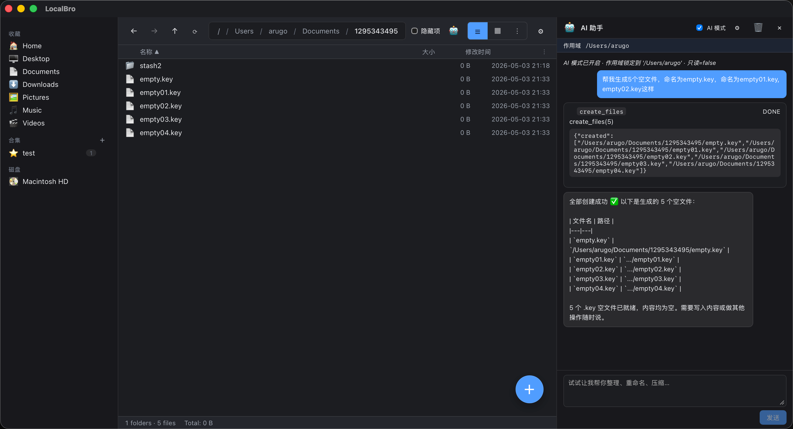

<div align="center">

# 🗂️ LocalBro

**本地优先的智能文件浏览器 · AI 协作 · 零隐私风险**

[](https://github.com/your-org/localbro/releases)
[](LICENSE)
[](https://tauri.app)
[](https://tauri.app)
[](CONTRIBUTING.md)

[English](#english) · **中文**

</div>

---

## ✨ AI版本的文件管理器

传统文件管理器做一件事：**让你点来点去**。LocalBro 做的是：**让你说一句话，AI 帮你搞定剩下的事**。

> "把桌面上所有截图按日期重命名，压缩成 ZIP，归档到 Screenshots 文件夹"
>
> — 这在 LocalBro 里，只需要打这一行字。

---

## 🆚 与传统文件管理器的核心差异

| 能力 | Finder / 文件资源管理器 | LocalBro |
|------|------------------------|----------|
| 批量重命名 | 手动一个个改，或依赖第三方工具 | AI 理解你的意图，一句话执行 |
| 文件整理 | 拖拽 + 新建文件夹，繁琐易出错 | AI 按规则自动分类、移动 |
| 批量创建文件 | 无（需命令行） | `create_files` 工具，50 个空文件一句话搞定 |
| 压缩/解压 | 右键菜单，格式有限 | 内置 ZIP/tar 支持，AI 可直接调用 |
| 文件收藏 | 无跨文件夹标记能力 | Collection 系统，动态分组，AI 可批量打标 |
| 安全防护 | 删除只有回收站 | **4 层护栏**：AI 模式下全局防删 + 作用域锁 + 操作审批 + 审计流 |
| 隐私 | 本地 | **完全本地**，AI 调用自己配的 Key，零数据上传 |
| 可扩展 | 不可能 | Pack 插件体系，贡献 AI 工具 / 预览渲染器 / 皮肤 |
| 主题 | 系统浅/深色 | 完整皮肤系统，CSS 变量级自定义 |

---

## 🚀 核心功能一览

### 🤖 AI 协作工作台
- **自然语言操作**：重命名、移动、压缩、创建、收藏——说一句话
- **本地 Agent 循环**：LLM → 调用工具 → 审计展示 → 你点「应用」才生效
- **4 层安全护栏**
  1. **AI 模式开关**：开启时全局禁止删除/永久移除
  2. **Scope Lock**：Agent 只能操作你当前打开的目录及其子目录
  3. **Confirm Threshold**：影响文件数 ≥ 10（可配置）时暂停等待你确认
  4. **审计流**：每个工具调用以卡片形式呈现，pending → running → applied/rejected
- **多厂商支持**：OpenAI / DeepSeek / Anthropic / Qwen / Moonshot，自定义 URL + Key

### 📂 文件浏览器
- 列表 / 网格 / 详情三种视图，列宽可拖拽、可持久化
- 面包屑快速跳级，支持深层目录
- 排序持久化、隐藏文件切换
- 批量选择 + 键盘快速操作（Space 预览、Delete 回收站）

### 🔍 即时预览面板
- 单击预览，双击用系统默认程序打开
- 支持图片 / 文本 / PDF / Markdown / 视频 / 音频
- 右侧常驻，或 Space 弹出 Quick Look 模式
- 插件可注册自定义预览渲染器

### 📦 Collection 收藏夹
- 跨文件夹动态分组，不移动文件只打标
- AI 可批量添加到收藏夹（`add_to_collection`）
- 侧边栏快速访问

### 🎨 皮肤系统
- 内置亮色 / 暗色，CSS 变量体系
- 社区 Pack 可携带完整配色方案
- 实时预览，无需重启

### 🧩 插件 (Pack) 体系
- 贡献 AI 工具（`contributes.aiTools`）
- 贡献预览渲染器（`contributes.previewAdapters`）
- 贡献皮肤、快捷方式
- 本地目录热加载，开发体验极佳

---

## 📸 截图



> 示例：对话框里输入一句话，AI 调用 `create_files` 工具，5 个空文件瞬间出现在文件列表中。左侧为 Collection 收藏夹，右侧为 AI 对话面板（含工具调用审计卡片）。

---

## 🛠️ 快速开始

### 环境依赖

- [Rust](https://rustup.rs/) 1.75+
- [Node.js](https://nodejs.org/) 18+
- macOS 13+ / Windows 10+ / Linux (x11/Wayland)

### 本地运行

```bash
git clone https://github.com/your-org/localbro.git
cd localbro
npm install
npm run tauri dev
```

### 构建发行版

```bash
npm run tauri build
```

产物在 `src-tauri/target/release/bundle/`。

---

## ⚙️ 配置 AI

1. 打开右上角 ⚙ → AI…
2. 选择厂商预设（DeepSeek / OpenAI / Anthropic / 自定义）
3. 填写 Base URL 和 API Key
4. 保存后打开 AI 面板（右上角机器人图标），开启 AI 模式即可

> AI 模式默认**自动开启**，首次进入任意文件夹时自动锁定作用域。所有操作均在本地执行，Key 不离开你的设备。

---

## 🗂️ 项目结构

```
localbro/
├── src/                    # React + TypeScript 前端
│   ├── ai/                 # Agent 循环 / 工具注册 / 多厂商客户端
│   ├── components/         # UI 组件
│   ├── plugins/            # 插件运行时
│   ├── preview/            # 预览适配器体系
│   ├── skins/              # 皮肤管理
│   └── styles/             # CSS 变量 + 组件样式
├── src-tauri/              # Rust 后端
│   └── src/
│       ├── commands.rs     # Tauri 命令暴露层
│       └── core/           # 文件操作 / AI 只读防护 / 压缩解压
└── packs/                  # 内置 Pack 示例
```

---

## 🤝 贡献

欢迎任何形式的贡献！

- 🐛 [提交 Bug](https://github.com/your-org/localbro/issues/new?template=bug_report.md)
- 💡 [功能建议](https://github.com/your-org/localbro/issues/new?template=feature_request.md)
- 📦 [贡献 Pack 插件](docs/packs/PACKS.md)
- 🌐 贡献翻译（`src/i18n/locales/`）

---

## 📜 许可证

[MIT](LICENSE) © 2025 LocalBro Contributors

---

<div align="center">

如果 LocalBro 对你有帮助，请给一个 ⭐ Star，这是对开源最大的鼓励！

[](https://github.com/your-org/localbro/stargazers)

</div>

---

<a id="english"></a>

<div align="center">

# 🗂️ LocalBro (English)

**Local-First Intelligent File Browser · AI Collaboration · Zero Privacy Risk**

[](https://github.com/your-org/localbro/releases)
[](LICENSE)
[](https://tauri.app)
[](https://tauri.app)
[](CONTRIBUTING.md)

</div>

---

## ✨ AI file manager

Traditional file managers do one thing: **let you click around**. LocalBro does something different: **you describe what you want, and AI handles the rest**.

> "Rename all screenshots on the desktop by date, compress them into a ZIP, and archive to the Screenshots folder"
>
> — In LocalBro, that's just one line of natural language.

---

## 🆚 Core Differences vs. Traditional File Managers

| Feature | Finder / File Explorer | LocalBro |
|---------|----------------------|----------|
| Batch rename | Manual one-by-one, or third-party tools | AI understands intent, executes in one command |
| File organization | Drag & drop + create folders, tedious | AI auto-classifies and moves by rules |
| Batch file creation | None (requires terminal) | `create_files` tool — 50 empty files in one line |
| Compress/Extract | Right-click menu, limited formats | Built-in ZIP/tar, AI-callable |
| File collections | No cross-folder tagging | Collection system, dynamic grouping, AI batch-tagging |
| Safety | Only Recycle Bin for deletes | **4-layer guardrails**: global delete block + scope lock + approval gate + audit trail |
| Privacy | Local | **Fully local**, uses your own API Key, zero data upload |
| Extensibility | Not possible | Pack plugin system — contribute AI tools / preview renderers / skins |
| Themes | System light/dark only | Full skin system, CSS-variable-level customization |

---

## 📸 Screenshots


> Example: type one sentence in the chat, AI calls `create_files`, and 5 empty files appear instantly in the file list. Left: Collection sidebar. Right: AI panel with tool-call audit cards.

---

## 🚀 Feature Highlights

### 🤖 AI Collaboration Workspace
- **Natural language operations**: rename, move, compress, create, collect — just say it
- **Local Agent loop**: LLM → tool calls → audit card display → you click "Apply" to execute
- **4-layer safety guardrails**
  1. **AI Mode switch**: blocks all delete/permanent-remove when enabled
  2. **Scope Lock**: Agent only touches the current folder and its descendants
  3. **Confirm Threshold**: pauses for approval when ≥ 10 paths are affected (configurable)
  4. **Audit trail**: every tool call shown as a card — pending → running → applied/rejected
- **Multi-provider**: OpenAI / DeepSeek / Anthropic / Qwen / Moonshot, custom URL + Key

### 📂 File Browser
- List / Grid / Details views, resizable & persistent column widths
- Breadcrumb navigation, deep folder support
- Persistent sort, hidden file toggle
- Bulk select + keyboard shortcuts (Space to preview, Delete to trash)

### 🔍 Instant Preview Pane
- Single-click to preview, double-click to open with default app
- Supports images / text / PDF / Markdown / video / audio
- Right-side dock or Quick Look popup (Space key)
- Plugins can register custom renderers

### 📦 Collections
- Cross-folder dynamic grouping — no file moving, just tagging
- AI can batch-add files to collections (`add_to_collection`)
- Quick sidebar access

### 🎨 Skin System
- Built-in light/dark, CSS variable architecture
- Community Packs carry full color schemes
- Live preview, no restart needed

### 🧩 Pack Plugin System
- Contribute AI tools (`contributes.aiTools`)
- Contribute preview renderers
- Contribute skins and shortcuts
- Hot-reload from local directory for great DX

---

## 🛠️ Quick Start

### Prerequisites

- [Rust](https://rustup.rs/) 1.75+
- [Node.js](https://nodejs.org/) 18+
- macOS 13+ / Windows 10+ / Linux (x11/Wayland)

### Run Locally

```bash
git clone https://github.com/your-org/localbro.git
cd localbro
npm install
npm run tauri dev
```

### Build Release

```bash
npm run tauri build
```

Output in `src-tauri/target/release/bundle/`.

---

## ⚙️ Configure AI

1. Click ⚙ (top-right) → AI…
2. Choose a provider preset (DeepSeek / OpenAI / Anthropic / Custom)
3. Enter Base URL and API Key
4. Save, then open the AI panel (robot icon, top-right) and enable AI Mode

> AI Mode is **ON by default**. When entering any folder, the scope is automatically pinned to that directory. All operations run locally — your Key never leaves your device.

---

## 🤝 Contributing

All contributions welcome!

- 🐛 [File a bug](https://github.com/your-org/localbro/issues/new?template=bug_report.md)
- 💡 [Suggest a feature](https://github.com/your-org/localbro/issues/new?template=feature_request.md)
- 📦 [Write a Pack plugin](docs/packs/PACKS.md)
- 🌐 Add translations (`src/i18n/locales/`)

---

## 📜 License

[MIT](LICENSE) © 2025 LocalBro Contributors

---

<div align="center">

If LocalBro is useful to you, a ⭐ Star goes a long way!

[](https://github.com/your-org/localbro/stargazers)

</div>
